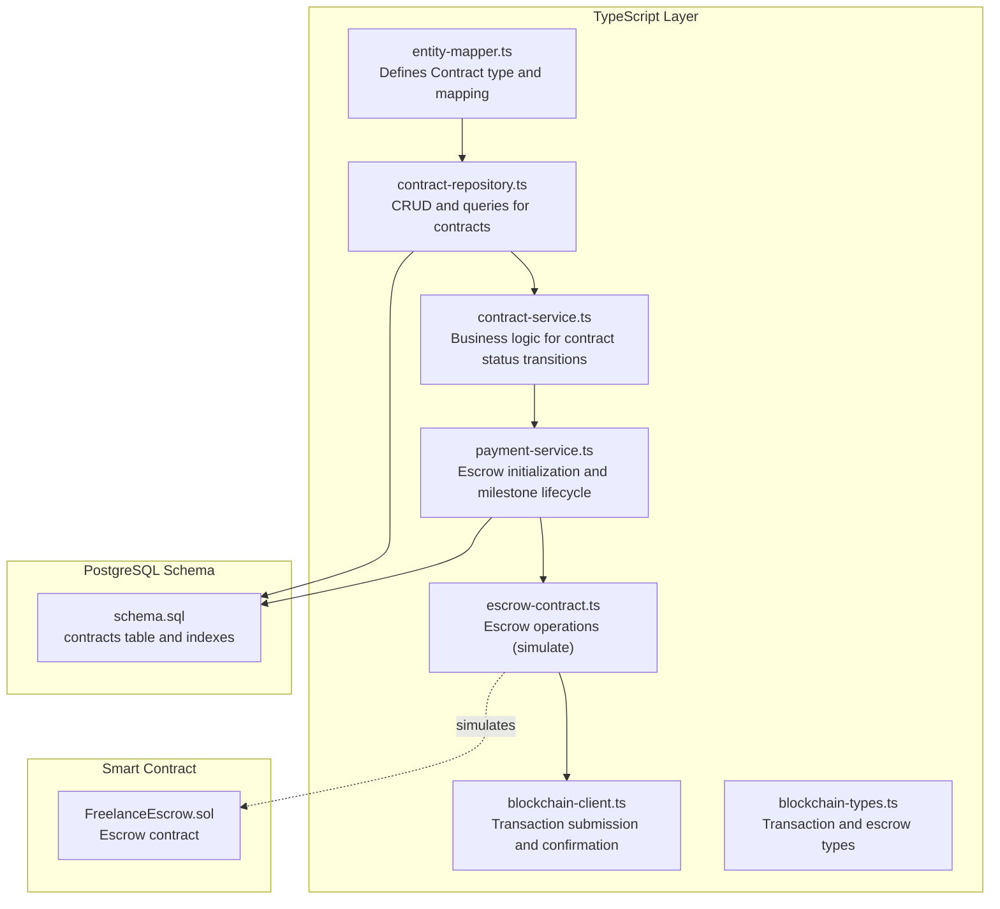
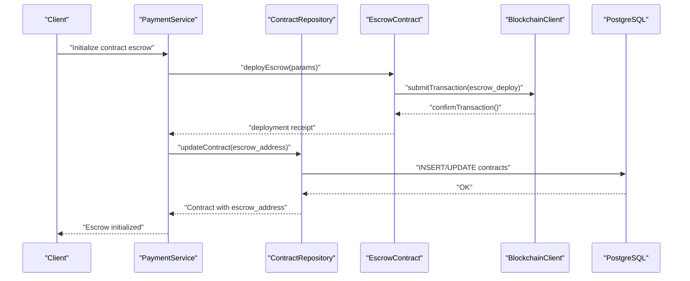
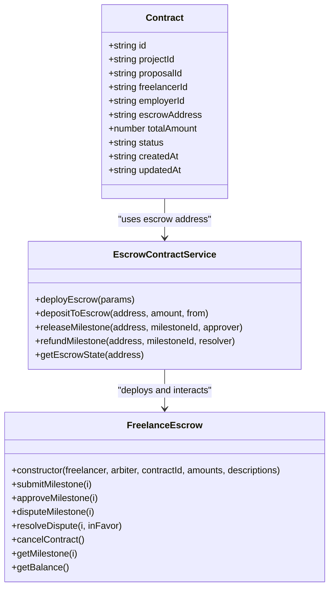
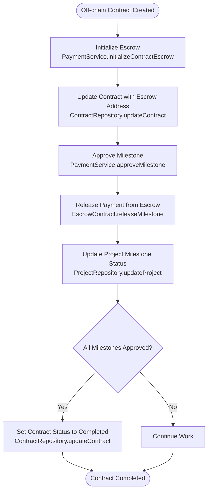
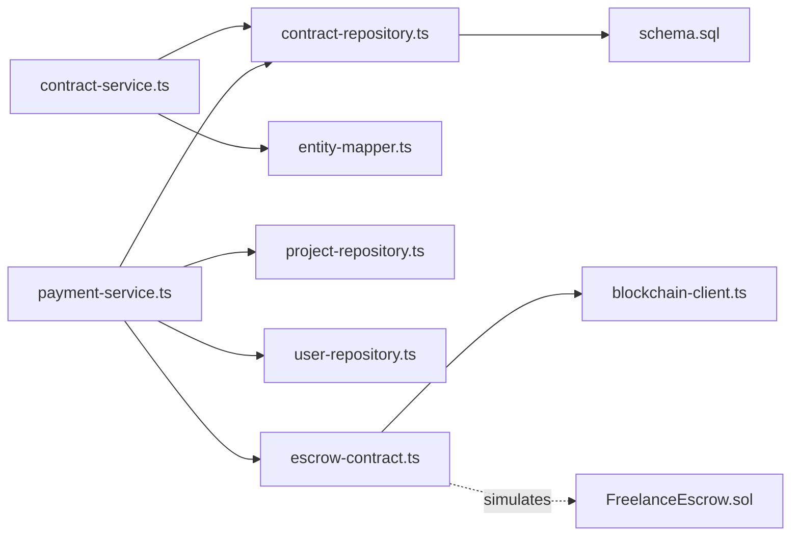

# Contract Model

<cite>
**Referenced Files in This Document**
- [contract.ts](file://src/models/contract.ts)
- [entity-mapper.ts](file://src/utils/entity-mapper.ts)
- [contract-repository.ts](file://src/repositories/contract-repository.ts)
- [schema.sql](file://supabase/schema.sql)
- [contract-service.ts](file://src/services/contract-service.ts)
- [payment-service.ts](file://src/services/payment-service.ts)
- [escrow-contract.ts](file://src/services/escrow-contract.ts)
- [blockchain-client.ts](file://src/services/blockchain-client.ts)
- [blockchain-types.ts](file://src/services/blockchain-types.ts)
- [FreelanceEscrow.sol](file://contracts/FreelanceEscrow.sol)
</cite>

## Table of Contents
1. [Introduction](#introduction)
2. [Project Structure](#project-structure)
3. [Core Components](#core-components)
4. [Architecture Overview](#architecture-overview)
5. [Detailed Component Analysis](#detailed-component-analysis)
6. [Dependency Analysis](#dependency-analysis)
7. [Performance Considerations](#performance-considerations)
8. [Troubleshooting Guide](#troubleshooting-guide)
9. [Conclusion](#conclusion)
10. [Appendices](#appendices)

## Introduction
This document provides comprehensive data model documentation for the Contract model in the FreelanceXchain platform. It defines the Contract entity’s fields, data types, and constraints in both TypeScript and PostgreSQL, explains how it represents formal agreements between parties with integrated escrow functionality, and describes its relationships to the Project and User models. It also covers indexes for efficient querying, the synchronization between on-chain and off-chain states via the ContractRepository, and validation rules that ensure proper fund allocation and party verification.

## Project Structure
The Contract model is implemented across TypeScript types and repositories, backed by a PostgreSQL schema. The off-chain state is synchronized with on-chain events through services and blockchain clients.

**Diagram sources**
- [entity-mapper.ts](file://src/utils/entity-mapper.ts#L281-L310)
- [contract-repository.ts](file://src/repositories/contract-repository.ts#L1-L139)
- [contract-service.ts](file://src/services/contract-service.ts#L1-L140)
- [payment-service.ts](file://src/services/payment-service.ts#L590-L642)
- [escrow-contract.ts](file://src/services/escrow-contract.ts#L1-L327)
- [blockchain-client.ts](file://src/services/blockchain-client.ts#L1-L293)
- [blockchain-types.ts](file://src/services/blockchain-types.ts#L1-L115)
- [schema.sql](file://supabase/schema.sql#L94-L106)
- [FreelanceEscrow.sol](file://contracts/FreelanceEscrow.sol#L1-L264)

**Section sources**
- [contract.ts](file://src/models/contract.ts#L1-L3)
- [entity-mapper.ts](file://src/utils/entity-mapper.ts#L281-L310)
- [contract-repository.ts](file://src/repositories/contract-repository.ts#L1-L139)
- [schema.sql](file://supabase/schema.sql#L94-L106)

## Core Components
- Contract type definition and mapping:
  - The Contract type is defined in the entity mapper and exported for backward compatibility.
  - Fields include identifiers, escrow address, total amount, and status, with createdAt/updatedAt timestamps.
- Contract repository:
  - Provides CRUD and query methods for contracts, including filtering by freelancer, employer, project, and status.
- PostgreSQL schema:
  - Defines the contracts table with foreign keys to users (freelancer and employer), projects, and proposals.
  - Includes constraints for status values and indexes for performance.

**Section sources**
- [entity-mapper.ts](file://src/utils/entity-mapper.ts#L281-L310)
- [contract-repository.ts](file://src/repositories/contract-repository.ts#L1-L139)
- [schema.sql](file://supabase/schema.sql#L94-L106)

## Architecture Overview
The Contract model coordinates off-chain state (PostgreSQL) with on-chain state (Escrow smart contract). Payment service orchestrates escrow deployment and milestone approvals, updating the Contract and Project entities accordingly. The ContractRepository persists and retrieves contract records, while blockchain clients simulate transaction submission and confirmation.

**Diagram sources**
- [payment-service.ts](file://src/services/payment-service.ts#L590-L642)
- [escrow-contract.ts](file://src/services/escrow-contract.ts#L38-L83)
- [blockchain-client.ts](file://src/services/blockchain-client.ts#L131-L207)
- [contract-repository.ts](file://src/repositories/contract-repository.ts#L24-L34)
- [schema.sql](file://supabase/schema.sql#L94-L106)

## Detailed Component Analysis

### Contract Data Model Definition
- TypeScript type:
  - id: string (UUID)
  - projectId: string (UUID)
  - proposalId: string (UUID)
  - freelancerId: string (UUID)
  - employerId: string (UUID)
  - escrowAddress: string
  - totalAmount: number (monetary value)
  - status: 'active' | 'completed' | 'disputed' | 'cancelled'
  - createdAt: string (ISO timestamp)
  - updatedAt: string (ISO timestamp)
- PostgreSQL schema:
  - id: UUID PRIMARY KEY
  - project_id: UUID REFERENCES projects(id) ON DELETE CASCADE
  - proposal_id: UUID REFERENCES proposals(id) ON DELETE CASCADE
  - freelancer_id: UUID REFERENCES users(id) ON DELETE CASCADE
  - employer_id: UUID REFERENCES users(id) ON DELETE CASCADE
  - escrow_address: VARCHAR(255)
  - total_amount: DECIMAL(12, 2) DEFAULT 0
  - status: VARCHAR(20) DEFAULT 'active' CHECK (status IN ('active', 'completed', 'disputed', 'cancelled'))
  - created_at: TIMESTAMPTZ DEFAULT NOW()
  - updated_at: TIMESTAMPTZ DEFAULT NOW()

Constraints and checks:
- Status enum values are constrained in both TypeScript and PostgreSQL.
- Foreign keys enforce referential integrity to Project, Proposal, and User entities.
- Decimal precision ensures monetary accuracy.

Indexes:
- Indexes exist on freelancer_id and employer_id for efficient querying by party.
- Additional indexes exist on project_id, status, and other tables for performance.

**Section sources**
- [entity-mapper.ts](file://src/utils/entity-mapper.ts#L281-L310)
- [schema.sql](file://supabase/schema.sql#L94-L106)
- [schema.sql](file://supabase/schema.sql#L202-L224)

### Relationship to Project and User Models
- Project relationship:
  - A Contract belongs to a Project via project_id. The Project model contains milestone definitions and budget, which inform the Contract’s total_amount and escrow configuration.
- User relationships:
  - A Contract involves two Users: freelancer_id and employer_id. These references link the contract to the parties’ profiles and wallet addresses.

**Section sources**
- [entity-mapper.ts](file://src/utils/entity-mapper.ts#L281-L310)
- [schema.sql](file://supabase/schema.sql#L66-L78)
- [schema.sql](file://supabase/schema.sql#L94-L106)

### Escrow Integration and Smart Contract Coordination
- Escrow lifecycle:
  - PaymentService initializes the escrow by deploying an Escrow contract and funding it with the project budget.
  - On approval, milestone payments are released from the Escrow to the freelancer.
  - Disputes trigger resolution paths that may refund or approve milestones.
- On-chain representation:
  - The FreelanceEscrow.sol contract manages milestone statuses, balances, and lifecycle events.
  - The EscrowContract service simulates deployment, deposits, releases, and refunds, returning transaction receipts that can be persisted or tracked.

**Diagram sources**
- [entity-mapper.ts](file://src/utils/entity-mapper.ts#L281-L310)
- [escrow-contract.ts](file://src/services/escrow-contract.ts#L38-L327)
- [FreelanceEscrow.sol](file://contracts/FreelanceEscrow.sol#L1-L264)

**Section sources**
- [payment-service.ts](file://src/services/payment-service.ts#L590-L642)
- [escrow-contract.ts](file://src/services/escrow-contract.ts#L38-L327)
- [FreelanceEscrow.sol](file://contracts/FreelanceEscrow.sol#L1-L264)

### ContractRepository Synchronization: On-chain and Off-chain States
- Off-chain persistence:
  - ContractRepository stores and retrieves Contract entities in PostgreSQL, maintaining createdAt/updatedAt timestamps.
- On-chain synchronization:
  - PaymentService updates Contract and Project entities during milestone approvals and contract completion, aligning off-chain state with on-chain events.
  - EscrowContract service simulates blockchain transactions and returns receipts; in production, these would be persisted and linked to the Contract record.
- Status transitions:
  - ContractService enforces valid status transitions (active -> completed/disputed/cancelled; disputed -> active/completed/cancelled), preventing invalid state changes.

**Diagram sources**
- [contract-repository.ts](file://src/repositories/contract-repository.ts#L24-L34)
- [payment-service.ts](file://src/services/payment-service.ts#L201-L352)
- [escrow-contract.ts](file://src/services/escrow-contract.ts#L138-L199)

**Section sources**
- [contract-repository.ts](file://src/repositories/contract-repository.ts#L1-L139)
- [contract-service.ts](file://src/services/contract-service.ts#L65-L103)
- [payment-service.ts](file://src/services/payment-service.ts#L201-L352)

### Validation Rules and Party Verification
- Party verification:
  - Only the contract freelancer can request milestone completion; only the employer can approve milestones.
  - Disputes can be initiated by either party, but not approved by unauthorized users.
- Fund allocation:
  - Total amount is derived from the Project’s budget and milestones; Escrow deployment funds the contract with the project budget.
  - Milestone amounts must be valid and match the project’s milestone definitions.
- Status transitions:
  - ContractService validates allowed transitions to prevent invalid state changes.

**Section sources**
- [contract-service.ts](file://src/services/contract-service.ts#L65-L103)
- [payment-service.ts](file://src/services/payment-service.ts#L82-L193)
- [payment-service.ts](file://src/services/payment-service.ts#L196-L352)

### Sample Contract Record with Milestone Breakdown
- Contract fields:
  - id: UUID
  - projectId: UUID
  - proposalId: UUID
  - freelancerId: UUID
  - employerId: UUID
  - escrowAddress: string
  - totalAmount: number
  - status: 'active' | 'completed' | 'disputed' | 'cancelled'
  - createdAt: timestamp
  - updatedAt: timestamp
- Milestone breakdown (from Project):
  - Each milestone includes id, title, description, amount, dueDate, and status.
  - Example scenario:
    - Project budget: $10,000 split across 4 milestones of $2,500 each.
    - After approval of the first milestone, Contract status remains active; after all milestones are approved, Contract status becomes completed.

**Section sources**
- [entity-mapper.ts](file://src/utils/entity-mapper.ts#L281-L310)
- [entity-mapper.ts](file://src/utils/entity-mapper.ts#L202-L234)
- [schema.sql](file://supabase/schema.sql#L66-L78)

## Dependency Analysis
- Internal dependencies:
  - ContractService depends on ContractRepository for persistence and on entity-mapper for type conversion.
  - PaymentService depends on ContractRepository, ProjectRepository, UserRepository, EscrowContract service, and blockchain client.
  - ContractRepository depends on Supabase client and BaseRepository for database operations.
- External dependencies:
  - Blockchain client simulates transaction submission and confirmation; in production, this would integrate with an RPC provider.
  - FreelanceEscrow.sol defines the on-chain escrow behavior and events.

**Diagram sources**
- [contract-service.ts](file://src/services/contract-service.ts#L1-L140)
- [contract-repository.ts](file://src/repositories/contract-repository.ts#L1-L139)
- [payment-service.ts](file://src/services/payment-service.ts#L1-L643)
- [escrow-contract.ts](file://src/services/escrow-contract.ts#L1-L327)
- [blockchain-client.ts](file://src/services/blockchain-client.ts#L1-L293)
- [schema.sql](file://supabase/schema.sql#L94-L106)
- [FreelanceEscrow.sol](file://contracts/FreelanceEscrow.sol#L1-L264)

**Section sources**
- [contract-service.ts](file://src/services/contract-service.ts#L1-L140)
- [contract-repository.ts](file://src/repositories/contract-repository.ts#L1-L139)
- [payment-service.ts](file://src/services/payment-service.ts#L1-L643)

## Performance Considerations
- Indexes:
  - Indexes on contracts(freelancer_id), contracts(employer_id), and contracts(project_id) improve query performance for retrieving contracts by party or project.
  - Consider adding an index on contracts(status) to efficiently filter active contracts or track blockchain confirmations.
- Pagination:
  - ContractRepository methods support pagination via QueryOptions, reducing memory overhead for large result sets.
- Data types:
  - Using DECIMAL(12, 2) for monetary values ensures precision and avoids floating-point errors.

**Section sources**
- [schema.sql](file://supabase/schema.sql#L202-L224)
- [contract-repository.ts](file://src/repositories/contract-repository.ts#L41-L93)
- [contract-repository.ts](file://src/repositories/contract-repository.ts#L95-L114)

## Troubleshooting Guide
- Contract not found:
  - ContractService returns a NOT_FOUND error when querying by ID or proposalId; verify the contract exists and the IDs are correct.
- Unauthorized actions:
  - Approving milestones or requesting completion requires the correct party identity; ensure the caller matches freelancerId or employerId.
- Invalid status transitions:
  - ContractService enforces valid transitions; attempting an invalid transition returns INVALID_STATUS_TRANSITION.
- Escrow deployment or release failures:
  - EscrowContract service throws errors for invalid addresses, insufficient balance, or duplicate releases/refunds; verify escrow state and milestone status.
- Transaction confirmation:
  - BlockchainClient simulates confirmation; in production, ensure RPC connectivity and handle pollTransactionStatus results.

**Section sources**
- [contract-service.ts](file://src/services/contract-service.ts#L23-L40)
- [contract-service.ts](file://src/services/contract-service.ts#L65-L103)
- [escrow-contract.ts](file://src/services/escrow-contract.ts#L138-L199)
- [blockchain-client.ts](file://src/services/blockchain-client.ts#L181-L239)

## Conclusion
The Contract model in FreelanceXchain formalizes agreements between freelancers and employers with integrated escrow functionality. Its TypeScript and PostgreSQL definitions, foreign key relationships, and repository-driven persistence ensure robust data integrity. The synchronization between on-chain and off-chain states is orchestrated by PaymentService and EscrowContract, with ContractService enforcing validation and status transitions. Proper indexing and pagination support efficient querying, while comprehensive error handling and troubleshooting guidance help maintain reliability.

## Appendices

### Field Reference: Contract
- id: UUID (primary key)
- project_id: UUID (foreign key to projects)
- proposal_id: UUID (foreign key to proposals)
- freelancer_id: UUID (foreign key to users)
- employer_id: UUID (foreign key to users)
- escrow_address: string
- total_amount: DECIMAL(12, 2)
- status: 'active' | 'completed' | 'disputed' | 'cancelled'
- created_at: TIMESTAMPTZ
- updated_at: TIMESTAMPTZ

**Section sources**
- [schema.sql](file://supabase/schema.sql#L94-L106)
- [entity-mapper.ts](file://src/utils/entity-mapper.ts#L281-L310)