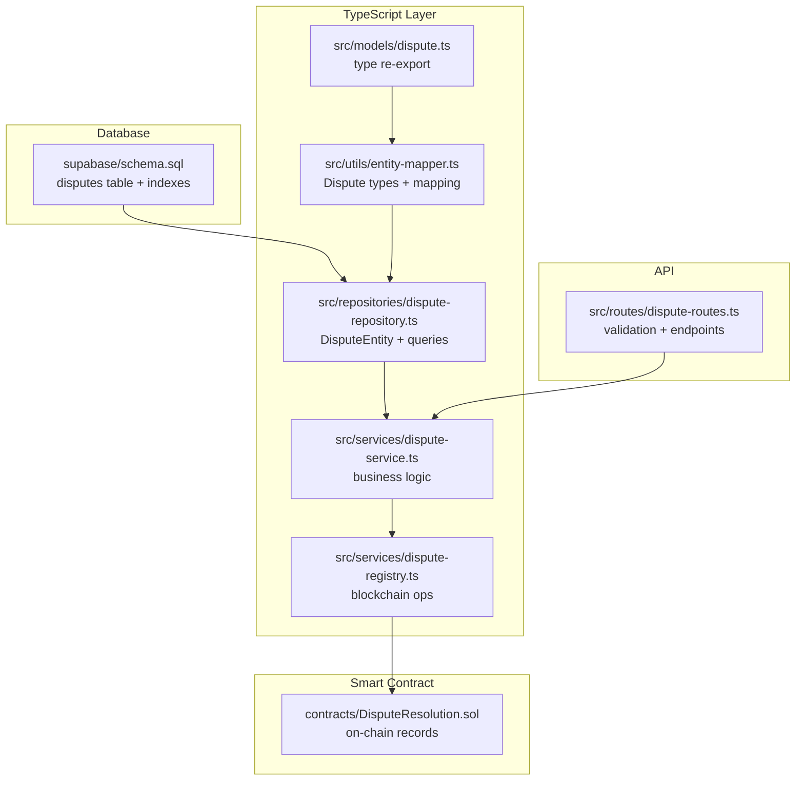
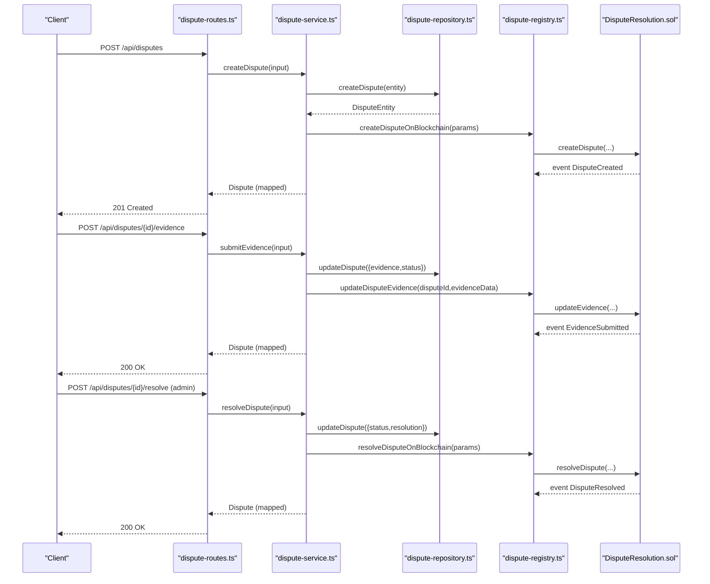
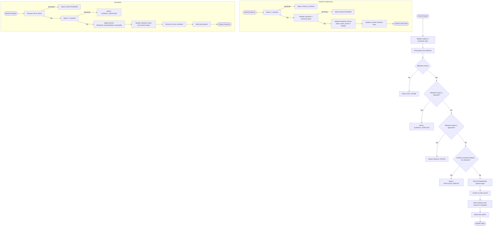
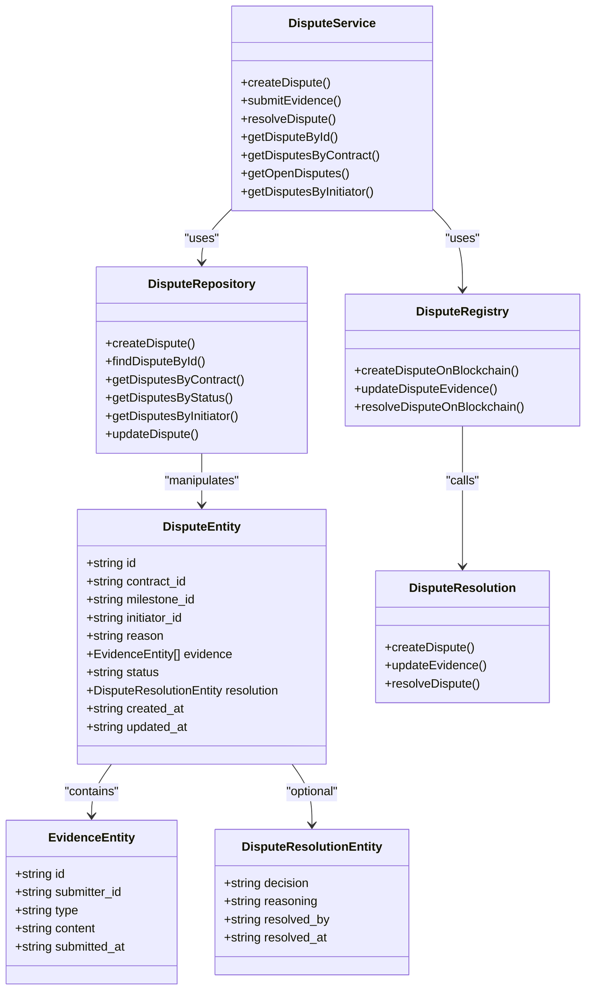

# Dispute Model

<cite>
**Referenced Files in This Document**
- [schema.sql](file://supabase/schema.sql)
- [dispute.ts](file://src/models/dispute.ts)
- [entity-mapper.ts](file://src/utils/entity-mapper.ts)
- [dispute-repository.ts](file://src/repositories/dispute-repository.ts)
- [dispute-service.ts](file://src/services/dispute-service.ts)
- [dispute-registry.ts](file://src/services/dispute-registry.ts)
- [DisputeResolution.sol](file://contracts/DisputeResolution.sol)
- [dispute-routes.ts](file://src/routes/dispute-routes.ts)
- [base-repository.ts](file://src/repositories/base-repository.ts)
</cite>

## Table of Contents
1. [Introduction](#introduction)
2. [Project Structure](#project-structure)
3. [Core Components](#core-components)
4. [Architecture Overview](#architecture-overview)
5. [Detailed Component Analysis](#detailed-component-analysis)
6. [Dependency Analysis](#dependency-analysis)
7. [Performance Considerations](#performance-considerations)
8. [Troubleshooting Guide](#troubleshooting-guide)
9. [Conclusion](#conclusion)
10. [Appendices](#appendices)

## Introduction
This document provides comprehensive data model documentation for the Dispute model in the FreelanceXchain platform. It covers the PostgreSQL schema definition, TypeScript type definitions, field constraints, lifecycle from creation to resolution, foreign key relationships, indexes, validation rules, and the integration with the DisputeResolution smart contract. It also explains how the DisputeRepository validates submission rights and maintains audit trails.

## Project Structure
The Dispute model spans several layers:
- Database schema defines the disputes table and indexes
- TypeScript models define runtime types and mappings
- Repository encapsulates database operations
- Service orchestrates business logic and integrates with blockchain
- Smart contract records outcomes on-chain
- Routes expose API endpoints with validation

**Diagram sources**
- [schema.sql](file://supabase/schema.sql#L108-L120)
- [dispute.ts](file://src/models/dispute.ts#L1-L3)
- [entity-mapper.ts](file://src/utils/entity-mapper.ts#L312-L371)
- [dispute-repository.ts](file://src/repositories/dispute-repository.ts#L21-L32)
- [dispute-service.ts](file://src/services/dispute-service.ts#L40-L61)
- [dispute-registry.ts](file://src/services/dispute-registry.ts#L40-L56)
- [DisputeResolution.sol](file://contracts/DisputeResolution.sol#L14-L28)
- [dispute-routes.ts](file://src/routes/dispute-routes.ts#L118-L116)

**Section sources**
- [schema.sql](file://supabase/schema.sql#L108-L120)
- [dispute.ts](file://src/models/dispute.ts#L1-L3)
- [entity-mapper.ts](file://src/utils/entity-mapper.ts#L312-L371)
- [dispute-repository.ts](file://src/repositories/dispute-repository.ts#L21-L32)
- [dispute-service.ts](file://src/services/dispute-service.ts#L40-L61)
- [dispute-registry.ts](file://src/services/dispute-registry.ts#L40-L56)
- [DisputeResolution.sol](file://contracts/DisputeResolution.sol#L14-L28)
- [dispute-routes.ts](file://src/routes/dispute-routes.ts#L118-L116)

## Core Components
- DisputeEntity (PostgreSQL): The canonical database representation stored in the disputes table
- Dispute (TypeScript): The API-facing model with mapped fields and typed evidence/resolution
- DisputeRepository: Typed CRUD and query helpers for disputes
- DisputeService: Business logic for creation, evidence submission, resolution, and notifications
- Dispute-Registry: On-chain integration for creating, updating evidence, and resolving disputes
- DisputeResolution.sol: Solidity contract storing immutable records and outcomes

Key fields and constraints are defined below.

**Section sources**
- [schema.sql](file://supabase/schema.sql#L108-L120)
- [entity-mapper.ts](file://src/utils/entity-mapper.ts#L312-L371)
- [dispute-repository.ts](file://src/repositories/dispute-repository.ts#L21-L32)
- [dispute-service.ts](file://src/services/dispute-service.ts#L40-L61)
- [dispute-registry.ts](file://src/services/dispute-registry.ts#L40-L56)
- [DisputeResolution.sol](file://contracts/DisputeResolution.sol#L14-L28)

## Architecture Overview
The dispute lifecycle integrates off-chain and on-chain systems:
- Creation: API validates user identity and contract/milestone, persists dispute, marks milestones and contracts as disputed, records on-chain, and notifies parties
- Evidence submission: Only parties can submit; evidence appended and status transitions to under_review if needed; on-chain evidence hash updated
- Resolution: Admin resolves; service triggers payment actions, updates milestone/contract statuses, marks dispute resolved, records on-chain, and notifies parties

**Diagram sources**
- [dispute-routes.ts](file://src/routes/dispute-routes.ts#L149-L224)
- [dispute-routes.ts](file://src/routes/dispute-routes.ts#L328-L382)
- [dispute-routes.ts](file://src/routes/dispute-routes.ts#L424-L487)
- [dispute-service.ts](file://src/services/dispute-service.ts#L67-L206)
- [dispute-service.ts](file://src/services/dispute-service.ts#L213-L293)
- [dispute-service.ts](file://src/services/dispute-service.ts#L296-L458)
- [dispute-registry.ts](file://src/services/dispute-registry.ts#L69-L145)
- [dispute-registry.ts](file://src/services/dispute-registry.ts#L147-L189)
- [dispute-registry.ts](file://src/services/dispute-registry.ts#L191-L253)
- [DisputeResolution.sol](file://contracts/DisputeResolution.sol#L51-L82)
- [DisputeResolution.sol](file://contracts/DisputeResolution.sol#L84-L94)
- [DisputeResolution.sol](file://contracts/DisputeResolution.sol#L96-L125)

## Detailed Component Analysis

### PostgreSQL Schema: Disputes Table
- Primary key: id (UUID)
- Foreign keys:
  - contract_id references contracts(id) with cascade delete
  - initiator_id references users(id) with cascade delete
- Columns:
  - id: UUID primary key
  - contract_id: UUID (FK)
  - milestone_id: varchar (identifier)
  - initiator_id: UUID (FK)
  - reason: text
  - evidence: JSONB (default [])
  - status: varchar with check constraint ('open','under_review','resolved')
  - resolution: JSONB (nullable)
  - created_at: timestamptz (default now)
  - updated_at: timestamptz (default now)
- Indexes:
  - idx_disputes_contract_id (created)
  - Additional indexes exist for performance on other tables

Constraints and checks:
- Status enum enforced at DB level
- Evidence and resolution stored as JSONB for flexibility

**Section sources**
- [schema.sql](file://supabase/schema.sql#L108-L120)
- [schema.sql](file://supabase/schema.sql#L202-L224)

### TypeScript Types and Mappings
- DisputeEntity (repository):
  - id: string
  - contract_id: string
  - milestone_id: string
  - initiator_id: string
  - reason: string
  - evidence: EvidenceEntity[]
  - status: 'open' | 'under_review' | 'resolved'
  - resolution: DisputeResolutionEntity | null
  - created_at: string
  - updated_at: string
- EvidenceEntity:
  - id: string
  - submitter_id: string
  - type: 'text' | 'file' | 'link'
  - content: string
  - submitted_at: string
- DisputeResolutionEntity:
  - decision: 'freelancer_favor' | 'employer_favor' | 'split'
  - reasoning: string
  - resolved_by: string
  - resolved_at: string
- Dispute (API model) and Evidence/Resolution (API):
  - camelCase fields mapped from snake_case entities
  - Evidence includes submitterId and submittedAt
  - Resolution includes resolvedBy and resolvedAt

**Section sources**
- [dispute-repository.ts](file://src/repositories/dispute-repository.ts#L6-L19)
- [dispute-repository.ts](file://src/repositories/dispute-repository.ts#L21-L32)
- [entity-mapper.ts](file://src/utils/entity-mapper.ts#L312-L371)

### Field Definitions and Constraints

- contract_id
  - Type: UUID string
  - Constraint: FK to contracts(id); cascade delete
  - Purpose: Links dispute to a contract
  - Index: Yes (idx_disputes_contract_id)

- milestone_id
  - Type: String (identifier)
  - Constraint: Not enforced as FK; validated by service against project milestones
  - Purpose: Identifies the milestone under dispute

- initiator_id
  - Type: UUID string
  - Constraint: FK to users(id); cascade delete
  - Constraint enforced by service: only parties (freelancer or employer) can initiate

- reason
  - Type: Text
  - Constraint: Required on creation
  - Purpose: Describes the cause of the dispute

- evidence
  - Type: Array of Evidence
  - Fields:
    - id: String
    - submitter_id: String (UUID)
    - type: Enum 'text' | 'file' | 'link'
    - content: String
    - submitted_at: ISO datetime string
  - Constraint: Only parties can submit; status transitions to under_review when evidence is added (if previously open)

- status
  - Type: Enum 'open' | 'under_review' | 'resolved'
  - Constraint: Check constraint in DB; transitions enforced by service
  - Index: Yes (idx_disputes_contract_id) supports filtering by status

- resolution
  - Type: Object with decision, reasoning, resolved_by, resolved_at
  - Constraint: Only set when resolved; decision enum enforced by service

- blockchain_tx_hash
  - Not present in the PostgreSQL schema
  - Evidence and resolution hashes recorded on-chain via Dispute-Registry
  - Transaction metadata (hash, block number) is captured by the registry service

**Section sources**
- [schema.sql](file://supabase/schema.sql#L108-L120)
- [schema.sql](file://supabase/schema.sql#L202-L224)
- [dispute-repository.ts](file://src/repositories/dispute-repository.ts#L6-L19)
- [dispute-repository.ts](file://src/repositories/dispute-repository.ts#L21-L32)
- [entity-mapper.ts](file://src/utils/entity-mapper.ts#L312-L371)
- [dispute-registry.ts](file://src/services/dispute-registry.ts#L16-L32)
- [dispute-registry.ts](file://src/services/dispute-registry.ts#L147-L189)
- [dispute-registry.ts](file://src/services/dispute-registry.ts#L191-L253)

### Dispute Lifecycle

**Diagram sources**
- [dispute-service.ts](file://src/services/dispute-service.ts#L67-L206)
- [dispute-service.ts](file://src/services/dispute-service.ts#L213-L293)
- [dispute-service.ts](file://src/services/dispute-service.ts#L296-L458)
- [dispute-registry.ts](file://src/services/dispute-registry.ts#L69-L145)
- [dispute-registry.ts](file://src/services/dispute-registry.ts#L147-L189)
- [dispute-registry.ts](file://src/services/dispute-registry.ts#L191-L253)

### Foreign Key Relationships and Access Control
- Dispute.contract_id -> Contract.id (cascade delete)
- Dispute.initiator_id -> User.id (cascade delete)
- Access control enforced by service:
  - Only parties (freelancer or employer) can create disputes
  - Only parties can submit evidence
  - Only admins can resolve disputes
- Audit trail maintained by:
  - created_at/updated_at timestamps managed by BaseRepository
  - Evidence entries include submitter_id and submitted_at
  - Resolution entries include resolved_by and resolved_at

**Section sources**
- [schema.sql](file://supabase/schema.sql#L108-L120)
- [schema.sql](file://supabase/schema.sql#L202-L224)
- [base-repository.ts](file://src/repositories/base-repository.ts#L39-L55)
- [base-repository.ts](file://src/repositories/base-repository.ts#L72-L86)
- [dispute-service.ts](file://src/services/dispute-service.ts#L82-L88)
- [dispute-service.ts](file://src/services/dispute-service.ts#L235-L249)
- [dispute-service.ts](file://src/services/dispute-service.ts#L306-L311)

### Indexes for Efficient Case Management
- idx_disputes_contract_id: Supports querying disputes by contract_id efficiently
- Additional indexes exist for other tables to optimize related queries

**Section sources**
- [schema.sql](file://supabase/schema.sql#L202-L224)

### Validation Rules for Evidence Format and Submission Timing
- Evidence types: 'text', 'file', 'link'
- Content must be a non-empty string
- Submission timing:
  - Disputes with status 'resolved' cannot accept new evidence
  - Evidence submission requires the submitter to be a party to the contract
- Creation timing:
  - Cannot create a dispute for an approved milestone
  - Cannot create a dispute if another unresolved dispute exists for the same milestone
  - Initiator must be a party to the contract

**Section sources**
- [dispute-routes.ts](file://src/routes/dispute-routes.ts#L348-L360)
- [dispute-service.ts](file://src/services/dispute-service.ts#L227-L233)
- [dispute-service.ts](file://src/services/dispute-service.ts#L235-L249)
- [dispute-service.ts](file://src/services/dispute-service.ts#L110-L133)
- [dispute-service.ts](file://src/services/dispute-service.ts#L118-L124)

### Sample Dispute Record with Evidence Metadata
- Dispute fields:
  - id: string
  - contractId: string
  - milestoneId: string
  - initiatorId: string
  - reason: string
  - evidence: [
    {
      id: string,
      submitterId: string,
      type: 'text' | 'file' | 'link',
      content: string,
      submittedAt: string
    }
  ]
  - status: 'open' | 'under_review' | 'resolved'
  - resolution: {
    decision: 'freelancer_favor' | 'employer_favor' | 'split',
    reasoning: string,
    resolvedBy: string,
    resolvedAt: string
  } | null
  - createdAt: string
  - updatedAt: string

Note: The PostgreSQL schema stores evidence and resolution as JSONB. The API model exposes typed evidence and resolution objects.

**Section sources**
- [entity-mapper.ts](file://src/utils/entity-mapper.ts#L312-L371)
- [schema.sql](file://supabase/schema.sql#L108-L120)

## Dependency Analysis

**Diagram sources**
- [dispute-repository.ts](file://src/repositories/dispute-repository.ts#L21-L32)
- [dispute-repository.ts](file://src/repositories/dispute-repository.ts#L39-L133)
- [dispute-service.ts](file://src/services/dispute-service.ts#L67-L206)
- [dispute-service.ts](file://src/services/dispute-service.ts#L213-L293)
- [dispute-service.ts](file://src/services/dispute-service.ts#L296-L458)
- [dispute-registry.ts](file://src/services/dispute-registry.ts#L69-L145)
- [dispute-registry.ts](file://src/services/dispute-registry.ts#L147-L189)
- [dispute-registry.ts](file://src/services/dispute-registry.ts#L191-L253)
- [DisputeResolution.sol](file://contracts/DisputeResolution.sol#L51-L82)
- [DisputeResolution.sol](file://contracts/DisputeResolution.sol#L84-L94)
- [DisputeResolution.sol](file://contracts/DisputeResolution.sol#L96-L125)

**Section sources**
- [dispute-repository.ts](file://src/repositories/dispute-repository.ts#L21-L32)
- [dispute-service.ts](file://src/services/dispute-service.ts#L67-L206)
- [dispute-registry.ts](file://src/services/dispute-registry.ts#L69-L145)
- [DisputeResolution.sol](file://contracts/DisputeResolution.sol#L51-L82)

## Performance Considerations
- Index on contract_id accelerates queries by contract
- Pagination helpers in BaseRepository reduce memory footprint for large result sets
- JSONB storage for evidence and resolution allows flexible schema evolution while maintaining performance for targeted lookups
- On-chain operations are asynchronous and batched via transaction submission and confirmation

[No sources needed since this section provides general guidance]

## Troubleshooting Guide
Common errors and causes:
- NOT_FOUND: Contract, project, milestone, or dispute not found
- UNAUTHORIZED: Non-party attempting to create dispute or submit evidence; non-admin attempting to resolve
- ALREADY_DISPUTED: Attempting to create a dispute for a milestone already marked disputed
- DUPLICATE_DISPUTE: An unresolved dispute already exists for the same milestone
- INVALID_STATUS: Submitting evidence for a resolved dispute or creating a dispute for an approved milestone
- ALREADY_RESOLVED: Attempting to resolve an already resolved dispute

Operational tips:
- Ensure user roles and identities are validated at the route layer
- Verify contract-party relationships before creating disputes
- Confirm milestone status before creation and evidence submission
- Monitor blockchain transaction confirmations and handle failures gracefully

**Section sources**
- [dispute-routes.ts](file://src/routes/dispute-routes.ts#L168-L201)
- [dispute-routes.ts](file://src/routes/dispute-routes.ts#L348-L360)
- [dispute-routes.ts](file://src/routes/dispute-routes.ts#L453-L465)
- [dispute-service.ts](file://src/services/dispute-service.ts#L72-L88)
- [dispute-service.ts](file://src/services/dispute-service.ts#L110-L133)
- [dispute-service.ts](file://src/services/dispute-service.ts#L227-L233)
- [dispute-service.ts](file://src/services/dispute-service.ts#L322-L328)

## Conclusion
The Dispute model integrates robust database constraints, strict TypeScript typing, and layered validation to ensure secure and auditable dispute management. Off-chain persistence with on-chain immutability provides transparency and trust. The lifecycle enforces party-only participation and admin-only resolution, with clear audit trails and indexes for efficient case management.

[No sources needed since this section summarizes without analyzing specific files]

## Appendices

### API Endpoints Overview
- POST /api/disputes: Create a dispute (authenticated, parties only)
- GET /api/disputes/{disputeId}: Retrieve a dispute (authenticated)
- POST /api/disputes/{disputeId}/evidence: Submit evidence (authenticated, parties only)
- POST /api/disputes/{disputeId}/resolve: Resolve dispute (admin only)
- GET /api/contracts/{contractId}/disputes: List contract disputes (authenticated, parties only)

**Section sources**
- [dispute-routes.ts](file://src/routes/dispute-routes.ts#L149-L224)
- [dispute-routes.ts](file://src/routes/dispute-routes.ts#L258-L287)
- [dispute-routes.ts](file://src/routes/dispute-routes.ts#L328-L382)
- [dispute-routes.ts](file://src/routes/dispute-routes.ts#L424-L487)
- [dispute-routes.ts](file://src/routes/dispute-routes.ts#L525-L555)