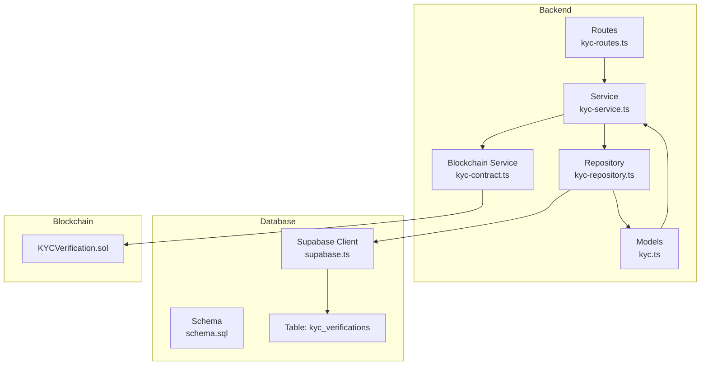
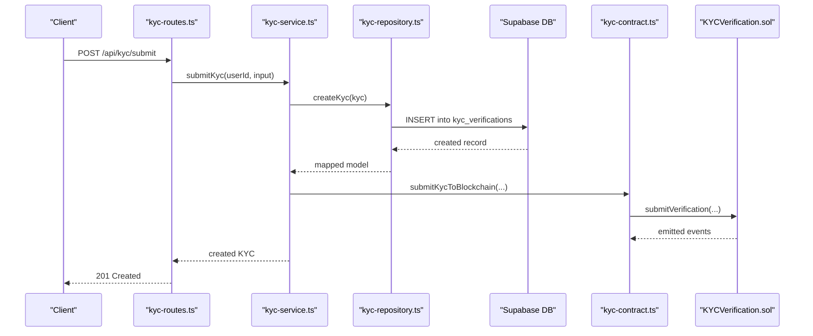
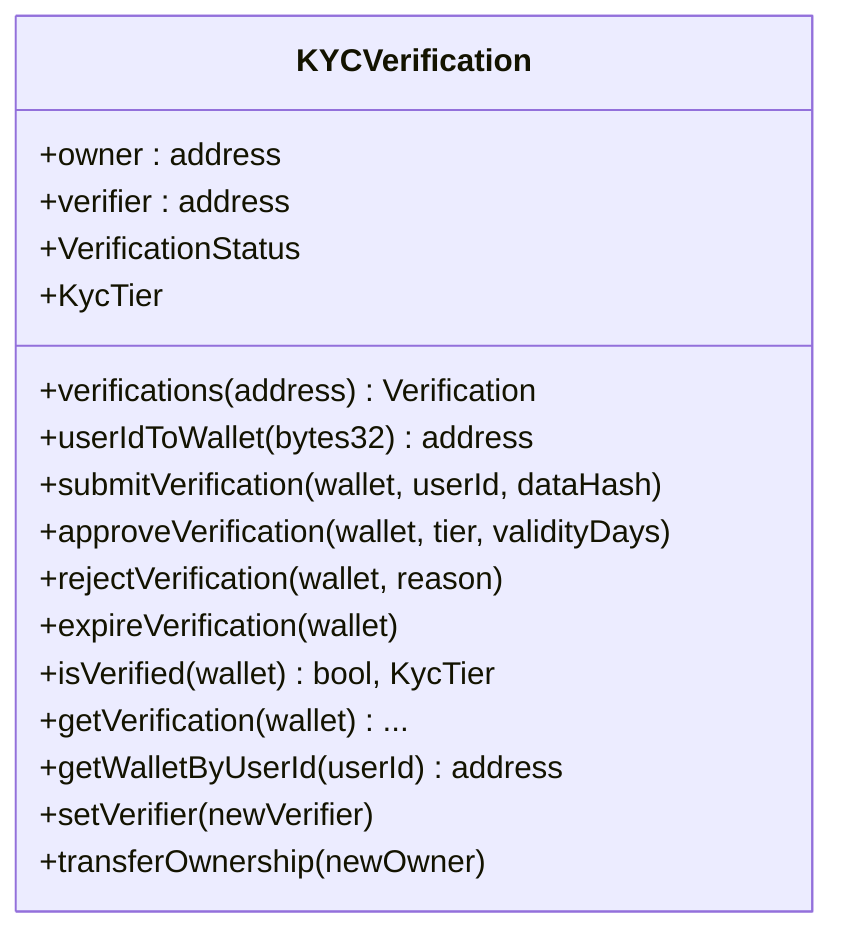
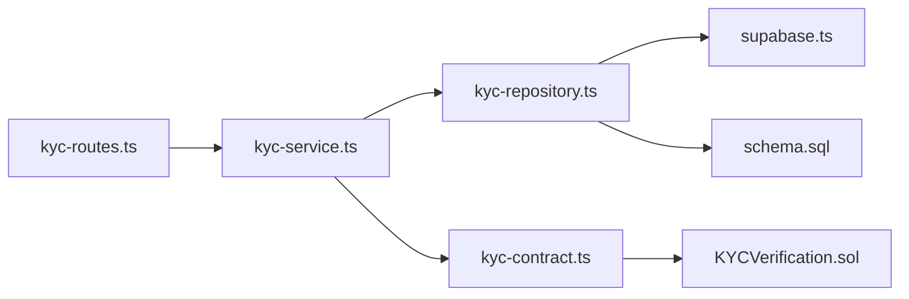

# KYC Verification Model

<cite>
**Referenced Files in This Document**
- [kyc.ts](file://src/models/kyc.ts)
- [kyc-repository.ts](file://src/repositories/kyc-repository.ts)
- [kyc-service.ts](file://src/services/kyc-service.ts)
- [kyc-contract.ts](file://src/services/kyc-contract.ts)
- [KYCVerification.sol](file://contracts/KYCVerification.sol)
- [schema.sql](file://supabase/schema.sql)
- [kyc-routes.ts](file://src/routes/kyc-routes.ts)
- [base-repository.ts](file://src/repositories/base-repository.ts)
- [supabase.ts](file://src/config/supabase.ts)
</cite>

## Table of Contents
1. [Introduction](#introduction)
2. [Project Structure](#project-structure)
3. [Core Components](#core-components)
4. [Architecture Overview](#architecture-overview)
5. [Detailed Component Analysis](#detailed-component-analysis)
6. [Dependency Analysis](#dependency-analysis)
7. [Performance Considerations](#performance-considerations)
8. [Troubleshooting Guide](#troubleshooting-guide)
9. [Conclusion](#conclusion)
10. [Appendices](#appendices)

## Introduction
This document provides comprehensive data model documentation for the KYC Verification model in the FreelanceXchain platform. It defines the off-chain data model, PostgreSQL schema, and the privacy-preserving on-chain anchoring mechanism. It explains how the system ensures privacy while enabling verifiable identity through blockchain-anchored hashes, outlines foreign key relationships, indexes, and the repository/service integration with the KYC smart contract. It also includes validation rules, status transitions, and a sample record.

## Project Structure
The KYC model spans TypeScript models, repository/service layers, PostgreSQL schema, and a Solidity smart contract. The routing layer exposes REST endpoints that delegate to the service layer, which coordinates with the repository and the blockchain service.

**Diagram sources**
- [kyc-routes.ts](file://src/routes/kyc-routes.ts#L1-L120)
- [kyc-service.ts](file://src/services/kyc-service.ts#L1-L120)
- [kyc-repository.ts](file://src/repositories/kyc-repository.ts#L1-L60)
- [kyc.ts](file://src/models/kyc.ts#L1-L120)
- [kyc-contract.ts](file://src/services/kyc-contract.ts#L1-L120)
- [schema.sql](file://supabase/schema.sql#L135-L160)
- [supabase.ts](file://src/config/supabase.ts#L1-L45)
- [KYCVerification.sol](file://contracts/KYCVerification.sol#L1-L60)

**Section sources**
- [kyc-routes.ts](file://src/routes/kyc-routes.ts#L1-L120)
- [kyc-service.ts](file://src/services/kyc-service.ts#L1-L120)
- [kyc-repository.ts](file://src/repositories/kyc-repository.ts#L1-L60)
- [kyc.ts](file://src/models/kyc.ts#L1-L120)
- [schema.sql](file://supabase/schema.sql#L135-L160)
- [supabase.ts](file://src/config/supabase.ts#L1-L45)
- [kyc-contract.ts](file://src/services/kyc-contract.ts#L1-L120)
- [KYCVerification.sol](file://contracts/KYCVerification.sol#L1-L60)

## Core Components
- Off-chain KYC Verification model: Defines fields, enums, and nested structures for personal info, documents, liveness checks, AML screening, and risk metadata.
- Repository: Provides CRUD and query operations for KYC records, mapping between entity and model.
- Service: Orchestrates KYC submission, liveness, face match, review, and blockchain interactions.
- PostgreSQL schema: Declares the kyc_verifications table with constraints, indexes, and RLS policies.
- Blockchain contract: Stores verification status, tier, and data hash on-chain; supports submit/approve/reject/expiry.

**Section sources**
- [kyc.ts](file://src/models/kyc.ts#L1-L120)
- [kyc-repository.ts](file://src/repositories/kyc-repository.ts#L1-L120)
- [kyc-service.ts](file://src/services/kyc-service.ts#L1-L120)
- [schema.sql](file://supabase/schema.sql#L135-L160)
- [KYCVerification.sol](file://contracts/KYCVerification.sol#L1-L60)

## Architecture Overview
The system separates concerns across layers:
- Routes handle HTTP requests and validation.
- Service encapsulates business logic and integrates with repository and blockchain service.
- Repository abstracts database operations using Supabase client.
- PostgreSQL schema enforces data integrity and performance via indexes.
- Smart contract stores immutable verification state anchored by data hashes.

**Diagram sources**
- [kyc-routes.ts](file://src/routes/kyc-routes.ts#L367-L428)
- [kyc-service.ts](file://src/services/kyc-service.ts#L90-L190)
- [kyc-repository.ts](file://src/repositories/kyc-repository.ts#L124-L129)
- [kyc-contract.ts](file://src/services/kyc-contract.ts#L93-L156)
- [KYCVerification.sol](file://contracts/KYCVerification.sol#L61-L87)

## Detailed Component Analysis

### Off-chain Data Model (TypeScript)
The off-chain KYC model defines:
- Status and tier enumerations
- Personal profile fields (names, DOB, place of birth, nationalities)
- Tax residency and identification fields
- Address structure
- Documents array with OCR and MRZ metadata
- Liveness check with challenges and confidence
- AML screening and risk fields
- Review metadata (reviewedAt/by, rejection fields)
- Timestamps (submittedAt, reviewedAt, expiresAt, createdAt, updatedAt)

Constraints and types:
- Status constrained to a fixed set of values
- Tier constrained to basic/standard/enhanced
- Document type constrained to a predefined list
- Address stored as JSONB
- Documents, liveness_check, and reviewed_by stored as JSONB
- Dates and timestamps as ISO strings

Privacy note: The off-chain model stores personal data locally. The on-chain contract stores only status, tier, and a data hash, enabling verifiability without exposing sensitive data.

**Section sources**
- [kyc.ts](file://src/models/kyc.ts#L1-L120)
- [kyc.ts](file://src/models/kyc.ts#L121-L206)

### PostgreSQL Schema (kyc_verifications)
Table definition and constraints:
- Primary key: id (UUID)
- Foreign key: user_id references users(id) with cascade delete
- Status column constrained to a fixed set of values
- Tier stored as integer (mapped to enum in service)
- Address, documents, liveness_check stored as JSONB
- Timestamps: created_at, updated_at, submitted_at, reviewed_at, expires_at
- Additional fields: reviewed_by (UUID), rejection_reason

Indexes:
- Index on user_id for quick lookups
- Additional indexes exist for other tables; kyc_verifications index is present

RLS:
- Row Level Security enabled on kyc_verifications

Unique constraint per user:
- There is no explicit unique constraint on user_id in the schema. The service enforces uniqueness by retrieving the latest record per user and updating it rather than inserting duplicates.

**Section sources**
- [schema.sql](file://supabase/schema.sql#L135-L160)
- [schema.sql](file://supabase/schema.sql#L202-L224)
- [schema.sql](file://supabase/schema.sql#L234-L239)

### Repository Layer
Responsibilities:
- Map between entity and model
- Provide create, getById, update, getKycByUserId, getKycByStatus, getPendingReviews
- Use Supabase client and TABLES constant

Key operations:
- getKycByUserId: selects by user_id, orders by created_at descending, limits to 1 to get the latest record
- getKycByStatus: filters by status and orders by submitted_at ascending
- getPendingReviews: delegates to getKycByStatus('submitted')

Error handling:
- Catches PGRST116 (no rows) and returns null appropriately
- Throws on other errors

**Section sources**
- [kyc-repository.ts](file://src/repositories/kyc-repository.ts#L1-L178)
- [base-repository.ts](file://src/repositories/base-repository.ts#L1-L149)
- [supabase.ts](file://src/config/supabase.ts#L1-L45)

### Service Layer
Responsibilities:
- Validate country support and document type
- Enforce KYC lifecycle rules (already approved, pending)
- Build KYC record with documents, liveness, and AML/risk fields
- Submit to blockchain when user has a wallet address
- Handle liveness sessions and face match
- Manage review workflow (approve/reject) and update blockchain accordingly
- Provide integrity checks between off-chain and on-chain records

Validation rules:
- Country must be supported
- Document type must be supported for the given country
- KYC already approved or pending prevents re-submission
- Rejection requires a reason
- Liveness session must be active and not expired

Status transitions:
- submitted -> under_review -> approved or rejected
- approved has expiry (set by service)
- rejected retains rejection reason/code

**Section sources**
- [kyc-service.ts](file://src/services/kyc-service.ts#L86-L190)
- [kyc-service.ts](file://src/services/kyc-service.ts#L193-L293)
- [kyc-service.ts](file://src/services/kyc-service.ts#L295-L368)
- [kyc-service.ts](file://src/services/kyc-service.ts#L328-L407)
- [kyc-service.ts](file://src/services/kyc-service.ts#L481-L547)

### Blockchain Interaction (KYCRepository vs. KYCVerification.sol)
The repository in the backend is for off-chain persistence. The smart contract KYCVerification.sol provides on-chain anchoring:
- Stores verification status, tier, dataHash, verifiedAt, expiresAt, verifiedBy, and rejectionReason
- Supports submit, approve, reject, expire, and query functions
- Emits events for transparency
- Uses modifiers to restrict approvals and rejections to verifier or owner

The service layer generates a data hash from KYC data and submits it on-chain. It also approves/rejects on-chain based on admin decisions.

**Diagram sources**
- [KYCVerification.sol](file://contracts/KYCVerification.sol#L1-L211)

**Section sources**
- [kyc-contract.ts](file://src/services/kyc-contract.ts#L1-L120)
- [kyc-contract.ts](file://src/services/kyc-contract.ts#L120-L220)
- [kyc-contract.ts](file://src/services/kyc-contract.ts#L220-L338)
- [KYCVerification.sol](file://contracts/KYCVerification.sol#L1-L211)

### Privacy-Preserving Identity Verification Through Blockchain-Anchored Hashes
Mechanism:
- Off-chain KYC record contains personal data
- On-chain record stores only status, tier, and a cryptographic hash of KYC data
- The hash is computed from a normalized subset of KYC fields
- Wallet address maps to user ID hash for off-chain-to-on-chain correlation
- Integrity checks compare computed hash with on-chain stored hash

Benefits:
- GDPR-compliant storage of personal data off-chain
- Immutable verification state on-chain
- Transparent auditability via events and status

**Section sources**
- [kyc-contract.ts](file://src/services/kyc-contract.ts#L66-L120)
- [kyc-contract.ts](file://src/services/kyc-contract.ts#L120-L220)
- [KYCVerification.sol](file://contracts/KYCVerification.sol#L1-L60)

### Sample KYC Record (with document hash)
Fields to include in a sample:
- user_id: UUID of the user
- status: e.g., submitted
- tier: e.g., basic
- firstName, lastName, dateOfBirth, nationality
- address: JSONB object with required fields
- documents: array containing at least one document with type, number, issuingCountry, frontImageUrl, and uploadedAt
- submittedAt: timestamp
- createdAt, updatedAt: timestamps

Note: The on-chain dataHash is derived from a normalized subset of the above fields and stored on-chain. The off-chain record contains the full personal data.

**Section sources**
- [kyc.ts](file://src/models/kyc.ts#L84-L119)
- [kyc.ts](file://src/models/kyc.ts#L35-L50)
- [kyc-contract.ts](file://src/services/kyc-contract.ts#L66-L120)

## Dependency Analysis
- Routes depend on service functions
- Service depends on repository and blockchain service
- Repository depends on Supabase client and TABLES constants
- PostgreSQL schema defines constraints and indexes
- Smart contract defines on-chain state machine and events

**Diagram sources**
- [kyc-routes.ts](file://src/routes/kyc-routes.ts#L1-L120)
- [kyc-service.ts](file://src/services/kyc-service.ts#L1-L120)
- [kyc-repository.ts](file://src/repositories/kyc-repository.ts#L1-L60)
- [supabase.ts](file://src/config/supabase.ts#L1-L45)
- [schema.sql](file://supabase/schema.sql#L135-L160)
- [kyc-contract.ts](file://src/services/kyc-contract.ts#L1-L120)
- [KYCVerification.sol](file://contracts/KYCVerification.sol#L1-L60)

**Section sources**
- [kyc-routes.ts](file://src/routes/kyc-routes.ts#L1-L120)
- [kyc-service.ts](file://src/services/kyc-service.ts#L1-L120)
- [kyc-repository.ts](file://src/repositories/kyc-repository.ts#L1-L60)
- [schema.sql](file://supabase/schema.sql#L135-L160)
- [kyc-contract.ts](file://src/services/kyc-contract.ts#L1-L120)
- [KYCVerification.sol](file://contracts/KYCVerification.sol#L1-L60)

## Performance Considerations
- Index on user_id improves lookups by user
- Status filtering for compliance reporting uses ordered queries
- JSONB fields enable flexible storage but may impact indexing; consider selective queries
- Batch operations and pagination are supported by the base repository

[No sources needed since this section provides general guidance]

## Troubleshooting Guide
Common issues and resolutions:
- No KYC found by user: Ensure getKycByUserId is used; repository returns null when not found
- KYC already approved or pending: Service prevents re-submission; check existing status
- Rejection requires reason: Provide rejectionReason when rejecting
- Liveness session expired: Recreate session; verify expiration timestamp
- Blockchain submission failures: Service logs and continues; retry or inspect transaction receipts

**Section sources**
- [kyc-repository.ts](file://src/repositories/kyc-repository.ts#L136-L151)
- [kyc-service.ts](file://src/services/kyc-service.ts#L86-L190)
- [kyc-service.ts](file://src/services/kyc-service.ts#L328-L407)
- [kyc-service.ts](file://src/services/kyc-service.ts#L237-L293)

## Conclusion
The KYC Verification model combines an off-chain data model with on-chain anchoring to achieve privacy-preserving identity verification. The repository and service layers enforce business rules, while the PostgreSQL schema and indexes support efficient lookups and compliance reporting. The smart contract provides an immutable, auditable verification state anchored by cryptographic hashes.

[No sources needed since this section summarizes without analyzing specific files]

## Appendices

### Data Types and Constraints Summary
- TypeScript model fields:
  - Status: enum of pending, submitted, under_review, approved, rejected
  - Tier: enum of basic, standard, enhanced
  - Documents: array of document entries with type, number, issuingCountry, front/back URLs, timestamps
  - Address: JSONB object with required fields
  - LivenessCheck: JSONB with challenges, confidence, timestamps
  - AML/Risk: JSONB fields for screening and risk assessment
- PostgreSQL table:
  - user_id references users(id) with cascade delete
  - Status constrained to fixed set
  - JSONB fields for address, documents, liveness_check, reviewed_by
  - Index on user_id
  - RLS enabled

**Section sources**
- [kyc.ts](file://src/models/kyc.ts#L1-L120)
- [schema.sql](file://supabase/schema.sql#L135-L160)
- [schema.sql](file://supabase/schema.sql#L202-L224)
- [schema.sql](file://supabase/schema.sql#L234-L239)

### Validation Rules for Document Types and Status Transitions
- Document type validation:
  - Must belong to the supported list for the selected country
- Status transitions:
  - submitted -> under_review -> approved or rejected
  - approved sets expiry (service logic)
  - rejected stores rejection reason/code
- Liveness and face match:
  - Liveness session must be active and not expired
  - Face match threshold determines status

**Section sources**
- [kyc-service.ts](file://src/services/kyc-service.ts#L86-L190)
- [kyc-service.ts](file://src/services/kyc-service.ts#L237-L293)
- [kyc-service.ts](file://src/services/kyc-service.ts#L295-L368)