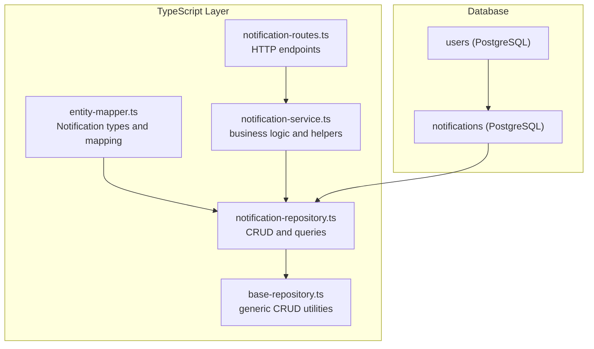
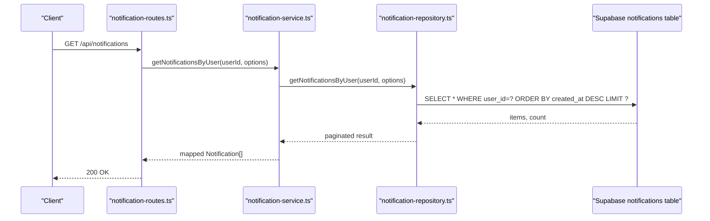
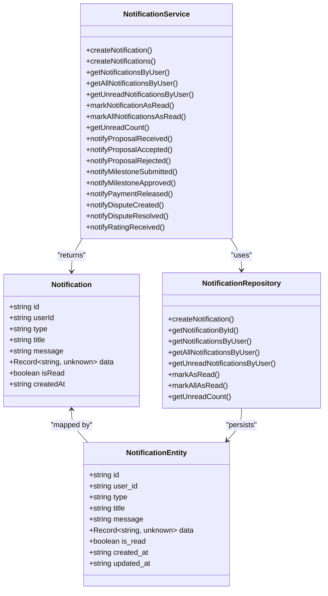

# Notification Model

<cite>
**Referenced Files in This Document**
- [notification.ts](file://src/models/notification.ts)
- [entity-mapper.ts](file://src/utils/entity-mapper.ts)
- [notification-repository.ts](file://src/repositories/notification-repository.ts)
- [notification-service.ts](file://src/services/notification-service.ts)
- [schema.sql](file://supabase/schema.sql)
- [notification-routes.ts](file://src/routes/notification-routes.ts)
- [base-repository.ts](file://src/repositories/base-repository.ts)
- [user.ts](file://src/models/user.ts)
</cite>

## Table of Contents
1. [Introduction](#introduction)
2. [Project Structure](#project-structure)
3. [Core Components](#core-components)
4. [Architecture Overview](#architecture-overview)
5. [Detailed Component Analysis](#detailed-component-analysis)
6. [Dependency Analysis](#dependency-analysis)
7. [Performance Considerations](#performance-considerations)
8. [Troubleshooting Guide](#troubleshooting-guide)
9. [Conclusion](#conclusion)
10. [Appendices](#appendices)

## Introduction
This document provides comprehensive data model documentation for the Notification model in the FreelanceXchain platform. It covers the PostgreSQL schema, TypeScript types, relationships, indexing strategy, and the service/repository layer that powers event-driven notifications for contract updates, proposal status changes, and dispute resolutions. It also documents how the NotificationRepository supports batch retrieval and read/unread state updates, and outlines validation rules and constraints for proper entity linking and message formatting.

## Project Structure
The Notification model spans the database schema, TypeScript entity mapping, repository, service, and route layers. The following diagram shows how these pieces fit together.

**Diagram sources**
- [schema.sql](file://supabase/schema.sql#L122-L133)
- [entity-mapper.ts](file://src/utils/entity-mapper.ts#L373-L409)
- [notification-repository.ts](file://src/repositories/notification-repository.ts#L1-L118)
- [notification-service.ts](file://src/services/notification-service.ts#L1-L316)
- [notification-routes.ts](file://src/routes/notification-routes.ts#L1-L289)
- [base-repository.ts](file://src/repositories/base-repository.ts#L1-L149)

**Section sources**
- [schema.sql](file://supabase/schema.sql#L122-L133)
- [entity-mapper.ts](file://src/utils/entity-mapper.ts#L373-L409)
- [notification-repository.ts](file://src/repositories/notification-repository.ts#L1-L118)
- [notification-service.ts](file://src/services/notification-service.ts#L1-L316)
- [notification-routes.ts](file://src/routes/notification-routes.ts#L1-L289)
- [base-repository.ts](file://src/repositories/base-repository.ts#L1-L149)

## Core Components
- PostgreSQL table: notifications
- TypeScript types: Notification, NotificationType
- Repository: NotificationRepository with CRUD and inbox queries
- Service: NotificationService with helpers for event-driven notifications
- Routes: HTTP endpoints for retrieving, marking read, and counting unread notifications
- Base repository: shared utilities for insert/update/delete and pagination

**Section sources**
- [schema.sql](file://supabase/schema.sql#L122-L133)
- [entity-mapper.ts](file://src/utils/entity-mapper.ts#L373-L409)
- [notification-repository.ts](file://src/repositories/notification-repository.ts#L1-L118)
- [notification-service.ts](file://src/services/notification-service.ts#L1-L316)
- [notification-routes.ts](file://src/routes/notification-routes.ts#L1-L289)
- [base-repository.ts](file://src/repositories/base-repository.ts#L1-L149)

## Architecture Overview
The Notification model follows a layered architecture:
- Data access layer (repository) encapsulates Supabase queries.
- Business logic layer (service) orchestrates creation, retrieval, and state updates.
- Presentation layer (routes) exposes endpoints for clients.
- Type mapping layer (entity-mapper) converts between database entities and API models.

**Diagram sources**
- [notification-routes.ts](file://src/routes/notification-routes.ts#L83-L118)
- [notification-service.ts](file://src/services/notification-service.ts#L80-L94)
- [notification-repository.ts](file://src/repositories/notification-repository.ts#L41-L60)
- [schema.sql](file://supabase/schema.sql#L122-L133)

## Detailed Component Analysis

### PostgreSQL Schema: notifications
- Columns and constraints:
  - id: UUID primary key, generated by default
  - user_id: UUID, references users(id) with cascade delete
  - type: VARCHAR(50), not null
  - title: VARCHAR(255), not null
  - message: TEXT
  - data: JSONB, default '{}'
  - is_read: BOOLEAN, default false
  - created_at: TIMESTAMPTZ, default now
  - updated_at: TIMESTAMPTZ, default now
- Indexes:
  - idx_notifications_user_id: on user_id
  - idx_notifications_is_read: on is_read
- RLS policies:
  - notifications ENABLE ROW LEVEL SECURITY
  - Service role policy allows full access to notifications

These constraints and indexes support efficient inbox queries and enforce referential integrity with the User model.

**Section sources**
- [schema.sql](file://supabase/schema.sql#L122-L133)
- [schema.sql](file://supabase/schema.sql#L202-L224)
- [schema.sql](file://supabase/schema.sql#L233-L233)
- [schema.sql](file://supabase/schema.sql#L254-L254)

### TypeScript Types and Mapping
- NotificationType: union of supported notification categories
- Notification: API-facing model with camelCase fields
- NotificationEntity: repository-facing model with snake_case fields
- Mapping functions convert between Notification and NotificationEntity

Key fields:
- id: string (UUID)
- userId: string (UUID)
- type: NotificationType
- title: string
- message: string
- data: Record<string, unknown>
- isRead: boolean
- createdAt: string (ISO timestamp)

**Section sources**
- [entity-mapper.ts](file://src/utils/entity-mapper.ts#L373-L409)
- [notification.ts](file://src/models/notification.ts#L1-L3)

### Foreign Key Relationship to User
- notifications.user_id references users.id with ON DELETE CASCADE
- This ensures that when a user is deleted, their notifications are automatically removed
- The relationship is enforced at the database level

**Section sources**
- [schema.sql](file://supabase/schema.sql#L124-L126)

### Indexing Strategy
- Composite indexes for efficient inbox queries:
  - user_id: supports user-scoped retrieval
  - is_read: supports unread filtering and counts
- Additional indexes exist for other tables, but the Notification table’s indexes are specifically tailored for inbox operations

**Section sources**
- [schema.sql](file://supabase/schema.sql#L213-L214)

### NotificationRepository: Batch Retrieval and State Updates
- Methods:
  - createNotification: inserts a new notification
  - getNotificationById: retrieves by id
  - getNotificationsByUser: paginated inbox by user
  - getAllNotificationsByUser: full list ordered by created_at desc
  - getUnreadNotificationsByUser: filters by is_read=false
  - markAsRead: sets is_read=true for a single notification
  - markAllAsRead: bulk update unread notifications to read for a user
  - getUnreadCount: counts unread notifications for a user

Pagination and ordering:
- getNotificationsByUser uses range-based pagination and orders by created_at descending
- getAllNotificationsByUser orders by created_at descending

Error handling:
- Throws descriptive errors on query failures

**Section sources**
- [notification-repository.ts](file://src/repositories/notification-repository.ts#L1-L118)
- [base-repository.ts](file://src/repositories/base-repository.ts#L1-L149)

### NotificationService: Event-Driven Helpers
- Creation helpers for specific events:
  - Proposal lifecycle: notifyProposalReceived, notifyProposalAccepted, notifyProposalRejected
  - Milestone lifecycle: notifyMilestoneSubmitted, notifyMilestoneApproved
  - Payment release: notifyPaymentReleased
  - Disputes: notifyDisputeCreated, notifyDisputeResolved
  - Ratings: notifyRatingReceived
- Validation and constraints:
  - All helpers set is_read=false by default
  - All helpers populate data with relevant identifiers and metadata
  - The service enforces ownership checks when marking a single notification as read

**Section sources**
- [notification-service.ts](file://src/services/notification-service.ts#L1-L316)

### Routes: Inbox, Read, and Count Endpoints
- GET /api/notifications: returns paginated notifications for the authenticated user
- GET /api/notifications/unread-count: returns unread count for the authenticated user
- PATCH /api/notifications/{id}/read: marks a notification as read (with ownership verification)
- PATCH /api/notifications/read-all: marks all notifications as read for the authenticated user

**Section sources**
- [notification-routes.ts](file://src/routes/notification-routes.ts#L1-L289)

### Sample Notification Record: Milestone Payment Event
- Fields:
  - id: UUID
  - userId: UUID of the recipient (freelancer or employer)
  - type: "payment_released"
  - title: "Payment Released"
  - message: formatted message containing amount and milestone/project details
  - data: JSON object containing amount, milestoneId, milestoneTitle, projectId, projectTitle, contractId
  - isRead: false
  - createdAt: timestamp

Validation rules:
- type must be one of the supported NotificationType values
- title and message must be non-empty strings
- data must be a JSON object with required keys for the event
- userId must correspond to an existing user

**Section sources**
- [notification-service.ts](file://src/services/notification-service.ts#L246-L262)
- [entity-mapper.ts](file://src/utils/entity-mapper.ts#L373-L409)
- [schema.sql](file://supabase/schema.sql#L122-L133)

## Dependency Analysis
The Notification model depends on:
- PostgreSQL schema for storage and constraints
- entity-mapper for type conversion
- base-repository for generic CRUD and pagination
- notification-repository for database-specific queries
- notification-service for business logic and event helpers
- notification-routes for HTTP exposure

**Diagram sources**
- [entity-mapper.ts](file://src/utils/entity-mapper.ts#L373-L409)
- [notification-repository.ts](file://src/repositories/notification-repository.ts#L1-L118)
- [notification-service.ts](file://src/services/notification-service.ts#L1-L316)

**Section sources**
- [entity-mapper.ts](file://src/utils/entity-mapper.ts#L373-L409)
- [notification-repository.ts](file://src/repositories/notification-repository.ts#L1-L118)
- [notification-service.ts](file://src/services/notification-service.ts#L1-L316)

## Performance Considerations
- Indexes:
  - user_id index enables fast per-user inbox queries
  - is_read index enables efficient unread filtering and counts
- Pagination:
  - Range-based pagination with explicit limit and offset prevents large result sets
  - Ordering by created_at desc ensures newest notifications appear first
- Bulk operations:
  - markAllAsRead performs a single UPDATE with conditions to minimize round-trips
- RLS:
  - Row-level security policies ensure data isolation; consider performance impact of policy evaluation

**Section sources**
- [schema.sql](file://supabase/schema.sql#L213-L214)
- [notification-repository.ts](file://src/repositories/notification-repository.ts#L41-L60)
- [notification-repository.ts](file://src/repositories/notification-repository.ts#L91-L102)

## Troubleshooting Guide
Common issues and resolutions:
- Not found when marking as read:
  - Occurs if notificationId is invalid or does not belong to the user
  - Resolution: verify notificationId format and user ownership
- Unauthorized when marking as read:
  - Occurs if the notification belongs to another user
  - Resolution: ensure the authenticated user matches the notification’s user_id
- Update failed when marking as read:
  - Occurs if the underlying update fails
  - Resolution: retry operation or inspect database connectivity
- Count or unread queries returning unexpected results:
  - Verify is_read index and user_id index are present
  - Confirm RLS policies allow access to notifications

**Section sources**
- [notification-service.ts](file://src/services/notification-service.ts#L113-L143)
- [notification-repository.ts](file://src/repositories/notification-repository.ts#L87-L102)
- [schema.sql](file://supabase/schema.sql#L233-L233)

## Conclusion
The Notification model in FreelanceXchain is designed for event-driven, user-centric messaging. It leverages PostgreSQL constraints and indexes for reliability and performance, TypeScript mapping for type safety, and a clean separation of concerns across repository, service, and route layers. The model supports contract updates, proposal status changes, and dispute resolutions through dedicated helpers, while providing efficient inbox queries and read/unread state management.

## Appendices

### Data Types and Constraints Summary
- PostgreSQL notifications table:
  - id: UUID, PK
  - user_id: UUID, FK to users(id), ON DELETE CASCADE
  - type: VARCHAR(50), NOT NULL
  - title: VARCHAR(255), NOT NULL
  - message: TEXT
  - data: JSONB, DEFAULT '{}'
  - is_read: BOOLEAN, DEFAULT false
  - created_at: TIMESTAMPTZ, DEFAULT NOW()
  - updated_at: TIMESTAMPTZ, DEFAULT NOW()
- Indexes:
  - idx_notifications_user_id
  - idx_notifications_is_read
- RLS:
  - notifications ENABLE ROW LEVEL SECURITY
  - Service role policy allows full access

**Section sources**
- [schema.sql](file://supabase/schema.sql#L122-L133)
- [schema.sql](file://supabase/schema.sql#L202-L224)
- [schema.sql](file://supabase/schema.sql#L233-L233)
- [schema.sql](file://supabase/schema.sql#L254-L254)

### TypeScript Field Definitions
- Notification (API model):
  - id: string
  - userId: string
  - type: NotificationType
  - title: string
  - message: string
  - data: Record<string, unknown>
  - isRead: boolean
  - createdAt: string
- NotificationEntity (repository model):
  - id: string
  - user_id: string
  - type: string
  - title: string
  - message: string
  - data: Record<string, unknown>
  - is_read: boolean
  - created_at: string
  - updated_at: string

**Section sources**
- [entity-mapper.ts](file://src/utils/entity-mapper.ts#L373-L409)

### Event-Driven Notification Helpers
- Proposal lifecycle:
  - notifyProposalReceived
  - notifyProposalAccepted
  - notifyProposalRejected
- Milestone lifecycle:
  - notifyMilestoneSubmitted
  - notifyMilestoneApproved
- Payment:
  - notifyPaymentReleased
- Disputes:
  - notifyDisputeCreated
  - notifyDisputeResolved
- Ratings:
  - notifyRatingReceived

**Section sources**
- [notification-service.ts](file://src/services/notification-service.ts#L162-L316)