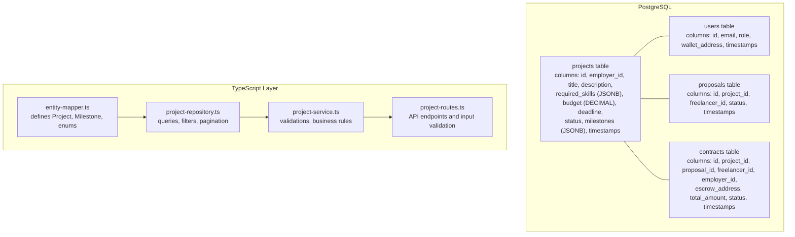
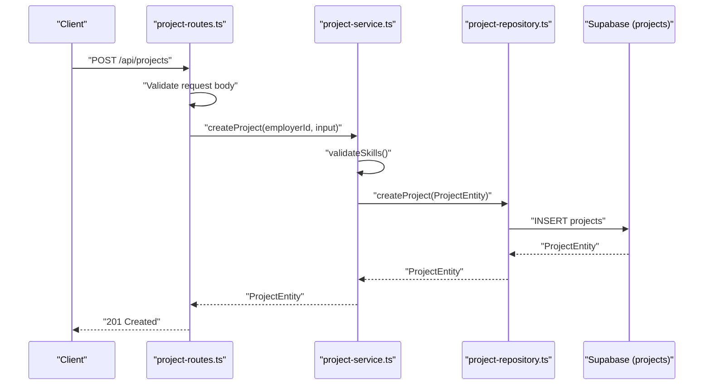
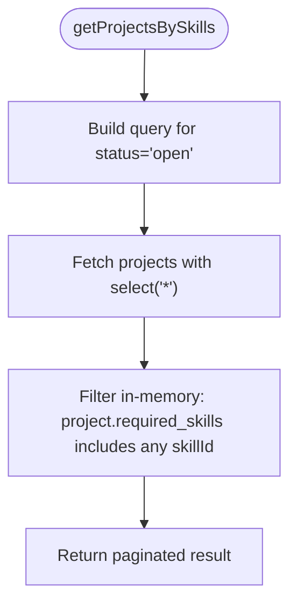
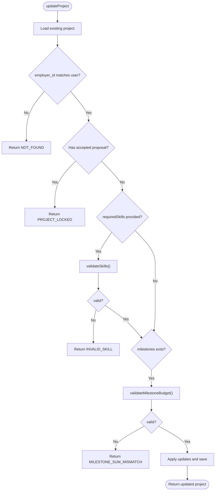
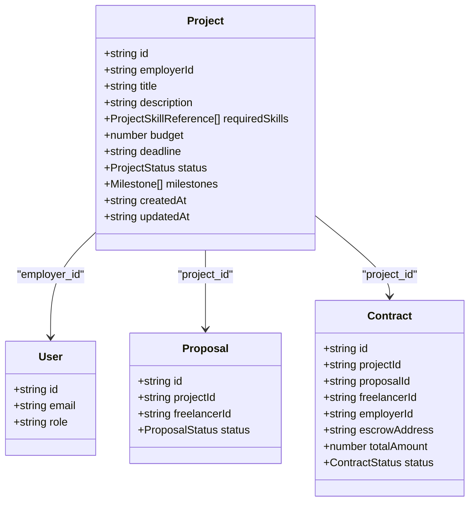

# Project Model

<cite>
**Referenced Files in This Document**
- [schema.sql](file://supabase/schema.sql)
- [entity-mapper.ts](file://src/utils/entity-mapper.ts)
- [project.ts](file://src/models/project.ts)
- [user.ts](file://src/models/user.ts)
- [proposal.ts](file://src/models/proposal.ts)
- [contract.ts](file://src/models/contract.ts)
- [project-repository.ts](file://src/repositories/project-repository.ts)
- [base-repository.ts](file://src/repositories/base-repository.ts)
- [project-service.ts](file://src/services/project-service.ts)
- [project-routes.ts](file://src/routes/project-routes.ts)
- [supabase.ts](file://src/config/supabase.ts)
</cite>

## Table of Contents
1. [Introduction](#introduction)
2. [Project Structure](#project-structure)
3. [Core Components](#core-components)
4. [Architecture Overview](#architecture-overview)
5. [Detailed Component Analysis](#detailed-component-analysis)
6. [Dependency Analysis](#dependency-analysis)
7. [Performance Considerations](#performance-considerations)
8. [Troubleshooting Guide](#troubleshooting-guide)
9. [Conclusion](#conclusion)
10. [Appendices](#appendices)

## Introduction
This document provides comprehensive data model documentation for the Project model in the FreelanceXchain platform. It covers the TypeScript and PostgreSQL definitions, fields and constraints, milestone-based delivery support, skill-based matching, foreign key relationships, associations with Proposal and Contract models, indexes for efficient search, and the ProjectRepository’s data access patterns and business rule enforcement. It also includes validation logic for budget ranges and milestone configurations, and a sample project record with milestones and required skills.

## Project Structure
The Project model is defined and used across several layers:
- PostgreSQL schema defines the database table and constraints.
- Entity mapper translates between database entities and API models.
- Repositories encapsulate data access and pagination.
- Services enforce business rules and validations.
- Routes define the API surface and input validation.

**Diagram sources**
- [schema.sql](file://supabase/schema.sql#L65-L78)
- [entity-mapper.ts](file://src/utils/entity-mapper.ts#L198-L250)
- [project-repository.ts](file://src/repositories/project-repository.ts#L1-L191)
- [project-service.ts](file://src/services/project-service.ts#L1-L388)
- [project-routes.ts](file://src/routes/project-routes.ts#L1-L684)

**Section sources**
- [schema.sql](file://supabase/schema.sql#L65-L78)
- [entity-mapper.ts](file://src/utils/entity-mapper.ts#L198-L250)
- [project-repository.ts](file://src/repositories/project-repository.ts#L1-L191)
- [project-service.ts](file://src/services/project-service.ts#L1-L388)
- [project-routes.ts](file://src/routes/project-routes.ts#L1-L684)

## Core Components
- Project entity definition and types:
  - Project fields include identifiers, metadata, budget, deadlines, status, arrays of required skills and milestones, and timestamps.
  - Enums for ProjectStatus and MilestoneStatus are defined in the entity mapper.
- PostgreSQL schema:
  - projects table with UUID primary key, foreign key to users (employer), JSONB columns for required_skills and milestones, DECIMAL budget, TIMESTAMPTZ deadline, and constrained status values.
- Indexes:
  - Index on projects(status) supports filtering by status efficiently.
  - Additional indexes exist for performance on other tables.

**Section sources**
- [entity-mapper.ts](file://src/utils/entity-mapper.ts#L198-L250)
- [schema.sql](file://supabase/schema.sql#L65-L78)
- [schema.sql](file://supabase/schema.sql#L202-L224)

## Architecture Overview
The Project model participates in a layered architecture:
- API routes receive requests and validate inputs.
- Services apply business rules and validations.
- Repositories perform database queries and pagination.
- Entity mapper converts between database and API models.

**Diagram sources**
- [project-routes.ts](file://src/routes/project-routes.ts#L271-L332)
- [project-service.ts](file://src/services/project-service.ts#L85-L119)
- [project-repository.ts](file://src/repositories/project-repository.ts#L35-L45)
- [schema.sql](file://supabase/schema.sql#L65-L78)

## Detailed Component Analysis

### Data Model Definition (TypeScript and PostgreSQL)
- Project fields and constraints:
  - id: UUID primary key
  - employer_id: UUID foreign key referencing users.id with cascade delete
  - title: non-empty string
  - description: text
  - required_skills: JSONB array of skill references with skill_id, skill_name, category_id, years_of_experience
  - budget: DECIMAL(12,2) with default 0
  - deadline: TIMESTAMPTZ
  - status: constrained to draft, open, in_progress, completed, cancelled
  - milestones: JSONB array of milestone objects with id, title, description, amount, due_date, status
  - created_at, updated_at: TIMESTAMPTZ defaults

- Enums:
  - ProjectStatus: draft | open | in_progress | completed | cancelled
  - MilestoneStatus: pending | in_progress | submitted | approved | disputed

- Associations:
  - One-to-many with Proposal via project_id
  - One-to-many with Contract via project_id
  - Many-to-one with User (employer) via employer_id

- Indexes:
  - projects(status) for efficient filtering
  - Additional indexes exist for other tables

**Section sources**
- [schema.sql](file://supabase/schema.sql#L65-L78)
- [schema.sql](file://supabase/schema.sql#L202-L224)
- [entity-mapper.ts](file://src/utils/entity-mapper.ts#L198-L250)

### Foreign Key Relationship to User (Owner)
- projects.employer_id references users.id with ON DELETE CASCADE.
- This ensures ownership validation and cascading deletion of projects when an employer account is removed.

**Section sources**
- [schema.sql](file://supabase/schema.sql#L65-L78)
- [user.ts](file://src/models/user.ts#L1-L4)

### Associations with Proposal and Contract
- projects.id -> proposals.project_id (one-to-many)
- projects.id -> contracts.project_id (one-to-many)
- contracts also link to proposals and users (freelancer and employer)

**Section sources**
- [schema.sql](file://supabase/schema.sql#L80-L106)
- [proposal.ts](file://src/models/proposal.ts#L1-L3)
- [contract.ts](file://src/models/contract.ts#L1-L3)

### Indexes for Efficient Search and Filtering
- projects(status) index enables fast filtering by status.
- Other indexes exist for performance on related tables.

**Section sources**
- [schema.sql](file://supabase/schema.sql#L202-L224)

### ProjectRepository Data Access and Pagination
- Provides CRUD operations and search/filtering:
  - createProject, getProjectById, updateProject, deleteProject
  - getProjectsByEmployer with pagination
  - getAllOpenProjects with pagination
  - getProjectsByStatus with pagination
  - getProjectsBySkills with server-side status filter and in-memory skill matching
  - getProjectsByBudgetRange with gte/lte filters
  - searchProjects with ilike on title and description
- Pagination uses range queries and count for hasMore and total.

**Diagram sources**
- [project-repository.ts](file://src/repositories/project-repository.ts#L118-L142)

**Section sources**
- [project-repository.ts](file://src/repositories/project-repository.ts#L35-L191)
- [base-repository.ts](file://src/repositories/base-repository.ts#L1-L149)
- [supabase.ts](file://src/config/supabase.ts#L1-L22)

### Business Rules Enforced by ProjectService
- Ownership validation:
  - Update, set milestones, and delete operations check that employer_id matches the authenticated user.
- Project locking:
  - Cannot update or modify milestones if the project has an accepted proposal.
- Skill validation:
  - Validates that required skill IDs correspond to active skills.
- Budget and milestone validation:
  - Ensures milestone amounts sum to the project budget.
- Status transitions:
  - Status values are constrained by the schema; service updates can set status to draft, open, in_progress, completed, or cancelled.

**Diagram sources**
- [project-service.ts](file://src/services/project-service.ts#L132-L200)
- [project-service.ts](file://src/services/project-service.ts#L47-L56)

**Section sources**
- [project-service.ts](file://src/services/project-service.ts#L132-L200)
- [project-service.ts](file://src/services/project-service.ts#L202-L251)
- [project-service.ts](file://src/services/project-service.ts#L253-L300)
- [project-service.ts](file://src/services/project-service.ts#L365-L388)

### API Endpoints and Validation
- GET /api/projects: supports keyword, skills, minBudget/maxBudget filters, and pagination.
- GET /api/projects/:id: retrieves a project by ID.
- POST /api/projects: creates a project with validation for title length, description length, requiredSkills presence and UUID format, budget minimum, and deadline presence.
- PATCH /api/projects/:id: updates a project with validation for title and description lengths, budget minimum, and status enum.
- POST /api/projects/:id/milestones: sets milestones with validation for required fields and positive amounts.

**Section sources**
- [project-routes.ts](file://src/routes/project-routes.ts#L132-L168)
- [project-routes.ts](file://src/routes/project-routes.ts#L199-L215)
- [project-routes.ts](file://src/routes/project-routes.ts#L271-L332)
- [project-routes.ts](file://src/routes/project-routes.ts#L395-L447)
- [project-routes.ts](file://src/routes/project-routes.ts#L512-L573)

### Sample Project Record
- Fields:
  - id: UUID
  - employer_id: UUID (owner)
  - title: string
  - description: text
  - required_skills: array of skill references (skill_id, skill_name, category_id, years_of_experience)
  - budget: DECIMAL (e.g., 5000.00)
  - deadline: TIMESTAMPTZ
  - status: one of draft, open, in_progress, completed, cancelled
  - milestones: array of milestone objects (id, title, description, amount, due_date, status)
  - created_at, updated_at: TIMESTAMPTZ

- Example scenario:
  - A project with two milestones:
    - Milestone 1: amount = 3000.00, due_date = 2025-06-01T00:00:00Z, status = pending
    - Milestone 2: amount = 2000.00, due_date = 2025-06-15T00:00:00Z, status = pending
  - required_skills: two skills with years_of_experience set appropriately
  - budget equals sum of milestone amounts (5000.00)

**Section sources**
- [entity-mapper.ts](file://src/utils/entity-mapper.ts#L202-L223)
- [project-service.ts](file://src/services/project-service.ts#L202-L251)

## Dependency Analysis
- Project depends on:
  - User (owner) via employer_id foreign key
  - Proposal via project_id foreign key
  - Contract via project_id foreign key
- Repositories depend on Supabase client and table names.
- Services depend on repositories and skill repository for skill validation.

**Diagram sources**
- [entity-mapper.ts](file://src/utils/entity-mapper.ts#L198-L311)
- [schema.sql](file://supabase/schema.sql#L65-L106)

**Section sources**
- [entity-mapper.ts](file://src/utils/entity-mapper.ts#L198-L311)
- [schema.sql](file://supabase/schema.sql#L65-L106)

## Performance Considerations
- Use projects(status) index for filtering by status.
- Prefer server-side filters (budget range, keyword search) rather than client-side filtering where possible.
- Pagination via range queries and exact counts for hasMore and total.
- JSONB columns (required_skills, milestones) enable flexible storage but consider indexing strategies if querying deeply within JSONB becomes frequent.

**Section sources**
- [schema.sql](file://supabase/schema.sql#L202-L224)
- [project-repository.ts](file://src/repositories/project-repository.ts#L55-L94)
- [project-repository.ts](file://src/repositories/project-repository.ts#L144-L165)
- [project-repository.ts](file://src/repositories/project-repository.ts#L167-L187)

## Troubleshooting Guide
Common issues and resolutions:
- NOT_FOUND:
  - Occurs when project does not exist or employer does not match. Ensure correct project ID and authenticated employer ownership.
- PROJECT_LOCKED:
  - Cannot update or modify milestones if an accepted proposal exists. Withdraw or reject proposals before changes.
- INVALID_SKILL:
  - One or more skill IDs are invalid or inactive. Verify skill IDs and ensure skills are active.
- MILESTONE_SUM_MISMATCH:
  - Sum of milestone amounts must equal project budget. Adjust milestone amounts accordingly.
- VALIDATION_ERROR:
  - Title and description length constraints, budget minimum, requiredSkills format, and milestone fields validation failures. Review request payload.

**Section sources**
- [project-service.ts](file://src/services/project-service.ts#L132-L200)
- [project-service.ts](file://src/services/project-service.ts#L202-L251)
- [project-service.ts](file://src/services/project-service.ts#L253-L300)
- [project-routes.ts](file://src/routes/project-routes.ts#L286-L319)
- [project-routes.ts](file://src/routes/project-routes.ts#L410-L429)
- [project-routes.ts](file://src/routes/project-routes.ts#L528-L546)

## Conclusion
The Project model in FreelanceXchain integrates robust data modeling with milestone-based delivery and skill-based matching. Its PostgreSQL schema enforces referential integrity and constrained statuses, while the TypeScript layer provides strong typing and validation. The ProjectRepository offers efficient querying and pagination, and ProjectService enforces critical business rules such as ownership, project locking, and budget alignment with milestones. Together, these components support scalable and secure project lifecycle management.

## Appendices

### Field Reference: TypeScript vs PostgreSQL
- id: UUID (primary key)
- employer_id: UUID (foreign key to users.id)
- title: string
- description: text
- required_skills: JSONB array of skill references
- budget: DECIMAL(12,2)
- deadline: TIMESTAMPTZ
- status: varchar with CHECK constraint
- milestones: JSONB array of milestone objects
- created_at, updated_at: TIMESTAMPTZ

**Section sources**
- [schema.sql](file://supabase/schema.sql#L65-L78)
- [entity-mapper.ts](file://src/utils/entity-mapper.ts#L202-L223)