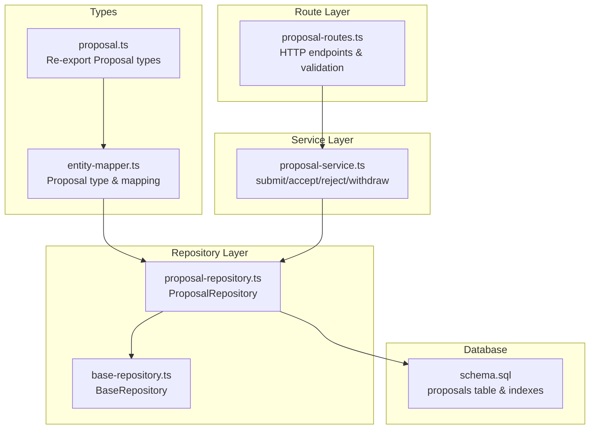
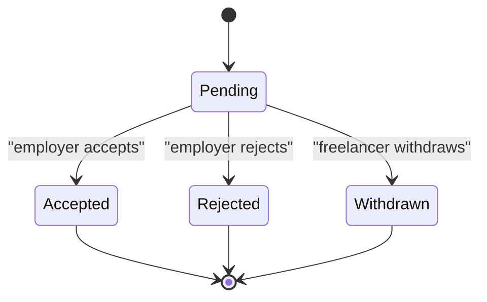
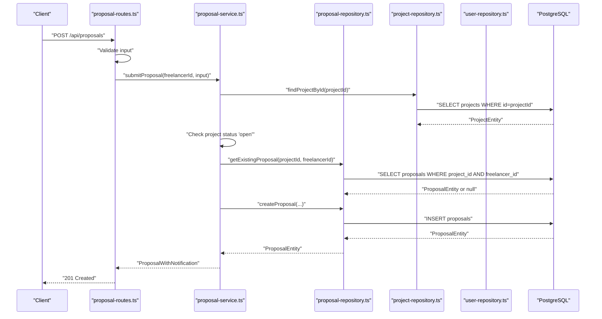
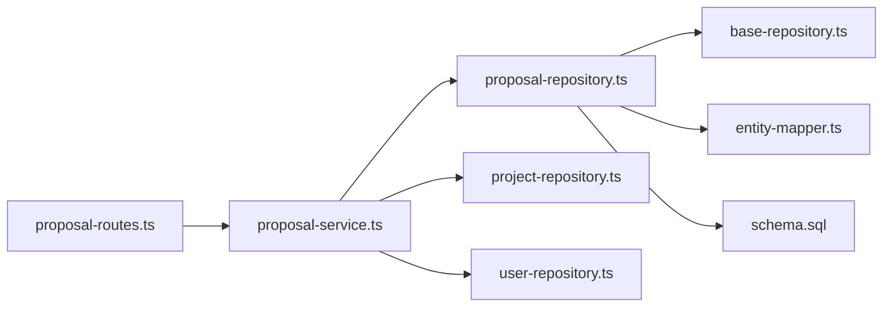

# Proposal Model

<cite>
**Referenced Files in This Document**
- [proposal.ts](file://src/models/proposal.ts)
- [proposal-repository.ts](file://src/repositories/proposal-repository.ts)
- [proposal-service.ts](file://src/services/proposal-service.ts)
- [proposal-routes.ts](file://src/routes/proposal-routes.ts)
- [entity-mapper.ts](file://src/utils/entity-mapper.ts)
- [schema.sql](file://supabase/schema.sql)
- [project.ts](file://src/models/project.ts)
- [user.ts](file://src/models/user.ts)
- [project-repository.ts](file://src/repositories/project-repository.ts)
- [user-repository.ts](file://src/repositories/user-repository.ts)
- [base-repository.ts](file://src/repositories/base-repository.ts)
- [validation-middleware.ts](file://src/middleware/validation-middleware.ts)
</cite>

## Table of Contents
1. [Introduction](#introduction)
2. [Project Structure](#project-structure)
3. [Core Components](#core-components)
4. [Architecture Overview](#architecture-overview)
5. [Detailed Component Analysis](#detailed-component-analysis)
6. [Dependency Analysis](#dependency-analysis)
7. [Performance Considerations](#performance-considerations)
8. [Troubleshooting Guide](#troubleshooting-guide)
9. [Conclusion](#conclusion)
10. [Appendices](#appendices)

## Introduction
This document provides comprehensive data model documentation for the Proposal model in the FreelanceXchain platform. It covers the PostgreSQL schema definition, TypeScript type definitions, lifecycle of a proposal from submission to acceptance or rejection, foreign key relationships, unique constraints, indexes, access control and state transitions managed by the ProposalRepository and ProposalService, and validation rules for ensuring data integrity.

## Project Structure
The Proposal model spans several layers:
- Data model re-export for backward compatibility
- Repository layer for database access
- Service layer for business logic and access control
- Route layer for HTTP endpoints and validation
- Entity mapper for type conversion between database and API models
- PostgreSQL schema defining constraints and indexes



**Diagram sources**
- [proposal.ts](file://src/models/proposal.ts#L1-L3)
- [entity-mapper.ts](file://src/utils/entity-mapper.ts#L252-L279)
- [proposal-repository.ts](file://src/repositories/proposal-repository.ts#L1-L113)
- [base-repository.ts](file://src/repositories/base-repository.ts#L1-L149)
- [proposal-service.ts](file://src/services/proposal-service.ts#L1-L414)
- [proposal-routes.ts](file://src/routes/proposal-routes.ts#L1-L458)
- [schema.sql](file://supabase/schema.sql#L80-L93)

**Section sources**
- [proposal.ts](file://src/models/proposal.ts#L1-L3)
- [entity-mapper.ts](file://src/utils/entity-mapper.ts#L252-L279)
- [proposal-repository.ts](file://src/repositories/proposal-repository.ts#L1-L113)
- [proposal-service.ts](file://src/services/proposal-service.ts#L1-L414)
- [proposal-routes.ts](file://src/routes/proposal-routes.ts#L1-L458)
- [schema.sql](file://supabase/schema.sql#L80-L93)

## Core Components
- Proposal entity fields and types:
  - id: UUID (primary key)
  - project_id: UUID (foreign key to projects)
  - freelancer_id: UUID (foreign key to users)
  - cover_letter: text
  - proposed_rate: decimal(10,2)
  - estimated_duration: integer (days)
  - status: enum with values pending, accepted, rejected, withdrawn
  - created_at: timestamptz
  - updated_at: timestamptz
- Unique constraint: (project_id, freelancer_id) prevents duplicate proposals from the same freelancer for the same project.
- Indexes: project_id, freelancer_id, and composite indexes for efficient querying.

**Section sources**
- [schema.sql](file://supabase/schema.sql#L80-L93)
- [proposal-repository.ts](file://src/repositories/proposal-repository.ts#L6-L16)
- [entity-mapper.ts](file://src/utils/entity-mapper.ts#L252-L279)

## Architecture Overview
The Proposal model integrates with Project and User models via foreign keys. The service layer enforces access control and state transitions, while the route layer validates inputs and returns appropriate HTTP responses.

```mermaid
erDiagram
USERS {
uuid id PK
varchar email UK
varchar role
varchar wallet_address
timestamptz created_at
timestamptz updated_at
}
PROJECTS {
uuid id PK
uuid employer_id FK
varchar title
text description
jsonb required_skills
decimal budget
timestamptz deadline
varchar status
jsonb milestones
timestamptz created_at
timestamptz updated_at
}
PROPOSALS {
uuid id PK
uuid project_id FK
uuid freelancer_id FK
text cover_letter
decimal proposed_rate
integer estimated_duration
varchar status
timestamptz created_at
timestamptz updated_at
unique(project_id, freelancer_id)
}
USERS ||--o{ PROPOSALS : "freelancer"
PROJECTS ||--o{ PROPOSALS : "project"
```

**Diagram sources**
- [schema.sql](file://supabase/schema.sql#L8-L17)
- [schema.sql](file://supabase/schema.sql#L66-L78)
- [schema.sql](file://supabase/schema.sql#L80-L93)

**Section sources**
- [schema.sql](file://supabase/schema.sql#L8-L17)
- [schema.sql](file://supabase/schema.sql#L66-L78)
- [schema.sql](file://supabase/schema.sql#L80-L93)

## Detailed Component Analysis

### Data Model Definition (PostgreSQL)
- Fields and constraints:
  - id: UUID primary key with default uuid_generate_v4()
  - project_id: UUID references projects(id) with cascade delete
  - freelancer_id: UUID references users(id) with cascade delete
  - cover_letter: text
  - proposed_rate: decimal(10,2) default 0
  - estimated_duration: integer default 0
  - status: varchar default 'pending' with check constraint for allowed values
  - created_at, updated_at: timestamptz defaults
  - UNIQUE(project_id, freelancer_id) ensures a freelancer can submit only one proposal per project
- Indexes:
  - idx_proposals_project_id
  - idx_proposals_freelancer_id
  - Additional indexes exist for other tables; proposal-specific indexes are present in the schema.

**Section sources**
- [schema.sql](file://supabase/schema.sql#L80-L93)
- [schema.sql](file://supabase/schema.sql#L202-L224)

### Data Model Definition (TypeScript)
- Proposal type mirrors the database schema with camelCase properties:
  - id: string
  - projectId: string
  - freelancerId: string
  - coverLetter: string
  - proposedRate: number
  - estimatedDuration: number
  - status: 'pending' | 'accepted' | 'rejected' | 'withdrawn'
  - createdAt: string
  - updatedAt: string
- ProposalEntity interface used by the repository layer with snake_case fields.

**Section sources**
- [entity-mapper.ts](file://src/utils/entity-mapper.ts#L252-L279)
- [proposal-repository.ts](file://src/repositories/proposal-repository.ts#L6-L16)

### Lifecycle of a Proposal
- Submission:
  - Freelancer submits a proposal for an open project.
  - Duplicate proposals are prevented by the unique constraint and service-level check.
  - Status initialized as pending.
- Review and Decision:
  - Employer can accept or reject a pending proposal.
  - Accepting triggers contract creation and blockchain agreement setup.
  - Rejecting updates status to rejected.
- Withdrawal:
  - Freelancer can withdraw a pending proposal.
- Finalization:
  - After acceptance, project status transitions to in_progress.



**Diagram sources**
- [proposal-service.ts](file://src/services/proposal-service.ts#L174-L296)
- [proposal-service.ts](file://src/services/proposal-service.ts#L299-L370)
- [proposal-service.ts](file://src/services/proposal-service.ts#L372-L414)

**Section sources**
- [proposal-service.ts](file://src/services/proposal-service.ts#L63-L126)
- [proposal-service.ts](file://src/services/proposal-service.ts#L174-L296)
- [proposal-service.ts](file://src/services/proposal-service.ts#L299-L370)
- [proposal-service.ts](file://src/services/proposal-service.ts#L372-L414)

### Foreign Key Relationships
- Proposal.project_id -> Project.id (ON DELETE CASCADE)
- Proposal.freelancer_id -> User.id (ON DELETE CASCADE)
- These relationships ensure referential integrity and automatic cleanup when projects or users are removed.

**Section sources**
- [schema.sql](file://supabase/schema.sql#L80-L93)
- [project-repository.ts](file://src/repositories/project-repository.ts#L16-L28)
- [user-repository.ts](file://src/repositories/user-repository.ts#L4-L13)

### Unique Constraint
- UNIQUE(project_id, freelancer_id) prevents duplicate proposals from the same freelancer for the same project.
- The service layer also checks for existing proposals before insertion.

**Section sources**
- [schema.sql](file://supabase/schema.sql#L91-L91)
- [proposal-service.ts](file://src/services/proposal-service.ts#L86-L93)
- [proposal-repository.ts](file://src/repositories/proposal-repository.ts#L95-L109)

### Indexes for Efficient Querying
- project_id: Supports queries by project (e.g., listing proposals for a project)
- freelancer_id: Supports queries by freelancer (e.g., retrieving a freelancer’s proposals)
- Additional indexes exist for performance across the schema.

**Section sources**
- [schema.sql](file://supabase/schema.sql#L202-L224)
- [proposal-repository.ts](file://src/repositories/proposal-repository.ts#L39-L58)
- [proposal-repository.ts](file://src/repositories/proposal-repository.ts#L60-L69)

### Access Control and State Transitions (ProposalRepository and ProposalService)
- ProposalRepository:
  - Provides CRUD operations and specialized queries (by project, by freelancer, count, existence check).
  - Uses BaseRepository for standardized database operations and timestamp management.
- ProposalService:
  - Enforces access control:
    - Only freelancers can submit proposals.
    - Only employers can accept/reject proposals.
    - Only the proposal owner can withdraw.
  - Validates state transitions:
    - Accept/Reject only allowed when status is pending.
    - Withdraw only allowed when status is pending.
  - Performs cross-entity validations:
    - Checks project existence and open status.
    - Ensures uniqueness constraint is respected.
  - Triggers side effects:
    - Creates notifications for employer and freelancer.
    - On acceptance, creates a contract and interacts with blockchain services.
    - Updates project status to in_progress upon acceptance.



**Diagram sources**
- [proposal-routes.ts](file://src/routes/proposal-routes.ts#L97-L153)
- [proposal-service.ts](file://src/services/proposal-service.ts#L63-L126)
- [proposal-repository.ts](file://src/repositories/proposal-repository.ts#L23-L41)
- [project-repository.ts](file://src/repositories/project-repository.ts#L51-L53)
- [schema.sql](file://supabase/schema.sql#L80-L93)

**Section sources**
- [proposal-repository.ts](file://src/repositories/proposal-repository.ts#L1-L113)
- [base-repository.ts](file://src/repositories/base-repository.ts#L39-L86)
- [proposal-service.ts](file://src/services/proposal-service.ts#L63-L126)
- [proposal-service.ts](file://src/services/proposal-service.ts#L174-L296)
- [proposal-service.ts](file://src/services/proposal-service.ts#L299-L370)
- [proposal-service.ts](file://src/services/proposal-service.ts#L372-L414)

### Validation Rules
- Route-level validation (Swagger and validation middleware):
  - projectId: required, UUID format
  - coverLetter: required, minimum length 10
  - proposedRate: required, numeric, minimum 1
  - estimatedDuration: required, numeric, minimum 1 (days)
- Service-level validation:
  - Project existence and open status
  - Duplicate proposal prevention
  - State transition checks (pending only for accept/reject/withdraw)
  - Ownership checks (employer for accept/reject, freelancer for withdrawal)

**Section sources**
- [proposal-routes.ts](file://src/routes/proposal-routes.ts#L111-L126)
- [validation-middleware.ts](file://src/middleware/validation-middleware.ts#L592-L603)
- [proposal-service.ts](file://src/services/proposal-service.ts#L63-L93)
- [proposal-service.ts](file://src/services/proposal-service.ts#L174-L210)
- [proposal-service.ts](file://src/services/proposal-service.ts#L299-L335)
- [proposal-service.ts](file://src/services/proposal-service.ts#L372-L400)

### Sample Proposal Record
- Example fields (values are illustrative):
  - id: "a1b2c3d4-e5f6-a7b8-c9d0-e1f2a3b4c5d6"
  - projectId: "f6e5d4c3-b2a1-f0e9d8c7-b6a5f4e3d2c1"
  - freelancerId: "b9a8f7e6-d5c4-b3a2-f1e0-d9c8b7a6f5e4"
  - coverLetter: "I am an experienced developer who can deliver this project on time..."
  - proposedRate: 75.50
  - estimatedDuration: 30
  - status: "pending"
  - createdAt: "2025-01-10T12:00:00Z"
  - updatedAt: "2025-01-10T12:00:00Z"

**Section sources**
- [entity-mapper.ts](file://src/utils/entity-mapper.ts#L252-L279)
- [proposal-repository.ts](file://src/repositories/proposal-repository.ts#L6-L16)

## Dependency Analysis
- Internal dependencies:
  - proposal-service depends on proposal-repository, project-repository, user-repository, and entity-mapper.
  - proposal-repository extends BaseRepository and operates on the proposals table.
  - proposal-routes depend on proposal-service and validation middleware.
- External dependencies:
  - Supabase client for database operations.
  - Blockchain services for agreement creation/signing on acceptance.



**Diagram sources**
- [proposal-routes.ts](file://src/routes/proposal-routes.ts#L1-L458)
- [proposal-service.ts](file://src/services/proposal-service.ts#L1-L414)
- [proposal-repository.ts](file://src/repositories/proposal-repository.ts#L1-L113)
- [base-repository.ts](file://src/repositories/base-repository.ts#L1-L149)
- [entity-mapper.ts](file://src/utils/entity-mapper.ts#L252-L279)
- [schema.sql](file://supabase/schema.sql#L80-L93)

**Section sources**
- [proposal-service.ts](file://src/services/proposal-service.ts#L1-L414)
- [proposal-repository.ts](file://src/repositories/proposal-repository.ts#L1-L113)
- [proposal-routes.ts](file://src/routes/proposal-routes.ts#L1-L458)
- [schema.sql](file://supabase/schema.sql#L80-L93)

## Performance Considerations
- Indexes on project_id and freelancer_id enable fast filtering and sorting for proposal listings.
- Pagination support in BaseRepository helps manage large result sets efficiently.
- Unique constraint prevents duplicate inserts and maintains data integrity.

**Section sources**
- [schema.sql](file://supabase/schema.sql#L202-L224)
- [proposal-repository.ts](file://src/repositories/proposal-repository.ts#L39-L58)
- [proposal-repository.ts](file://src/repositories/proposal-repository.ts#L60-L69)
- [base-repository.ts](file://src/repositories/base-repository.ts#L129-L147)

## Troubleshooting Guide
- Common errors and causes:
  - NOT_FOUND: Project or proposal not found; verify IDs and existence.
  - DUPLICATE_PROPOSAL: Unique constraint violation; ensure freelancer has not already proposed.
  - INVALID_STATUS: Attempt to accept/reject/withdraw non-pending proposal; check current status.
  - UNAUTHORIZED: Employer attempting to accept/reject proposals for projects they do not own; or freelancer withdrawing proposals they do not own.
  - VALIDATION_ERROR: Missing or invalid fields; confirm UUID format, minimum lengths, and numeric constraints.
- Resolution steps:
  - Validate input using route-level validators and middleware.
  - Confirm project status is open before submission.
  - Ensure only the correct party performs actions (employer vs freelancer).
  - Check database constraints and indexes for performance and correctness.

**Section sources**
- [proposal-service.ts](file://src/services/proposal-service.ts#L63-L126)
- [proposal-service.ts](file://src/services/proposal-service.ts#L174-L210)
- [proposal-service.ts](file://src/services/proposal-service.ts#L299-L335)
- [proposal-service.ts](file://src/services/proposal-service.ts#L372-L400)
- [proposal-routes.ts](file://src/routes/proposal-routes.ts#L111-L126)
- [validation-middleware.ts](file://src/middleware/validation-middleware.ts#L592-L603)

## Conclusion
The Proposal model in FreelanceXchain is designed with strong relational integrity, clear state transitions, robust access control, and efficient indexing. The TypeScript and PostgreSQL schemas align closely, ensuring predictable behavior across the stack. Validation rules at both route and service layers guarantee data quality, while the repository and service layers encapsulate business logic and database operations.

## Appendices

### Field Reference: TypeScript vs PostgreSQL
- id: string (UUID) vs uuid (PostgreSQL)
- projectId: string (UUID) vs project_id: uuid (PostgreSQL)
- freelancerId: string (UUID) vs freelancer_id: uuid (PostgreSQL)
- coverLetter: string vs cover_letter: text (PostgreSQL)
- proposedRate: number vs proposed_rate: decimal(10,2) (PostgreSQL)
- estimatedDuration: number vs estimated_duration: integer (PostgreSQL)
- status: 'pending' | 'accepted' | 'rejected' | 'withdrawn' vs status: varchar with check constraint (PostgreSQL)
- createdAt/updatedAt: string vs created_at/updated_at: timestamptz (PostgreSQL)

**Section sources**
- [entity-mapper.ts](file://src/utils/entity-mapper.ts#L252-L279)
- [proposal-repository.ts](file://src/repositories/proposal-repository.ts#L6-L16)
- [schema.sql](file://supabase/schema.sql#L80-L93)