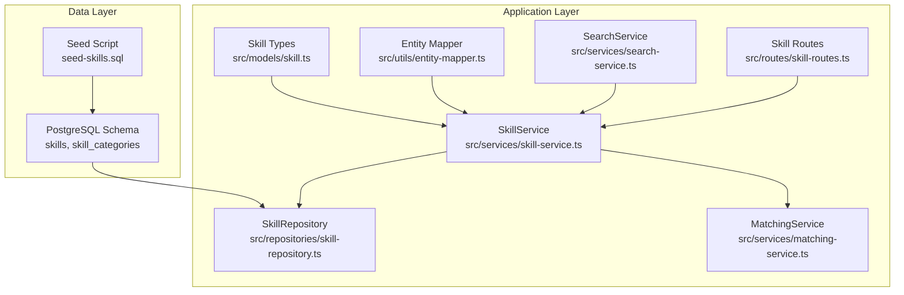
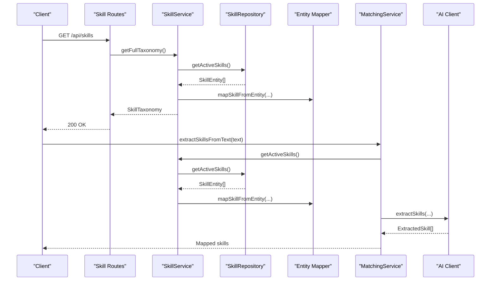
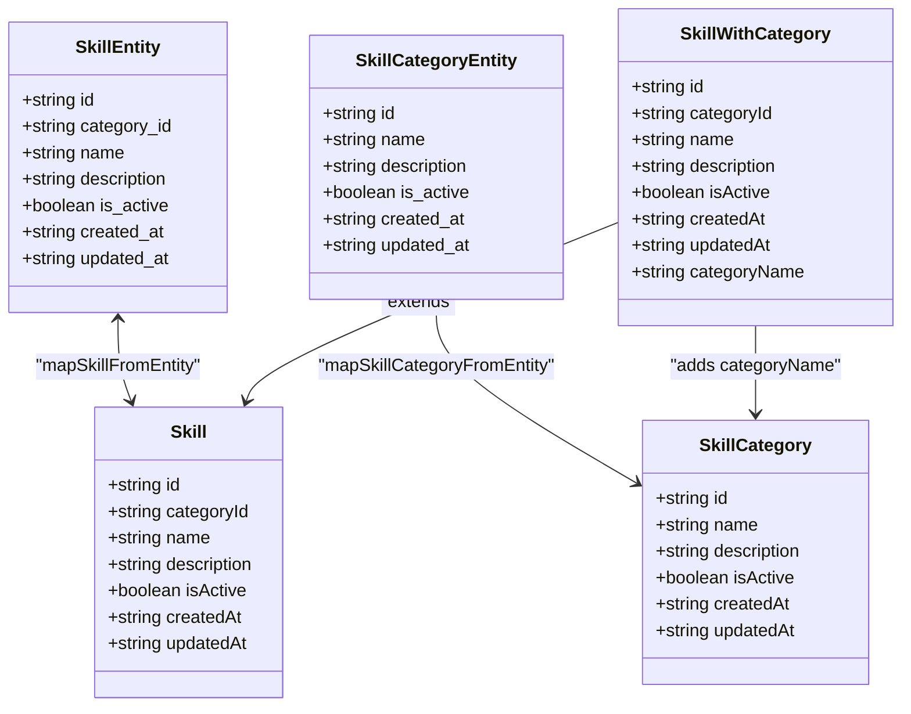
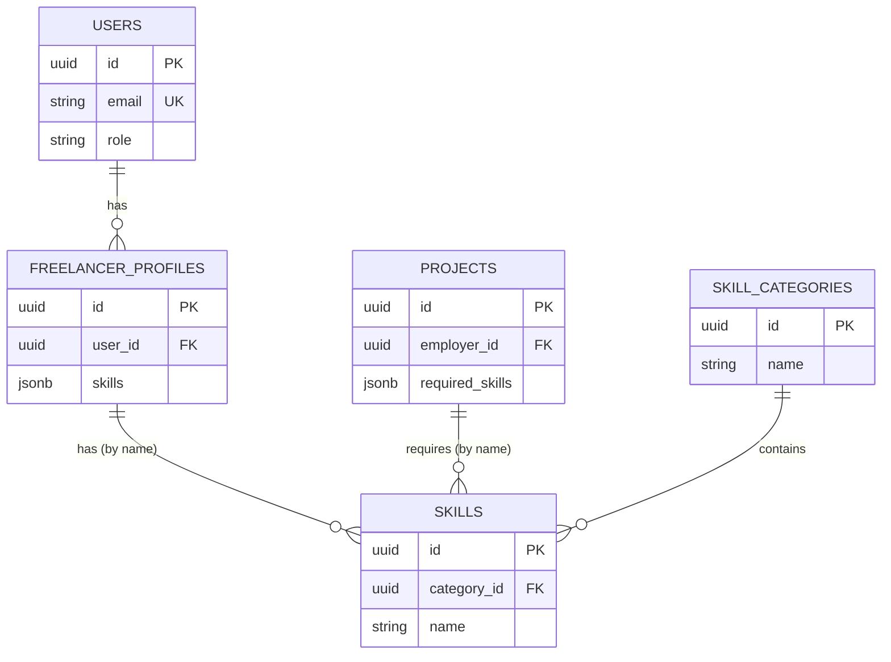
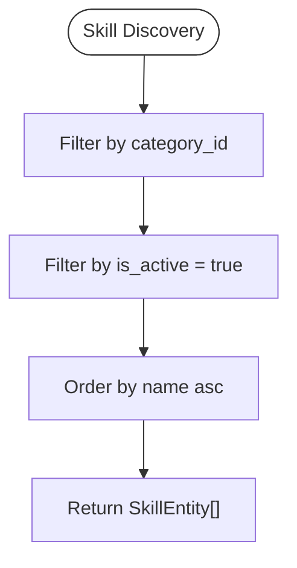
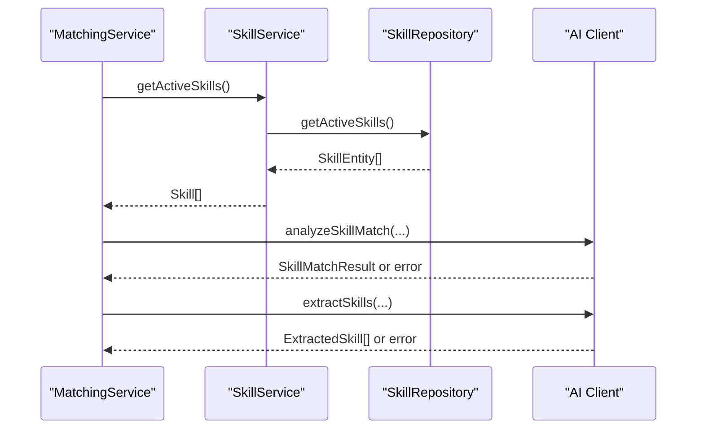
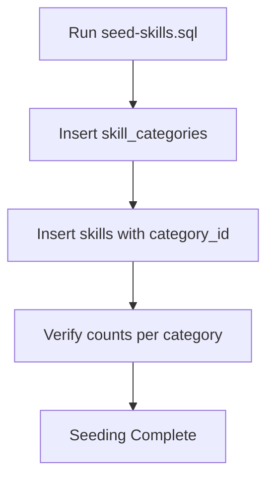
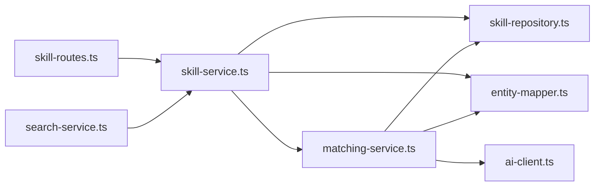

# Skill Model

<cite>
**Referenced Files in This Document**
- [schema.sql](file://supabase/schema.sql)
- [seed-skills.sql](file://supabase/seed-skills.sql)
- [skill.ts](file://src/models/skill.ts)
- [skill-repository.ts](file://src/repositories/skill-repository.ts)
- [skill-service.ts](file://src/services/skill-service.ts)
- [entity-mapper.ts](file://src/utils/entity-mapper.ts)
- [matching-service.ts](file://src/services/matching-service.ts)
- [ai-client.ts](file://src/services/ai-client.ts)
- [search-service.ts](file://src/services/search-service.ts)
- [skill-routes.ts](file://src/routes/skill-routes.ts)
</cite>

## Table of Contents
1. [Introduction](#introduction)
2. [Project Structure](#project-structure)
3. [Core Components](#core-components)
4. [Architecture Overview](#architecture-overview)
5. [Detailed Component Analysis](#detailed-component-analysis)
6. [Dependency Analysis](#dependency-analysis)
7. [Performance Considerations](#performance-considerations)
8. [Troubleshooting Guide](#troubleshooting-guide)
9. [Conclusion](#conclusion)
10. [Appendices](#appendices)

## Introduction
This document provides comprehensive data model documentation for the Skill model in the FreelanceXchain platform. It covers the Skill entity definition, TypeScript and PostgreSQL schemas, relationships to User (via freelancer profiles) and Project (required_skills), indexing for performance, AI-powered matching capabilities, and the SkillRepository’s role in skill discovery and integration with the MatchingService. It also includes validation rules, a sample skill record, and the seeding process from seed-skills.sql.

## Project Structure
The Skill model spans multiple layers:
- Data definition and mapping: TypeScript types and entity mappers
- Persistence: Supabase schema and repository layer
- Business logic: Skill service orchestrating CRUD and taxonomy operations
- AI integration: Matching service leveraging taxonomy for skill matching and extraction
- API exposure: Routes validating and exposing skill taxonomy and search

**Diagram sources**
- [schema.sql](file://supabase/schema.sql#L29-L38)
- [seed-skills.sql](file://supabase/seed-skills.sql#L1-L75)
- [skill.ts](file://src/models/skill.ts#L1-L23)
- [entity-mapper.ts](file://src/utils/entity-mapper.ts#L47-L88)
- [skill-repository.ts](file://src/repositories/skill-repository.ts#L1-L127)
- [skill-service.ts](file://src/services/skill-service.ts#L1-L285)
- [matching-service.ts](file://src/services/matching-service.ts#L1-L391)
- [search-service.ts](file://src/services/search-service.ts#L1-L206)
- [skill-routes.ts](file://src/routes/skill-routes.ts#L1-L300)

**Section sources**
- [schema.sql](file://supabase/schema.sql#L29-L38)
- [seed-skills.sql](file://supabase/seed-skills.sql#L1-L75)
- [skill.ts](file://src/models/skill.ts#L1-L23)
- [entity-mapper.ts](file://src/utils/entity-mapper.ts#L47-L88)
- [skill-repository.ts](file://src/repositories/skill-repository.ts#L1-L127)
- [skill-service.ts](file://src/services/skill-service.ts#L1-L285)
- [matching-service.ts](file://src/services/matching-service.ts#L1-L391)
- [search-service.ts](file://src/services/search-service.ts#L1-L206)
- [skill-routes.ts](file://src/routes/skill-routes.ts#L1-L300)

## Core Components
- Skill entity and taxonomy types
- Skill repository with search and filtering methods
- Skill service for CRUD and taxonomy operations
- Matching service consuming taxonomy for AI-powered matching
- Routes validating and exposing taxonomy and search

**Section sources**
- [skill.ts](file://src/models/skill.ts#L1-L23)
- [skill-repository.ts](file://src/repositories/skill-repository.ts#L1-L127)
- [skill-service.ts](file://src/services/skill-service.ts#L1-L285)
- [matching-service.ts](file://src/services/matching-service.ts#L1-L391)
- [skill-routes.ts](file://src/routes/skill-routes.ts#L1-L300)

## Architecture Overview
The Skill model participates in two primary workflows:
- AI-powered matching: MatchingService consumes active skills from SkillService to compute match scores and extract skills from text.
- Search and filtering: SearchService uses taxonomy to filter projects and freelancers by skills.

**Diagram sources**
- [skill-routes.ts](file://src/routes/skill-routes.ts#L76-L95)
- [skill-service.ts](file://src/services/skill-service.ts#L246-L268)
- [skill-repository.ts](file://src/repositories/skill-repository.ts#L48-L69)
- [entity-mapper.ts](file://src/utils/entity-mapper.ts#L78-L88)
- [matching-service.ts](file://src/services/matching-service.ts#L220-L269)
- [ai-client.ts](file://src/services/ai-client.ts#L1-L200)

## Detailed Component Analysis

### Data Model Definition (TypeScript and PostgreSQL)
- Skill entity fields
  - id: UUID, primary key
  - category_id: UUID, foreign key to skill_categories
  - name: string, required
  - description: text, optional
  - is_active: boolean, default true
  - created_at: timestamptz, default now
  - updated_at: timestamptz, default now
- Skill category entity fields
  - id: UUID, primary key
  - name: string, required
  - description: text, optional
  - is_active: boolean, default true
  - created_at: timestamptz, default now
  - updated_at: timestamptz, default now
- Indexes
  - idx_skills_category_id on skills(category_id)

Constraints and types:
- PostgreSQL enforces NOT NULL on name and category_id references skill_categories(id)
- is_active flags enable soft-deletion semantics
- UUID generation handled by uuid-ossp extension

**Section sources**
- [schema.sql](file://supabase/schema.sql#L29-L38)
- [schema.sql](file://supabase/schema.sql#L202-L224)

### TypeScript Types and Mappings
- Skill and SkillCategory types define the API-facing models with camelCase fields
- Entity mapper converts between database snake_case and API camelCase
- SkillWithCategory augments Skill with categoryName for search results
- SkillTaxonomy groups active categories with their active skills

**Diagram sources**
- [entity-mapper.ts](file://src/utils/entity-mapper.ts#L47-L88)
- [entity-mapper.ts](file://src/utils/entity-mapper.ts#L1-L46)
- [skill.ts](file://src/models/skill.ts#L1-L23)

**Section sources**
- [entity-mapper.ts](file://src/utils/entity-mapper.ts#L47-L88)
- [skill.ts](file://src/models/skill.ts#L1-L23)

### Relationships to User and Project
- User (via freelancer profiles)
  - Freelancer profiles store skills as JSONB with name and years_of_experience
  - SkillService exposes SkillReference for profiles (name and yearsOfExperience)
- Project (required_skills)
  - Projects store required_skills as JSONB with skill_name and optional category_id
  - MatchingService converts project required_skills to SkillInfo for matching

**Diagram sources**
- [schema.sql](file://supabase/schema.sql#L40-L51)
- [schema.sql](file://supabase/schema.sql#L66-L78)
- [schema.sql](file://supabase/schema.sql#L29-L38)
- [entity-mapper.ts](file://src/utils/entity-mapper.ts#L90-L111)
- [entity-mapper.ts](file://src/utils/entity-mapper.ts#L112-L129)
- [matching-service.ts](file://src/services/matching-service.ts#L43-L71)

**Section sources**
- [schema.sql](file://supabase/schema.sql#L40-L51)
- [schema.sql](file://supabase/schema.sql#L66-L78)
- [entity-mapper.ts](file://src/utils/entity-mapper.ts#L90-L111)
- [entity-mapper.ts](file://src/utils/entity-mapper.ts#L112-L129)
- [matching-service.ts](file://src/services/matching-service.ts#L43-L71)

### Indexes for Autocomplete and Filtering
- idx_skills_category_id: accelerates category-based queries and joins
- Additional indexes exist for other tables; skills table RLS enabled for public read

**Diagram sources**
- [skill-repository.ts](file://src/repositories/skill-repository.ts#L71-L94)
- [schema.sql](file://supabase/schema.sql#L202-L224)

**Section sources**
- [schema.sql](file://supabase/schema.sql#L202-L224)
- [skill-repository.ts](file://src/repositories/skill-repository.ts#L71-L94)

### SkillRepository: Skill Discovery and Search
Key methods:
- getAllSkills(), getActiveSkills(): ordered by name
- getSkillsByCategory(), getActiveSkillsByCategory(): filtered by category_id and is_active
- searchSkillsByKeyword(): filters by is_active and matches name or description (case-insensitive)
- getSkillByNameInCategory(): unique lookup by category and name (case-insensitive)

Integration with MatchingService:
- getActiveSkills() feeds MatchingService for skill extraction and matching

**Section sources**
- [skill-repository.ts](file://src/repositories/skill-repository.ts#L48-L123)
- [skill-service.ts](file://src/services/skill-service.ts#L211-L243)

### AI-Powered Matching and Skill Extraction
- MatchingService consumes active skills from SkillService to compute match scores and extract skills from text
- Uses AI client for LLM-based matching/extraction with fallback to keyword-based logic
- Skill taxonomy is the authoritative source for available skills

**Diagram sources**
- [matching-service.ts](file://src/services/matching-service.ts#L220-L269)
- [skill-service.ts](file://src/services/skill-service.ts#L211-L243)
- [skill-repository.ts](file://src/repositories/skill-repository.ts#L48-L69)
- [ai-client.ts](file://src/services/ai-client.ts#L1-L200)

**Section sources**
- [matching-service.ts](file://src/services/matching-service.ts#L1-L391)
- [ai-client.ts](file://src/services/ai-client.ts#L1-L200)
- [skill-service.ts](file://src/services/skill-service.ts#L211-L243)

### Validation Rules for Skill Naming and Categories
- Route-level validation ensures:
  - categoryId is a valid UUID
  - name and description are required and non-empty
- Service-level validation:
  - Unique constraint per category: skill name uniqueness enforced within a category
  - Category existence checked before creating/updating skills
- Category validation:
  - Unique category name enforced
  - Category creation/update requires non-empty name and description

**Section sources**
- [skill-routes.ts](file://src/routes/skill-routes.ts#L273-L300)
- [skill-routes.ts](file://src/routes/skill-routes.ts#L190-L211)
- [skill-service.ts](file://src/services/skill-service.ts#L104-L131)
- [skill-service.ts](file://src/services/skill-service.ts#L144-L190)
- [skill-service.ts](file://src/services/skill-service.ts#L28-L46)

### Sample Skill Record and Seeding
- Seed script inserts predefined categories and skills across domains (Web Development, Mobile Development, Data Science, DevOps, Design, Blockchain)
- Example skill record fields: id, category_id, name, description, is_active
- Verification query included to count skills per category

**Diagram sources**
- [seed-skills.sql](file://supabase/seed-skills.sql#L1-L75)

**Section sources**
- [seed-skills.sql](file://supabase/seed-skills.sql#L1-L75)

## Dependency Analysis
- SkillService depends on SkillRepository and SkillCategoryRepository via entity mapper
- MatchingService depends on SkillService for taxonomy and AI client for LLM operations
- Routes depend on SkillService for taxonomy and search
- SearchService uses taxonomy indirectly via SkillService for skill-based filtering

**Diagram sources**
- [skill-routes.ts](file://src/routes/skill-routes.ts#L1-L300)
- [skill-service.ts](file://src/services/skill-service.ts#L1-L285)
- [skill-repository.ts](file://src/repositories/skill-repository.ts#L1-L127)
- [entity-mapper.ts](file://src/utils/entity-mapper.ts#L47-L88)
- [matching-service.ts](file://src/services/matching-service.ts#L1-L391)
- [ai-client.ts](file://src/services/ai-client.ts#L1-L200)
- [search-service.ts](file://src/services/search-service.ts#L1-L206)

**Section sources**
- [skill-service.ts](file://src/services/skill-service.ts#L1-L285)
- [matching-service.ts](file://src/services/matching-service.ts#L1-L391)
- [search-service.ts](file://src/services/search-service.ts#L1-L206)

## Performance Considerations
- Use getActiveSkills() to avoid inactive records in matching and search
- Leverage category_id index for category-based queries
- Prefer keyword search for quick filtering; AI extraction falls back to keyword extraction when LLM is unavailable
- Pagination in search services prevents large result sets

[No sources needed since this section provides general guidance]

## Troubleshooting Guide
Common issues and resolutions:
- Duplicate skill name within a category: Ensure unique names per category before creation/update
- Category not found: Verify categoryId exists and is a valid UUID
- AI API unconfigured: Configure LLM API key and endpoint; fallback logic applies when unavailable
- Empty keyword search: Provide a non-empty keyword parameter

**Section sources**
- [skill-service.ts](file://src/services/skill-service.ts#L104-L131)
- [skill-service.ts](file://src/services/skill-service.ts#L144-L190)
- [ai-client.ts](file://src/services/ai-client.ts#L76-L120)
- [skill-routes.ts](file://src/routes/skill-routes.ts#L128-L147)

## Conclusion
The Skill model in FreelanceXchain is designed around a robust taxonomy of categories and skills, with strong TypeScript and PostgreSQL definitions, efficient repository methods, and seamless integration with AI-powered matching and search. Validation rules ensure data integrity, while seeding provides a practical foundation for experimentation and development.

## Appendices

### PostgreSQL Schema Summary
- skills table: id, category_id, name, description, is_active, timestamps
- skill_categories table: id, name, description, is_active, timestamps
- Indexes: idx_skills_category_id
- RLS policies: public read on skills and skill_categories

**Section sources**
- [schema.sql](file://supabase/schema.sql#L29-L38)
- [schema.sql](file://supabase/schema.sql#L202-L224)
- [schema.sql](file://supabase/schema.sql#L242-L244)