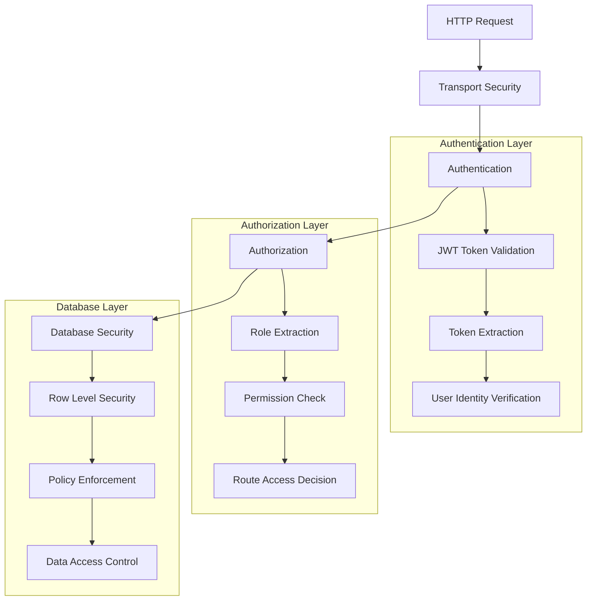
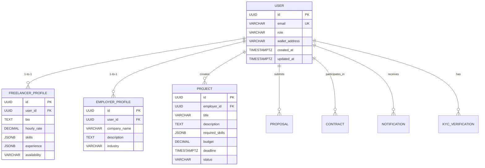
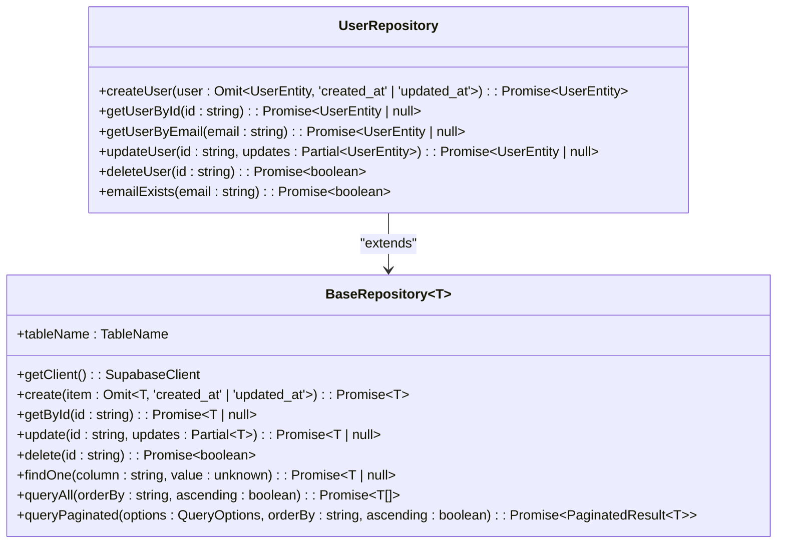
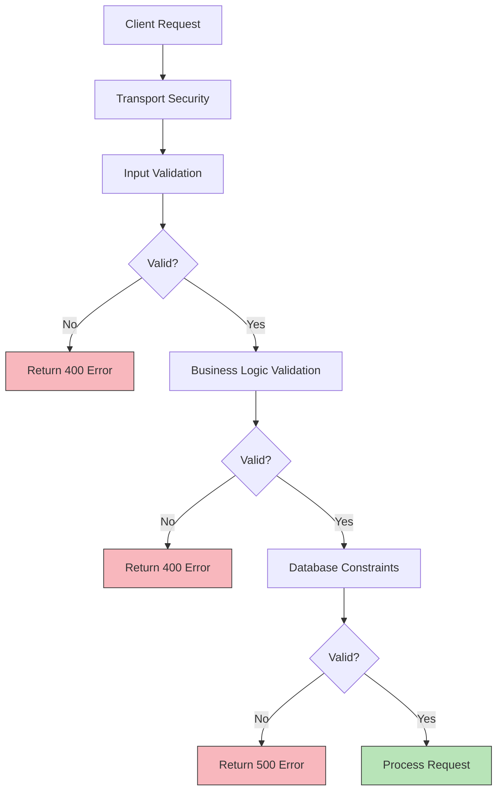

# User Model

<cite>
**Referenced Files in This Document**   
- [user.ts](file://src/models/user.ts)
- [user-repository.ts](file://src/repositories/user-repository.ts)
- [entity-mapper.ts](file://src/utils/entity-mapper.ts)
- [supabase.ts](file://src/config/supabase.ts)
- [schema.sql](file://supabase/schema.sql)
- [auth-middleware.ts](file://src/middleware/auth-middleware.ts)
- [auth-service.ts](file://src/services/auth-service.ts)
- [validation-middleware.ts](file://src/middleware/validation-middleware.ts)
- [auth-routes.ts](file://src/routes/auth-routes.ts)
- [ARCHITECTURE.md](file://docs/ARCHITECTURE.md)
</cite>

## Table of Contents
1. [Introduction](#introduction)
2. [Field Definitions](#field-definitions)
3. [Data Types and Constraints](#data-types-and-constraints)
4. [Role-Based Access Control](#role-based-access-control)
5. [Model Relationships](#model-relationships)
6. [Database Configuration](#database-configuration)
7. [UserRepository Implementation](#userrepository-implementation)
8. [Validation Rules](#validation-rules)
9. [Sample User Records](#sample-user-records)
10. [Conclusion](#conclusion)

## Introduction
The User model serves as the foundational entity in the FreelanceXchain platform, representing all individuals interacting with the system. This comprehensive documentation details the structure, constraints, relationships, and operational mechanisms of the User model. The model supports a role-based architecture where users can function as freelancers, employers, or administrators, each with distinct permissions and associated profiles. Built on Supabase with PostgreSQL as the underlying database, the User model incorporates robust security features including Row Level Security (RLS) and JWT-based authentication. This document provides a complete technical reference for developers, architects, and database administrators working with the FreelanceXchain platform.

**Section sources**
- [user.ts](file://src/models/user.ts#L3)
- [schema.sql](file://supabase/schema.sql#L8-L17)

## Field Definitions
The User model consists of several key fields that define a user's identity, role, and blockchain integration. Each field serves a specific purpose in the platform's functionality and security model.

- **id**: A unique UUID identifier for the user, serving as the primary key in the database. This immutable identifier is used across all related models and services to reference the user.
- **email**: The user's email address, which serves as their primary login credential. This field is subject to uniqueness constraints and format validation to ensure data integrity.
- **role**: An enumeration field that defines the user's role within the platform, with possible values of 'freelancer', 'employer', or 'admin'. This field determines the user's permissions and access to platform features.
- **wallet_address**: An Ethereum blockchain address associated with the user, enabling cryptocurrency transactions and smart contract interactions. This field facilitates the platform's decentralized payment and escrow functionality.
- **created_at**: A timestamp indicating when the user record was created, automatically set by the database upon insertion.
- **updated_at**: A timestamp indicating when the user record was last modified, automatically updated by the database on each update operation.

**Section sources**
- [user.ts](file://src/models/user.ts#L3)
- [entity-mapper.ts](file://src/utils/entity-mapper.ts#L14-L22)
- [user-repository.ts](file://src/repositories/user-repository.ts#L4-L13)
- [schema.sql](file://supabase/schema.sql#L9-L16)

## Data Types and Constraints
The User model implements specific data types and constraints in both TypeScript and PostgreSQL to ensure data consistency and integrity across the application stack.

### TypeScript Implementation
In the application code, the User model is represented through TypeScript interfaces that define the structure and data types:

```typescript
type UserEntity = {
  id: string;
  email: string;
  password_hash: string;
  role: 'freelancer' | 'employer' | 'admin';
  wallet_address: string;
  name: string;
  created_at: string;
  updated_at: string;
};

type User = {
  id: string;
  email: string;
  passwordHash: string;
  role: 'freelancer' | 'employer' | 'admin';
  walletAddress: string;
  createdAt: string;
  updatedAt: string;
};
```

The `UserEntity` interface represents the database structure with snake_case naming, while the `User` interface represents the API model with camelCase naming. The entity-mapper utility handles conversion between these representations.

### PostgreSQL Implementation
The database schema defines the User table with appropriate data types and constraints:

```sql
CREATE TABLE IF NOT EXISTS users (
  id UUID PRIMARY KEY DEFAULT uuid_generate_v4(),
  email VARCHAR(255) UNIQUE NOT NULL,
  password_hash VARCHAR(255) NOT NULL,
  role VARCHAR(20) NOT NULL CHECK (role IN ('freelancer', 'employer', 'admin')),
  wallet_address VARCHAR(255) DEFAULT '',
  name VARCHAR(255) DEFAULT '',
  created_at TIMESTAMPTZ DEFAULT NOW(),
  updated_at TIMESTAMPTZ DEFAULT NOW()
);
```

Key constraints include:
- **Primary Key**: The `id` field is a UUID with a default value generated by `uuid_generate_v4()`
- **Unique Constraint**: The `email` field has a UNIQUE constraint to prevent duplicate accounts
- **Check Constraint**: The `role` field is restricted to specific values using a CHECK constraint
- **Not Null Constraints**: Critical fields like `email`, `password_hash`, and `role` are marked as NOT NULL
- **Default Values**: The `wallet_address` and `name` fields have empty string defaults, while timestamps default to the current time

**Section sources**
- [entity-mapper.ts](file://src/utils/entity-mapper.ts#L14-L22)
- [user-repository.ts](file://src/repositories/user-repository.ts#L4-L13)
- [schema.sql](file://supabase/schema.sql#L8-L17)

## Role-Based Access Control
The FreelanceXchain platform implements a comprehensive role-based access control (RBAC) system that governs user permissions and functionality based on their assigned role. This security model ensures that users can only perform actions appropriate to their role within the platform ecosystem.

### Role Definitions
The User model supports three distinct roles:
- **freelancer**: Users who offer their services and bid on projects
- **employer**: Users who post projects and hire freelancers
- **admin**: Platform administrators with elevated privileges

### Access Control Implementation
The RBAC system is implemented through multiple layers of security:



**Diagram sources**
- [auth-middleware.ts](file://src/middleware/auth-middleware.ts#L25-L101)
- [schema.sql](file://supabase/schema.sql#L226-L260)
- [ARCHITECTURE.md](file://docs/ARCHITECTURE.md#L183-L218)

### Middleware Implementation
The platform uses Express middleware to enforce role-based access at the API level:

```typescript
export function requireRole(...roles: UserRole[]) {
  return (req: Request, res: Response, next: NextFunction): void => {
    if (!req.user) {
      // Authentication required
      res.status(401).json({ error: { code: 'AUTH_UNAUTHORIZED' } });
      return;
    }

    if (!roles.includes(req.user.role)) {
      // Insufficient permissions
      res.status(403).json({ error: { code: 'AUTH_FORBIDDEN' } });
      return;
    }

    next();
  };
}
```

This middleware function is applied to routes that require specific roles, ensuring that only authorized users can access protected endpoints. For example, employer-specific routes would use `requireRole('employer')` while admin-only routes would use `requireRole('admin')`.

### Database-Level Security
Supabase Row Level Security (RLS) provides an additional layer of protection at the database level. The schema enables RLS on all tables and creates service role policies that allow full access for backend operations:

```sql
ALTER TABLE users ENABLE ROW LEVEL SECURITY;
CREATE POLICY "Service role full access users" ON users FOR ALL USING (true);
```

This dual-layer approach (application-level middleware and database-level RLS) ensures comprehensive security, preventing unauthorized access even if one layer is compromised.

**Section sources**
- [auth-middleware.ts](file://src/middleware/auth-middleware.ts#L72-L101)
- [schema.sql](file://supabase/schema.sql#L226-L260)
- [user.ts](file://src/models/user.ts#L3)

## Model Relationships
The User model serves as the central entity in the FreelanceXchain platform, establishing relationships with several specialized profile and transaction models that extend its functionality based on the user's role.

### Relationship Overview


**Diagram sources**
- [schema.sql](file://supabase/schema.sql#L8-L63)
- [entity-mapper.ts](file://src/utils/entity-mapper.ts#L130-L196)

### Detailed Relationships

#### User to FreelancerProfile (1:1)
When a user registers with the 'freelancer' role, a corresponding FreelancerProfile is created. This profile contains role-specific information such as:
- Professional bio and work experience
- Hourly rate and availability status
- Skills and expertise with years of experience
- Portfolio and work history

The relationship is enforced by a foreign key constraint and a unique index on the user_id field in the freelancer_profiles table.

#### User to EmployerProfile (1:1)
When a user registers with the 'employer' role, an EmployerProfile is created. This profile includes:
- Company name and industry
- Company description and business information
- Hiring history and reputation

Like the freelancer relationship, this is a one-to-one relationship with foreign key constraints and unique indexing.

#### User to Project (1:many)
Employer users can create multiple projects. The projects table has an employer_id field that references the user's id, establishing this relationship. Users with the 'employer' role can create and manage projects, while 'freelancer' users can view and apply to projects.

#### User to Proposal (1:many)
Freelancer users can submit multiple proposals for different projects. The proposals table has a freelancer_id field that references the user's id. This allows tracking of all proposals submitted by a particular freelancer.

#### User to Contract (many:many)
Both freelancers and employers participate in contracts. The contracts table has both freelancer_id and employer_id fields that reference the users table, creating a many-to-many relationship between users and contracts.

These relationships enable the platform's core functionality while maintaining data integrity through proper foreign key constraints and referential integrity.

**Section sources**
- [schema.sql](file://supabase/schema.sql#L8-L106)
- [entity-mapper.ts](file://src/utils/entity-mapper.ts#L130-L249)

## Database Configuration
The User model's database configuration includes primary key setup, constraints, and indexing strategies designed for optimal performance and data integrity.

### Primary Key Configuration
The User table uses a UUID as its primary key, generated automatically by PostgreSQL:

```sql
id UUID PRIMARY KEY DEFAULT uuid_generate_v4()
```

This approach provides several advantages:
- Globally unique identifiers that prevent collisions
- No predictable patterns that could be exploited
- Distributed generation capability without coordination
- Built-in default function ensures automatic generation

### Constraints
The User table implements multiple constraints to maintain data quality:

```sql
email VARCHAR(255) UNIQUE NOT NULL,
role VARCHAR(20) NOT NULL CHECK (role IN ('freelancer', 'employer', 'admin')),
wallet_address VARCHAR(255) DEFAULT '',
```

- **UNIQUE constraint** on email prevents duplicate accounts
- **NOT NULL constraints** ensure critical fields are always populated
- **CHECK constraint** on role restricts values to the allowed set
- **DEFAULT values** provide sensible defaults for optional fields

### Indexing for Query Optimization
The database schema includes strategic indexes to optimize common query patterns:

```sql
CREATE INDEX IF NOT EXISTS idx_users_email ON users(email);
```

This index on the email column significantly improves performance for authentication queries, which frequently search by email address. Additional indexes on related tables (like freelancer_profiles and employer_profiles) further optimize profile lookups by user_id.

The schema also enables Row Level Security (RLS) on the users table, which, while primarily a security feature, can also impact query performance by automatically adding security predicates to queries.

```sql
ALTER TABLE users ENABLE ROW LEVEL SECURITY;
CREATE POLICY "Service role full access users" ON users FOR ALL USING (true);
```

These database configuration elements work together to ensure the User model is both performant and secure, capable of handling the platform's authentication and user management needs efficiently.

**Section sources**
- [schema.sql](file://supabase/schema.sql#L8-L223)

## UserRepository Implementation
The UserRepository class provides a data access layer for CRUD operations on the User model, abstracting database interactions and integrating with Supabase Row Level Security.

### Class Structure
The UserRepository extends a BaseRepository class and implements operations specific to the User entity:



**Diagram sources**
- [base-repository.ts](file://src/repositories/base-repository.ts#L24-L149)
- [user-repository.ts](file://src/repositories/user-repository.ts#L15-L57)

### CRUD Operations
The UserRepository implements the following key methods:

- **createUser**: Inserts a new user record with automatic timestamp generation
- **getUserById**: Retrieves a user by their unique identifier
- **getUserByEmail**: Finds a user by email address (case-insensitive)
- **updateUser**: Modifies user properties with automatic updated_at timestamp
- **deleteUser**: Removes a user record
- **emailExists**: Checks if an email is already registered

### Supabase Integration
The repository integrates with Supabase through the following mechanisms:

1. **Client Management**: Uses a singleton pattern to manage the Supabase client connection
2. **Error Handling**: Translates Supabase-specific errors (like PGRST116 for "no rows returned") into application-level exceptions
3. **RLS Compatibility**: The service role policy (`Service role full access users`) allows the repository to bypass RLS restrictions for administrative operations
4. **Type Safety**: Uses TypeScript generics and interfaces to ensure type-safe database operations

The repository also implements case-insensitive email lookups using the ilike operator, ensuring consistent behavior regardless of email case:

```typescript
const { data, error } = await client
  .from(this.tableName)
  .select('*')
  .ilike('email', email.toLowerCase())
  .single();
```

This implementation provides a robust, type-safe interface for user data operations while leveraging Supabase's features for security and performance.

**Section sources**
- [user-repository.ts](file://src/repositories/user-repository.ts#L1-L57)
- [base-repository.ts](file://src/repositories/base-repository.ts#L24-L149)
- [supabase.ts](file://src/config/supabase.ts#L6-L21)

## Validation Rules
The User model enforces validation rules at both the application and database levels to ensure data integrity and security.

### Application-Level Validation
Validation occurs at multiple layers in the application stack:

#### Input Validation
The validation-middleware applies JSON schema-based validation to API requests:

```typescript
export const registerSchema: RequestSchema = {
  body: {
    type: 'object',
    properties: {
      email: { type: 'string', format: 'email', minLength: 5, maxLength: 255 },
      password: { type: 'string', minLength: 8, maxLength: 128 },
      role: { type: 'string', enum: ['freelancer', 'employer'] },
      walletAddress: { type: 'string' },
    },
    required: ['email', 'password', 'role'],
  },
};
```

This ensures that all incoming requests meet the required criteria before processing.

#### Password Strength
The auth-service implements comprehensive password validation:

```typescript
function validatePasswordStrength(password: string): PasswordValidationResult {
  const errors: string[] = [];
  
  if (password.length < 8) {
    errors.push('Password must be at least 8 characters');
  }
  if (!/[a-z]/.test(password)) {
    errors.push('Password must contain at least one lowercase letter');
  }
  if (!/[A-Z]/.test(password)) {
    errors.push('Password must contain at least one uppercase letter');
  }
  if (!/\d/.test(password)) {
    errors.push('Password must contain at least one number');
  }
  if (!/[@$!%*?&]/.test(password)) {
    errors.push('Password must contain at least one special character');
  }
  
  return { valid: errors.length === 0, errors };
}
```

#### Wallet Address Format
The system validates Ethereum wallet addresses using a regular expression:

```typescript
if (walletAddress && !/^0x[a-fA-F0-9]{40}$/.test(walletAddress)) {
  errors.push('Invalid Ethereum wallet address format');
}
```

### Database-Level Validation
The PostgreSQL schema enforces additional constraints:

```sql
email VARCHAR(255) UNIQUE NOT NULL,
role VARCHAR(20) NOT NULL CHECK (role IN ('freelancer', 'employer', 'admin')),
password_hash VARCHAR(255) NOT NULL,
```

These constraints provide a final layer of protection, ensuring data integrity even if application-level validation is bypassed.

### Validation Flow


**Diagram sources**
- [validation-middleware.ts](file://src/middleware/validation-middleware.ts#L402-L413)
- [auth-service.ts](file://src/services/auth-service.ts#L25-L47)
- [auth-routes.ts](file://src/routes/auth-routes.ts#L164-L209)
- [schema.sql](file://supabase/schema.sql#L10-L13)

This multi-layered validation approach ensures that user data meets all requirements for security, format, and business rules before being stored in the database.

**Section sources**
- [validation-middleware.ts](file://src/middleware/validation-middleware.ts#L402-L413)
- [auth-service.ts](file://src/services/auth-service.ts#L25-L47)
- [auth-routes.ts](file://src/routes/auth-routes.ts#L164-L209)
- [schema.sql](file://supabase/schema.sql#L10-L13)

## Sample User Records
Below are sample user records for both freelancer and employer roles, illustrating the complete structure of the User model in both TypeScript and database representations.

### Freelancer User Record
```json
{
  "id": "a1b2c3d4-e5f6-7890-g1h2-i3j4k5l6m7n8",
  "email": "jane.doe@example.com",
  "passwordHash": "$2b$10$abcdefghijklmnopqrstuvwxyz1234567890",
  "role": "freelancer",
  "walletAddress": "0x742d35Cc6634C0532925a3b8D4C0cF1F1d6c7d8E",
  "createdAt": "2023-12-01T10:30:00.000Z",
  "updatedAt": "2023-12-01T10:30:00.000Z"
}
```

### Employer User Record
```json
{
  "id": "b2c3d4e5-f6g7-8901-h2i3-j4k5l6m7n8o9",
  "email": "company.hr@example.com",
  "passwordHash": "$2b$10$zyxwvutsrqponmlkjihgfedcba9876543210",
  "role": "employer",
  "walletAddress": "0x853d955aCEf822Db058eb8505911ED77F175b99e",
  "createdAt": "2023-12-02T14:45:00.000Z",
  "updatedAt": "2023-12-02T14:45:00.000Z"
}
```

### Database Representation
In the PostgreSQL database, these records would be stored with snake_case field names:

```sql
-- Freelancer record
INSERT INTO users (id, email, password_hash, role, wallet_address, created_at, updated_at)
VALUES (
  'a1b2c3d4-e5f6-7890-g1h2-i3j4k5l6m7n8',
  'jane.doe@example.com',
  '$2b$10$abcdefghijklmnopqrstuvwxyz1234567890',
  'freelancer',
  '0x742d35Cc6634C0532925a3b8D4C0cF1F1d6c7d8E',
  '2023-12-01T10:30:00.000Z',
  '2023-12-01T10:30:00.000Z'
);

-- Employer record
INSERT INTO users (id, email, password_hash, role, wallet_address, created_at, updated_at)
VALUES (
  'b2c3d4e5-f6g7-8901-h2i3-j4k5l6m7n8o9',
  'company.hr@example.com',
  '$2b$10$zyxwvutsrqponmlkjihgfedcba9876543210',
  'employer',
  '0x853d955aCEf822Db058eb8505911ED77F175b99e',
  '2023-12-02T14:45:00.000Z',
  '2023-12-02T14:45:00.000Z'
);
```

These sample records demonstrate the complete structure of the User model, including the UUID primary key, email authentication, role designation, blockchain wallet integration, and timestamp tracking. The entity-mapper utility automatically converts between the camelCase API representation and the snake_case database representation when needed.

**Section sources**
- [entity-mapper.ts](file://src/utils/entity-mapper.ts#L14-L22)
- [user-repository.ts](file://src/repositories/user-repository.ts#L4-L13)
- [schema.sql](file://supabase/schema.sql#L8-L17)

## Conclusion
The User model in the FreelanceXchain platform serves as the foundational entity that enables the entire ecosystem of freelance services and employment. Through its comprehensive field definitions, robust validation rules, and strategic relationships with other models, the User model provides a secure and scalable foundation for the platform. The implementation leverages both TypeScript's type safety and PostgreSQL's advanced features to ensure data integrity across the application stack. The integration with Supabase Row Level Security and JWT-based authentication creates a multi-layered security model that protects user data while enabling role-based access control. The UserRepository abstraction provides a clean interface for data operations, while the entity-mapper utility seamlessly handles the translation between database and API representations. This well-architected User model supports the platform's core functionality while maintaining the flexibility to accommodate future enhancements and requirements.