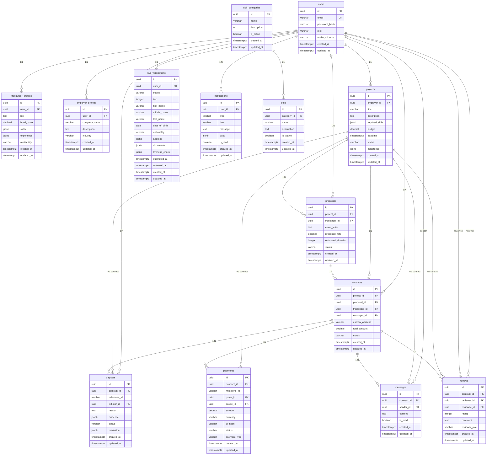

# Data Models & ORM Mapping

<cite>
**Referenced Files in This Document**   
- [user.ts](file://src/models/user.ts)
- [project.ts](file://src/models/project.ts)
- [proposal.ts](file://src/models/proposal.ts)
- [contract.ts](file://src/models/contract.ts)
- [dispute.ts](file://src/models/dispute.ts)
- [kyc.ts](file://src/models/kyc.ts)
- [notification.ts](file://src/models/notification.ts)
- [freelancer-profile.ts](file://src/models/freelancer-profile.ts)
- [employer-profile.ts](file://src/models/employer-profile.ts)
- [skill.ts](file://src/models/skill.ts)
- [entity-mapper.ts](file://src/utils/entity-mapper.ts)
- [user-repository.ts](file://src/repositories/user-repository.ts)
- [project-repository.ts](file://src/repositories/project-repository.ts)
- [proposal-repository.ts](file://src/repositories/proposal-repository.ts)
- [contract-repository.ts](file://src/repositories/contract-repository.ts)
- [dispute-repository.ts](file://src/repositories/dispute-repository.ts)
- [kyc-repository.ts](file://src/repositories/kyc-repository.ts)
- [notification-repository.ts](file://src/repositories/notification-repository.ts)
- [base-repository.ts](file://src/repositories/base-repository.ts)
- [schema.sql](file://supabase/schema.sql)
</cite>

## Table of Contents
1. [Introduction](#introduction)
2. [Core Data Models](#core-data-models)
3. [Entity-Relationship Diagram](#entity-relationship-diagram)
4. [Model Field Definitions](#model-field-definitions)
5. [Data Validation and Constraints](#data-validation-and-constraints)
6. [Repository Pattern Implementation](#repository-pattern-implementation)
7. [Sample Data Records](#sample-data-records)
8. [Conclusion](#conclusion)

## Introduction
The FreelanceXchain platform implements a comprehensive data model to support its decentralized freelance marketplace. This documentation details the core entities, their relationships, and the ORM mapping between TypeScript models and PostgreSQL schema. The system is built on Supabase, leveraging PostgreSQL for data persistence with Row Level Security (RLS) for access control. The architecture follows a repository pattern, separating data access logic from business logic and providing a clean interface for database operations.

**Section sources**
- [schema.sql](file://supabase/schema.sql#L1-L261)
- [entity-mapper.ts](file://src/utils/entity-mapper.ts#L1-L412)

## Core Data Models
The FreelanceXchain platform consists of several interconnected data models that represent the core entities of the freelance marketplace. These models include User, Project, Proposal, Contract, Dispute, KYC, Notification, and supporting entities for skills management. The models are implemented in TypeScript with corresponding PostgreSQL tables, and the system uses a repository pattern to abstract database operations.

The User model serves as the foundation, with role-based access control distinguishing between freelancers, employers, and administrators. Users can have either a FreelancerProfile or EmployerProfile, which contain role-specific information. Projects are created by employers and can receive proposals from freelancers. When a proposal is accepted, a Contract is created, which governs the work relationship and payment terms. The system supports milestone-based payments with escrow functionality, and includes mechanisms for dispute resolution, KYC verification, and notifications.

**Section sources**
- [user.ts](file://src/models/user.ts#L1-L4)
- [project.ts](file://src/models/project.ts#L1-L3)
- [proposal.ts](file://src/models/proposal.ts#L1-L3)
- [contract.ts](file://src/models/contract.ts#L1-L3)
- [dispute.ts](file://src/models/dispute.ts#L1-L3)
- [kyc.ts](file://src/models/kyc.ts#L1-L206)
- [notification.ts](file://src/models/notification.ts#L1-L3)

## Entity-Relationship Diagram


**Diagram sources**
- [schema.sql](file://supabase/schema.sql#L8-L261)
- [entity-mapper.ts](file://src/utils/entity-mapper.ts#L14-L412)

## Model Field Definitions
This section details the field definitions for each core model in the FreelanceXchain platform, including data types, relationships, and constraints as implemented in both TypeScript models and PostgreSQL schema.

### User Model
The User model represents platform participants with role-based access control. Users can be freelancers, employers, or administrators.

**Application Model (TypeScript)**
```typescript
type User = {
  id: string;
  email: string;
  passwordHash: string;
  role: 'freelancer' | 'employer' | 'admin';
  walletAddress: string;
  createdAt: string;
  updatedAt: string;
}
```

**Database Schema (PostgreSQL)**
```sql
CREATE TABLE users (
  id UUID PRIMARY KEY DEFAULT uuid_generate_v4(),
  email VARCHAR(255) UNIQUE NOT NULL,
  password_hash VARCHAR(255) NOT NULL,
  role VARCHAR(20) NOT NULL CHECK (role IN ('freelancer', 'employer', 'admin')),
  wallet_address VARCHAR(255) DEFAULT '',
  name VARCHAR(255) DEFAULT '',
  created_at TIMESTAMPTZ DEFAULT NOW(),
  updated_at TIMESTAMPTZ DEFAULT NOW()
);
```

**Relationships**
- One-to-one with FreelancerProfile (user_id reference)
- One-to-one with EmployerProfile (user_id reference)
- One-to-many with Projects (employer_id reference)
- One-to-many with Proposals (freelancer_id reference)
- One-to-many with Contracts (freelancer_id and employer_id references)
- One-to-one with KYCVerification (user_id reference)
- One-to-many with Notifications (user_id reference)

**Section sources**
- [user.ts](file://src/models/user.ts#L1-L4)
- [user-repository.ts](file://src/repositories/user-repository.ts#L4-L13)
- [schema.sql](file://supabase/schema.sql#L8-L17)

### Project Model
The Project model represents freelance jobs posted by employers, containing details about the work, required skills, budget, and milestones.

**Application Model (TypeScript)**
```typescript
type Project = {
  id: string;
  employerId: string;
  title: string;
  description: string;
  requiredSkills: ProjectSkillReference[];
  budget: number;
  deadline: string;
  status: ProjectStatus;
  milestones: Milestone[];
  createdAt: string;
  updatedAt: string;
}
```

**Database Schema (PostgreSQL)**
```sql
CREATE TABLE projects (
  id UUID PRIMARY KEY DEFAULT uuid_generate_v4(),
  employer_id UUID REFERENCES users(id) ON DELETE CASCADE,
  title VARCHAR(255) NOT NULL,
  description TEXT,
  required_skills JSONB DEFAULT '[]',
  budget DECIMAL(12, 2) DEFAULT 0,
  deadline TIMESTAMPTZ,
  status VARCHAR(20) DEFAULT 'draft' CHECK (status IN ('draft', 'open', 'in_progress', 'completed', 'cancelled')),
  milestones JSONB DEFAULT '[]',
  created_at TIMESTAMPTZ DEFAULT NOW(),
  updated_at TIMESTAMPTZ DEFAULT NOW()
);
```

**Relationships**
- Many-to-one with User (employer_id reference)
- One-to-many with Proposals (project_id reference)
- One-to-one with Contract (project_id reference)
- One-to-many with Disputes (via contract)
- One-to-many with Messages (via contract)
- One-to-many with Payments (via contract)
- One-to-many with Reviews (via contract)

**Section sources**
- [project.ts](file://src/models/project.ts#L1-L3)
- [project-repository.ts](file://src/repositories/project-repository.ts#L16-L28)
- [schema.sql](file://supabase/schema.sql#L65-L78)

### Proposal Model
The Proposal model represents a freelancer's bid on a project, including their cover letter, proposed rate, and estimated duration.

**Application Model (TypeScript)**
```typescript
type Proposal = {
  id: string;
  projectId: string;
  freelancerId: string;
  coverLetter: string;
  proposedRate: number;
  estimatedDuration: number;
  status: ProposalStatus;
  createdAt: string;
  updatedAt: string;
}
```

**Database Schema (PostgreSQL)**
```sql
CREATE TABLE proposals (
  id UUID PRIMARY KEY DEFAULT uuid_generate_v4(),
  project_id UUID REFERENCES projects(id) ON DELETE CASCADE,
  freelancer_id UUID REFERENCES users(id) ON DELETE CASCADE,
  cover_letter TEXT,
  proposed_rate DECIMAL(10, 2) DEFAULT 0,
  estimated_duration INTEGER DEFAULT 0,
  status VARCHAR(20) DEFAULT 'pending' CHECK (status IN ('pending', 'accepted', 'rejected', 'withdrawn')),
  created_at TIMESTAMPTZ DEFAULT NOW(),
  updated_at TIMESTAMPTZ DEFAULT NOW(),
  UNIQUE(project_id, freelancer_id)
);
```

**Relationships**
- Many-to-one with Project (project_id reference)
- Many-to-one with User (freelancer_id reference)
- One-to-one with Contract (proposal_id reference)

**Section sources**
- [proposal.ts](file://src/models/proposal.ts#L1-L3)
- [proposal-repository.ts](file://src/repositories/proposal-repository.ts)
- [schema.sql](file://supabase/schema.sql#L80-L92)

### Contract Model
The Contract model represents an agreement between a freelancer and employer for a specific project, including escrow details and payment terms.

**Application Model (TypeScript)**
```typescript
type Contract = {
  id: string;
  projectId: string;
  proposalId: string;
  freelancerId: string;
  employerId: string;
  escrowAddress: string;
  totalAmount: number;
  status: ContractStatus;
  createdAt: string;
  updatedAt: string;
}
```

**Database Schema (PostgreSQL)**
```sql
CREATE TABLE contracts (
  id UUID PRIMARY KEY DEFAULT uuid_generate_v4(),
  project_id UUID REFERENCES projects(id) ON DELETE CASCADE,
  proposal_id UUID REFERENCES proposals(id) ON DELETE CASCADE,
  freelancer_id UUID REFERENCES users(id) ON DELETE CASCADE,
  employer_id UUID REFERENCES users(id) ON DELETE CASCADE,
  escrow_address VARCHAR(255),
  total_amount DECIMAL(12, 2) DEFAULT 0,
  status VARCHAR(20) DEFAULT 'active' CHECK (status IN ('active', 'completed', 'disputed', 'cancelled')),
  created_at TIMESTAMPTZ DEFAULT NOW(),
  updated_at TIMESTAMPTZ DEFAULT NOW()
);
```

**Relationships**
- Many-to-one with Project (project_id reference)
- Many-to-one with Proposal (proposal_id reference)
- Many-to-one with User (freelancer_id and employer_id references)
- One-to-many with Disputes (contract_id reference)
- One-to-many with Messages (contract_id reference)
- One-to-many with Payments (contract_id reference)
- One-to-one with Reviews (contract_id reference)

**Section sources**
- [contract.ts](file://src/models/contract.ts#L1-L3)
- [contract-repository.ts](file://src/repositories/contract-repository.ts#L6-L17)
- [schema.sql](file://supabase/schema.sql#L94-L106)

### Dispute Model
The Dispute model handles conflict resolution between parties, with evidence submission and resolution tracking.

**Application Model (TypeScript)**
```typescript
type Dispute = {
  id: string;
  contractId: string;
  milestoneId: string;
  initiatorId: string;
  reason: string;
  evidence: Evidence[];
  status: DisputeStatus;
  resolution: DisputeResolution | null;
  createdAt: string;
  updatedAt: string;
}
```

**Database Schema (PostgreSQL)**
```sql
CREATE TABLE disputes (
  id UUID PRIMARY KEY DEFAULT uuid_generate_v4(),
  contract_id UUID REFERENCES contracts(id) ON DELETE CASCADE,
  milestone_id VARCHAR(255),
  initiator_id UUID REFERENCES users(id) ON DELETE CASCADE,
  reason TEXT,
  evidence JSONB DEFAULT '[]',
  status VARCHAR(20) DEFAULT 'open' CHECK (status IN ('open', 'under_review', 'resolved')),
  resolution JSONB,
  created_at TIMESTAMPTZ DEFAULT NOW(),
  updated_at TIMESTAMPTZ DEFAULT NOW()
);
```

**Relationships**
- Many-to-one with Contract (contract_id reference)
- Many-to-one with User (initiator_id reference)

**Section sources**
- [dispute.ts](file://src/models/dispute.ts#L1-L3)
- [dispute-repository.ts](file://src/repositories/dispute-repository.ts#L21-L32)
- [schema.sql](file://supabase/schema.sql#L108-L120)

### KYC Model
The KYC model manages identity verification for users, supporting tiered verification levels with document submission and liveness checks.

**Application Model (TypeScript)**
```typescript
type KycVerification = {
  id: string;
  userId: string;
  status: KycStatus;
  tier: KycTier;
  firstName: string;
  middleName?: string;
  lastName: string;
  dateOfBirth: string;
  nationality: string;
  address: InternationalAddress;
  documents: KycDocument[];
  livenessCheck?: LivenessCheck;
  submittedAt?: string;
  reviewedAt?: string;
  rejectionReason?: string;
  createdAt: string;
  updatedAt: string;
}
```

**Database Schema (PostgreSQL)**
```sql
CREATE TABLE kyc_verifications (
  id UUID PRIMARY KEY DEFAULT uuid_generate_v4(),
  user_id UUID REFERENCES users(id) ON DELETE CASCADE,
  status VARCHAR(20) DEFAULT 'pending' CHECK (status IN ('pending', 'submitted', 'under_review', 'approved', 'rejected')),
  tier INTEGER DEFAULT 1,
  first_name VARCHAR(255),
  middle_name VARCHAR(255),
  last_name VARCHAR(255),
  date_of_birth DATE,
  nationality VARCHAR(100),
  address JSONB DEFAULT '{}',
  documents JSONB DEFAULT '[]',
  liveness_check JSONB,
  submitted_at TIMESTAMPTZ,
  reviewed_at TIMESTAMPTZ,
  rejection_reason TEXT,
  created_at TIMESTAMPTZ DEFAULT NOW(),
  updated_at TIMESTAMPTZ DEFAULT NOW()
);
```

**Relationships**
- One-to-one with User (user_id reference)

**Section sources**
- [kyc.ts](file://src/models/kyc.ts#L1-L206)
- [kyc-repository.ts](file://src/repositories/kyc-repository.ts)
- [schema.sql](file://supabase/schema.sql#L135-L159)

### Notification Model
The Notification model handles system messages and alerts for users, supporting various notification types.

**Application Model (TypeScript)**
```typescript
type Notification = {
  id: string;
  userId: string;
  type: NotificationType;
  title: string;
  message: string;
  data: Record<string, unknown>;
  isRead: boolean;
  createdAt: string;
}
```

**Database Schema (PostgreSQL)**
```sql
CREATE TABLE notifications (
  id UUID PRIMARY KEY DEFAULT uuid_generate_v4(),
  user_id UUID REFERENCES users(id) ON DELETE CASCADE,
  type VARCHAR(50) NOT NULL,
  title VARCHAR(255) NOT NULL,
  message TEXT,
  data JSONB DEFAULT '{}',
  is_read BOOLEAN DEFAULT false,
  created_at TIMESTAMPTZ DEFAULT NOW(),
  updated_at TIMESTAMPTZ DEFAULT NOW()
);
```

**Relationships**
- Many-to-one with User (user_id reference)

**Section sources**
- [notification.ts](file://src/models/notification.ts#L1-L3)
- [notification-repository.ts](file://src/repositories/notification-repository.ts#L16-L26)
- [schema.sql](file://supabase/schema.sql#L122-L133)

## Data Validation and Constraints
The FreelanceXchain platform implements comprehensive data validation and constraints at both the application and database levels to ensure data integrity and consistency.

### Primary and Foreign Keys
The system uses UUIDs as primary keys for all entities, generated using PostgreSQL's uuid_generate_v4() function. Foreign key constraints are implemented with ON DELETE CASCADE to maintain referential integrity. For example, when a user is deleted, their associated profiles, projects, proposals, and other related records are automatically removed.

### Check Constraints
Several tables implement check constraints to enforce valid data values:
- Users table: role must be 'freelancer', 'employer', or 'admin'
- Projects table: status must be 'draft', 'open', 'in_progress', 'completed', or 'cancelled'
- Proposals table: status must be 'pending', 'accepted', 'rejected', or 'withdrawn'
- Contracts table: status must be 'active', 'completed', 'disputed', or 'cancelled'
- Disputes table: status must be 'open', 'under_review', or 'resolved'
- KYC verifications table: status must be 'pending', 'submitted', 'under_review', 'approved', or 'rejected'

### Unique Constraints
Unique constraints are implemented to prevent duplicate records:
- Users table: email must be unique
- FreelancerProfiles table: user_id must be unique (one profile per freelancer)
- EmployerProfiles table: user_id must be unique (one profile per employer)
- Proposals table: combination of project_id and freelancer_id must be unique (one proposal per freelancer per project)

### Indexes for Query Performance
The system includes numerous indexes to optimize query performance:
- Indexes on foreign key columns (user_id, project_id, contract_id, etc.)
- Indexes on frequently queried fields (email, status, is_read)
- Composite indexes for common query patterns
- These indexes ensure efficient retrieval of data for user profiles, project listings, contract histories, and notification feeds.

**Section sources**
- [schema.sql](file://supabase/schema.sql#L203-L223)
- [entity-mapper.ts](file://src/utils/entity-mapper.ts#L14-L412)

## Repository Pattern Implementation
The FreelanceXchain platform implements a repository pattern to abstract database operations and provide a clean interface between the application logic and data persistence layer.

### Base Repository
The BaseRepository class provides common CRUD operations and pagination functionality that are inherited by specific repository implementations. It handles connection management, error handling, and common query patterns.

```typescript
export class BaseRepository<T extends BaseEntity> {
  protected tableName: TableName;
  protected client: SupabaseClient | null = null;

  constructor(tableName: TableName) {
    this.tableName = tableName;
  }

  async create(item: Omit<T, 'created_at' | 'updated_at'>): Promise<T> { /* implementation */ }
  async getById(id: string): Promise<T | null> { /* implementation */ }
  async update(id: string, updates: Partial<T>): Promise<T | null> { /* implementation */ }
  async delete(id: string): Promise<boolean> { /* implementation */ }
  async queryPaginated(options?: QueryOptions): Promise<PaginatedResult<T>> { /* implementation */ }
}
```

### Specific Repository Implementations
Each entity has a dedicated repository class that extends the BaseRepository and provides entity-specific methods:

- UserRepository: getUserByEmail, emailExists
- ProjectRepository: getProjectsByEmployer, getAllOpenProjects, searchProjects
- ContractRepository: getContractsByFreelancer, getContractsByEmployer, getUserContracts
- DisputeRepository: getDisputesByContract, getDisputesByStatus
- NotificationRepository: getUnreadNotificationsByUser, markAllAsRead, getUnreadCount

### Entity Mapping
The system uses an entity mapper to convert between database entities (snake_case) and application models (camelCase). This separation allows the application to use idiomatic TypeScript naming conventions while maintaining compatibility with the PostgreSQL schema.

```typescript
export function mapUserFromEntity(entity: UserEntity): User {
  return {
    id: entity.id,
    email: entity.email,
    passwordHash: entity.password_hash,
    role: entity.role,
    walletAddress: entity.wallet_address,
    createdAt: entity.created_at,
    updatedAt: entity.updated_at,
  };
}
```

The repository pattern provides several benefits:
- Separation of concerns between data access and business logic
- Testability through dependency injection
- Consistent error handling and logging
- Reusable query patterns and pagination
- Type safety through TypeScript generics

**Section sources**
- [base-repository.ts](file://src/repositories/base-repository.ts#L1-L149)
- [user-repository.ts](file://src/repositories/user-repository.ts#L1-L58)
- [project-repository.ts](file://src/repositories/project-repository.ts#L1-L191)
- [contract-repository.ts](file://src/repositories/contract-repository.ts#L1-L139)
- [dispute-repository.ts](file://src/repositories/dispute-repository.ts#L1-L136)
- [notification-repository.ts](file://src/repositories/notification-repository.ts#L1-L118)
- [entity-mapper.ts](file://src/utils/entity-mapper.ts#L1-L412)

## Sample Data Records
This section provides sample data records for each core model to demonstrate practical usage and illustrate the structure of the data.

### Sample User Record
```json
{
  "id": "a1b2c3d4-e5f6-7890-g1h2-i3j4k5l6m7n8",
  "email": "john.doe@example.com",
  "passwordHash": "$2b$10$abcdefghijklmnopqrstuvwxyz1234567890",
  "role": "freelancer",
  "walletAddress": "0x1234567890abcdef1234567890abcdef12345678",
  "createdAt": "2023-01-15T10:30:00.000Z",
  "updatedAt": "2023-01-15T10:30:00.000Z"
}
```

### Sample Project Record
```json
{
  "id": "b2c3d4e5-f6g7-8901-h2i3-j4k5l6m7n8o9",
  "employerId": "a1b2c3d4-e5f6-7890-g1h2-i3j4k5l6m7n8",
  "title": "Develop React Frontend for E-commerce Platform",
  "description": "Create a responsive React frontend for an e-commerce platform with product listings, shopping cart, and checkout functionality.",
  "requiredSkills": [
    {
      "skillId": "c3d4e5f6-g7h8-9012-i3j4-k5l6m7n8o9p0",
      "skillName": "React",
      "categoryId": "d4e5f6g7-h8i9-0123-j4k5-l6m7n8o9p0q1"
    },
    {
      "skillId": "e5f6g7h8-i9j0-1234-k5l6-m7n8o9p0q1r2",
      "skillName": "TypeScript",
      "categoryId": "d4e5f6g7-h8i9-0123-j4k5-l6m7n8o9p0q1"
    }
  ],
  "budget": 5000,
  "deadline": "2023-04-15T00:00:00.000Z",
  "status": "open",
  "milestones": [
    {
      "id": "f6g7h8i9-j0k1-2345-l6m7-n8o9p0q1r2s3",
      "title": "Design and Setup",
      "description": "Complete UI/UX design and project setup",
      "amount": 1000,
      "dueDate": "2023-02-15T00:00:00.000Z",
      "status": "pending"
    },
    {
      "id": "g7h8i9j0-k1l2-3456-m7n8-o9p0q1r2s3t4",
      "title": "Core Functionality",
      "description": "Implement product listings and shopping cart",
      "amount": 2500,
      "dueDate": "2023-03-15T00:00:00.000Z",
      "status": "pending"
    },
    {
      "id": "h8i9j0k1-l2m3-4567-n8o9-p0q1r2s3t4u5",
      "title": "Checkout and Testing",
      "description": "Implement checkout process and conduct testing",
      "amount": 1500,
      "dueDate": "2023-04-15T00:00:00.000Z",
      "status": "pending"
    }
  ],
  "createdAt": "2023-01-15T11:00:00.000Z",
  "updatedAt": "2023-01-15T11:00:00.000Z"
}
```

### Sample Proposal Record
```json
{
  "id": "c3d4e5f6-g7h8-9012-i3j4-k5l6m7n8o9p0",
  "projectId": "b2c3d4e5-f6g7-8901-h2i3-j4k5l6m7n8o9",
  "freelancerId": "a1b2c3d4-e5f6-7890-g1h2-i3j4k5l6m7n8",
  "coverLetter": "Dear Employer, I'm excited to apply for this React development project. With 5 years of experience in React and TypeScript, I've built several e-commerce platforms with similar requirements...",
  "proposedRate": 4500,
  "estimatedDuration": 90,
  "status": "pending",
  "createdAt": "2023-01-16T09:30:00.000Z",
  "updatedAt": "2023-01-16T09:30:00.000Z"
}
```

### Sample Contract Record
```json
{
  "id": "d4e5f6g7-h8i9-0123-j4k5-l6m7n8o9p0q1",
  "projectId": "b2c3d4e5-f6g7-8901-h2i3-j4k5l6m7n8o9",
  "proposalId": "c3d4e5f6-g7h8-9012-i3j4-k5l6m7n8o9p0",
  "freelancerId": "a1b2c3d4-e5f6-7890-g1h2-i3j4k5l6m7n8",
  "employerId": "a1b2c3d4-e5f6-7890-g1h2-i3j4k5l6m7n8",
  "escrowAddress": "0x8765432109876543210987654321098765432109",
  "totalAmount": 4500,
  "status": "active",
  "createdAt": "2023-01-17T14:00:00.000Z",
  "updatedAt": "2023-01-17T14:00:00.000Z"
}
```

### Sample Dispute Record
```json
{
  "id": "e5f6g7h8-i9j0-1234-k5l6-m7n8o9p0q1r2",
  "contractId": "d4e5f6g7-h8i9-0123-j4k5-l6m7n8o9p0q1",
  "milestoneId": "g7h8i9j0-k1l2-3456-m7n8-o9p0q1r2s3t4",
  "initiatorId": "a1b2c3d4-e5f6-7890-g1h2-i3j4k5l6m7n8",
  "reason": "The freelancer has not delivered the core functionality by the agreed deadline despite multiple reminders.",
  "evidence": [
    {
      "id": "f6g7h8i9-j0k1-2345-l6m7-n8o9p0q1r2s3",
      "submitterId": "a1b2c3d4-e5f6-7890-g1h2-i3j4k5l6m7n8",
      "type": "link",
      "content": "https://github.com/example/project/commits",
      "submittedAt": "2023-03-20T10:00:00.000Z"
    },
    {
      "id": "g7h8i9j0-k1l2-3456-m7n8-o9p0q1r2s3t4",
      "submitterId": "a1b2c3d4-e5f6-7890-g1h2-i3j4k5l6m7n8",
      "type": "text",
      "content": "Email thread showing communication with the freelancer about the delayed delivery.",
      "submittedAt": "2023-03-20T10:05:00.000Z"
    }
  ],
  "status": "open",
  "resolution": null,
  "createdAt": "2023-03-20T10:00:00.000Z",
  "updatedAt": "2023-03-20T10:00:00.000Z"
}
```

### Sample KYC Verification Record
```json
{
  "id": "f6g7h8i9-j0k1-2345-l6m7-n8o9p0q1r2s3",
  "userId": "a1b2c3d4-e5f6-7890-g1h2-i3j4k5l6m7n8",
  "status": "approved",
  "tier": "standard",
  "firstName": "John",
  "middleName": "Michael",
  "lastName": "Doe",
  "dateOfBirth": "1990-05-15",
  "nationality": "US",
  "address": {
    "addressLine1": "123 Main Street",
    "city": "New York",
    "stateProvince": "NY",
    "postalCode": "10001",
    "country": "United States",
    "countryCode": "US"
  },
  "documents": [
    {
      "id": "g7h8i9j0-k1l2-3456-m7n8-o9p0q1r2s3t4",
      "type": "passport",
      "documentNumber": "P12345678",
      "issuingCountry": "US",
      "issueDate": "2020-01-15",
      "expiryDate": "2030-01-15",
      "frontImageUrl": "https://example.com/images/passport-front.jpg",
      "verificationStatus": "verified",
      "uploadedAt": "2023-01-10T08:00:00.000Z"
    }
  ],
  "livenessCheck": {
    "id": "h8i9j0k1-l2m3-4567-n8o9-p0q1r2s3t4u5",
    "sessionId": "sess_1234567890",
    "status": "passed",
    "confidenceScore": 0.95,
    "challenges": [
      {
        "type": "blink",
        "completed": true,
        "timestamp": "2023-01-10T08:05:00.000Z"
      },
      {
        "type": "smile",
        "completed": true,
        "timestamp": "2023-01-10T08:05:05.000Z"
      }
    ],
    "capturedFrames": [
      "https://example.com/images/frame1.jpg",
      "https://example.com/images/frame2.jpg"
    ],
    "completedAt": "2023-01-10T08:05:10.000Z",
    "expiresAt": "2024-01-10T08:05:10.000Z",
    "createdAt": "2023-01-10T08:05:00.000Z"
  },
  "submittedAt": "2023-01-10T08:00:00.000Z",
  "reviewedAt": "2023-01-11T09:30:00.000Z",
  "createdAt": "2023-01-10T08:00:00.000Z",
  "updatedAt": "2023-01-11T09:30:00.000Z"
}
```

### Sample Notification Record
```json
{
  "id": "g7h8i9j0-k1l2-3456-m7n8-o9p0q1r2s3t4",
  "userId": "a1b2c3d4-e5f6-7890-g1h2-i3j4k5l6m7n8",
  "type": "proposal_received",
  "title": "New Proposal for Your Project",
  "message": "You have received a new proposal from Jane Smith for your project 'Develop React Frontend for E-commerce Platform'.",
  "data": {
    "projectId": "b2c3d4e5-f6g7-8901-h2i3-j4k5l6m7n8o9",
    "proposalId": "c3d4e5f6-g7h8-9012-i3j4-k5l6m7n8o9p0",
    "freelancerId": "b2c3d4e5-f6g7-8901-h2i3-j4k5l6m7n8o9",
    "proposedRate": 4500
  },
  "isRead": false,
  "createdAt": "2023-01-16T09:30:00.000Z"
}
```

**Section sources**
- [entity-mapper.ts](file://src/utils/entity-mapper.ts#L14-L412)
- [schema.sql](file://supabase/schema.sql#L8-L261)

## Conclusion
The FreelanceXchain platform features a robust and well-structured data model that supports a comprehensive freelance marketplace with role-based access, project management, contract execution, dispute resolution, and identity verification. The system effectively combines TypeScript models with PostgreSQL schema to ensure data integrity and performance, while the repository pattern provides a clean abstraction layer for database operations.

Key strengths of the data model include:
- Comprehensive entity relationships that accurately represent the freelance marketplace ecosystem
- Strong data validation and constraints at both application and database levels
- Efficient indexing strategy for optimal query performance
- Clear separation between database entities (snake_case) and application models (camelCase)
- Extensible design that supports future enhancements

The implementation demonstrates best practices in data modeling, with attention to data integrity, security (through RLS), and performance. The repository pattern enables maintainable and testable code, while the entity mapper facilitates seamless conversion between different data representations. This architecture provides a solid foundation for the platform's core functionality and future growth.

**Section sources**
- [schema.sql](file://supabase/schema.sql#L1-L261)
- [entity-mapper.ts](file://src/utils/entity-mapper.ts#L1-L412)
- [base-repository.ts](file://src/repositories/base-repository.ts#L1-L149)