# Authentication Service

<cite>
**Referenced Files in This Document**
- [auth-service.ts](file://src/services/auth-service.ts)
- [auth-middleware.ts](file://src/middleware/auth-middleware.ts)
- [auth-routes.ts](file://src/routes/auth-routes.ts)
- [auth-types.ts](file://src/services/auth-types.ts)
- [supabase.ts](file://src/config/supabase.ts)
- [env.ts](file://src/config/env.ts)
- [user-repository.ts](file://src/repositories/user-repository.ts)
- [base-repository.ts](file://src/repositories/base-repository.ts)
- [user.ts](file://src/models/user.ts)
- [app.ts](file://src/app.ts)
</cite>

## Table of Contents
1. [Introduction](#introduction)
2. [Project Structure](#project-structure)
3. [Core Components](#core-components)
4. [Architecture Overview](#architecture-overview)
5. [Detailed Component Analysis](#detailed-component-analysis)
6. [Dependency Analysis](#dependency-analysis)
7. [Performance Considerations](#performance-considerations)
8. [Troubleshooting Guide](#troubleshooting-guide)
9. [Conclusion](#conclusion)
10. [Appendices](#appendices)

## Introduction
This document explains the Authentication Service that implements JWT-based authentication, role-based access control (RBAC), and integrates with Supabase Auth. It covers user registration, login, token refresh, password reset, OAuth flows, and how the service interacts with auth-middleware for request validation and authorization. It also documents Supabase configuration dependencies, session management, common issues like token expiration and session invalidation, and secure token storage practices. Guidance is included for extending the service to support social logins and multi-factor authentication.

## Project Structure
The authentication system spans services, routes, middleware, repositories, and configuration modules. The primary entry points are:
- Routes define HTTP endpoints for authentication operations.
- Services encapsulate business logic and integrate with Supabase Auth.
- Middleware validates tokens and enforces RBAC.
- Repositories manage user records in Supabase.
- Configuration supplies Supabase client and environment variables.

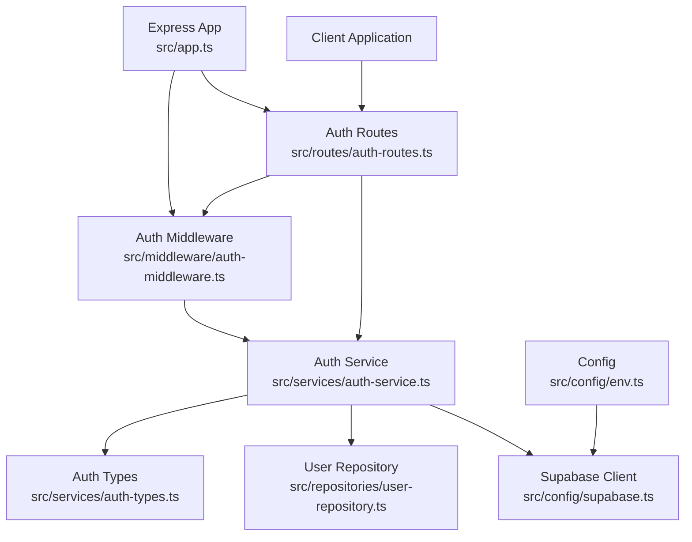

**Diagram sources**
- [auth-routes.ts](file://src/routes/auth-routes.ts#L1-L120)
- [auth-service.ts](file://src/services/auth-service.ts#L1-L120)
- [supabase.ts](file://src/config/supabase.ts#L1-L45)
- [user-repository.ts](file://src/repositories/user-repository.ts#L1-L58)
- [auth-middleware.ts](file://src/middleware/auth-middleware.ts#L1-L70)
- [app.ts](file://src/app.ts#L1-L87)
- [env.ts](file://src/config/env.ts#L41-L67)

**Section sources**
- [auth-routes.ts](file://src/routes/auth-routes.ts#L1-L120)
- [auth-service.ts](file://src/services/auth-service.ts#L1-L120)
- [supabase.ts](file://src/config/supabase.ts#L1-L45)
- [user-repository.ts](file://src/repositories/user-repository.ts#L1-L58)
- [auth-middleware.ts](file://src/middleware/auth-middleware.ts#L1-L70)
- [app.ts](file://src/app.ts#L1-L87)
- [env.ts](file://src/config/env.ts#L41-L67)

## Core Components
- Auth Service: Implements registration, login, token refresh, password reset, OAuth URL generation, code-to-session exchange, and token validation. It orchestrates Supabase Auth operations and manages user records in the application’s public.users table.
- Auth Middleware: Validates Bearer tokens and enforces role-based authorization.
- Auth Routes: Exposes REST endpoints for authentication operations and integrates rate limiting and validation.
- User Repository: Provides CRUD operations for user records in Supabase.
- Supabase Client: Centralized client initialization and database table constants.
- Environment Config: Supplies Supabase URLs, keys, and JWT secrets and expiration settings.

Key responsibilities:
- JWT-based authentication: Uses Supabase Auth access and refresh tokens; the service returns both tokens to clients.
- RBAC: Roles are enforced by the middleware using validated user roles.
- Session management: Leverages Supabase Auth sessions and refresh tokens for long-lived access.

**Section sources**
- [auth-service.ts](file://src/services/auth-service.ts#L1-L120)
- [auth-middleware.ts](file://src/middleware/auth-middleware.ts#L1-L70)
- [auth-routes.ts](file://src/routes/auth-routes.ts#L120-L240)
- [user-repository.ts](file://src/repositories/user-repository.ts#L1-L58)
- [supabase.ts](file://src/config/supabase.ts#L1-L45)
- [env.ts](file://src/config/env.ts#L41-L67)

## Architecture Overview
The authentication flow integrates with Supabase Auth for identity operations while maintaining local user profiles in the public.users table. The service returns both access and refresh tokens to clients, who must present the access token in the Authorization header for protected routes.

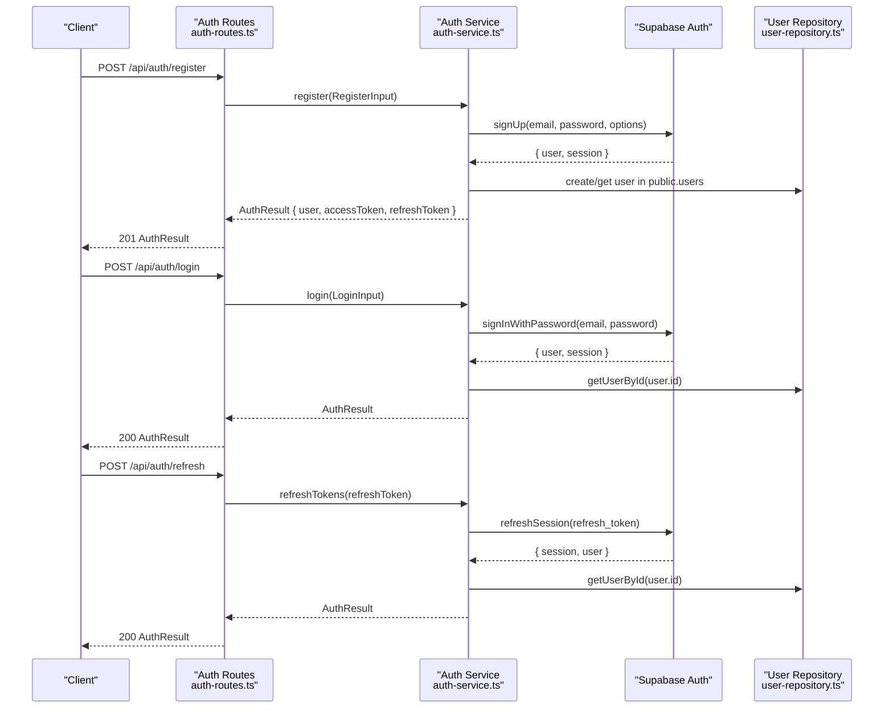

**Diagram sources**
- [auth-routes.ts](file://src/routes/auth-routes.ts#L120-L385)
- [auth-service.ts](file://src/services/auth-service.ts#L68-L228)
- [user-repository.ts](file://src/repositories/user-repository.ts#L20-L41)

**Section sources**
- [auth-routes.ts](file://src/routes/auth-routes.ts#L120-L385)
- [auth-service.ts](file://src/services/auth-service.ts#L68-L228)
- [user-repository.ts](file://src/repositories/user-repository.ts#L20-L41)

## Detailed Component Analysis

### Auth Service
Responsibilities:
- Registration: Normalizes email, checks duplicates, signs up via Supabase Auth, waits for trigger to create public.users, and returns AuthResult with both access and refresh tokens.
- Login: Validates credentials with Supabase Auth, ensures email is verified, retrieves user from public.users, and returns AuthResult.
- Token Refresh: Uses Supabase refresh token to obtain new access and refresh tokens and returns AuthResult.
- Token Validation: Verifies access tokens via Supabase getUser and returns user identity and role.
- OAuth: Generates provider URLs, exchanges authorization codes for sessions, logs in existing users, and registers new OAuth users with role selection.
- Password Reset: Requests reset emails and updates passwords using access tokens.
- Utilities: Password strength validator and error type guard.

Implementation highlights:
- Uses Supabase client initialized from environment configuration.
- Manages user records in public.users via UserRepository.
- Returns structured AuthResult or AuthError for consistent error handling.

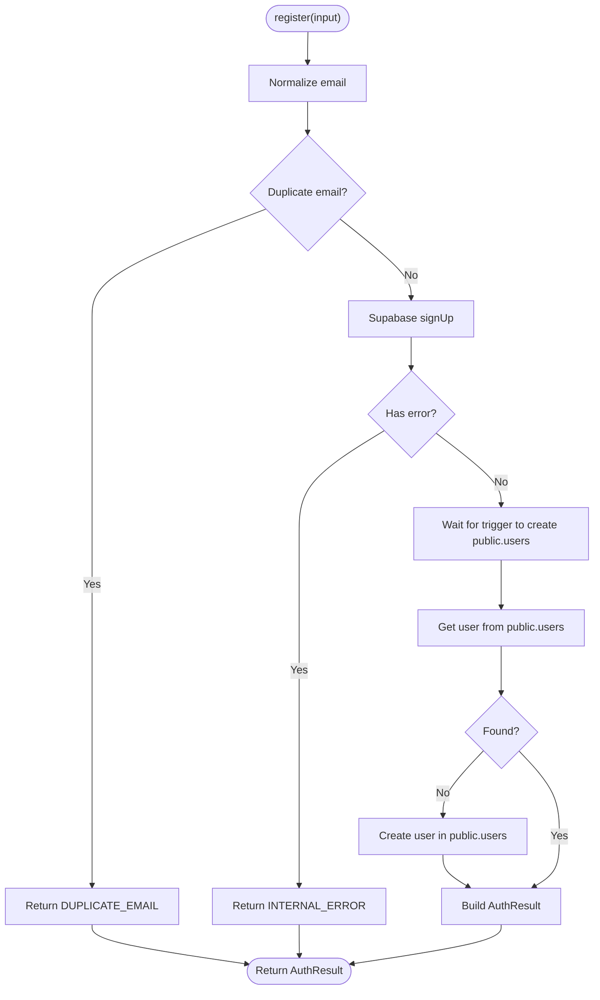

**Diagram sources**
- [auth-service.ts](file://src/services/auth-service.ts#L68-L155)
- [user-repository.ts](file://src/repositories/user-repository.ts#L20-L41)

**Section sources**
- [auth-service.ts](file://src/services/auth-service.ts#L1-L473)
- [auth-types.ts](file://src/services/auth-types.ts#L1-L49)
- [user-repository.ts](file://src/repositories/user-repository.ts#L1-L58)

### Auth Middleware
Responsibilities:
- Extracts Bearer token from Authorization header and validates it via validateToken.
- Populates req.user with validated user identity and role.
- Enforces role-based authorization using requireRole.

Behavior:
- Returns standardized 401/403 responses with error codes aligned to AuthError codes.
- Extends Express Request type to include user info.

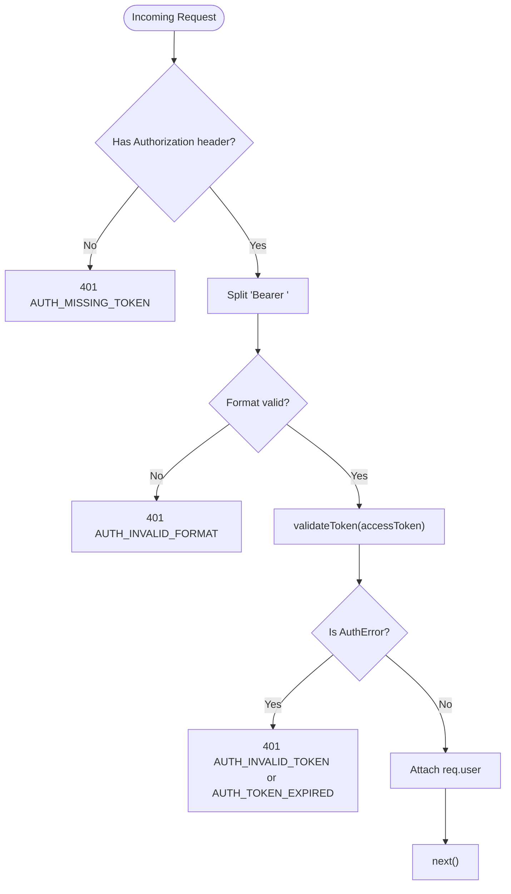

**Diagram sources**
- [auth-middleware.ts](file://src/middleware/auth-middleware.ts#L1-L101)

**Section sources**
- [auth-middleware.ts](file://src/middleware/auth-middleware.ts#L1-L101)
- [auth-service.ts](file://src/services/auth-service.ts#L230-L259)

### Auth Routes
Endpoints:
- POST /api/auth/register: Validates input, calls register, returns AuthResult or error.
- POST /api/auth/login: Validates input, calls login, returns AuthResult or error.
- POST /api/auth/refresh: Validates refresh token, calls refreshTokens, returns AuthResult or error.
- GET /api/auth/oauth/:provider: Redirects to Supabase OAuth provider.
- GET /api/auth/callback: Handles PKCE code exchange and implicit flow tokens.
- POST /api/auth/oauth/callback: Receives access_token for implicit flow.
- POST /api/auth/oauth/register: Completes OAuth registration with role selection.
- POST /api/auth/resend-confirmation: Resends email confirmation.
- POST /api/auth/forgot-password: Sends password reset email.
- POST /api/auth/reset-password: Updates password using reset token.

Integration:
- Uses rate limiter and validation helpers.
- Returns standardized error responses aligned with AuthError codes.

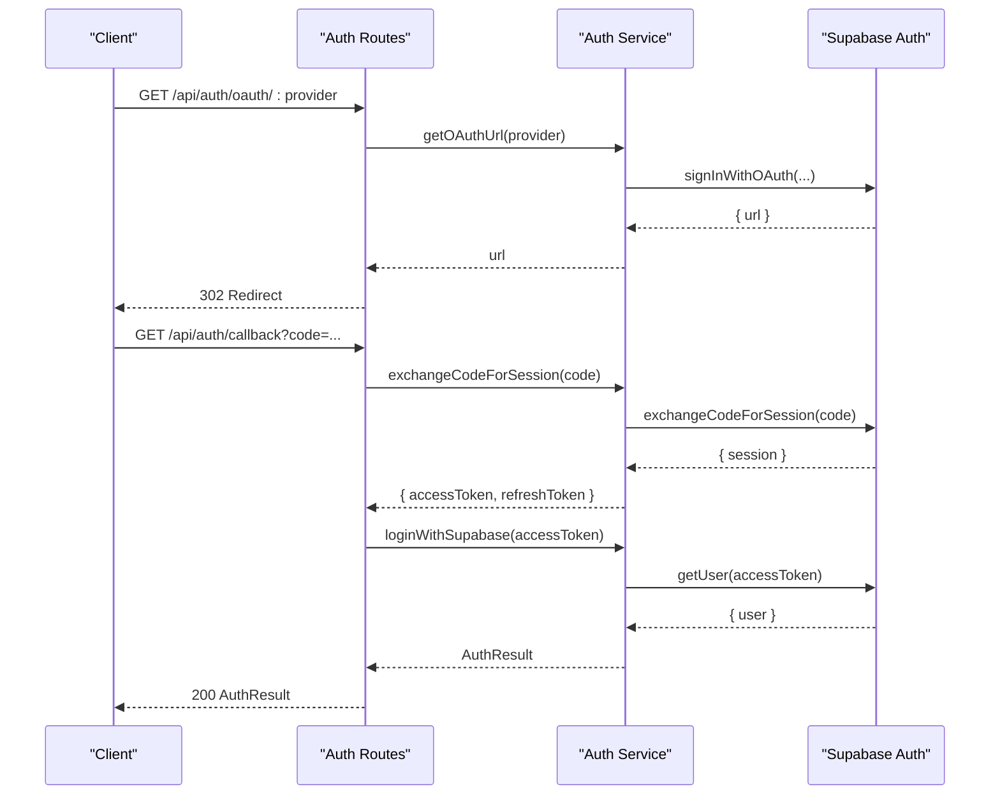

**Diagram sources**
- [auth-routes.ts](file://src/routes/auth-routes.ts#L387-L482)
- [auth-service.ts](file://src/services/auth-service.ts#L298-L345)

**Section sources**
- [auth-routes.ts](file://src/routes/auth-routes.ts#L120-L482)
- [auth-routes.ts](file://src/routes/auth-routes.ts#L484-L938)

### Supabase Configuration and Initialization
- Centralized client creation guarded by environment variables SUPABASE_URL and SUPABASE_ANON_KEY.
- Database table constants for consistent repository usage.
- Connection verification performed during initialization.

Security and reliability:
- Throws descriptive errors if configuration is missing.
- Uses a singleton client to avoid redundant connections.

**Section sources**
- [supabase.ts](file://src/config/supabase.ts#L1-L45)
- [env.ts](file://src/config/env.ts#L41-L67)

### Role-Based Access Control (RBAC)
- Roles are defined as 'freelancer', 'employer', or 'admin'.
- Auth middleware exposes requireRole to protect endpoints by role.
- Auth service returns user role alongside access tokens.

Best practices:
- Apply requireRole at route level for sensitive operations.
- Store roles in public.users and keep them synchronized with Supabase Auth metadata.

**Section sources**
- [user.ts](file://src/models/user.ts#L1-L4)
- [auth-middleware.ts](file://src/middleware/auth-middleware.ts#L72-L101)
- [auth-service.ts](file://src/services/auth-service.ts#L50-L62)

## Architecture Overview
The service integrates with Supabase Auth for identity operations while maintaining local user profiles. Clients receive both access and refresh tokens. Protected routes enforce authentication and authorization via middleware.

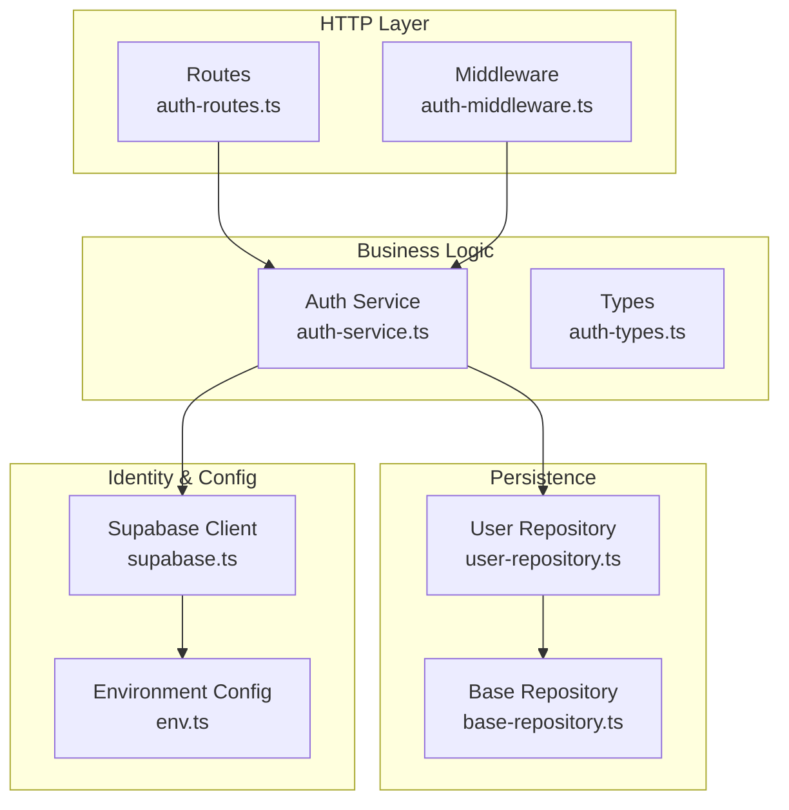

**Diagram sources**
- [auth-routes.ts](file://src/routes/auth-routes.ts#L1-L120)
- [auth-middleware.ts](file://src/middleware/auth-middleware.ts#L1-L70)
- [auth-service.ts](file://src/services/auth-service.ts#L1-L120)
- [user-repository.ts](file://src/repositories/user-repository.ts#L1-L58)
- [base-repository.ts](file://src/repositories/base-repository.ts#L1-L149)
- [supabase.ts](file://src/config/supabase.ts#L1-L45)
- [env.ts](file://src/config/env.ts#L41-L67)

## Detailed Component Analysis

### User Registration Workflow
- Normalizes email and checks duplicates in public.users.
- Calls Supabase Auth signUp with role and optional metadata.
- Waits briefly for trigger to create public.users; falls back to manual creation if needed.
- Returns AuthResult with both access and refresh tokens.

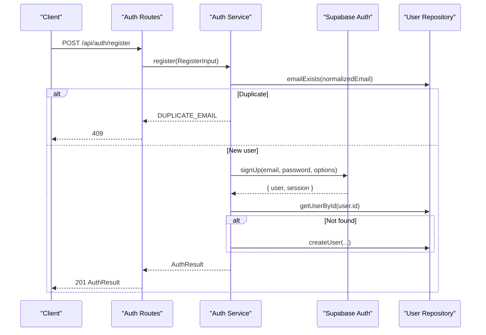

**Diagram sources**
- [auth-routes.ts](file://src/routes/auth-routes.ts#L160-L235)
- [auth-service.ts](file://src/services/auth-service.ts#L68-L155)
- [user-repository.ts](file://src/repositories/user-repository.ts#L20-L41)

**Section sources**
- [auth-routes.ts](file://src/routes/auth-routes.ts#L160-L235)
- [auth-service.ts](file://src/services/auth-service.ts#L68-L155)
- [user-repository.ts](file://src/repositories/user-repository.ts#L20-L41)

### Login and Token Refresh
- Login: Validates credentials, ensures email is verified, retrieves user from public.users, and returns AuthResult.
- Refresh: Uses refresh token to obtain new access and refresh tokens.

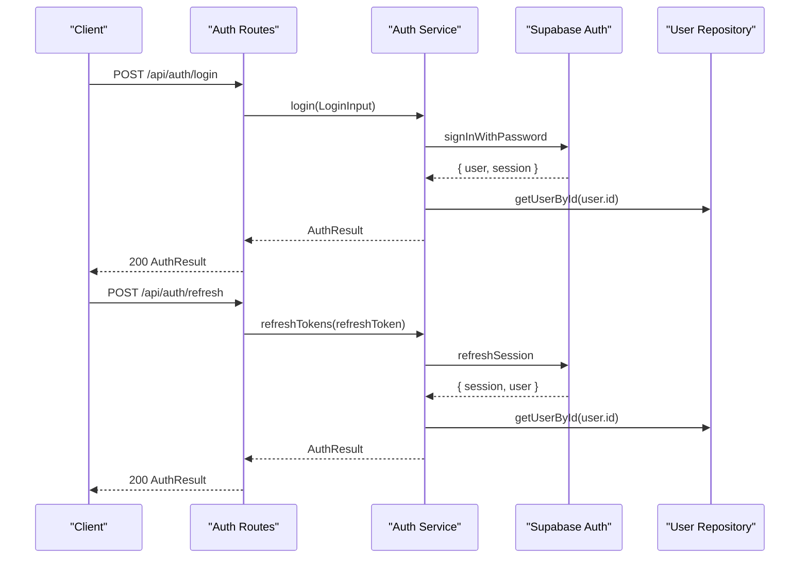

**Diagram sources**
- [auth-routes.ts](file://src/routes/auth-routes.ts#L272-L385)
- [auth-service.ts](file://src/services/auth-service.ts#L157-L228)
- [user-repository.ts](file://src/repositories/user-repository.ts#L20-L41)

**Section sources**
- [auth-routes.ts](file://src/routes/auth-routes.ts#L272-L385)
- [auth-service.ts](file://src/services/auth-service.ts#L157-L228)
- [user-repository.ts](file://src/repositories/user-repository.ts#L20-L41)

### OAuth Integration
- getOAuthUrl: Builds provider-specific URLs with redirect and consent parameters.
- exchangeCodeForSession: Exchanges authorization code for tokens.
- loginWithSupabase: Validates access token and returns AuthResult.
- registerWithSupabase: Registers OAuth users with role selection and metadata.

**Diagram sources**
- [auth-routes.ts](file://src/routes/auth-routes.ts#L387-L482)
- [auth-service.ts](file://src/services/auth-service.ts#L298-L345)

**Section sources**
- [auth-routes.ts](file://src/routes/auth-routes.ts#L387-L482)
- [auth-service.ts](file://src/services/auth-service.ts#L298-L402)

### Password Reset Flow
- requestPasswordReset: Sends reset email with redirect URL.
- reset-password endpoint: Validates inputs and calls updatePassword.
- updatePassword: Sets session and updates user password.

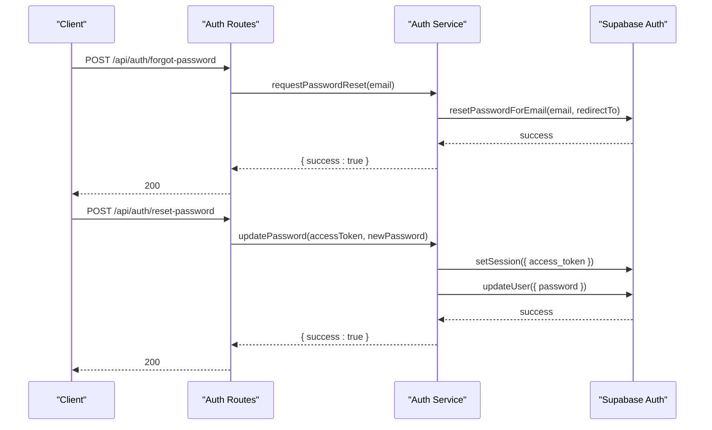

**Diagram sources**
- [auth-routes.ts](file://src/routes/auth-routes.ts#L808-L938)
- [auth-service.ts](file://src/services/auth-service.ts#L426-L468)

**Section sources**
- [auth-routes.ts](file://src/routes/auth-routes.ts#L808-L938)
- [auth-service.ts](file://src/services/auth-service.ts#L426-L468)

### Token Validation and RBAC Enforcement
- validateToken: Verifies access tokens via Supabase getUser and returns user identity and role.
- authMiddleware: Extracts Bearer token, validates it, attaches user to request, and passes to handlers.
- requireRole: Guards routes by enforcing role membership.

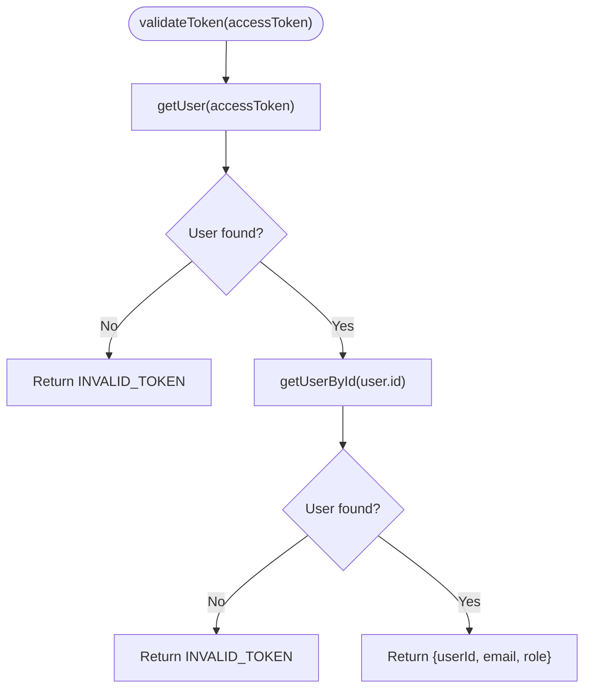

**Diagram sources**
- [auth-service.ts](file://src/services/auth-service.ts#L230-L259)
- [user-repository.ts](file://src/repositories/user-repository.ts#L20-L41)

**Section sources**
- [auth-service.ts](file://src/services/auth-service.ts#L230-L259)
- [auth-middleware.ts](file://src/middleware/auth-middleware.ts#L1-L101)
- [user-repository.ts](file://src/repositories/user-repository.ts#L20-L41)

## Dependency Analysis
- Auth Service depends on Supabase client, user repository, and auth types.
- Auth Routes depend on auth service and rate limiter.
- Auth Middleware depends on auth service for token validation and on user model for role enforcement.
- Supabase client depends on environment configuration.
- User Repository depends on Base Repository and Supabase client.

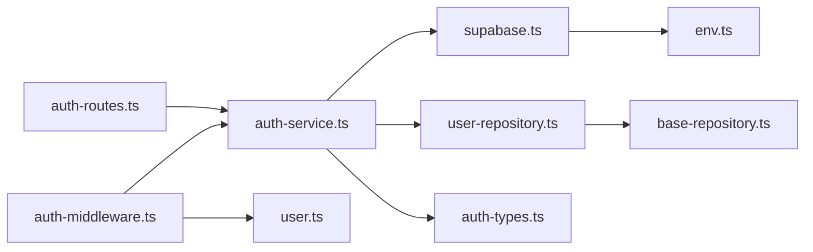

**Diagram sources**
- [auth-routes.ts](file://src/routes/auth-routes.ts#L1-L120)
- [auth-service.ts](file://src/services/auth-service.ts#L1-L120)
- [supabase.ts](file://src/config/supabase.ts#L1-L45)
- [user-repository.ts](file://src/repositories/user-repository.ts#L1-L58)
- [base-repository.ts](file://src/repositories/base-repository.ts#L1-L149)
- [auth-middleware.ts](file://src/middleware/auth-middleware.ts#L1-L70)
- [user.ts](file://src/models/user.ts#L1-L4)
- [env.ts](file://src/config/env.ts#L41-L67)

**Section sources**
- [auth-routes.ts](file://src/routes/auth-routes.ts#L1-L120)
- [auth-service.ts](file://src/services/auth-service.ts#L1-L120)
- [supabase.ts](file://src/config/supabase.ts#L1-L45)
- [user-repository.ts](file://src/repositories/user-repository.ts#L1-L58)
- [base-repository.ts](file://src/repositories/base-repository.ts#L1-L149)
- [auth-middleware.ts](file://src/middleware/auth-middleware.ts#L1-L70)
- [user.ts](file://src/models/user.ts#L1-L4)
- [env.ts](file://src/config/env.ts#L41-L67)

## Performance Considerations
- Minimize round trips: Batch operations where possible; the service already consolidates Supabase calls for registration and refresh.
- Token caching: Avoid frequent token validation by reusing validated user info in request scope; middleware attaches validated user to req.user.
- Rate limiting: Auth routes apply rate limiter to prevent abuse.
- Database efficiency: Use indexed lookups (email) and limit selects to necessary fields.

[No sources needed since this section provides general guidance]

## Troubleshooting Guide
Common issues and resolutions:
- Missing Supabase configuration: Ensure SUPABASE_URL and SUPABASE_ANON_KEY are set; the client throws a descriptive error if missing.
- Invalid or expired tokens: Auth middleware returns standardized 401 responses with AUTH_INVALID_TOKEN or AUTH_TOKEN_EXPIRED codes.
- Duplicate email during registration: Service returns DUPLICATE_EMAIL; handle 409 responses accordingly.
- Unverified email on login: Service returns INVALID_CREDENTIALS with guidance to verify email.
- OAuth callback failures: Verify redirect URLs and provider configuration; ensure PUBLIC_URL is set for callbacks.
- Token exchange failures: The service returns AUTH_EXCHANGE_FAILED; check authorization code validity and provider response.
- Password reset errors: Ensure access token is valid and password meets strength requirements.

Operational tips:
- Log request IDs for traceability; middleware and routes attach timestamps and request IDs.
- Use Swagger UI to test endpoints and inspect error responses.

**Section sources**
- [supabase.ts](file://src/config/supabase.ts#L25-L45)
- [auth-service.ts](file://src/services/auth-service.ts#L68-L155)
- [auth-service.ts](file://src/services/auth-service.ts#L157-L228)
- [auth-service.ts](file://src/services/auth-service.ts#L298-L345)
- [auth-service.ts](file://src/services/auth-service.ts#L426-L468)
- [auth-middleware.ts](file://src/middleware/auth-middleware.ts#L1-L101)
- [auth-routes.ts](file://src/routes/auth-routes.ts#L120-L235)

## Conclusion
The Authentication Service provides a robust, modular foundation for JWT-based authentication and RBAC using Supabase Auth. It offers comprehensive endpoints for registration, login, token refresh, password reset, and OAuth flows. The service integrates tightly with middleware for request validation and role enforcement, and with repositories for user persistence. By following the security best practices outlined here and leveraging the provided extension points, teams can confidently build secure and scalable authentication experiences.

[No sources needed since this section summarizes without analyzing specific files]

## Appendices

### Security Best Practices
- Store refresh tokens securely on the server-side where feasible; avoid storing them in browser local storage.
- Enforce HTTPS and secure cookies for token transport.
- Rotate secrets regularly and configure separate secrets for access and refresh tokens.
- Limit token lifetimes and implement proactive refresh strategies.
- Sanitize and validate all inputs; leverage built-in validation helpers.
- Monitor and log authentication events for auditing and anomaly detection.

[No sources needed since this section provides general guidance]

### Extending for Social Logins and Multi-Factor Authentication
- Social logins: The service already supports OAuth providers via Supabase Auth. Add new providers by updating provider lists and ensuring redirect URLs are configured.
- Multi-factor authentication: Integrate MFA at the Supabase Auth level and coordinate with the service to manage secondary factors during login flows.

[No sources needed since this section provides general guidance]