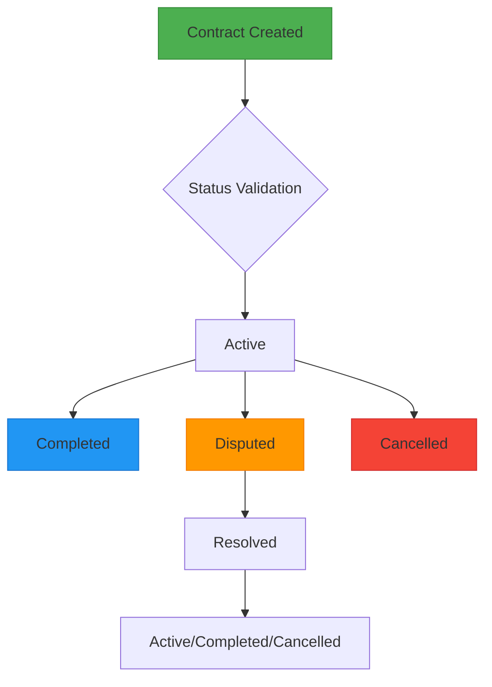
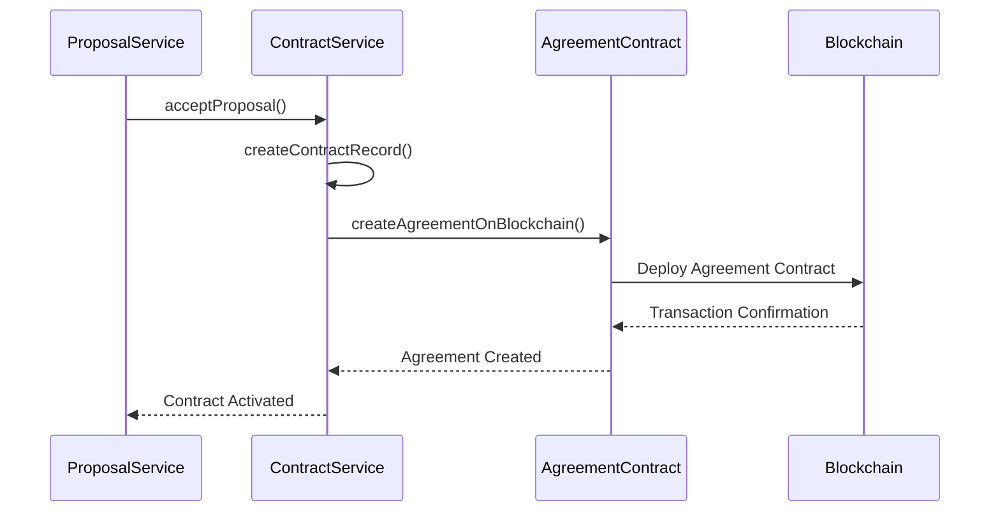
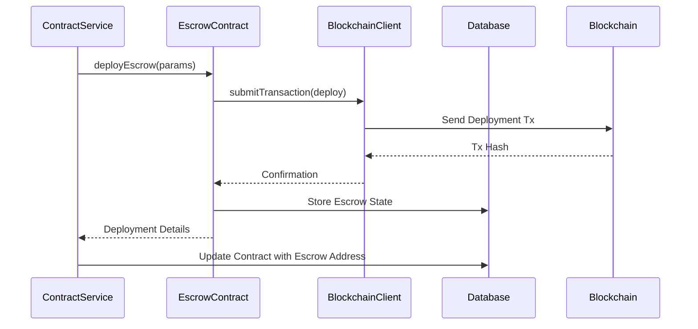
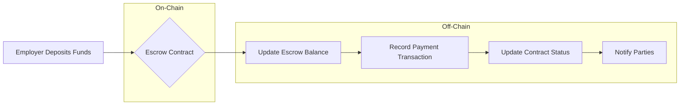
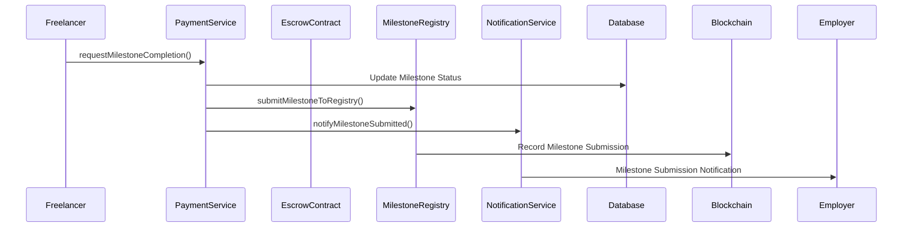
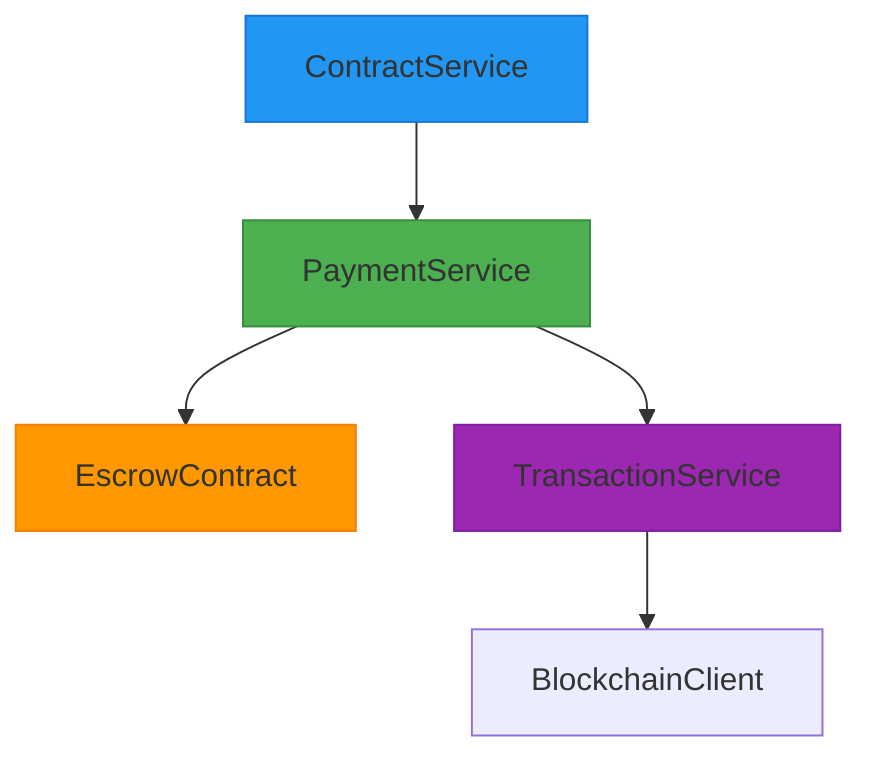
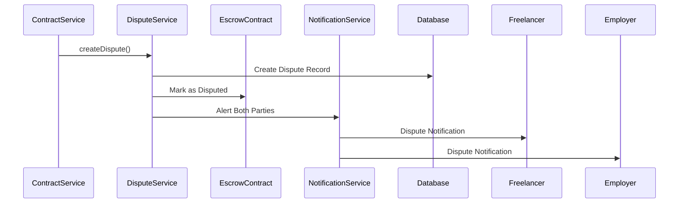
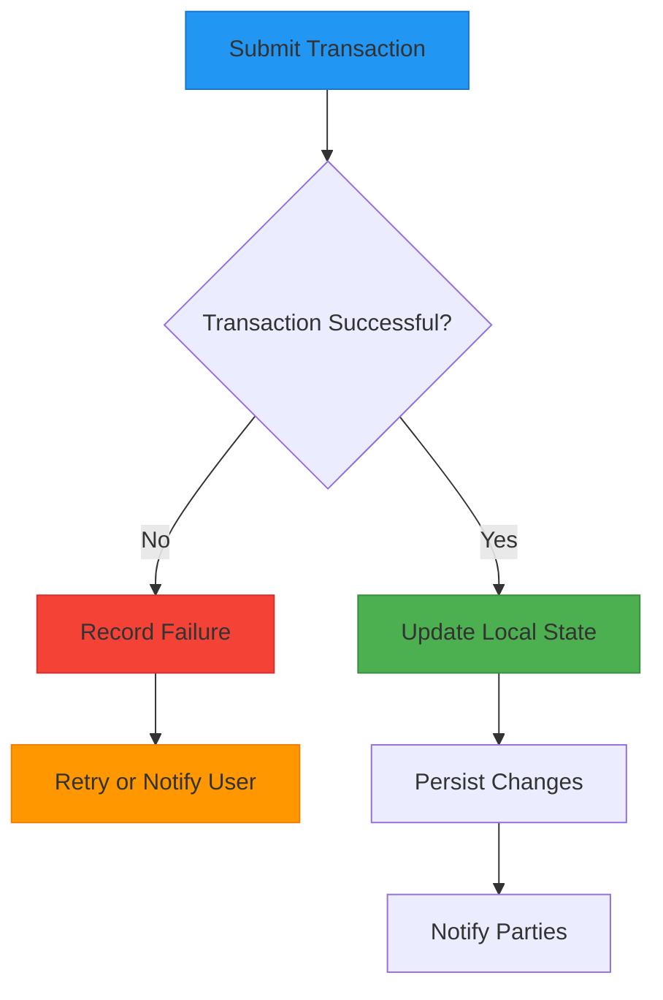

# Contract Service

<cite>
**Referenced Files in This Document**   
- [contract-service.ts](file://src/services/contract-service.ts)
- [escrow-contract.ts](file://src/services/escrow-contract.ts)
- [payment-service.ts](file://src/services/payment-service.ts)
- [dispute-service.ts](file://src/services/dispute-service.ts)
- [blockchain-client.ts](file://src/services/blockchain-client.ts)
- [contract-repository.ts](file://src/repositories/contract-repository.ts)
- [entity-mapper.ts](file://src/utils/entity-mapper.ts)
- [blockchain-types.ts](file://src/services/blockchain-types.ts)
- [milestone-registry.ts](file://src/services/milestone-registry.ts)
- [agreement-contract.ts](file://src/services/agreement-contract.ts)
</cite>

## Table of Contents
1. [Introduction](#introduction)
2. [Core Contract Lifecycle Methods](#core-contract-lifecycle-methods)
3. [Decentralized Contract Management](#decentralized-contract-management)
4. [Integration with FreelanceEscrow Smart Contract](#integration-with-freelanceescrow-smart-contract)
5. [State Synchronization and Event Coordination](#state-synchronization-and-event-coordination)
6. [Dependency Analysis](#dependency-analysis)
7. [Error Handling and Idempotency](#error-handling-and-idempotency)
8. [Performance Considerations](#performance-considerations)

## Introduction

The Contract Service provides decentralized contract management for freelance agreements within the FreelanceXchain platform. It orchestrates the complete lifecycle of contracts from creation to termination, ensuring secure fund handling through blockchain-based escrow mechanisms. The service maintains synchronization between on-chain and off-chain states while coordinating with payment and dispute resolution systems to provide a comprehensive contract management solution.

**Section sources**
- [contract-service.ts](file://src/services/contract-service.ts#L1-L140)

## Core Contract Lifecycle Methods

The Contract Service implements a comprehensive set of methods for managing the contract lifecycle, with strict validation and state transition rules.

### createContract
While not explicitly shown in the provided code, contract creation is initiated through the proposal acceptance flow, which creates a contract record in the database and triggers blockchain agreement creation.

### approveContract
The approval process is managed through the `updateContractStatus` method, which enforces valid state transitions according to business rules. Contracts can transition from 'active' to 'completed', 'disputed', or 'cancelled' states.

**Diagram sources**
- [contract-service.ts](file://src/services/contract-service.ts#L77-L82)

### activateContract
Contract activation occurs when funds are deposited into the escrow system. The `setEscrowAddress` method associates a deployed escrow contract address with a contract record, effectively activating it for transactions.

### terminateContract
Termination is handled through status updates to 'completed' or 'cancelled' states. The `updateContractStatus` method validates these transitions and updates the contract state accordingly.

**Section sources**
- [contract-service.ts](file://src/services/contract-service.ts#L65-L103)
- [contract-service.ts](file://src/services/contract-service.ts#L105-L126)

## Decentralized Contract Management

The Contract Service implements a decentralized approach to contract management by integrating on-chain and off-chain systems for enhanced security and transparency.

### Contract Creation and Initialization
When a proposal is accepted, a contract is created and registered on the blockchain through the agreement contract system. This creates a tamper-proof record of the agreement terms.

**Diagram sources**
- [agreement-contract.ts](file://src/services/agreement-contract.ts#L77-L90)
- [proposal-service.ts](file://src/services/proposal-service.ts#L240-L263)

### Status Tracking
The service maintains contract status in both the database and on-chain systems. The `getContractById` and related methods provide access to contract details with proper error handling for non-existent contracts.

### Lifecycle Events
The contract lifecycle is managed through a series of coordinated events:
- Contract creation triggers blockchain agreement deployment
- Fund deposit activates the contract
- Milestone completion initiates payment release
- Dispute resolution updates contract status
- Final milestone approval completes the contract

**Section sources**
- [contract-service.ts](file://src/services/contract-service.ts#L23-L63)
- [agreement-contract.ts](file://src/services/agreement-contract.ts#L77-L251)

## Integration with FreelanceEscrow Smart Contract

The Contract Service coordinates closely with the escrow system to manage funds securely throughout the contract lifecycle.

### Escrow Deployment and Fund Management
The service interacts with the escrow contract through the `escrow-contract.ts` module, which provides a clean interface for blockchain operations.

**Diagram sources**
- [escrow-contract.ts](file://src/services/escrow-contract.ts#L38-L83)
- [payment-service.ts](file://src/services/payment-service.ts#L594-L627)

### Key Integration Points
- **deployEscrow**: Deploys a new escrow contract with specified parameters
- **depositToEscrow**: Facilitates fund deposits from employer to escrow
- **releaseMilestone**: Releases funds to freelancer upon milestone approval
- **refundMilestone**: Refunds funds to employer in case of dispute resolution

The integration ensures that all financial transactions are recorded on-chain while maintaining a synchronized state in the off-chain database.

**Section sources**
- [escrow-contract.ts](file://src/services/escrow-contract.ts#L38-L327)
- [payment-service.ts](file://src/services/payment-service.ts#L594-L642)

## State Synchronization and Event Coordination

The Contract Service ensures consistency between on-chain and off-chain states through careful coordination of events and transactions.

### Fund Deposit and Milestone Initialization
When a contract is funded, the system synchronizes the deposit across multiple systems:

**Diagram sources**
- [escrow-contract.ts](file://src/services/escrow-contract.ts#L90-L132)
- [transaction-service.ts](file://src/services/transaction-service.ts#L68-L77)

### Event Flow for Milestone Completion
The completion of milestones triggers a cascade of coordinated events across systems:

**Diagram sources**
- [payment-service.ts](file://src/services/payment-service.ts#L86-L193)
- [milestone-registry.ts](file://src/services/milestone-registry.ts#L63-L135)

### Two-Way Synchronization
The system maintains two-way synchronization between blockchain and database states:
- Database changes trigger blockchain transactions
- Blockchain events are reflected in database updates
- Status changes are propagated to all relevant parties

**Section sources**
- [payment-service.ts](file://src/services/payment-service.ts#L169-L173)
- [milestone-registry.ts](file://src/services/milestone-registry.ts#L63-L135)

## Dependency Analysis

The Contract Service depends on several key services to provide comprehensive contract management functionality.

### Payment Service Integration
The Contract Service relies on the payment service for transaction processing, particularly for escrow operations and payment recording.

**Diagram sources**
- [payment-service.ts](file://src/services/payment-service.ts#L13-L17)
- [transaction-service.ts](file://src/services/transaction-service.ts#L1-L125)

### Dispute Service Integration
For conflict resolution, the Contract Service integrates with the dispute service to handle disagreements between parties.

**Diagram sources**
- [dispute-service.ts](file://src/services/dispute-service.ts#L67-L206)
- [dispute-service.ts](file://src/services/dispute-service.ts#L300-L458)

### Blockchain Client Dependency
All blockchain interactions are mediated through the blockchain client, which handles transaction submission and confirmation.

**Section sources**
- [escrow-contract.ts](file://src/services/escrow-contract.ts#L7-L11)
- [blockchain-client.ts](file://src/services/blockchain-client.ts#L7-L293)

## Error Handling and Idempotency

The Contract Service implements robust error handling and idempotency mechanisms to ensure reliability in distributed operations.

### Transaction Failure Handling
The system handles blockchain transaction failures gracefully, with proper error propagation and recovery mechanisms.

**Diagram sources**
- [blockchain-client.ts](file://src/services/blockchain-client.ts#L131-L159)
- [escrow-contract.ts](file://src/services/escrow-contract.ts#L95-L124)

### Nonce Management
In the simulated environment, nonce management is handled implicitly through the transaction submission process. In a production environment, this would ensure transaction ordering and prevent replay attacks.

### Idempotency in Contract Operations
All contract operations are designed to be idempotent where possible, ensuring that repeated calls with the same parameters produce the same result without unintended side effects.

**Section sources**
- [blockchain-client.ts](file://src/services/blockchain-client.ts#L131-L159)
- [escrow-contract.ts](file://src/services/escrow-contract.ts#L90-L132)

## Performance Considerations

The Contract Service is designed with performance and scalability in mind for handling high-frequency contract events.

### High-Frequency Event Handling
The service architecture supports handling numerous concurrent contract events through:

- Asynchronous processing of blockchain transactions
- Efficient database queries with pagination
- Caching of frequently accessed contract data
- Batch processing of related operations

### On-Chain State Monitoring
The system monitors on-chain state changes through a combination of:

- Transaction confirmation polling
- Event-driven updates
- Periodic state synchronization
- Webhook integration for real-time notifications

### Optimization Strategies
Key performance optimizations include:

- Minimizing blockchain interactions through batch operations
- Using efficient data structures for state management
- Implementing connection pooling for database access
- Caching blockchain contract addresses and ABIs
- Optimizing transaction serialization and deserialization

**Section sources**
- [blockchain-client.ts](file://src/services/blockchain-client.ts#L184-L239)
- [escrow-contract.ts](file://src/services/escrow-contract.ts#L19-L32)