# Dispute Service

<cite>
**Referenced Files in This Document**   
- [dispute-service.ts](file://src/services/dispute-service.ts)
- [dispute-registry.ts](file://src/services/dispute-registry.ts)
- [dispute-routes.ts](file://src/routes/dispute-routes.ts)
- [notification-service.ts](file://src/services/notification-service.ts)
- [payment-service.ts](file://src/services/payment-service.ts)
- [escrow-contract.ts](file://src/services/escrow-contract.ts)
- [agreement-contract.ts](file://src/services/agreement-contract.ts)
- [DisputeResolution.sol](file://contracts/DisputeResolution.sol)
- [dispute-repository.ts](file://src/repositories/dispute-repository.ts)
- [entity-mapper.ts](file://src/utils/entity-mapper.ts)
</cite>

## Table of Contents
1. [Introduction](#introduction)
2. [Core Methods](#core-methods)
3. [Dispute Lifecycle Management](#dispute-lifecycle-management)
4. [Blockchain Integration](#blockchain-integration)
5. [Integration with Other Services](#integration-with-other-services)
6. [Error Handling and Validation](#error-handling-and-validation)
7. [Security and Access Control](#security-and-access-control)
8. [Extensibility and Future Enhancements](#extensibility-and-future-enhancements)
9. [Conclusion](#conclusion)

## Introduction

The Dispute Service is a critical component of the FreelanceXchain platform, responsible for managing conflict resolution between freelancers and employers. It provides a structured process for dispute creation, evidence submission, status tracking, and resolution processing. The service ensures fair arbitration by implementing strict validation rules, maintaining an immutable evidence trail on the blockchain, and coordinating with other services for fund redistribution and stakeholder notifications.

The service is designed to handle disputes at the milestone level within contracts, allowing parties to resolve specific issues without terminating the entire engagement. It integrates with the blockchain through the dispute-registry service to create transparent, tamper-proof records of all dispute-related activities, ensuring trust and accountability in the resolution process.

**Section sources**
- [dispute-service.ts](file://src/services/dispute-service.ts#L1-L521)

## Core Methods

The Dispute Service exposes several core methods that form the foundation of the conflict resolution system:

### createDispute

The `createDispute` method initiates a new dispute for a specific milestone within a contract. It performs comprehensive validation to ensure the requesting party is eligible to create a dispute, the milestone exists, and no active dispute already exists for the same milestone. The method creates a dispute record in the database and registers it on the blockchain through the dispute-registry.

**Section sources**
- [dispute-service.ts](file://src/services/dispute-service.ts#L67-L206)

### submitEvidence

The `submitEvidence` method allows contract parties to submit evidence to support their case during a dispute. It accepts three types of evidence: text, file, and link. The method validates that the submitter is part of the contract, the dispute is still open or under review, and then adds the evidence to the dispute record. The updated evidence hash is recorded on the blockchain to maintain an immutable audit trail.

**Section sources**
- [dispute-service.ts](file://src/services/dispute-service.ts#L213-L293)

### resolveDispute

The `resolveDispute` method is used by administrators to resolve disputes with one of three possible decisions: in favor of the freelancer, in favor of the employer, or a split decision. The method triggers appropriate financial actions through the escrow-contract service, updates the milestone status, and records the resolution on the blockchain. Only users with admin privileges can call this method.

**Section sources**
- [dispute-service.ts](file://src/services/dispute-service.ts#L300-L458)

### getDisputeHistory

The service provides several methods to retrieve dispute history, including `getDisputeById`, `getDisputesByContract`, `getOpenDisputes`, and `getDisputesByInitiator`. These methods allow users and administrators to track dispute status and history, with appropriate access controls to ensure only authorized parties can view sensitive information.

**Section sources**
- [dispute-service.ts](file://src/services/dispute-service.ts#L464-L520)

## Dispute Lifecycle Management

The Dispute Service manages the complete lifecycle of a dispute through well-defined states and transitions:

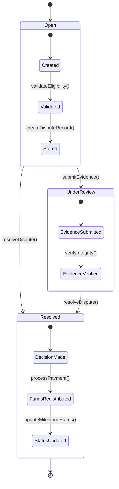

**Diagram sources**
- [dispute-service.ts](file://src/services/dispute-service.ts#L67-L458)
- [dispute-repository.ts](file://src/repositories/dispute-repository.ts#L4-L29)

The dispute lifecycle begins with the `createDispute` method, which validates eligibility and creates a dispute record with status "open". When evidence is submitted via `submitEvidence`, the status transitions to "under_review" if it was previously "open". The lifecycle concludes with `resolveDispute`, which sets the status to "resolved" and triggers the appropriate resolution actions.

**Section sources**
- [dispute-service.ts](file://src/services/dispute-service.ts#L67-L458)

## Blockchain Integration

The Dispute Service integrates with the blockchain through the dispute-registry service to ensure transparency and immutability of dispute records. This integration is critical for maintaining trust in the conflict resolution process.

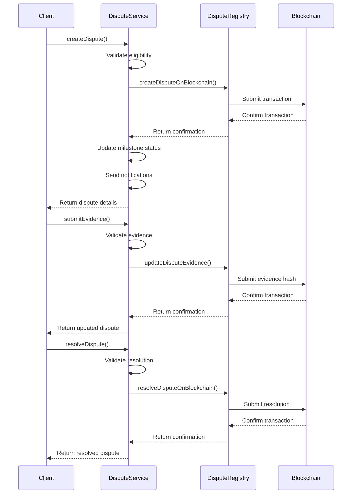

**Diagram sources**
- [dispute-service.ts](file://src/services/dispute-service.ts#L24-L27)
- [dispute-registry.ts](file://src/services/dispute-registry.ts#L69-L253)
- [DisputeResolution.sol](file://contracts/DisputeResolution.sol#L48-L125)

The `DisputeResolution.sol` smart contract implements the core blockchain functionality, storing dispute records with cryptographic hashes of evidence and resolution details. The contract emits events for key actions (DisputeCreated, EvidenceSubmitted, DisputeResolved) that can be monitored for audit purposes.

**Section sources**
- [dispute-registry.ts](file://src/services/dispute-registry.ts#L1-L289)
- [DisputeResolution.sol](file://contracts/DisputeResolution.sol#L1-L153)

## Integration with Other Services

The Dispute Service coordinates with several other services to provide a comprehensive conflict resolution system:

### Payment Service Integration

When a dispute is resolved, the Dispute Service interacts with the payment-service to redistribute funds according to the resolution decision:

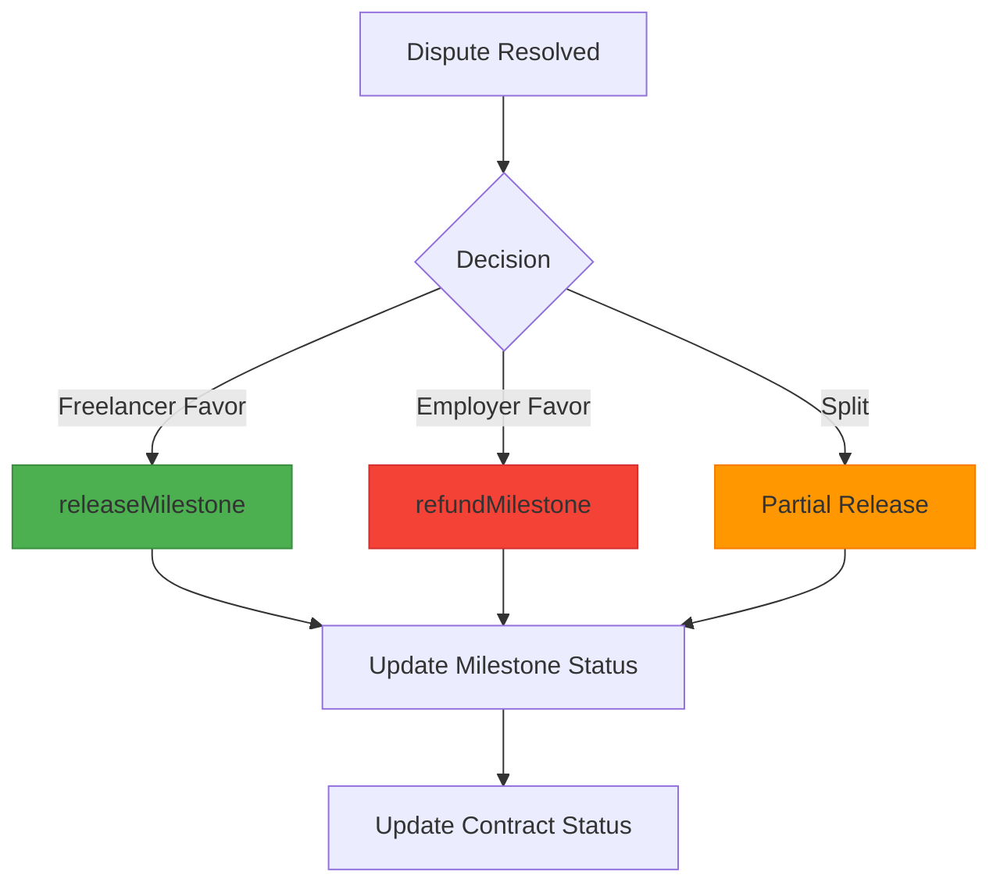

**Diagram sources**
- [dispute-service.ts](file://src/services/dispute-service.ts#L367-L383)
- [escrow-contract.ts](file://src/services/escrow-contract.ts#L138-L264)

The service calls `releaseEscrowMilestone` to release funds to the freelancer when the decision favors them, or `refundEscrowMilestone` to return funds to the employer when the decision favors the employer. These actions are executed through the escrow-contract service, which interfaces with the blockchain to transfer funds securely.

**Section sources**
- [dispute-service.ts](file://src/services/dispute-service.ts#L19-L22)
- [payment-service.ts](file://src/services/payment-service.ts#L13-L17)

### Notification Service Integration

The Dispute Service integrates with the notification-service to keep all stakeholders informed of dispute status changes:

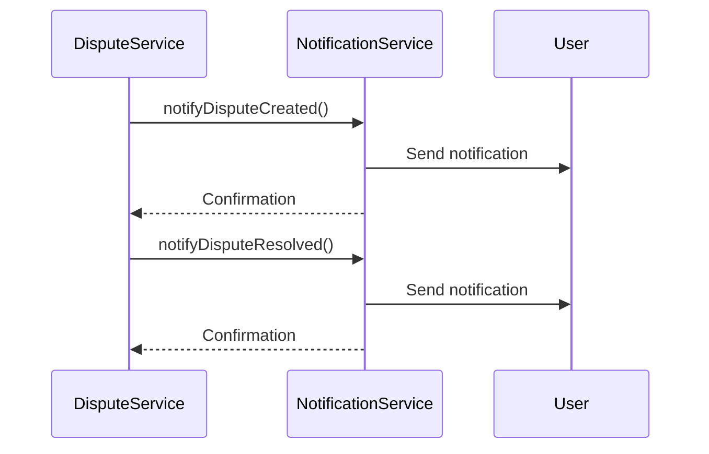

**Diagram sources**
- [dispute-service.ts](file://src/services/dispute-service.ts#L15-L17)
- [notification-service.ts](file://src/services/notification-service.ts#L265-L299)

The service triggers notifications when a dispute is created and when it is resolved, ensuring both parties are kept informed of the dispute status. This integration enhances transparency and user experience by providing timely updates.

**Section sources**
- [dispute-service.ts](file://src/services/dispute-service.ts#L185-L203)
- [dispute-service.ts](file://src/services/dispute-service.ts#L435-L455)

### Contract Service Integration

The Dispute Service interacts with the contract-service to update contract status when disputes are created or resolved:

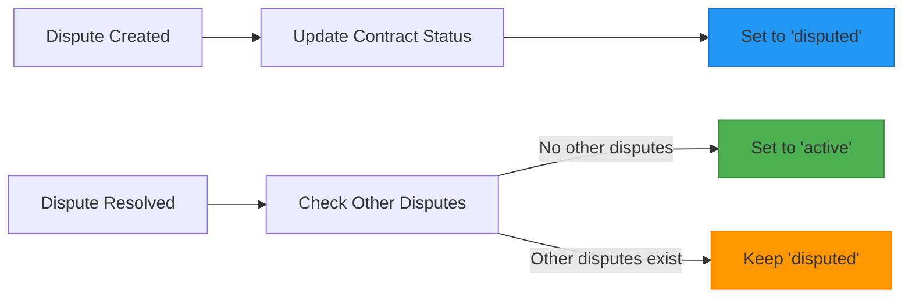

**Diagram sources**
- [dispute-service.ts](file://src/services/dispute-service.ts#L182-L183)
- [dispute-service.ts](file://src/services/dispute-service.ts#L394-L400)

When a dispute is created, the associated contract status is updated to "disputed". When a dispute is resolved, the service checks if there are other active disputes on the contract. If not, the contract status is reverted to "active", allowing work to continue on other milestones.

**Section sources**
- [dispute-service.ts](file://src/services/dispute-service.ts#L175-L183)
- [dispute-service.ts](file://src/services/dispute-service.ts#L394-L400)

## Error Handling and Validation

The Dispute Service implements comprehensive error handling and validation to ensure data integrity and prevent abuse:

### Dispute Creation Validation

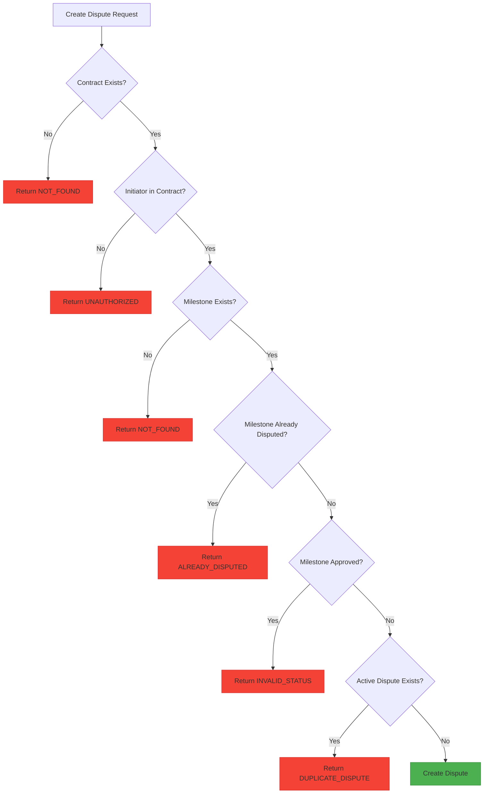

**Diagram sources**
- [dispute-service.ts](file://src/services/dispute-service.ts#L72-L134)

The service validates multiple conditions before creating a dispute, including contract existence, initiator eligibility, milestone existence, and dispute status. This prevents invalid disputes from being created and ensures the integrity of the dispute resolution process.

**Section sources**
- [dispute-service.ts](file://src/services/dispute-service.ts#L72-L134)

### Evidence Submission Validation

The service validates evidence submissions to ensure only authorized parties can submit evidence and that evidence is submitted during the appropriate dispute phase:

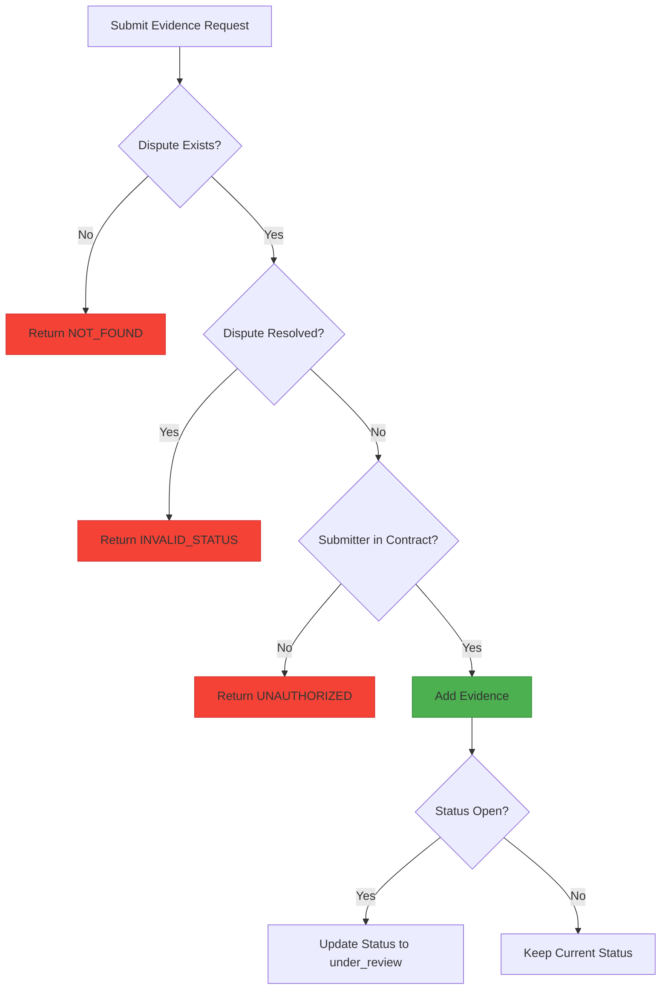

**Diagram sources**
- [dispute-service.ts](file://src/services/dispute-service.ts#L218-L249)

The validation ensures that evidence can only be submitted for active disputes by parties involved in the contract. When evidence is submitted to an "open" dispute, the status automatically transitions to "under_review" to reflect that the evidence phase has begun.

**Section sources**
- [dispute-service.ts](file://src/services/dispute-service.ts#L218-L249)

### Resolution Validation

The service implements strict validation for dispute resolution to prevent unauthorized resolutions:

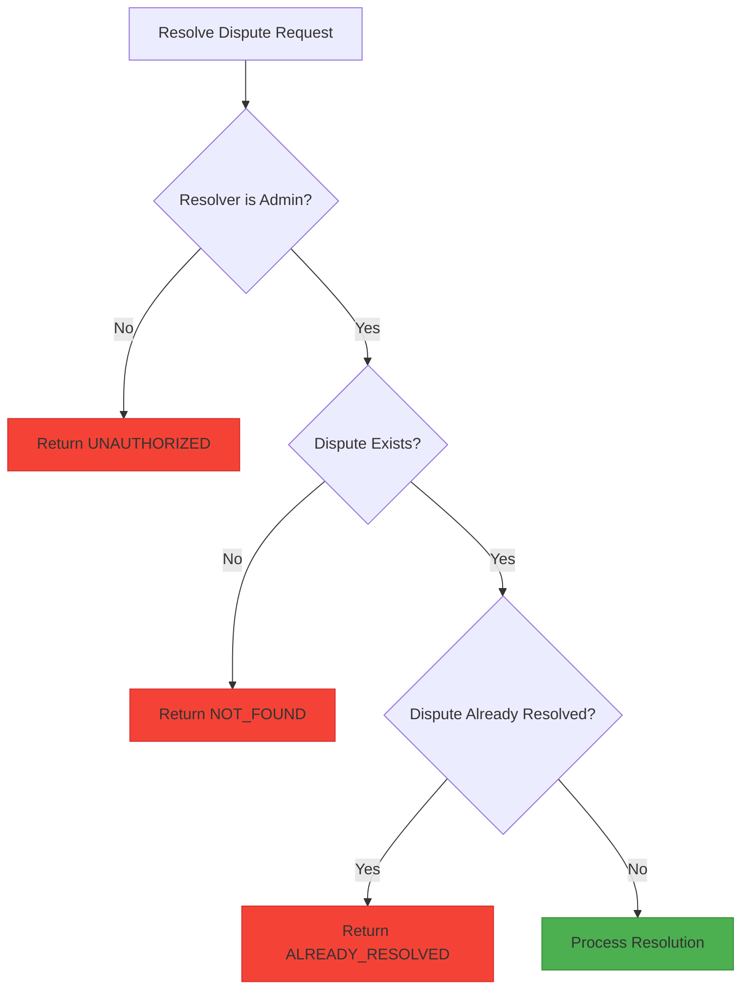

**Diagram sources**
- [dispute-service.ts](file://src/services/dispute-service.ts#L305-L327)

Only users with admin privileges can resolve disputes, ensuring that resolution decisions are made by authorized personnel. The service also prevents double-resolution of disputes by checking the current status before processing the resolution.

**Section sources**
- [dispute-service.ts](file://src/services/dispute-service.ts#L305-L327)

## Security and Access Control

The Dispute Service implements robust security measures to protect sensitive dispute information and prevent unauthorized access:

### Role-Based Access Control

The service enforces strict role-based access control for all operations:

- **Dispute Creation**: Available to both freelancers and employers who are parties to the contract
- **Evidence Submission**: Available to both freelancers and employers who are parties to the contract
- **Dispute Resolution**: Restricted to administrators only
- **Dispute Viewing**: Available to contract parties and administrators

This ensures that sensitive dispute information is only accessible to authorized parties while maintaining the necessary separation of duties for dispute resolution.

**Section sources**
- [dispute-service.ts](file://src/services/dispute-service.ts#L306-L311)
- [dispute-routes.ts](file://src/routes/dispute-routes.ts#L446-L451)

### Data Integrity Protection

The service protects data integrity through multiple mechanisms:

1. **Blockchain Recording**: All dispute actions are recorded on the blockchain with cryptographic hashes, creating an immutable audit trail
2. **Evidence Hashing**: Evidence submissions are hashed and stored on-chain, preventing tampering
3. **Status Validation**: The service validates dispute status before allowing state transitions
4. **Entity Mapping**: Data is properly sanitized and mapped between database and API representations

These measures ensure that dispute records cannot be altered after creation and that the resolution process is transparent and verifiable.

**Section sources**
- [dispute-registry.ts](file://src/services/dispute-registry.ts#L62-L64)
- [entity-mapper.ts](file://src/utils/entity-mapper.ts#L343-L371)

## Extensibility and Future Enhancements

The Dispute Service is designed with extensibility in mind, allowing for future enhancements to the conflict resolution system:

### Automated Mediation

The service could be extended to support automated mediation by integrating AI-powered analysis of dispute evidence:

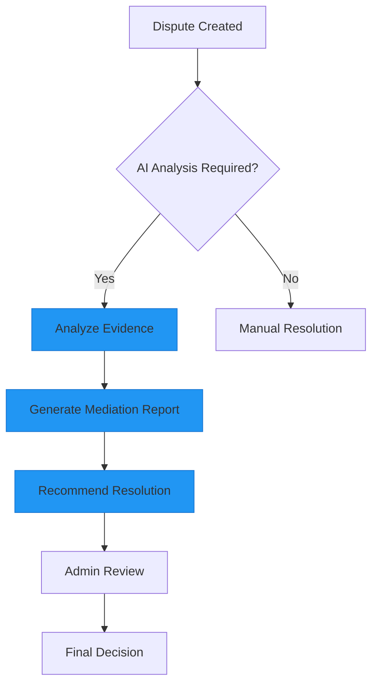

This enhancement would leverage the structured evidence submission system to provide data-driven recommendations for dispute resolution, potentially reducing resolution time and improving consistency.

**Section sources**
- [dispute-service.ts](file://src/services/dispute-service.ts#L248-L259)

### Third-Party Arbitrator Integration

The service could be extended to support third-party arbitrators by modifying the resolution process:

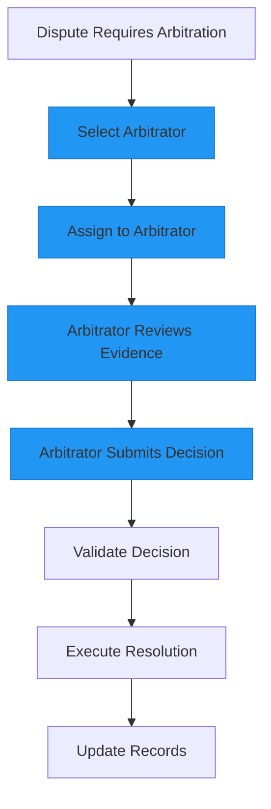

This would involve extending the `resolveDispute` method to accept decisions from authorized arbitrators and potentially modifying the blockchain contract to record arbitrator details.

**Section sources**
- [dispute-service.ts](file://src/services/dispute-service.ts#L54-L60)

### Time-Bound Resolution Windows

The service could implement time-bound resolution windows to ensure disputes are resolved promptly:

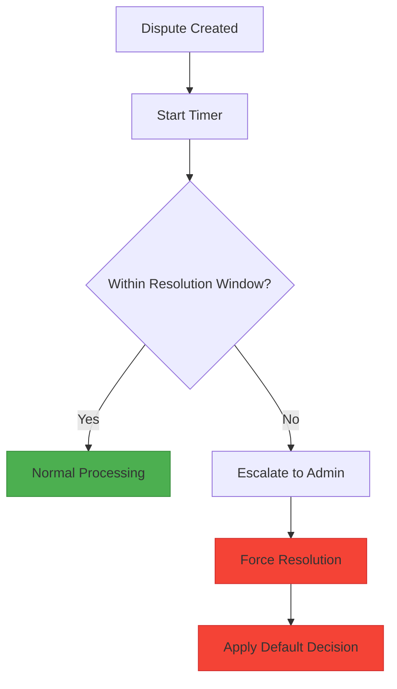

This enhancement would add timestamp tracking to dispute records and implement background processes to monitor resolution deadlines, ensuring that disputes do not remain unresolved indefinitely.

**Section sources**
- [dispute-repository.ts](file://src/repositories/dispute-repository.ts#L21-L32)

## Conclusion

The Dispute Service provides a comprehensive conflict resolution system that balances fairness, transparency, and efficiency. By integrating with the blockchain through the dispute-registry service, it creates an immutable record of all dispute-related activities, ensuring trust and accountability in the resolution process. The service's modular design and clear separation of concerns make it easy to extend with additional features such as automated mediation or third-party arbitrator integration.

The service effectively coordinates with other components of the FreelanceXchain platform, including the payment-service for fund redistribution, the notification-service for stakeholder updates, and the contract-service for contract status management. Its robust validation and error handling ensure data integrity and prevent abuse, while its role-based access control protects sensitive information.

Overall, the Dispute Service forms a critical part of the platform's trust infrastructure, providing a reliable mechanism for resolving conflicts and maintaining a healthy marketplace for freelance work.