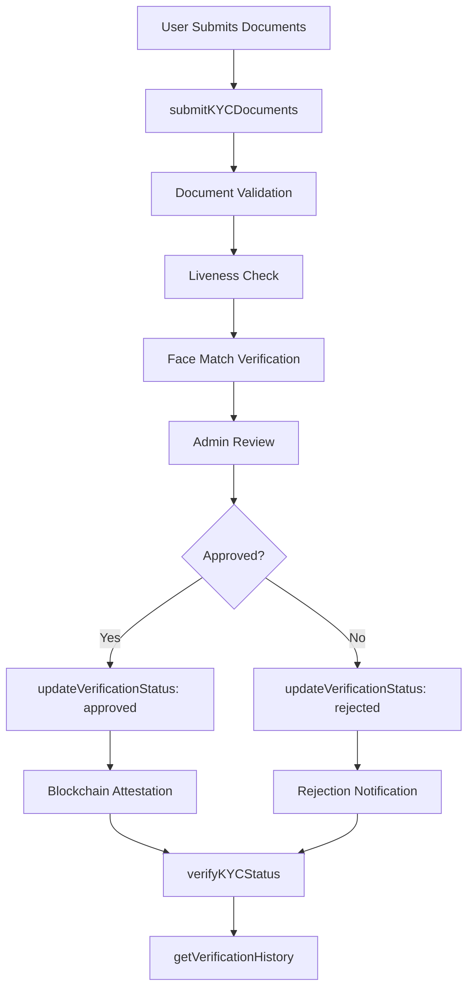
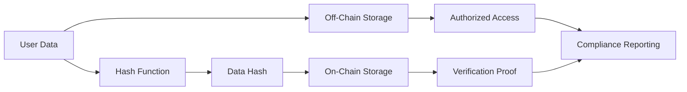
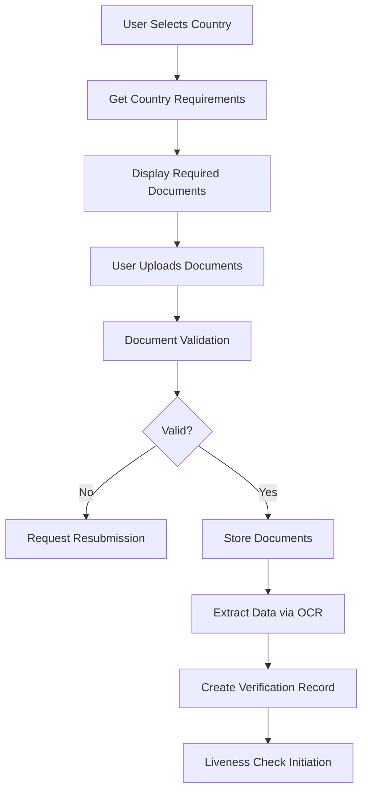
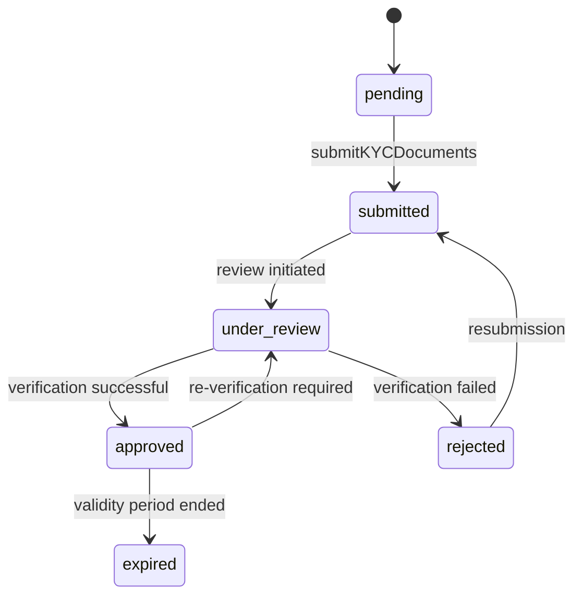
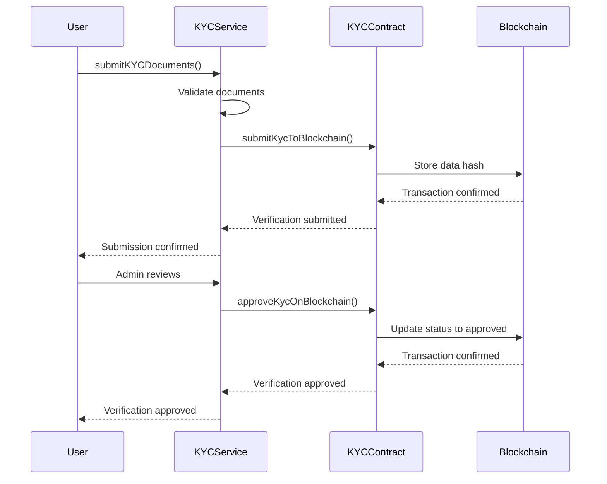

# KYC Verification Service

<cite>
**Referenced Files in This Document**   
- [kyc-service.ts](file://src/services/kyc-service.ts)
- [kyc-contract.ts](file://src/services/kyc-contract.ts)
- [kyc-repository.ts](file://src/repositories/kyc-repository.ts)
- [kyc.ts](file://src/models/kyc.ts)
- [kyc-routes.ts](file://src/routes/kyc-routes.ts)
- [KYCVerification.sol](file://contracts/KYCVerification.sol)
- [auth-service.ts](file://src/services/auth-service.ts)
- [payment-service.ts](file://src/services/payment-service.ts)
- [test-kyc-flow.cjs](file://scripts/test-kyc-flow.cjs)
</cite>

## Table of Contents
1. [Introduction](#introduction)
2. [Core Methods](#core-methods)
3. [Privacy-Preserving Identity Verification](#privacy-preserving-identity-verification)
4. [Document Submission Process](#document-submission-process)
5. [Status Tracking and Verification Workflows](#status-tracking-and-verification-workflows)
6. [Compliance Management](#compliance-management)
7. [Integration with KYCVerification Smart Contract](#integration-with-kycverification-smart-contract)
8. [Integration with auth-service](#integration-with-auth-service)
9. [Integration with payment-service](#integration-with-payment-service)
10. [Handling Sensitive Personal Data](#handling-sensitive-personal-data)
11. [Common Issues and Solutions](#common-issues-and-solutions)
12. [Service Extension Guidance](#service-extension-guidance)
13. [Conclusion](#conclusion)

## Introduction
The KYC Verification Service provides a comprehensive solution for identity verification in the FreelanceXchain platform, implementing privacy-preserving methods for document submission, status tracking, and compliance management. This service ensures regulatory compliance while protecting user privacy through a multi-layered verification process that combines document validation, liveness detection, and facial recognition. The service integrates with the KYCVerification smart contract for on-chain attestation, creating an immutable record of verification status while maintaining GDPR compliance by storing only cryptographic hashes of personal data on-chain.

**Section sources**
- [kyc-service.ts](file://src/services/kyc-service.ts#L1-L547)
- [kyc-contract.ts](file://src/services/kyc-contract.ts#L1-L366)
- [KYCVerification.sol](file://contracts/KYCVerification.sol#L1-L211)

## Core Methods
The KYC Verification Service exposes several core methods that handle the complete verification lifecycle:

- **submitKYCDocuments**: Initiates the KYC verification process by submitting identity documents and personal information
- **verifyKYCStatus**: Retrieves the current status of a user's KYC verification
- **updateVerificationStatus**: Updates the verification status through administrative review
- **getVerificationHistory**: Retrieves the complete history of verification attempts and status changes

These methods work together to create a robust verification workflow that ensures compliance with international regulations while providing a seamless user experience.

**Diagram sources**
- [kyc-service.ts](file://src/services/kyc-service.ts#L90-L189)
- [kyc-service.ts](file://src/services/kyc-service.ts#L328-L407)

## Privacy-Preserving Identity Verification
The KYC Verification Service implements a privacy-first approach to identity verification, ensuring compliance with data protection regulations like GDPR. The service minimizes the exposure of sensitive personal data through several mechanisms:

1. **Data Minimization**: Only essential personal information is collected and stored
2. **Cryptographic Hashing**: Personal data is hashed before on-chain storage
3. **On-Chain/Off-Chain Separation**: Sensitive data remains off-chain while verification status is recorded on-chain
4. **Access Controls**: Strict authentication and authorization requirements for accessing KYC data

The service supports different KYC tiers (basic, standard, enhanced) based on the user's country of residence and risk profile, with enhanced verification required for higher-risk jurisdictions.

**Diagram sources**
- [kyc-contract.ts](file://src/services/kyc-contract.ts#L69-L80)
- [KYCVerification.sol](file://contracts/KYCVerification.sol#L19-L24)

## Document Submission Process
The document submission process is designed to be user-friendly while ensuring data integrity and security. Users can submit various document types including passports, national IDs, driver's licenses, and residence permits. The service validates document authenticity through multiple checks:

- Document type validation based on country requirements
- Expiry date verification
- Image quality assessment
- Optical Character Recognition (OCR) for data extraction
- Machine Readable Zone (MRZ) parsing for passports

The submission process also includes requirements for proof of address documents in certain jurisdictions, with specific document types accepted based on the user's country of residence.

**Diagram sources**
- [kyc-service.ts](file://src/services/kyc-service.ts#L90-L189)
- [kyc.ts](file://src/models/kyc.ts#L136-L167)

## Status Tracking and Verification Workflows
The KYC service implements a comprehensive status tracking system with multiple verification states:

- **pending**: Initial state before submission
- **submitted**: Documents submitted, awaiting review
- **under_review**: Currently being reviewed by administrators
- **approved**: Verification successful
- **rejected**: Verification failed

The workflow includes automated checks and manual review stages, with notifications sent at each status transition. The service also tracks the verification history, maintaining an audit trail of all status changes and reviewer actions.

**Diagram sources**
- [kyc.ts](file://src/models/kyc.ts#L1-L2)
- [kyc-service.ts](file://src/services/kyc-service.ts#L86-L88)

## Compliance Management
The KYC Verification Service includes comprehensive compliance management features to meet regulatory requirements across different jurisdictions. Key compliance features include:

- **AML Screening**: Integration with anti-money laundering databases
- **PEP Checks**: Politically Exposed Persons screening
- **Sanctions List Verification**: Checks against international sanctions lists
- **Risk Scoring**: Automated risk assessment based on user profile and behavior
- **Audit Trails**: Complete logging of all verification activities

The service supports different compliance requirements based on the user's country of residence, with enhanced due diligence required for higher-risk jurisdictions. The system also implements automatic expiration of verifications after one year, requiring periodic re-verification to maintain compliance.

**Section sources**
- [kyc-service.ts](file://src/services/kyc-service.ts#L328-L407)
- [kyc.ts](file://src/models/kyc.ts#L105-L110)

## Integration with KYCVerification Smart Contract
The KYC Verification Service integrates with the KYCVerification smart contract to provide on-chain attestation of verification status. This integration creates a trustless, immutable record of verification that can be independently verified by third parties. The integration follows a privacy-preserving design where only verification status and cryptographic hashes are stored on-chain, while sensitive personal data remains off-chain.

The integration process involves:

1. **Submission**: When a user submits KYC documents, a transaction is sent to the smart contract with a hash of the KYC data
2. **Approval**: When an administrator approves a verification, a transaction updates the on-chain status to "approved"
3. **Rejection**: When a verification is rejected, a transaction updates the on-chain status to "rejected" with a reason
4. **Verification**: Third parties can verify a user's KYC status by checking the blockchain record

**Diagram sources**
- [kyc-service.ts](file://src/services/kyc-service.ts#L169-L187)
- [kyc-service.ts](file://src/services/kyc-service.ts#L388-L402)
- [kyc-contract.ts](file://src/services/kyc-contract.ts#L93-L156)
- [kyc-contract.ts](file://src/services/kyc-contract.ts#L162-L221)

## Integration with auth-service
The KYC Verification Service integrates with the auth-service to bind identity verification to user accounts. This integration ensures that only verified users can access certain platform features and helps prevent account takeover and identity fraud. The integration points include:

- **Identity Binding**: Linking KYC verification to user accounts during registration
- **Access Control**: Restricting access to sensitive features based on KYC status
- **Session Management**: Including KYC status in authentication tokens
- **Profile Updates**: Synchronizing verified identity information with user profiles

The integration uses JWT tokens to communicate KYC status between services, with the auth-service including KYC tier and expiration information in the authentication token for downstream services to enforce access controls.

**Section sources**
- [kyc-service.ts](file://src/services/kyc-service.ts#L169-L187)
- [auth-service.ts](file://src/services/auth-service.ts#L68-L155)

## Integration with payment-service
The KYC Verification Service integrates with the payment-service to enforce withdrawal restrictions and ensure compliance with financial regulations. This integration prevents unverified users from conducting financial transactions on the platform. Key integration points include:

- **Withdrawal Restrictions**: Blocking withdrawals for users without approved KYC
- **Transaction Limits**: Applying lower transaction limits for users with basic KYC
- **Escrow Funding**: Requiring KYC verification before funding escrow accounts
- **Payment Processing**: Verifying KYC status before processing payments

The integration ensures that financial activities on the platform comply with anti-money laundering (AML) and know your customer (KYC) regulations, reducing the platform's regulatory risk.

**Section sources**
- [kyc-service.ts](file://src/services/kyc-service.ts#L473-L479)
- [payment-service.ts](file://src/services/payment-service.ts#L86-L193)

## Handling Sensitive Personal Data
The KYC Verification Service implements robust security measures to protect sensitive personal data throughout the verification process. These measures include:

- **Encryption**: All personal data is encrypted at rest and in transit
- **Access Controls**: Role-based access to KYC data with audit logging
- **Data Minimization**: Collecting only the minimum necessary personal information
- **Retention Policies**: Automatic deletion of data after verification expiration
- **Secure Storage**: Using secure cloud storage with access controls for document images

The service also implements privacy-preserving techniques such as data masking, where sensitive information is obscured in user interfaces, and differential privacy, which adds noise to aggregated data to prevent re-identification.

**Section sources**
- [kyc-service.ts](file://src/services/kyc-service.ts#L116-L159)
- [kyc-repository.ts](file://src/repositories/kyc-repository.ts#L44-L79)

## Common Issues and Solutions
The KYC Verification Service addresses several common issues in identity verification:

### Document Fraud Detection
The service implements multiple layers of fraud detection:
- **Image Analysis**: Detecting signs of tampering or manipulation in document images
- **Consistency Checks**: Verifying consistency between different data points
- **Database Cross-Referencing**: Checking document numbers against known fraudulent documents
- **Behavioral Analysis**: Monitoring for patterns indicative of synthetic identities

### Verification Latency
To reduce verification latency, the service implements:
- **Automated Pre-Checks**: Performing initial validation immediately upon submission
- **Parallel Processing**: Running document validation, liveness checks, and AML screening concurrently
- **Caching**: Caching frequently accessed data to reduce database queries
- **Optimized Workflows**: Streamlining the verification process to minimize steps

### Regulatory Compliance Across Jurisdictions
The service handles regulatory differences through:
- **Country-Specific Rules**: Configurable requirements for each supported country
- **Dynamic Tier Assignment**: Automatically assigning KYC tiers based on risk factors
- **Local Compliance Partners**: Integration with local compliance providers for jurisdiction-specific requirements
- **Regulatory Updates**: Regular updates to comply with changing regulations

**Section sources**
- [kyc-service.ts](file://src/services/kyc-service.ts#L46-L63)
- [kyc-service.ts](file://src/services/kyc-service.ts#L269-L305)
- [kyc-service.ts](file://src/services/kyc-service.ts#L470-L546)

## Service Extension Guidance
The KYC Verification Service is designed to be extensible, allowing for the addition of new verification methods and integration with third-party providers. Guidance for extending the service includes:

### Biometric Verification Extension
To add biometric verification capabilities:
1. Implement a new service module for biometric data processing
2. Add API endpoints for biometric data submission and verification
3. Update the KYC model to include biometric data references
4. Integrate with the blockchain contract to record biometric verification status
5. Update the verification workflow to include biometric checks

### Third-Party KYC Provider Integration
To integrate with third-party KYC providers:
1. Implement an adapter pattern to standardize communication with different providers
2. Add configuration options for provider selection and API credentials
3. Update the document submission process to route requests to the appropriate provider
4. Implement fallback mechanisms for provider outages
5. Ensure compliance with data protection regulations when sharing data with providers

The service architecture supports these extensions through its modular design, with clear separation between the core verification logic and specific verification methods.

**Section sources**
- [kyc-service.ts](file://src/services/kyc-service.ts#L1-L547)
- [kyc-contract.ts](file://src/services/kyc-contract.ts#L1-L366)

## Conclusion
The KYC Verification Service provides a comprehensive, privacy-preserving solution for identity verification in the FreelanceXchain platform. By combining document validation, liveness detection, facial recognition, and blockchain attestation, the service ensures regulatory compliance while protecting user privacy. The integration with the KYCVerification smart contract creates an immutable, verifiable record of verification status, enhancing trust in the platform. The service's modular architecture and extensibility make it well-suited to adapt to evolving regulatory requirements and technological advancements in identity verification.