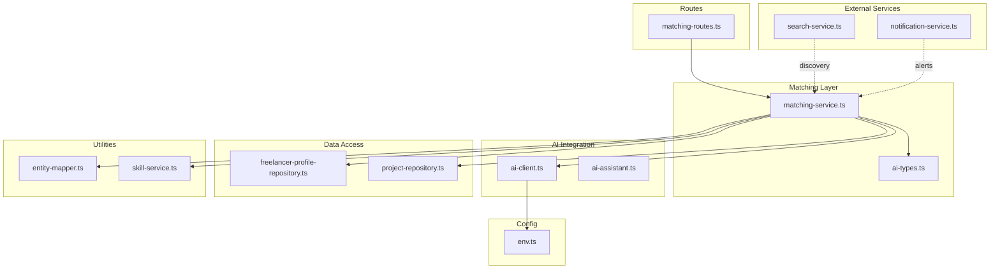
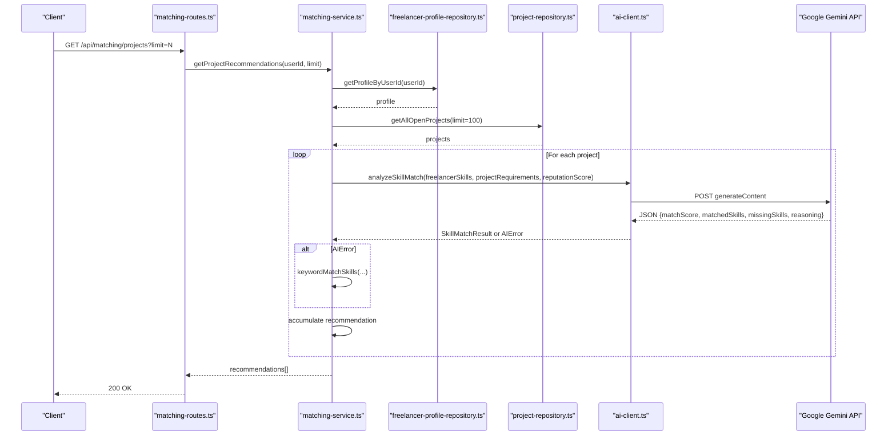
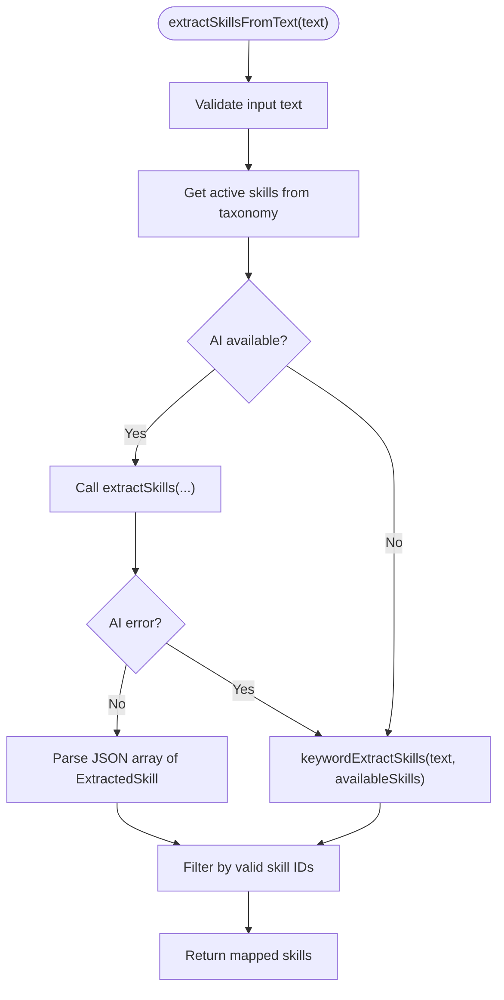
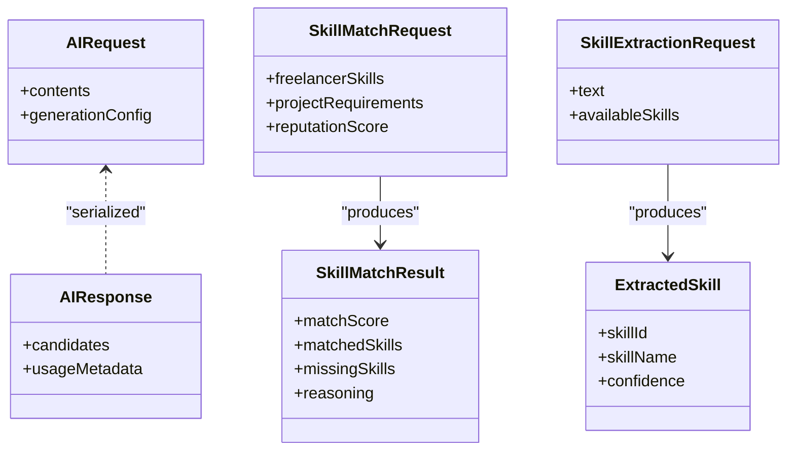
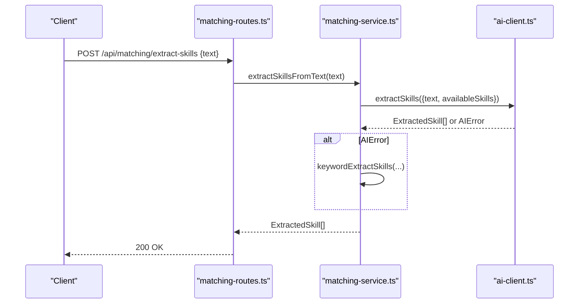
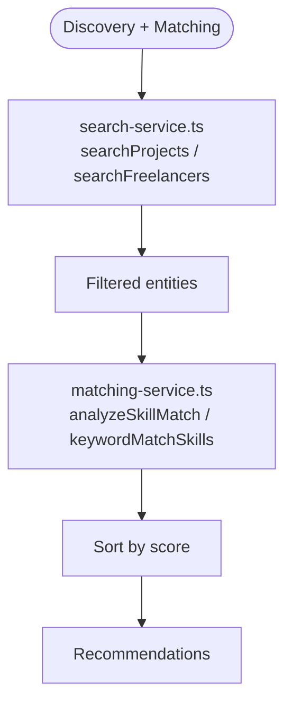
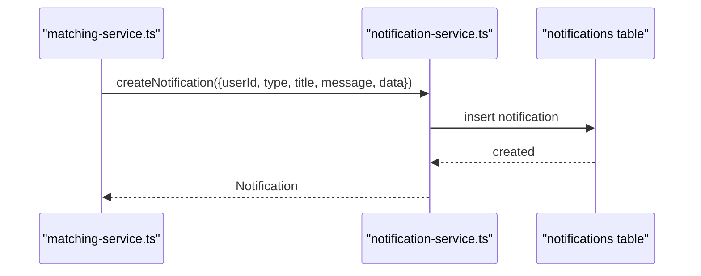
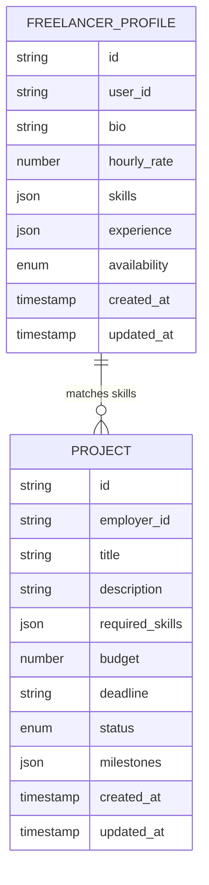
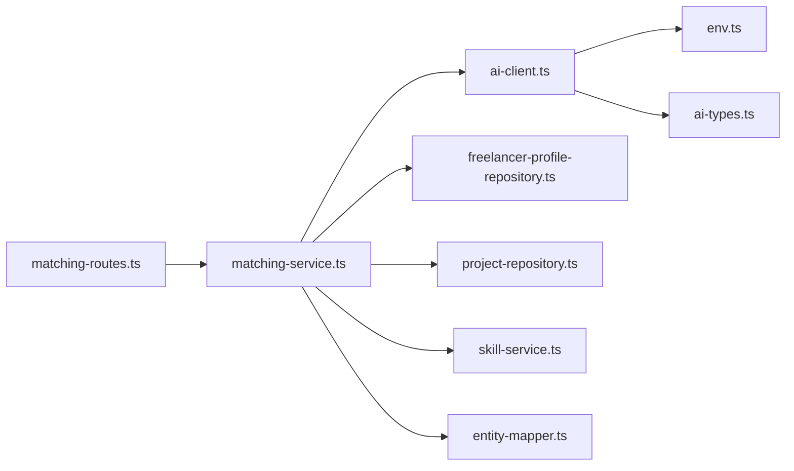

# Matching Service

<cite>
**Referenced Files in This Document**
- [matching-service.ts](file://src/services/matching-service.ts)
- [ai-client.ts](file://src/services/ai-client.ts)
- [ai-assistant.ts](file://src/services/ai-assistant.ts)
- [ai-types.ts](file://src/services/ai-types.ts)
- [matching-routes.ts](file://src/routes/matching-routes.ts)
- [search-service.ts](file://src/services/search-service.ts)
- [notification-service.ts](file://src/services/notification-service.ts)
- [env.ts](file://src/config/env.ts)
- [freelancer-profile-repository.ts](file://src/repositories/freelancer-profile-repository.ts)
- [project-repository.ts](file://src/repositories/project-repository.ts)
- [entity-mapper.ts](file://src/utils/entity-mapper.ts)
- [skill-service.ts](file://src/services/skill-service.ts)
</cite>

## Table of Contents
1. [Introduction](#introduction)
2. [Project Structure](#project-structure)
3. [Core Components](#core-components)
4. [Architecture Overview](#architecture-overview)
5. [Detailed Component Analysis](#detailed-component-analysis)
6. [Dependency Analysis](#dependency-analysis)
7. [Performance Considerations](#performance-considerations)
8. [Troubleshooting Guide](#troubleshooting-guide)
9. [Conclusion](#conclusion)
10. [Appendices](#appendices)

## Introduction
This document explains the Matching Service that powers AI-driven skill matching between freelancers and projects. It integrates with the Google Gemini API via an AI client to compute compatibility scores, extract skills from unstructured text, and analyze skill gaps. The service exposes REST endpoints for project and freelancer recommendations, skill extraction, and skill gap analysis. It also interacts with the Search Service for real-time discovery and the Notification Service for recommendation alerts.

## Project Structure
The Matching Service is implemented as a cohesive module with clear boundaries:
- Service layer: matching-service orchestrates matching logic and delegates to AI client and repositories.
- AI integration: ai-client encapsulates LLM API calls, retries, timeouts, and prompt building.
- Routes: matching-routes expose REST endpoints for clients.
- Repositories: freelancer-profile-repository and project-repository provide data access.
- Utilities: entity-mapper converts database entities to API models; skill-service supplies taxonomy data.
- Configuration: env.ts defines LLM API credentials and endpoint.

**Diagram sources**
- [matching-service.ts](file://src/services/matching-service.ts#L1-L391)
- [ai-client.ts](file://src/services/ai-client.ts#L1-L465)
- [ai-assistant.ts](file://src/services/ai-assistant.ts#L1-L390)
- [ai-types.ts](file://src/services/ai-types.ts#L1-L123)
- [matching-routes.ts](file://src/routes/matching-routes.ts#L1-L370)
- [search-service.ts](file://src/services/search-service.ts#L1-L206)
- [notification-service.ts](file://src/services/notification-service.ts#L1-L316)
- [env.ts](file://src/config/env.ts#L1-L70)
- [freelancer-profile-repository.ts](file://src/repositories/freelancer-profile-repository.ts#L1-L122)
- [project-repository.ts](file://src/repositories/project-repository.ts#L1-L191)
- [entity-mapper.ts](file://src/utils/entity-mapper.ts#L1-L412)
- [skill-service.ts](file://src/services/skill-service.ts#L1-L285)

**Section sources**
- [matching-service.ts](file://src/services/matching-service.ts#L1-L391)
- [ai-client.ts](file://src/services/ai-client.ts#L1-L465)
- [matching-routes.ts](file://src/routes/matching-routes.ts#L1-L370)
- [env.ts](file://src/config/env.ts#L1-L70)

## Core Components
- Matching Service: Implements recommendation engines for both directions (freelancer-to-project and project-to-freelancer), skill extraction from text, and skill gap analysis. It falls back to keyword-based matching when AI is unavailable.
- AI Client: Manages Google Gemini API requests, including retries, timeouts, parsing, and prompt templating for skill matching, extraction, and gap analysis.
- AI Assistant: Provides additional AI-powered content generation and analysis (proposal writing, project description generation, dispute analysis) using the same underlying AI client.
- Routes: Exposes REST endpoints for recommendations, skill extraction, and skill gap analysis with authentication and validation.
- Repositories: Provide access to freelancer profiles and projects, including filtering and pagination helpers.
- Utilities: Entity mapper transforms database entities to API models; skill-service supplies taxonomy data for skill extraction.

**Section sources**
- [matching-service.ts](file://src/services/matching-service.ts#L1-L391)
- [ai-client.ts](file://src/services/ai-client.ts#L1-L465)
- [ai-assistant.ts](file://src/services/ai-assistant.ts#L1-L390)
- [matching-routes.ts](file://src/routes/matching-routes.ts#L1-L370)
- [freelancer-profile-repository.ts](file://src/repositories/freelancer-profile-repository.ts#L1-L122)
- [project-repository.ts](file://src/repositories/project-repository.ts#L1-L191)
- [entity-mapper.ts](file://src/utils/entity-mapper.ts#L1-L412)
- [skill-service.ts](file://src/services/skill-service.ts#L1-L285)

## Architecture Overview
The Matching Service follows a layered architecture:
- Presentation: Express routes handle incoming requests and delegate to the Matching Service.
- Application: Matching Service coordinates repositories, AI client, and utilities.
- Infrastructure: Repositories abstract Supabase access; AI client abstracts LLM API calls; env.ts centralizes configuration.

**Diagram sources**
- [matching-routes.ts](file://src/routes/matching-routes.ts#L148-L182)
- [matching-service.ts](file://src/services/matching-service.ts#L77-L141)
- [ai-client.ts](file://src/services/ai-client.ts#L250-L319)
- [freelancer-profile-repository.ts](file://src/repositories/freelancer-profile-repository.ts#L29-L31)
- [project-repository.ts](file://src/repositories/project-repository.ts#L76-L94)

## Detailed Component Analysis

### Matching Service Methods
- getProjectRecommendations(freelancerId, limit)
  - Loads freelancer profile and available projects.
  - Converts skills to internal SkillInfo format.
  - Calls analyzeSkillMatch via AI client; falls back to keywordMatchSkills if AI fails.
  - Ranks by matchScore and returns top-N recommendations.

- getFreelancerRecommendations(projectId, limit)
  - Loads project and available freelancers.
  - Computes AI match score per freelancer; combines with reputation weighting.
  - Ranks by combinedScore and returns top-N recommendations.

- extractSkillsFromText(text)
  - Builds available skills from taxonomy.
  - Calls extractSkills via AI client; falls back to keywordExtractSkills if AI fails.
  - Validates extracted skills against taxonomy and returns mapped results.

- analyzeSkillGaps(freelancerId)
  - Builds prompt with current skills and calls generateContent.
  - Parses structured JSON response; returns analysis with recommendations and reasoning.

- Utility helpers
  - calculateMatchScore, sortRecommendationsByScore, sortFreelancerRecommendationsByCombinedScore, isMatchingError.

**Diagram sources**
- [matching-service.ts](file://src/services/matching-service.ts#L223-L269)
- [ai-client.ts](file://src/services/ai-client.ts#L286-L320)

**Section sources**
- [matching-service.ts](file://src/services/matching-service.ts#L77-L218)
- [matching-service.ts](file://src/services/matching-service.ts#L223-L353)

### AI Client and Natural Language Processing
- isAIAvailable checks LLM configuration.
- buildApiUrl composes Gemini endpoint with model and API key.
- makeAIRequest handles retries, timeouts, and network errors with exponential backoff.
- generateContent builds a request and extracts text from AI response.
- analyzeSkillMatch constructs prompt from templates and validates/normalizes JSON.
- extractSkills builds prompt for skill extraction and validates results.
- keywordMatchSkills and keywordExtractSkills provide deterministic fallbacks.

**Diagram sources**
- [ai-types.ts](file://src/services/ai-types.ts#L1-L123)
- [ai-client.ts](file://src/services/ai-client.ts#L1-L465)

**Section sources**
- [ai-client.ts](file://src/services/ai-client.ts#L76-L165)
- [ai-client.ts](file://src/services/ai-client.ts#L220-L319)
- [ai-types.ts](file://src/services/ai-types.ts#L1-L123)

### Routes and API Contracts
- GET /api/matching/projects?limit=N
  - Returns ProjectRecommendation[] sorted by matchScore.
- GET /api/matching/freelancers/:projectId?limit=N
  - Returns FreelancerRecommendation[] sorted by combinedScore.
- POST /api/matching/extract-skills
  - Accepts { text } and returns ExtractedSkill[].
- GET /api/matching/skill-gaps
  - Returns SkillGapAnalysis.

**Diagram sources**
- [matching-routes.ts](file://src/routes/matching-routes.ts#L270-L325)
- [matching-service.ts](file://src/services/matching-service.ts#L223-L269)
- [ai-client.ts](file://src/services/ai-client.ts#L286-L320)

**Section sources**
- [matching-routes.ts](file://src/routes/matching-routes.ts#L115-L370)

### Integration with Search Service
- Discovery pipeline: The Matching Service can leverage the Search Service to pre-filter projects or freelancers by keyword, skills, or budget before computing AI match scores. The Search Service provides optimized repository-backed queries and in-memory filtering for complex combinations.

**Diagram sources**
- [search-service.ts](file://src/services/search-service.ts#L73-L147)
- [search-service.ts](file://src/services/search-service.ts#L150-L206)
- [matching-service.ts](file://src/services/matching-service.ts#L77-L218)

**Section sources**
- [search-service.ts](file://src/services/search-service.ts#L1-L206)
- [matching-service.ts](file://src/services/matching-service.ts#L77-L218)

### Integration with Notification Service
- Recommendation alerts: The Matching Service can trigger notifications to inform users about relevant opportunities or skill gap insights. The Notification Service provides CRUD operations for notifications and helper functions for common event types.

**Diagram sources**
- [notification-service.ts](file://src/services/notification-service.ts#L1-L160)
- [matching-service.ts](file://src/services/matching-service.ts#L1-L391)

**Section sources**
- [notification-service.ts](file://src/services/notification-service.ts#L1-L316)
- [matching-service.ts](file://src/services/matching-service.ts#L1-L391)

### Data Models and Mappings
- SkillInfo: Unified representation for skills across freelancers and projects.
- ProjectRecommendation and FreelancerRecommendation: Structured outputs for recommendations.
- SkillGapAnalysis: Structured analysis of current skills, recommendations, and market demand.

**Diagram sources**
- [freelancer-profile-repository.ts](file://src/repositories/freelancer-profile-repository.ts#L1-L122)
- [project-repository.ts](file://src/repositories/project-repository.ts#L1-L191)
- [entity-mapper.ts](file://src/utils/entity-mapper.ts#L140-L250)

**Section sources**
- [ai-types.ts](file://src/services/ai-types.ts#L39-L100)
- [entity-mapper.ts](file://src/utils/entity-mapper.ts#L140-L250)

## Dependency Analysis
- Matching Service depends on:
  - ai-client for LLM interactions.
  - repositories for data access.
  - skill-service for taxonomy.
  - entity-mapper for model conversion.
- AI Client depends on:
  - env.ts for configuration.
  - ai-types for request/response contracts.
- Routes depend on:
  - Matching Service for business logic.
  - Validation middleware for input sanitization.

**Diagram sources**
- [matching-routes.ts](file://src/routes/matching-routes.ts#L1-L370)
- [matching-service.ts](file://src/services/matching-service.ts#L1-L391)
- [ai-client.ts](file://src/services/ai-client.ts#L1-L465)
- [freelancer-profile-repository.ts](file://src/repositories/freelancer-profile-repository.ts#L1-L122)
- [project-repository.ts](file://src/repositories/project-repository.ts#L1-L191)
- [skill-service.ts](file://src/services/skill-service.ts#L1-L285)
- [entity-mapper.ts](file://src/utils/entity-mapper.ts#L1-L412)
- [env.ts](file://src/config/env.ts#L1-L70)
- [ai-types.ts](file://src/services/ai-types.ts#L1-L123)

**Section sources**
- [matching-service.ts](file://src/services/matching-service.ts#L1-L391)
- [ai-client.ts](file://src/services/ai-client.ts#L1-L465)
- [matching-routes.ts](file://src/routes/matching-routes.ts#L1-L370)

## Performance Considerations
- Batch processing: The service retrieves up to 100 open projects per recommendation run; consider pagination and caching for large datasets.
- AI latency: Requests are bounded by a timeout and retried with exponential backoff; monitor retry counts and error rates.
- Keyword fallback: When AI is unavailable, keyword-based matching ensures continuity but may be less precise.
- Ranking weights: Reputation weight is configurable; adjust weights to balance skill match versus reputation.
- Token limits: Generation config includes maxOutputTokens; tune for desired response length while staying within provider limits.

[No sources needed since this section provides general guidance]

## Troubleshooting Guide
Common issues and resolutions:
- AI Unavailable
  - Symptom: AI_UNAVAILABLE error.
  - Cause: Missing LLM API key or URL.
  - Resolution: Configure LLM_API_KEY and LLM_API_URL in environment.
  - Section sources
    - [ai-client.ts](file://src/services/ai-client.ts#L76-L81)
    - [env.ts](file://src/config/env.ts#L59-L62)

- Rate Limiting and Network Errors
  - Symptom: AI_HTTP_429 or AI_NETWORK_ERROR.
  - Cause: Provider throttling or network instability.
  - Resolution: Retry logic is built-in; consider reducing concurrent requests or adding external rate limiting.
  - Section sources
    - [ai-client.ts](file://src/services/ai-client.ts#L127-L141)
    - [ai-client.ts](file://src/services/ai-client.ts#L146-L164)

- Parsing Failures
  - Symptom: AI_PARSE_ERROR.
  - Cause: Non-JSON or malformed response.
  - Resolution: Ensure prompts return valid JSON; fallback to keyword extraction.
  - Section sources
    - [ai-client.ts](file://src/services/ai-client.ts#L267-L283)
    - [ai-client.ts](file://src/services/ai-client.ts#L298-L310)

- Ambiguous Skill Terminology
  - Symptom: Low match scores or missing skills.
  - Resolution: Improve taxonomy normalization; use keywordExtractSkills as fallback; consider fuzzy matching in future enhancements.
  - Section sources
    - [matching-service.ts](file://src/services/matching-service.ts#L223-L269)
    - [ai-client.ts](file://src/services/ai-client.ts#L360-L384)

- Prompt Engineering Tips
  - Use clear JSON schemas in prompts.
  - Provide explicit examples and constraints.
  - Keep prompts concise while preserving required context.
  - Section sources
    - [ai-client.ts](file://src/services/ai-client.ts#L28-L73)
    - [ai-client.ts](file://src/services/ai-client.ts#L184-L206)

## Conclusion
The Matching Service provides robust AI-powered skill matching with resilient fallbacks, structured outputs, and clear integration points for discovery and notifications. By leveraging the AI client’s retry and timeout mechanisms, and by combining AI with keyword-based matching, it delivers reliable recommendations for both freelancers and projects. Extending the service involves tuning prompts, adjusting ranking weights, and integrating richer signals (e.g., reputation, market demand).

[No sources needed since this section summarizes without analyzing specific files]

## Appendices

### API Endpoints Summary
- GET /api/matching/projects?limit=N
  - Returns ProjectRecommendation[].
- GET /api/matching/freelancers/:projectId?limit=N
  - Returns FreelancerRecommendation[].
- POST /api/matching/extract-skills
  - Body: { text }.
  - Returns ExtractedSkill[].
- GET /api/matching/skill-gaps
  - Returns SkillGapAnalysis.

**Section sources**
- [matching-routes.ts](file://src/routes/matching-routes.ts#L115-L370)