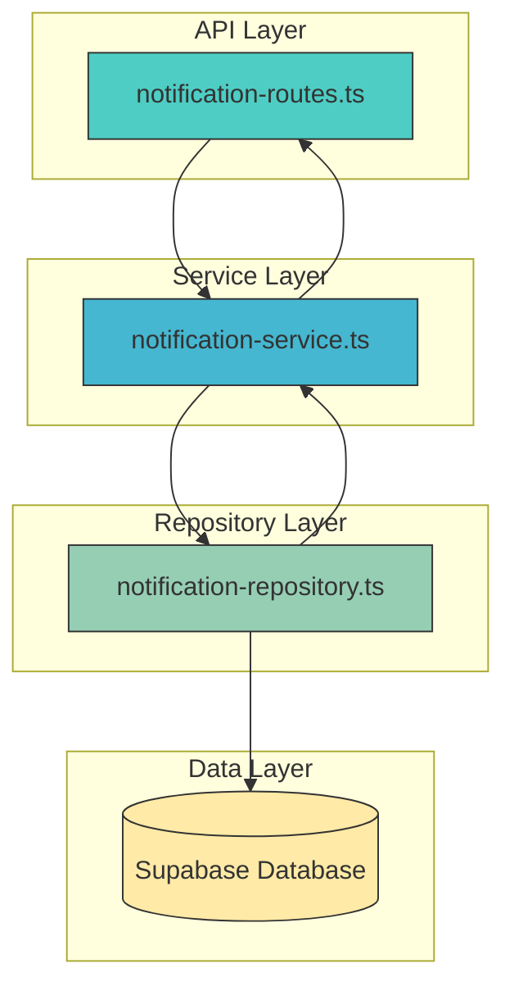
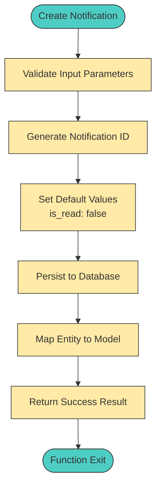
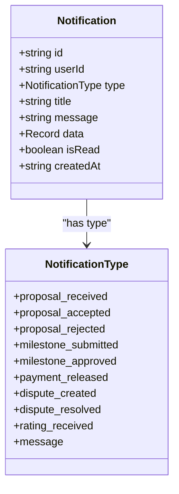
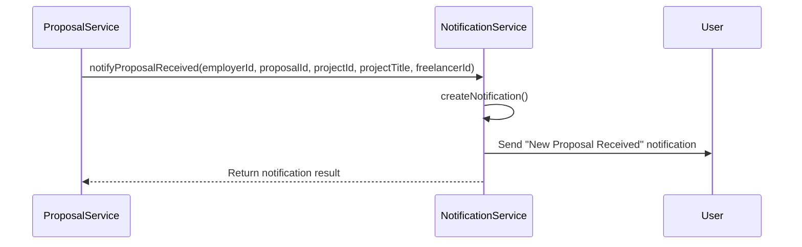
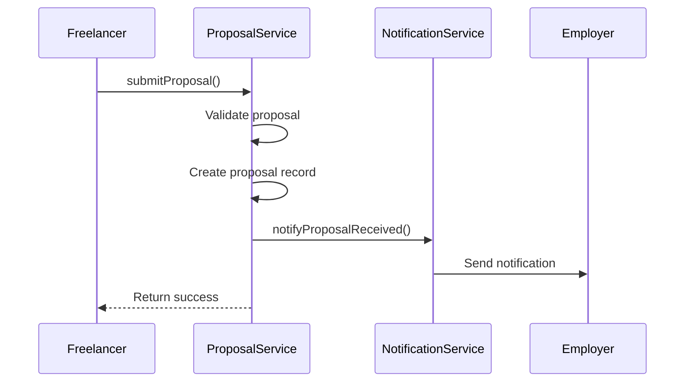
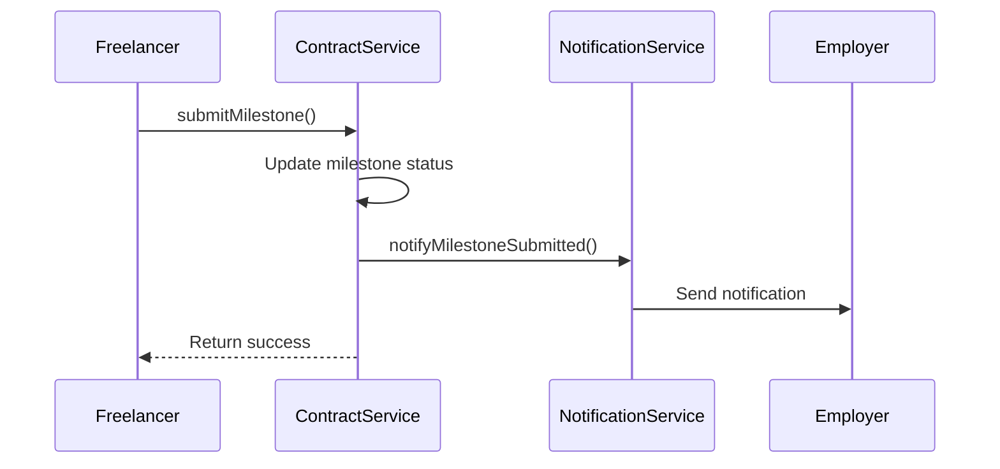
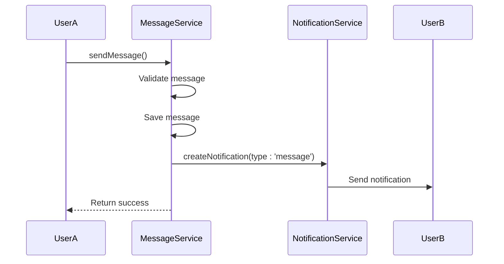

# Notification Service

<cite>
**Referenced Files in This Document**   
- [notification-service.ts](file://src/services/notification-service.ts)
- [notification-repository.ts](file://src/repositories/notification-repository.ts)
- [notification.ts](file://src/models/notification.ts)
- [entity-mapper.ts](file://src/utils/entity-mapper.ts)
- [proposal-service.ts](file://src/services/proposal-service.ts)
- [contract-service.ts](file://src/services/contract-service.ts)
- [message-service.ts](file://src/services/message-service.ts)
- [notification-routes.ts](file://src/routes/notification-routes.ts)
- [schema.sql](file://supabase/schema.sql)
</cite>

## Table of Contents
1. [Introduction](#introduction)
2. [Core Components](#core-components)
3. [Architecture Overview](#architecture-overview)
4. [Detailed Component Analysis](#detailed-component-analysis)
5. [Integration with Other Services](#integration-with-other-services)
6. [Performance Considerations](#performance-considerations)
7. [Troubleshooting Guide](#troubleshooting-guide)
8. [Conclusion](#conclusion)

## Introduction
The Notification Service is a critical component of the FreelanceXchain platform, responsible for managing event-driven notifications that keep users informed about important platform activities. This service handles the creation, delivery, and tracking of alerts for various events such as proposal submissions, milestone approvals, payment releases, and dispute resolutions. The service is designed to enhance user engagement by providing timely updates through in-app notifications, with potential for email and push notifications. It integrates seamlessly with other platform services to trigger relevant notifications based on user actions and system events, maintaining a consistent communication flow throughout the platform ecosystem.

## Core Components

The Notification Service consists of several key components that work together to manage the notification lifecycle. The service provides methods for creating, retrieving, and updating notifications, with a focus on user-specific operations. Key methods include `sendNotification` (implemented as `createNotification`), `markAsRead`, `getUnreadCount`, and `listUserNotifications` (implemented as `getNotificationsByUser`). The service uses a repository pattern to abstract database operations, with the `notificationRepository` handling all data persistence. Notifications are stored in the Supabase database with fields for user identification, notification type, title, message content, metadata, and read status. The service follows a consistent error handling pattern using `NotificationServiceResult` types to provide structured responses with success states and error details.

**Section sources**
- [notification-service.ts](file://src/services/notification-service.ts#L1-L316)
- [notification-repository.ts](file://src/repositories/notification-repository.ts#L1-L118)
- [notification.ts](file://src/models/notification.ts#L1-L3)

## Architecture Overview

The Notification Service follows a clean, layered architecture with clear separation of concerns. At the top level, API routes handle HTTP requests and responses, validating inputs and authenticating users before delegating to service methods. The service layer contains the business logic for notification operations, while the repository layer manages data persistence through the Supabase database. The service uses TypeScript interfaces and types to ensure type safety throughout the stack, with entity mappers converting between database entities (snake_case) and API models (camelCase). This architecture enables maintainable, testable code with minimal coupling between components.

**Diagram sources**
- [notification-routes.ts](file://src/routes/notification-routes.ts#L1-L289)
- [notification-service.ts](file://src/services/notification-service.ts#L1-L316)
- [notification-repository.ts](file://src/repositories/notification-repository.ts#L1-L118)
- [schema.sql](file://supabase/schema.sql#L122-L133)

## Detailed Component Analysis

### Notification Service Methods
The Notification Service provides a comprehensive set of methods for managing notifications. The `createNotification` method creates a new notification with specified parameters including user ID, notification type, title, message, and optional data payload. The method generates a unique ID, sets the read status to false, and persists the notification to the database. The `getNotificationsByUser` method retrieves notifications for a specific user with optional pagination support, returning results sorted by creation time in descending order. The `markNotificationAsRead` method updates a notification's read status, with authorization checks to ensure users can only modify their own notifications. The `getUnreadCount` method efficiently returns the count of unread notifications for a user, enabling badge counters in the UI.

**Diagram sources**
- [notification-service.ts](file://src/services/notification-service.ts#L25-L40)
- [notification-repository.ts](file://src/repositories/notification-repository.ts#L33-L35)

### Notification Types and Data Structure
The Notification Service supports multiple notification types that correspond to key platform events. These include `proposal_received`, `proposal_accepted`, `proposal_rejected`, `milestone_submitted`, `milestone_approved`, `payment_released`, `dispute_created`, `dispute_resolved`, and `rating_received`. Each notification type has a specific purpose and is triggered by corresponding events in the platform workflow. The notification data structure includes a flexible `data` field of type `Record<string, unknown>` that can contain additional context-specific information such as proposal IDs, project titles, and contract details. This design allows for rich, actionable notifications that can drive users to relevant sections of the application.

**Diagram sources**
- [notification-service.ts](file://src/services/notification-service.ts#L6-L12)
- [entity-mapper.ts](file://src/utils/entity-mapper.ts#L374-L384)
- [notification-repository.ts](file://src/repositories/notification-repository.ts#L4-L14)

### Helper Functions for Specific Events
The Notification Service includes specialized helper functions for creating notifications for specific platform events. These functions abstract the details of notification creation for common scenarios, ensuring consistency in messaging and data structure. Functions like `notifyProposalReceived`, `notifyProposalAccepted`, and `notifyMilestoneSubmitted` create notifications with predefined titles, messages, and data payloads tailored to the specific event. This approach reduces code duplication and ensures a consistent user experience across different notification types. The helper functions follow a pattern of accepting relevant entity IDs and contextual information, then constructing appropriate notification content based on the event type.

**Diagram sources**
- [notification-service.ts](file://src/services/notification-service.ts#L164-L315)
- [proposal-service.ts](file://src/services/proposal-service.ts#L108-L120)

## Integration with Other Services

### Proposal Service Integration
The Notification Service integrates closely with the Proposal Service to notify users about proposal-related activities. When a freelancer submits a proposal, the Proposal Service calls the Notification Service to create a `proposal_received` notification for the employer. Similarly, when a proposal is accepted or rejected, the Proposal Service triggers corresponding notifications to inform the freelancer. This integration is implemented through direct function calls between services, with the Proposal Service constructing notification data based on proposal and project context. The integration ensures that users receive timely updates about proposal status changes, facilitating efficient communication and decision-making in the hiring process.

**Diagram sources**
- [proposal-service.ts](file://src/services/proposal-service.ts#L64-L125)
- [notification-service.ts](file://src/services/notification-service.ts#L164-L178)

### Contract Service Integration
The Notification Service also integrates with the Contract Service to provide updates about contract status changes and milestone progress. When a proposal is accepted, a contract is created, and the freelancer receives a `proposal_accepted` notification. As milestones are submitted and approved, the system triggers `milestone_submitted` and `milestone_approved` notifications to keep both parties informed. Payment releases trigger `payment_released` notifications with details about the amount and milestone. This integration ensures transparency in the contract execution process and helps maintain trust between freelancers and employers by providing timely updates on financial transactions and deliverable progress.

**Diagram sources**
- [contract-service.ts](file://src/services/contract-service.ts#L65-L103)
- [notification-service.ts](file://src/services/notification-service.ts#L212-L227)

### Message Service Integration
The Notification Service works in conjunction with the Message Service to notify users about new messages in their conversations. When a user sends a message in a contract conversation, the Message Service automatically creates a `message` notification for the recipient. This integration ensures that users are promptly informed about new messages, encouraging timely responses and maintaining communication flow. The notification includes a truncated version of the message content as the notification message, allowing recipients to quickly understand the context without opening the application. This tight integration between messaging and notifications enhances the collaborative aspects of the platform by reducing response times and improving user engagement.

**Diagram sources**
- [message-service.ts](file://src/services/message-service.ts#L36-L44)
- [notification-service.ts](file://src/services/notification-service.ts#L25-L40)

## Performance Considerations

The Notification Service is designed with performance in mind, particularly for handling high-volume notification bursts during peak platform activity. The service uses efficient database queries with proper indexing on user_id and created_at fields to ensure fast retrieval of user notifications. For the `getUnreadCount` method, the service uses Supabase's count functionality with head: true to optimize performance by retrieving only the count without the actual records. The service also implements pagination for the `getNotificationsByUser` method, limiting the default result set to 100 items to prevent excessive data transfer. For high-volume scenarios, the service could be enhanced with message queues or event emitters to process notification creation asynchronously, preventing blocking operations during critical user workflows. Additionally, implementing Redis caching for frequently accessed data like unread counts could further improve response times for high-traffic endpoints.

**Section sources**
- [notification-repository.ts](file://src/repositories/notification-repository.ts#L104-L114)
- [base-repository.ts](file://src/repositories/base-repository.ts#L129-L147)
- [notification-routes.ts](file://src/routes/notification-routes.ts#L96-L104)

## Troubleshooting Guide

Common issues with the Notification Service typically involve delivery failures, notification deduplication, and user preference management. Delivery failures can occur due to database connectivity issues or invalid user IDs; these are handled through structured error responses that include error codes and messages for client-side handling. Notification deduplication is managed at the application level by ensuring that notification triggers are idempotent and by using unique IDs for each notification. User preference management is currently handled implicitly through the read/unread status, but could be extended to support opt-out mechanisms for specific notification types. Monitoring delivery success rates and implementing retry mechanisms for failed deliveries would enhance reliability. Additionally, ensuring proper authorization checks in methods like `markNotificationAsRead` prevents unauthorized access to notifications, maintaining data privacy and security.

**Section sources**
- [notification-service.ts](file://src/services/notification-service.ts#L118-L132)
- [notification-repository.ts](file://src/repositories/notification-repository.ts#L87-L89)
- [auth-middleware.ts](file://src/middleware/auth-middleware.ts#L25-L70)

## Conclusion
The Notification Service is a well-structured, essential component of the FreelanceXchain platform that effectively manages user communications across various platform activities. Its clean architecture, comprehensive feature set, and seamless integration with other services make it a robust solution for maintaining user engagement and awareness. The service successfully implements the required functionality for creating, delivering, and tracking notifications while providing a solid foundation for future enhancements such as email and push notifications. By following established patterns and leveraging the Supabase database efficiently, the service delivers reliable performance and maintainability. The extensive integration with other platform services ensures that users receive timely, relevant updates about their projects, proposals, and contracts, contributing significantly to the overall user experience and platform effectiveness.