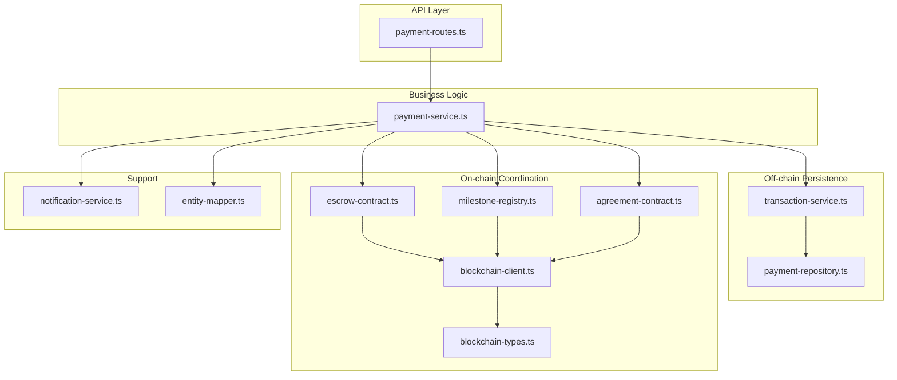
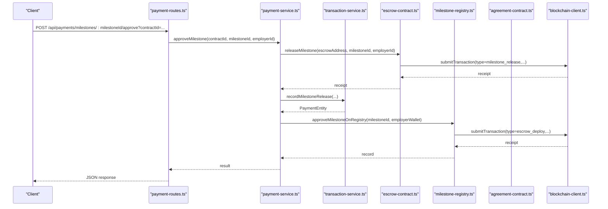
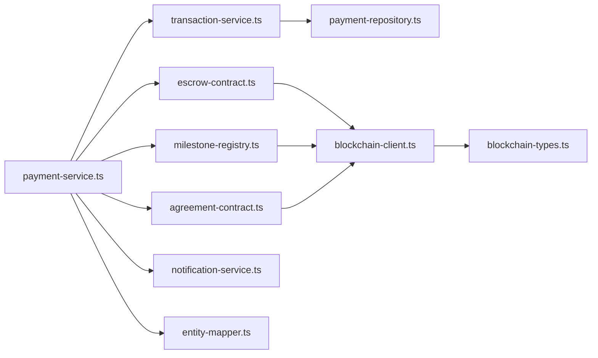
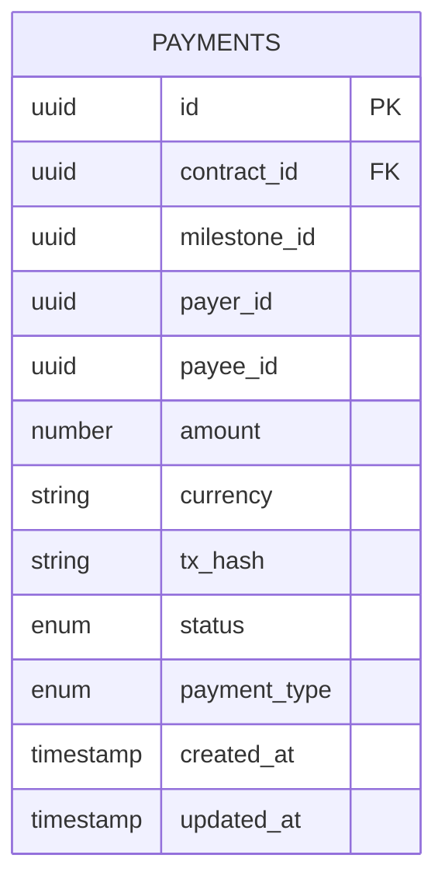

# Payment Service

<cite>
**Referenced Files in This Document**
- [payment-service.ts](file://src/services/payment-service.ts)
- [transaction-service.ts](file://src/services/transaction-service.ts)
- [escrow-contract.ts](file://src/services/escrow-contract.ts)
- [milestone-registry.ts](file://src/services/milestone-registry.ts)
- [agreement-contract.ts](file://src/services/agreement-contract.ts)
- [blockchain-client.ts](file://src/services/blockchain-client.ts)
- [blockchain-types.ts](file://src/services/blockchain-types.ts)
- [payment-repository.ts](file://src/repositories/payment-repository.ts)
- [notification-service.ts](file://src/services/notification-service.ts)
- [payment-routes.ts](file://src/routes/payment-routes.ts)
- [entity-mapper.ts](file://src/utils/entity-mapper.ts)
</cite>

## Table of Contents
1. [Introduction](#introduction)
2. [Project Structure](#project-structure)
3. [Core Components](#core-components)
4. [Architecture Overview](#architecture-overview)
5. [Detailed Component Analysis](#detailed-component-analysis)
6. [Dependency Analysis](#dependency-analysis)
7. [Performance Considerations](#performance-considerations)
8. [Troubleshooting Guide](#troubleshooting-guide)
9. [Conclusion](#conclusion)
10. [Appendices](#appendices)

## Introduction
This document explains the Payment Service implementation for secure payment processing in the platform. It covers fund deposits, milestone releases, refunds, and transaction history management. It documents key methods such as requestMilestoneCompletion, approveMilestone, disputeMilestone, getContractPaymentStatus, and illustrates how the service integrates with blockchain clients, transaction-service, and contract-service. It also addresses audit trail maintenance, financial data consistency across Supabase and blockchain ledgers, and operational concerns such as transaction reorganizations, gas estimation failures, and reconciliation between off-chain records and on-chain events.

## Project Structure
The Payment Service is implemented as a cohesive module with clear boundaries:
- Payment orchestration and business logic live in the Payment Service.
- Off-chain financial records are persisted via Transaction Service and Payment Repository.
- On-chain operations are handled by Escrow Contract, Milestone Registry, and Agreement Contract services, coordinated through the Blockchain Client.
- Notifications integrate with the Notification Service to inform stakeholders.

**Diagram sources**
- [payment-routes.ts](file://src/routes/payment-routes.ts#L1-L426)
- [payment-service.ts](file://src/services/payment-service.ts#L1-L643)
- [transaction-service.ts](file://src/services/transaction-service.ts#L1-L125)
- [payment-repository.ts](file://src/repositories/payment-repository.ts#L1-L95)
- [escrow-contract.ts](file://src/services/escrow-contract.ts#L1-L327)
- [milestone-registry.ts](file://src/services/milestone-registry.ts#L1-L276)
- [agreement-contract.ts](file://src/services/agreement-contract.ts#L1-L343)
- [blockchain-client.ts](file://src/services/blockchain-client.ts#L1-L293)
- [blockchain-types.ts](file://src/services/blockchain-types.ts#L1-L115)
- [notification-service.ts](file://src/services/notification-service.ts#L1-L316)
- [entity-mapper.ts](file://src/utils/entity-mapper.ts#L198-L310)

**Section sources**
- [payment-service.ts](file://src/services/payment-service.ts#L1-L643)
- [payment-routes.ts](file://src/routes/payment-routes.ts#L1-L426)

## Core Components
- Payment Service orchestrates milestone lifecycle, escrow initialization, and contract completion. It validates identities, updates project and contract states, and triggers on-chain operations.
- Transaction Service persists off-chain payment records and provides queries for transaction history and summaries.
- Escrow Contract manages deployment, funding, milestone release, and refund operations on-chain.
- Milestone Registry records milestone submissions and approvals on-chain for verifiable work history.
- Agreement Contract stores immutable agreement records and signatures on-chain.
- Blockchain Client simulates transaction submission, confirmation, and polling; serializes/deserializes transactions for persistence.
- Notification Service emits notifications to stakeholders upon milestone submission, approval, payment release, and dispute creation.
- Payment Repository persists payment entities in Supabase and exposes queries for transaction history and summaries.

**Section sources**
- [payment-service.ts](file://src/services/payment-service.ts#L1-L643)
- [transaction-service.ts](file://src/services/transaction-service.ts#L1-L125)
- [escrow-contract.ts](file://src/services/escrow-contract.ts#L1-L327)
- [milestone-registry.ts](file://src/services/milestone-registry.ts#L1-L276)
- [agreement-contract.ts](file://src/services/agreement-contract.ts#L1-L343)
- [blockchain-client.ts](file://src/services/blockchain-client.ts#L1-L293)
- [blockchain-types.ts](file://src/services/blockchain-types.ts#L1-L115)
- [notification-service.ts](file://src/services/notification-service.ts#L1-L316)
- [payment-repository.ts](file://src/repositories/payment-repository.ts#L1-L95)

## Architecture Overview
The Payment Service coordinates off-chain and on-chain operations:
- Off-chain: Payment Service updates project/contract state, persists records via Transaction Service/Payment Repository, and sends notifications.
- On-chain: Payment Service invokes Escrow Contract for milestone release/refund and Agreement Contract for contract completion; Milestone Registry records submissions/approvals.

**Diagram sources**
- [payment-routes.ts](file://src/routes/payment-routes.ts#L180-L261)
- [payment-service.ts](file://src/services/payment-service.ts#L201-L351)
- [escrow-contract.ts](file://src/services/escrow-contract.ts#L138-L199)
- [milestone-registry.ts](file://src/services/milestone-registry.ts#L138-L186)
- [transaction-service.ts](file://src/services/transaction-service.ts#L78-L89)
- [blockchain-client.ts](file://src/services/blockchain-client.ts#L131-L206)

## Detailed Component Analysis

### Payment Service Methods and Validation
- requestMilestoneCompletion
  - Validates contract ownership by freelancer, project existence, and milestone presence.
  - Transitions milestone status to submitted and persists on-chain submission via Milestone Registry.
  - Sends notification to employer.
  - Returns a structured result indicating milestoneId, status, and whether notification was sent.
  - Parameters: contractId, milestoneId, freelancerId.
  - Validation rules: Not found for contract/project/milestone; unauthorized for non-freelancer; invalid status transitions.
  - Integration: Escrow Contract for initialization; Milestone Registry for submission; Notification Service for employer.

- approveMilestone
  - Validates employer ownership and milestone eligibility.
  - Releases funds via Escrow Contract; captures transaction hash.
  - Updates milestone to approved; if all milestones approved, completes contract and Agreement Contract.
  - Persists milestone release record via Transaction Service.
  - Notifies freelancer and employer; returns transaction hash and completion flag.
  - Parameters: contractId, milestoneId, employerId.
  - Validation rules: Not found; unauthorized; invalid status transitions; insufficient funds simulation.

- disputeMilestone
  - Validates initiator is a contract party.
  - Creates in-memory dispute record and transitions milestone to disputed.
  - Updates contract status to disputed and notifies both parties.
  - Parameters: contractId, milestoneId, initiatorId, reason.
  - Validation rules: Not found; unauthorized; invalid status transitions.

- getContractPaymentStatus
  - Verifies user is a contract party.
  - Computes totals from project milestones and returns detailed status including escrow address, amounts, and milestone statuses.
  - Parameters: contractId, userId.

- initializeContractEscrow
  - Prepares milestone data for escrow, deploys escrow contract, deposits funds, and updates contract with escrow address.
  - Parameters: Contract, Project, employerWalletAddress, freelancerWalletAddress.
  - Returns deployment result or error.

- Additional helpers
  - isContractComplete: checks if all milestones are approved.
  - getDisputeById/getDisputesByContract/clearDisputes: dispute management utilities.

**Section sources**
- [payment-service.ts](file://src/services/payment-service.ts#L86-L193)
- [payment-service.ts](file://src/services/payment-service.ts#L201-L351)
- [payment-service.ts](file://src/services/payment-service.ts#L355-L480)
- [payment-service.ts](file://src/services/payment-service.ts#L483-L543)
- [payment-service.ts](file://src/services/payment-service.ts#L590-L642)

### Escrow Contract Operations
- deployEscrow
  - Generates an escrow address, submits deployment transaction, confirms, and stores state.
  - Returns deployment metadata including transaction hash and block number.

- depositToEscrow
  - Validates employer address and submits deposit transaction; updates balance on confirmation.

- releaseMilestone
  - Validates approver address, milestone eligibility, and sufficient balance; submits release transaction; updates state.

- refundMilestone
  - Validates resolver address and milestone eligibility; submits refund transaction; updates state.

- Utility getters and helpers for milestone status and balances.

**Section sources**
- [escrow-contract.ts](file://src/services/escrow-contract.ts#L38-L83)
- [escrow-contract.ts](file://src/services/escrow-contract.ts#L90-L132)
- [escrow-contract.ts](file://src/services/escrow-contract.ts#L138-L199)
- [escrow-contract.ts](file://src/services/escrow-contract.ts#L202-L264)
- [escrow-contract.ts](file://src/services/escrow-contract.ts#L266-L327)

### Milestone Registry
- submitMilestoneToRegistry
  - Hashes milestone and deliverables, submits on-chain transaction, and stores record with status “submitted”.

- approveMilestoneOnRegistry
  - Approves milestone on-chain, updates status and timestamps, and maintains freelancer stats.

- Additional utilities for querying records and verifying work hashes.

**Section sources**
- [milestone-registry.ts](file://src/services/milestone-registry.ts#L63-L135)
- [milestone-registry.ts](file://src/services/milestone-registry.ts#L138-L186)
- [milestone-registry.ts](file://src/services/milestone-registry.ts#L189-L228)
- [milestone-registry.ts](file://src/services/milestone-registry.ts#L231-L276)

### Agreement Contract
- createAgreementOnBlockchain
  - Stores agreement terms and signatures on-chain; tracks user agreements.

- signAgreement
  - Allows parties to sign; marks agreement fully signed when both parties have signed.

- completeAgreement
  - Completes agreement on-chain when conditions are met.

- Additional verification and query utilities.

**Section sources**
- [agreement-contract.ts](file://src/services/agreement-contract.ts#L80-L147)
- [agreement-contract.ts](file://src/services/agreement-contract.ts#L150-L202)
- [agreement-contract.ts](file://src/services/agreement-contract.ts#L205-L243)
- [agreement-contract.ts](file://src/services/agreement-contract.ts#L245-L343)

### Transaction Service and Payment Repository
- Transaction Service
  - Provides recordPayment, updatePaymentStatus, and convenience recorders for escrow deposit, milestone release, refund, and dispute resolution.
  - Exposes queries for payments by contract/user, by transaction hash, and payment summaries.

- Payment Repository
  - Defines PaymentEntity schema and exposes CRUD and query methods for payments in Supabase.

**Section sources**
- [transaction-service.ts](file://src/services/transaction-service.ts#L1-L125)
- [payment-repository.ts](file://src/repositories/payment-repository.ts#L1-L95)

### Blockchain Client and Types
- Blockchain Client
  - Simulates transaction submission, confirmation, and polling; serializes/deserializes transactions for persistence.
  - Provides helper utilities for generating mock addresses and signing.

- Blockchain Types
  - Defines transaction types, receipts, escrow parameters, and serialized forms.

**Section sources**
- [blockchain-client.ts](file://src/services/blockchain-client.ts#L1-L293)
- [blockchain-types.ts](file://src/services/blockchain-types.ts#L1-L115)

### Notifications
- Notification Service
  - Emits notifications for milestone submission, approval, payment release, and dispute creation.
  - Integrates with Payment Service to send stakeholder alerts.

**Section sources**
- [notification-service.ts](file://src/services/notification-service.ts#L212-L281)

### API Endpoints
- Payment Routes
  - Expose endpoints for milestone completion, approval, dispute creation, and contract payment status retrieval.
  - Apply authentication and UUID validation middleware.

**Section sources**
- [payment-routes.ts](file://src/routes/payment-routes.ts#L136-L261)
- [payment-routes.ts](file://src/routes/payment-routes.ts#L264-L359)
- [payment-routes.ts](file://src/routes/payment-routes.ts#L362-L423)

## Dependency Analysis
The Payment Service depends on:
- Repositories and Transaction Service for off-chain persistence.
- Escrow Contract, Milestone Registry, and Agreement Contract for on-chain operations.
- Blockchain Client for transaction submission and confirmation.
- Notification Service for stakeholder communication.
- Entity Mapper utilities for consistent data models.

**Diagram sources**
- [payment-service.ts](file://src/services/payment-service.ts#L1-L643)
- [escrow-contract.ts](file://src/services/escrow-contract.ts#L1-L327)
- [milestone-registry.ts](file://src/services/milestone-registry.ts#L1-L276)
- [agreement-contract.ts](file://src/services/agreement-contract.ts#L1-L343)
- [transaction-service.ts](file://src/services/transaction-service.ts#L1-L125)
- [payment-repository.ts](file://src/repositories/payment-repository.ts#L1-L95)
- [blockchain-client.ts](file://src/services/blockchain-client.ts#L1-L293)
- [blockchain-types.ts](file://src/services/blockchain-types.ts#L1-L115)
- [notification-service.ts](file://src/services/notification-service.ts#L1-L316)
- [entity-mapper.ts](file://src/utils/entity-mapper.ts#L198-L310)

**Section sources**
- [payment-service.ts](file://src/services/payment-service.ts#L1-L643)
- [escrow-contract.ts](file://src/services/escrow-contract.ts#L1-L327)
- [milestone-registry.ts](file://src/services/milestone-registry.ts#L1-L276)
- [agreement-contract.ts](file://src/services/agreement-contract.ts#L1-L343)
- [transaction-service.ts](file://src/services/transaction-service.ts#L1-L125)
- [payment-repository.ts](file://src/repositories/payment-repository.ts#L1-L95)
- [blockchain-client.ts](file://src/services/blockchain-client.ts#L1-L293)
- [blockchain-types.ts](file://src/services/blockchain-types.ts#L1-L115)
- [notification-service.ts](file://src/services/notification-service.ts#L1-L316)
- [entity-mapper.ts](file://src/utils/entity-mapper.ts#L198-L310)

## Performance Considerations
- Transaction polling and confirmation are simulated and synchronous in the current implementation. In production, asynchronous polling with exponential backoff and circuit breaker patterns should be used to handle network latency and RPC failures.
- Batch operations for milestone approvals can reduce on-chain transaction overhead; however, the current design submits individual transactions per milestone release.
- Caching frequently accessed contract and project data can reduce repository round-trips.
- Pagination and filtering in Transaction Service queries prevent heavy loads on the database.

[No sources needed since this section provides general guidance]

## Troubleshooting Guide
Common issues and resolutions:
- Transaction reorganizations
  - Symptom: Confirmed transactions revert after reorg.
  - Resolution: Implement transaction receipt verification and re-submission logic; monitor block confirmations and maintain idempotent record updates.
  - Reference: Blockchain Client polling and confirmation utilities.

- Gas estimation failures
  - Symptom: Transactions fail due to insufficient gas or estimation errors.
  - Resolution: Increase gas limits conservatively; implement retry with higher gas price; log detailed receipts for diagnostics.
  - Reference: Transaction submission and receipt handling.

- Reconciliation between off-chain records and on-chain events
  - Symptom: Payment status mismatch between Supabase and blockchain.
  - Resolution: Use Transaction Service to record txHash on successful on-chain operations; query by txHash to reconcile; update status atomically.
  - Reference: Transaction Service recorders and Payment Repository updateStatus.

- Escrow balance discrepancies
  - Symptom: Insufficient balance errors during milestone release.
  - Resolution: Validate total budget vs. released amounts; ensure depositToEscrow is executed before releases; check milestone eligibility.
  - Reference: Escrow Contract releaseMilestone and getEscrowBalance.

- Dispute handling
  - Symptom: Disputes not transitioning correctly.
  - Resolution: Ensure dispute creation updates milestone and contract statuses; verify disputeStore cleanup in testing scenarios.
  - Reference: Payment Service disputeMilestone and in-memory dispute store.

**Section sources**
- [blockchain-client.ts](file://src/services/blockchain-client.ts#L181-L239)
- [escrow-contract.ts](file://src/services/escrow-contract.ts#L138-L199)
- [transaction-service.ts](file://src/services/transaction-service.ts#L38-L40)
- [payment-repository.ts](file://src/repositories/payment-repository.ts#L63-L67)
- [payment-service.ts](file://src/services/payment-service.ts#L355-L480)

## Conclusion
The Payment Service provides a robust, layered approach to secure payment processing:
- Off-chain state management ensures user-friendly workflows and audit-ready records.
- On-chain operations enforce trustless guarantees for escrow, milestone approvals, and agreement completion.
- Transaction Service and Payment Repository maintain financial consistency across Supabase.
- Notifications keep stakeholders informed throughout the lifecycle.
- The design accommodates future enhancements such as production blockchain integration, improved gas handling, and reconciliation automation.

[No sources needed since this section summarizes without analyzing specific files]

## Appendices

### API Definitions and Examples
- requestMilestoneCompletion
  - Endpoint: POST /api/payments/milestones/:milestoneId/complete?contractId={uuid}
  - Authentication: Required
  - Validation: UUID format for milestoneId and contractId; user must be freelancer.
  - Example response: { milestoneId, status: "submitted", notificationSent: true }.

- approveMilestone
  - Endpoint: POST /api/payments/milestones/:milestoneId/approve?contractId={uuid}
  - Authentication: Required
  - Validation: UUID format; user must be employer; milestone eligible.
  - Example response: { milestoneId, status: "approved", paymentReleased: true, transactionHash, contractCompleted }.

- disputeMilestone
  - Endpoint: POST /api/payments/milestones/:milestoneId/dispute?contractId={uuid}
  - Authentication: Required
  - Validation: UUID format; user must be a contract party; reason required.
  - Example response: { milestoneId, status: "disputed", disputeId, disputeCreated: true }.

- getContractPaymentStatus
  - Endpoint: GET /api/payments/contracts/:contractId/status
  - Authentication: Required
  - Validation: UUID format; user must be a contract party.
  - Example response: { contractId, escrowAddress, totalAmount, releasedAmount, pendingAmount, milestones, contractStatus }.

**Section sources**
- [payment-routes.ts](file://src/routes/payment-routes.ts#L136-L261)
- [payment-routes.ts](file://src/routes/payment-routes.ts#L264-L359)
- [payment-routes.ts](file://src/routes/payment-routes.ts#L362-L423)

### Data Model: Payment Entity

**Diagram sources**
- [payment-repository.ts](file://src/repositories/payment-repository.ts#L1-L95)