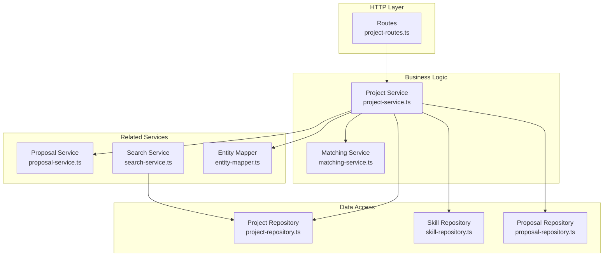
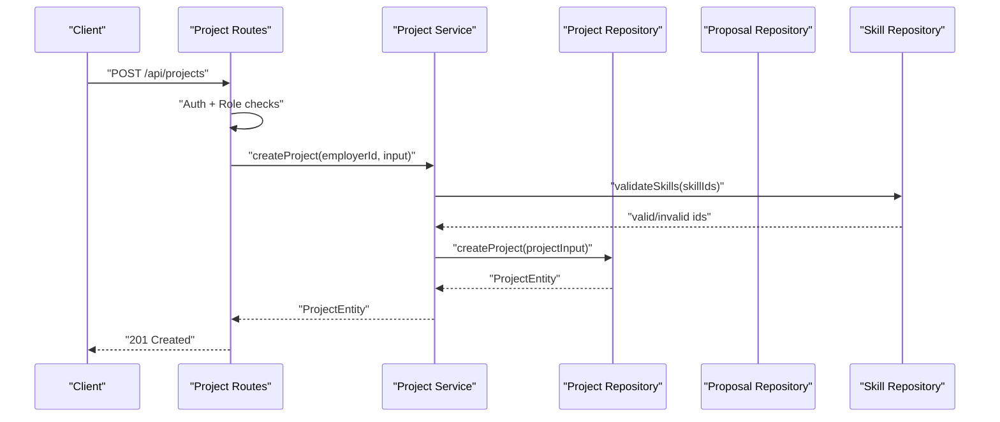
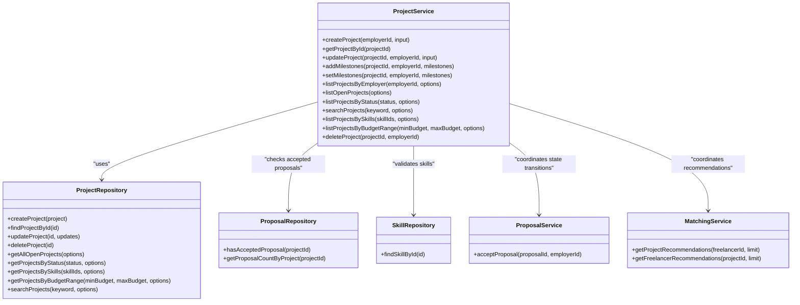

# Project Service

<cite>
**Referenced Files in This Document**
- [project-service.ts](file://src/services/project-service.ts)
- [project-routes.ts](file://src/routes/project-routes.ts)
- [project-repository.ts](file://src/repositories/project-repository.ts)
- [proposal-repository.ts](file://src/repositories/proposal-repository.ts)
- [skill-repository.ts](file://src/repositories/skill-repository.ts)
- [proposal-service.ts](file://src/services/proposal-service.ts)
- [matching-service.ts](file://src/services/matching-service.ts)
- [entity-mapper.ts](file://src/utils/entity-mapper.ts)
- [search-service.ts](file://src/services/search-service.ts)
- [README.md](file://README.md)
- [API-DOCUMENTATION.md](file://docs/API-DOCUMENTATION.md)
</cite>

## Table of Contents
1. [Introduction](#introduction)
2. [Project Structure](#project-structure)
3. [Core Components](#core-components)
4. [Architecture Overview](#architecture-overview)
5. [Detailed Component Analysis](#detailed-component-analysis)
6. [Dependency Analysis](#dependency-analysis)
7. [Performance Considerations](#performance-considerations)
8. [Troubleshooting Guide](#troubleshooting-guide)
9. [Conclusion](#conclusion)

## Introduction
This document explains the Project Service implementation for managing freelance projects across the lifecycle: creation, retrieval, updates, milestone management, listing, searching, and deletion. It focuses on the service’s core methods, validation and business rules, integration with repositories and other services, and operational concerns such as permission checks, state locks, and performance.

## Project Structure
The Project Service sits in the business logic layer and orchestrates interactions with:
- Routes: HTTP entry points for project operations
- Repositories: Data access layer for persistence
- Proposal repository: Enforces project locks when proposals are accepted
- Skill repository: Validates required skills during creation/update
- Proposal service: Coordinates proposal acceptance that affects project state
- Matching service: Provides AI-powered recommendations for projects and freelancers
- Entity mapper: Converts between database entities and API models

**Diagram sources**
- [project-routes.ts](file://src/routes/project-routes.ts#L1-L684)
- [project-service.ts](file://src/services/project-service.ts#L1-L388)
- [project-repository.ts](file://src/repositories/project-repository.ts#L1-L191)
- [skill-repository.ts](file://src/repositories/skill-repository.ts#L1-L127)
- [proposal-repository.ts](file://src/repositories/proposal-repository.ts#L1-L113)
- [proposal-service.ts](file://src/services/proposal-service.ts#L1-L414)
- [matching-service.ts](file://src/services/matching-service.ts#L1-L391)
- [entity-mapper.ts](file://src/utils/entity-mapper.ts#L198-L250)
- [search-service.ts](file://src/services/search-service.ts#L1-L206)

**Section sources**
- [project-service.ts](file://src/services/project-service.ts#L1-L388)
- [project-routes.ts](file://src/routes/project-routes.ts#L1-L684)
- [project-repository.ts](file://src/repositories/project-repository.ts#L1-L191)
- [skill-repository.ts](file://src/repositories/skill-repository.ts#L1-L127)
- [proposal-repository.ts](file://src/repositories/proposal-repository.ts#L1-L113)
- [proposal-service.ts](file://src/services/proposal-service.ts#L1-L414)
- [matching-service.ts](file://src/services/matching-service.ts#L1-L391)
- [entity-mapper.ts](file://src/utils/entity-mapper.ts#L198-L250)
- [search-service.ts](file://src/services/search-service.ts#L1-L206)

## Core Components
- Project Service: Implements lifecycle operations and validations
- Project Repository: Persists and queries projects with pagination and filtering
- Proposal Repository: Checks for accepted proposals to enforce project locks
- Skill Repository: Validates required skills during creation/update
- Proposal Service: Manages proposal lifecycle and transitions that affect project state
- Matching Service: Provides AI-powered recommendations for projects and freelancers
- Entity Mapper: Converts between internal entities and API models

Key responsibilities:
- Validate inputs and enforce business rules (e.g., required skills, milestone budget sums)
- Enforce project locks when proposals are accepted
- Coordinate with matching service for AI-powered recommendations
- Integrate with proposal service for bid management and state transitions

**Section sources**
- [project-service.ts](file://src/services/project-service.ts#L1-L388)
- [project-repository.ts](file://src/repositories/project-repository.ts#L1-L191)
- [proposal-repository.ts](file://src/repositories/proposal-repository.ts#L72-L93)
- [skill-repository.ts](file://src/repositories/skill-repository.ts#L32-L46)
- [proposal-service.ts](file://src/services/proposal-service.ts#L174-L296)
- [matching-service.ts](file://src/services/matching-service.ts#L77-L141)

## Architecture Overview
The Project Service follows a layered architecture:
- Routes define HTTP endpoints and basic request validation
- Project Service encapsulates business logic and enforces rules
- Repositories abstract data access and handle pagination
- Related services coordinate cross-cutting concerns (matching, proposals)

**Diagram sources**
- [project-routes.ts](file://src/routes/project-routes.ts#L271-L332)
- [project-service.ts](file://src/services/project-service.ts#L85-L119)
- [project-repository.ts](file://src/repositories/project-repository.ts#L35-L49)
- [skill-repository.ts](file://src/repositories/skill-repository.ts#L32-L46)

## Detailed Component Analysis

### Project Lifecycle Methods

#### createProject
Purpose:
- Validates required skills
- Builds skill references
- Creates a new project with initial status and empty milestones

Parameters:
- employerId: string
- input: CreateProjectInput with title, description, requiredSkills, budget, deadline

Return type:
- ProjectServiceResult<ProjectEntity>

Validation and business rules:
- requiredSkills validated against active skills
- Skill references built with id, name, category, years_of_experience (set to 0)
- Initial status set to open

Error handling:
- INVALID_SKILL with details of invalid skill IDs
- Delegates persistence errors from repository

**Section sources**
- [project-service.ts](file://src/services/project-service.ts#L85-L119)
- [skill-repository.ts](file://src/repositories/skill-repository.ts#L32-L46)

#### getProjectById
Purpose:
- Retrieve a project by ID

Parameters:
- projectId: string

Return type:
- ProjectServiceResult<ProjectEntity>

Behavior:
- Returns NOT_FOUND if project does not exist

**Section sources**
- [project-service.ts](file://src/services/project-service.ts#L121-L129)
- [project-repository.ts](file://src/repositories/project-repository.ts#L40-L41)

#### updateProject
Purpose:
- Update project metadata and required skills

Parameters:
- projectId: string
- employerId: string
- input: UpdateProjectInput with optional title, description, requiredSkills, budget, deadline, status

Validation and business rules:
- Ownership check: employerId must match project’s employer_id
- Locked if project has accepted proposals
- requiredSkills validated and skill references rebuilt if provided
- Budget validation: if milestones exist, milestone amounts must sum to new budget

Error handling:
- NOT_FOUND for missing project or unauthorized access
- PROJECT_LOCKED if accepted proposals exist
- MILESTONE_SUM_MISMATCH if budget does not match milestone sum
- UPDATE_FAILED if persistence fails

**Section sources**
- [project-service.ts](file://src/services/project-service.ts#L132-L199)
- [proposal-repository.ts](file://src/repositories/proposal-repository.ts#L72-L82)
- [project-service.ts](file://src/services/project-service.ts#L47-L56)

#### addMilestones
Purpose:
- Append milestones to an existing project

Parameters:
- projectId: string
- employerId: string
- milestones: AddMilestoneInput[] with title, description, amount, dueDate

Validation and business rules:
- Ownership check
- Locked if project has accepted proposals
- Budget validation: sum of new milestones plus existing must equal project budget

Error handling:
- Same as updateProject for ownership and lock
- MILESTONE_SUM_MISMATCH if budget mismatch

**Section sources**
- [project-service.ts](file://src/services/project-service.ts#L202-L251)
- [project-service.ts](file://src/services/project-service.ts#L47-L56)

#### setMilestones
Purpose:
- Replace all milestones for a project

Parameters:
- projectId: string
- employerId: string
- milestones: AddMilestoneInput[]

Validation and business rules:
- Ownership check
- Locked if project has accepted proposals
- Budget validation: sum of new milestones equals project budget

Error handling:
- Same as updateProject for ownership and lock
- MILESTONE_SUM_MISMATCH if budget mismatch

**Section sources**
- [project-service.ts](file://src/services/project-service.ts#L253-L299)
- [project-service.ts](file://src/services/project-service.ts#L47-L56)

#### listProjectsByEmployer
Purpose:
- List projects owned by an employer with proposal counts

Parameters:
- employerId: string
- options?: QueryOptions

Behavior:
- Fetches paginated projects
- Computes proposal count per project via proposal repository

**Section sources**
- [project-service.ts](file://src/services/project-service.ts#L302-L323)
- [proposal-repository.ts](file://src/repositories/proposal-repository.ts#L84-L93)

#### listOpenProjects
Purpose:
- List open projects with pagination

**Section sources**
- [project-service.ts](file://src/services/project-service.ts#L325-L339)
- [project-repository.ts](file://src/repositories/project-repository.ts#L76-L95)

#### listProjectsByStatus
Purpose:
- List projects filtered by status with pagination

**Section sources**
- [project-service.ts](file://src/services/project-service.ts#L332-L338)
- [project-repository.ts](file://src/repositories/project-repository.ts#L97-L116)

#### searchProjects
Purpose:
- Search open projects by keyword with pagination

**Section sources**
- [project-service.ts](file://src/services/project-service.ts#L340-L346)
- [project-repository.ts](file://src/repositories/project-repository.ts#L167-L188)

#### listProjectsBySkills
Purpose:
- List open projects by required skills with pagination

Notes:
- Repository performs in-memory filtering for skill matching

**Section sources**
- [project-service.ts](file://src/services/project-service.ts#L348-L354)
- [project-repository.ts](file://src/repositories/project-repository.ts#L118-L142)

#### listProjectsByBudgetRange
Purpose:
- List open projects within a budget range with pagination

**Section sources**
- [project-service.ts](file://src/services/project-service.ts#L356-L363)
- [project-repository.ts](file://src/repositories/project-repository.ts#L144-L165)

#### deleteProject
Purpose:
- Delete a project owned by the employer

Validation and business rules:
- Ownership check
- Locked if project has accepted proposals

Error handling:
- NOT_FOUND for missing project or unauthorized access
- PROJECT_LOCKED if accepted proposals exist

**Section sources**
- [project-service.ts](file://src/services/project-service.ts#L365-L388)
- [proposal-repository.ts](file://src/repositories/proposal-repository.ts#L72-L82)

### Validation and Business Rules

- Required skills validation:
  - Skill IDs validated against active skills
  - Invalid IDs reported with INVALID_SKILL error

- Milestone budget enforcement:
  - Sum of milestone amounts must equal project budget
  - Enforced during addMilestones, setMilestones, and updateProject when milestones exist

- Project lock:
  - Operations disallowed if project has accepted proposals
  - Enforced via proposal repository check

- Permission checks:
  - Ownership verified for update, add/set milestones, delete
  - Routes enforce role-based access (employer)

**Section sources**
- [project-service.ts](file://src/services/project-service.ts#L58-L83)
- [project-service.ts](file://src/services/project-service.ts#L47-L56)
- [proposal-repository.ts](file://src/repositories/proposal-repository.ts#L72-L82)
- [project-routes.ts](file://src/routes/project-routes.ts#L395-L447)

### Relationship with Matching Service
The Project Service coordinates with the Matching Service to provide AI-powered recommendations:
- getProjectRecommendations: Retrieves open projects and ranks them for a freelancer based on skill match
- getFreelancerRecommendations: Retrieves available freelancers and ranks them for a project based on skill match and reputation weighting

These recommendations influence project visibility and proposal flow.

**Section sources**
- [matching-service.ts](file://src/services/matching-service.ts#L77-L141)
- [matching-service.ts](file://src/services/matching-service.ts#L147-L218)

### Relationship with Proposal Service
Proposal actions impact project state:
- acceptProposal transitions project status to in_progress
- rejectProposal and withdrawProposal do not change project status directly
- Project Service enforces locks when proposals are accepted to prevent modifications

**Section sources**
- [proposal-service.ts](file://src/services/proposal-service.ts#L174-L296)
- [project-service.ts](file://src/services/project-service.ts#L132-L199)

### Data Model and Mapping
Project model fields include:
- id, employer_id, title, description, required_skills, budget, deadline, status, milestones, timestamps

Entity mapper converts between database entities and API models for consistent serialization.

**Section sources**
- [project-repository.ts](file://src/repositories/project-repository.ts#L16-L28)
- [entity-mapper.ts](file://src/utils/entity-mapper.ts#L198-L250)

### API Endpoints and Routing
Routes define:
- GET /api/projects (list with filters)
- GET /api/projects/:id (retrieve)
- POST /api/projects (create)
- PATCH /api/projects/:id (update)
- POST /api/projects/:id/milestones (add milestones)
- GET /api/projects/:id/proposals (list proposals)

Each endpoint integrates with the Project Service and applies role-based access and validation.

**Section sources**
- [project-routes.ts](file://src/routes/project-routes.ts#L132-L168)
- [project-routes.ts](file://src/routes/project-routes.ts#L199-L215)
- [project-routes.ts](file://src/routes/project-routes.ts#L271-L332)
- [project-routes.ts](file://src/routes/project-routes.ts#L395-L447)
- [project-routes.ts](file://src/routes/project-routes.ts#L512-L573)
- [project-routes.ts](file://src/routes/project-routes.ts#L628-L681)

## Dependency Analysis

**Diagram sources**
- [project-service.ts](file://src/services/project-service.ts#L1-L388)
- [project-repository.ts](file://src/repositories/project-repository.ts#L1-L191)
- [proposal-repository.ts](file://src/repositories/proposal-repository.ts#L1-L113)
- [skill-repository.ts](file://src/repositories/skill-repository.ts#L1-L127)
- [proposal-service.ts](file://src/services/proposal-service.ts#L174-L296)
- [matching-service.ts](file://src/services/matching-service.ts#L77-L141)

**Section sources**
- [project-service.ts](file://src/services/project-service.ts#L1-L388)
- [project-repository.ts](file://src/repositories/project-repository.ts#L1-L191)
- [proposal-repository.ts](file://src/repositories/proposal-repository.ts#L1-L113)
- [skill-repository.ts](file://src/repositories/skill-repository.ts#L1-L127)
- [proposal-service.ts](file://src/services/proposal-service.ts#L174-L296)
- [matching-service.ts](file://src/services/matching-service.ts#L77-L141)

## Performance Considerations
- Pagination defaults:
  - Repository methods default to a limit of 100 items per page
  - Route handlers default to 20 items per page for general listing

- Filtering strategies:
  - Repository methods optimize single-filter queries (keyword, skills, budget)
  - Multiple filters fall back to retrieving open projects and filtering in memory

- Recommendations:
  - Prefer repository-specific filters to leverage database-level optimizations
  - Use smaller page sizes for frequent listing endpoints
  - Indexes to consider (conceptual):
    - status for open projects
    - required_skills arrays for skill matching
    - budget range queries
    - title/description ILIKE for keyword searches

[No sources needed since this section provides general guidance]

## Troubleshooting Guide
Common issues and resolutions:
- Invalid skill IDs:
  - Symptom: INVALID_SKILL error with details
  - Cause: Non-existent or inactive skill IDs
  - Resolution: Ensure skills are active and valid

- Milestone budget mismatch:
  - Symptom: MILESTONE_SUM_MISMATCH error
  - Cause: Sum of milestone amounts differs from project budget
  - Resolution: Adjust milestone amounts or project budget

- Project locked:
  - Symptom: PROJECT_LOCKED error
  - Cause: Project has accepted proposals
  - Resolution: Remove accepted proposals or cancel the project

- Not found or unauthorized:
  - Symptom: NOT_FOUND or UNAUTHORIZED errors
  - Cause: Missing project or wrong owner
  - Resolution: Verify project ownership and existence

- Update failures:
  - Symptom: UPDATE_FAILED error
  - Cause: Persistence failure
  - Resolution: Retry operation or inspect repository logs

**Section sources**
- [project-service.ts](file://src/services/project-service.ts#L85-L119)
- [project-service.ts](file://src/services/project-service.ts#L132-L199)
- [project-service.ts](file://src/services/project-service.ts#L202-L251)
- [project-service.ts](file://src/services/project-service.ts#L253-L299)
- [project-service.ts](file://src/services/project-service.ts#L365-L388)
- [proposal-repository.ts](file://src/repositories/proposal-repository.ts#L72-L82)

## Conclusion
The Project Service provides robust lifecycle management for freelance projects with strong validation, permission enforcement, and integration points to the matching and proposal services. By leveraging repository optimizations and enforcing business rules, it ensures data consistency and prevents invalid state transitions. For large-scale operations, adopt targeted filtering, smaller page sizes, and consider database indexing strategies to improve search performance.