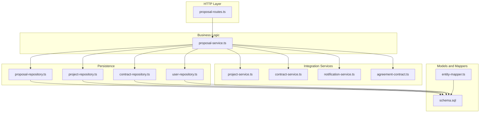
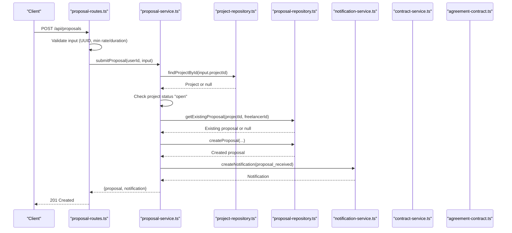
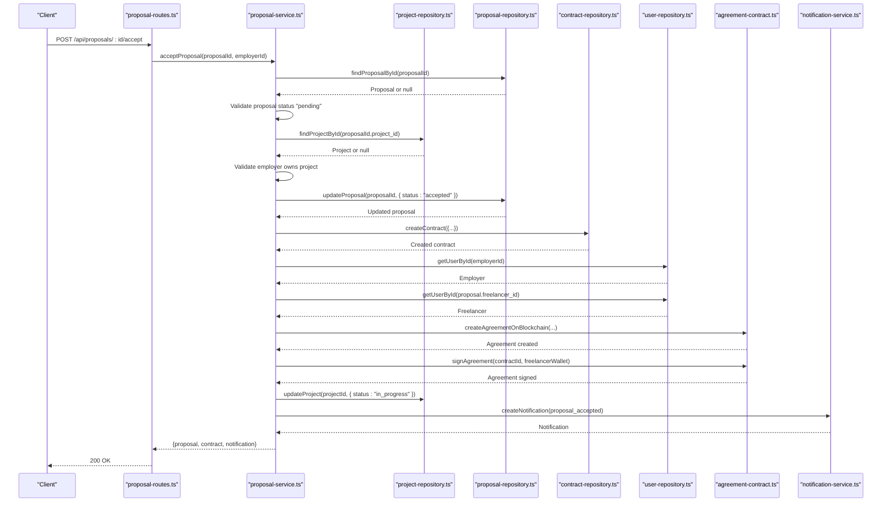
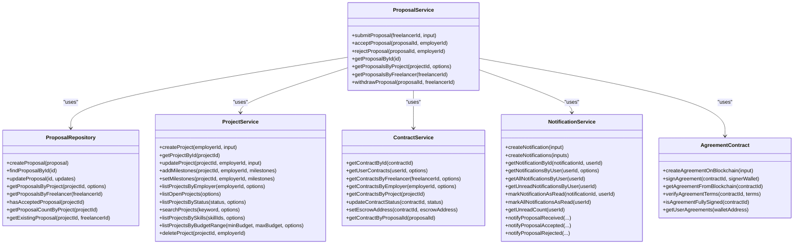

# Proposal Service

<cite>
**Referenced Files in This Document**
- [proposal-service.ts](file://src/services/proposal-service.ts)
- [proposal-routes.ts](file://src/routes/proposal-routes.ts)
- [proposal-repository.ts](file://src/repositories/proposal-repository.ts)
- [project-service.ts](file://src/services/project-service.ts)
- [contract-service.ts](file://src/services/contract-service.ts)
- [notification-service.ts](file://src/services/notification-service.ts)
- [agreement-contract.ts](file://src/services/agreement-contract.ts)
- [entity-mapper.ts](file://src/utils/entity-mapper.ts)
- [schema.sql](file://supabase/schema.sql)
</cite>

## Table of Contents
1. [Introduction](#introduction)
2. [Project Structure](#project-structure)
3. [Core Components](#core-components)
4. [Architecture Overview](#architecture-overview)
5. [Detailed Component Analysis](#detailed-component-analysis)
6. [Dependency Analysis](#dependency-analysis)
7. [Performance Considerations](#performance-considerations)
8. [Troubleshooting Guide](#troubleshooting-guide)
9. [Conclusion](#conclusion)
10. [Appendices](#appendices)

## Introduction
This document explains the Proposal Service that powers the bidding system for freelancers submitting proposals to employer projects. It covers the end-to-end flow for submitting proposals, listing proposals for a project, and the actions of accepting or rejecting proposals. It also documents how the service enforces business rules (e.g., proposal uniqueness, project eligibility, rate constraints), interacts with the project-service for project validation, contract-service for contract creation, and notification-service for status updates. Finally, it addresses common issues such as race conditions during proposal acceptance and data consistency, and provides guidance for extending the service to support counter-offers or negotiation workflows.

## Project Structure
The Proposal Service is implemented as a cohesive module with clear separation of concerns:
- Routes define the HTTP endpoints and basic input validation.
- The service orchestrates business logic, performs validations, and coordinates side effects (notifications, contracts, blockchain).
- Repositories encapsulate persistence operations.
- Services for contracts, notifications, and blockchain integrate with the proposal lifecycle.

**Diagram sources**
- [proposal-routes.ts](file://src/routes/proposal-routes.ts#L1-L458)
- [proposal-service.ts](file://src/services/proposal-service.ts#L1-L414)
- [proposal-repository.ts](file://src/repositories/proposal-repository.ts#L1-L113)
- [project-service.ts](file://src/services/project-service.ts#L1-L388)
- [contract-service.ts](file://src/services/contract-service.ts#L1-L140)
- [notification-service.ts](file://src/services/notification-service.ts#L1-L316)
- [agreement-contract.ts](file://src/services/agreement-contract.ts#L1-L343)
- [entity-mapper.ts](file://src/utils/entity-mapper.ts#L252-L310)
- [schema.sql](file://supabase/schema.sql#L80-L106)

**Section sources**
- [proposal-service.ts](file://src/services/proposal-service.ts#L1-L414)
- [proposal-routes.ts](file://src/routes/proposal-routes.ts#L1-L458)
- [proposal-repository.ts](file://src/repositories/proposal-repository.ts#L1-L113)
- [schema.sql](file://supabase/schema.sql#L80-L106)

## Core Components
- submitProposal: Validates project eligibility, checks for duplicate submissions, persists the proposal, and emits a notification to the employer.
- acceptProposal: Validates proposal status and ownership, transitions proposal to accepted, creates a contract, triggers blockchain agreement creation and signing, updates project status, and notifies the freelancer.
- rejectProposal: Validates proposal status and ownership, transitions proposal to rejected, and notifies the freelancer.
- listProposalsForProject: Delegates to project validation and repository pagination to return proposals for a given project.
- Additional helpers: getProposalById, getProposalsByFreelancer, withdrawProposal.

Key business rules enforced:
- Proposal uniqueness per project-freelancer pair.
- Project must be open for proposals.
- Only pending proposals can be accepted/rejected/withdrawn.
- Employers can only act on proposals belonging to their projects.
- Route-level validation ensures required fields and constraints (e.g., minimum rate and duration).

**Section sources**
- [proposal-service.ts](file://src/services/proposal-service.ts#L63-L126)
- [proposal-service.ts](file://src/services/proposal-service.ts#L174-L296)
- [proposal-service.ts](file://src/services/proposal-service.ts#L299-L370)
- [proposal-service.ts](file://src/services/proposal-service.ts#L141-L171)
- [proposal-service.ts](file://src/services/proposal-service.ts#L372-L414)
- [proposal-routes.ts](file://src/routes/proposal-routes.ts#L97-L153)
- [proposal-routes.ts](file://src/routes/proposal-routes.ts#L256-L326)
- [proposal-routes.ts](file://src/routes/proposal-routes.ts#L328-L390)
- [proposal-routes.ts](file://src/routes/proposal-routes.ts#L393-L455)

## Architecture Overview
The Proposal Service follows a layered architecture:
- Routes: Parse and validate requests, enforce roles, and delegate to the service.
- Service: Implements business logic, performs validations, and coordinates side effects.
- Repositories: Encapsulate database operations and enforce referential integrity.
- Integration Services: Contract, Notification, and Agreement services are invoked for side effects.
- Models and Mappers: Convert between database entities and API models.

**Diagram sources**
- [proposal-routes.ts](file://src/routes/proposal-routes.ts#L97-L153)
- [proposal-service.ts](file://src/services/proposal-service.ts#L63-L126)
- [proposal-repository.ts](file://src/repositories/proposal-repository.ts#L23-L33)
- [notification-service.ts](file://src/services/notification-service.ts#L24-L63)

## Detailed Component Analysis

### submitProposal
Purpose:
- Validate project existence and open status.
- Enforce proposal uniqueness per project-freelancer pair.
- Persist proposal with pending status.
- Emit a notification to the employer.

Parameters:
- freelancerId: string
- input: { projectId, coverLetter, proposedRate, estimatedDuration }

Validation logic:
- Project existence and open status.
- Duplicate proposal check using repository-level unique constraint.
- Route-level validation ensures UUID format, minimum rate, and minimum duration.

Side effects:
- Creates a proposal entity.
- Sends a notification to the employer with type "proposal_received".

Data consistency:
- Uses repository operations to ensure atomic persistence.
- Unique constraint in the database prevents duplicates.

Race conditions:
- The repository enforces a unique index on (project_id, freelancer_id), preventing concurrent duplicate submissions from persisting.

**Section sources**
- [proposal-service.ts](file://src/services/proposal-service.ts#L63-L126)
- [proposal-repository.ts](file://src/repositories/proposal-repository.ts#L95-L109)
- [proposal-routes.ts](file://src/routes/proposal-routes.ts#L111-L135)
- [schema.sql](file://supabase/schema.sql#L80-L92)

### acceptProposal
Purpose:
- Accept a pending proposal, create a contract, and trigger blockchain agreement creation and signing.

Parameters:
- proposalId: string
- employerId: string

Validation logic:
- Proposal exists and is pending.
- Employer owns the project associated with the proposal.
- Project status is validated indirectly via project retrieval.

Side effects:
- Updates proposal status to accepted.
- Creates a contract entity linked to the proposal and project.
- Calls blockchain agreement creation and signing (employer signs on creation; freelancer auto-signs after acceptance).
- Updates project status to in_progress.
- Emits a notification to the freelancer with type "proposal_accepted".

Data consistency:
- Contract creation and proposal update occur in sequence; project status update occurs after contract creation.
- Blockchain operations are best-effort and do not block the primary flow.

Race conditions:
- The service updates proposal status to accepted before creating the contract. To mitigate race conditions, consider wrapping the acceptance flow in a transaction or adding an optimistic concurrency check on the proposal status.

**Diagram sources**
- [proposal-routes.ts](file://src/routes/proposal-routes.ts#L293-L326)
- [proposal-service.ts](file://src/services/proposal-service.ts#L174-L296)
- [agreement-contract.ts](file://src/services/agreement-contract.ts#L80-L147)
- [agreement-contract.ts](file://src/services/agreement-contract.ts#L150-L202)

### rejectProposal
Purpose:
- Reject a pending proposal and notify the freelancer.

Parameters:
- proposalId: string
- employerId: string

Validation logic:
- Proposal exists and is pending.
- Employer owns the project associated with the proposal.

Side effects:
- Updates proposal status to rejected.
- Emits a notification to the freelancer with type "proposal_rejected".

**Section sources**
- [proposal-service.ts](file://src/services/proposal-service.ts#L299-L370)
- [proposal-routes.ts](file://src/routes/proposal-routes.ts#L328-L390)

### listProposalsForProject
Purpose:
- Retrieve paginated proposals for a given project, with project validation.

Parameters:
- projectId: string
- options?: QueryOptions

Validation logic:
- Project existence is verified before querying proposals.

Side effects:
- Returns a paginated list of proposals mapped to API models.

**Section sources**
- [proposal-service.ts](file://src/services/proposal-service.ts#L141-L171)
- [proposal-repository.ts](file://src/repositories/proposal-repository.ts#L39-L58)

### Additional Helpers
- getProposalById: Fetches a proposal by ID with NotFound handling.
- getProposalsByFreelancer: Lists all proposals submitted by a freelancer.
- withdrawProposal: Allows a freelancer to withdraw a pending proposal.

**Section sources**
- [proposal-service.ts](file://src/services/proposal-service.ts#L129-L171)
- [proposal-service.ts](file://src/services/proposal-service.ts#L372-L414)

## Dependency Analysis
The Proposal Service depends on:
- Repositories for persistence and data integrity.
- Project service for project-related counts and locks.
- Contract service for retrieving contracts by proposal.
- Notification service for emitting status updates.
- Agreement contract service for blockchain agreement creation and signing.

**Diagram sources**
- [proposal-service.ts](file://src/services/proposal-service.ts#L1-L414)
- [proposal-repository.ts](file://src/repositories/proposal-repository.ts#L1-L113)
- [project-service.ts](file://src/services/project-service.ts#L1-L388)
- [contract-service.ts](file://src/services/contract-service.ts#L1-L140)
- [notification-service.ts](file://src/services/notification-service.ts#L1-L316)
- [agreement-contract.ts](file://src/services/agreement-contract.ts#L1-L343)

**Section sources**
- [proposal-service.ts](file://src/services/proposal-service.ts#L1-L414)
- [proposal-repository.ts](file://src/repositories/proposal-repository.ts#L1-L113)
- [project-service.ts](file://src/services/project-service.ts#L1-L388)
- [contract-service.ts](file://src/services/contract-service.ts#L1-L140)
- [notification-service.ts](file://src/services/notification-service.ts#L1-L316)
- [agreement-contract.ts](file://src/services/agreement-contract.ts#L1-L343)

## Performance Considerations
- Pagination: The service returns paginated results for listing proposals, reducing payload sizes and improving response times.
- Indexes: Database indexes on proposals and projects improve query performance for lookups and filtering.
- Asynchronous side effects: Notifications and blockchain operations are best-effort and do not block the primary transaction path.

[No sources needed since this section provides general guidance]

## Troubleshooting Guide
Common issues and resolutions:
- Duplicate proposal submission:
  - Symptom: 409 Conflict when submitting a proposal.
  - Cause: Unique constraint on (project_id, freelancer_id).
  - Resolution: Ensure freelancers do not submit multiple proposals for the same project.
  - Section sources
    - [proposal-service.ts](file://src/services/proposal-service.ts#L86-L93)
    - [proposal-repository.ts](file://src/repositories/proposal-repository.ts#L95-L109)
    - [schema.sql](file://supabase/schema.sql#L80-L92)

- Proposal not accepted due to status:
  - Symptom: 400 Invalid status when accepting/rejecting.
  - Cause: Proposal status is not pending.
  - Resolution: Only pending proposals can be accepted or rejected.
  - Section sources
    - [proposal-service.ts](file://src/services/proposal-service.ts#L187-L193)
    - [proposal-service.ts](file://src/services/proposal-service.ts#L312-L318)

- Unauthorized access to accept/reject:
  - Symptom: 403 Unauthorized when acting on a proposal.
  - Cause: Employer does not own the project associated with the proposal.
  - Resolution: Verify employer ownership before acting.
  - Section sources
    - [proposal-service.ts](file://src/services/proposal-service.ts#L205-L210)
    - [proposal-service.ts](file://src/services/proposal-service.ts#L330-L335)

- Race condition during acceptance:
  - Symptom: Concurrent accept requests causing inconsistent state.
  - Cause: Proposal status update precedes contract creation.
  - Resolution: Wrap acceptance in a transaction or add optimistic concurrency checks on proposal status.
  - Section sources
    - [proposal-service.ts](file://src/services/proposal-service.ts#L212-L239)

- Blockchain agreement failures:
  - Symptom: Agreement creation/signing errors.
  - Cause: Blockchain client unavailable or transaction confirmation failure.
  - Resolution: Log and retry; continue without blocking contract creation.
  - Section sources
    - [agreement-contract.ts](file://src/services/agreement-contract.ts#L80-L147)
    - [agreement-contract.ts](file://src/services/agreement-contract.ts#L150-L202)

**Section sources**
- [proposal-service.ts](file://src/services/proposal-service.ts#L174-L296)
- [proposal-service.ts](file://src/services/proposal-service.ts#L299-L370)
- [proposal-repository.ts](file://src/repositories/proposal-repository.ts#L95-L109)
- [agreement-contract.ts](file://src/services/agreement-contract.ts#L80-L202)

## Conclusion
The Proposal Service provides a robust foundation for the bidding system, enforcing critical business rules and integrating with project, contract, notification, and blockchain services. Its design emphasizes clear separation of concerns, explicit validations, and side-effect coordination. To enhance reliability under high concurrency, consider transactional boundaries around proposal acceptance and contract creation. Extending the service to support counter-offers or negotiation workflows can be achieved by introducing additional proposal states and negotiation records while preserving data consistency and auditability.

[No sources needed since this section summarizes without analyzing specific files]

## Appendices

### API Endpoints and Validation
- Submit proposal:
  - Method: POST /api/proposals
  - Roles: freelancer
  - Validation: UUID projectId, minimum coverLetter length, minimum proposedRate, minimum estimatedDuration
  - Responses: 201 Created on success; 400/401/404/409 on error
  - Section sources
    - [proposal-routes.ts](file://src/routes/proposal-routes.ts#L97-L153)

- Get proposal by ID:
  - Method: GET /api/proposals/{id}
  - Roles: authenticated
  - Responses: 200 OK; 404 Not Found
  - Section sources
    - [proposal-routes.ts](file://src/routes/proposal-routes.ts#L188-L204)

- List proposals by freelancer:
  - Method: GET /api/proposals/freelancer/me
  - Roles: freelancer
  - Responses: 200 OK; 401 Unauthorized
  - Section sources
    - [proposal-routes.ts](file://src/routes/proposal-routes.ts#L228-L253)

- Accept proposal:
  - Method: POST /api/proposals/{id}/accept
  - Roles: employer
  - Responses: 200 OK with {proposal, contract}; 400/401/404 Unauthorized
  - Section sources
    - [proposal-routes.ts](file://src/routes/proposal-routes.ts#L293-L326)

- Reject proposal:
  - Method: POST /api/proposals/{id}/reject
  - Roles: employer
  - Responses: 200 OK; 400/401/404 Unauthorized
  - Section sources
    - [proposal-routes.ts](file://src/routes/proposal-routes.ts#L360-L390)

- Withdraw proposal:
  - Method: POST /api/proposals/{id}/withdraw
  - Roles: freelancer
  - Responses: 200 OK; 400/401/404 Unauthorized
  - Section sources
    - [proposal-routes.ts](file://src/routes/proposal-routes.ts#L425-L455)

### Data Model Mappings
- Proposal entity fields and status mapping:
  - Fields: id, project_id, freelancer_id, cover_letter, proposed_rate, estimated_duration, status, created_at, updated_at
  - Status: pending, accepted, rejected, withdrawn
  - Section sources
    - [proposal-repository.ts](file://src/repositories/proposal-repository.ts#L6-L16)
    - [entity-mapper.ts](file://src/utils/entity-mapper.ts#L252-L279)

- Contract entity fields and status mapping:
  - Fields: id, project_id, proposal_id, freelancer_id, employer_id, escrow_address, total_amount, status, created_at, updated_at
  - Status: active, completed, disputed, cancelled
  - Section sources
    - [entity-mapper.ts](file://src/utils/entity-mapper.ts#L281-L310)

- Notification types:
  - Types: proposal_received, proposal_accepted, proposal_rejected, milestone_submitted, milestone_approved, payment_released, dispute_created, dispute_resolved, rating_received, message
  - Section sources
    - [entity-mapper.ts](file://src/utils/entity-mapper.ts#L374-L384)
    - [notification-service.ts](file://src/services/notification-service.ts#L163-L210)

### Extending for Counter-Offers or Negotiation
Recommended approach:
- Introduce a negotiation record linking to a proposal with fields such as counter_offer_rate, counter_offer_duration, negotiation_status, timestamps, and participants.
- Add proposal states like "counter_offer_sent" and "counter_offer_accepted".
- Implement endpoints for sending counter-offers and accepting counter-offers.
- Ensure data consistency by:
  - Using transactions for proposal state transitions and negotiation record creation.
  - Adding unique constraints to prevent multiple concurrent counter-offers.
  - Emitting notifications for negotiation events.
- Preserve auditability by logging negotiation history and maintaining immutability of original proposal terms.

[No sources needed since this section provides general guidance]