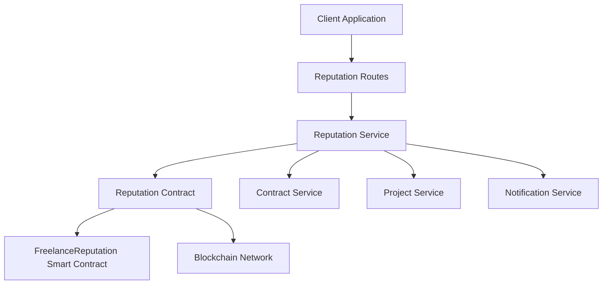
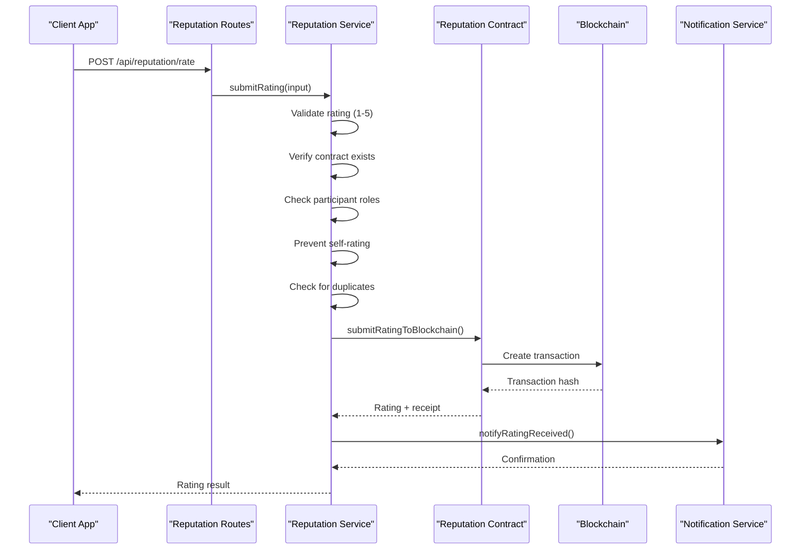
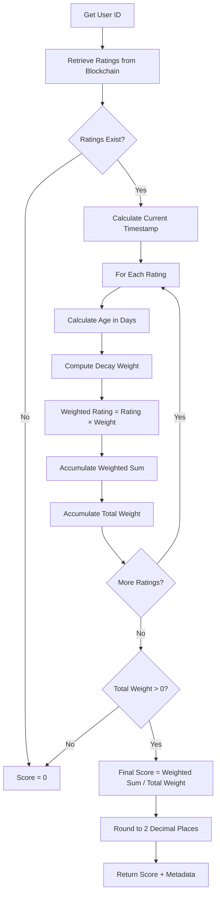
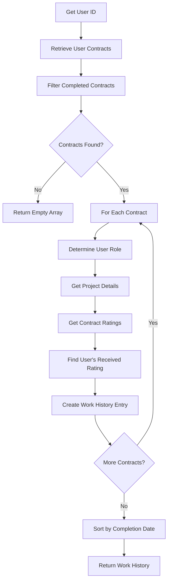
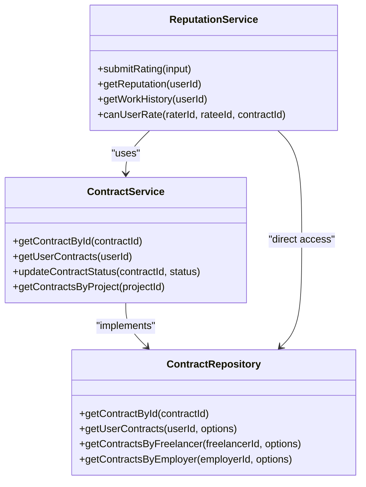
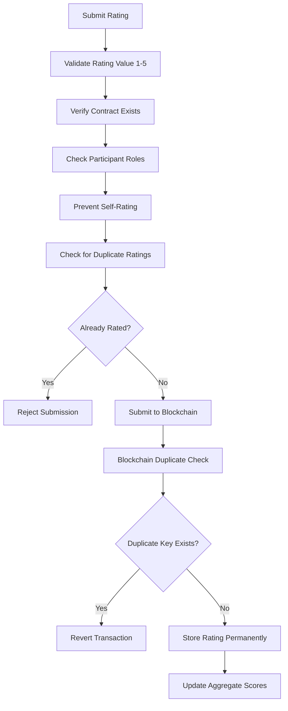
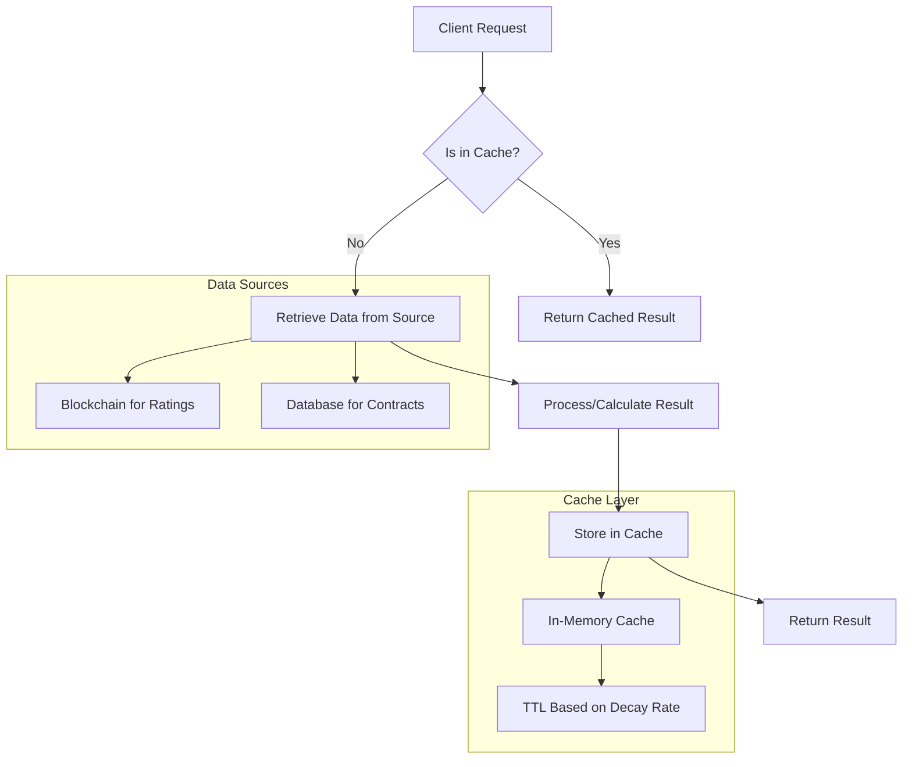

# Reputation Service

<cite>
**Referenced Files in This Document**   
- [reputation-service.ts](file://src/services/reputation-service.ts)
- [reputation-contract.ts](file://src/services/reputation-contract.ts)
- [reputation-routes.ts](file://src/routes/reputation-routes.ts)
- [FreelanceReputation.sol](file://contracts/FreelanceReputation.sol)
- [contract-service.ts](file://src/services/contract-service.ts)
- [matching-service.ts](file://src/services/matching-service.ts)
- [review-repository.ts](file://src/repositories/review-repository.ts)
- [blockchain-client.ts](file://src/services/blockchain-client.ts)
</cite>

## Table of Contents
1. [Introduction](#introduction)
2. [Core Components](#core-components)
3. [Rating Submission Process](#rating-submission-process)
4. [Reputation Score Calculation](#reputation-score-calculation)
5. [Feedback Management](#feedback-management)
6. [Integration with Contract Service](#integration-with-contract-service)
7. [Integration with Matching Service](#integration-with-matching-service)
8. [Security and Anti-Manipulation Measures](#security-and-anti-manipulation-measures)
9. [Performance Considerations](#performance-considerations)
10. [Troubleshooting Guide](#troubleshooting-guide)

## Introduction

The Reputation Service is a critical component of the FreelanceXchain platform, responsible for managing the on-chain reputation system that enables trust and transparency between freelancers and employers. This service implements a comprehensive reputation framework that records, verifies, and calculates user ratings based on completed contracts. The system is designed to prevent rating manipulation while providing accurate reputation metrics that influence user matching and platform trust.

The service operates at the intersection of blockchain technology and application logic, ensuring that all reputation data is immutably stored on-chain while providing efficient off-chain access for analytics and user interfaces. It interacts with the FreelanceReputation smart contract to store ratings permanently and provides APIs for submitting reviews, calculating reputation scores, retrieving reputation history, and verifying reputation data.

**Section sources**
- [reputation-service.ts](file://src/services/reputation-service.ts#L1-L50)
- [FreelanceReputation.sol](file://contracts/FreelanceReputation.sol#L1-L20)

## Core Components

The Reputation Service consists of several interconnected components that work together to provide a robust reputation system. The service layer contains the business logic for reputation management, while the contract interface handles blockchain interactions. The API routes expose these capabilities to clients, and the underlying smart contract ensures data immutability and integrity.

The service follows a layered architecture with clear separation of concerns. The reputation-service.ts file contains the core business logic, including validation, data retrieval, and response formatting. This service layer depends on reputation-contract.ts for blockchain operations and leverages other services like contract-service.ts for contextual validation. The reputation-routes.ts file provides the REST API endpoints that expose these capabilities to external consumers.



**Diagram sources**
- [reputation-service.ts](file://src/services/reputation-service.ts#L1-L357)
- [reputation-contract.ts](file://src/services/reputation-contract.ts#L1-L288)
- [reputation-routes.ts](file://src/routes/reputation-routes.ts#L1-L413)

**Section sources**
- [reputation-service.ts](file://src/services/reputation-service.ts#L1-L357)
- [reputation-contract.ts](file://src/services/reputation-contract.ts#L1-L288)
- [reputation-routes.ts](file://src/routes/reputation-routes.ts#L1-L413)

## Rating Submission Process

The rating submission process is initiated through the submitRating method, which validates and records user ratings on the blockchain. This process begins when a user submits a rating through the /api/reputation/rate endpoint, which invokes the submitRating function in the reputation service. The function performs comprehensive validation before submitting the rating to the blockchain.

The validation process ensures that ratings are legitimate and cannot be manipulated. It checks that the rating value is an integer between 1 and 5, verifies that the contract exists and both parties are valid participants, confirms that users cannot rate themselves, and prevents duplicate ratings for the same contract. This multi-layered validation ensures the integrity of the reputation system by only allowing legitimate ratings to be recorded.

Once validation passes, the service submits the rating to the FreelanceReputation smart contract via the submitRatingToBlockchain function. This creates a blockchain transaction that permanently records the rating, including the contract reference, rater and ratee identifiers, rating value, comment, and timestamp. The transaction hash is returned to the client as proof of submission, and the ratee is notified of the new rating.



**Diagram sources**
- [reputation-service.ts](file://src/services/reputation-service.ts#L76-L179)
- [reputation-contract.ts](file://src/services/reputation-contract.ts#L91-L149)
- [reputation-routes.ts](file://src/routes/reputation-routes.ts#L188-L272)

**Section sources**
- [reputation-service.ts](file://src/services/reputation-service.ts#L76-L179)
- [reputation-contract.ts](file://src/services/reputation-contract.ts#L91-L149)
- [reputation-routes.ts](file://src/routes/reputation-routes.ts#L188-L272)

## Reputation Score Calculation

The reputation score calculation system computes a user's reputation based on their received ratings, with a sophisticated time decay mechanism that gives more weight to recent feedback. The calculateReputationScore functionality (implemented as getReputation) retrieves all ratings for a user from the blockchain and computes a weighted average that reflects both the quality and recency of feedback.

The scoring algorithm uses an exponential decay function to calculate the weight of each rating based on its age. The formula weight = e^(-lambda * age_in_days) ensures that newer ratings have greater influence on the overall score, with the decay rate controlled by the lambda parameter (default: 0.01, representing approximately 1% decay per day). This approach prevents users from maintaining high reputation scores based solely on outdated positive feedback while encouraging continuous high-quality performance.

In addition to the weighted reputation score, the system also calculates a simple average rating without time decay, providing both a current performance indicator and a historical performance summary. The service returns both metrics along with the complete rating history, enabling clients to display comprehensive reputation information. The calculation is performed off-chain for efficiency, but all source data remains on-chain for verifiability.



**Diagram sources**
- [reputation-service.ts](file://src/services/reputation-service.ts#L188-L213)
- [reputation-contract.ts](file://src/services/reputation-contract.ts#L212-L242)

**Section sources**
- [reputation-service.ts](file://src/services/reputation-service.ts#L188-L213)
- [reputation-contract.ts](file://src/services/reputation-contract.ts#L212-L242)

## Feedback Management

The feedback management system provides comprehensive capabilities for retrieving and analyzing reputation history through the getReputationHistory functionality (implemented as getWorkHistory). This service retrieves all completed contracts for a user and enriches them with rating information, creating a complete work history that demonstrates the user's track record on the platform.

The getWorkHistory function retrieves all contracts associated with a user, filters for completed contracts only, and then enriches each contract with relevant rating information. For each completed contract, it determines the user's role (freelancer or employer), retrieves the project title, and finds any rating the user received for that contract. The results are sorted by completion date in descending order, providing a chronological work history that highlights recent performance.

The system also provides the canUserRate function, which checks whether a user is eligible to submit a rating for a specific contract. This function verifies contract existence, participant roles, and absence of prior ratings, providing a pre-submission check that improves user experience by identifying issues before submission. This capability is exposed through the /api/reputation/can-rate endpoint, allowing client applications to conditionally display rating interfaces.



**Diagram sources**
- [reputation-service.ts](file://src/services/reputation-service.ts#L220-L269)
- [reputation-service.ts](file://src/services/reputation-service.ts#L304-L356)

**Section sources**
- [reputation-service.ts](file://src/services/reputation-service.ts#L220-L269)
- [reputation-service.ts](file://src/services/reputation-service.ts#L304-L356)

## Integration with Contract Service

The Reputation Service integrates closely with the Contract Service to ensure that ratings are only submitted for valid, completed contracts. This integration is critical for maintaining the integrity of the reputation system by preventing ratings for non-existent contracts or contracts that haven't been completed. The service uses the contractRepository to verify contract existence and participant roles before allowing rating submission.

When a user attempts to submit a rating, the Reputation Service calls getContractById from the Contract Service to retrieve the contract details. This allows the service to verify that both the rater and ratee are legitimate participants in the contract and that the contract has reached a completed status. This dependency ensures that the reputation system is tightly coupled with the contract lifecycle, only allowing ratings after successful contract completion.

The integration also enables the Reputation Service to enrich rating data with contextual information from the contract, such as the project title, which is used in user notifications. This creates a seamless experience where users receive notifications about new ratings with meaningful context about which project the rating refers to, improving transparency and engagement.



**Diagram sources**
- [reputation-service.ts](file://src/services/reputation-service.ts#L18-L19)
- [contract-service.ts](file://src/services/contract-service.ts#L1-L140)

**Section sources**
- [reputation-service.ts](file://src/services/reputation-service.ts#L91-L101)
- [contract-service.ts](file://src/services/contract-service.ts#L23-L32)

## Integration with Matching Service

The Reputation Service provides critical data to the Matching Service, enabling skill-based recommendations that incorporate reputation metrics. Although the current implementation shows a TODO comment for integrating actual reputation scores, the system is designed to weight recommendations by both skill match (70%) and reputation score (30%), creating a balanced matching algorithm that values both capability and trustworthiness.

The Matching Service uses reputation data to rank freelancer recommendations for projects, with higher reputation scores contributing to better placement in recommendation lists. This integration ensures that users with proven track records of successful project completion are prioritized in search results, creating positive incentives for maintaining high-quality work standards. The reputation component prevents new users with limited work history from displacing experienced, highly-rated professionals.

The system architecture supports this integration through the getReputation function, which provides the necessary data to the Matching Service. When generating recommendations, the Matching Service can call this function to retrieve up-to-date reputation scores and incorporate them into the combined scoring algorithm. This creates a feedback loop where successful project completion leads to better ratings, which in turn leads to more visibility and opportunities.

```mermaid
flowchart TD
A[Project Recommendation Request] --> B[Get Freelancer Skills]
B --> C[Get Project Requirements]
C --> D[Calculate Skill Match Score]
D --> E[Get Reputation Score]
E --> F[Calculate Combined Score]
F --> G[Combined Score = (Skill Match × 0.7) + (Reputation × 0.3)]
G --> H[Sort by Combined Score]
H --> I[Return Top Recommendations]
```

**Diagram sources**
- [matching-service.ts](file://src/services/matching-service.ts#L39-L41)
- [matching-service.ts](file://src/services/matching-service.ts#L197-L200)

**Section sources**
- [matching-service.ts](file://src/services/matching-service.ts#L147-L200)

## Security and Anti-Manipulation Measures

The Reputation Service implements multiple security measures to prevent Sybil attacks, rating manipulation, and other forms of abuse. The system employs a comprehensive validation framework that checks rating eligibility at multiple levels, ensuring that only legitimate participants can submit ratings for completed contracts.

Key anti-manipulation features include duplicate rating prevention, which uses the hasUserRatedForContract function to check whether a user has already rated another user for a specific contract. This check occurs both in the service layer and is reinforced by the smart contract's ratingExists mapping, creating a dual-layer protection against duplicate submissions. The system also prevents self-rating by verifying that the rater and ratee IDs are different.

The on-chain storage of ratings in the FreelanceReputation contract provides additional security by making all ratings immutable and publicly verifiable. The contract uses a unique rating key (keccak256 hash of rater, ratee, and contract ID) to prevent duplicate ratings at the blockchain level, ensuring data integrity even if the off-chain service layer were compromised. This hybrid approach combines efficient off-chain validation with tamper-proof on-chain storage.



**Diagram sources**
- [reputation-service.ts](file://src/services/reputation-service.ts#L137-L149)
- [FreelanceReputation.sol](file://contracts/FreelanceReputation.sol#L76-L81)

**Section sources**
- [reputation-service.ts](file://src/services/reputation-service.ts#L80-L149)
- [FreelanceReputation.sol](file://contracts/FreelanceReputation.sol#L76-L81)

## Performance Considerations

The Reputation Service is designed with performance optimization in mind, particularly for handling large-scale reputation queries and implementing effective caching strategies. The system separates read and write operations, with write operations (rating submission) requiring blockchain confirmation and read operations (score retrieval) served from optimized data structures.

For large-scale queries, the service retrieves all ratings for a user in a single operation from the blockchain, then performs the reputation calculation off-chain. This approach minimizes blockchain interactions while ensuring data consistency. The getWorkHistory function similarly retrieves all relevant contracts in bulk before enriching them with rating data, reducing database round-trips.

The architecture supports caching at multiple levels. Application-level caching can store frequently accessed reputation scores for a short duration, reducing redundant calculations. The blockchain client's in-memory transaction store (simulated in development) represents how a production system would cache blockchain data to reduce RPC calls. For high-traffic scenarios, a distributed caching layer like Redis could be implemented to store computed reputation scores with appropriate TTL values based on the decay rate.



**Diagram sources**
- [reputation-service.ts](file://src/services/reputation-service.ts#L193-L196)
- [blockchain-client.ts](file://src/services/blockchain-client.ts#L21-L22)

**Section sources**
- [reputation-service.ts](file://src/services/reputation-service.ts#L193-L196)

## Troubleshooting Guide

Common issues with the Reputation Service typically involve validation failures, blockchain interaction problems, or data consistency issues. Understanding these common scenarios and their solutions is essential for maintaining system reliability and providing effective user support.

For rating submission failures, the most common causes are invalid rating values (not integers between 1-5), attempts to rate non-existent contracts, or duplicate rating attempts. These are handled with specific error codes (INVALID_RATING, NOT_FOUND, DUPLICATE_RATING) that should be communicated clearly to users. When debugging, verify that the contract exists and is in a completed state, and check that the user has not already submitted a rating for that contract.

Blockchain interaction issues may occur during rating submission, typically manifesting as transaction confirmation failures. The system should implement appropriate retry logic and error handling for these scenarios. Monitoring the blockchain client's transaction store and pending transactions can help identify stuck transactions. In production, integration with a reliable Ethereum node provider is essential for consistent blockchain connectivity.

Data consistency issues between on-chain and off-chain data can arise if the reputation calculation does not properly account for all ratings. This can be diagnosed by comparing the ratings returned by getRatingsFromBlockchain with the expected contract completions. Ensuring that the contract status is properly updated to "completed" before rating submission is crucial for maintaining data integrity across the system.

**Section sources**
- [reputation-service.ts](file://src/services/reputation-service.ts#L80-L149)
- [reputation-service.ts](file://src/services/reputation-service.ts#L193-L196)
- [reputation-contract.ts](file://src/services/reputation-contract.ts#L119-L123)