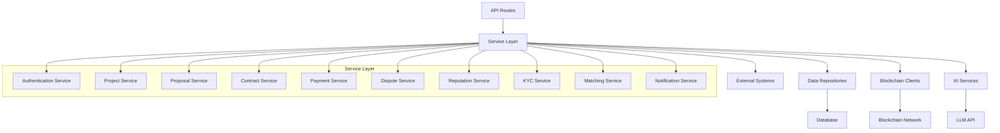
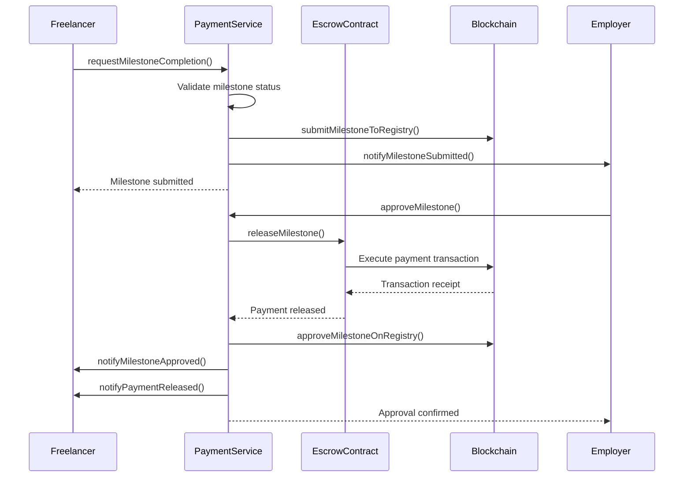
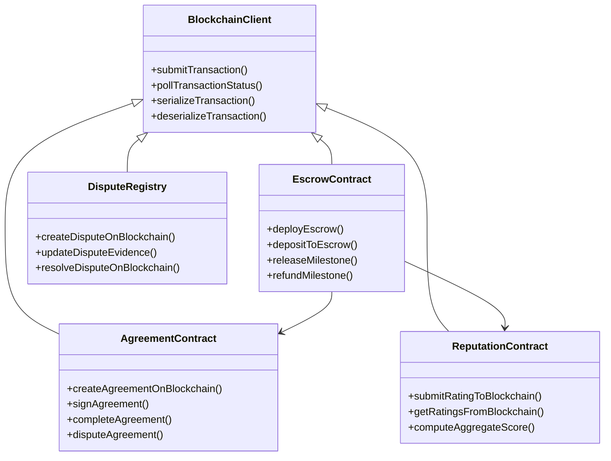
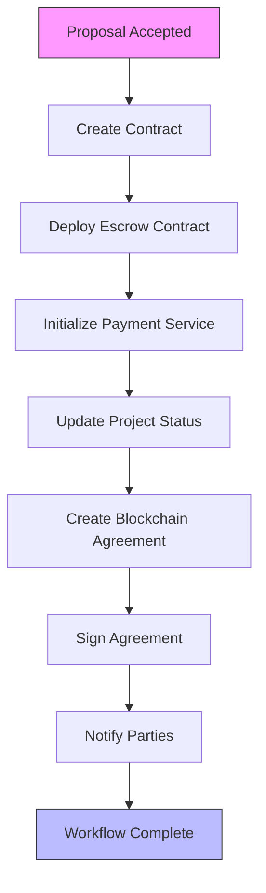

# Business Logic Layer

<cite>
**Referenced Files in This Document**   
- [auth-service.ts](file://src/services/auth-service.ts)
- [project-service.ts](file://src/services/project-service.ts)
- [proposal-service.ts](file://src/services/proposal-service.ts)
- [contract-service.ts](file://src/services/contract-service.ts)
- [payment-service.ts](file://src/services/payment-service.ts)
- [dispute-service.ts](file://src/services/dispute-service.ts)
- [reputation-service.ts](file://src/services/reputation-service.ts)
- [kyc-service.ts](file://src/services/kyc-service.ts)
- [matching-service.ts](file://src/services/matching-service.ts)
- [notification-service.ts](file://src/services/notification-service.ts)
- [escrow-contract.ts](file://src/services/escrow-contract.ts)
- [agreement-contract.ts](file://src/services/agreement-contract.ts)
- [reputation-contract.ts](file://src/services/reputation-contract.ts)
- [dispute-registry.ts](file://src/services/dispute-registry.ts)
- [milestone-registry.ts](file://src/services/milestone-registry.ts)
- [blockchain-client.ts](file://src/services/blockchain-client.ts)
- [ai-client.ts](file://src/services/ai-client.ts)
- [index.ts](file://src/services/index.ts)
</cite>

## Table of Contents
1. [Introduction](#introduction)
2. [Service Layer Architecture](#service-layer-architecture)
3. [Authentication Service](#authentication-service)
4. [Project Management Service](#project-management-service)
5. [Proposal Handling Service](#proposal-handling-service)
6. [Contract Service](#contract-service)
7. [Payment Processing Service](#payment-processing-service)
8. [Dispute Resolution Service](#dispute-resolution-service)
9. [Reputation Management Service](#reputation-management-service)
10. [KYC Verification Service](#kyc-verification-service)
11. [AI Matching Service](#ai-matching-service)
12. [Notification Service](#notification-service)
13. [Blockchain Integration Services](#blockchain-integration-services)
14. [Service Orchestration and Workflows](#service-orchestration-and-workflows)
15. [Error Handling and Validation](#error-handling-and-validation)
16. [Conclusion](#conclusion)

## Introduction
The FreelanceXchain business logic layer implements a comprehensive Service Layer pattern that encapsulates domain-specific logic for managing freelance marketplace operations. This documentation provides a detailed analysis of the service architecture, focusing on how each service class handles specific domain concerns including authentication, project management, proposal handling, contract execution, payment processing, dispute resolution, reputation management, AI matching, notifications, and KYC verification. The services coordinate between API routes, data repositories, and external systems such as blockchain clients and AI services, creating a robust and scalable architecture for the platform.

**Section sources**
- [index.ts](file://src/services/index.ts#L1-L420)

## Service Layer Architecture
The business logic layer follows a clean, modular Service Layer pattern where each service class is responsible for a specific domain area. Services are designed with clear interfaces that expose methods for business operations, returning standardized result types that include success status and either data or error information. This pattern ensures separation of concerns, making the codebase maintainable and testable. Services coordinate with API routes through controllers, interact with data repositories for persistence, and integrate with external systems like blockchain clients and AI services for enhanced functionality.

**Diagram sources**
- [index.ts](file://src/services/index.ts#L1-L420)

**Section sources**
- [index.ts](file://src/services/index.ts#L1-L420)

## Authentication Service
The authentication service handles user registration, login, token management, and OAuth integration. It validates credentials against Supabase Auth and maintains user profiles in the public.users table. The service implements password strength requirements and handles email verification workflows. For OAuth users, it facilitates role selection and wallet address association during registration. The service returns standardized AuthResult objects containing user information and tokens, or AuthError objects when operations fail.

**Section sources**
- [auth-service.ts](file://src/services/auth-service.ts#L1-L473)

## Project Management Service
The project service manages the lifecycle of freelance projects, from creation to deletion. It validates project inputs, ensures skill requirements reference active skills, and enforces business rules such as preventing modifications to projects with accepted proposals. The service supports milestone management, requiring that milestone amounts sum to the total project budget. It provides comprehensive search and filtering capabilities, allowing users to find projects by keyword, skills, budget range, and status. The service returns ProjectServiceResult objects that encapsulate operation outcomes.

**Section sources**
- [project-service.ts](file://src/services/project-service.ts#L1-L388)

## Proposal Handling Service
The proposal service manages the submission, acceptance, and rejection of proposals for freelance projects. It prevents duplicate proposals and ensures only employers can accept or reject proposals for their projects. When a proposal is accepted, the service creates a contract, updates the project status to "in_progress", and triggers blockchain operations to create and sign the agreement. The service returns ProposalServiceResult objects and includes notification data to inform users of proposal status changes.

**Section sources**
- [proposal-service.ts](file://src/services/proposal-service.ts#L1-L414)

## Contract Service
The contract service provides operations for retrieving and updating contract information. It implements strict status transition rules, preventing invalid state changes (e.g., cannot transition from "completed" to any other status). The service manages the relationship between contracts and their associated proposals, projects, and users. It returns ContractServiceResult objects and supports pagination for retrieving user contracts. The service acts as an intermediary between business operations and the underlying data persistence layer.

**Section sources**
- [contract-service.ts](file://src/services/contract-service.ts#L1-L140)

## Payment Processing Service
The payment service handles milestone-based payment workflows, including completion requests, approvals, disputes, and contract completion. It coordinates with the escrow contract service to release payments and with the milestone registry to record completion events on-chain. The service implements idempotency considerations and transaction management, ensuring consistent state across database and blockchain systems. It provides detailed payment status information and supports the complete lifecycle of milestone payments from request to final settlement.

**Diagram sources**
- [payment-service.ts](file://src/services/payment-service.ts#L1-L643)
- [escrow-contract.ts](file://src/services/escrow-contract.ts#L1-L327)

**Section sources**
- [payment-service.ts](file://src/services/payment-service.ts#L1-L643)

## Dispute Resolution Service
The dispute service manages the creation, evidence submission, and resolution of disputes related to project milestones. It enforces business rules such as preventing disputes on approved milestones and ensuring only contract parties can initiate disputes. When a dispute is resolved, the service coordinates with the escrow contract to release or refund funds based on the resolution decision. The service records all dispute activities on-chain for transparency and immutability. It returns DisputeServiceResult objects and supports admin operations for dispute resolution.

**Section sources**
- [dispute-service.ts](file://src/services/dispute-service.ts#L1-L521)

## Reputation Management Service
The reputation service handles the submission and retrieval of ratings for completed contracts. It validates ratings (1-5 scale), prevents self-rating, and checks for duplicate ratings. The service computes reputation scores using time-decayed weighting, giving more recent ratings higher influence. It integrates with the blockchain to store ratings immutably and provides work history functionality that shows a user's completed contracts and received ratings. The service returns ReputationServiceResult objects and supports serialization/deserialization of reputation records.

**Section sources**
- [reputation-service.ts](file://src/services/reputation-service.ts#L1-L357)

## KYC Verification Service
The KYC service manages the identity verification process for platform users. It supports document verification, liveness checks, and face matching to ensure user identities are authentic. The service integrates with blockchain to record verification status and supports tiered verification levels based on country requirements. It provides functionality for administrators to review and approve/reject KYC submissions. The service validates country-specific requirements and ensures compliance with regulatory standards.

**Section sources**
- [kyc-service.ts](file://src/services/kyc-service.ts#L1-L547)

## AI Matching Service
The AI matching service provides skill-based recommendations between freelancers and projects. It uses AI-powered analysis when available, falling back to keyword matching when AI services are unavailable. The service calculates match scores based on skill relevance and can analyze skill gaps to recommend development areas for freelancers. It supports both project recommendations for freelancers and freelancer recommendations for projects, with the latter incorporating reputation scores into the ranking algorithm.

**Section sources**
- [matching-service.ts](file://src/services/matching-service.ts#L1-L391)

## Notification Service
The notification service manages user notifications for various platform events. It supports different notification types such as proposal submissions, milestone updates, and dispute resolutions. The service provides CRUD operations for notifications with pagination support and allows users to mark notifications as read individually or in bulk. It includes helper functions for creating specific notification types with appropriate messaging and data payloads.

**Section sources**
- [notification-service.ts](file://src/services/notification-service.ts#L1-L316)

## Blockchain Integration Services
The blockchain integration services provide a bridge between the application and blockchain networks. The blockchain client handles transaction submission, status polling, and serialization. The escrow contract service manages fund holding and release for project milestones. The agreement contract service stores contract terms and signatures on-chain for immutability. The reputation contract service records ratings on-chain, and the dispute registry maintains dispute records. These services simulate blockchain interactions in development and connect to real networks in production.

**Diagram sources**
- [blockchain-client.ts](file://src/services/blockchain-client.ts#L1-L293)
- [escrow-contract.ts](file://src/services/escrow-contract.ts#L1-L327)
- [agreement-contract.ts](file://src/services/agreement-contract.ts#L1-L343)
- [reputation-contract.ts](file://src/services/reputation-contract.ts#L1-L288)
- [dispute-registry.ts](file://src/services/dispute-registry.ts#L1-L250)

**Section sources**
- [blockchain-client.ts](file://src/services/blockchain-client.ts#L1-L293)
- [escrow-contract.ts](file://src/services/escrow-contract.ts#L1-L327)
- [agreement-contract.ts](file://src/services/agreement-contract.ts#L1-L343)
- [reputation-contract.ts](file://src/services/reputation-contract.ts#L1-L288)

## Service Orchestration and Workflows
Services in FreelanceXchain are orchestrated to handle complex workflows that span multiple domains. The most critical workflow is the project-to-contract conversion, which involves coordination between the proposal service, contract service, payment service, and blockchain integration services. When a proposal is accepted, multiple services are invoked in sequence to create the contract, deploy the escrow, initialize payment processing, and update related entities. This orchestration ensures data consistency and provides a seamless user experience.

**Diagram sources**
- [proposal-service.ts](file://src/services/proposal-service.ts#L1-L414)
- [contract-service.ts](file://src/services/contract-service.ts#L1-L140)
- [payment-service.ts](file://src/services/payment-service.ts#L1-L643)
- [agreement-contract.ts](file://src/services/agreement-contract.ts#L1-L343)

**Section sources**
- [proposal-service.ts](file://src/services/proposal-service.ts#L1-L414)
- [contract-service.ts](file://src/services/contract-service.ts#L1-L140)
- [payment-service.ts](file://src/services/payment-service.ts#L1-L643)

## Error Handling and Validation
The service layer implements comprehensive error handling and validation strategies. Each service returns standardized result types that include success status and either data or error information. Validation occurs at multiple levels, including input validation, business rule validation, and authorization checks. Services use specific error codes and messages to communicate failure reasons to clients. The architecture supports transaction management, ensuring data consistency across operations, and implements idempotency considerations for critical operations to prevent duplicate processing.

**Section sources**
- [auth-service.ts](file://src/services/auth-service.ts#L1-L473)
- [project-service.ts](file://src/services/project-service.ts#L1-L388)
- [proposal-service.ts](file://src/services/proposal-service.ts#L1-L414)

## Conclusion
The business logic layer of FreelanceXchain demonstrates a well-structured Service Layer pattern implementation that effectively encapsulates domain logic for a complex freelance marketplace. Each service class has clear responsibilities and interfaces, enabling maintainability and testability. The architecture successfully coordinates between API routes, data repositories, and external systems like blockchain clients and AI services. Key workflows such as project-to-contract conversion are properly orchestrated, with appropriate transaction management and error handling. The service layer provides a robust foundation for the platform's core functionality while maintaining flexibility for future enhancements.