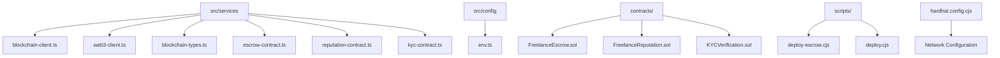
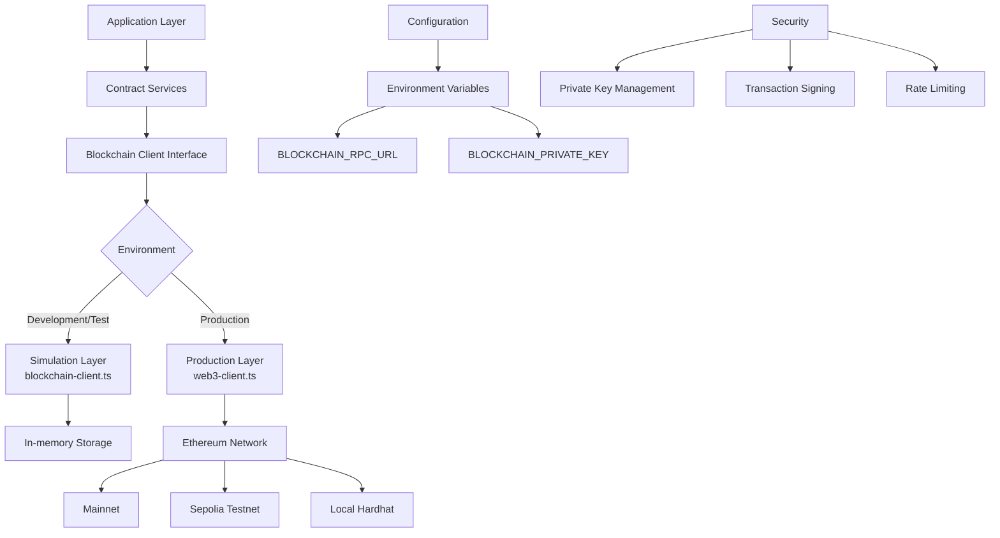
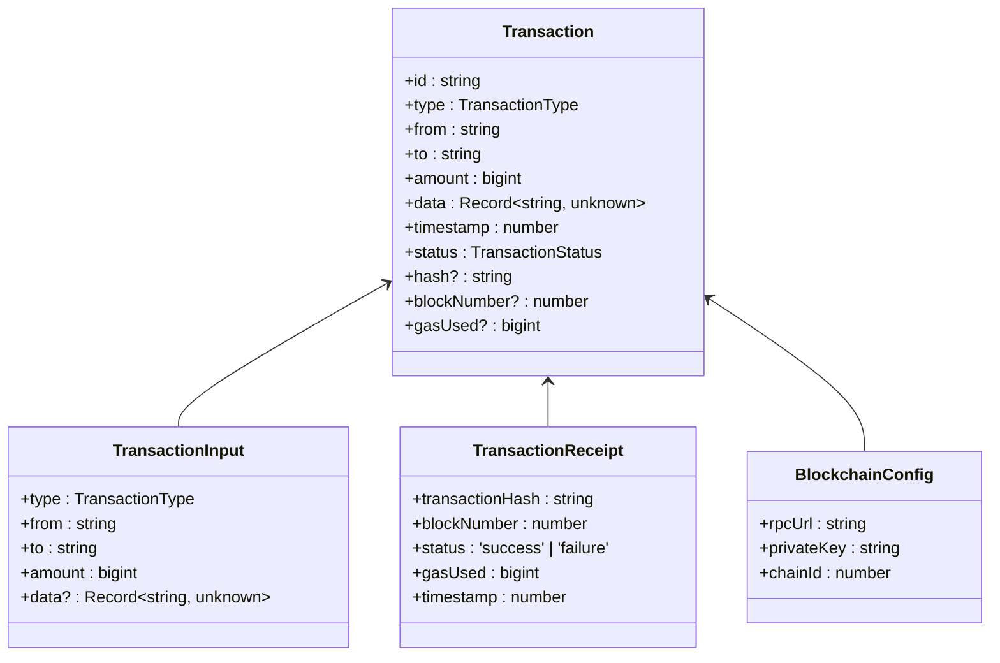
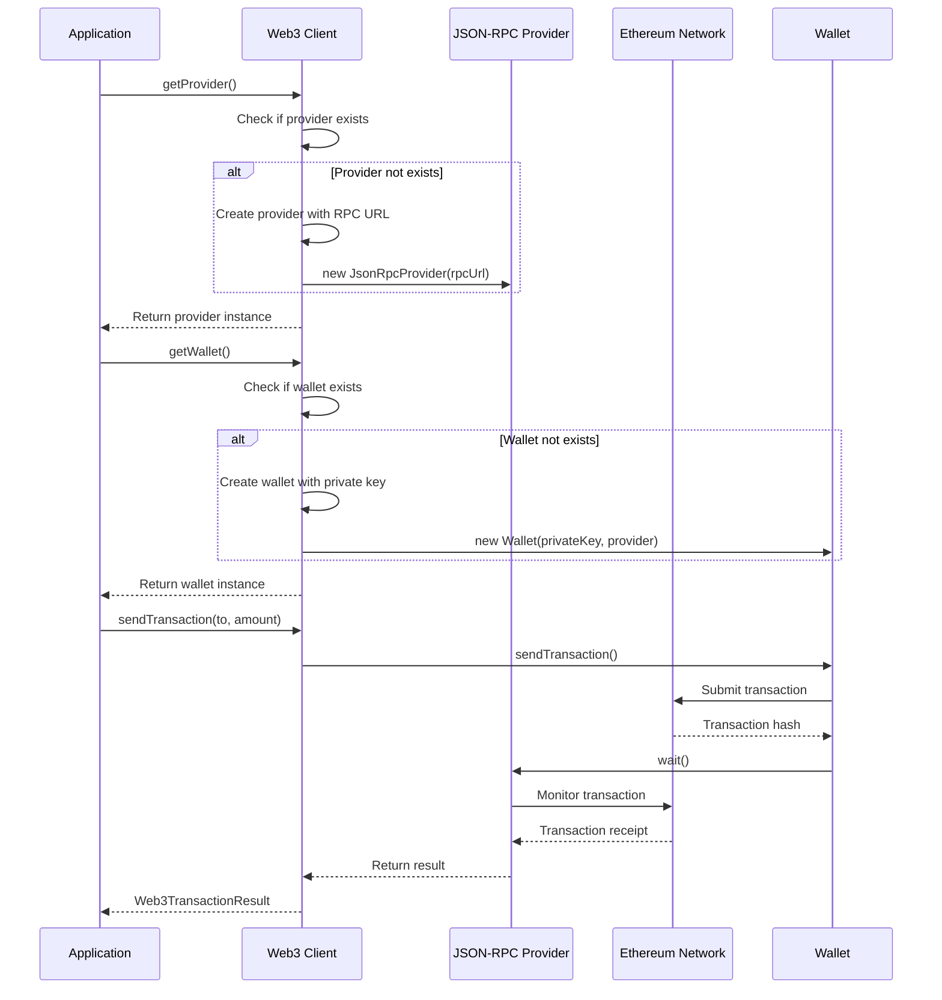
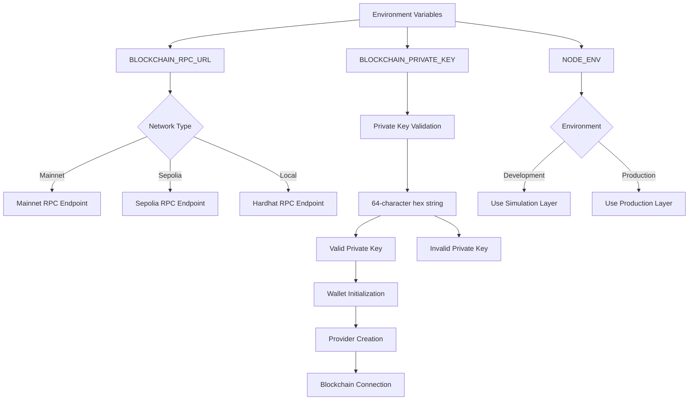
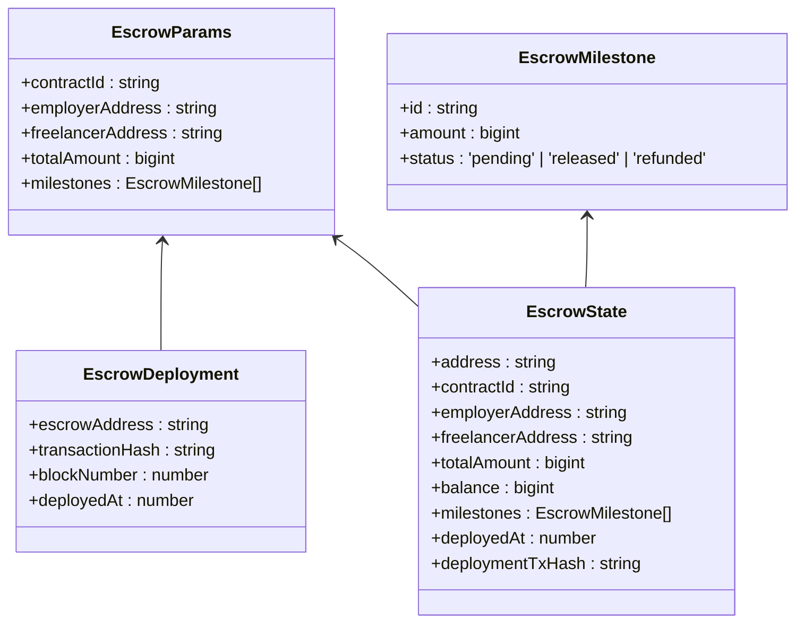
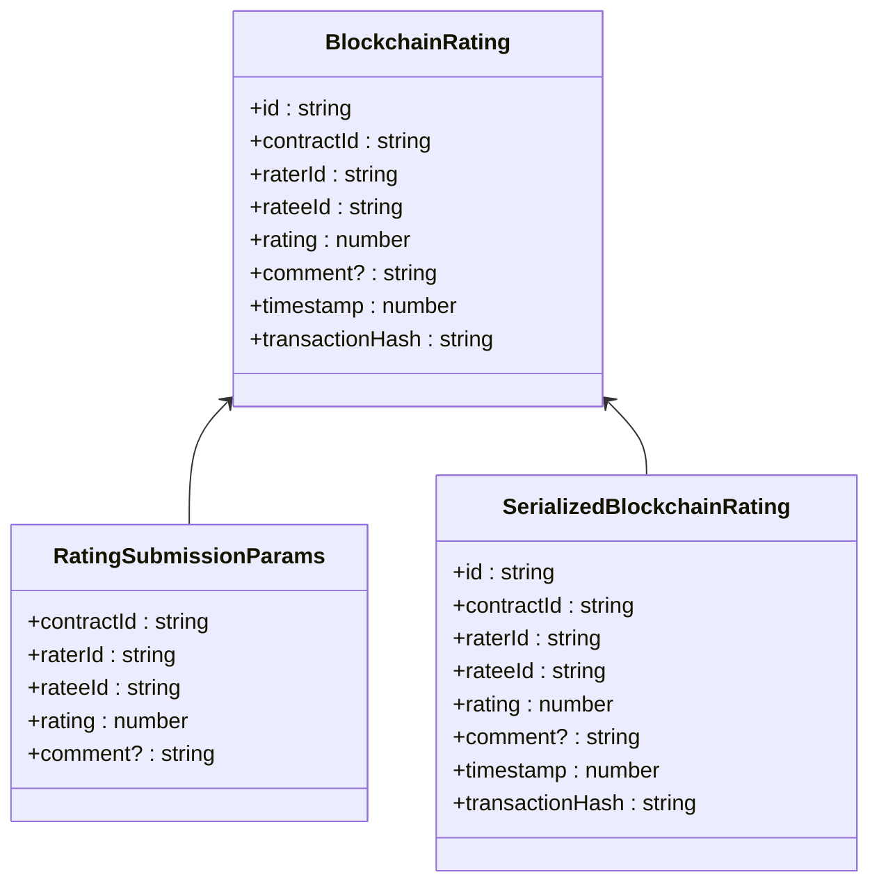
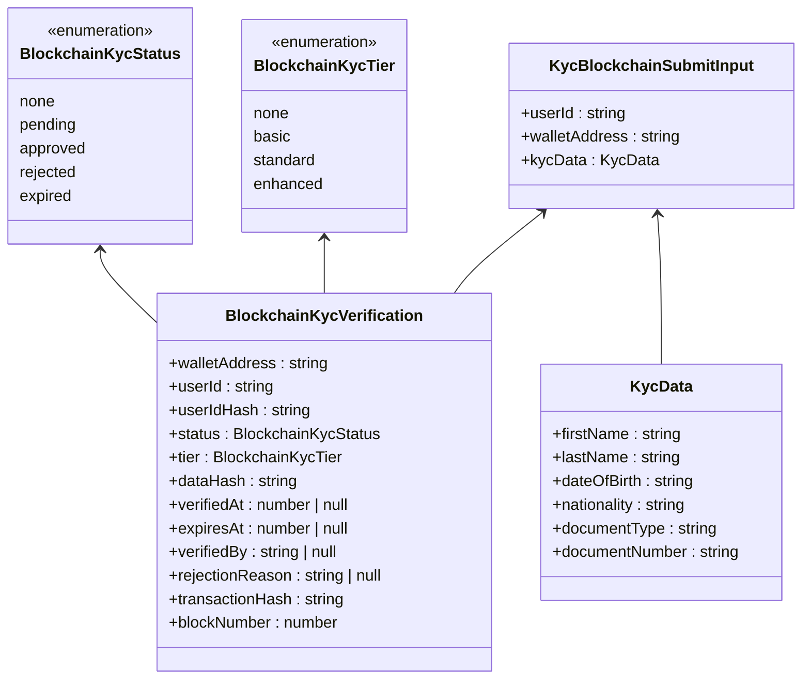

# Blockchain Client

<cite>
**Referenced Files in This Document**   
- [blockchain-client.ts](file://src/services/blockchain-client.ts)
- [web3-client.ts](file://src/services/web3-client.ts)
- [blockchain-types.ts](file://src/services/blockchain-types.ts)
- [env.ts](file://src/config/env.ts)
- [escrow-contract.ts](file://src/services/escrow-contract.ts)
- [reputation-contract.ts](file://src/services/reputation-contract.ts)
- [kyc-contract.ts](file://src/services/kyc-contract.ts)
- [hardhat.config.cjs](file://hardhat.config.cjs)
- [package.json](file://package.json)
</cite>

## Table of Contents
1. [Introduction](#introduction)
2. [Project Structure](#project-structure)
3. [Core Components](#core-components)
4. [Architecture Overview](#architecture-overview)
5. [Detailed Component Analysis](#detailed-component-analysis)
6. [Dependency Analysis](#dependency-analysis)
7. [Performance Considerations](#performance-considerations)
8. [Troubleshooting Guide](#troubleshooting-guide)
9. [Conclusion](#conclusion)

## Introduction
The Blockchain Client documentation provides a comprehensive overview of the blockchain infrastructure for the FreelanceXchain platform. This system enables secure communication between the backend and the Ethereum network, supporting mainnet, testnet (Sepolia), and local Hardhat deployments. The implementation leverages ethers.js for blockchain interactions, with a dual-layer architecture consisting of a simulation layer (`blockchain-client.ts`) for development and testing, and a production layer (`web3-client.ts`) for real Ethereum network interactions. The system handles provider configuration, wallet integration, contract instantiation, transaction management, and security practices for private key management.

## Project Structure
The blockchain client infrastructure is organized within the `src/services` directory, with key components including blockchain client implementations, contract interfaces, and configuration management. The system integrates with smart contracts in the `contracts/` directory and uses environment variables for network configuration.



**Diagram sources**
- [blockchain-client.ts](file://src/services/blockchain-client.ts)
- [web3-client.ts](file://src/services/web3-client.ts)
- [env.ts](file://src/config/env.ts)
- [hardhat.config.cjs](file://hardhat.config.cjs)

**Section sources**
- [blockchain-client.ts](file://src/services/blockchain-client.ts)
- [web3-client.ts](file://src/services/web3-client.ts)
- [env.ts](file://src/config/env.ts)
- [hardhat.config.cjs](file://hardhat.config.cjs)

## Core Components
The blockchain client infrastructure consists of two main components: `blockchain-client.ts` for simulation and `web3-client.ts` for production Ethereum network interactions. These components handle transaction management, wallet integration, contract instantiation, and network configuration. The system uses environment variables for configuration, supports multiple network deployments, and implements security practices for private key management. The architecture enables seamless transition between development, testing, and production environments while maintaining consistent interfaces for blockchain interactions.

**Section sources**
- [blockchain-client.ts](file://src/services/blockchain-client.ts#L1-L292)
- [web3-client.ts](file://src/services/web3-client.ts#L1-L338)
- [blockchain-types.ts](file://src/services/blockchain-types.ts#L1-L114)

## Architecture Overview
The blockchain client architecture implements a dual-layer approach with a simulation layer for development and testing, and a production layer for real Ethereum network interactions. The system uses ethers.js for blockchain connectivity, with configuration managed through environment variables. The architecture supports multiple networks including mainnet, Sepolia testnet, and local Hardhat deployments, with connection pooling and retry strategies for reliability.



**Diagram sources**
- [blockchain-client.ts](file://src/services/blockchain-client.ts#L1-L292)
- [web3-client.ts](file://src/services/web3-client.ts#L1-L338)
- [env.ts](file://src/config/env.ts#L1-L69)
- [hardhat.config.cjs](file://hardhat.config.cjs#L1-L49)

## Detailed Component Analysis

### Blockchain Client Implementation
The blockchain client implementation provides a comprehensive interface for Ethereum network interactions, with separate modules for simulation and production environments. The system handles transaction lifecycle management, from creation and signing to confirmation and receipt processing.

#### Transaction Management


**Diagram sources**
- [blockchain-client.ts](file://src/services/blockchain-client.ts#L1-L292)
- [blockchain-types.ts](file://src/services/blockchain-types.ts#L1-L114)

**Section sources**
- [blockchain-client.ts](file://src/services/blockchain-client.ts#L1-L292)
- [blockchain-types.ts](file://src/services/blockchain-types.ts#L1-L114)

#### Web3 Client Integration


**Diagram sources**
- [web3-client.ts](file://src/services/web3-client.ts#L1-L338)

**Section sources**
- [web3-client.ts](file://src/services/web3-client.ts#L1-L338)

### Network Configuration and Environment Handling
The blockchain client infrastructure supports multiple network configurations through environment variables, enabling seamless deployment across mainnet, testnet (Sepolia), and local Hardhat environments. Network configuration is managed through the `env.ts` file, which reads environment variables and provides a structured configuration object.



**Diagram sources**
- [env.ts](file://src/config/env.ts#L1-L69)
- [hardhat.config.cjs](file://hardhat.config.cjs#L1-L49)

**Section sources**
- [env.ts](file://src/config/env.ts#L1-L69)
- [hardhat.config.cjs](file://hardhat.config.cjs#L1-L49)

### Contract Integration and Transaction Management
The blockchain client provides interfaces for various smart contracts including escrow, reputation, and KYC verification. These contract services abstract the complexity of blockchain interactions, providing high-level methods for common operations.

#### Escrow Contract Integration


**Diagram sources**
- [escrow-contract.ts](file://src/services/escrow-contract.ts#L1-L326)

**Section sources**
- [escrow-contract.ts](file://src/services/escrow-contract.ts#L1-L326)

#### Reputation Contract Integration


**Diagram sources**
- [reputation-contract.ts](file://src/services/reputation-contract.ts#L1-L287)

**Section sources**
- [reputation-contract.ts](file://src/services/reputation-contract.ts#L1-L287)

#### KYC Contract Integration


**Diagram sources**
- [kyc-contract.ts](file://src/services/kyc-contract.ts#L1-L365)

**Section sources**
- [kyc-contract.ts](file://src/services/kyc-contract.ts#L1-L365)

## Dependency Analysis
The blockchain client infrastructure has well-defined dependencies that enable its functionality across different environments. The system relies on ethers.js for Ethereum network interactions, dotenv for environment variable management, and TypeScript for type safety.

```mermaid
graph TD
A[blockchain-client.ts] --> B[ethers.js]
A --> C[dotenv]
A --> D[TypeScript]
B --> E[Ethereum Network]
C --> F[Environment Variables]
D --> G[Type Safety]
H[web3-client.ts] --> B
H --> C
H --> D
I[package.json] --> J[ethers: ^6.16.0]
I --> K[@nomicfoundation/hardhat-ethers: ^3.0.8]
I --> L[hardhat: ^2.22.0]
K --> M[Hardhat Integration]
L --> M
M --> N[Local Development]
M --> O[Test Networks]
M --> P[Mainnet Deployment]
```

**Diagram sources**
- [package.json](file://package.json#L1-L66)
- [blockchain-client.ts](file://src/services/blockchain-client.ts#L1-L292)
- [web3-client.ts](file://src/services/web3-client.ts#L1-L338)

**Section sources**
- [package.json](file://package.json#L1-L66)
- [blockchain-client.ts](file://src/services/blockchain-client.ts#L1-L292)
- [web3-client.ts](file://src/services/web3-client.ts#L1-L338)

## Performance Considerations
The blockchain client infrastructure implements several performance optimization techniques to ensure efficient operation in production environments. These include connection pooling through singleton provider and wallet instances, efficient transaction polling with configurable intervals, and gas price estimation to optimize transaction costs. The system also implements rate limiting through middleware to prevent abuse and ensure fair usage of blockchain resources. For production deployments, monitoring approaches include transaction status tracking, error logging, and performance metrics collection to identify and address bottlenecks.

**Section sources**
- [web3-client.ts](file://src/services/web3-client.ts#L34-L35)
- [rate-limiter.ts](file://src/middleware/rate-limiter.ts#L1-L80)
- [blockchain-client.ts](file://src/services/blockchain-client.ts#L184-L238)

## Troubleshooting Guide
The blockchain client infrastructure includes comprehensive error handling for common blockchain interaction failures. The system uses AppError classes to standardize error responses, with specific error codes for different failure scenarios. Common issues include misconfigured environment variables, invalid private keys, network connectivity problems, and transaction failures. The troubleshooting process involves verifying environment configuration, checking network connectivity, validating transaction parameters, and examining error logs. For development and testing, the system provides methods to clear transaction stores and reset client state.

**Section sources**
- [error-handler.ts](file://src/middleware/error-handler.ts#L1-L119)
- [blockchain-client.ts](file://src/services/blockchain-client.ts#L274-L276)
- [web3-client.ts](file://src/services/web3-client.ts#L289-L292)

## Conclusion
The blockchain client infrastructure for FreelanceXchain provides a robust and secure foundation for Ethereum network interactions. The dual-layer architecture with simulation and production components enables efficient development and testing while ensuring reliable production operation. The system's modular design, comprehensive error handling, and support for multiple network configurations make it well-suited for a decentralized freelance marketplace. Future enhancements could include support for additional Layer 2 solutions, improved gas optimization strategies, and enhanced monitoring capabilities for production deployments.