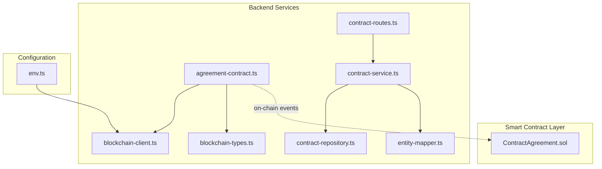
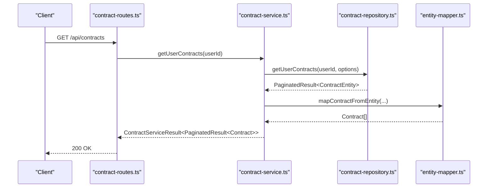
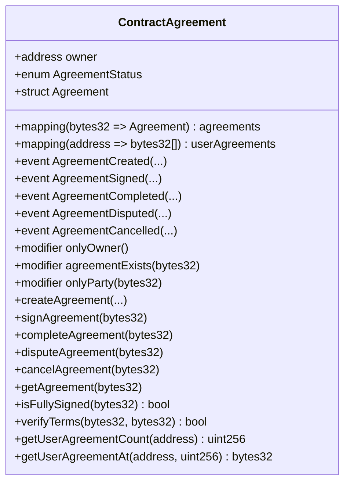
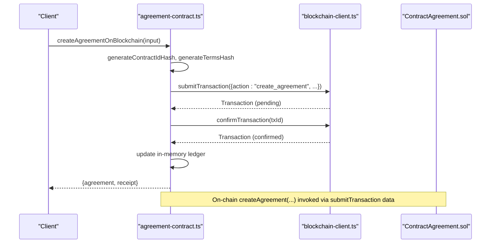
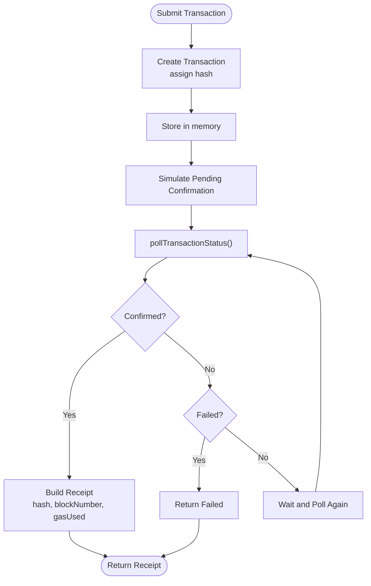
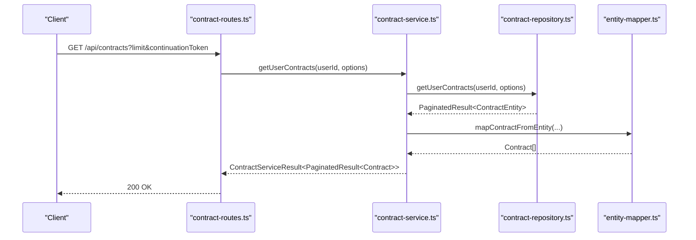
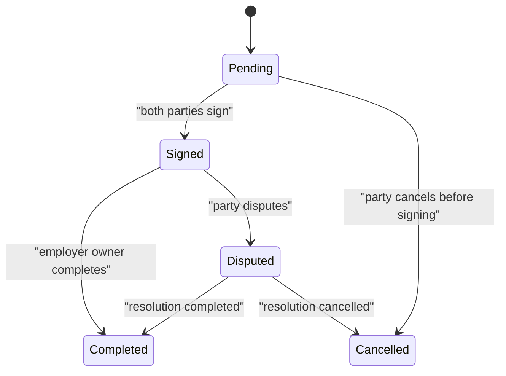
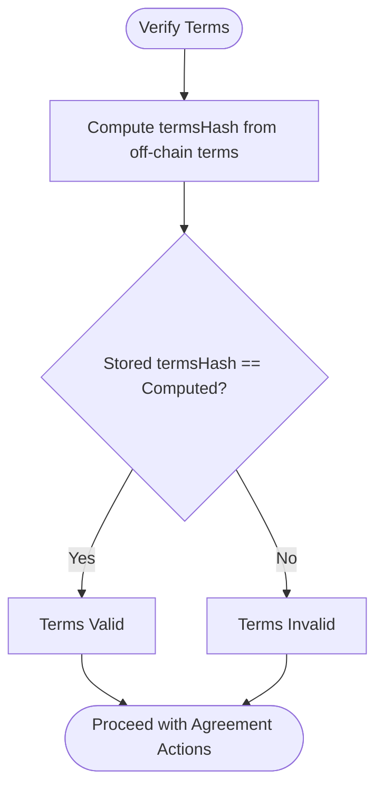
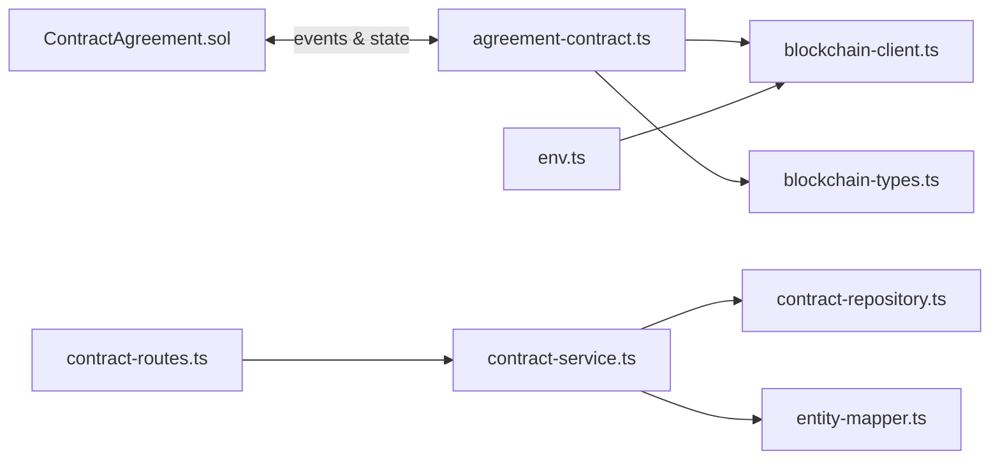

# Contract Agreement

<cite>
**Referenced Files in This Document**
- [ContractAgreement.sol](file://contracts/ContractAgreement.sol)
- [agreement-contract.ts](file://src/services/agreement-contract.ts)
- [blockchain-client.ts](file://src/services/blockchain-client.ts)
- [blockchain-types.ts](file://src/services/blockchain-types.ts)
- [contract-service.ts](file://src/services/contract-service.ts)
- [contract-repository.ts](file://src/repositories/contract-repository.ts)
- [entity-mapper.ts](file://src/utils/entity-mapper.ts)
- [contract-routes.ts](file://src/routes/contract-routes.ts)
- [env.ts](file://src/config/env.ts)
</cite>

## Table of Contents
1. [Introduction](#introduction)
2. [Project Structure](#project-structure)
3. [Core Components](#core-components)
4. [Architecture Overview](#architecture-overview)
5. [Detailed Component Analysis](#detailed-component-analysis)
6. [Dependency Analysis](#dependency-analysis)
7. [Performance Considerations](#performance-considerations)
8. [Troubleshooting Guide](#troubleshooting-guide)
9. [Conclusion](#conclusion)
10. [Appendices](#appendices)

## Introduction
This document provides comprehensive documentation for the Contract Agreement system that formalizes freelance engagements on-chain. It covers the Solidity smart contract that stores agreement terms and signatures, the agreement-contract service that orchestrates blockchain interactions, and the integration with the backend contract-service for synchronized state between blockchain and database records. It also documents the agreement lifecycle, security measures, and operational guidance for creating and updating agreements, including error recovery and audit logging practices.

## Project Structure
The Contract Agreement system spans a Solidity smart contract and a TypeScript backend service layer:
- Solidity contract: stores immutable agreement metadata and status on-chain
- Backend services: manage blockchain transactions, state synchronization, and API exposure
- Database: persists contract entities and status transitions

**Diagram sources**
- [ContractAgreement.sol](file://contracts/ContractAgreement.sol#L1-L186)
- [agreement-contract.ts](file://src/services/agreement-contract.ts#L1-L343)
- [blockchain-client.ts](file://src/services/blockchain-client.ts#L1-L293)
- [blockchain-types.ts](file://src/services/blockchain-types.ts#L1-L115)
- [contract-service.ts](file://src/services/contract-service.ts#L1-L140)
- [contract-repository.ts](file://src/repositories/contract-repository.ts#L1-L139)
- [entity-mapper.ts](file://src/utils/entity-mapper.ts#L281-L311)
- [contract-routes.ts](file://src/routes/contract-routes.ts#L1-L170)
- [env.ts](file://src/config/env.ts#L63-L66)

**Section sources**
- [ContractAgreement.sol](file://contracts/ContractAgreement.sol#L1-L186)
- [agreement-contract.ts](file://src/services/agreement-contract.ts#L1-L343)
- [blockchain-client.ts](file://src/services/blockchain-client.ts#L1-L293)
- [blockchain-types.ts](file://src/services/blockchain-types.ts#L1-L115)
- [contract-service.ts](file://src/services/contract-service.ts#L1-L140)
- [contract-repository.ts](file://src/repositories/contract-repository.ts#L1-L139)
- [entity-mapper.ts](file://src/utils/entity-mapper.ts#L281-L311)
- [contract-routes.ts](file://src/routes/contract-routes.ts#L1-L170)
- [env.ts](file://src/config/env.ts#L63-L66)

## Core Components
- ContractAgreement.sol: On-chain storage of agreement terms hash, party identifiers, amounts, milestone counts, and status. Provides functions to create, sign, complete, dispute, and cancel agreements, with events for lifecycle tracking.
- agreement-contract.ts: Off-chain service that computes hashes, submits transactions, confirms receipts, and maintains an in-memory ledger of agreements for simulation. Exposes functions to create, sign, complete, dispute, and query agreements.
- blockchain-client.ts: Transaction submission, polling, and confirmation utilities with simulated blockchain behavior; serializes/deserializes transactions for JSON transport.
- contract-service.ts and contract-repository.ts: Database-backed contract management with status transitions and queries; integrates with entity-mapper for DTO conversion.
- contract-routes.ts: API endpoints to list and retrieve contracts for authenticated users.
- env.ts: Blockchain configuration for RPC URL and private key.

**Section sources**
- [ContractAgreement.sol](file://contracts/ContractAgreement.sol#L1-L186)
- [agreement-contract.ts](file://src/services/agreement-contract.ts#L1-L343)
- [blockchain-client.ts](file://src/services/blockchain-client.ts#L1-L293)
- [blockchain-types.ts](file://src/services/blockchain-types.ts#L1-L115)
- [contract-service.ts](file://src/services/contract-service.ts#L1-L140)
- [contract-repository.ts](file://src/repositories/contract-repository.ts#L1-L139)
- [entity-mapper.ts](file://src/utils/entity-mapper.ts#L281-L311)
- [contract-routes.ts](file://src/routes/contract-routes.ts#L1-L170)
- [env.ts](file://src/config/env.ts#L63-L66)

## Architecture Overview
The system separates on-chain immutability from off-chain orchestration:
- On-chain: ContractAgreement.sol stores immutable terms hash and status, emits events for lifecycle changes.
- Off-chain: agreement-contract.ts orchestrates transaction submission and confirmation, computes hashes, and updates an in-memory ledger.
- Database: contract-service.ts manages contract entities and status transitions, synchronized with blockchain via the agreement-contract service.

**Diagram sources**
- [contract-routes.ts](file://src/routes/contract-routes.ts#L84-L116)
- [contract-service.ts](file://src/services/contract-service.ts#L34-L59)
- [contract-repository.ts](file://src/repositories/contract-repository.ts#L116-L135)
- [entity-mapper.ts](file://src/utils/entity-mapper.ts#L281-L311)

## Detailed Component Analysis

### ContractAgreement.sol
- Purpose: Immutable on-chain storage of agreement metadata and status.
- Key data:
  - contractIdHash: Hash of off-chain contract identifier
  - termsHash: Hash of contract terms
  - employer and freelancer addresses
  - totalAmount and milestoneCount
  - status: Pending, Signed, Completed, Disputed, Cancelled
  - timestamps for creation and signatures
- Accessors:
  - getAgreement: returns full agreement details
  - isFullySigned: checks mutual signatures
  - verifyTerms: verifies terms hash against stored hash
  - getUserAgreementCount and getUserAgreementAt: enumerate user agreements
- Modifiers:
  - onlyOwner: restricts certain operations to owner
  - agreementExists: validates existence
  - onlyParty: restricts actions to involved parties
- Lifecycle functions:
  - createAgreement: initializes a new agreement
  - signAgreement: allows each party to sign once
  - completeAgreement: marks completion (employer or owner)
  - disputeAgreement: marks dispute (party)
  - cancelAgreement: cancels before mutual signing (party)

**Diagram sources**
- [ContractAgreement.sol](file://contracts/ContractAgreement.sol#L1-L186)

**Section sources**
- [ContractAgreement.sol](file://contracts/ContractAgreement.sol#L1-L186)

### Agreement-Contract Service (agreement-contract.ts)
- Responsibilities:
  - Compute contractIdHash and termsHash using SHA-256
  - Submit transactions to the agreement contract address
  - Confirm transactions and produce receipts
  - Maintain in-memory ledger of agreements for simulation
  - Enforce lifecycle constraints (e.g., pending before signing)
- Key functions:
  - createAgreementOnBlockchain: creates an agreement and marks employer as signed
  - signAgreement: accepts freelancer signature; transitions to Signed when both parties sign
  - completeAgreement: marks Completed (requires Signed)
  - disputeAgreement: marks Disputed (requires Signed)
  - getAgreementFromBlockchain, verifyAgreementTerms, isAgreementFullySigned, getUserAgreements
- Gas and receipts:
  - Receipts include transactionHash, blockNumber, status, gasUsed, timestamp

**Diagram sources**
- [agreement-contract.ts](file://src/services/agreement-contract.ts#L80-L147)
- [blockchain-client.ts](file://src/services/blockchain-client.ts#L131-L159)
- [blockchain-client.ts](file://src/services/blockchain-client.ts#L181-L239)
- [ContractAgreement.sol](file://contracts/ContractAgreement.sol#L60-L92)

**Section sources**
- [agreement-contract.ts](file://src/services/agreement-contract.ts#L1-L343)
- [blockchain-client.ts](file://src/services/blockchain-client.ts#L131-L239)
- [ContractAgreement.sol](file://contracts/ContractAgreement.sol#L60-L115)

### Blockchain Client (blockchain-client.ts)
- Transaction lifecycle:
  - submitTransaction: creates and stores a transaction, assigns a hash, simulates pending confirmation
  - pollTransactionStatus: polls until confirmed or failed
  - confirmTransaction: immediate confirmation for testing
  - failTransaction: marks transaction failed
- Serialization:
  - serializeTransaction/deserializeTransaction for JSON-safe transport
  - serializePaymentTransaction/deserializePaymentTransaction for payment-related structures
- Configuration:
  - getBlockchainConfig and isBlockchainAvailable
  - generateWalletAddress and signTransaction (simulation)

**Diagram sources**
- [blockchain-client.ts](file://src/services/blockchain-client.ts#L131-L239)

**Section sources**
- [blockchain-client.ts](file://src/services/blockchain-client.ts#L1-L293)
- [blockchain-types.ts](file://src/services/blockchain-types.ts#L1-L115)

### Contract-Service and Repository Integration
- contract-service.ts:
  - Provides CRUD-like operations for contracts
  - Enforces status transition rules
  - Maps entities to DTOs using entity-mapper.ts
- contract-repository.ts:
  - Implements queries by freelancer, employer, project, and status
  - Pagination support and error propagation
- contract-routes.ts:
  - Exposes endpoints to list and retrieve contracts for authenticated users

**Diagram sources**
- [contract-routes.ts](file://src/routes/contract-routes.ts#L84-L116)
- [contract-service.ts](file://src/services/contract-service.ts#L34-L59)
- [contract-repository.ts](file://src/repositories/contract-repository.ts#L116-L135)
- [entity-mapper.ts](file://src/utils/entity-mapper.ts#L281-L311)

**Section sources**
- [contract-service.ts](file://src/services/contract-service.ts#L1-L140)
- [contract-repository.ts](file://src/repositories/contract-repository.ts#L1-L139)
- [entity-mapper.ts](file://src/utils/entity-mapper.ts#L281-L311)
- [contract-routes.ts](file://src/routes/contract-routes.ts#L1-L170)

### Agreement Lifecycle and Workflows
- Creation:
  - Off-chain: agreement-contract.ts computes hashes and submits create_agreement transaction
  - On-chain: ContractAgreement.sol stores metadata and sets status to Pending
- Acceptance:
  - Each party signs separately; on-chain requires both signatures to reach Signed
- Completion:
  - Employer or owner invokes completeAgreement; status becomes Completed
- Dispute:
  - Either party invokes disputeAgreement; status becomes Disputed
- Cancellation:
  - Only allowed before mutual signing; invoked by a party

**Diagram sources**
- [ContractAgreement.sol](file://contracts/ContractAgreement.sol#L60-L149)
- [agreement-contract.ts](file://src/services/agreement-contract.ts#L150-L202)
- [agreement-contract.ts](file://src/services/agreement-contract.ts#L204-L243)
- [agreement-contract.ts](file://src/services/agreement-contract.ts#L245-L287)

**Section sources**
- [ContractAgreement.sol](file://contracts/ContractAgreement.sol#L60-L149)
- [agreement-contract.ts](file://src/services/agreement-contract.ts#L80-L202)
- [agreement-contract.ts](file://src/services/agreement-contract.ts#L204-L287)

### Security Aspects
- Signature Validation:
  - Terms integrity: verifyTerms compares computed termsHash with stored hash
  - Fully signed: isFullySigned ensures both parties signed
- Replay Attack Prevention:
  - Transactions are identified by unique IDs and hashes; in-memory simulation tracks pending/confirmed state
  - Off-chain service enforces preconditions (e.g., pending before signing)
- Immutable Term Storage:
  - termsHash stored on-chain; off-chain terms must match to be considered valid
- Authorization:
  - onlyParty and onlyOwner modifiers restrict sensitive operations to authorized parties

**Diagram sources**
- [ContractAgreement.sol](file://contracts/ContractAgreement.sol#L173-L175)
- [agreement-contract.ts](file://src/services/agreement-contract.ts#L298-L311)

**Section sources**
- [ContractAgreement.sol](file://contracts/ContractAgreement.sol#L173-L175)
- [agreement-contract.ts](file://src/services/agreement-contract.ts#L298-L311)

### Gas Management and Transaction Confirmation
- Gas usage:
  - Receipts include gasUsed; off-chain service captures and returns gasUsed in TransactionReceipt
- Confirmation handling:
  - submitTransaction stores pending transactions; confirmTransaction marks confirmed
  - pollTransactionStatus returns receipts upon confirmation
- Configuration:
  - env.ts provides blockchain.rpcUrl and blockchain.privateKey for client configuration

**Section sources**
- [blockchain-client.ts](file://src/services/blockchain-client.ts#L181-L239)
- [blockchain-client.ts](file://src/services/blockchain-client.ts#L241-L255)
- [blockchain-types.ts](file://src/services/blockchain-types.ts#L36-L42)
- [env.ts](file://src/config/env.ts#L63-L66)

### Integration Between Agreement-Contract Service and Database
- Off-chain to on-chain:
  - agreement-contract.ts submits transactions with action payloads; ContractAgreement.sol executes state changes
- On-chain to database:
  - contract-service.ts manages contract entities and status transitions in Supabase
  - No direct on-chain-to-database sync is implemented; off-chain services coordinate state updates
- Audit logging:
  - Off-chain receipts include transactionHash, blockNumber, gasUsed, and timestamps for traceability

**Section sources**
- [agreement-contract.ts](file://src/services/agreement-contract.ts#L80-L147)
- [ContractAgreement.sol](file://contracts/ContractAgreement.sol#L60-L149)
- [contract-service.ts](file://src/services/contract-service.ts#L65-L103)
- [contract-repository.ts](file://src/repositories/contract-repository.ts#L1-L139)

## Dependency Analysis
- Solidity contract depends on:
  - No external libraries; uses standard Solidity constructs
- Off-chain services depend on:
  - blockchain-client.ts for transaction lifecycle
  - blockchain-types.ts for type safety
  - contract-service.ts and contract-repository.ts for database operations
  - entity-mapper.ts for DTO conversions
  - env.ts for blockchain configuration

**Diagram sources**
- [ContractAgreement.sol](file://contracts/ContractAgreement.sol#L1-L186)
- [agreement-contract.ts](file://src/services/agreement-contract.ts#L1-L343)
- [blockchain-client.ts](file://src/services/blockchain-client.ts#L1-L293)
- [blockchain-types.ts](file://src/services/blockchain-types.ts#L1-L115)
- [contract-service.ts](file://src/services/contract-service.ts#L1-L140)
- [contract-repository.ts](file://src/repositories/contract-repository.ts#L1-L139)
- [entity-mapper.ts](file://src/utils/entity-mapper.ts#L281-L311)
- [contract-routes.ts](file://src/routes/contract-routes.ts#L1-L170)
- [env.ts](file://src/config/env.ts#L63-L66)

**Section sources**
- [ContractAgreement.sol](file://contracts/ContractAgreement.sol#L1-L186)
- [agreement-contract.ts](file://src/services/agreement-contract.ts#L1-L343)
- [blockchain-client.ts](file://src/services/blockchain-client.ts#L1-L293)
- [blockchain-types.ts](file://src/services/blockchain-types.ts#L1-L115)
- [contract-service.ts](file://src/services/contract-service.ts#L1-L140)
- [contract-repository.ts](file://src/repositories/contract-repository.ts#L1-L139)
- [entity-mapper.ts](file://src/utils/entity-mapper.ts#L281-L311)
- [contract-routes.ts](file://src/routes/contract-routes.ts#L1-L170)
- [env.ts](file://src/config/env.ts#L63-L66)

## Performance Considerations
- Transaction throughput:
  - Off-chain simulation uses in-memory stores; production blockchain will introduce latency and gas costs
- Hash computation:
  - SHA-256 hashing is efficient; ensure off-chain terms are compact to minimize compute overhead
- Query patterns:
  - userAgreements mapping enables O(1) enumeration per user; consider pagination for large lists
- Gas optimization:
  - Batch operations are not implemented; keep transaction payloads minimal to reduce gas usage

[No sources needed since this section provides general guidance]

## Troubleshooting Guide
- Transaction not found:
  - pollTransactionStatus returns failed with error when transaction ID is missing
- Transaction failed on chain:
  - pollTransactionStatus returns failed status; confirmTransaction will not alter state
- Precondition failures:
  - createAgreement throws if agreement exists or invalid addresses
  - signAgreement requires Pending status and party authorization
  - completeAgreement requires Signed status and caller authorization
  - disputeAgreement requires Signed status and party authorization
  - cancelAgreement requires Pending status and party authorization
- Status transition errors:
  - contract-service.ts validates allowed transitions and returns structured errors

**Section sources**
- [blockchain-client.ts](file://src/services/blockchain-client.ts#L181-L239)
- [blockchain-client.ts](file://src/services/blockchain-client.ts#L241-L255)
- [ContractAgreement.sol](file://contracts/ContractAgreement.sol#L71-L115)
- [ContractAgreement.sol](file://contracts/ContractAgreement.sol#L120-L149)
- [contract-service.ts](file://src/services/contract-service.ts#L65-L103)

## Conclusion
The Contract Agreement system combines on-chain immutability with off-chain orchestration to manage freelance engagements securely and transparently. The Solidity contract stores immutable terms and status, while the agreement-contract service coordinates transactions and maintains an in-memory ledger for simulation. The contract-service and repository layers handle database persistence and status transitions, enabling a robust, auditable workflow. Security is enforced through signature validation, authorization modifiers, and replay-prevention via transaction lifecycle management.

[No sources needed since this section summarizes without analyzing specific files]

## Appendices

### Example Workflows

#### Agreement Creation Flow
- Off-chain:
  - agreement-contract.ts computes contractIdHash and termsHash
  - submitTransaction sends create_agreement payload
  - confirmTransaction finalizes and returns receipt
  - in-memory ledger updated with Pending status and employer-signed timestamp
- On-chain:
  - ContractAgreement.sol stores metadata and emits AgreementCreated event

**Section sources**
- [agreement-contract.ts](file://src/services/agreement-contract.ts#L80-L147)
- [ContractAgreement.sol](file://contracts/ContractAgreement.sol#L60-L92)

#### Agreement Acceptance Workflow
- Off-chain:
  - signAgreement invoked by freelancer
  - submitTransaction sends sign_agreement payload
  - confirmTransaction finalizes and updates ledger
  - if both signatures present, status transitions to Signed
- On-chain:
  - ContractAgreement.sol updates timestamps and status, emits AgreementSigned event

**Section sources**
- [agreement-contract.ts](file://src/services/agreement-contract.ts#L150-L202)
- [ContractAgreement.sol](file://contracts/ContractAgreement.sol#L94-L115)

#### Agreement Completion Workflow
- Off-chain:
  - completeAgreement invoked by employer or owner
  - submitTransaction sends complete_agreement payload
  - confirmTransaction finalizes and updates ledger
- On-chain:
  - ContractAgreement.sol sets status to Completed and emits AgreementCompleted event

**Section sources**
- [agreement-contract.ts](file://src/services/agreement-contract.ts#L204-L243)
- [ContractAgreement.sol](file://contracts/ContractAgreement.sol#L117-L127)

#### Agreement Dispute Workflow
- Off-chain:
  - disputeAgreement invoked by either party
  - submitTransaction sends dispute_agreement payload
  - confirmTransaction finalizes and updates ledger
- On-chain:
  - ContractAgreement.sol sets status to Disputed and emits AgreementDisputed event

**Section sources**
- [agreement-contract.ts](file://src/services/agreement-contract.ts#L245-L287)
- [ContractAgreement.sol](file://contracts/ContractAgreement.sol#L129-L139)

### Audit Logging Practices
- Off-chain receipts capture:
  - transactionHash, blockNumber, gasUsed, timestamp
- On-chain events:
  - AgreementCreated, AgreementSigned, AgreementCompleted, AgreementDisputed, AgreementCancelled
- Database logs:
  - contract-service.ts returns structured errors and success payloads for API responses

**Section sources**
- [blockchain-types.ts](file://src/services/blockchain-types.ts#L36-L42)
- [ContractAgreement.sol](file://contracts/ContractAgreement.sol#L33-L39)
- [contract-routes.ts](file://src/routes/contract-routes.ts#L84-L116)