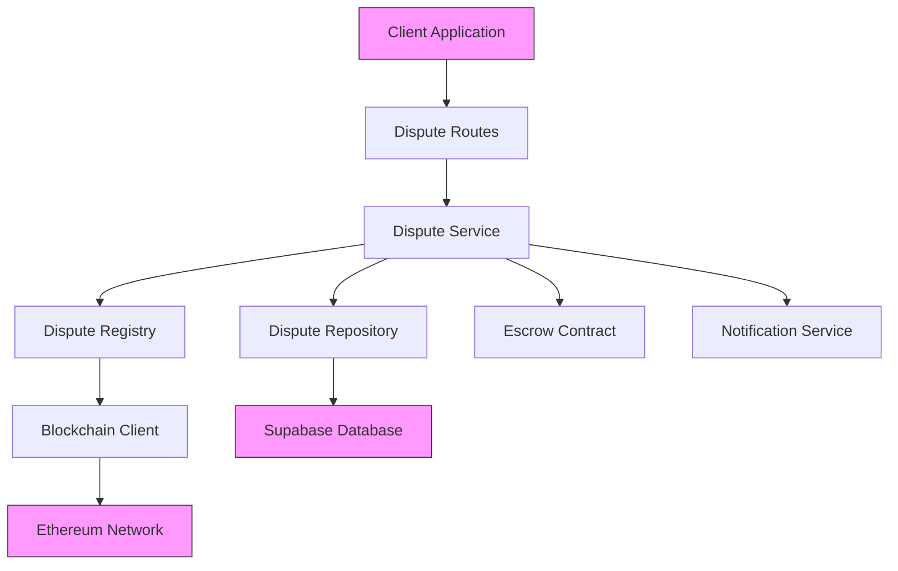
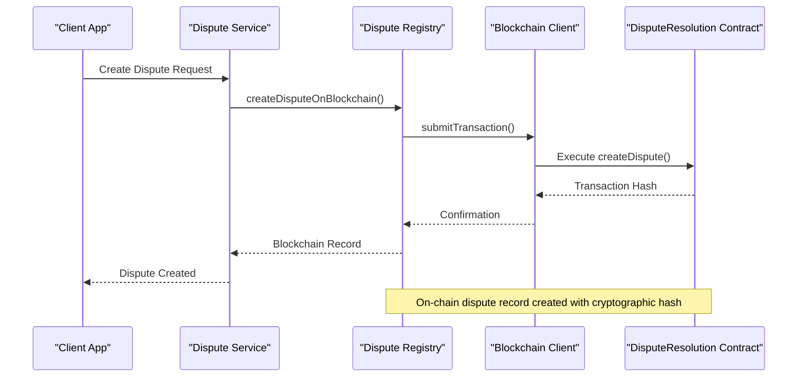
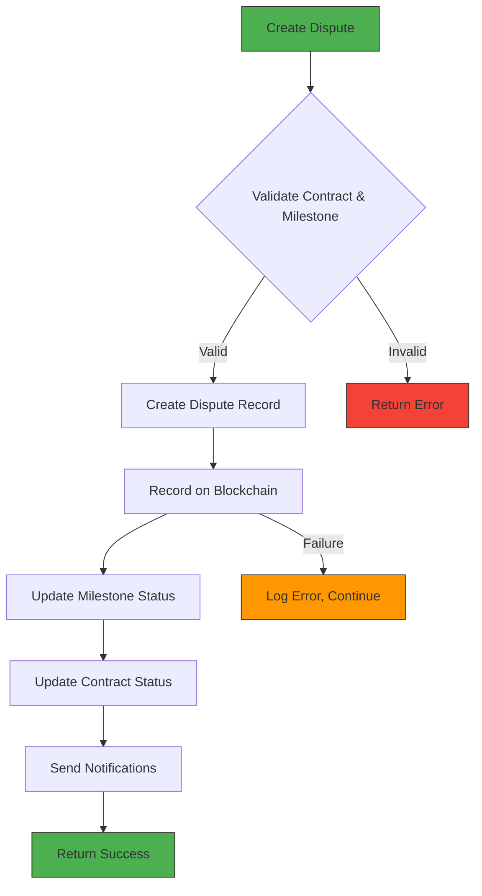
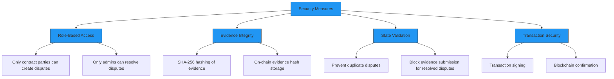
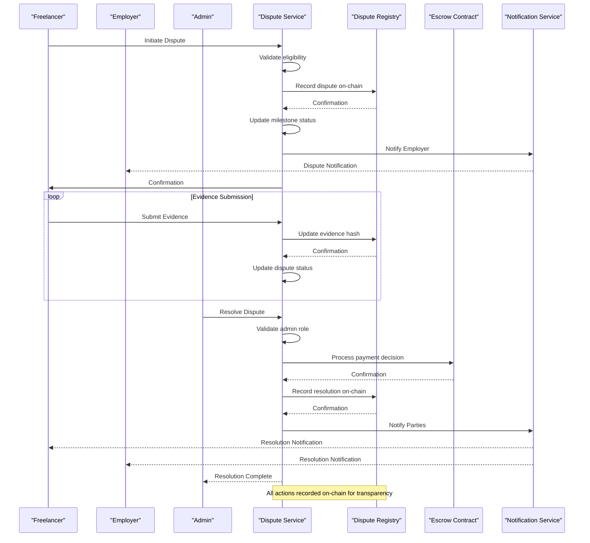
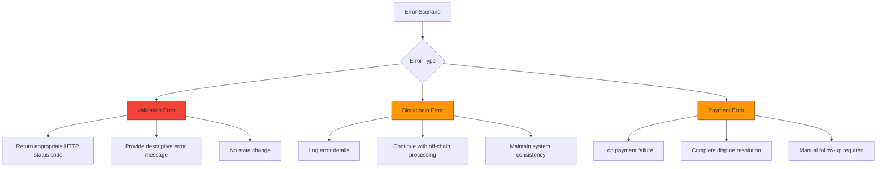

# Dispute Resolution

<cite>
**Referenced Files in This Document**   
- [DisputeResolution.sol](file://contracts/DisputeResolution.sol)
- [dispute-registry.ts](file://src/services/dispute-registry.ts)
- [dispute-service.ts](file://src/services/dispute-service.ts)
- [dispute-repository.ts](file://src/repositories/dispute-repository.ts)
- [dispute-routes.ts](file://src/routes/dispute-routes.ts)
- [entity-mapper.ts](file://src/utils/entity-mapper.ts)
- [blockchain-client.ts](file://src/services/blockchain-client.ts)
</cite>

## Table of Contents
1. [Introduction](#introduction)
2. [Dispute Lifecycle and States](#dispute-lifecycle-and-states)
3. [Core Components](#core-components)
4. [Dispute Resolution Contract](#dispute-resolution-contract)
5. [Dispute Registry Service](#dispute-registry-service)
6. [Dispute Service and Workflow Integration](#dispute-service-and-workflow-integration)
7. [Security and Access Control](#security-and-access-control)
8. [Dispute Initiation and Resolution Flows](#dispute-initiation-and-resolution-flows)
9. [Error Handling and Recovery](#error-handling-and-recovery)
10. [API Endpoints](#api-endpoints)

## Introduction

The decentralized dispute resolution mechanism provides a transparent and secure system for managing conflicts between freelancers and employers in the FreelanceXchain platform. This documentation details the architecture, implementation, and operation of the dispute resolution system, which combines on-chain smart contracts with off-chain services to ensure tamper-proof records and efficient dispute management. The system enables parties to initiate disputes, submit evidence, and receive binding resolutions while maintaining data integrity through blockchain technology.

## Dispute Lifecycle and States

The dispute resolution system implements a state machine that governs the lifecycle of disputes through three primary states: open, under review, and resolved. Each state transition follows specific rules to ensure proper dispute handling and prevent unauthorized modifications.

```mermaid
stateDiagram-v2
[*] --> Open
Open --> UnderReview : "Evidence submitted"
UnderReview --> Resolved : "Admin resolution"
Open --> Resolved : "Admin resolution"
Resolved --> [*]
state Open {
[*] --> open
note right
Initial state when dispute is created
Funds are locked in escrow
Parties can submit evidence
end note
}
state UnderReview {
[*] --> under_review
note right
State after first evidence submission
Active review period
Additional evidence can be submitted
end note
}
state Resolved {
[*] --> resolved
note right
Final state after admin decision
Funds released according to decision
No further modifications allowed
end note
}
```

**Diagram sources**
- [dispute-service.ts](file://src/services/dispute-service.ts#L135-L145)
- [dispute-repository.ts](file://src/repositories/dispute-repository.ts#L28-L30)

**Section sources**
- [dispute-service.ts](file://src/services/dispute-service.ts#L135-L145)
- [dispute-repository.ts](file://src/repositories/dispute-repository.ts#L28-L30)

## Core Components

The dispute resolution system consists of several interconnected components that work together to provide a comprehensive solution for conflict management. The architecture follows a layered approach with smart contracts handling on-chain operations, services managing business logic, and repositories handling data persistence.



**Diagram sources**
- [dispute-routes.ts](file://src/routes/dispute-routes.ts)
- [dispute-service.ts](file://src/services/dispute-service.ts)
- [dispute-registry.ts](file://src/services/dispute-registry.ts)
- [blockchain-client.ts](file://src/services/blockchain-client.ts)

**Section sources**
- [dispute-service.ts](file://src/services/dispute-service.ts)
- [dispute-registry.ts](file://src/services/dispute-registry.ts)
- [dispute-repository.ts](file://src/repositories/dispute-repository.ts)

## Dispute Resolution Contract

The DisputeResolution.sol smart contract serves as the on-chain component of the dispute resolution system, providing immutable records of dispute outcomes and ensuring transparency. The contract stores dispute records with cryptographic evidence hashes and emits events for all significant actions.

```mermaid
classDiagram
class DisputeResolution {
+address owner
+enum DisputeOutcome { Pending, FreelancerFavor, EmployerFavor, Split, Cancelled }
+struct DisputeRecord
+mapping(bytes32 => DisputeRecord) disputes
+mapping(address => bytes32[]) userDisputes
+mapping(address => uint256) disputesWon
+mapping(address => uint256) disputesLost
+event DisputeCreated
+event EvidenceSubmitted
+event DisputeResolved
+modifier onlyOwner()
+constructor()
+createDispute() void
+updateEvidence() void
+resolveDispute() void
+getDispute() returns DisputeRecord
+getUserDisputeStats() returns uint256
+isResolved() returns bool
}
class DisputeRecord {
+bytes32 disputeId
+bytes32 contractId
+bytes32 milestoneId
+bytes32 evidenceHash
+address initiator
+address freelancer
+address employer
+address arbiter
+uint256 amount
+DisputeOutcome outcome
+string reasoning
+uint256 createdAt
+uint256 resolvedAt
}
DisputeResolution --> DisputeRecord : "contains"
```

**Diagram sources**
- [DisputeResolution.sol](file://contracts/DisputeResolution.sol)

**Section sources**
- [DisputeResolution.sol](file://contracts/DisputeResolution.sol)

## Dispute Registry Service

The dispute-registry.ts service acts as an intermediary between the application layer and the blockchain, handling the recording of dispute-related transactions on-chain. This service ensures that all dispute actions are properly recorded with cryptographic integrity while abstracting the complexity of blockchain interactions from the rest of the application.



**Diagram sources**
- [dispute-registry.ts](file://src/services/dispute-registry.ts)
- [blockchain-client.ts](file://src/services/blockchain-client.ts)
- [DisputeResolution.sol](file://contracts/DisputeResolution.sol)

**Section sources**
- [dispute-registry.ts](file://src/services/dispute-registry.ts)
- [blockchain-client.ts](file://src/services/blockchain-client.ts)

## Dispute Service and Workflow Integration

The dispute-service.ts component orchestrates the complete dispute resolution workflow, integrating on-chain and off-chain operations. This service handles business logic validation, coordinates with the dispute registry for blockchain recording, and interfaces with other services for payment processing and notifications.



**Diagram sources**
- [dispute-service.ts](file://src/services/dispute-service.ts#L67-L206)
- [dispute-registry.ts](file://src/services/dispute-registry.ts#L69-L145)

**Section sources**
- [dispute-service.ts](file://src/services/dispute-service.ts#L67-L206)

## Security and Access Control

The dispute resolution system implements multiple security measures to protect against unauthorized access and ensure the integrity of dispute records. These include role-based access control, cryptographic evidence verification, and time-bound resolution periods.



**Diagram sources**
- [dispute-service.ts](file://src/services/dispute-service.ts#L82-L88)
- [dispute-service.ts](file://src/services/dispute-service.ts#L305-L311)
- [DisputeResolution.sol](file://contracts/DisputeResolution.sol#L39-L42)

**Section sources**
- [dispute-service.ts](file://src/services/dispute-service.ts#L82-L88)
- [DisputeResolution.sol](file://contracts/DisputeResolution.sol#L39-L42)

## Dispute Initiation and Resolution Flows

The dispute resolution system supports comprehensive workflows for both dispute initiation and resolution, handling both standard cases and edge conditions. These flows ensure that disputes are processed consistently and that all parties receive appropriate notifications.



**Diagram sources**
- [dispute-service.ts](file://src/services/dispute-service.ts)
- [dispute-registry.ts](file://src/services/dispute-registry.ts)
- [escrow-contract.ts](file://src/services/escrow-contract.ts)

**Section sources**
- [dispute-service.ts](file://src/services/dispute-service.ts)
- [dispute-registry.ts](file://src/services/dispute-registry.ts)

## Error Handling and Recovery

The dispute resolution system includes comprehensive error handling mechanisms to manage various failure scenarios, including blockchain transaction failures and validation errors. The system is designed to maintain consistency even when individual components fail.



**Diagram sources**
- [dispute-service.ts](file://src/services/dispute-service.ts#L171-L173)
- [dispute-service.ts](file://src/services/dispute-service.ts#L289-L290)
- [dispute-service.ts](file://src/services/dispute-service.ts#L385-L387)

**Section sources**
- [dispute-service.ts](file://src/services/dispute-service.ts#L171-L173)
- [dispute-service.ts](file://src/services/dispute-service.ts#L289-L290)

## API Endpoints

The dispute resolution system exposes a comprehensive REST API for interacting with disputes. These endpoints follow standard HTTP conventions and provide appropriate status codes and error responses for various scenarios.

```mermaid
graph TD
A[API Endpoints] --> B[POST /api/disputes]
A --> C[GET /api/disputes/{disputeId}]
A --> D[POST /api/disputes/{disputeId}/evidence]
A --> E[POST /api/disputes/{disputeId}/resolve]
A --> F[GET /api/contracts/{contractId}/disputes]
B --> G["Create new dispute"]
B --> H["201 Created on success"]
B --> I["400-409 on error"]
C --> J["Get dispute details"]
C --> K["200 OK on success"]
C --> L["404 Not Found if dispute doesn't exist"]
D --> M["Submit evidence"]
D --> N["200 OK on success"]
D --> O["403 if unauthorized"]
E --> P["Resolve dispute"]
E --> Q["200 OK on success"]
E --> R["403 if not admin"]
F --> S["List contract disputes"]
F --> T["200 OK with array"]
F --> U["403 if not party to contract"]
style A fill:#9C27B0,stroke:#333
style B fill:#9C27B0,stroke:#333
style C fill:#9C27B0,stroke:#333
style D fill:#9C27B0,stroke:#333
style E fill:#9C27B0,stroke:#333
style F fill:#9C27B0,stroke:#333
```

**Diagram sources**
- [dispute-routes.ts](file://src/routes/dispute-routes.ts)
- [dispute-service.ts](file://src/services/dispute-service.ts)

**Section sources**
- [dispute-routes.ts](file://src/routes/dispute-routes.ts)
- [dispute-service.ts](file://src/services/dispute-service.ts)