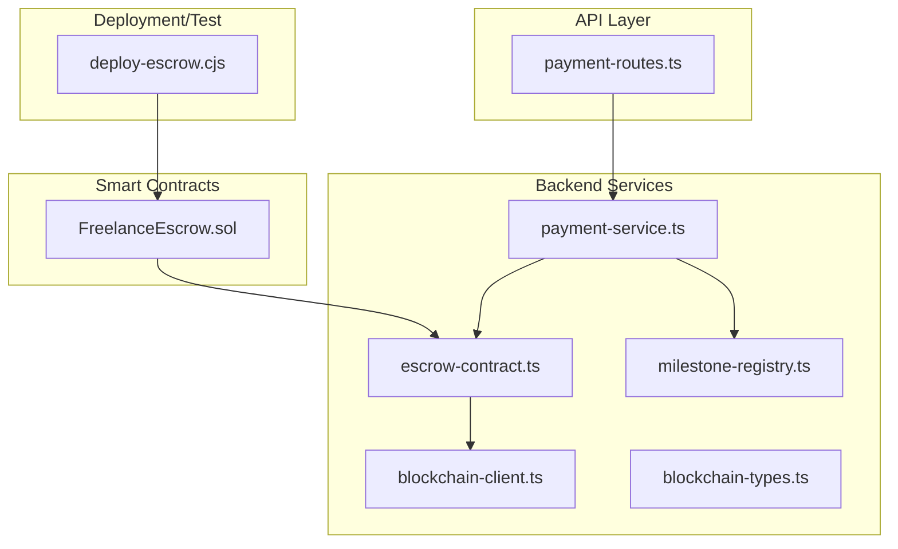
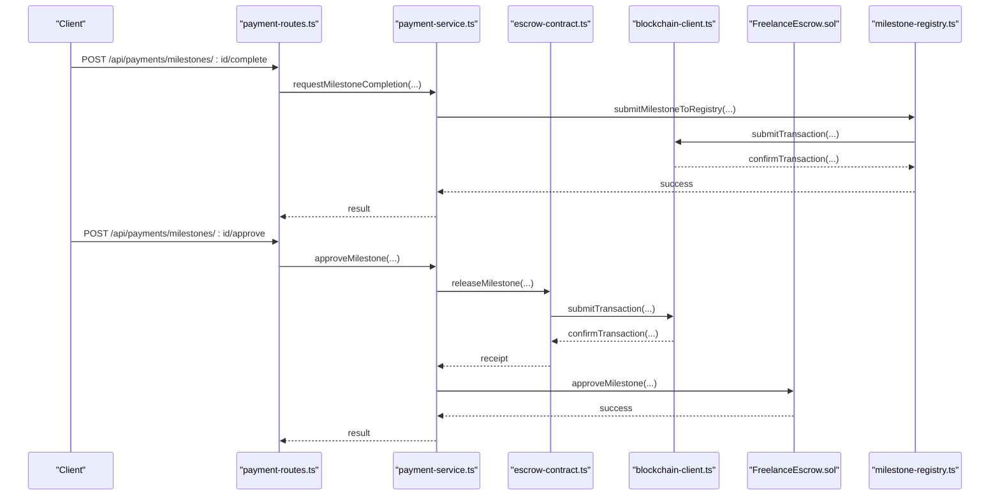
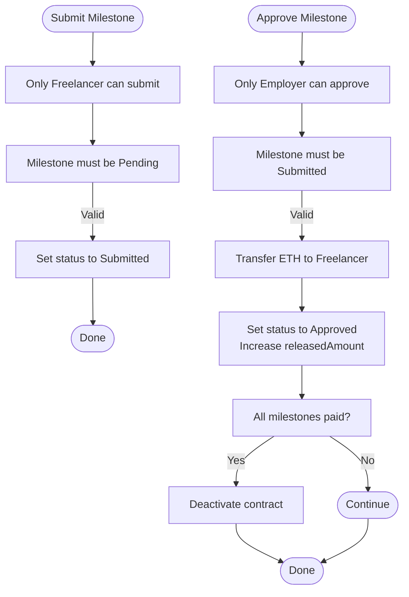
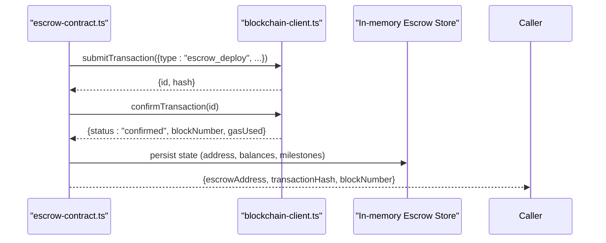
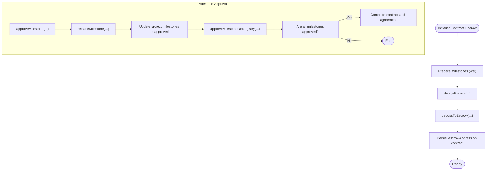
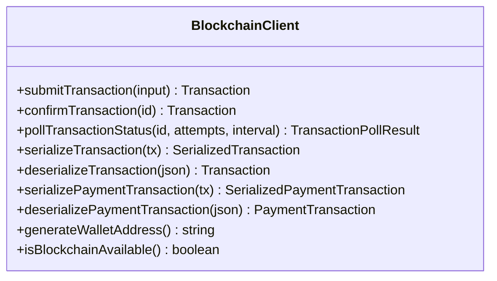
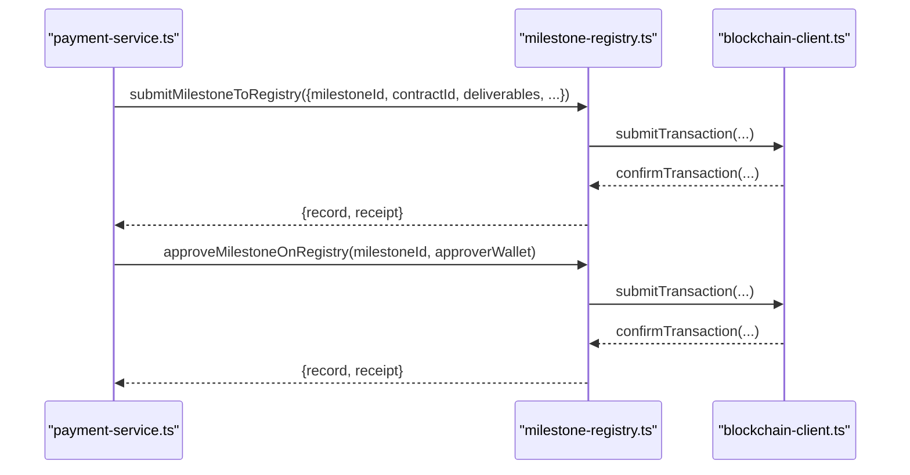
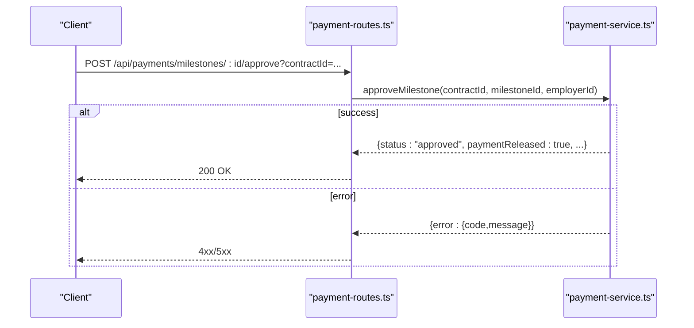
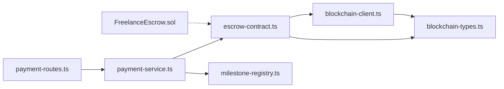

# Escrow System

<cite>
**Referenced Files in This Document**
- [FreelanceEscrow.sol](file://contracts/FreelanceEscrow.sol)
- [escrow-contract.ts](file://src/services/escrow-contract.ts)
- [payment-service.ts](file://src/services/payment-service.ts)
- [blockchain-client.ts](file://src/services/blockchain-client.ts)
- [blockchain-types.ts](file://src/services/blockchain-types.ts)
- [milestone-registry.ts](file://src/services/milestone-registry.ts)
- [payment-routes.ts](file://src/routes/payment-routes.ts)
- [deploy-escrow.cjs](file://scripts/deploy-escrow.cjs)
- [ARCHITECTURE.md](file://docs/ARCHITECTURE.md)
- [TECHNICAL-SPECS.md](file://docs/TECHNICAL-SPECS.md)
- [TESTING.md](file://docs/TESTING.md)
</cite>

## Table of Contents
1. [Introduction](#introduction)
2. [Project Structure](#project-structure)
3. [Core Components](#core-components)
4. [Architecture Overview](#architecture-overview)
5. [Detailed Component Analysis](#detailed-component-analysis)
6. [Dependency Analysis](#dependency-analysis)
7. [Performance Considerations](#performance-considerations)
8. [Troubleshooting Guide](#troubleshooting-guide)
9. [Conclusion](#conclusion)
10. [Appendices](#appendices)

## Introduction
This document explains the architecture and integration of the FreelanceEscrow smart contract and its backend service layer. It covers how the contract securely holds funds during freelance engagements, the milestone-based payment flow, fund locking conditions, and withdrawal validation logic. It also documents the TypeScript escrow-contract service that interfaces with the contract using a simulated blockchain client, transaction construction, confirmation polling, and event-like notifications. Finally, it outlines security considerations, backend integration patterns, and testing strategies for escrow workflows.

## Project Structure
The escrow system spans Solidity smart contracts, a backend service layer, and API routes:
- Smart contracts define the escrow logic and lifecycle.
- A backend service layer simulates blockchain interactions and orchestrates escrow operations.
- API routes expose milestone completion, approval, dispute, and status endpoints.
- Scripts demonstrate deployment and end-to-end testing.

**Diagram sources**
- [FreelanceEscrow.sol](file://contracts/FreelanceEscrow.sol#L1-L264)
- [payment-service.ts](file://src/services/payment-service.ts#L1-L643)
- [escrow-contract.ts](file://src/services/escrow-contract.ts#L1-L327)
- [blockchain-client.ts](file://src/services/blockchain-client.ts#L1-L293)
- [blockchain-types.ts](file://src/services/blockchain-types.ts#L1-L115)
- [milestone-registry.ts](file://src/services/milestone-registry.ts#L1-L276)
- [payment-routes.ts](file://src/routes/payment-routes.ts#L1-L426)
- [deploy-escrow.cjs](file://scripts/deploy-escrow.cjs#L1-L125)

**Section sources**
- [ARCHITECTURE.md](file://docs/ARCHITECTURE.md#L1-L218)
- [TECHNICAL-SPECS.md](file://docs/TECHNICAL-SPECS.md#L1-L570)

## Core Components
- FreelanceEscrow (Solidity): Holds funds, tracks milestones, enforces access controls, and emits lifecycle events.
- payment-service: Orchestrates milestone lifecycle, interacts with escrow and registry services, and updates domain state.
- escrow-contract (TypeScript): Simulates blockchain operations for escrow deployment, deposits, milestone releases, and refunds.
- blockchain-client (TypeScript): Provides transaction submission, confirmation polling, and serialization utilities.
- milestone-registry (TypeScript): Records milestone submissions and approvals on-chain for verifiable work history.
- payment-routes (Express): Exposes REST endpoints for milestone completion, approval, dispute, and status.

**Section sources**
- [FreelanceEscrow.sol](file://contracts/FreelanceEscrow.sol#L1-L264)
- [payment-service.ts](file://src/services/payment-service.ts#L1-L643)
- [escrow-contract.ts](file://src/services/escrow-contract.ts#L1-L327)
- [blockchain-client.ts](file://src/services/blockchain-client.ts#L1-L293)
- [milestone-registry.ts](file://src/services/milestone-registry.ts#L1-L276)
- [payment-routes.ts](file://src/routes/payment-routes.ts#L1-L426)

## Architecture Overview
The system integrates off-chain orchestration with on-chain security:
- Off-chain: Express routes trigger payment-service, which coordinates escrow and registry operations.
- On-chain: FreelanceEscrow manages funds and milestone states; milestone-registry records verifiable milestones.
- Simulation: blockchain-client simulates transaction submission and confirmation for development/testing.

**Diagram sources**
- [payment-routes.ts](file://src/routes/payment-routes.ts#L1-L426)
- [payment-service.ts](file://src/services/payment-service.ts#L1-L643)
- [escrow-contract.ts](file://src/services/escrow-contract.ts#L1-L327)
- [blockchain-client.ts](file://src/services/blockchain-client.ts#L1-L293)
- [milestone-registry.ts](file://src/services/milestone-registry.ts#L1-L276)
- [FreelanceEscrow.sol](file://contracts/FreelanceEscrow.sol#L1-L264)

## Detailed Component Analysis

### FreelanceEscrow Smart Contract
- Roles and access control:
  - employer, freelancer, arbiter roles with dedicated modifiers.
  - contractActive modifier prevents operations on inactive contracts.
- Milestone lifecycle:
  - submitMilestone: only freelancer; transitions to Submitted.
  - approveMilestone: only employer; transfers ETH to freelancer and marks Approved.
  - disputeMilestone: either party; transitions to Disputed.
  - resolveDispute: arbiter; either Approve (freelancer) or Refund (employer).
  - refundMilestone: employer; refunds Pending milestone.
  - cancelContract: employer; refunds remaining balance and deactivates.
- Security:
  - nonReentrant modifier protects sensitive payment functions.
  - Input validation and state checks on all operations.
- Events:
  - FundsDeposited, MilestoneSubmitted, MilestoneApproved, MilestoneDisputed, MilestoneRefunded, DisputeResolved, ContractCompleted, ContractCancelled.

**Diagram sources**
- [FreelanceEscrow.sol](file://contracts/FreelanceEscrow.sol#L124-L207)

**Section sources**
- [FreelanceEscrow.sol](file://contracts/FreelanceEscrow.sol#L1-L264)

### Escrow Contract Service (TypeScript)
- Responsibilities:
  - Deploy escrow: generates a mock address, submits deployment transaction, confirms, and stores state.
  - Deposit funds: validates caller, submits deposit transaction, confirms, and updates balance.
  - Release milestone: validates approver, milestone state, sufficient balance, submits release transaction, confirms, and updates state.
  - Refund milestone: validates resolver, milestone state, sufficient balance, submits refund transaction, confirms, and updates state.
  - Query helpers: getEscrowBalance, getEscrowState, getMilestoneStatus, areAllMilestonesReleased, getEscrowByContractId.
- Transaction lifecycle:
  - Uses submitTransaction and confirmTransaction from blockchain-client.
  - Maintains in-memory state for simulation.

**Diagram sources**
- [escrow-contract.ts](file://src/services/escrow-contract.ts#L1-L120)
- [blockchain-client.ts](file://src/services/blockchain-client.ts#L131-L255)

**Section sources**
- [escrow-contract.ts](file://src/services/escrow-contract.ts#L1-L327)
- [blockchain-client.ts](file://src/services/blockchain-client.ts#L1-L293)
- [blockchain-types.ts](file://src/services/blockchain-types.ts#L1-L115)

### Payment Service Orchestration
- Initializes escrow on contract creation: deploys escrow, deposits funds, and persists escrow address.
- Milestone completion: updates project state to “submitted” and submits milestone to registry.
- Milestone approval: releases payment via escrow-contract service, updates project state, approves on registry, and completes contract/agreement if all approved.
- Dispute handling: creates a dispute record, sets milestone to “disputed,” and updates contract status.
- Status reporting: aggregates totals and milestone statuses for a contract.

**Diagram sources**
- [payment-service.ts](file://src/services/payment-service.ts#L590-L642)
- [escrow-contract.ts](file://src/services/escrow-contract.ts#L134-L199)
- [milestone-registry.ts](file://src/services/milestone-registry.ts#L137-L186)

**Section sources**
- [payment-service.ts](file://src/services/payment-service.ts#L1-L643)

### Blockchain Client Utilities
- Transaction submission: generates IDs, hashes, signs (simulated), and stores pending transactions.
- Confirmation polling: simulates confirmation timing and returns receipts.
- Serialization/deserialization: converts bigints to strings for JSON transport.
- Configuration and availability checks.

**Diagram sources**
- [blockchain-client.ts](file://src/services/blockchain-client.ts#L1-L293)
- [blockchain-types.ts](file://src/services/blockchain-types.ts#L1-L115)

**Section sources**
- [blockchain-client.ts](file://src/services/blockchain-client.ts#L1-L293)
- [blockchain-types.ts](file://src/services/blockchain-types.ts#L1-L115)

### Milestone Registry Service
- Submits milestone with hashes for deliverables and metadata.
- Approves milestones and updates status and timestamps.
- Tracks freelancer stats and portfolio.
- Provides verification of work hashes.

**Diagram sources**
- [milestone-registry.ts](file://src/services/milestone-registry.ts#L60-L186)
- [payment-service.ts](file://src/services/payment-service.ts#L150-L174)

**Section sources**
- [milestone-registry.ts](file://src/services/milestone-registry.ts#L1-L276)

### API Integration
- Routes:
  - POST /api/payments/milestones/:milestoneId/complete
  - POST /api/payments/milestones/:milestoneId/approve
  - POST /api/payments/milestones/:milestoneId/dispute
  - GET /api/payments/contracts/:contractId/status
- Middleware: authentication and UUID validation.
- Error handling: maps service errors to HTTP status codes.

**Diagram sources**
- [payment-routes.ts](file://src/routes/payment-routes.ts#L1-L426)
- [payment-service.ts](file://src/services/payment-service.ts#L196-L352)

**Section sources**
- [payment-routes.ts](file://src/routes/payment-routes.ts#L1-L426)

## Dependency Analysis
- payment-service depends on:
  - escrow-contract for blockchain operations.
  - milestone-registry for verifiable milestone records.
  - repositories and notification-service for domain updates and notifications.
- escrow-contract depends on:
  - blockchain-client for transaction submission and confirmation.
  - blockchain-types for type safety.
- blockchain-client is a standalone utility with in-memory persistence for simulation.
- FreelanceEscrow is independent and accessed via scripts or a real blockchain client in production.

**Diagram sources**
- [payment-routes.ts](file://src/routes/payment-routes.ts#L1-L426)
- [payment-service.ts](file://src/services/payment-service.ts#L1-L643)
- [escrow-contract.ts](file://src/services/escrow-contract.ts#L1-L327)
- [blockchain-client.ts](file://src/services/blockchain-client.ts#L1-L293)
- [blockchain-types.ts](file://src/services/blockchain-types.ts#L1-L115)
- [FreelanceEscrow.sol](file://contracts/FreelanceEscrow.sol#L1-L264)

**Section sources**
- [payment-service.ts](file://src/services/payment-service.ts#L1-L643)
- [escrow-contract.ts](file://src/services/escrow-contract.ts#L1-L327)
- [blockchain-client.ts](file://src/services/blockchain-client.ts#L1-L293)

## Performance Considerations
- Transaction confirmation latency: simulation uses short delays; production uses real RPC with typical Ethereum confirmation times.
- Gas optimization: keep transactions small; batch operations where feasible.
- State updates: minimize repeated reads/writes; cache frequently accessed data.
- Event-driven notifications: defer heavy operations to background jobs if scaling.

[No sources needed since this section provides general guidance]

## Troubleshooting Guide
Common issues and resolutions:
- Transaction not found or failed:
  - Use pollTransactionStatus to verify status and inspect error messages.
  - confirmTransaction forces confirmation in simulations; use failTransaction to simulate failures.
- Unauthorized operations:
  - Ensure only employer/freelancer/arbitrator invoke respective functions.
  - Verify contractActive modifier is satisfied.
- Insufficient funds:
  - Escrow balance must cover milestone amount before release/refund.
- Duplicate submissions:
  - Milestone registry prevents duplicate submissions; ensure unique hashes.

**Section sources**
- [blockchain-client.ts](file://src/services/blockchain-client.ts#L181-L255)
- [escrow-contract.ts](file://src/services/escrow-contract.ts#L134-L264)
- [FreelanceEscrow.sol](file://contracts/FreelanceEscrow.sol#L124-L239)

## Conclusion
The escrow system combines a secure Solidity contract with a robust backend orchestration layer. The FreelanceEscrow contract enforces access control and reentrancy protections, while the TypeScript services simulate blockchain interactions and coordinate milestone lifecycle events. The API exposes clear endpoints for clients, and the deployment script demonstrates end-to-end testing. Together, these components provide a secure, verifiable, and scalable foundation for milestone-based payments.

[No sources needed since this section summarizes without analyzing specific files]

## Appendices

### Example Workflows

- Deploy and fund escrow:
  - Use the deployment script to deploy FreelanceEscrow with milestones and initial funding.
  - Verify deployed address and milestone details.

- Release a milestone:
  - Employer invokes approveMilestone via payment-service.
  - The service calls releaseMilestone on escrow-contract, which submits and confirms a transaction.
  - The contract transfers ETH to the freelancer and emits events.

- Dispute and resolution:
  - Either party invokes disputeMilestone; the contract marks the milestone as Disputed.
  - Arbiter resolves via resolveDispute; either Approve (freelancer) or Refund (employer).

**Section sources**
- [deploy-escrow.cjs](file://scripts/deploy-escrow.cjs#L1-L125)
- [payment-service.ts](file://src/services/payment-service.ts#L196-L352)
- [escrow-contract.ts](file://src/services/escrow-contract.ts#L134-L264)
- [FreelanceEscrow.sol](file://contracts/FreelanceEscrow.sol#L124-L239)

### Security Considerations
- Reentrancy protection: nonReentrant modifier on payment functions.
- Authorization: onlyEmployer, onlyFreelancer, onlyArbiter, onlyParties modifiers.
- Input validation: index bounds, status checks, and amount sufficiency.
- Timeout safeguards: simulation uses bounded polling; production should enforce deadlines at the application level.
- Event listening: monitor emitted events to drive off-chain state updates.

**Section sources**
- [FreelanceEscrow.sol](file://contracts/FreelanceEscrow.sol#L46-L83)
- [TECHNICAL-SPECS.md](file://docs/TECHNICAL-SPECS.md#L406-L411)

### Backend Interaction Patterns
- Use payment-routes to trigger milestone operations.
- payment-service coordinates escrow and registry operations.
- escrow-contract encapsulates transaction submission and confirmation.
- blockchain-client abstracts transaction lifecycle and serialization.

**Section sources**
- [payment-routes.ts](file://src/routes/payment-routes.ts#L1-L426)
- [payment-service.ts](file://src/services/payment-service.ts#L1-L643)
- [escrow-contract.ts](file://src/services/escrow-contract.ts#L1-L327)
- [blockchain-client.ts](file://src/services/blockchain-client.ts#L1-L293)

### Testing Strategies
- Unit tests: service-layer logic with mocked repositories and blockchain-client.
- Integration tests: route-level tests verifying end-to-end flows.
- Smart contract tests: Hardhat-based tests for FreelanceEscrow and FreelanceReputation.
- Property-based tests: validate with random inputs and edge cases.
- CI pipeline: automated test runs on push/pull requests.

**Section sources**
- [TESTING.md](file://docs/TESTING.md#L1-L281)
- [TECHNICAL-SPECS.md](file://docs/TECHNICAL-SPECS.md#L468-L570)