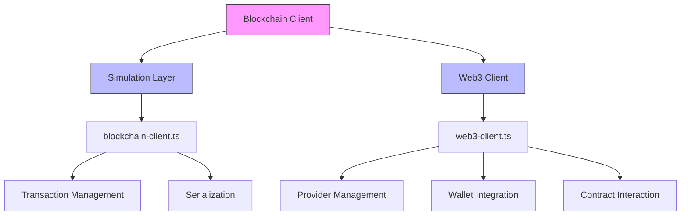
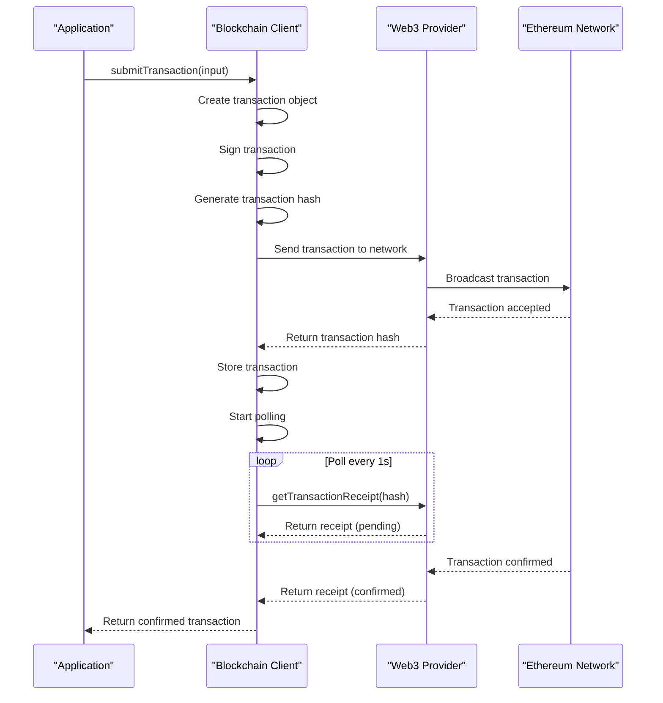
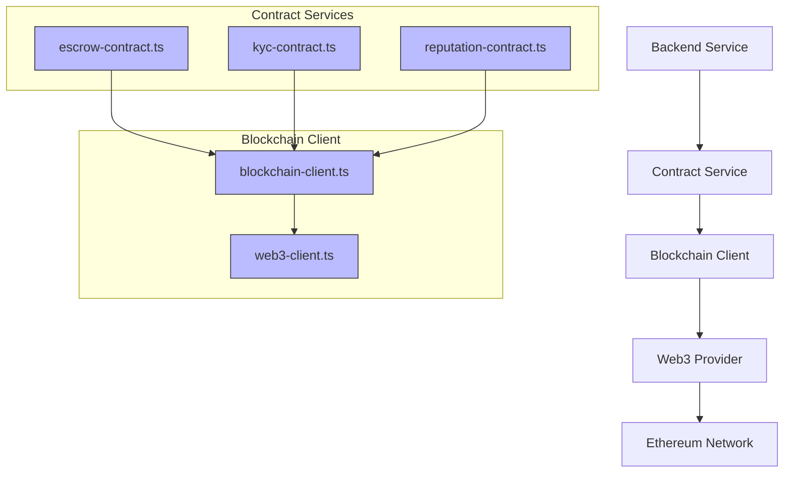
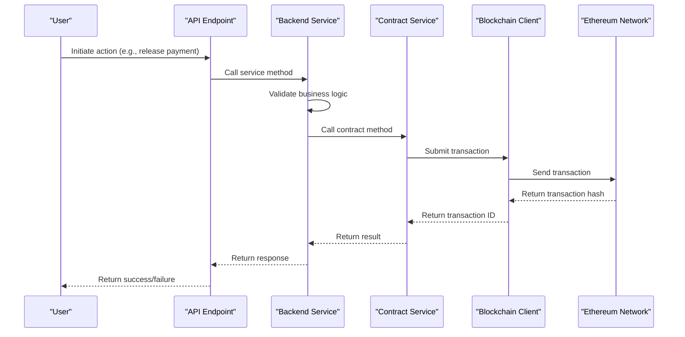
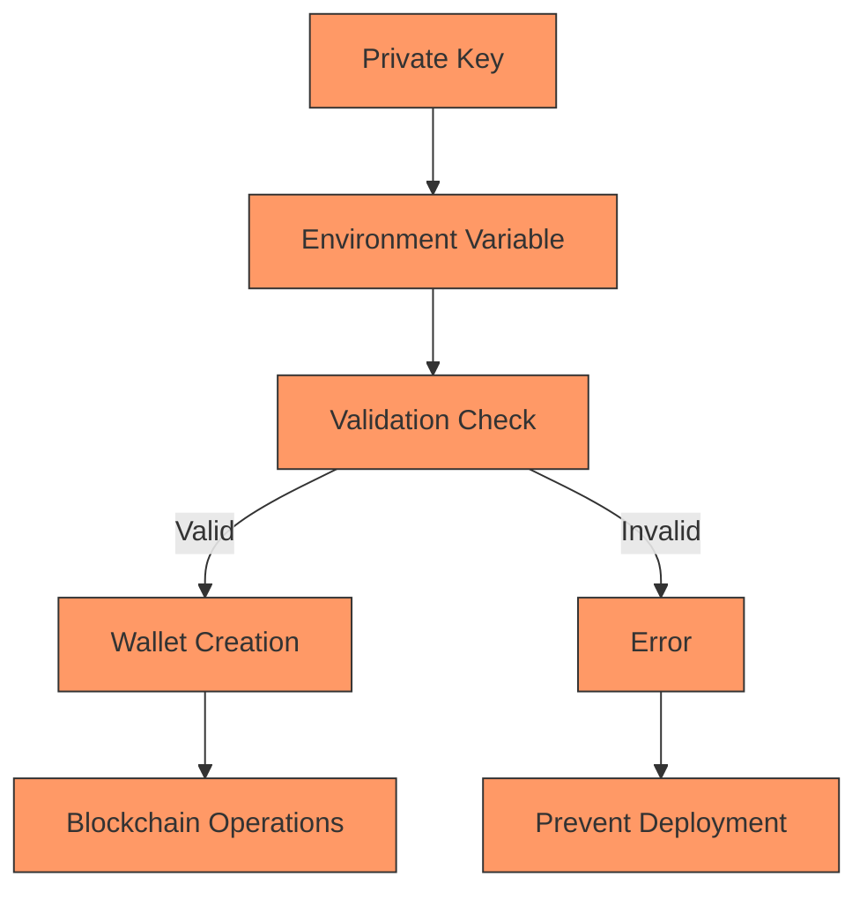
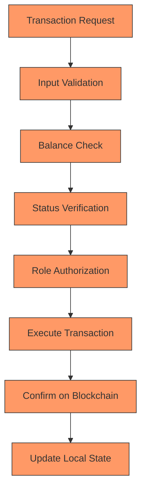

# Blockchain Integration

## Table of Contents
1. [Introduction](#introduction)
2. [Smart Contract Architecture](#smart-contract-architecture)
3. [Core Smart Contracts](#core-smart-contracts)
4. [Blockchain Client Implementation](#blockchain-client-implementation)
5. [Backend Integration Pattern](#backend-integration-pattern)
6. [Setup](#setup)
7. [Usage](#usage)
8. [Network Configuration](#network-configuration)
9. [Security Considerations](#security-considerations)
10. [Troubleshooting](#troubleshooting)
11. [Migration from Simulated to Real Blockchain](#migration-from-simulated-to-real-blockchain)
12. [Conclusion](#conclusion)

## Introduction

The FreelanceXchain platform leverages blockchain technology to create a trustless, transparent, and secure environment for freelance transactions. This documentation details the blockchain integration architecture, focusing on the smart contract ecosystem, TypeScript client implementation, and integration patterns between backend services and the Ethereum blockchain. The system is designed to handle secure fund holding, reputation management, identity verification, dispute resolution, milestone tracking, and formal agreements through a suite of interconnected smart contracts.

The blockchain integration connects the FreelanceXchain API to Ethereum-compatible blockchains (Sepolia, Polygon, Ganache, etc.) to store critical data immutably on-chain:

- **Reputation System**: Ratings and reviews stored on-chain
- **Escrow Contracts**: Milestone-based payment escrow
- **Contract Agreements**: Immutable contract terms and signatures
- **Dispute Resolution**: On-chain dispute handling
- **Milestone Registry**: Project milestone tracking

## Smart Contract Architecture

The blockchain architecture of FreelanceXchain consists of six core smart contracts that work together to provide a comprehensive decentralized freelance marketplace. These contracts are designed with modularity in mind, allowing each component to handle specific aspects of the platform's functionality while maintaining interoperability through Ethereum events and function calls.

```mermaid
graph TB
subgraph "Smart Contracts"
A[ContractAgreement]
B[FreelanceEscrow]
C[FreelanceReputation]
D[KYCVerification]
E[DisputeResolution]
F[MilestoneRegistry]
end
A --> B: "Triggers escrow deployment"
B --> E: "Emits dispute events"
B --> F: "Records milestone completions"
C --> B: "Influences escrow terms"
D --> B: "Verifies participant identity"
E --> C: "Updates reputation based on outcomes"
F --> C: "Provides work history for reputation"
style A fill:#f9f,stroke:#333
style B fill:#f9f,stroke:#333
style C fill:#f9f,stroke:#333
style D fill:#f9f,stroke:#333
style E fill:#f9f,stroke:#333
style F fill:#f9f,stroke:#333
```

## Core Smart Contracts

### FreelanceEscrow Contract

The FreelanceEscrow contract serves as the financial backbone of the platform, securely holding funds in escrow and releasing them according to milestone completion. It implements a reentrancy guard to prevent common security vulnerabilities and uses modifiers to enforce role-based access control for employers, freelancers, and arbiters.

```mermaid
classDiagram
class FreelanceEscrow {
+address employer
+address freelancer
+address arbiter
+uint256 totalAmount
+uint256 releasedAmount
+bool isActive
+string contractId
+getMilestoneCount() uint256
+getMilestone(uint256) (uint256, MilestoneStatus, string)
+getBalance() uint256
+getRemainingAmount() uint256
}
class Milestone {
+uint256 amount
+MilestoneStatus status
+string description
}
enum MilestoneStatus {
Pending
Submitted
Approved
Disputed
Refunded
}
FreelanceEscrow --> Milestone : "has multiple"
FreelanceEscrow --> MilestoneStatus : "uses"
note right of FreelanceEscrow
Manages milestone-based payments
Implements reentrancy protection
Handles dispute resolution
end note
```

### FreelanceReputation Contract

The FreelanceReputation contract provides an immutable on-chain reputation system that stores ratings and reviews. It prevents duplicate ratings per contract through cryptographic hashing and maintains aggregate scores for efficient reputation calculation.

```mermaid
classDiagram
class FreelanceReputation {
+address owner
+totalScore[address] uint256
+ratingCount[address] uint256
+ratingExists[bytes32] bool
+getAverageRating(address) uint256
+getRatingCount(address) uint256
+getTotalRatings() uint256
+hasRated(address, address, string) bool
}
class Rating {
+address rater
+address ratee
+uint8 score
+string comment
+string contractId
+uint256 timestamp
+bool isEmployerRating
}
FreelanceReputation --> Rating : "stores"
FreelanceReputation --> Rating : "indexes by user"
note right of FreelanceReputation
Immutable reputation records
Prevents duplicate ratings
Caches aggregate scores
end note
```

### KYCVerification Contract

The KYCVerification contract stores verification status on-chain while maintaining GDPR compliance by only storing hashes of personal data. It implements tiered verification levels and automatic expiration of credentials.

```mermaid
classDiagram
class KYCVerification {
+address owner
+address verifier
+verifications[address] Verification
+userIdToWallet[bytes32] address
+isVerified(address) (bool, KycTier)
+getVerification(address) Verification
+getWalletByUserId(bytes32) address
+setVerifier(address) void
}
class Verification {
+VerificationStatus status
+KycTier tier
+bytes32 dataHash
+uint256 verifiedAt
+uint256 expiresAt
+address verifiedBy
+string rejectionReason
}
enum VerificationStatus {
None
Pending
Approved
Rejected
Expired
}
enum KycTier {
None
Basic
Standard
Enhanced
}
KYCVerification --> Verification : "maps to"
KYCVerification --> VerificationStatus : "uses"
KYCVerification --> KycTier : "uses"
note right of KYCVerification
GDPR-compliant design
Stores only verification status and hashes
Supports tiered verification levels
end note
```

### DisputeResolution Contract

The DisputeResolution contract creates an immutable record of arbitration decisions, providing transparency and accountability in conflict management.

```mermaid
classDiagram
class DisputeResolution {
+address owner
+disputes[bytes32] DisputeRecord
+userDisputes[address] bytes32[]
+disputesWon[address] uint256
+disputesLost[address] uint256
+createDispute(bytes32, ...) void
+updateEvidence(bytes32, bytes32) void
+resolveDispute(bytes32, ...) void
+getDispute(bytes32) DisputeRecord
+getUserDisputeStats(address) (uint256, uint256, uint256)
}
class DisputeRecord {
+bytes32 disputeId
+bytes32 contractId
+bytes32 milestoneId
+bytes32 evidenceHash
+address initiator
+address freelancer
+address employer
+address arbiter
+uint256 amount
+DisputeOutcome outcome
+string reasoning
+uint256 createdAt
+uint256 resolvedAt
}
enum DisputeOutcome {
Pending
FreelancerFavor
EmployerFavor
Split
Cancelled
}
DisputeResolution --> DisputeRecord : "stores"
DisputeResolution --> DisputeOutcome : "uses"
note right of DisputeResolution
Immutable dispute records
Tracks dispute outcomes
Maintains win/loss statistics
end note
```

### MilestoneRegistry Contract

The MilestoneRegistry contract records milestone completions on-chain, creating verifiable proof of work history for freelancers.

```mermaid
classDiagram
class MilestoneRegistry {
+address owner
+milestones[bytes32] MilestoneRecord
+freelancerMilestones[address] bytes32[]
+completedCount[address] uint256
+totalEarned[address] uint256
+submitMilestone(bytes32, ...) void
+approveMilestone(bytes32) void
+rejectMilestone(bytes32, string) void
+getMilestone(bytes32) MilestoneRecord
+getFreelancerStats(address) (uint256, uint256, uint256)
+verifyWorkHash(bytes32, bytes32) bool
}
class MilestoneRecord {
+bytes32 contractId
+bytes32 milestoneId
+bytes32 workHash
+address freelancer
+address employer
+uint256 amount
+MilestoneStatus status
+uint256 submittedAt
+uint256 completedAt
+string title
}
enum MilestoneStatus {
Submitted
Approved
Rejected
Disputed
}
MilestoneRegistry --> MilestoneRecord : "stores"
MilestoneRegistry --> MilestoneStatus : "uses"
note right of MilestoneRegistry
Verifiable work history
Immutable proof of completion
Portfolio tracking for freelancers
end note
```

### ContractAgreement Contract

The ContractAgreement contract stores agreement signatures and terms hashes on-chain, creating immutable proof that both parties agreed to specific terms.

```mermaid
classDiagram
class ContractAgreement {
+address owner
+agreements[bytes32] Agreement
+userAgreements[address] bytes32[]
+createAgreement(bytes32, ...) void
+signAgreement(bytes32) void
+completeAgreement(bytes32) void
+disputeAgreement(bytes32) void
+cancelAgreement(bytes32) void
+getAgreement(bytes32) Agreement
+isFullySigned(bytes32) bool
+verifyTerms(bytes32, bytes32) bool
}
class Agreement {
+bytes32 contractId
+bytes32 termsHash
+address employer
+address freelancer
+uint256 totalAmount
+uint256 milestoneCount
+AgreementStatus status
+uint256 employerSignedAt
+uint256 freelancerSignedAt
+uint256 createdAt
}
enum AgreementStatus {
Pending
Signed
Completed
Disputed
Cancelled
}
ContractAgreement --> Agreement : "stores"
ContractAgreement --> AgreementStatus : "uses"
note right of ContractAgreement
Immutable agreement records
Tracks signature status
Verifies terms integrity
end note
```

## Blockchain Client Implementation

The TypeScript blockchain client implementation provides a comprehensive interface for interacting with the Ethereum blockchain using ethers.js. It consists of two main components: a simulation layer for development and testing, and a production-ready Web3 client for mainnet interactions.



### Transaction Flow

The transaction flow in the blockchain client follows a standardized pattern for creating, submitting, and confirming transactions on the Ethereum network.



### Service Integration

The service layer provides specialized interfaces for interacting with each smart contract, abstracting the complexity of direct blockchain interactions.



## Backend Integration Pattern

The integration between backend services and smart contracts follows a pattern where the backend acts as an intermediary, handling business logic and user authentication while delegating blockchain operations to specialized services.



## Setup

### 1. Install Dependencies

Dependencies are already included in `package.json`:
- `ethers` - Ethereum library for blockchain interaction
- `hardhat` - Smart contract development environment

### 2. Configure Environment Variables

Copy `.env.example` to `.env` and configure:

```bash
# Blockchain RPC URL (choose one)
BLOCKCHAIN_RPC_URL=https://sepolia.infura.io/v3/your-infura-project-id
# or for local development:
# BLOCKCHAIN_RPC_URL=http://127.0.0.1:7545

# Private key for deploying contracts and signing transactions
BLOCKCHAIN_PRIVATE_KEY=your-private-key-here

# Contract addresses (filled after deployment)
GANACHE_REPUTATION_ADDRESS=0x...
GANACHE_AGREEMENT_ADDRESS=0x...
# ... etc
```

### 3. Compile Smart Contracts

```bash
cd FreelanceXchain-api
pnpm compile
```

This compiles the Solidity contracts and generates ABIs in the `artifacts/` directory.

### 4. Deploy Smart Contracts

Deploy to your chosen network:

```bash
# Make sure your .env is configured with BLOCKCHAIN_RPC_URL and BLOCKCHAIN_PRIVATE_KEY
# Then deploy:
pnpm deploy:contracts
```

For local Ganache testing, set in your `.env`:
```bash
BLOCKCHAIN_RPC_URL=http://127.0.0.1:7545
BLOCKCHAIN_PRIVATE_KEY=<your-ganache-private-key>
```

The deployment script will:
1. Deploy all smart contracts
2. Display contract addresses
3. Save addresses to the configuration
4. Show environment variables to add to `.env`

**Important**: Copy the displayed contract addresses to your `.env` file!

## Usage

### Reputation System

```typescript
import {
  submitRatingToBlockchain,
  getRatingsFromBlockchain,
  getAverageRating,
} from './services/reputation-blockchain.js';

// Submit a rating
const result = await submitRatingToBlockchain({
  contractId: 'contract-123',
  rateeAddress: '0x742d35Cc6634C0532925a3b844Bc9e7595f0bEb',
  rating: 5,
  comment: 'Excellent work!',
  isEmployerRating: true,
});

console.log('Rating submitted:', result.transactionHash);

// Get user ratings
const ratings = await getRatingsFromBlockchain('0x742d35Cc6634C0532925a3b844Bc9e7595f0bEb');

// Get average rating
const avgRating = await getAverageRating('0x742d35Cc6634C0532925a3b844Bc9e7595f0bEb');
console.log('Average rating:', avgRating); // e.g., 4.75
```

### Escrow System

```typescript
import {
  deployEscrowContract,
  submitMilestone,
  approveMilestone,
  getEscrowInfo,
} from './services/escrow-blockchain.js';
import { parseEther } from 'ethers';

// Deploy escrow contract
const escrow = await deployEscrowContract({
  contractId: 'contract-123',
  freelancerAddress: '0x...',
  arbiterAddress: '0x...',
  milestoneAmounts: [parseEther('1.0'), parseEther('2.0')],
  milestoneDescriptions: ['Design phase', 'Development phase'],
  totalAmount: parseEther('3.0'),
});

console.log('Escrow deployed at:', escrow.escrowAddress);

// Freelancer submits milestone
await submitMilestone(escrow.escrowAddress, 0);

// Employer approves and releases payment
await approveMilestone(escrow.escrowAddress, 0);

// Get escrow info
const info = await getEscrowInfo(escrow.escrowAddress);
console.log('Released amount:', info.releasedAmount);
```

### Agreement System

```typescript
import {
  createAgreementOnBlockchain,
  signAgreement,
  getAgreementFromBlockchain,
} from './services/agreement-blockchain.js';
import { parseEther } from 'ethers';

// Create agreement (employer)
const agreement = await createAgreementOnBlockchain({
  contractId: 'contract-123',
  employerWallet: '0x...',
  freelancerWallet: '0x...',
  totalAmount: parseEther('5.0'),
  milestoneCount: 3,
  terms: {
    projectTitle: 'Website Development',
    description: 'Build a responsive website',
    milestones: [
      { title: 'Design', amount: 1000 },
      { title: 'Development', amount: 3000 },
      { title: 'Testing', amount: 1000 },
    ],
    deadline: '2024-12-31',
  },
});

// Freelancer signs agreement
await signAgreement('contract-123');

// Retrieve agreement
const stored = await getAgreementFromBlockchain('contract-123');
console.log('Agreement status:', stored?.status);
```

## Network Configuration

The system automatically detects the network from `BLOCKCHAIN_RPC_URL`:

- `http://127.0.0.1:7545` → Ganache (local)
- `http://127.0.0.1:8545` → Hardhat (local)
- `sepolia.infura.io` → Sepolia testnet
- `polygon-mumbai.infura.io` → Mumbai testnet
- `polygon-mainnet.infura.io` → Polygon mainnet

Contract addresses are managed per network in `src/config/contracts.ts`.

### Configuration Details

The network configuration is managed through environment variables and the Hardhat configuration file, allowing for flexible deployment across different networks.

| Network | RPC URL | Chain ID | Configuration Source |
|--------|--------|--------|---------------------|
| Hardhat | http://127.0.0.1:8545 | 31337 | hardhat.config.cjs |
| Ganache | http://127.0.0.1:7545 | 1337 | hardhat.config.cjs |
| Sepolia | Infura/Alchemy URL | 11155111 | hardhat.config.cjs |
| Polygon | Infura/Alchemy URL | 137 | hardhat.config.cjs |
| Mumbai | Infura/Alchemy URL | 80001 | hardhat.config.cjs |

## Security Considerations

The blockchain integration incorporates several security measures to protect user funds and data integrity.

### Private Key Management

Private key management follows security best practices by storing keys in environment variables rather than code, with validation to ensure proper format.



### Transaction Validation

Transaction validation includes multiple layers of security checks, including input validation, balance verification, and status checks.



1. **Private Key Management**: Never commit private keys to version control
2. **Gas Optimization**: Contracts are optimized for gas efficiency
3. **Reentrancy Protection**: Escrow contract includes reentrancy guards
4. **Access Control**: Only authorized parties can perform actions
5. **Data Validation**: All inputs are validated on-chain

## Troubleshooting

### "Web3 is not configured"
- Ensure `BLOCKCHAIN_RPC_URL` and `BLOCKCHAIN_PRIVATE_KEY` are set in `.env`
- Verify the RPC URL is accessible

### "Contract not deployed"
- Run the deployment script: `pnpm deploy:contracts`
- Add contract addresses to `.env`

### "Insufficient funds"
- Ensure your wallet has enough ETH for gas fees
- For testnets, use faucets to get test ETH

### Transaction fails
- Check gas price and limits
- Verify contract state (e.g., milestone already approved)
- Check wallet permissions

## Migration from Simulated to Real Blockchain

The existing services (reputation-service, contract-service, etc.) can be updated to use real blockchain:

```typescript
// Before (simulated)
import { submitRatingToBlockchain } from './reputation-contract.js';

// After (real blockchain)
import { submitRatingToBlockchain } from './reputation-blockchain.js';
```

The function signatures are compatible, making migration straightforward.

## Conclusion

The blockchain integration in FreelanceXchain provides a robust foundation for a decentralized freelance marketplace. The architecture combines multiple specialized smart contracts with a well-designed TypeScript client implementation to create a secure, transparent, and user-friendly platform. The system effectively handles fund holding, reputation management, identity verification, dispute resolution, milestone tracking, and formal agreements through a cohesive ecosystem of interconnected components. The integration pattern between backend services and smart contracts ensures that business logic is properly separated from blockchain operations, while comprehensive security measures protect user funds and data integrity. The support for multiple network configurations enables seamless development, testing, and production deployment across various Ethereum networks.

---

[← Back to Blockchain](README.md)
