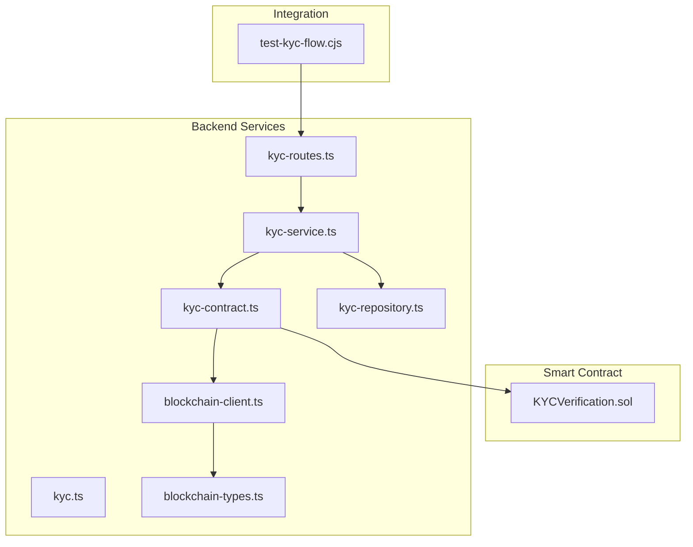
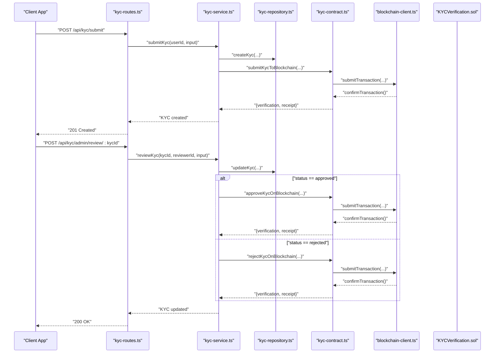
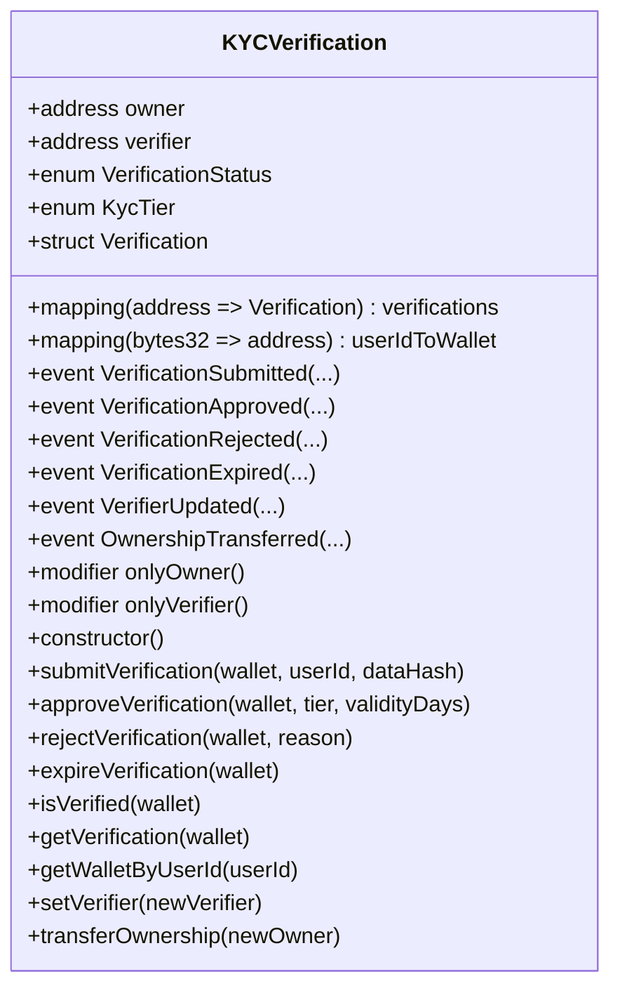
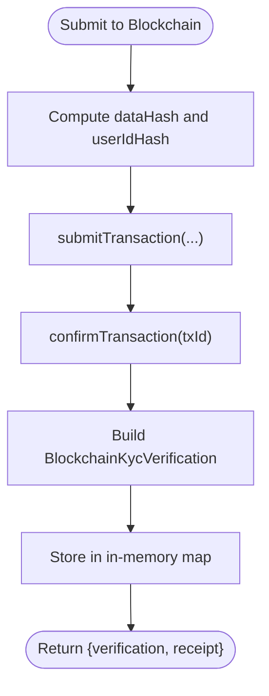
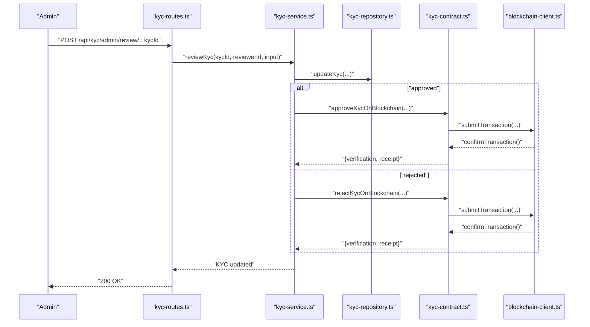
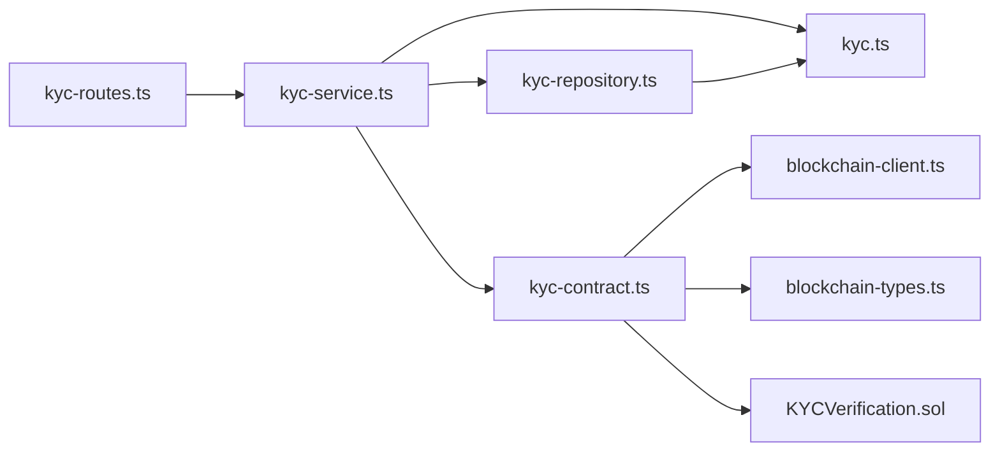

# KYC Verification

<cite>
**Referenced Files in This Document**
- [contracts/KYCVerification.sol](file://contracts/KYCVerification.sol)
- [src/services/kyc-contract.ts](file://src/services/kyc-contract.ts)
- [src/services/kyc-service.ts](file://src/services/kyc-service.ts)
- [src/models/kyc.ts](file://src/models/kyc.ts)
- [src/repositories/kyc-repository.ts](file://src/repositories/kyc-repository.ts)
- [src/services/blockchain-client.ts](file://src/services/blockchain-client.ts)
- [src/services/blockchain-types.ts](file://src/services/blockchain-types.ts)
- [src/routes/kyc-routes.ts](file://src/routes/kyc-routes.ts)
- [scripts/test-kyc-flow.cjs](file://scripts/test-kyc-flow.cjs)
</cite>

## Table of Contents
1. [Introduction](#introduction)
2. [Project Structure](#project-structure)
3. [Core Components](#core-components)
4. [Architecture Overview](#architecture-overview)
5. [Detailed Component Analysis](#detailed-component-analysis)
6. [Dependency Analysis](#dependency-analysis)
7. [Performance Considerations](#performance-considerations)
8. [Troubleshooting Guide](#troubleshooting-guide)
9. [Conclusion](#conclusion)
10. [Appendices](#appendices)

## Introduction
This document describes the privacy-preserving KYC verification system. It covers the on-chain smart contract that stores only verification status and cryptographic hashes, the off-chain services that orchestrate document collection and validation, and the integration points that synchronize blockchain state with the application’s database. The system minimizes on-chain data exposure by storing only hashes and status, while enabling transparent, immutable verification records that can be queried by wallet address or off-chain user ID.

## Project Structure
The KYC system spans Solidity smart contracts, backend services, routing, models, repositories, and blockchain client utilities. The following diagram shows the primary modules and their relationships.

**Diagram sources**
- [contracts/KYCVerification.sol](file://contracts/KYCVerification.sol#L1-L210)
- [src/routes/kyc-routes.ts](file://src/routes/kyc-routes.ts#L1-L917)
- [src/services/kyc-service.ts](file://src/services/kyc-service.ts#L1-L547)
- [src/services/kyc-contract.ts](file://src/services/kyc-contract.ts#L1-L366)
- [src/repositories/kyc-repository.ts](file://src/repositories/kyc-repository.ts#L1-L178)
- [src/models/kyc.ts](file://src/models/kyc.ts#L1-L206)
- [src/services/blockchain-client.ts](file://src/services/blockchain-client.ts#L1-L293)
- [src/services/blockchain-types.ts](file://src/services/blockchain-types.ts#L1-L115)
- [scripts/test-kyc-flow.cjs](file://scripts/test-kyc-flow.cjs#L1-L237)

**Section sources**
- [contracts/KYCVerification.sol](file://contracts/KYCVerification.sol#L1-L210)
- [src/services/kyc-service.ts](file://src/services/kyc-service.ts#L1-L547)
- [src/services/kyc-contract.ts](file://src/services/kyc-contract.ts#L1-L366)
- [src/routes/kyc-routes.ts](file://src/routes/kyc-routes.ts#L1-L917)
- [src/repositories/kyc-repository.ts](file://src/repositories/kyc-repository.ts#L1-L178)
- [src/models/kyc.ts](file://src/models/kyc.ts#L1-L206)
- [src/services/blockchain-client.ts](file://src/services/blockchain-client.ts#L1-L293)
- [src/services/blockchain-types.ts](file://src/services/blockchain-types.ts#L1-L115)
- [scripts/test-kyc-flow.cjs](file://scripts/test-kyc-flow.cjs#L1-L237)

## Core Components
- KYCVerification.sol: On-chain contract storing verification status, tier, expiration, and data hash. Emits events for lifecycle transitions.
- kyc-contract.ts: Off-chain service that simulates blockchain interactions, computes hashes, and manages gas-efficient state updates by storing a local in-memory copy of verification records.
- kyc-service.ts: Orchestrates KYC workflows, validates documents and liveness checks, and triggers on-chain approvals/rejections.
- kyc-routes.ts: Express routes exposing KYC endpoints and admin review endpoints.
- kyc-repository.ts: Data access layer for KYC records stored in Supabase.
- blockchain-client.ts: Utility for transaction submission, polling, and confirmation; simulates blockchain behavior.
- blockchain-types.ts: Shared type definitions for transactions and receipts.
- test-kyc-flow.cjs: Integration test script that exercises the full KYC flow.

**Section sources**
- [contracts/KYCVerification.sol](file://contracts/KYCVerification.sol#L1-L210)
- [src/services/kyc-contract.ts](file://src/services/kyc-contract.ts#L1-L366)
- [src/services/kyc-service.ts](file://src/services/kyc-service.ts#L1-L547)
- [src/routes/kyc-routes.ts](file://src/routes/kyc-routes.ts#L1-L917)
- [src/repositories/kyc-repository.ts](file://src/repositories/kyc-repository.ts#L1-L178)
- [src/services/blockchain-client.ts](file://src/services/blockchain-client.ts#L1-L293)
- [src/services/blockchain-types.ts](file://src/services/blockchain-types.ts#L1-L115)
- [scripts/test-kyc-flow.cjs](file://scripts/test-kyc-flow.cjs#L1-L237)

## Architecture Overview
The system follows a hybrid privacy model:
- On-chain: Stores only status, tier, expiration, and a data hash.
- Off-chain: Stores personal documents, biometric checks, and full KYC metadata.
- Synchronization: Admin actions trigger on-chain state updates, and off-chain services can verify integrity by recomputing hashes.

**Diagram sources**
- [src/routes/kyc-routes.ts](file://src/routes/kyc-routes.ts#L1-L917)
- [src/services/kyc-service.ts](file://src/services/kyc-service.ts#L1-L547)
- [src/repositories/kyc-repository.ts](file://src/repositories/kyc-repository.ts#L1-L178)
- [src/services/kyc-contract.ts](file://src/services/kyc-contract.ts#L1-L366)
- [src/services/blockchain-client.ts](file://src/services/blockchain-client.ts#L1-L293)
- [contracts/KYCVerification.sol](file://contracts/KYCVerification.sol#L1-L210)

## Detailed Component Analysis

### Smart Contract: KYCVerification.sol
- Purpose: Immutable, transparent verification registry storing status, tier, expiration, and a data hash.
- Key features:
  - Roles: owner and verifier with modifiers.
  - Status lifecycle: pending, approved, rejected, expired.
  - Events: emitted on submit/approve/reject/expiry.
  - Public getters: isVerified, getVerification, getWalletByUserId.
  - Expiration: anyone can mark approved verifications expired after expiry.
- Privacy: stores only hashes and minimal metadata; personal data remains off-chain.

**Diagram sources**
- [contracts/KYCVerification.sol](file://contracts/KYCVerification.sol#L1-L210)

**Section sources**
- [contracts/KYCVerification.sol](file://contracts/KYCVerification.sol#L1-L210)

### Off-chain Contract Service: kyc-contract.ts
- Purpose: Encapsulates on-chain interactions and maintains a local in-memory copy of verification records for gas-efficient reads and status checks.
- Key functions:
  - Hashing: generates SHA-256 hashes for KYC data and user IDs.
  - Submission: submits pending verification to the contract and confirms the transaction.
  - Approval/Rejection: approves or rejects pending verifications with tier and validity.
  - Queries: checks verification status, retrieves records by wallet or user ID, verifies data hash integrity.
  - Simulation: uses blockchain-client utilities to simulate transaction submission and confirmation.
- Gas efficiency: Uses in-memory store to avoid frequent on-chain reads; still emits events and updates records upon confirmation.

**Diagram sources**
- [src/services/kyc-contract.ts](file://src/services/kyc-contract.ts#L1-L366)
- [src/services/blockchain-client.ts](file://src/services/blockchain-client.ts#L1-L293)

**Section sources**
- [src/services/kyc-contract.ts](file://src/services/kyc-contract.ts#L1-L366)
- [src/services/blockchain-client.ts](file://src/services/blockchain-client.ts#L1-L293)
- [src/services/blockchain-types.ts](file://src/services/blockchain-types.ts#L1-L115)

### Business Service: kyc-service.ts
- Purpose: Coordinates the end-to-end KYC workflow, including document validation, liveness checks, face matching, and admin review.
- Key responsibilities:
  - Country and document validation.
  - Liveness session creation and verification.
  - Face match scoring.
  - Admin review: approve or reject with risk and AML fields.
  - On-chain sync: triggers approve/reject on the contract when applicable.
  - Integrity checks: compares off-chain status with on-chain status and data hash.
- Data model: Uses models from kyc.ts and persists to Supabase via kyc-repository.ts.

**Diagram sources**
- [src/routes/kyc-routes.ts](file://src/routes/kyc-routes.ts#L822-L917)
- [src/services/kyc-service.ts](file://src/services/kyc-service.ts#L320-L407)
- [src/repositories/kyc-repository.ts](file://src/repositories/kyc-repository.ts#L1-L178)
- [src/services/kyc-contract.ts](file://src/services/kyc-contract.ts#L162-L278)
- [src/services/blockchain-client.ts](file://src/services/blockchain-client.ts#L131-L255)

**Section sources**
- [src/services/kyc-service.ts](file://src/services/kyc-service.ts#L1-L547)
- [src/repositories/kyc-repository.ts](file://src/repositories/kyc-repository.ts#L1-L178)
- [src/models/kyc.ts](file://src/models/kyc.ts#L1-L206)

### Data Models: kyc.ts
- Defines KYC-related types: statuses, tiers, documents, liveness checks, and submission/review inputs.
- Supports structured validation and consistent representation across services and routes.

**Section sources**
- [src/models/kyc.ts](file://src/models/kyc.ts#L1-L206)

### Repository: kyc-repository.ts
- Persists KYC records to Supabase.
- Provides CRUD operations and status-based queries.
- Maps between domain models and database entities.

**Section sources**
- [src/repositories/kyc-repository.ts](file://src/repositories/kyc-repository.ts#L1-L178)

### Blockchain Client: blockchain-client.ts and blockchain-types.ts
- Provides transaction submission, polling, and confirmation utilities.
- Serializes/deserializes big integers for JSON transport.
- Simulates blockchain behavior in memory; production would integrate with an RPC provider.

**Section sources**
- [src/services/blockchain-client.ts](file://src/services/blockchain-client.ts#L1-L293)
- [src/services/blockchain-types.ts](file://src/services/blockchain-types.ts#L1-L115)

### Routes: kyc-routes.ts
- Exposes endpoints for:
  - Country requirements and KYC status retrieval.
  - KYC submission and document addition.
  - Liveness session creation and verification.
  - Face match verification.
  - Admin endpoints for pending reviews and status queries.
  - Admin review endpoint to approve or reject KYC with risk and AML fields.

**Section sources**
- [src/routes/kyc-routes.ts](file://src/routes/kyc-routes.ts#L1-L917)

### Integration Test: test-kyc-flow.cjs
- Demonstrates a complete user flow: register, submit KYC, create and verify liveness, add documents, and finalize status.
- Useful for validating end-to-end behavior and debugging.

**Section sources**
- [scripts/test-kyc-flow.cjs](file://scripts/test-kyc-flow.cjs#L1-L237)

## Dependency Analysis
The following diagram shows module-level dependencies among core components.

**Diagram sources**
- [src/routes/kyc-routes.ts](file://src/routes/kyc-routes.ts#L1-L917)
- [src/services/kyc-service.ts](file://src/services/kyc-service.ts#L1-L547)
- [src/repositories/kyc-repository.ts](file://src/repositories/kyc-repository.ts#L1-L178)
- [src/services/kyc-contract.ts](file://src/services/kyc-contract.ts#L1-L366)
- [src/services/blockchain-client.ts](file://src/services/blockchain-client.ts#L1-L293)
- [src/services/blockchain-types.ts](file://src/services/blockchain-types.ts#L1-L115)
- [src/models/kyc.ts](file://src/models/kyc.ts#L1-L206)
- [contracts/KYCVerification.sol](file://contracts/KYCVerification.sol#L1-L210)

**Section sources**
- [src/routes/kyc-routes.ts](file://src/routes/kyc-routes.ts#L1-L917)
- [src/services/kyc-service.ts](file://src/services/kyc-service.ts#L1-L547)
- [src/repositories/kyc-repository.ts](file://src/repositories/kyc-repository.ts#L1-L178)
- [src/services/kyc-contract.ts](file://src/services/kyc-contract.ts#L1-L366)
- [src/services/blockchain-client.ts](file://src/services/blockchain-client.ts#L1-L293)
- [src/services/blockchain-types.ts](file://src/services/blockchain-types.ts#L1-L115)
- [src/models/kyc.ts](file://src/models/kyc.ts#L1-L206)
- [contracts/KYCVerification.sol](file://contracts/KYCVerification.sol#L1-L210)

## Performance Considerations
- Gas efficiency: Off-chain service maintains an in-memory cache of verification records to reduce repeated on-chain reads. On-chain reads are minimized to essential getters and status checks.
- Batch operations: Admin review endpoints update off-chain records first, then optionally trigger on-chain approvals/rejections to keep latency low.
- Hash computation: SHA-256 hashing is lightweight and deterministic, enabling fast integrity checks.
- Transaction polling: The blockchain client simulates confirmation timing; in production, adjust polling intervals and backoff strategies to balance responsiveness and cost.

[No sources needed since this section provides general guidance]

## Troubleshooting Guide
Common issues and resolutions:
- Transaction confirmation failures:
  - Symptom: Errors indicating failed or unconfirmed transactions during on-chain operations.
  - Resolution: Inspect transaction status via polling and ensure the blockchain client is configured with a valid RPC URL and private key. In simulations, confirmTransaction can be used for testing.
- Duplicate submissions:
  - Symptom: Errors when attempting to submit KYC while a pending or approved verification exists.
  - Resolution: Ensure the off-chain service checks existing status before submitting to the blockchain.
- Invalid verifier or owner operations:
  - Symptom: Rejections when calling approve/reject or updating verifier/owner.
  - Resolution: Verify caller addresses and roles; only the designated verifier and owner can perform privileged operations.
- Expiration handling:
  - Symptom: Verification not recognized as expired.
  - Resolution: Trigger expireVerification after the expiry timestamp; the off-chain service also marks expired verifications when queried.
- Data hash mismatch:
  - Symptom: Integrity checks fail when comparing off-chain data with on-chain hash.
  - Resolution: Recompute the hash using the exact same normalization rules and ensure the same data is used for comparison.

**Section sources**
- [src/services/kyc-contract.ts](file://src/services/kyc-contract.ts#L1-L366)
- [src/services/blockchain-client.ts](file://src/services/blockchain-client.ts#L1-L293)
- [contracts/KYCVerification.sol](file://contracts/KYCVerification.sol#L1-L210)

## Conclusion
The KYC verification system achieves privacy-preserving identity verification by storing only hashes and status on-chain while maintaining comprehensive off-chain data and workflows. The design balances transparency, immutability, and user privacy, with robust admin controls and integrity checks. Integration with the kyc-service and blockchain client enables efficient, gas-conscious state updates and seamless synchronization between on-chain and off-chain systems.

[No sources needed since this section summarizes without analyzing specific files]

## Appendices

### Verification Workflow Summary
- User submits KYC with documents and personal information.
- Off-chain service validates country/document support and creates a pending KYC record.
- Optionally, the service submits a pending verification to the contract and stores a local record.
- Admin reviews KYC, performs AML screening, and either approves or rejects.
- On approval, the service triggers an on-chain approval with tier and validity; on rejection, it triggers an on-chain rejection.
- Integrity checks compare off-chain status with on-chain status and data hash.

**Section sources**
- [src/services/kyc-service.ts](file://src/services/kyc-service.ts#L1-L547)
- [src/services/kyc-contract.ts](file://src/services/kyc-contract.ts#L1-L366)
- [src/routes/kyc-routes.ts](file://src/routes/kyc-routes.ts#L1-L917)
- [scripts/test-kyc-flow.cjs](file://scripts/test-kyc-flow.cjs#L1-L237)