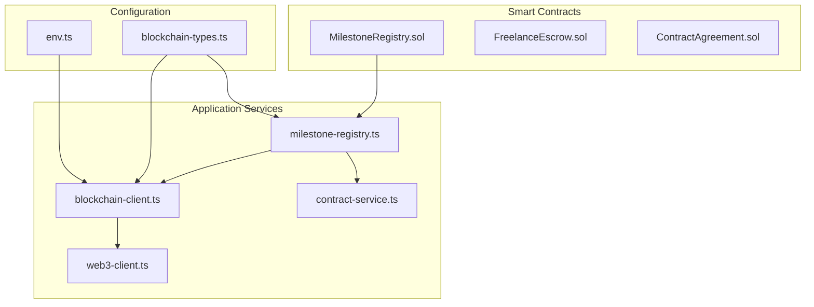
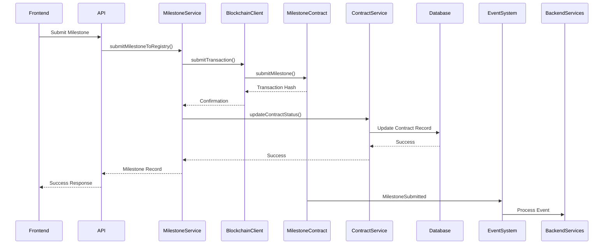
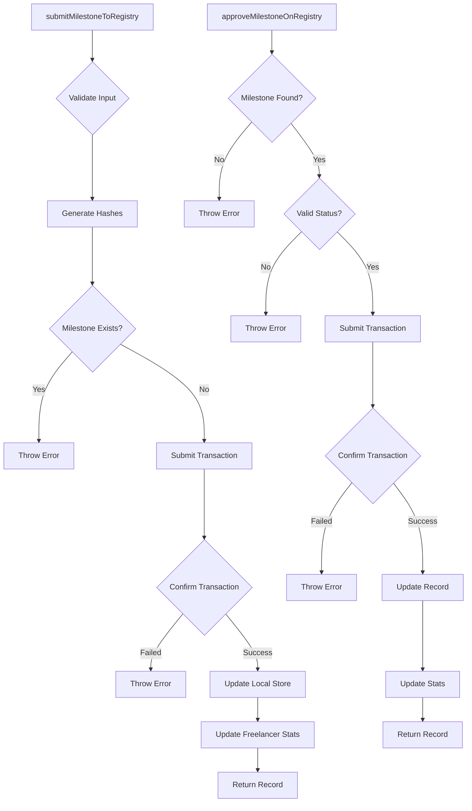
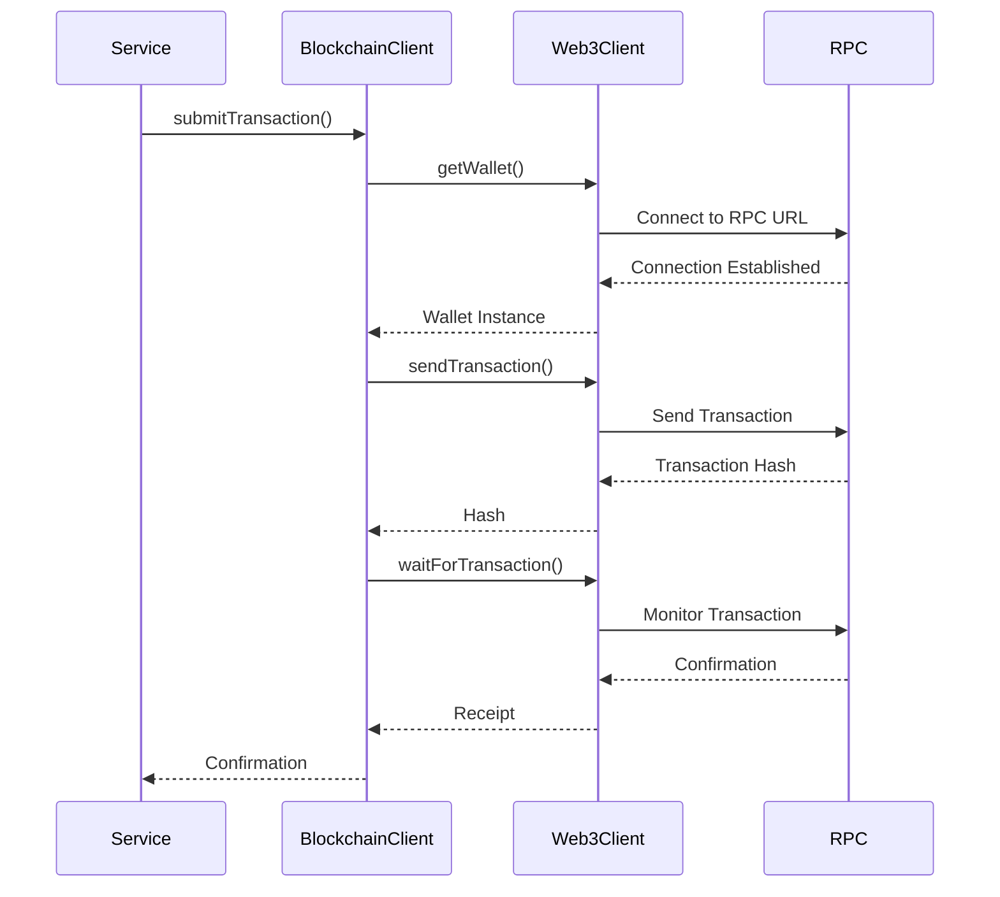
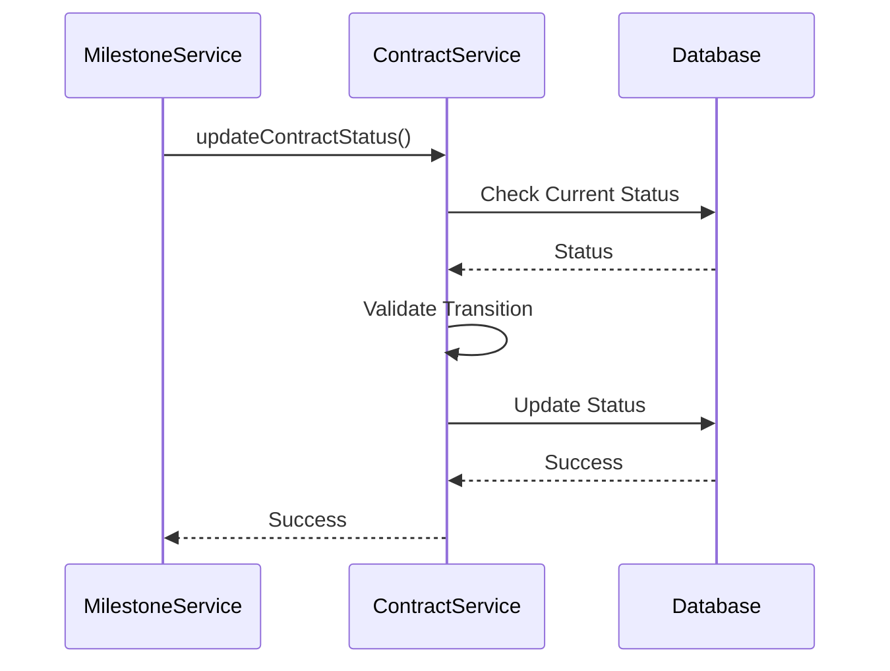
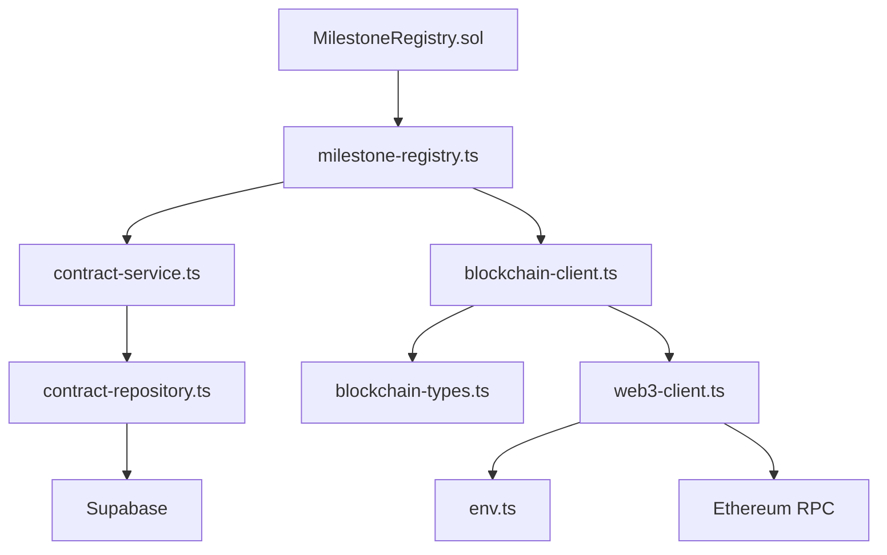

# Milestone Registry

<cite>
**Referenced Files in This Document**   
- [MilestoneRegistry.sol](file://contracts/MilestoneRegistry.sol)
- [milestone-registry.ts](file://src/services/milestone-registry.ts)
- [contract-service.ts](file://src/services/contract-service.ts)
- [blockchain-client.ts](file://src/services/blockchain-client.ts)
- [web3-client.ts](file://src/services/web3-client.ts)
- [blockchain-types.ts](file://src/services/blockchain-types.ts)
- [env.ts](file://src/config/env.ts)
</cite>

## Table of Contents
1. [Introduction](#introduction)
2. [Project Structure](#project-structure)
3. [Core Components](#core-components)
4. [Architecture Overview](#architecture-overview)
5. [Detailed Component Analysis](#detailed-component-analysis)
6. [Dependency Analysis](#dependency-analysis)
7. [Performance Considerations](#performance-considerations)
8. [Troubleshooting Guide](#troubleshooting-guide)
9. [Conclusion](#conclusion)

## Introduction
The Milestone Registry system is a critical component of the FreelanceXchain platform, responsible for tracking project progress and triggering payments through blockchain-based verification. This documentation provides a comprehensive architectural overview of the MilestoneRegistry.sol smart contract and its integration with backend services. The system enables verifiable work history by recording milestone completions on-chain, creating immutable proof of completed work. It supports a complete workflow from milestone submission and approval to completion tracking and payment triggering, with robust validation rules and event-driven architecture.

## Project Structure
The Milestone Registry system is organized across multiple directories in the FreelanceXchain repository, following a modular architecture that separates blockchain logic from application services. The core components are distributed across contracts, services, and configuration files, enabling clear separation of concerns and maintainable code organization.



**Diagram sources**
- [MilestoneRegistry.sol](file://contracts/MilestoneRegistry.sol)
- [milestone-registry.ts](file://src/services/milestone-registry.ts)
- [contract-service.ts](file://src/services/contract-service.ts)
- [blockchain-client.ts](file://src/services/blockchain-client.ts)
- [web3-client.ts](file://src/services/web3-client.ts)
- [env.ts](file://src/config/env.ts)
- [blockchain-types.ts](file://src/services/blockchain-types.ts)

**Section sources**
- [MilestoneRegistry.sol](file://contracts/MilestoneRegistry.sol)
- [milestone-registry.ts](file://src/services/milestone-registry.ts)
- [contract-service.ts](file://src/services/contract-service.ts)

## Core Components
The Milestone Registry system consists of several core components that work together to provide a robust and verifiable milestone tracking solution. The primary components include the MilestoneRegistry.sol smart contract, the milestone-registry.ts service, the blockchain-client.ts integration layer, and the contract-service.ts synchronization service. These components form a cohesive system that ensures data consistency between on-chain and off-chain records while providing a seamless interface for application-level interactions.

**Section sources**
- [MilestoneRegistry.sol](file://contracts/MilestoneRegistry.sol#L1-L145)
- [milestone-registry.ts](file://src/services/milestone-registry.ts#L1-L276)
- [blockchain-client.ts](file://src/services/blockchain-client.ts#L1-L293)

## Architecture Overview
The Milestone Registry system follows an event-driven architecture that integrates blockchain verification with traditional database persistence. The system is designed to provide immutable proof of work completion while maintaining efficient query capabilities for application use cases. The architecture separates concerns between on-chain verification and off-chain data management, ensuring both security and performance.



**Diagram sources**
- [MilestoneRegistry.sol](file://contracts/MilestoneRegistry.sol#L38-L41)
- [milestone-registry.ts](file://src/services/milestone-registry.ts#L63-L135)
- [contract-service.ts](file://src/services/contract-service.ts#L65-L103)
- [blockchain-client.ts](file://src/services/blockchain-client.ts#L131-L159)

## Detailed Component Analysis

### Milestone Registry Contract Analysis
The MilestoneRegistry.sol contract serves as the on-chain source of truth for milestone completion records. It provides immutable storage of milestone data and enforces business rules through smart contract logic. The contract maintains a mapping of milestone records and provides functions for submitting, approving, and rejecting milestones.

```mermaid
classDiagram
class MilestoneRegistry {
+address owner
+enum MilestoneStatus { Submitted, Approved, Rejected, Disputed }
+struct MilestoneRecord
+mapping(bytes32 => MilestoneRecord) milestones
+mapping(address => bytes32[]) freelancerMilestones
+mapping(address => uint256) completedCount
+mapping(address => uint256) totalEarned
+event MilestoneSubmitted
+event MilestoneApproved
+event MilestoneRejected
+submitMilestone()
+approveMilestone()
+rejectMilestone()
+getMilestone()
+getFreelancerStats()
+getFreelancerMilestoneAt()
+verifyWorkHash()
}
class MilestoneRecord {
+bytes32 contractId
+bytes32 milestoneId
+bytes32 workHash
+address freelancer
+address employer
+uint256 amount
+MilestoneStatus status
+uint256 submittedAt
+uint256 completedAt
+string title
}
MilestoneRegistry --> MilestoneRecord : "contains"
```

**Diagram sources**
- [MilestoneRegistry.sol](file://contracts/MilestoneRegistry.sol#L9-L144)

**Section sources**
- [MilestoneRegistry.sol](file://contracts/MilestoneRegistry.sol#L9-L144)

### Milestone Registry Service Analysis
The milestone-registry.ts service provides the application-level interface to the MilestoneRegistry contract. It handles the translation between application data structures and blockchain transactions, manages local state for performance optimization, and provides a clean API for other services to interact with the milestone system.



**Diagram sources**
- [milestone-registry.ts](file://src/services/milestone-registry.ts#L63-L275)

**Section sources**
- [milestone-registry.ts](file://src/services/milestone-registry.ts#L63-L275)

### Blockchain Client Integration Analysis
The blockchain-client.ts and web3-client.ts modules provide the integration layer between the application and the Ethereum blockchain. These services handle transaction submission, confirmation polling, and error handling, abstracting the complexity of blockchain interactions from the higher-level business logic.



**Diagram sources**
- [blockchain-client.ts](file://src/services/blockchain-client.ts#L131-L292)
- [web3-client.ts](file://src/services/web3-client.ts#L101-L138)

**Section sources**
- [blockchain-client.ts](file://src/services/blockchain-client.ts#L131-L292)
- [web3-client.ts](file://src/services/web3-client.ts#L101-L138)

### Contract Synchronization Analysis
The integration between the milestone registry and contract service ensures data consistency between on-chain milestone status and off-chain contract records. This synchronization is critical for maintaining a coherent view of project progress across the system.



**Diagram sources**
- [contract-service.ts](file://src/services/contract-service.ts#L65-L103)
- [milestone-registry.ts](file://src/services/milestone-registry.ts#L140-L186)

**Section sources**
- [contract-service.ts](file://src/services/contract-service.ts#L65-L103)

## Dependency Analysis
The Milestone Registry system has a well-defined dependency structure that ensures separation of concerns while enabling seamless integration between components. The dependency graph shows how services depend on lower-level infrastructure while providing interfaces for higher-level business logic.



**Diagram sources**
- [MilestoneRegistry.sol](file://contracts/MilestoneRegistry.sol)
- [milestone-registry.ts](file://src/services/milestone-registry.ts)
- [contract-service.ts](file://src/services/contract-service.ts)
- [blockchain-client.ts](file://src/services/blockchain-client.ts)
- [web3-client.ts](file://src/services/web3-client.ts)
- [env.ts](file://src/config/env.ts)
- [blockchain-types.ts](file://src/services/blockchain-types.ts)

**Section sources**
- [MilestoneRegistry.sol](file://contracts/MilestoneRegistry.sol)
- [milestone-registry.ts](file://src/services/milestone-registry.ts)
- [contract-service.ts](file://src/services/contract-service.ts)
- [blockchain-client.ts](file://src/services/blockchain-client.ts)
- [web3-client.ts](file://src/services/web3-client.ts)
- [env.ts](file://src/config/env.ts)
- [blockchain-types.ts](file://src/services/blockchain-types.ts)

## Performance Considerations
The Milestone Registry system incorporates several performance optimization strategies to handle frequent status checks and ensure responsive user experiences. The service layer maintains in-memory caches of milestone records and freelancer statistics, reducing the need for repeated blockchain queries. Transaction confirmation is handled asynchronously with configurable polling intervals, preventing blocking operations during the confirmation process.

For production deployments, the system should implement additional caching layers and connection pooling to handle high request volumes. Monitoring of blockchain RPC response times and transaction confirmation rates is essential for maintaining service reliability. The current implementation includes configurable timeout and retry parameters that can be tuned based on network conditions and performance requirements.

**Section sources**
- [blockchain-client.ts](file://src/services/blockchain-client.ts#L184-L238)
- [web3-client.ts](file://src/services/web3-client.ts#L168-L188)

## Troubleshooting Guide
When troubleshooting issues with the Milestone Registry system, consider the following common scenarios and their solutions:

1. **Transaction confirmation failures**: Verify that the BLOCKCHAIN_RPC_URL and BLOCKCHAIN_PRIVATE_KEY environment variables are correctly configured in the .env file. Check network connectivity to the RPC endpoint and ensure the wallet has sufficient funds for gas fees.

2. **Milestone submission conflicts**: Ensure that milestone IDs are unique and properly hashed before submission. The system prevents duplicate submissions of the same milestone ID.

3. **Status synchronization issues**: Verify that the contract-service integration is properly configured and that the database connection is healthy. Check for any errors in the status transition validation logic.

4. **Performance bottlenecks**: Monitor transaction confirmation times and adjust the polling interval and maximum attempts in the blockchain client configuration. Consider implementing additional caching for frequently accessed milestone records.

**Section sources**
- [blockchain-client.ts](file://src/services/blockchain-client.ts#L244-L269)
- [env.ts](file://src/config/env.ts#L63-L66)
- [contract-service.ts](file://src/services/contract-service.ts#L77-L92)

## Conclusion
The Milestone Registry system provides a robust and verifiable solution for tracking project progress and triggering payments in the FreelanceXchain platform. By leveraging blockchain technology for immutable record-keeping and combining it with efficient application-level services, the system ensures data integrity while maintaining performance and usability. The modular architecture enables clear separation of concerns, making the system maintainable and extensible. The integration between on-chain verification and off-chain data management provides a comprehensive solution that meets the requirements for transparent and trustworthy freelance work tracking.