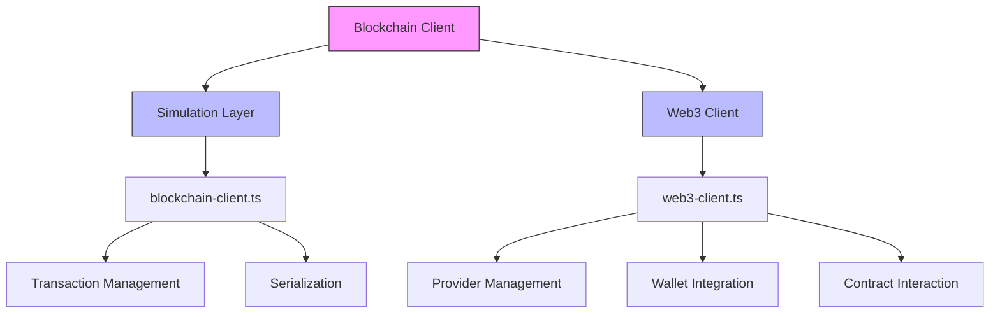
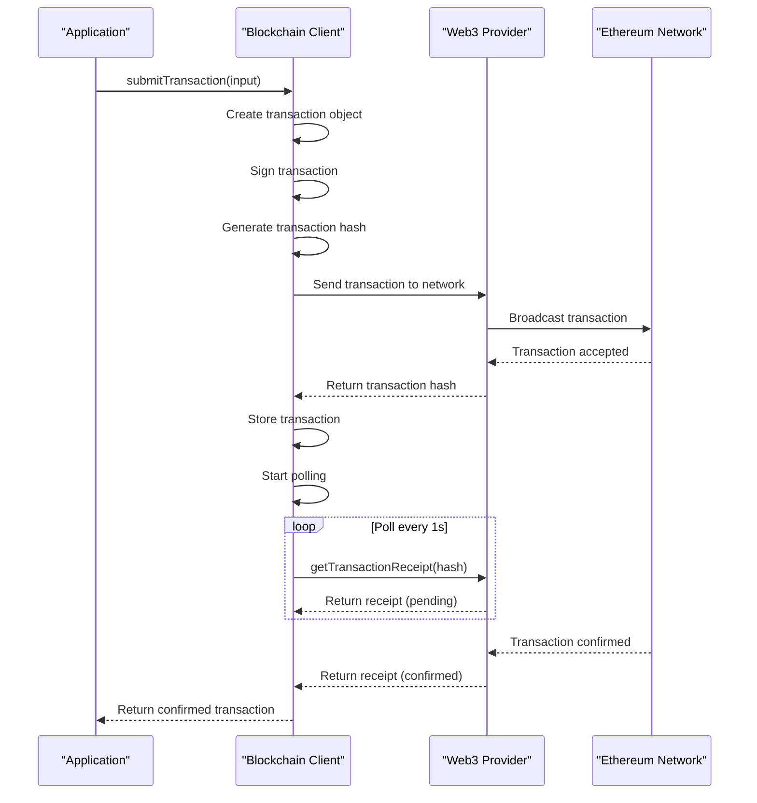
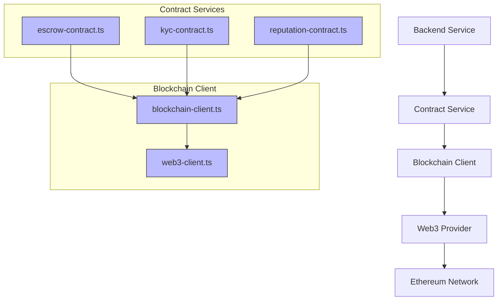
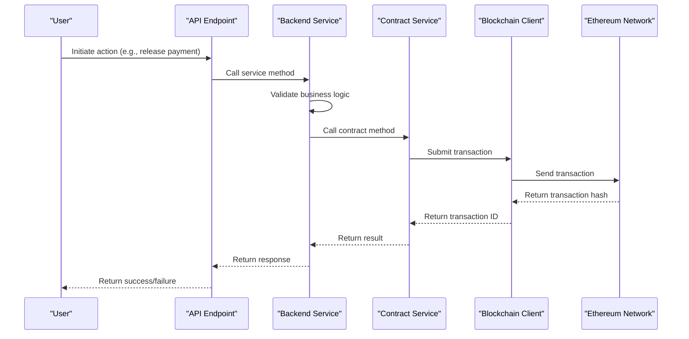
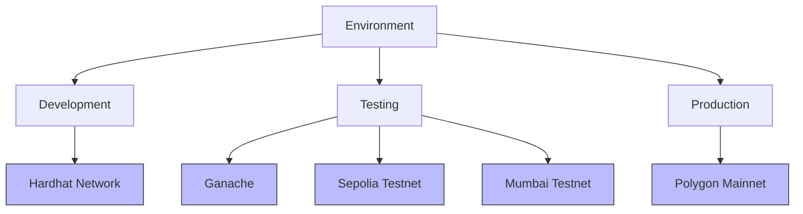
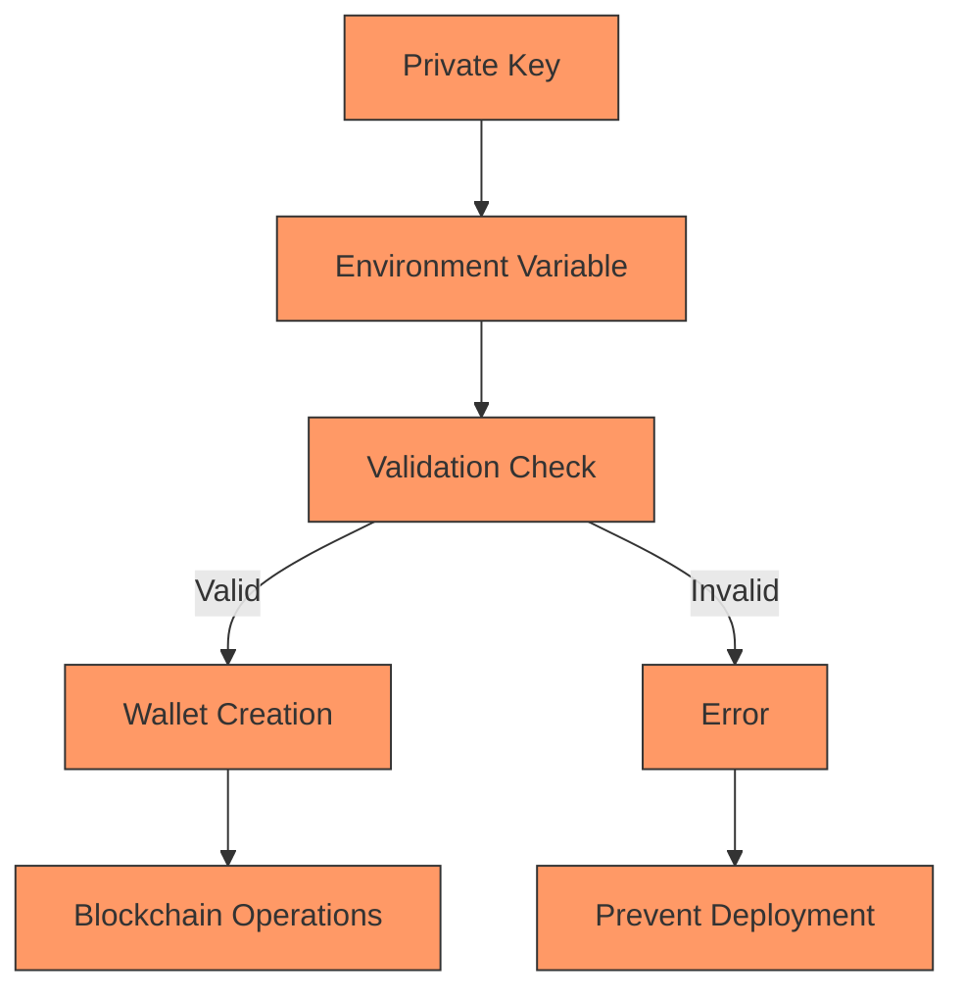
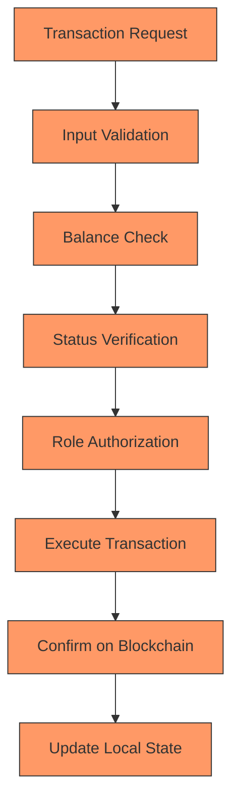

# Blockchain Integration

<cite>
**Referenced Files in This Document**   
- [FreelanceEscrow.sol](file://contracts/FreelanceEscrow.sol)
- [FreelanceReputation.sol](file://contracts/FreelanceReputation.sol)
- [KYCVerification.sol](file://contracts/KYCVerification.sol)
- [DisputeResolution.sol](file://contracts/DisputeResolution.sol)
- [MilestoneRegistry.sol](file://contracts/MilestoneRegistry.sol)
- [ContractAgreement.sol](file://contracts/ContractAgreement.sol)
- [blockchain-client.ts](file://src/services/blockchain-client.ts)
- [web3-client.ts](file://src/services/web3-client.ts)
- [escrow-contract.ts](file://src/services/escrow-contract.ts)
- [kyc-contract.ts](file://src/services/kyc-contract.ts)
- [reputation-contract.ts](file://src/services/reputation-contract.ts)
- [env.ts](file://src/config/env.ts)
- [hardhat.config.cjs](file://hardhat.config.cjs)
- [deploy.cjs](file://scripts/deploy.cjs)
- [deploy-escrow.cjs](file://scripts/deploy-escrow.cjs)
</cite>

## Table of Contents
1. [Introduction](#introduction)
2. [Smart Contract Architecture](#smart-contract-architecture)
3. [Core Smart Contracts](#core-smart-contracts)
4. [Blockchain Client Implementation](#blockchain-client-implementation)
5. [Backend Integration Pattern](#backend-integration-pattern)
6. [Network Configuration](#network-configuration)
7. [Security Considerations](#security-considerations)
8. [Conclusion](#conclusion)

## Introduction

The FreelanceXchain platform leverages blockchain technology to create a trustless, transparent, and secure environment for freelance transactions. This documentation details the blockchain integration architecture, focusing on the smart contract ecosystem, TypeScript client implementation, and integration patterns between backend services and the Ethereum blockchain. The system is designed to handle secure fund holding, reputation management, identity verification, dispute resolution, milestone tracking, and formal agreements through a suite of interconnected smart contracts.

**Section sources**
- [FreelanceEscrow.sol](file://contracts/FreelanceEscrow.sol#L1-L264)
- [FreelanceReputation.sol](file://contracts/FreelanceReputation.sol#L1-L183)
- [KYCVerification.sol](file://contracts/KYCVerification.sol#L1-L211)

## Smart Contract Architecture

The blockchain architecture of FreelanceXchain consists of six core smart contracts that work together to provide a comprehensive decentralized freelance marketplace. These contracts are designed with modularity in mind, allowing each component to handle specific aspects of the platform's functionality while maintaining interoperability through Ethereum events and function calls.

```mermaid
graph TB
subgraph "Smart Contracts"
A[ContractAgreement]
B[FreelanceEscrow]
C[FreelanceReputation]
D[KYCVerification]
E[DisputeResolution]
F[MilestoneRegistry]
end
A --> B: "Triggers escrow deployment"
B --> E: "Emits dispute events"
B --> F: "Records milestone completions"
C --> B: "Influences escrow terms"
D --> B: "Verifies participant identity"
E --> C: "Updates reputation based on outcomes"
F --> C: "Provides work history for reputation"
style A fill:#f9f,stroke:#333
style B fill:#f9f,stroke:#333
style C fill:#f9f,stroke:#333
style D fill:#f9f,stroke:#333
style E fill:#f9f,stroke:#333
style F fill:#f9f,stroke:#333
```

**Diagram sources**
- [ContractAgreement.sol](file://contracts/ContractAgreement.sol#L1-L186)
- [FreelanceEscrow.sol](file://contracts/FreelanceEscrow.sol#L1-L264)
- [FreelanceReputation.sol](file://contracts/FreelanceReputation.sol#L1-L183)
- [KYCVerification.sol](file://contracts/KYCVerification.sol#L1-L211)
- [DisputeResolution.sol](file://contracts/DisputeResolution.sol#L1-L153)
- [MilestoneRegistry.sol](file://contracts/MilestoneRegistry.sol#L1-L145)

**Section sources**
- [FreelanceEscrow.sol](file://contracts/FreelanceEscrow.sol#L1-L264)
- [FreelanceReputation.sol](file://contracts/FreelanceReputation.sol#L1-L183)
- [KYCVerification.sol](file://contracts/KYCVerification.sol#L1-L211)
- [DisputeResolution.sol](file://contracts/DisputeResolution.sol#L1-L153)
- [MilestoneRegistry.sol](file://contracts/MilestoneRegistry.sol#L1-L145)
- [ContractAgreement.sol](file://contracts/ContractAgreement.sol#L1-L186)

## Core Smart Contracts

### FreelanceEscrow Contract

The FreelanceEscrow contract serves as the financial backbone of the platform, securely holding funds in escrow and releasing them according to milestone completion. It implements a reentrancy guard to prevent common security vulnerabilities and uses modifiers to enforce role-based access control for employers, freelancers, and arbiters.

```mermaid
classDiagram
class FreelanceEscrow {
+address employer
+address freelancer
+address arbiter
+uint256 totalAmount
+uint256 releasedAmount
+bool isActive
+string contractId
+getMilestoneCount() uint256
+getMilestone(uint256) (uint256, MilestoneStatus, string)
+getBalance() uint256
+getRemainingAmount() uint256
}
class Milestone {
+uint256 amount
+MilestoneStatus status
+string description
}
enum MilestoneStatus {
Pending
Submitted
Approved
Disputed
Refunded
}
FreelanceEscrow --> Milestone : "has multiple"
FreelanceEscrow --> MilestoneStatus : "uses"
note right of FreelanceEscrow
Manages milestone-based payments
Implements reentrancy protection
Handles dispute resolution
end note
```

**Diagram sources**
- [FreelanceEscrow.sol](file://contracts/FreelanceEscrow.sol#L1-L264)

**Section sources**
- [FreelanceEscrow.sol](file://contracts/FreelanceEscrow.sol#L1-L264)

### FreelanceReputation Contract

The FreelanceReputation contract provides an immutable on-chain reputation system that stores ratings and reviews. It prevents duplicate ratings per contract through cryptographic hashing and maintains aggregate scores for efficient reputation calculation.

```mermaid
classDiagram
class FreelanceReputation {
+address owner
+totalScore[address] uint256
+ratingCount[address] uint256
+ratingExists[bytes32] bool
+getAverageRating(address) uint256
+getRatingCount(address) uint256
+getTotalRatings() uint256
+hasRated(address, address, string) bool
}
class Rating {
+address rater
+address ratee
+uint8 score
+string comment
+string contractId
+uint256 timestamp
+bool isEmployerRating
}
FreelanceReputation --> Rating : "stores"
FreelanceReputation --> Rating : "indexes by user"
note right of FreelanceReputation
Immutable reputation records
Prevents duplicate ratings
Caches aggregate scores
end note
```

**Diagram sources**
- [FreelanceReputation.sol](file://contracts/FreelanceReputation.sol#L1-L183)

**Section sources**
- [FreelanceReputation.sol](file://contracts/FreelanceReputation.sol#L1-L183)

### KYCVerification Contract

The KYCVerification contract stores verification status on-chain while maintaining GDPR compliance by only storing hashes of personal data. It implements tiered verification levels and automatic expiration of credentials.

```mermaid
classDiagram
class KYCVerification {
+address owner
+address verifier
+verifications[address] Verification
+userIdToWallet[bytes32] address
+isVerified(address) (bool, KycTier)
+getVerification(address) Verification
+getWalletByUserId(bytes32) address
+setVerifier(address) void
}
class Verification {
+VerificationStatus status
+KycTier tier
+bytes32 dataHash
+uint256 verifiedAt
+uint256 expiresAt
+address verifiedBy
+string rejectionReason
}
enum VerificationStatus {
None
Pending
Approved
Rejected
Expired
}
enum KycTier {
None
Basic
Standard
Enhanced
}
KYCVerification --> Verification : "maps to"
KYCVerification --> VerificationStatus : "uses"
KYCVerification --> KycTier : "uses"
note right of KYCVerification
GDPR-compliant design
Stores only verification status and hashes
Supports tiered verification levels
end note
```

**Diagram sources**
- [KYCVerification.sol](file://contracts/KYCVerification.sol#L1-L211)

**Section sources**
- [KYCVerification.sol](file://contracts/KYCVerification.sol#L1-L211)

### DisputeResolution Contract

The DisputeResolution contract creates an immutable record of arbitration decisions, providing transparency and accountability in conflict management.

```mermaid
classDiagram
class DisputeResolution {
+address owner
+disputes[bytes32] DisputeRecord
+userDisputes[address] bytes32[]
+disputesWon[address] uint256
+disputesLost[address] uint256
+createDispute(bytes32, ...) void
+updateEvidence(bytes32, bytes32) void
+resolveDispute(bytes32, ...) void
+getDispute(bytes32) DisputeRecord
+getUserDisputeStats(address) (uint256, uint256, uint256)
}
class DisputeRecord {
+bytes32 disputeId
+bytes32 contractId
+bytes32 milestoneId
+bytes32 evidenceHash
+address initiator
+address freelancer
+address employer
+address arbiter
+uint256 amount
+DisputeOutcome outcome
+string reasoning
+uint256 createdAt
+uint256 resolvedAt
}
enum DisputeOutcome {
Pending
FreelancerFavor
EmployerFavor
Split
Cancelled
}
DisputeResolution --> DisputeRecord : "stores"
DisputeResolution --> DisputeOutcome : "uses"
note right of DisputeResolution
Immutable dispute records
Tracks dispute outcomes
Maintains win/loss statistics
end note
```

**Diagram sources**
- [DisputeResolution.sol](file://contracts/DisputeResolution.sol#L1-L153)

**Section sources**
- [DisputeResolution.sol](file://contracts/DisputeResolution.sol#L1-L153)

### MilestoneRegistry Contract

The MilestoneRegistry contract records milestone completions on-chain, creating verifiable proof of work history for freelancers.

```mermaid
classDiagram
class MilestoneRegistry {
+address owner
+milestones[bytes32] MilestoneRecord
+freelancerMilestones[address] bytes32[]
+completedCount[address] uint256
+totalEarned[address] uint256
+submitMilestone(bytes32, ...) void
+approveMilestone(bytes32) void
+rejectMilestone(bytes32, string) void
+getMilestone(bytes32) MilestoneRecord
+getFreelancerStats(address) (uint256, uint256, uint256)
+verifyWorkHash(bytes32, bytes32) bool
}
class MilestoneRecord {
+bytes32 contractId
+bytes32 milestoneId
+bytes32 workHash
+address freelancer
+address employer
+uint256 amount
+MilestoneStatus status
+uint256 submittedAt
+uint256 completedAt
+string title
}
enum MilestoneStatus {
Submitted
Approved
Rejected
Disputed
}
MilestoneRegistry --> MilestoneRecord : "stores"
MilestoneRegistry --> MilestoneStatus : "uses"
note right of MilestoneRegistry
Verifiable work history
Immutable proof of completion
Portfolio tracking for freelancers
end note
```

**Diagram sources**
- [MilestoneRegistry.sol](file://contracts/MilestoneRegistry.sol#L1-L145)

**Section sources**
- [MilestoneRegistry.sol](file://contracts/MilestoneRegistry.sol#L1-L145)

### ContractAgreement Contract

The ContractAgreement contract stores agreement signatures and terms hashes on-chain, creating immutable proof that both parties agreed to specific terms.

```mermaid
classDiagram
class ContractAgreement {
+address owner
+agreements[bytes32] Agreement
+userAgreements[address] bytes32[]
+createAgreement(bytes32, ...) void
+signAgreement(bytes32) void
+completeAgreement(bytes32) void
+disputeAgreement(bytes32) void
+cancelAgreement(bytes32) void
+getAgreement(bytes32) Agreement
+isFullySigned(bytes32) bool
+verifyTerms(bytes32, bytes32) bool
}
class Agreement {
+bytes32 contractId
+bytes32 termsHash
+address employer
+address freelancer
+uint256 totalAmount
+uint256 milestoneCount
+AgreementStatus status
+uint256 employerSignedAt
+uint256 freelancerSignedAt
+uint256 createdAt
}
enum AgreementStatus {
Pending
Signed
Completed
Disputed
Cancelled
}
ContractAgreement --> Agreement : "stores"
ContractAgreement --> AgreementStatus : "uses"
note right of ContractAgreement
Immutable agreement records
Tracks signature status
Verifies terms integrity
end note
```

**Diagram sources**
- [ContractAgreement.sol](file://contracts/ContractAgreement.sol#L1-L186)

**Section sources**
- [ContractAgreement.sol](file://contracts/ContractAgreement.sol#L1-L186)

## Blockchain Client Implementation

The TypeScript blockchain client implementation provides a comprehensive interface for interacting with the Ethereum blockchain using ethers.js. It consists of two main components: a simulation layer for development and testing, and a production-ready Web3 client for mainnet interactions.



**Diagram sources**
- [blockchain-client.ts](file://src/services/blockchain-client.ts#L1-L293)
- [web3-client.ts](file://src/services/web3-client.ts#L1-L339)

**Section sources**
- [blockchain-client.ts](file://src/services/blockchain-client.ts#L1-L293)
- [web3-client.ts](file://src/services/web3-client.ts#L1-L339)

### Transaction Flow

The transaction flow in the blockchain client follows a standardized pattern for creating, submitting, and confirming transactions on the Ethereum network.



**Diagram sources**
- [blockchain-client.ts](file://src/services/blockchain-client.ts#L1-L293)
- [web3-client.ts](file://src/services/web3-client.ts#L1-L339)

**Section sources**
- [blockchain-client.ts](file://src/services/blockchain-client.ts#L1-L293)
- [web3-client.ts](file://src/services/web3-client.ts#L1-L339)

### Service Integration

The service layer provides specialized interfaces for interacting with each smart contract, abstracting the complexity of direct blockchain interactions.



**Diagram sources**
- [escrow-contract.ts](file://src/services/escrow-contract.ts#L1-L327)
- [kyc-contract.ts](file://src/services/kyc-contract.ts#L1-L366)
- [reputation-contract.ts](file://src/services/reputation-contract.ts#L1-L288)
- [blockchain-client.ts](file://src/services/blockchain-client.ts#L1-L293)
- [web3-client.ts](file://src/services/web3-client.ts#L1-L339)

**Section sources**
- [escrow-contract.ts](file://src/services/escrow-contract.ts#L1-L327)
- [kyc-contract.ts](file://src/services/kyc-contract.ts#L1-L366)
- [reputation-contract.ts](file://src/services/reputation-contract.ts#L1-L288)

## Backend Integration Pattern

The integration between backend services and smart contracts follows a pattern where the backend acts as an intermediary, handling business logic and user authentication while delegating blockchain operations to specialized services.



**Diagram sources**
- [escrow-contract.ts](file://src/services/escrow-contract.ts#L1-L327)
- [payment-service.ts](file://src/services/payment-service.ts)
- [contract-service.ts](file://src/services/contract-service.ts)

**Section sources**
- [escrow-contract.ts](file://src/services/escrow-contract.ts#L1-L327)
- [payment-service.ts](file://src/services/payment-service.ts)
- [contract-service.ts](file://src/services/contract-service.ts)

## Network Configuration

The platform supports multiple network configurations for development, testing, and production environments through the Hardhat configuration and environment variables.



**Diagram sources**
- [hardhat.config.cjs](file://hardhat.config.cjs#L1-L50)
- [env.ts](file://src/config/env.ts#L1-L70)

**Section sources**
- [hardhat.config.cjs](file://hardhat.config.cjs#L1-L50)
- [env.ts](file://src/config/env.ts#L1-L70)

### Configuration Details

The network configuration is managed through environment variables and the Hardhat configuration file, allowing for flexible deployment across different networks.

| Network | RPC URL | Chain ID | Configuration Source |
|--------|--------|--------|---------------------|
| Hardhat | http://127.0.0.1:8545 | 31337 | hardhat.config.cjs |
| Ganache | http://127.0.0.1:7545 | 1337 | hardhat.config.cjs |
| Sepolia | Infura/Alchemy URL | 11155111 | hardhat.config.cjs |
| Polygon | Infura/Alchemy URL | 137 | hardhat.config.cjs |
| Mumbai | Infura/Alchemy URL | 80001 | hardhat.config.cjs |

**Section sources**
- [hardhat.config.cjs](file://hardhat.config.cjs#L1-L50)
- [env.ts](file://src/config/env.ts#L1-L70)

## Security Considerations

The blockchain integration incorporates several security measures to protect user funds and data integrity.

### Private Key Management

Private key management follows security best practices by storing keys in environment variables rather than code, with validation to ensure proper format.



**Diagram sources**
- [env.ts](file://src/config/env.ts#L1-L70)
- [web3-client.ts](file://src/services/web3-client.ts#L1-L339)

**Section sources**
- [env.ts](file://src/config/env.ts#L1-L70)
- [web3-client.ts](file://src/services/web3-client.ts#L1-L339)

### Transaction Validation

Transaction validation includes multiple layers of security checks, including input validation, balance verification, and status checks.



**Diagram sources**
- [FreelanceEscrow.sol](file://contracts/FreelanceEscrow.sol#L1-L264)
- [blockchain-client.ts](file://src/services/blockchain-client.ts#L1-L293)

**Section sources**
- [FreelanceEscrow.sol](file://contracts/FreelanceEscrow.sol#L1-L264)
- [blockchain-client.ts](file://src/services/blockchain-client.ts#L1-L293)

## Conclusion

The blockchain integration in FreelanceXchain provides a robust foundation for a decentralized freelance marketplace. The architecture combines multiple specialized smart contracts with a well-designed TypeScript client implementation to create a secure, transparent, and user-friendly platform. The system effectively handles fund holding, reputation management, identity verification, dispute resolution, milestone tracking, and formal agreements through a cohesive ecosystem of interconnected components. The integration pattern between backend services and smart contracts ensures that business logic is properly separated from blockchain operations, while comprehensive security measures protect user funds and data integrity. The support for multiple network configurations enables seamless development, testing, and production deployment across various Ethereum networks.

**Section sources**
- [FreelanceEscrow.sol](file://contracts/FreelanceEscrow.sol#L1-L264)
- [FreelanceReputation.sol](file://contracts/FreelanceReputation.sol#L1-L183)
- [KYCVerification.sol](file://contracts/KYCVerification.sol#L1-L211)
- [DisputeResolution.sol](file://contracts/DisputeResolution.sol#L1-L153)
- [MilestoneRegistry.sol](file://contracts/MilestoneRegistry.sol#L1-L145)
- [ContractAgreement.sol](file://contracts/ContractAgreement.sol#L1-L186)
- [blockchain-client.ts](file://src/services/blockchain-client.ts#L1-L293)
- [web3-client.ts](file://src/services/web3-client.ts#L1-L339)