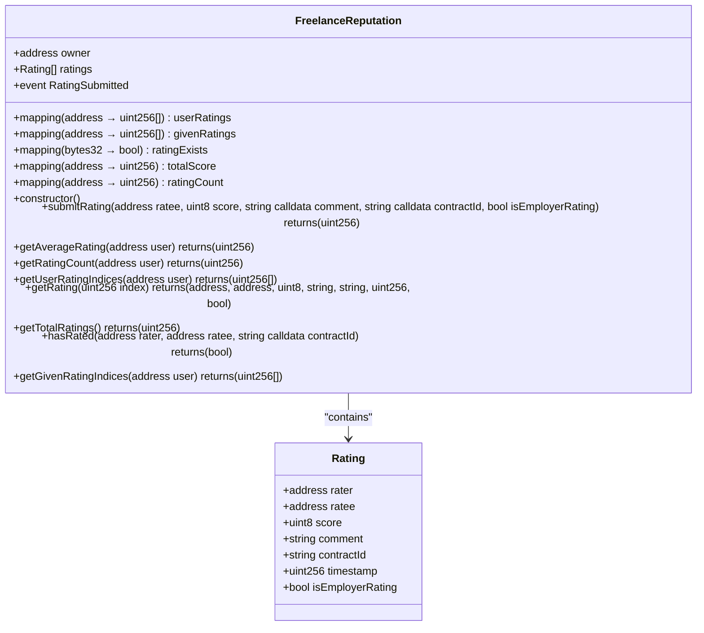
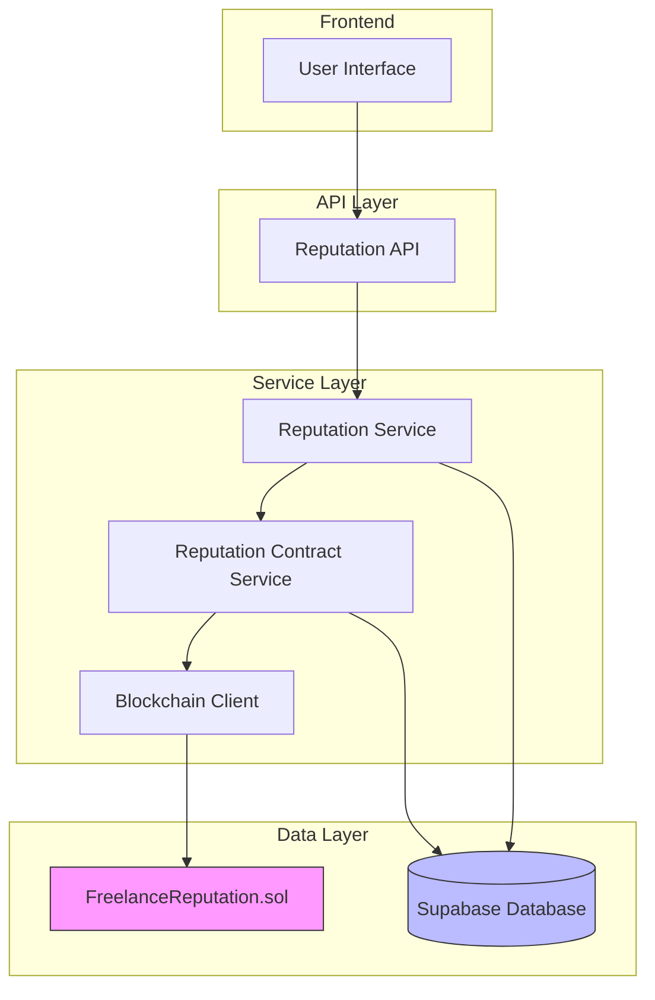
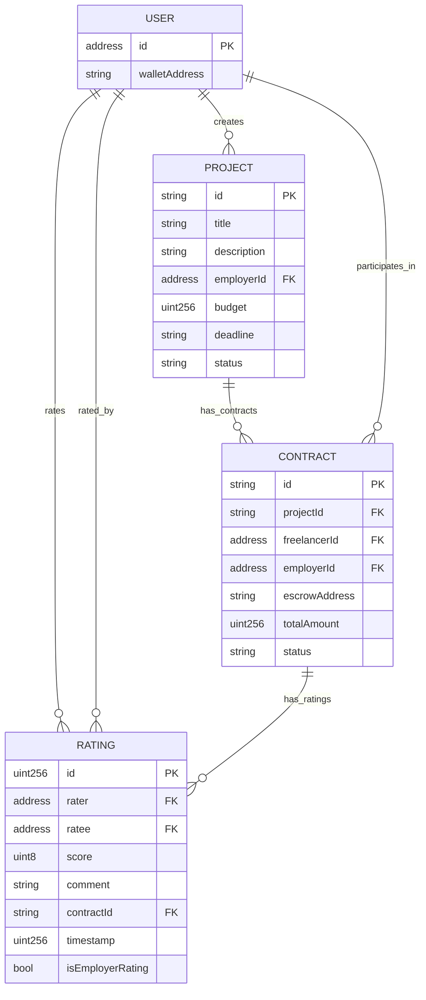
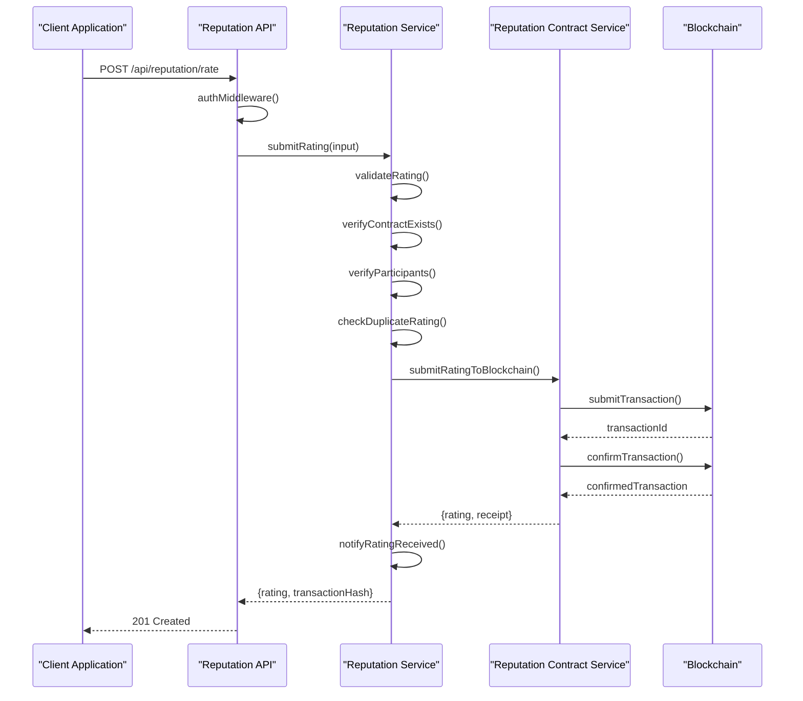
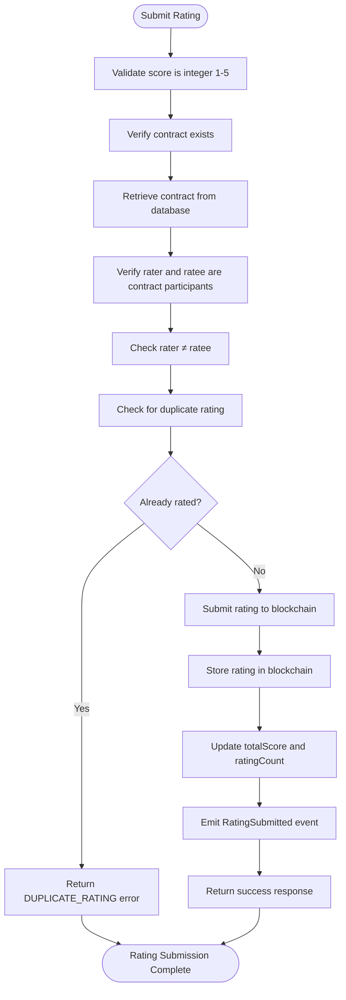
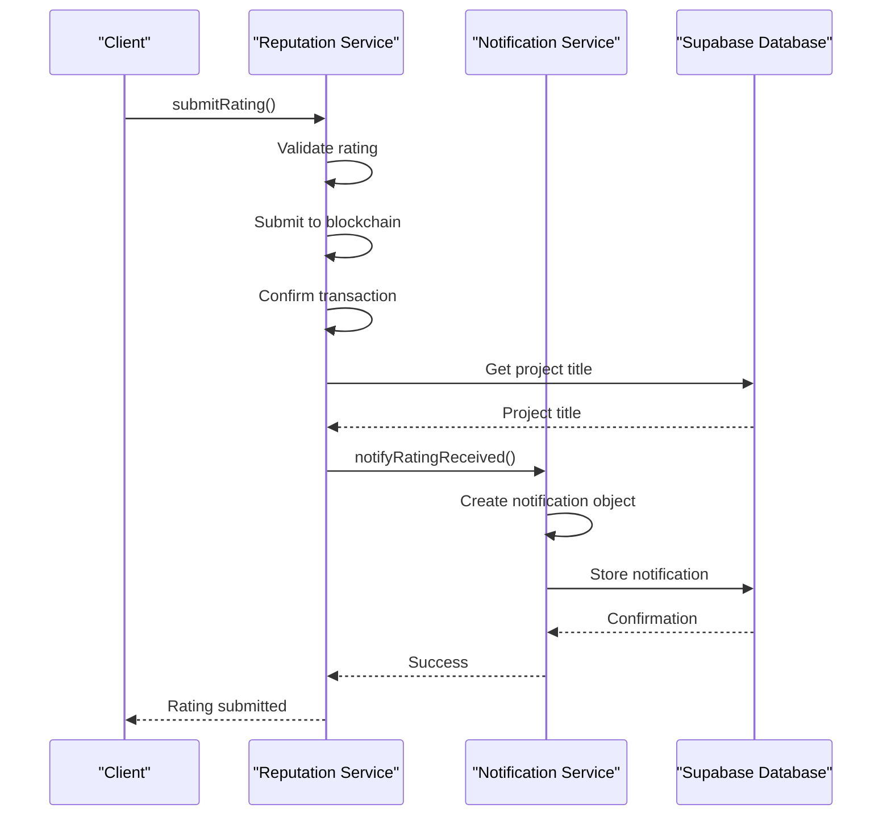
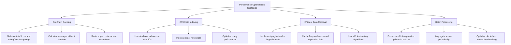
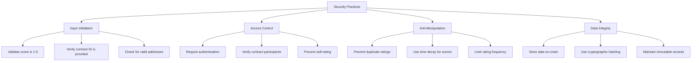

# Reputation System

<cite>
**Referenced Files in This Document**   
- [FreelanceReputation.sol](file://contracts/FreelanceReputation.sol)
- [reputation-contract.ts](file://src/services/reputation-contract.ts)
- [reputation-service.ts](file://src/services/reputation-service.ts)
- [reputation-routes.ts](file://src/routes/reputation-routes.ts)
- [entity-mapper.ts](file://src/utils/entity-mapper.ts)
- [contract-repository.ts](file://src/repositories/contract-repository.ts)
- [project-repository.ts](file://src/repositories/project-repository.ts)
- [notification-service.ts](file://src/services/notification-service.ts)
- [blockchain-client.ts](file://src/services/blockchain-client.ts)
</cite>

## Table of Contents
1. [Introduction](#introduction)
2. [On-Chain Reputation Contract](#on-chain-reputation-contract)
3. [Reputation Score Calculation](#reputation-score-calculation)
4. [Reputation Service Architecture](#reputation-service-architecture)
5. [Data Model and Storage](#data-model-and-storage)
6. [API Endpoints and Usage](#api-endpoints-and-usage)
7. [Validation and Anti-Manipulation](#validation-and-anti-manipulation)
8. [Event Handling and Notifications](#event-handling-and-notifications)
9. [Performance Considerations](#performance-considerations)
10. [Reputation Dispute Handling](#reputation-dispute-handling)
11. [Security Practices](#security-practices)

## Introduction

The on-chain reputation system in FreelanceXchain provides a decentralized, immutable mechanism for tracking freelancer and employer performance through peer reviews. This system ensures trust and transparency in the freelance marketplace by storing reputation data on the blockchain, making it tamper-proof and verifiable. The reputation system is implemented through a combination of smart contracts and off-chain services that work together to provide a comprehensive reputation tracking solution.

The core of the reputation system is the FreelanceReputation.sol smart contract, which stores ratings and reviews on-chain, ensuring data integrity and immutability. The system allows users to submit ratings after completing projects, with each rating contributing to the recipient's reputation score. The reputation scores are calculated using a weighted average that considers the recency of ratings, giving more weight to recent feedback while gradually reducing the influence of older ratings over time.

This documentation provides a comprehensive overview of the reputation system, covering its architecture, implementation details, data models, and integration points. It explains how reputation scores are calculated, updated, and stored, as well as the mechanisms in place to prevent manipulation and ensure data integrity. The document also covers the off-chain services that handle blockchain interactions, event listening, and score aggregation, providing a complete picture of the reputation system's functionality.

**Section sources**
- [FreelanceReputation.sol](file://contracts/FreelanceReputation.sol#L1-L183)
- [README.md](file://README.md#L1-L247)

## On-Chain Reputation Contract

The FreelanceReputation.sol smart contract serves as the foundation of the on-chain reputation system, providing immutable storage for ratings and reviews. This contract implements a comprehensive reputation tracking system that records peer evaluations after project completion, ensuring that all reputation data is transparent, verifiable, and tamper-proof. The contract is designed with security and efficiency in mind, using appropriate data structures and validation mechanisms to prevent abuse while maintaining gas efficiency.

The contract defines a Rating structure that captures essential information about each evaluation, including the rater and ratee addresses, the numerical score (1-5), comment text, off-chain contract reference, timestamp, and whether the rating was submitted by an employer. This comprehensive data model allows for detailed reputation tracking while maintaining the immutability and integrity of the information. The contract stores all ratings in an array, with mappings that provide efficient lookup of ratings by user, enabling quick retrieval of reputation data without expensive on-chain computations.



**Diagram sources**
- [FreelanceReputation.sol](file://contracts/FreelanceReputation.sol#L12-L20)

**Section sources**
- [FreelanceReputation.sol](file://contracts/FreelanceReputation.sol#L1-L183)

## Reputation Score Calculation

The reputation system employs a sophisticated scoring algorithm that calculates weighted average scores based on user ratings, with a time decay mechanism that gives more weight to recent feedback. This approach ensures that reputation scores reflect current performance while gradually reducing the influence of older ratings over time. The time decay formula uses an exponential function (weight = e^(-lambda * age_in_days)) where the lambda parameter controls the decay rate, with a default value of 0.01 representing approximately 1% decay per day.

The score calculation process begins by retrieving all ratings for a user from the blockchain, then applying the time decay weighting to each rating based on its age. More recent ratings receive higher weights, while older ratings have diminishing influence on the overall score. This weighted average approach provides a more accurate representation of a user's current reputation, as it prioritizes recent performance over historical data. The system also maintains a simple average rating (without time decay) for reference, allowing users to compare the weighted and unweighted scores.

```mermaid
flowchart TD
Start([Calculate Reputation Score]) --> RetrieveRatings["Retrieve all ratings for user from blockchain"]
RetrieveRatings --> CheckEmpty{"Ratings exist?"}
CheckEmpty --> |No| ReturnZero["Return score of 0"]
CheckEmpty --> |Yes| CalculateNow["Set current timestamp"]
CalculateNow --> Initialize["Initialize weightedSum = 0, totalWeight = 0"]
Initialize --> ProcessRatings["For each rating:"]
ProcessRatings --> CalculateAge["Calculate age in days = (now - rating.timestamp) / 86400000"]
CalculateAge --> CalculateWeight["Calculate weight = e^(-decayLambda * ageInDays)"]
CalculateWeight --> UpdateSums["weightedSum += rating.score * weight", "totalWeight += weight"]
UpdateSums --> NextRating{"More ratings?"}
NextRating --> |Yes| ProcessRatings
NextRating --> |No| CheckTotalWeight{"totalWeight > 0?"}
CheckTotalWeight --> |No| ReturnZero
CheckTotalWeight --> |Yes| CalculateAverage["Calculate weighted average = weightedSum / totalWeight"]
CalculateAverage --> RoundResult["Round to 2 decimal places"]
RoundResult --> ReturnScore["Return final reputation score"]
ReturnZero --> End([Score Calculation Complete])
ReturnScore --> End
```

**Diagram sources**
- [reputation-contract.ts](file://src/services/reputation-contract.ts#L212-L242)

**Section sources**
- [reputation-contract.ts](file://src/services/reputation-contract.ts#L212-L242)
- [reputation-service.ts](file://src/services/reputation-service.ts#L195-L196)

## Reputation Service Architecture

The reputation system architecture consists of multiple layers that work together to provide a seamless reputation management experience. At the core is the on-chain smart contract that stores immutable reputation data, surrounded by off-chain services that handle blockchain interactions, score calculation, and API integration. This layered architecture separates concerns and optimizes performance by handling computationally intensive operations off-chain while maintaining data integrity on-chain.

The reputation-contract service acts as an interface between the application and the blockchain, handling transaction signing, submission, and confirmation for reputation updates. It manages the complete lifecycle of reputation transactions, from creation and signing to submission and confirmation, ensuring reliable blockchain interactions. This service also provides methods for querying reputation data from the blockchain, abstracting the complexity of blockchain interactions from higher-level services.



**Diagram sources**
- [reputation-service.ts](file://src/services/reputation-service.ts#L76-L179)
- [reputation-contract.ts](file://src/services/reputation-contract.ts#L91-L149)
- [blockchain-client.ts](file://src/services/blockchain-client.ts#L131-L159)

**Section sources**
- [reputation-service.ts](file://src/services/reputation-service.ts#L76-L179)
- [reputation-contract.ts](file://src/services/reputation-contract.ts#L91-L149)
- [blockchain-client.ts](file://src/services/blockchain-client.ts#L131-L159)

## Data Model and Storage

The reputation system employs a hybrid storage approach that combines on-chain and off-chain data storage to balance data integrity, performance, and cost efficiency. The core reputation data, including ratings and reviews, is stored on-chain in the FreelanceReputation.sol smart contract, ensuring immutability and transparency. This on-chain storage guarantees that reputation data cannot be tampered with or deleted, providing a trustworthy record of user performance.

The data model consists of several key components: the Rating structure stored on-chain, which contains the rater, ratee, score, comment, contract reference, timestamp, and role information; and off-chain representations that enhance the data with additional metadata such as transaction hashes and identifiers. The system uses mappings to efficiently index ratings by user, enabling quick retrieval of reputation data without requiring expensive on-chain computations. The contract also maintains aggregate scores (totalScore and ratingCount) to optimize gas efficiency when calculating average ratings.



**Diagram sources**
- [FreelanceReputation.sol](file://contracts/FreelanceReputation.sol#L12-L20)
- [entity-mapper.ts](file://src/utils/entity-mapper.ts#L282-L295)

**Section sources**
- [FreelanceReputation.sol](file://contracts/FreelanceReputation.sol#L12-L20)
- [reputation-contract.ts](file://src/services/reputation-contract.ts#L16-L25)
- [entity-mapper.ts](file://src/utils/entity-mapper.ts#L282-L295)

## API Endpoints and Usage

The reputation system provides a comprehensive set of API endpoints that enable users to interact with the reputation functionality through standard HTTP requests. These endpoints are exposed through the reputation-routes.ts file and are protected by authentication middleware to ensure that only authorized users can submit ratings or access reputation data. The API follows REST principles and uses JSON for request and response payloads, making it easy to integrate with various client applications.

The primary endpoints include submitting ratings, retrieving user reputation scores, and accessing work history with ratings. The POST /api/reputation/rate endpoint allows authenticated users to submit ratings for completed contracts, with validation to ensure the rating is between 1 and 5 and that the user is authorized to rate the recipient. The GET /api/reputation/{userId} endpoint retrieves the reputation score and all ratings for a specific user, while the GET /api/reputation/{userId}/history endpoint provides a user's work history with associated ratings for completed projects.



**Diagram sources**
- [reputation-routes.ts](file://src/routes/reputation-routes.ts#L188-L272)
- [reputation-service.ts](file://src/services/reputation-service.ts#L76-L179)
- [reputation-contract.ts](file://src/services/reputation-contract.ts#L91-L149)

**Section sources**
- [reputation-routes.ts](file://src/routes/reputation-routes.ts#L188-L272)
- [reputation-service.ts](file://src/services/reputation-service.ts#L76-L179)

## Validation and Anti-Manipulation

The reputation system implements multiple validation and anti-manipulation mechanisms to ensure the integrity and fairness of the reputation data. These safeguards prevent abuse of the system while maintaining a user-friendly experience for legitimate participants. The validation rules are enforced at multiple levels, from the smart contract to the service layer, creating a comprehensive defense against manipulation attempts.

Key validation rules include preventing self-rating, ensuring ratings are within the valid range (1-5), and verifying that users are participants in the contract they are rating. The system also prevents duplicate ratings by maintaining a mapping of rating keys (hashed combinations of rater, ratee, and contract ID) that tracks which ratings have already been submitted. This ensures that each user can only rate another user once per contract, preventing repeated ratings that could artificially inflate or deflate reputation scores.



**Diagram sources**
- [reputation-service.ts](file://src/services/reputation-service.ts#L79-L150)
- [FreelanceReputation.sol](file://contracts/FreelanceReputation.sol#L71-L81)

**Section sources**
- [reputation-service.ts](file://src/services/reputation-service.ts#L79-L150)
- [FreelanceReputation.sol](file://contracts/FreelanceReputation.sol#L71-L81)

## Event Handling and Notifications

The reputation system integrates with the notification service to provide real-time updates when users receive new ratings. When a rating is successfully submitted, the system triggers a notification to inform the ratee about the new feedback, enhancing user engagement and awareness of their reputation status. This event-driven architecture ensures that users are promptly informed of reputation changes without requiring manual checking.

The notification process begins when the reputation service successfully submits a rating to the blockchain. After the blockchain transaction is confirmed, the service retrieves the associated project title from the database and calls the notifyRatingReceived function in the notification service. This function creates a new notification with details about the rating, including the score, contract ID, and project title, which is then stored in the database and made available to the user through the notification API.



**Diagram sources**
- [reputation-service.ts](file://src/services/reputation-service.ts#L161-L171)
- [notification-service.ts](file://src/services/notification-service.ts#L302-L315)

**Section sources**
- [reputation-service.ts](file://src/services/reputation-service.ts#L161-L171)
- [notification-service.ts](file://src/services/notification-service.ts#L302-L315)

## Performance Considerations

The reputation system is designed with performance considerations in mind, particularly for read-heavy workloads where reputation data is frequently accessed but less frequently updated. The architecture employs several optimization strategies to ensure responsive performance even as the volume of reputation data grows. These optimizations balance on-chain data integrity with off-chain performance benefits.

One key performance optimization is the use of cached aggregate scores in the smart contract. By maintaining running totals of scores and rating counts, the contract can calculate average ratings without iterating through all individual ratings, significantly reducing gas costs and computation time. The off-chain reputation service further enhances performance by implementing efficient data retrieval methods and leveraging the database's indexing capabilities to quickly access reputation-related information.



**Diagram sources**
- [FreelanceReputation.sol](file://contracts/FreelanceReputation.sol#L34-L36)
- [reputation-service.ts](file://src/services/reputation-service.ts#L192-L196)

**Section sources**
- [FreelanceReputation.sol](file://contracts/FreelanceReputation.sol#L34-L36)
- [reputation-service.ts](file://src/services/reputation-service.ts#L192-L196)
- [contract-repository.ts](file://src/repositories/contract-repository.ts#L41-L59)

## Reputation Dispute Handling

The reputation system includes mechanisms for handling disputes related to ratings, although the immutable nature of on-chain data means that ratings cannot be directly modified or deleted once submitted. Instead, the system focuses on preventing invalid ratings through comprehensive validation and providing alternative dispute resolution pathways through the platform's broader dispute resolution system.

When a user believes they have received an unfair or invalid rating, they can initiate a dispute through the platform's dispute resolution process. This process involves submitting evidence and arguments to support their case, which is then reviewed by an arbiter or through community voting mechanisms. While the original rating remains on-chain as part of the immutable record, the dispute resolution outcome can be recorded as additional context, providing a more complete picture of the interaction.

The reputation service does not provide direct methods for disputing or removing ratings, as this would compromise the integrity of the on-chain data. Instead, it focuses on ensuring that only valid ratings are submitted in the first place through rigorous validation. The system also provides transparency by making all ratings and their associated metadata publicly accessible, allowing users and third parties to evaluate the context and validity of each rating.

**Section sources**
- [FreelanceReputation.sol](file://contracts/FreelanceReputation.sol#L71-L81)
- [reputation-service.ts](file://src/services/reputation-service.ts#L89-L150)
- [DisputeResolution.sol](file://contracts/DisputeResolution.sol)

## Security Practices

The reputation system implements several security practices to maintain the integrity and reliability of reputation data. These practices span multiple layers of the architecture, from the smart contract level to the application services, creating a comprehensive security framework that protects against various types of attacks and manipulation attempts.

At the smart contract level, the system employs input validation, access control, and prevention of common vulnerabilities such as reentrancy attacks. The submitRating function includes comprehensive validation of all inputs, ensuring that ratings are within the valid range, contract references are provided, and users cannot rate themselves. The contract also uses a mapping to prevent duplicate ratings, eliminating the possibility of reputation inflation through repeated submissions.



**Diagram sources**
- [FreelanceReputation.sol](file://contracts/FreelanceReputation.sol#L71-L81)
- [reputation-service.ts](file://src/services/reputation-service.ts#L79-L150)

**Section sources**
- [FreelanceReputation.sol](file://contracts/FreelanceReputation.sol#L71-L81)
- [reputation-service.ts](file://src/services/reputation-service.ts#L79-L150)
- [auth-middleware.ts](file://src/middleware/auth-middleware.ts)