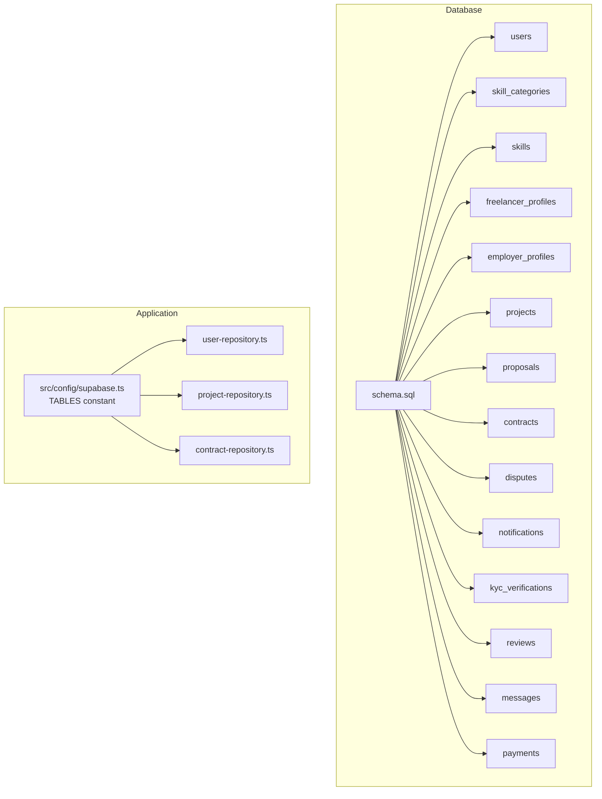
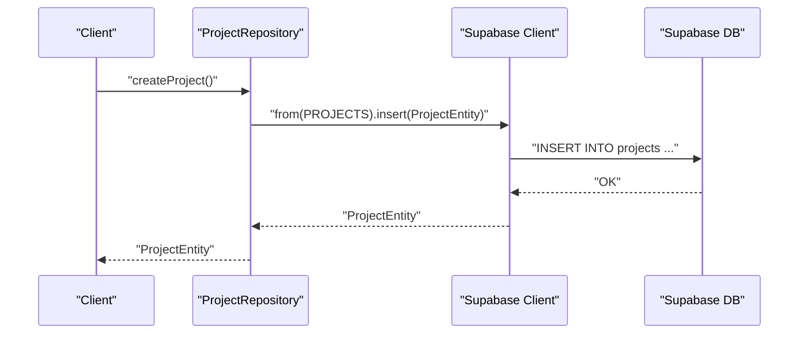
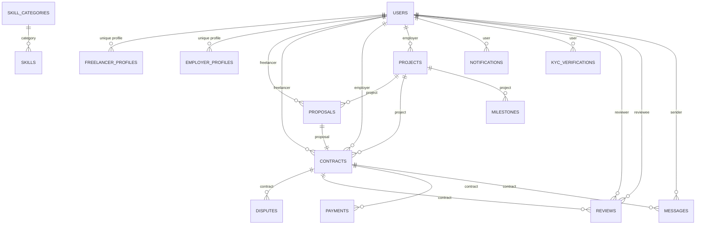

# Database Tables

<cite>
**Referenced Files in This Document**
- [schema.sql](file://supabase/schema.sql)
- [supabase.ts](file://src/config/supabase.ts)
- [entity-mapper.ts](file://src/utils/entity-mapper.ts)
- [user-repository.ts](file://src/repositories/user-repository.ts)
- [project-repository.ts](file://src/repositories/project-repository.ts)
- [contract-repository.ts](file://src/repositories/contract-repository.ts)
</cite>

## Table of Contents
1. [Introduction](#introduction)
2. [Project Structure](#project-structure)
3. [Core Components](#core-components)
4. [Architecture Overview](#architecture-overview)
5. [Detailed Component Analysis](#detailed-component-analysis)
6. [Dependency Analysis](#dependency-analysis)
7. [Performance Considerations](#performance-considerations)
8. [Troubleshooting Guide](#troubleshooting-guide)
9. [Conclusion](#conclusion)

## Introduction
This document provides comprehensive data model documentation for the FreelanceXchain Supabase PostgreSQL database. It details each table’s purpose, columns, data types, constraints, and relationships as defined in the schema. It also explains how the application accesses table names programmatically via the TABLES constant and demonstrates practical workflows such as project creation, proposal submission, and contract execution.

## Project Structure
The database schema is defined in a single SQL script and consumed by the application through a typed configuration constant that enumerates table names. The repository layer uses these names to perform CRUD operations against Supabase.



**Diagram sources**
- [schema.sql](file://supabase/schema.sql#L1-L261)
- [supabase.ts](file://src/config/supabase.ts#L6-L21)
- [user-repository.ts](file://src/repositories/user-repository.ts#L1-L58)
- [project-repository.ts](file://src/repositories/project-repository.ts#L1-L191)
- [contract-repository.ts](file://src/repositories/contract-repository.ts#L1-L139)

**Section sources**
- [schema.sql](file://supabase/schema.sql#L1-L261)
- [supabase.ts](file://src/config/supabase.ts#L6-L21)

## Core Components
This section summarizes each table’s purpose, primary key, and key constraints. All tables use UUID primary keys and timestamptz audit fields. Many tables enforce enumerated CHECK constraints for controlled statuses.

- users
  - Purpose: Stores user accounts with roles and optional wallet address.
  - Primary key: id (UUID)
  - Constraints: role must be one of ['freelancer', 'employer', 'admin']
  - Audit: created_at, updated_at (timestamptz)

- skill_categories
  - Purpose: Hierarchical grouping of skills.
  - Primary key: id (UUID)
  - Audit: created_at, updated_at (timestamptz)

- skills
  - Purpose: Individual skills linked to a category.
  - Primary key: id (UUID)
  - Foreign key: category_id -> skill_categories(id) (CASCADE DELETE)
  - Audit: created_at, updated_at (timestamptz)

- freelancer_profiles
  - Purpose: Freelancer-specific profile data.
  - Primary key: id (UUID)
  - Unique constraint: user_id -> users(id) (CASCADE DELETE)
  - Constraints: availability must be one of ['available', 'busy', 'unavailable']
  - Audit: created_at, updated_at (timestamptz)

- employer_profiles
  - Purpose: Employer-specific profile data.
  - Primary key: id (UUID)
  - Unique constraint: user_id -> users(id) (CASCADE DELETE)
  - Audit: created_at, updated_at (timestamptz)

- projects
  - Purpose: Job listings posted by employers.
  - Primary key: id (UUID)
  - Foreign key: employer_id -> users(id) (CASCADE DELETE)
  - Constraints: status must be one of ['draft', 'open', 'in_progress', 'completed', 'cancelled']
  - Audit: created_at, updated_at (timestamptz)

- proposals
  - Purpose: Freelancer bids for specific projects.
  - Primary key: id (UUID)
  - Foreign keys: project_id -> projects(id), freelancer_id -> users(id) (CASCADE DELETE)
  - Unique constraint: (project_id, freelancer_id)
  - Constraints: status must be one of ['pending', 'accepted', 'rejected', 'withdrawn']
  - Audit: created_at, updated_at (timestamptz)

- contracts
  - Purpose: Agreements between employer and freelancer.
  - Primary key: id (UUID)
  - Foreign keys: project_id -> projects(id), proposal_id -> proposals(id), freelancer_id -> users(id), employer_id -> users(id) (CASCADE DELETE)
  - Constraints: status must be one of ['active', 'completed', 'disputed', 'cancelled']
  - Audit: created_at, updated_at (timestamptz)

- disputes
  - Purpose: Dispute records for contracts.
  - Primary key: id (UUID)
  - Foreign key: contract_id -> contracts(id) (CASCADE DELETE)
  - Foreign key: initiator_id -> users(id) (CASCADE DELETE)
  - Constraints: status must be one of ['open', 'under_review', 'resolved']
  - Audit: created_at, updated_at (timestamptz)

- notifications
  - Purpose: User notifications.
  - Primary key: id (UUID)
  - Foreign key: user_id -> users(id) (CASCADE DELETE)
  - Audit: created_at, updated_at (timestamptz)

- kyc_verifications
  - Purpose: Identity verification records.
  - Primary key: id (UUID)
  - Foreign key: user_id -> users(id) (CASCADE DELETE)
  - Constraints: status must be one of ['pending', 'submitted', 'under_review', 'approved', 'rejected']
  - Audit: created_at, updated_at (timestamptz)

- reviews
  - Purpose: Ratings and feedback between parties.
  - Primary key: id (UUID)
  - Foreign keys: contract_id -> contracts(id), reviewer_id -> users(id), reviewee_id -> users(id) (CASCADE DELETE)
  - Constraints: rating must be between 1 and 5; reviewer_role must be one of ['freelancer', 'employer']
  - Unique constraint: (contract_id, reviewer_id)
  - Audit: created_at, updated_at (timestamptz)

- messages
  - Purpose: Communication between parties within a contract.
  - Primary key: id (UUID)
  - Foreign keys: contract_id -> contracts(id), sender_id -> users(id) (CASCADE DELETE)
  - Audit: created_at, updated_at (timestamptz)

- payments
  - Purpose: Transaction history for contracts.
  - Primary key: id (UUID)
  - Foreign keys: contract_id -> contracts(id), payer_id -> users(id), payee_id -> users(id) (CASCADE DELETE)
  - Constraints: status must be one of ['pending', 'processing', 'completed', 'failed', 'refunded']; payment_type must be one of ['escrow_deposit', 'milestone_release', 'refund', 'dispute_resolution']
  - Audit: created_at, updated_at (timestamptz)

**Section sources**
- [schema.sql](file://supabase/schema.sql#L7-L200)

## Architecture Overview
The application uses a typed TABLES constant to reference table names consistently. Repositories encapsulate database operations and rely on the Supabase client to query tables by name. Entities mirror database columns (snake_case) while service models use camelCase.



**Diagram sources**
- [supabase.ts](file://src/config/supabase.ts#L6-L21)
- [project-repository.ts](file://src/repositories/project-repository.ts#L30-L37)

## Detailed Component Analysis

### users
- Purpose: Central identity and authentication storage.
- Key constraints:
  - role CHECK
  - email UNIQUE
- Typical usage:
  - Create user, authenticate, update profile, link to profiles.

**Section sources**
- [schema.sql](file://supabase/schema.sql#L7-L17)
- [user-repository.ts](file://src/repositories/user-repository.ts#L1-L58)

### skill_categories and skills
- Purpose: Organize skills hierarchically.
- Relationships:
  - skills.category_id -> skill_categories.id (CASCADE DELETE)
- Typical usage:
  - Fetch categories for UI, attach skills to projects, filter by category.

**Section sources**
- [schema.sql](file://supabase/schema.sql#L19-L38)

### freelancer_profiles and employer_profiles
- Purpose: Role-specific profile data.
- Relationships:
  - Both profiles have a unique user_id -> users.id (CASCADE DELETE)
- Typical usage:
  - Retrieve profile by user, update availability/bio, display company info.

**Section sources**
- [schema.sql](file://supabase/schema.sql#L40-L62)

### projects
- Purpose: Listings posted by employers.
- Key constraints:
  - status CHECK
- Typical usage:
  - Create draft/open projects, filter by status, search by keyword, match by skills.

**Section sources**
- [schema.sql](file://supabase/schema.sql#L65-L78)
- [project-repository.ts](file://src/repositories/project-repository.ts#L55-L95)

### proposals
- Purpose: Freelancer applications to projects.
- Key constraints:
  - status CHECK
  - unique (project_id, freelancer_id)
- Typical usage:
  - Submit proposal, accept/reject, track status.

**Section sources**
- [schema.sql](file://supabase/schema.sql#L80-L92)

### contracts
- Purpose: Formal agreements derived from accepted proposals.
- Key constraints:
  - status CHECK
- Typical usage:
  - Create contract after proposal acceptance, track lifecycle.

**Section sources**
- [schema.sql](file://supabase/schema.sql#L94-L106)
- [contract-repository.ts](file://src/repositories/contract-repository.ts#L19-L34)

### disputes
- Purpose: Dispute lifecycle for contracts.
- Key constraints:
  - status CHECK
- Typical usage:
  - Initiate dispute, attach evidence, resolve.

**Section sources**
- [schema.sql](file://supabase/schema.sql#L108-L120)

### notifications
- Purpose: In-app alerts for users.
- Typical usage:
  - Create notifications for events like proposal accepted or payment released.

**Section sources**
- [schema.sql](file://supabase/schema.sql#L122-L133)

### kyc_verifications
- Purpose: Identity verification records.
- Key constraints:
  - status CHECK
- Typical usage:
  - Track verification progress, approve/reject.

**Section sources**
- [schema.sql](file://supabase/schema.sql#L135-L159)

### reviews
- Purpose: Ratings and feedback.
- Key constraints:
  - rating CHECK [1..5]
  - reviewer_role CHECK
  - unique (contract_id, reviewer_id)
- Typical usage:
  - Post reviews after contract completion.

**Section sources**
- [schema.sql](file://supabase/schema.sql#L161-L173)

### messages
- Purpose: Contract-related messaging.
- Typical usage:
  - Send messages, mark read/unread.

**Section sources**
- [schema.sql](file://supabase/schema.sql#L175-L184)

### payments
- Purpose: Payment lifecycle tracking.
- Key constraints:
  - status CHECK
  - payment_type CHECK
- Typical usage:
  - Record deposits, milestone releases, refunds.

**Section sources**
- [schema.sql](file://supabase/schema.sql#L186-L200)

### Programmatic Access to Tables
The application centralizes table names in a constant for safe, consistent access across repositories.

```mermaid
classDiagram
class SupabaseConfig {
+TABLES : {
USERS
FREELANCER_PROFILES
EMPLOYER_PROFILES
PROJECTS
PROPOSALS
CONTRACTS
DISPUTES
SKILLS
SKILL_CATEGORIES
NOTIFICATIONS
KYC_VERIFICATIONS
REVIEWS
MESSAGES
PAYMENTS
}
}
class UserRepository {
+constructor()
+createUser()
+getUserById()
+getUserByEmail()
+updateUser()
+deleteUser()
+emailExists()
}
class ProjectRepository {
+constructor()
+createProject()
+getProjectById()
+updateProject()
+deleteProject()
+getProjectsByEmployer()
+getAllOpenProjects()
+getProjectsByStatus()
+getProjectsBySkills()
+getProjectsByBudgetRange()
+searchProjects()
}
class ContractRepository {
+constructor()
+createContract()
+getContractById()
+updateContract()
+findContractByProposalId()
+getContractsByFreelancer()
+getContractsByEmployer()
+getContractsByProject()
+getContractsByStatus()
+getUserContracts()
}
SupabaseConfig <.. UserRepository : "TABLES.USERS"
SupabaseConfig <.. ProjectRepository : "TABLES.PROJECTS"
SupabaseConfig <.. ContractRepository : "TABLES.CONTRACTS"
```

**Diagram sources**
- [supabase.ts](file://src/config/supabase.ts#L6-L21)
- [user-repository.ts](file://src/repositories/user-repository.ts#L1-L58)
- [project-repository.ts](file://src/repositories/project-repository.ts#L1-L191)
- [contract-repository.ts](file://src/repositories/contract-repository.ts#L1-L139)

**Section sources**
- [supabase.ts](file://src/config/supabase.ts#L6-L21)

## Dependency Analysis
The schema defines referential integrity across entities. The following diagram shows primary foreign key relationships:



**Diagram sources**
- [schema.sql](file://supabase/schema.sql#L7-L200)

**Section sources**
- [schema.sql](file://supabase/schema.sql#L7-L200)

## Performance Considerations
- Indexes are defined on frequently queried columns to improve performance:
  - users(email)
  - profiles(user_id)
  - projects(employer_id, status)
  - proposals(project_id, freelancer_id)
  - contracts(freelancer_id, employer_id)
  - disputes(contract_id)
  - notifications(user_id, is_read)
  - kyc_verifications(user_id)
  - skills(category_id)
  - reviews(contract_id, reviewee_id)
  - messages(contract_id, sender_id)
  - payments(contract_id, payer_id, payee_id)
- RLS policies enable row-level security on all tables, which can impact query performance depending on policy complexity.

**Section sources**
- [schema.sql](file://supabase/schema.sql#L202-L261)

## Troubleshooting Guide
- Connection verification:
  - The initialization routine queries a simple table to confirm connectivity and throws on unexpected errors.
- Common issues:
  - Missing environment variables for Supabase URL and anon key cause initialization failures.
  - Unique constraint violations occur when inserting proposals with repeated (project_id, freelancer_id).
  - CHECK constraint violations arise from invalid enumerated values for status or rating fields.
  - RLS policies may restrict reads/writes; ensure service role or appropriate policies are configured.

**Section sources**
- [supabase.ts](file://src/config/supabase.ts#L25-L45)
- [schema.sql](file://supabase/schema.sql#L10-L17)
- [schema.sql](file://supabase/schema.sql#L80-L92)
- [schema.sql](file://supabase/schema.sql#L161-L173)

## Conclusion
The FreelanceXchain database schema establishes a robust foundation for a freelance marketplace with clear separation of concerns across users, projects, proposals, contracts, and financial/compliance workflows. The typed TABLES constant ensures consistent table access across repositories, while CHECK constraints and indexes support data integrity and performance. The documented relationships and programmatic access patterns enable reliable development and maintenance of the platform.