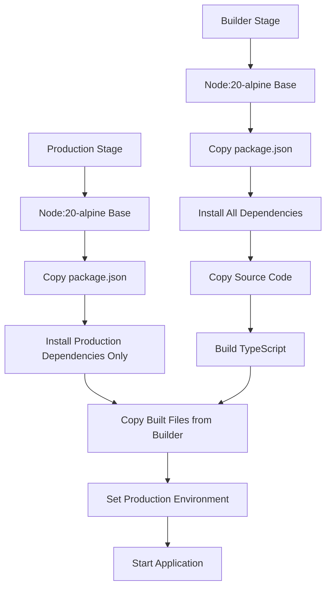
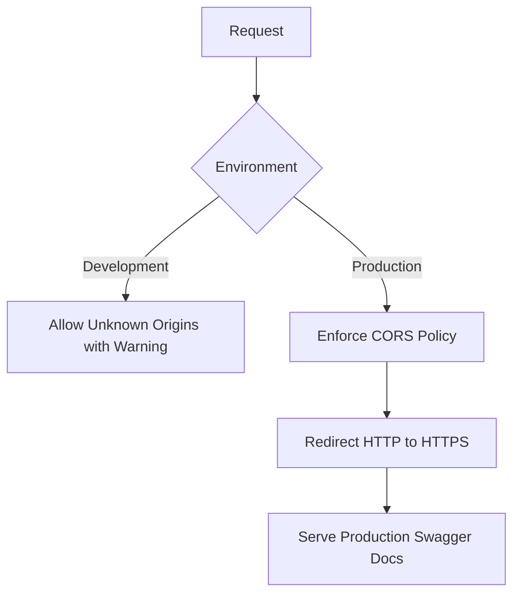
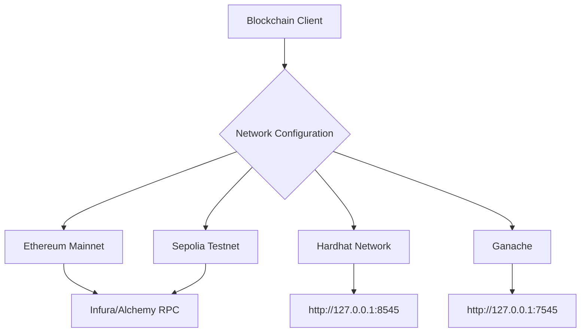
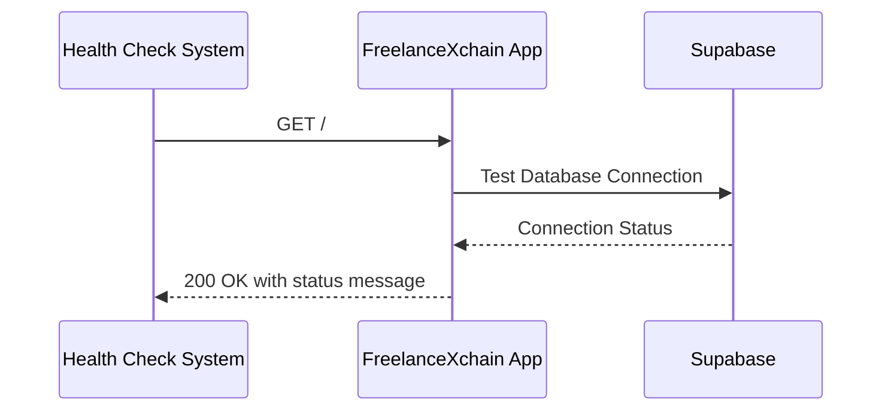

# Deployment Configuration

<cite>
**Referenced Files in This Document**   
- [.env.example](file://.env.example)
- [Dockerfile](file://Dockerfile)
- [package.json](file://package.json)
- [src/config/env.ts](file://src/config/env.ts)
- [src/config/supabase.ts](file://src/config/supabase.ts)
- [src/services/web3-client.ts](file://src/services/web3-client.ts)
- [src/services/blockchain-client.ts](file://src/services/blockchain-client.ts)
- [src/app.ts](file://src/app.ts)
- [src/index.ts](file://src/index.ts)
- [src/middleware/security-middleware.ts](file://src/middleware/security-middleware.ts)
- [src/config/swagger.ts](file://src/config/swagger.ts)
- [supabase/schema.sql](file://supabase/schema.sql)
- [hardhat.config.cjs](file://hardhat.config.cjs)
</cite>

## Table of Contents
1. [Environment Variable Configuration](#environment-variable-configuration)
2. [Docker Containerization Strategy](#docker-containerization-strategy)
3. [Deployment Configurations by Environment](#deployment-configurations-by-environment)
4. [Blockchain Network Configuration](#blockchain-network-configuration)
5. [Secret Management](#secret-management)
6. [Health Check Endpoints and Monitoring](#health-check-endpoints-and-monitoring)
7. [Rollback Procedures and Zero-Downtime Deployment](#rollback-procedures-and-zero-downtime-deployment)

## Environment Variable Configuration

FreelanceXchain uses environment variables for configuration, managed through `.env` files. The application loads configuration via `dotenv` and validates required fields at startup.

### Core Environment Variables

The following environment variables are essential for FreelanceXchain operation:

```env
# Server Configuration
PORT=3000
NODE_ENV=development

# Supabase Configuration
SUPABASE_URL=https://your-project.supabase.co
SUPABASE_ANON_KEY=your-anon-key
SUPABASE_SERVICE_ROLE_KEY=your-service-role-key

# JWT Configuration
JWT_SECRET=your-jwt-secret-key-min-32-chars-change-this
JWT_REFRESH_SECRET=your-refresh-token-secret-key-min-32-chars
JWT_EXPIRES_IN=1h
JWT_REFRESH_EXPIRES_IN=7d

# CORS Configuration
CORS_ORIGIN=http://localhost:3000,https://your-frontend.com

# LLM Configuration
LLM_API_KEY=your-llm-api-key
LLM_API_URL=https://your-llm-api-endpoint

# Blockchain Configuration
BLOCKCHAIN_RPC_URL=https://sepolia.infura.io/v3/your-infura-project-id
INFURA_API_KEY=your-infura-project-id
```

**Section sources**
- [.env.example](file://.env.example)
- [src/config/env.ts](file://src/config/env.ts)

### Configuration Validation

The `src/config/env.ts` file implements robust environment variable validation with type safety. Required variables throw errors if missing, while optional variables return `undefined`. The configuration system includes:

- String validation with required/optional variants
- Number parsing with validation
- Default value support
- Type-safe configuration object with `as const`

The configuration is accessible throughout the application via the exported `config` object, which provides typed access to all environment settings.

**Section sources**
- [src/config/env.ts](file://src/config/env.ts)

## Docker Containerization Strategy

FreelanceXchain employs a multi-stage Docker build process to create optimized, secure production images while maintaining development flexibility.

### Multi-Stage Build Process

The Dockerfile implements a two-stage build process:



**Diagram sources**
- [Dockerfile](file://Dockerfile)

### Build Optimization

The multi-stage approach provides several advantages:

- **Smaller Image Size**: Development dependencies are excluded from the final image
- **Security**: Source code and build tools are not included in the production container
- **Performance**: Optimized for production runtime
- **Consistency**: Reproducible builds across environments

The production stage uses `npm ci --omit=dev` to install only production dependencies, significantly reducing the attack surface and image size.

**Section sources**
- [Dockerfile](file://Dockerfile)
- [package.json](file://package.json)

## Deployment Configurations by Environment

FreelanceXchain supports different deployment configurations for development, staging, and production environments through environment-specific settings.

### Environment-Specific Settings

The application differentiates behavior based on the `NODE_ENV` environment variable:

- **Development**: CORS warnings but allows requests, Swagger documentation from source files
- **Production**: Strict CORS enforcement, HTTPS redirection, optimized Swagger paths



**Diagram sources**
- [src/middleware/security-middleware.ts](file://src/middleware/security-middleware.ts)
- [src/config/swagger.ts](file://src/config/swagger.ts)

### Supabase Project Setup

For Supabase integration, create a new project and configure:

1. Database schema using `supabase/schema.sql`
2. Environment variables with project URL and keys
3. Row Level Security (RLS) policies as defined in the schema
4. Authentication settings for user management

The schema includes comprehensive RLS policies, with service role bypass for backend operations and public read access for certain tables.

**Section sources**
- [supabase/schema.sql](file://supabase/schema.sql)
- [src/config/supabase.ts](file://src/config/supabase.ts)

### Custom Domain and SSL Configuration

For production deployments with custom domains:

1. Configure DNS to point to your deployment
2. Set up SSL termination at the load balancer or reverse proxy level
3. Update `CORS_ORIGIN` to include your domain
4. Ensure `BASE_URL` reflects the production domain

The application automatically enforces HTTPS in production through the `httpsEnforcement` middleware, redirecting HTTP requests to HTTPS.

**Section sources**
- [src/middleware/security-middleware.ts](file://src/middleware/security-middleware.ts)
- [src/config/env.ts](file://src/config/env.ts)

## Blockchain Network Configuration

FreelanceXchain supports multiple blockchain networks through configurable RPC endpoints and network settings.

### Supported Networks

The application can connect to:

- **Ethereum Mainnet**: Production blockchain transactions
- **Sepolia Testnet**: Testing with real blockchain behavior
- **Local Hardhat Network**: Development and testing
- **Ganache**: Local blockchain for development



**Diagram sources**
- [hardhat.config.cjs](file://hardhat.config.cjs)
- [src/services/web3-client.ts](file://src/services/web3-client.ts)

### Network Configuration

Blockchain settings are configured through environment variables:

- `BLOCKCHAIN_RPC_URL`: RPC endpoint for the blockchain network
- `BLOCKCHAIN_PRIVATE_KEY`: Private key for transaction signing (required for write operations)
- `INFURA_API_KEY`: Infura project ID for accessing Ethereum networks

The `hardhat.config.cjs` file defines network configurations for deployment scripts, including Sepolia, Polygon, and Mumbai testnet.

**Section sources**
- [hardhat.config.cjs](file://hardhat.config.cjs)
- [src/services/web3-client.ts](file://src/services/web3-client.ts)

## Secret Management

FreelanceXchain implements multiple strategies for secure secret management across different deployment environments.

### Environment Variable Approach

For most deployments, secrets are managed through environment variables:

- Database connection strings
- JWT secrets
- API keys
- Blockchain private keys

The application validates required environment variables at startup and throws descriptive errors for missing configuration.

### Secure Secret Storage

For production deployments, consider using secure secret management services:

- **AWS Secrets Manager** or **Parameter Store**
- **Google Cloud Secret Manager**
- **Azure Key Vault**
- **Hashicorp Vault**

These services provide secure storage, access control, rotation capabilities, and audit logging for sensitive credentials.

**Section sources**
- [src/config/env.ts](file://src/config/env.ts)
- [.env.example](file://.env.example)

## Health Check Endpoints and Monitoring

FreelanceXchain includes built-in health check endpoints and monitoring recommendations for production deployments.

### Health Check Endpoint

The application provides a root endpoint for health checks:



**Diagram sources**
- [src/app.ts](file://src/app.ts)
- [src/index.ts](file://src/index.ts)

### Monitoring Recommendations

For production monitoring, implement:

- **Application Performance Monitoring (APM)**: Track response times, error rates, and throughput
- **Log Aggregation**: Centralize logs for analysis and troubleshooting
- **Database Monitoring**: Track query performance and connection metrics
- **Blockchain Interaction Monitoring**: Monitor transaction success rates and confirmation times

The application includes request ID generation for tracing requests across systems and comprehensive error handling with structured error responses.

**Section sources**
- [src/app.ts](file://src/app.ts)
- [src/middleware/error-handler.ts](file://src/middleware/error-handler.ts)

## Rollback Procedures and Zero-Downtime Deployment

FreelanceXchain supports robust deployment strategies for maintaining service availability during updates.

### Zero-Downtime Deployment

Implement zero-downtime deployments using:

- **Blue-Green Deployment**: Maintain two identical environments and switch traffic between them
- **Rolling Updates**: Gradually replace instances with new versions
- **Container Orchestration**: Use Kubernetes or similar platforms for automated rolling updates

The application handles graceful shutdown through signal handling (`SIGTERM`, `SIGINT`), allowing in-flight requests to complete before termination.

### Rollback Procedures

For rollback scenarios:

1. **Containerized Deployments**: Revert to previous image tag
2. **Infrastructure as Code**: Deploy previous configuration version
3. **Database Migrations**: Implement reversible migrations with rollback scripts

The multi-stage Docker build ensures that only fully built and tested images are deployed, reducing the risk of deployment failures.

**Section sources**
- [src/index.ts](file://src/index.ts)
- [Dockerfile](file://Dockerfile)