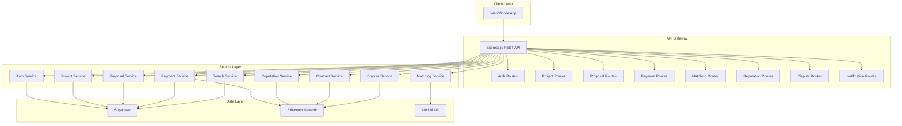
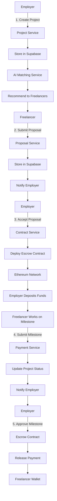

# Project Overview

<cite>
**Referenced Files in This Document**   
- [README.md](file://README.md)
- [ARCHITECTURE.md](file://docs/ARCHITECTURE.md)
- [CAPSTONE-PROJECT.md](file://docs/CAPSTONE-PROJECT.md)
- [app.ts](file://src/app.ts)
- [index.ts](file://src/index.ts)
- [FreelanceEscrow.sol](file://contracts/FreelanceEscrow.sol)
- [FreelanceReputation.sol](file://contracts/FreelanceReputation.sol)
- [contract-service.ts](file://src/services/contract-service.ts)
- [payment-service.ts](file://src/services/payment-service.ts)
- [matching-service.ts](file://src/services/matching-service.ts)
- [kyc-service.ts](file://src/services/kyc-service.ts)
- [schema.sql](file://supabase/schema.sql)
- [project-routes.ts](file://src/routes/project-routes.ts)
- [proposal-routes.ts](file://src/routes/proposal-routes.ts)
</cite>

## Table of Contents
1. [Introduction](#introduction)
2. [Core Value Proposition](#core-value-proposition)
3. [High-Level Architecture](#high-level-architecture)
4. [Key User Workflows](#key-user-workflows)
5. [System Context Diagrams](#system-context-diagrams)
6. [Real-World Use Cases and Business Benefits](#real-world-use-cases-and-business-benefits)
7. [Conclusion](#conclusion)

## Introduction

FreelanceXchain is a decentralized freelance marketplace that combines blockchain security with AI-powered skill matching to address fundamental challenges in the gig economy. The platform leverages cutting-edge technologies to create a fair, transparent, and efficient ecosystem for freelancers and employers worldwide. By integrating blockchain technology for secure transactions and immutable reputation systems with artificial intelligence for intelligent skill matching, FreelanceXchain eliminates many of the pain points associated with traditional freelance platforms.

The platform was designed to address key issues in the gig economy, including unfair payment practices, lack of transparent reputation systems, high platform fees, and skill mismatches between freelancers and projects. FreelanceXchain aligns with United Nations Sustainable Development Goals (SDGs) 8 (Decent Work and Economic Growth), 9 (Industry, Innovation, and Infrastructure), and 16 (Peace, Justice, and Strong Institutions) by promoting fair labor practices, technological innovation, and transparent governance in the digital work economy.

**Section sources**
- [README.md](file://README.md#L1-L247)
- [CAPSTONE-PROJECT.md](file://docs/CAPSTONE-PROJECT.md#L1-L299)

## Core Value Proposition

FreelanceXchain offers a comprehensive solution to the challenges faced by both freelancers and employers in the global gig economy through four core value propositions: secure escrow payments, on-chain reputation, privacy-preserving KYC, and intelligent project-freelancer matching.

### Secure Escrow Payments

The platform implements a milestone-based payment system powered by Ethereum smart contracts, specifically the FreelanceEscrow.sol contract. This system ensures that funds are securely held in escrow until project milestones are completed and approved by the employer. The smart contract automates payment releases, eliminating payment delays and reducing the risk of non-payment. Employers deposit the full project budget into the escrow contract upon contract creation, and funds are released incrementally as milestones are approved. The system includes dispute resolution mechanisms where an arbiter can resolve conflicts between parties, ensuring fair outcomes. Reentrancy guards and other security measures are implemented to protect against common smart contract vulnerabilities.

### On-Chain Reputation

FreelanceXchain establishes a tamper-proof, portable reputation system through the FreelanceReputation.sol smart contract. Unlike traditional platforms where reputation data is siloed and vulnerable to manipulation, this system records all ratings and reviews on the blockchain, creating an immutable work history for each user. The reputation system prevents duplicate ratings per contract and provides transparent, verifiable feedback that freelancers can carry across platforms. This portability reduces platform lock-in and enables career mobility, allowing freelancers to build a permanent, trustworthy professional record that isn't dependent on any single platform.

### Privacy-Preserving KYC

The platform implements a privacy-preserving Know Your Customer (KYC) verification system that balances regulatory compliance with user privacy. The KYCVerification.sol smart contract enables identity verification while allowing for selective disclosure of personal information. Users can verify their identity without exposing sensitive data unnecessarily, and the system supports various document types across multiple countries with tiered verification levels. The implementation includes liveness checks and face matching to prevent identity fraud while maintaining user control over their personal data.

### Intelligent Project-Freelancer Matching

At the heart of FreelanceXchain is an AI-powered skill matching engine that connects freelancers with suitable projects based on verified skills, experience, and project requirements. The matching-service.ts implementation uses machine learning algorithms to analyze complex data points including skills, experience levels, project requirements, communication styles, and historical performance. The system continuously learns from project outcomes and user feedback to refine its recommendations over time. It also provides explainable AI features that give users transparent rationales for recommendations, building trust in the automated matching process.

**Section sources**
- [README.md](file://README.md#L1-L247)
- [CAPSTONE-PROJECT.md](file://docs/CAPSTONE-PROJECT.md#L1-L299)
- [FreelanceEscrow.sol](file://contracts/FreelanceEscrow.sol#L1-L264)
- [FreelanceReputation.sol](file://contracts/FreelanceReputation.sol#L1-L183)
- [kyc-service.ts](file://src/services/kyc-service.ts#L1-L547)
- [matching-service.ts](file://src/services/matching-service.ts#L1-L391)

## High-Level Architecture

FreelanceXchain employs a multi-layered architecture that integrates traditional backend services with blockchain technology and AI capabilities. The system follows a microservices-inspired design with clear separation of concerns between different functional components.

The platform is built on a Node.js/TypeScript backend with Express.js for the REST API, providing a robust foundation for handling business logic and user interactions. Supabase, a PostgreSQL-based database solution, serves as the primary data store for user profiles, projects, proposals, and other application data. This traditional backend layer handles authentication, authorization, and data management, ensuring efficient data retrieval and storage.

The blockchain layer, built on Ethereum-compatible smart contracts, handles critical functions that require decentralization, immutability, and trustless execution. The core smart contracts include FreelanceEscrow.sol for milestone-based payments, FreelanceReputation.sol for on-chain reputation, and KYCVerification.sol for identity verification. These contracts are deployed on the Ethereum network (initially on testnets like Sepolia) and interact with the backend through Web3.js or Ethers.js libraries.

The AI layer integrates with external LLM (Large Language Model) APIs to power the intelligent matching system. This layer processes natural language descriptions of projects and freelancer profiles to extract skills, analyze requirements, and generate recommendations. The AI system also performs gap analysis to identify skill deficiencies and suggest professional development opportunities for freelancers.

Security is implemented at multiple levels, including HTTPS/TLS for transport security, JWT-based authentication with role-based access control, Supabase Row Level Security (RLS) for database security, and smart contract security measures like reentrancy guards and access modifiers. The architecture also includes comprehensive logging and monitoring to ensure system transparency and facilitate regulatory compliance.

**Section sources**
- [README.md](file://README.md#L1-L247)
- [ARCHITECTURE.md](file://docs/ARCHITECTURE.md#L1-L218)
- [app.ts](file://src/app.ts#L1-L87)
- [index.ts](file://src/index.ts#L1-L53)

## Key User Workflows

FreelanceXchain supports several key user workflows that cover the complete lifecycle of freelance engagements, from project creation to completion and payment.

### Project Posting

Employers begin by creating a project through the platform's API, specifying details such as title, description, required skills, budget, and deadline. The project-routes.ts implementation handles this workflow, validating input data and storing the project in the Supabase database. Employers can then define milestone-based payment schedules, with each milestone including a title, description, amount, and due date. The system validates that the sum of milestone amounts equals the total project budget. Once published, the project becomes visible to freelancers in the marketplace.

### Proposal Submission

Freelancers browse available projects and submit proposals for those that match their skills and interests. The proposal-routes.ts implementation manages this workflow, allowing freelancers to provide a cover letter, proposed rate, and estimated duration for project completion. The system prevents duplicate proposals for the same project-freelancer combination. AI-powered recommendations help freelancers discover relevant projects through the matching-service.ts implementation, which analyzes skill compatibility and generates personalized project suggestions.

### Contract Execution

When an employer accepts a proposal, the system automatically creates a smart contract on the blockchain. The contract-service.ts implementation orchestrates this process, initializing the FreelanceEscrow contract with the agreed-upon terms, including the freelancer, employer, arbiter, contract ID, and milestone details. The employer deposits the full project budget into the escrow contract, which holds the funds securely until milestones are approved. The contract establishes the legal and financial framework for the engagement, with all terms recorded immutably on the blockchain.

### Milestone-Based Payments

As work progresses, freelancers submit completed milestones through the platform. The payment-service.ts implementation handles this workflow, updating the project status and triggering notifications to the employer. Employers review the submitted work and approve milestones when satisfied. Upon approval, the smart contract automatically releases payment to the freelancer's wallet address. The system tracks all payment transactions on both the blockchain and in the Supabase database, providing a complete audit trail. If a milestone is disputed, the system initiates a dispute resolution process.

### Dispute Resolution

When parties cannot agree on milestone completion, either party can initiate a dispute through the platform. The payment-service.ts implementation manages dispute creation, recording the reason and any supporting evidence. The dispute is then reviewed by an arbiter, who has the authority to resolve the conflict in favor of either party. The FreelanceEscrow smart contract implements the dispute resolution logic, allowing the arbiter to release funds to the freelancer or refund them to the employer based on their decision. All dispute outcomes are recorded on the blockchain for transparency.

**Section sources**
- [project-routes.ts](file://src/routes/project-routes.ts#L1-L684)
- [proposal-routes.ts](file://src/routes/proposal-routes.ts#L1-L458)
- [contract-service.ts](file://src/services/contract-service.ts#L1-L140)
- [payment-service.ts](file://src/services/payment-service.ts#L1-L643)

## System Context Diagrams

**Diagram sources**
- [ARCHITECTURE.md](file://docs/ARCHITECTURE.md#L34-L85)
- [app.ts](file://src/app.ts#L1-L87)
- [project-routes.ts](file://src/routes/project-routes.ts#L1-L684)

**Diagram sources**
- [project-routes.ts](file://src/routes/project-routes.ts#L1-L684)
- [proposal-routes.ts](file://src/routes/proposal-routes.ts#L1-L458)
- [payment-service.ts](file://src/services/payment-service.ts#L1-L643)
- [contract-service.ts](file://src/services/contract-service.ts#L1-L140)

## Real-World Use Cases and Business Benefits

FreelanceXchain delivers significant business benefits for both freelancers and employers through its innovative combination of blockchain and AI technologies.

For freelancers, particularly those in developing economies, the platform offers enhanced income security through guaranteed payments via escrow contracts. The elimination of platform fees (replaced by lower blockchain transaction costs) allows freelancers to retain a larger share of their earnings. The portable, tamper-proof reputation system enables career mobility across platforms, reducing dependency on any single marketplace. AI-powered recommendations help freelancers discover high-quality projects that match their skills, increasing their chances of successful engagements and repeat business. The skill gap analysis feature provides personalized guidance for professional development, helping freelancers stay competitive in the evolving job market.

For employers and small-to-medium enterprises (SMEs), the platform reduces hiring risks through accurate AI-powered skill matching and verified freelancer profiles. The transparent payment system with milestone-based releases ensures that funds are only disbursed upon satisfactory completion of work, protecting against project failure. Cross-border payment capabilities facilitate international hiring without the high fees and delays associated with traditional banking systems. The immutable record of work history and performance reviews helps employers make informed hiring decisions and build trusted relationships with freelancers.

The platform also benefits policymakers and labor institutions by providing transparent, auditable records of digital work transactions. This data can support labor market analysis, regulatory oversight, and the development of fair work standards in the platform economy. Technology developers can leverage the platform's APIs and smart contract integrations to build complementary services and extend the ecosystem.

By addressing the structural inefficiencies of traditional freelance platforms, FreelanceXchain creates a more equitable, transparent, and efficient marketplace that benefits all stakeholders in the digital economy.

**Section sources**
- [CAPSTONE-PROJECT.md](file://docs/CAPSTONE-PROJECT.md#L1-L299)
- [README.md](file://README.md#L1-L247)

## Conclusion

FreelanceXchain represents a significant advancement in the evolution of freelance marketplaces by combining blockchain security with AI-powered intelligence. The platform successfully addresses key challenges in the gig economy through its innovative architecture and feature set. By implementing secure escrow payments, on-chain reputation systems, privacy-preserving KYC, and intelligent matching algorithms, FreelanceXchain creates a more trustworthy, efficient, and equitable environment for digital work.

The integration of blockchain technology ensures transparency, immutability, and trustless execution of financial transactions, while the AI components enhance the quality of matches between freelancers and projects. The platform's multi-layered architecture effectively combines traditional backend services with decentralized technologies, creating a robust and scalable solution.

While the platform faces challenges related to blockchain scalability, user adoption of decentralized technologies, and regulatory uncertainty, its design provides a strong foundation for addressing these issues through incremental improvements and hybrid governance models. As the gig economy continues to grow, solutions like FreelanceXchain offer a promising path toward more sustainable and inclusive digital work ecosystems.

[No sources needed since this section summarizes without analyzing specific files]