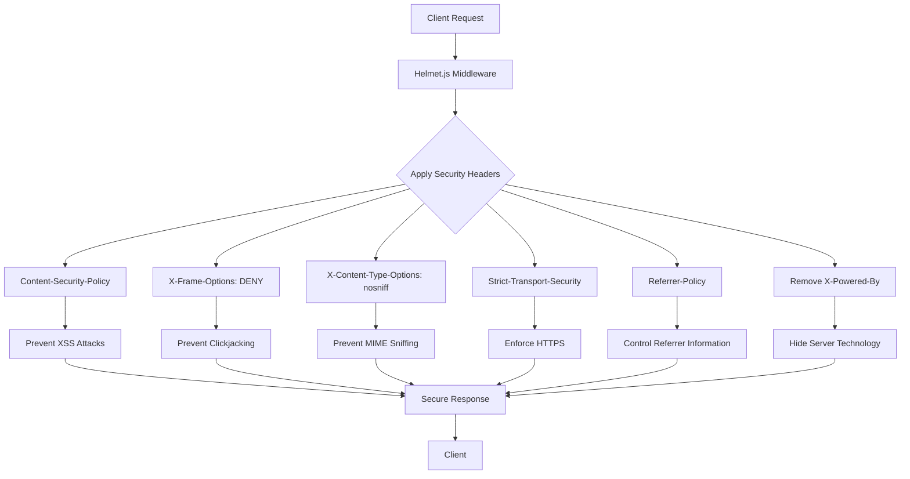
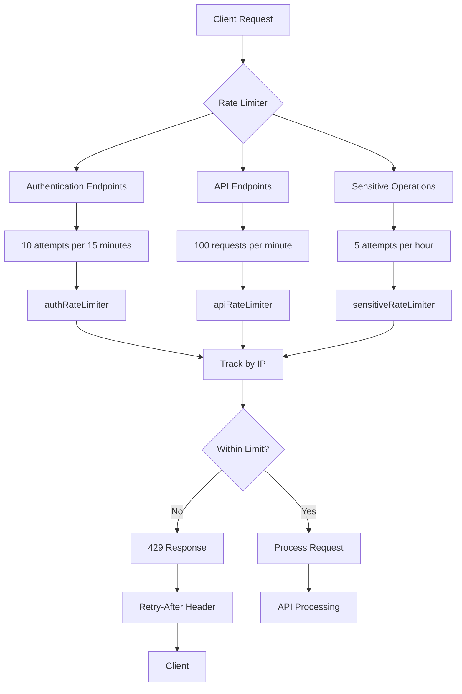
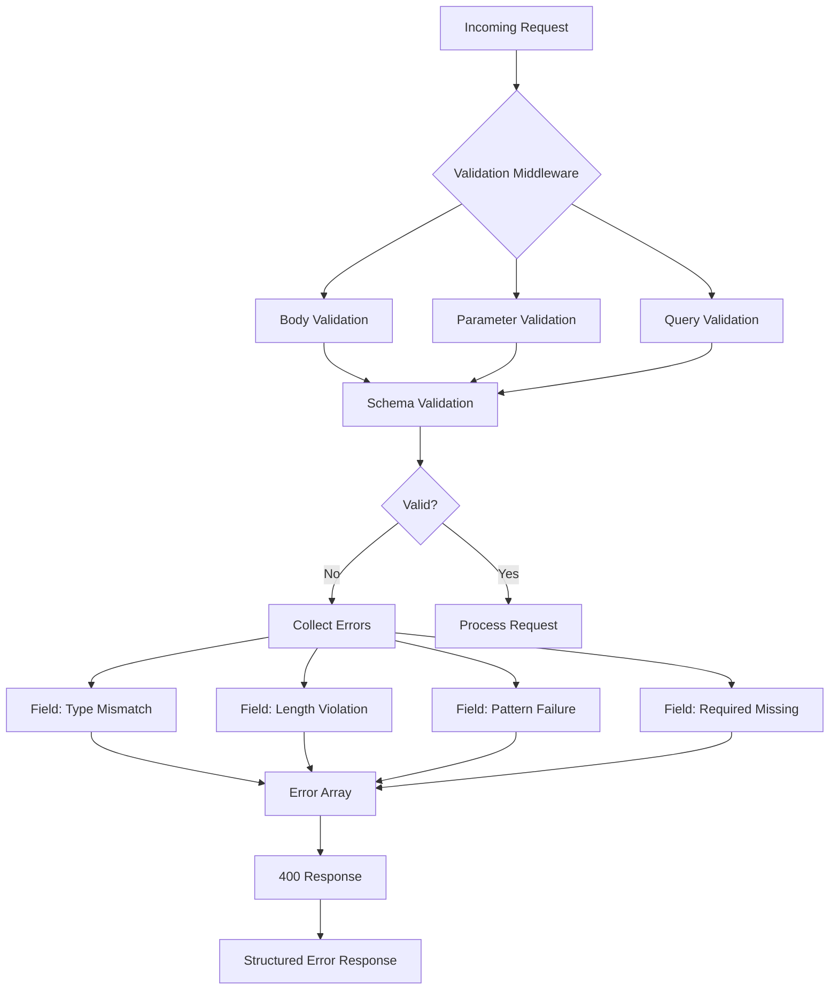
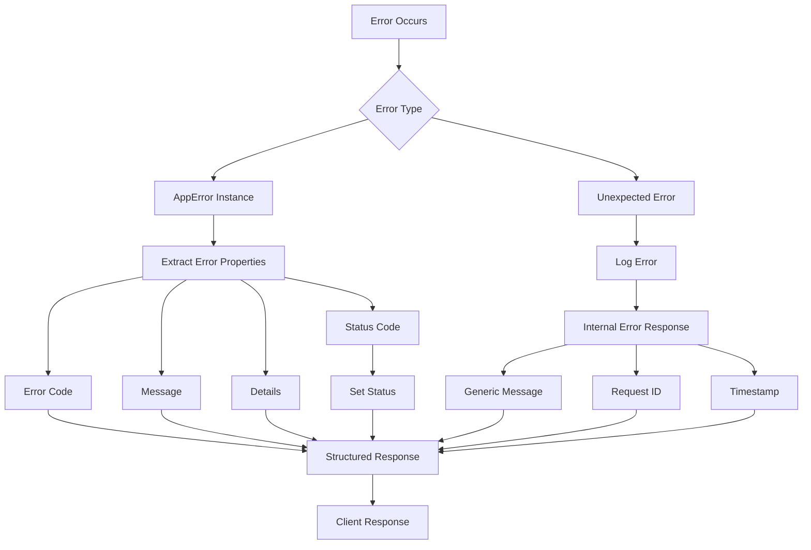
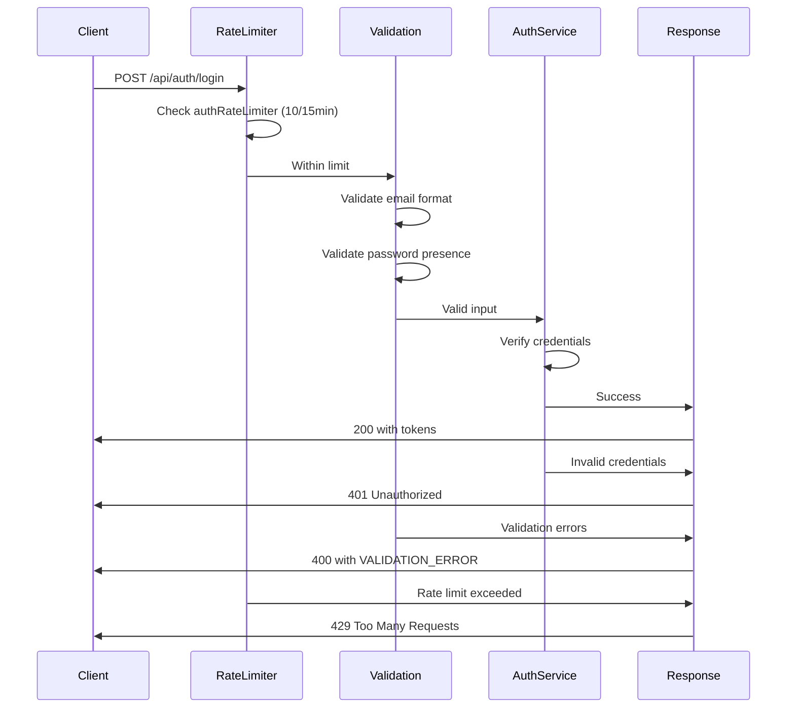
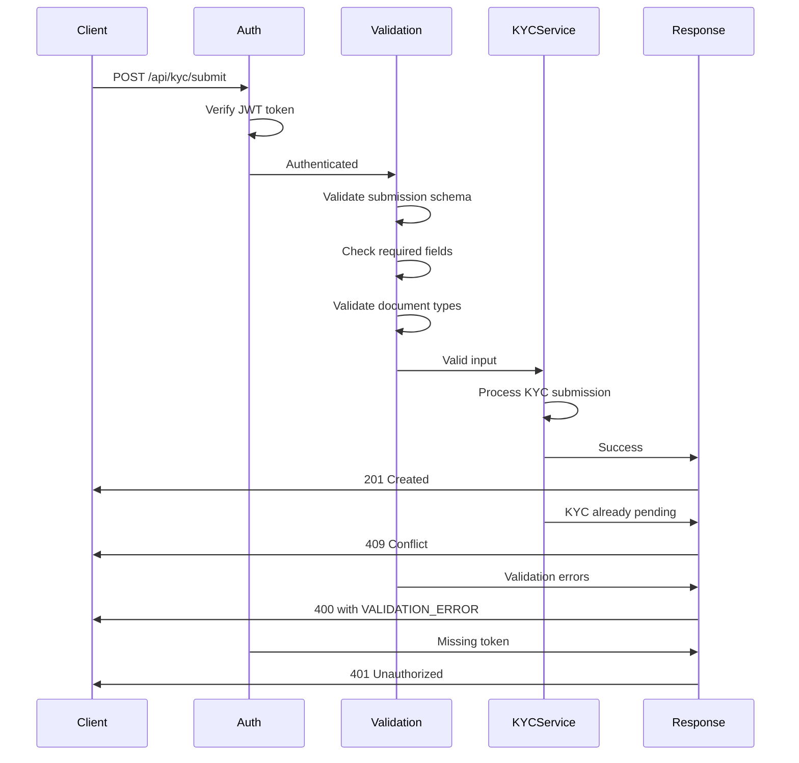
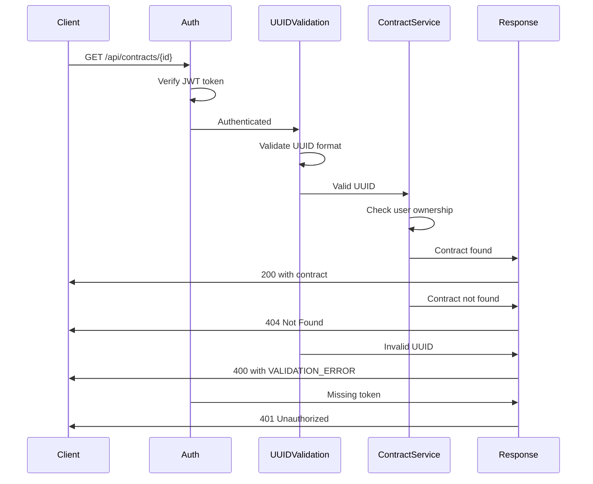

# API Security Measures

<cite>
**Referenced Files in This Document**   
- [security-middleware.ts](file://src/middleware/security-middleware.ts)
- [validation-middleware.ts](file://src/middleware/validation-middleware.ts)
- [rate-limiter.ts](file://src/middleware/rate-limiter.ts)
- [error-handler.ts](file://src/middleware/error-handler.ts)
- [auth-middleware.ts](file://src/middleware/auth-middleware.ts)
- [app.ts](file://src/app.ts)
- [auth-routes.ts](file://src/routes/auth-routes.ts)
- [kyc-routes.ts](file://src/routes/kyc-routes.ts)
- [contract-routes.ts](file://src/routes/contract-routes.ts)
- [index.ts](file://src/middleware/index.ts)
- [TECHNICAL-SPECS.md](file://docs/TECHNICAL-SPECS.md)
</cite>

## Table of Contents
1. [Introduction](#introduction)
2. [HTTP Header Hardening with Helmet.js](#http-header-hardening-with-helmetjs)
3. [Rate Limiting and DDoS Protection](#rate-limiting-and-ddos-protection)
4. [Input Validation and Data Integrity](#input-validation-and-data-integrity)
5. [Error Handling Standardization](#error-handling-standardization)
6. [CORS Configuration and CSRF Protection](#cors-configuration-and-csrf-protection)
7. [Secured Endpoint Examples](#secured-endpoint-examples)
8. [OWASP Top 10 Mitigation](#owasp-top-10-mitigation)
9. [Conclusion](#conclusion)

## Introduction
The FreelanceXchain API implements a comprehensive security framework to protect against common web vulnerabilities and ensure data integrity. The security architecture is built around several key components: HTTP header hardening using Helmet.js, rate limiting to prevent abuse, robust input validation, standardized error handling, and strict CORS policies. These measures work together to create a secure environment for users to conduct freelance transactions on the blockchain-based platform. The implementation follows industry best practices and addresses multiple OWASP Top 10 vulnerabilities through proactive security controls.

**Section sources**
- [security-middleware.ts](file://src/middleware/security-middleware.ts#L1-L123)
- [TECHNICAL-SPECS.md](file://docs/TECHNICAL-SPECS.md#L328-L359)

## HTTP Header Hardening with Helmet.js
The FreelanceXchain API employs Helmet.js middleware to enhance security through HTTP header configuration. This approach mitigates several common web vulnerabilities by setting appropriate security headers that browsers and clients will respect. The security headers are implemented as middleware in the application stack, ensuring they are applied to all responses.

The Content Security Policy (CSP) is configured with a restrictive directive set that limits content sources to the same origin by default. The policy allows scripts from the same origin and includes 'unsafe-inline' to accommodate Swagger UI functionality and Supabase integration. The connect-src directive specifically permits connections to the Supabase database, ensuring secure data access while preventing unauthorized external connections.



**Diagram sources**
- [security-middleware.ts](file://src/middleware/security-middleware.ts#L18-L50)

**Section sources**
- [security-middleware.ts](file://src/middleware/security-middleware.ts#L18-L50)
- [TECHNICAL-SPECS.md](file://docs/TECHNICAL-SPECS.md#L341-L351)

The implementation includes several key security headers:
- **X-Frame-Options**: Set to 'DENY' to prevent clickjacking attacks by disallowing the page from being framed
- **X-Content-Type-Options**: Set to 'nosniff' to prevent MIME type sniffing and potential content injection attacks
- **X-XSS-Protection**: Enabled to leverage browser XSS filters for additional client-side protection
- **Strict-Transport-Security (HSTS)**: Configured with a max-age of 31536000 seconds (1 year), including subdomains and preload directives to enforce HTTPS connections
- **Referrer-Policy**: Set to 'strict-origin-when-cross-origin' to control referrer information disclosure
- **X-Powered-By**: Removed to hide server technology details from potential attackers

Additionally, the security middleware includes request ID generation using UUID v4, which provides unique identifiers for each request to facilitate logging and debugging while maintaining security. The request ID is generated if not provided in the headers, ensuring consistent tracking across the system.

## Rate Limiting and DDoS Protection
FreelanceXchain implements a comprehensive rate limiting system to prevent abuse and protect against DDoS attacks. The rate limiting middleware is designed to control the number of requests a client can make within a specified time window, effectively mitigating brute force attacks, credential stuffing, and service exhaustion attacks.

The rate limiting system is implemented through a custom middleware that tracks request counts per client IP address using in-memory stores. The implementation provides different rate limiting profiles for various types of endpoints based on their sensitivity and usage patterns:



**Diagram sources**
- [rate-limiter.ts](file://src/middleware/rate-limiter.ts#L27-L81)

**Section sources**
- [rate-limiter.ts](file://src/middleware/rate-limiter.ts#L27-L81)

The system implements three primary rate limiting configurations:
- **Authentication Rate Limiter**: Limits authentication attempts to 10 per 15 minutes per IP address, preventing brute force attacks on login endpoints
- **API Rate Limiter**: Allows 100 requests per minute per IP address for general API usage, balancing accessibility with protection against abuse
- **Sensitive Operations Rate Limiter**: Restricts sensitive operations to 5 attempts per hour, providing additional protection for high-risk endpoints

The rate limiter uses the client's IP address as the identifier, extracting it from the X-Forwarded-For header when behind a proxy or using the direct IP otherwise. When a client exceeds the rate limit, the system returns a 429 Too Many Requests response with a Retry-After header indicating when the client can retry, providing clear feedback while enforcing the limits.

## Input Validation and Data Integrity
The FreelanceXchain API implements robust input validation to prevent injection attacks and ensure data integrity. The validation system is built around JSON schema-based validation that provides field-specific error reporting and comprehensive data type checking.

The validation middleware supports validation of request bodies, URL parameters, and query parameters through a flexible schema system. Each schema defines the expected structure, data types, and constraints for the input data. The system performs type validation, length checks, pattern matching, format validation, and custom business rule enforcement.



**Diagram sources**
- [validation-middleware.ts](file://src/middleware/validation-middleware.ts#L282-L362)

**Section sources**
- [validation-middleware.ts](file://src/middleware/validation-middleware.ts#L282-L362)
- [validation-middleware.ts](file://src/middleware/validation-middleware.ts#L402-L776)

The validation system includes specific schemas for critical data types:
- **KYC Data Validation**: Ensures personal information such as names, dates of birth, and addresses meet format requirements and length constraints
- **Contract Data Validation**: Validates financial amounts, dates, and milestone structures to prevent invalid contract creation
- **Authentication Data**: Validates email formats, password strength requirements, and role specifications
- **Financial Data**: Validates budget amounts, hourly rates, and payment amounts with minimum thresholds
- **Date/Time Validation**: Ensures proper formatting for dates and date-time values using regular expressions

The system also includes specialized validation functions for UUID parameters, ensuring that all identifier-based requests use properly formatted UUIDs. This prevents injection attacks and ensures data integrity across the system. Validation errors are returned in a standardized format with field-specific details, allowing clients to correct input issues without exposing sensitive system information.

## Error Handling Standardization
FreelanceXchain implements a standardized error handling system that provides consistent error responses across all API endpoints. The error handling framework ensures that clients receive meaningful error information while preventing the exposure of sensitive system details.

The system uses a custom AppError class that standardizes error codes, messages, and HTTP status codes. This approach provides a consistent interface for error handling throughout the application and ensures that all errors are properly formatted and categorized.



**Diagram sources**
- [error-handler.ts](file://src/middleware/error-handler.ts#L85-L119)

**Section sources**
- [error-handler.ts](file://src/middleware/error-handler.ts#L85-L119)

The standardized error response format includes:
- **Error Code**: A machine-readable code such as VALIDATION_ERROR, UNAUTHORIZED, or FORBIDDEN
- **Message**: A human-readable description of the error
- **Details**: Field-specific validation errors when applicable
- **Timestamp**: ISO 8601 formatted timestamp of the error occurrence
- **Request ID**: The unique identifier for the request, facilitating debugging

The system defines specific error codes for common scenarios:
- **VALIDATION_ERROR**: For input validation failures, with detailed field-level error information
- **UNAUTHORIZED**: When authentication is required but missing or invalid
- **FORBIDDEN**: When the authenticated user lacks permission for the requested action
- **RATE_LIMIT_EXCEEDED**: When rate limiting thresholds are exceeded
- **NOT_FOUND**: When requested resources are not found
- **INTERNAL_ERROR**: For unexpected server errors, with generic messages to avoid information disclosure

This standardized approach ensures that clients can programmatically handle errors while maintaining security by not exposing implementation details.

## CORS Configuration and CSRF Protection
The FreelanceXchain API implements strict CORS (Cross-Origin Resource Sharing) policies to control which domains can access the API. The configuration prevents unauthorized domains from making requests to the API, mitigating cross-site request forgery (CSRF) risks and protecting user data.

The CORS middleware is configured with a whitelist of allowed origins, restricting access to trusted domains only. In production, the allowed origins are defined by the CORS_ORIGIN environment variable, while development environments allow localhost domains by default.

```mermaid
flowchart TD
A[Client Request] --> B{CORS Validation}
B --> C[Origin Provided?]
C --> |No| D[Allow (Mobile/Curl)]
C --> |Yes| E[Validate Against Whitelist]
E --> F{Origin Allowed?}
F --> |Yes| G[Set CORS Headers]
F --> |No| H{Production?}
H --> |Yes| I[Reject Request]
H --> |No| J[Warn & Allow]
I --> K[403 Response]
J --> G
G --> L[Access-Control-Allow-Origin]
G --> M[Access-Control-Allow-Methods]
G --> N[Access-Control-Allow-Headers]
G --> O[Access-Control-Allow-Credentials]
L --> P[Secure Response]
M --> P
N --> P
O --> P
```

**Diagram sources**
- [app.ts](file://src/app.ts#L27-L53)
- [security-middleware.ts](file://src/middleware/security-middleware.ts#L92-L123)

**Section sources**
- [app.ts](file://src/app.ts#L27-L53)
- [security-middleware.ts](file://src/middleware/security-middleware.ts#L92-L123)
- [TECHNICAL-SPECS.md](file://docs/TECHNICAL-SPECS.md#L352-L359)

The CORS configuration includes:
- **Allowed Origins**: Restricted to domains specified in the CORS_ORIGIN environment variable in production, with localhost allowed in development
- **Allowed Methods**: GET, POST, PUT, PATCH, DELETE, and OPTIONS
- **Allowed Headers**: Content-Type, Authorization, and X-Request-ID
- **Credentials**: Enabled to allow credential transmission
- **Wildcard Subdomain Support**: Allows origins like *.example.com through pattern matching

The system also includes protection against CSRF attacks through multiple mechanisms:
- **SameSite Cookies**: Not explicitly shown but implied by secure authentication practices
- **CSRF Tokens**: Implemented through the JWT-based authentication system
- **Origin Validation**: Strict origin checking prevents unauthorized domains from making requests
- **Authentication Requirements**: Sensitive operations require valid authentication tokens

## Secured Endpoint Examples
The FreelanceXchain API demonstrates its security measures through various secured endpoints that implement the comprehensive security framework. These endpoints showcase the integration of multiple security layers to protect sensitive operations.

### Authentication Endpoint Security
The authentication endpoints implement multiple security controls to protect user credentials and prevent abuse:



**Diagram sources**
- [auth-routes.ts](file://src/routes/auth-routes.ts#L160-L235)
- [rate-limiter.ts](file://src/middleware/rate-limiter.ts#L64-L68)

**Section sources**
- [auth-routes.ts](file://src/routes/auth-routes.ts#L160-L235)

The `/api/auth/login` endpoint combines rate limiting, input validation, and authentication security:
- Applies the authRateLimiter (10 attempts per 15 minutes)
- Validates email format and password presence
- Returns standardized error responses
- Uses HTTPS enforcement and security headers

### KYC Verification Endpoint Security
The KYC (Know Your Customer) endpoints implement stringent security measures for identity verification:



**Diagram sources**
- [kyc-routes.ts](file://src/routes/kyc-routes.ts#L391-L428)
- [auth-middleware.ts](file://src/middleware/auth-middleware.ts#L25-L69)

**Section sources**
- [kyc-routes.ts](file://src/routes/kyc-routes.ts#L391-L428)

The KYC submission endpoint demonstrates:
- JWT authentication requirement
- Comprehensive input validation for personal and document information
- Prevention of duplicate submissions
- Standardized error responses with appropriate status codes

### Contract Access Endpoint Security
The contract endpoints implement role-based access control and parameter validation:



**Diagram sources**
- [contract-routes.ts](file://src/routes/contract-routes.ts#L151-L167)
- [validation-middleware.ts](file://src/middleware/validation-middleware.ts#L782-L812)

**Section sources**
- [contract-routes.ts](file://src/routes/contract-routes.ts#L151-L167)

The contract retrieval endpoint shows:
- Authentication requirement
- UUID parameter validation
- Business logic validation (user ownership)
- Proper error handling for various scenarios

## OWASP Top 10 Mitigation
The FreelanceXchain API security measures effectively mitigate multiple OWASP Top 10 vulnerabilities through its comprehensive security framework.

### Injection Prevention
The system prevents injection attacks through rigorous input validation and parameterized operations:
- **SQL Injection**: Prevented by using Supabase with parameterized queries and input validation
- **NoSQL Injection**: Mitigated through schema validation and type checking
- **Command Injection**: Prevented by avoiding system command execution
- **Expression Language Injection**: Mitigated by not using expression languages in the API layer

The validation middleware ensures that all input data is properly typed and conforms to expected formats, eliminating opportunities for injection attacks. String inputs are validated against patterns, and all data types are explicitly checked before processing.

### Broken Authentication Protection
The authentication system implements multiple controls to prevent broken authentication vulnerabilities:
- **Rate Limiting**: authRateLimiter prevents brute force attacks with 10 attempts per 15 minutes
- **Strong Password Policies**: Password strength validation enforces minimum length and complexity
- **Secure Token Management**: JWT tokens with refresh tokens and proper expiration
- **Multi-factor Authentication**: Supported through OAuth integrations with Google, GitHub, etc.
- **Credential Recovery**: Secure password reset with token-based verification

### Sensitive Data Exposure Prevention
The API protects sensitive data through multiple mechanisms:
- **HTTPS Enforcement**: All production traffic is redirected to HTTPS with HSTS
- **Data Minimization**: Only necessary data is exposed in API responses
- **Secure Headers**: Information-hiding headers prevent technology disclosure
- **Proper Error Handling**: Error messages don't reveal sensitive information
- **CORS Restrictions**: Prevent unauthorized domains from accessing data

### XML External Entities (XXE) Prevention
The system mitigates XXE risks by:
- **Not accepting XML input**: The API primarily uses JSON, eliminating XML parsing risks
- **Secure Body Parsing**: Express body parsers are configured securely
- **Input Validation**: All input is validated against schemas before processing

### Broken Access Control Mitigation
Access control vulnerabilities are addressed through:
- **Role-Based Access Control**: requireRole middleware enforces role permissions
- **Ownership Verification**: Business logic checks ensure users can only access their data
- **Parameter Validation**: UUID validation prevents ID enumeration attacks
- **Authentication Enforcement**: authMiddleware required for protected endpoints

### Security Misconfiguration Prevention
The system avoids security misconfigurations by:
- **Secure Defaults**: Development environments have appropriate security settings
- **Header Hardening**: Helmet.js sets secure HTTP headers by default
- **Error Handling**: Generic error messages in production
- **Dependency Management**: Regular updates and security audits

### Cross-Site Scripting (XSS) Protection
XSS vulnerabilities are mitigated through:
- **Content Security Policy**: Restrictive CSP prevents unauthorized script execution
- **XSS Filter**: Browser XSS filters are enabled
- **Input Validation**: All input is validated and sanitized
- **Output Encoding**: Not explicitly shown but implied by secure framework usage

### Insecure Deserialization Prevention
The system prevents insecure deserialization by:
- **Using JSON**: Standard JSON parsing with type validation
- **Schema Validation**: Input is validated against schemas before use
- **Avoiding Object Deserialization**: No direct object deserialization from user input

### Using Components with Known Vulnerabilities
The project mitigates this risk by:
- **Regular Updates**: Dependencies are kept up-to-date
- **Security Audits**: Regular vulnerability scanning
- **Minimal Dependencies**: Only necessary packages are included
- **Version Pinning**: Specific versions are used to prevent unexpected updates

### Insufficient Logging & Monitoring
The system addresses logging and monitoring through:
- **Request IDs**: Unique identifiers for tracking requests
- **Structured Logging**: Consistent error formats with timestamps
- **Rate Limit Tracking**: Monitoring for potential abuse
- **Error Logging**: Unexpected errors are logged for investigation

## Conclusion
The FreelanceXchain API implements a robust security framework that effectively protects against common web vulnerabilities and ensures data integrity. The multi-layered approach combines HTTP header hardening, rate limiting, comprehensive input validation, standardized error handling, and strict CORS policies to create a secure environment for users.

The security measures address multiple OWASP Top 10 vulnerabilities through proactive controls, including protection against injection attacks, broken authentication, sensitive data exposure, and broken access control. The implementation follows industry best practices and provides a solid foundation for a secure blockchain-based freelance platform.

Key strengths of the security implementation include:
- **Layered Defense**: Multiple security controls work together to provide comprehensive protection
- **Standardization**: Consistent error handling and response formats improve security and usability
- **Proactive Prevention**: Security measures are implemented at the framework level, ensuring consistent application
- **Balance of Security and Usability**: Rate limiting and validation are configured to prevent abuse while allowing legitimate usage

The documented security measures demonstrate a mature approach to API security that effectively mitigates risks while maintaining a positive user experience. Continued attention to security updates, dependency management, and threat modeling will ensure the platform remains secure as it evolves.