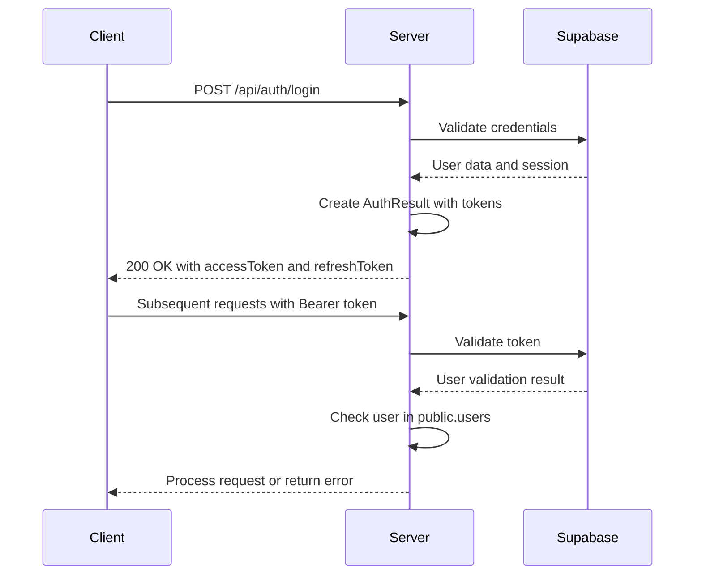
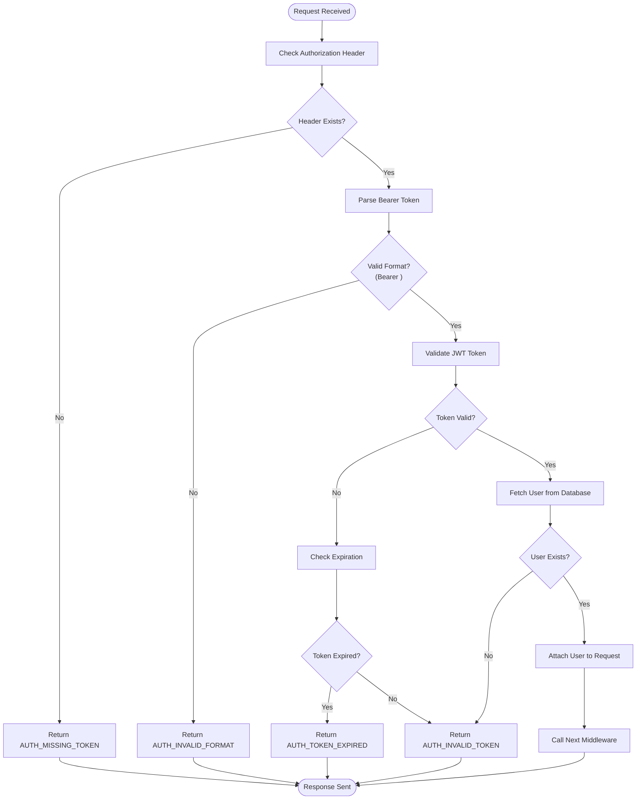
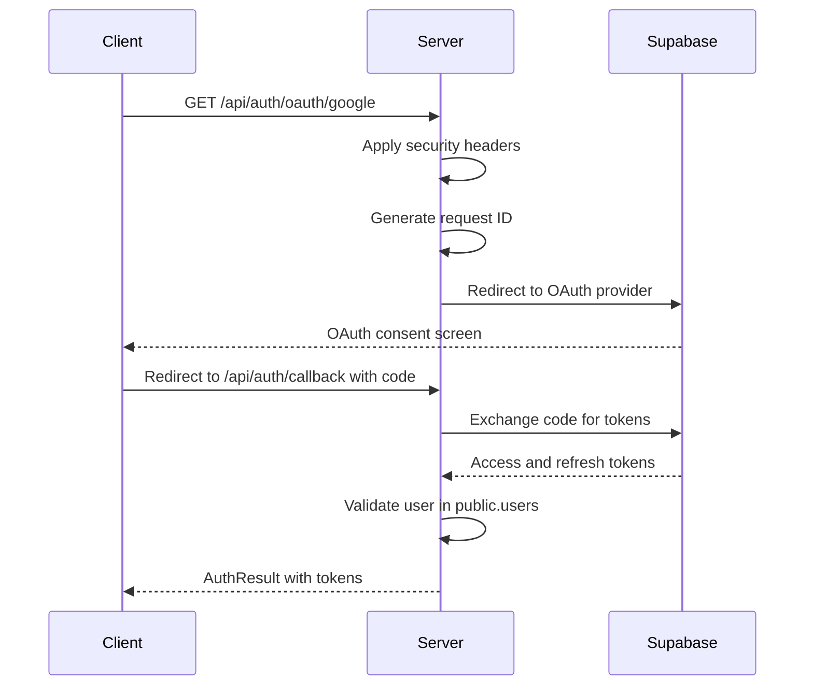
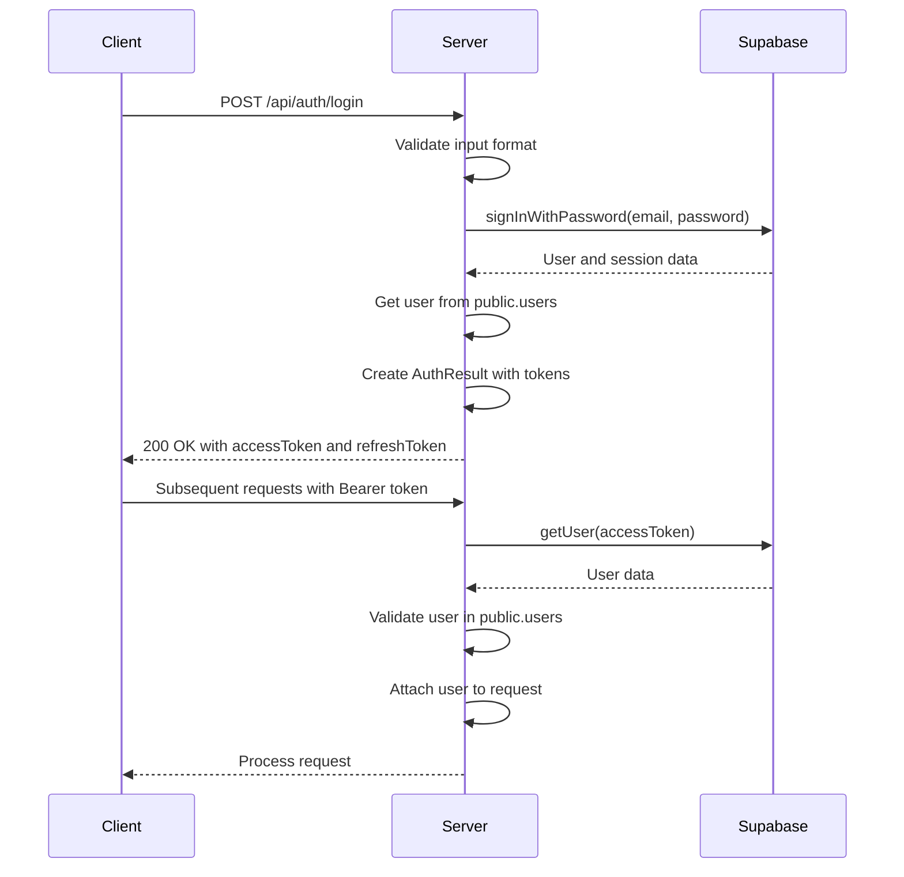
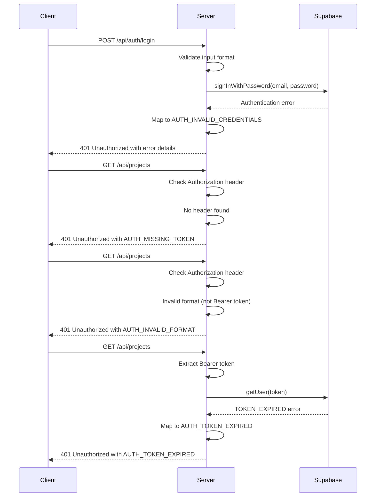

# Authentication Security

<cite>
**Referenced Files in This Document**   
- [auth-middleware.ts](file://src/middleware/auth-middleware.ts)
- [auth-service.ts](file://src/services/auth-service.ts)
- [auth-routes.ts](file://src/routes/auth-routes.ts)
- [auth-types.ts](file://src/services/auth-types.ts)
- [user.ts](file://src/models/user.ts)
- [supabase.ts](file://src/config/supabase.ts)
- [env.ts](file://src/config/env.ts)
- [error-handler.ts](file://src/middleware/error-handler.ts)
- [security-middleware.ts](file://src/middleware/security-middleware.ts)
- [user-repository.ts](file://src/repositories/user-repository.ts)
- [app.ts](file://src/app.ts)
- [swagger.ts](file://src/config/swagger.ts)
- [rate-limiter.ts](file://src/middleware/rate-limiter.ts)
</cite>

## Table of Contents
1. [Introduction](#introduction)
2. [Authentication Flow Overview](#authentication-flow-overview)
3. [Token Management](#token-management)
4. [Authentication Middleware](#authentication-middleware)
5. [Error Handling](#error-handling)
6. [Security Implementation](#security-implementation)
7. [Integration with Supabase](#integration-with-supabase)
8. [Secure Token Storage Recommendations](#secure-token-storage-recommendations)
9. [Authentication Sequence Diagrams](#authentication-sequence-diagrams)
10. [Security Best Practices](#security-best-practices)

## Introduction
The FreelanceXchain authentication security system implements a robust JWT-based authentication mechanism with comprehensive security measures. This documentation details the authentication flow, token management, error handling, and integration with Supabase authentication. The system provides secure access control for freelancers, employers, and administrators in the blockchain-based freelance marketplace.

**Section sources**
- [README.md](file://README.md#L40-L42)

## Authentication Flow Overview
The authentication system in FreelanceXchain follows a standard JWT-based flow with access and refresh tokens. The process begins with user registration or login, followed by token issuance and validation for subsequent requests. The system supports both traditional email/password authentication and OAuth-based authentication through various providers including Google, GitHub, Azure, and LinkedIn.

The authentication flow is protected by rate limiting to prevent brute force attacks, with different limits for various operations. The system enforces HTTPS in production environments and implements comprehensive security headers to protect against common web vulnerabilities.



**Diagram sources**
- [auth-routes.ts](file://src/routes/auth-routes.ts#L272-L315)
- [auth-service.ts](file://src/services/auth-service.ts#L161-L201)

## Token Management
FreelanceXchain implements a dual-token system with access tokens and refresh tokens, each with different expiration policies and security characteristics.

### Access Tokens
Access tokens have a short lifespan of 1 hour (configurable via JWT_EXPIRES_IN environment variable) to minimize the window of opportunity for token theft. These tokens are used to authenticate API requests and contain essential user information in their payload.

### Refresh Tokens
Refresh tokens have a longer lifespan of 7 days (configurable via JWT_REFRESH_EXPIRES_IN environment variable) and are used to obtain new access tokens when they expire. Refresh tokens are stored securely and can be revoked when necessary.

### Token Payload Structure
The JWT token payload contains the following claims:
- userId: User's unique identifier (UUID)
- email: User's email address
- role: User's role (freelancer, employer, or admin)
- walletAddress: Ethereum wallet address for blockchain interactions
- type: Token type (access or refresh)

The token secrets are configured in the environment variables JWT_SECRET for access tokens and JWT_REFRESH_SECRET (defaults to JWT_SECRET if not specified) for refresh tokens.

**Section sources**
- [env.ts](file://src/config/env.ts#L52-L58)
- [auth-types.ts](file://src/services/auth-types.ts#L16-L21)
- [auth-service.ts](file://src/services/auth-service.ts#L50-L62)

## Authentication Middleware
The authentication middleware in FreelanceXchain performs comprehensive validation of incoming requests to ensure secure access to protected routes.

### Bearer Token Validation
The authMiddleware function validates the Authorization header according to the Bearer token format:
1. Checks for the presence of the Authorization header
2. Validates that the header follows the format "Bearer <token>"
3. Extracts and validates the JWT token
4. Extends the Express Request object with user information upon successful validation

The middleware returns specific error codes for different validation failures:
- AUTH_MISSING_TOKEN: When the Authorization header is absent
- AUTH_INVALID_FORMAT: When the header format is incorrect
- AUTH_TOKEN_EXPIRED: When the token has expired
- AUTH_INVALID_TOKEN: When the token is invalid or cannot be verified



**Diagram sources**
- [auth-middleware.ts](file://src/middleware/auth-middleware.ts#L25-L70)
- [auth-service.ts](file://src/services/auth-service.ts#L233-L259)

## Error Handling
The authentication system implements comprehensive error handling with standardized error responses for different failure scenarios.

### Authentication Error Types
The system defines several authentication-specific error codes:
- AUTH_MISSING_TOKEN: Authorization header is required
- AUTH_INVALID_FORMAT: Authorization header must be in format: Bearer <token>
- AUTH_TOKEN_EXPIRED: JWT token has expired
- AUTH_INVALID_TOKEN: Invalid or expired token
- AUTH_INVALID_CREDENTIALS: Invalid email or password
- DUPLICATE_EMAIL: An account with this email already exists
- AUTH_REQUIRE_REGISTRATION: User registration required for OAuth users

### Error Response Structure
All authentication errors follow a consistent JSON response structure:
```json
{
  "error": {
    "code": "ERROR_CODE",
    "message": "Error description"
  },
  "timestamp": "ISO 8601 timestamp",
  "requestId": "Unique request identifier"
}
```

The error handling is implemented in both the authMiddleware and the authService, with specific error codes mapped to appropriate HTTP status codes (401 for authentication errors, 403 for authorization errors).

**Section sources**
- [auth-middleware.ts](file://src/middleware/auth-middleware.ts#L28-L66)
- [auth-service.ts](file://src/services/auth-service.ts#L35-L48)
- [error-handler.ts](file://src/middleware/error-handler.ts#L40-L83)

## Security Implementation
FreelanceXchain implements multiple layers of security to protect the authentication system and user data.

### Rate Limiting
The authentication endpoints are protected by rate limiting to prevent brute force attacks:
- authRateLimiter: 10 attempts per 15 minutes for authentication operations
- sensitiveRateLimiter: 5 attempts per hour for sensitive operations
- apiRateLimiter: 100 requests per minute for general API usage

### Security Headers
The system implements comprehensive security headers using the Helmet middleware:
- Content Security Policy (CSP) to prevent XSS attacks
- HSTS (HTTP Strict Transport Security) to enforce HTTPS
- X-Frame-Options to prevent clickjacking
- X-XSS-Protection to enable browser XSS filters
- X-Content-Type-Options to prevent MIME type sniffing

### HTTPS Enforcement
In production environments, the system enforces HTTPS by redirecting HTTP requests to HTTPS. This ensures that all authentication data, including tokens, is transmitted securely.



**Diagram sources**
- [security-middleware.ts](file://src/middleware/security-middleware.ts#L18-L50)
- [rate-limiter.ts](file://src/middleware/rate-limiter.ts#L64-L81)
- [auth-routes.ts](file://src/routes/auth-routes.ts#L532-L563)

## Integration with Supabase
FreelanceXchain leverages Supabase authentication for user management while extending it with custom functionality for the freelance marketplace.

### Supabase Authentication Flow
The system uses Supabase Auth for:
- User registration and login
- Email verification and password reset
- OAuth integration with external providers
- Session management

When a user registers or logs in, the system:
1. Authenticates with Supabase Auth
2. Creates or updates the user record in the public.users table
3. Returns custom authentication tokens with additional user data

### Custom User Data
The system extends Supabase user metadata with additional fields:
- role: User's role on the platform (freelancer, employer, admin)
- walletAddress: Ethereum wallet address for blockchain interactions
- name: User's full name

This data is stored in both Supabase Auth metadata and the public.users table for redundancy and performance.

**Section sources**
- [supabase.ts](file://src/config/supabase.ts#L25-L33)
- [auth-service.ts](file://src/services/auth-service.ts#L68-L155)
- [user-repository.ts](file://src/repositories/user-repository.ts#L4-L13)

## Secure Token Storage Recommendations
To ensure the security of authentication tokens, the following storage recommendations should be followed:

### Client-Side Storage
- **Access Tokens**: Should be stored in memory (JavaScript variables) and not persisted to avoid XSS attacks
- **Refresh Tokens**: Should be stored in HTTP-only, secure cookies to prevent access via JavaScript
- **Never store tokens in localStorage or sessionStorage** as they are vulnerable to XSS attacks

### Transmission Security
- All authentication requests must use HTTPS
- The Authorization header should only be sent over secure connections
- Implement HSTS to ensure browsers only connect via HTTPS

### Token Revocation
- Provide endpoints for token revocation and password changes
- Invalidate refresh tokens on logout
- Implement token blacklisting for compromised tokens
- Rotate refresh tokens on each use to detect token theft

### Additional Security Measures
- Implement short access token expiration (1 hour)
- Use long refresh token expiration (7 days) with rotation
- Validate token signatures using strong cryptographic algorithms
- Include user agent and IP address in token validation when possible
- Monitor for suspicious authentication patterns

**Section sources**
- [security-middleware.ts](file://src/middleware/security-middleware.ts#L68-L85)
- [auth-middleware.ts](file://src/middleware/auth-middleware.ts#L25-L70)

## Authentication Sequence Diagrams
The following sequence diagrams illustrate the key authentication flows in FreelanceXchain.

### Successful Authentication Flow


**Diagram sources**
- [auth-routes.ts](file://src/routes/auth-routes.ts#L272-L315)
- [auth-service.ts](file://src/services/auth-service.ts#L161-L201)

### Failed Authentication Flow


**Diagram sources**
- [auth-middleware.ts](file://src/middleware/auth-middleware.ts#L28-L66)
- [auth-service.ts](file://src/services/auth-service.ts#L233-L259)

## Security Best Practices
The FreelanceXchain authentication system implements several security best practices to protect user data and prevent common vulnerabilities.

### Token Security
- Use strong, randomly generated secrets for JWT signing
- Implement short-lived access tokens (1 hour) to minimize exposure
- Use longer-lived refresh tokens (7 days) with secure storage
- Rotate refresh tokens on each use to detect token theft
- Implement token revocation mechanisms

### Transmission Security
- Enforce HTTPS in production environments
- Implement HSTS with long max-age (1 year)
- Use secure and HTTP-only flags for authentication cookies
- Validate CORS origins to prevent unauthorized access
- Implement Content Security Policy to prevent XSS attacks

### Input Validation
- Validate email format and password strength on registration
- Sanitize and validate all input data
- Implement rate limiting to prevent brute force attacks
- Use parameterized queries to prevent SQL injection
- Validate OAuth provider names to prevent SSRF attacks

### Error Handling
- Use generic error messages to avoid information disclosure
- Include request IDs for debugging without exposing sensitive data
- Log authentication failures for monitoring and analysis
- Implement account lockout after multiple failed attempts
- Distinguish between different error types for appropriate responses

### Monitoring and Logging
- Log authentication events with request IDs
- Monitor for suspicious patterns (rapid login attempts, unusual locations)
- Implement audit trails for security-critical operations
- Set up alerts for potential security incidents
- Regularly review authentication logs for anomalies

**Section sources**
- [security-middleware.ts](file://src/middleware/security-middleware.ts#L18-L50)
- [rate-limiter.ts](file://src/middleware/rate-limiter.ts#L64-L81)
- [auth-middleware.ts](file://src/middleware/auth-middleware.ts#L25-L70)
- [error-handler.ts](file://src/middleware/error-handler.ts#L85-L120)