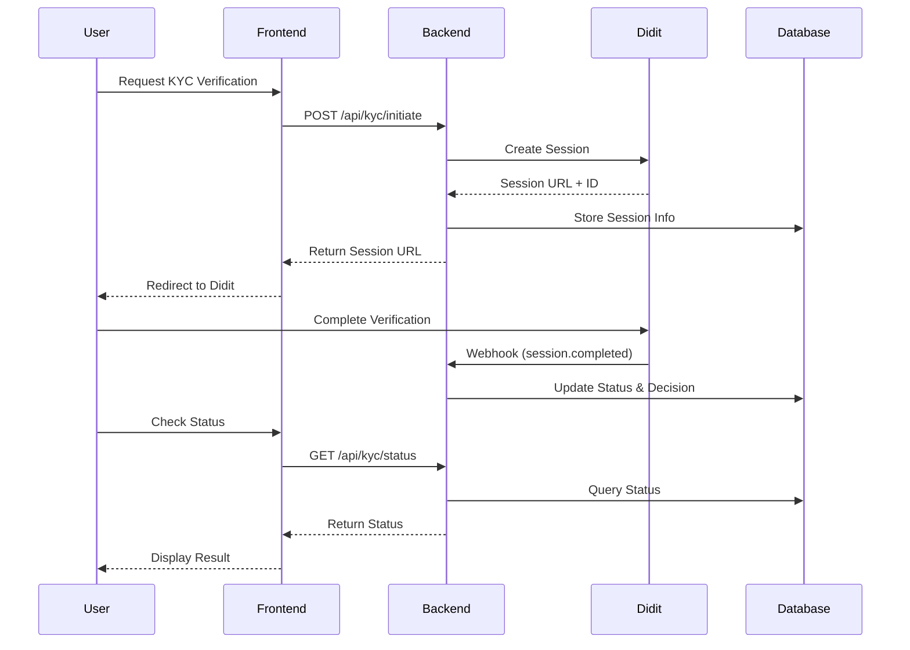
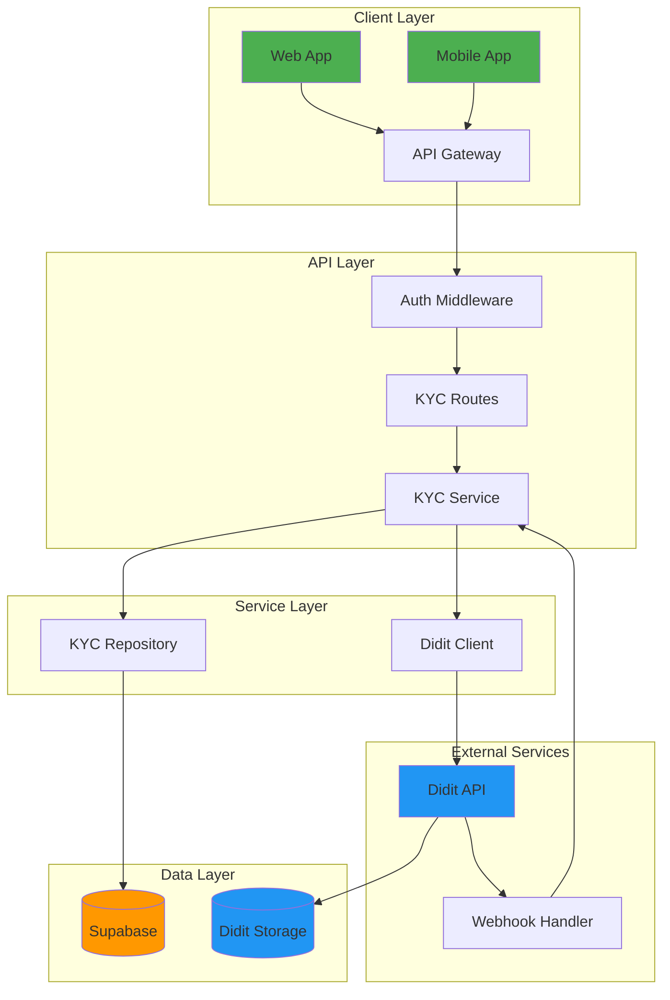

# Data Privacy & KYC Protection

<cite>
**Referenced Files in This Document**   
- [didit-kyc.ts](file://src/models/didit-kyc.ts)
- [didit-kyc-repository.ts](file://src/repositories/didit-kyc-repository.ts)
- [didit-kyc-service.ts](file://src/services/didit-kyc-service.ts)
- [didit-client.ts](file://src/services/didit-client.ts)
- [didit-kyc-routes.ts](file://src/routes/didit-kyc-routes.ts)
- [003_didit_kyc_verifications.sql](file://supabase/migrations/003_didit_kyc_verifications.sql)
- [security-middleware.ts](file://src/middleware/security-middleware.ts)
- [auth-middleware.ts](file://src/middleware/auth-middleware.ts)
</cite>

## Table of Contents
1. [Introduction](#introduction)
2. [Didit KYC Integration](#didit-kyc-integration)
3. [Data Minimization Principle](#data-minimization-principle)
4. [GDPR Compliance Measures](#gdpr-compliance-measures)
5. [Webhook Security](#webhook-security)
6. [API Endpoints](#api-endpoints)
7. [Database Schema](#database-schema)
8. [System Architecture](#system-architecture)

## Introduction

FreelanceXchain uses [Didit](https://didit.me) for enterprise-grade KYC (Know Your Customer) verification. Didit provides professional identity verification with support for 220+ countries.

**Key Principle**: Didit handles ALL verification data (documents, liveness, face match, IP analysis). We only store session info and the final decision locally.

## Didit KYC Integration

### Overview

Didit provides a hosted verification page where users complete identity verification. The backend creates sessions via API and receives results through webhooks.

### Environment Configuration

```bash
# Didit KYC Configuration
DIDIT_API_KEY=your-didit-api-key
DIDIT_API_URL=https://verification.didit.me
DIDIT_WEBHOOK_SECRET=your-didit-webhook-secret-key
DIDIT_WORKFLOW_ID=your-didit-workflow-id
```

### Workflow



### Verification Features (Handled by Didit)

| Feature | Description |
|---------|-------------|
| **ID Verification** | Document verification for passports, national IDs, driver's licenses (220+ countries) |
| **Passive Liveness** | Anti-spoofing technology with no user interaction required |
| **Face Match 1:1** | Compares selfie to document photo with similarity scoring |
| **IP Analysis** | Geolocation, VPN/Proxy detection, risk scoring |

All verification data is processed and stored by Didit. We only receive the final decision.

## Data Minimization Principle

FreelanceXchain follows strict data minimization:

### What We Store

| Field | Purpose |
|-------|---------|
| `didit_session_id` | Link to Didit session |
| `didit_session_url` | Redirect URL for user |
| `status` | Current verification status |
| `decision` | Final decision (approved/declined/review) |
| `reviewed_by`, `reviewed_at`, `admin_notes` | Admin review tracking |

### What Didit Handles (NOT stored locally)

- Document images (front/back)
- Selfie images
- Raw biometric data
- Personal information (name, DOB, nationality)
- Document details (type, number, issuing country)
- Liveness detection results
- Face match scores
- IP analysis data

This approach ensures:
1. **Minimal data exposure** - Sensitive data stays with Didit
2. **Reduced compliance burden** - Didit handles PII storage
3. **Simplified architecture** - Less data to secure locally

## GDPR Compliance Measures

### User Rights Implementation

| Right | Implementation |
|-------|----------------|
| **Right to Access** | `GET /api/kyc/status` returns user's verification status |
| **Right to Erasure** | Admin can delete verification records; Didit handles PII deletion |
| **Right to Portability** | `GET /api/kyc/history` exports verification history |
| **Consent** | Explicit consent required before initiating verification |

### Data Retention

- **Approved Verifications**: Retained for 1 year from approval date (`expires_at`)
- **Rejected Verifications**: Retained for 90 days for dispute resolution
- **Expired Sessions**: Automatically cleaned up after 30 days

## Webhook Security

### HMAC-SHA256 Signature Verification

All webhooks from Didit are verified using HMAC-SHA256:

```typescript
import crypto from 'crypto';

function verifyWebhookSignature(payload: string, signature: string): boolean {
  const secret = process.env.DIDIT_WEBHOOK_SECRET;
  const expectedSignature = crypto
    .createHmac('sha256', secret)
    .update(payload)
    .digest('hex');
  
  return crypto.timingSafeEqual(
    Buffer.from(signature),
    Buffer.from(expectedSignature)
  );
}
```

### Webhook Endpoint Security

- Signature verification required
- Rate limiting applied
- Idempotency handling for duplicate webhooks

## API Endpoints

### User Endpoints

| Method | Endpoint | Description |
|--------|----------|-------------|
| `POST` | `/api/kyc/initiate` | Start verification, get session URL |
| `GET` | `/api/kyc/status` | Get current verification status |
| `GET` | `/api/kyc/verified` | Check if user is verified |
| `GET` | `/api/kyc/history` | Get verification history |
| `POST` | `/api/kyc/refresh/:id` | Manually refresh status from Didit |

### Admin Endpoints

| Method | Endpoint | Description |
|--------|----------|-------------|
| `GET` | `/api/kyc/admin/pending` | Get pending reviews |
| `GET` | `/api/kyc/admin/status/:status` | Get verifications by status |
| `POST` | `/api/kyc/admin/review/:id` | Approve/reject verification |
| `GET` | `/api/kyc/admin/verification/:id` | Get verification details |

### Webhook Endpoint

| Method | Endpoint | Description |
|--------|----------|-------------|
| `POST` | `/api/kyc/webhook` | Receive Didit status updates |

### Example: Initiate Verification

```bash
curl -X POST http://localhost:3000/api/kyc/initiate \
  -H "Authorization: Bearer {token}" \
  -H "Content-Type: application/json" \
  -d '{
    "contact_details": {
      "email": "[email protected]"
    }
  }'
```

Response:
```json
{
  "id": "uuid",
  "user_id": "uuid",
  "status": "pending",
  "didit_session_url": "https://verify.didit.me/session/token",
  "created_at": "2026-01-15T10:00:00Z"
}
```

## Database Schema

### Table: `kyc_verifications`

```sql
CREATE TABLE kyc_verifications (
    id UUID PRIMARY KEY DEFAULT gen_random_uuid(),
    user_id UUID NOT NULL REFERENCES users(id) ON DELETE CASCADE,
    status VARCHAR(20) NOT NULL CHECK (status IN (
        'pending', 'in_progress', 'completed', 
        'approved', 'rejected', 'expired'
    )),
    
    -- Didit Session (all we need to store)
    didit_session_id VARCHAR(255) UNIQUE NOT NULL,
    didit_session_token VARCHAR(255) NOT NULL,
    didit_session_url TEXT NOT NULL,
    didit_workflow_id VARCHAR(255) NOT NULL,
    
    -- Decision from Didit
    decision VARCHAR(20) CHECK (decision IN ('approved', 'declined', 'review')),
    
    -- Admin Review
    reviewed_by UUID REFERENCES users(id),
    reviewed_at TIMESTAMPTZ,
    admin_notes TEXT,
    
    -- Timestamps
    created_at TIMESTAMPTZ DEFAULT NOW(),
    updated_at TIMESTAMPTZ DEFAULT NOW(),
    completed_at TIMESTAMPTZ,
    expires_at TIMESTAMPTZ
);

-- Indexes
CREATE INDEX idx_kyc_user_id ON kyc_verifications(user_id);
CREATE INDEX idx_kyc_status ON kyc_verifications(status);
CREATE INDEX idx_kyc_didit_session_id ON kyc_verifications(didit_session_id);
CREATE INDEX idx_kyc_pending_review ON kyc_verifications(status, reviewed_by) 
    WHERE status = 'completed' AND reviewed_by IS NULL;
```

### Row Level Security

```sql
-- Users can only see their own verifications
CREATE POLICY "Users can view own KYC" ON kyc_verifications
    FOR SELECT USING (auth.uid() = user_id);

-- Only service role can insert/update
CREATE POLICY "Service role full access" ON kyc_verifications
    FOR ALL USING (auth.role() = 'service_role');
```

## System Architecture



### File Structure

```
src/
├── models/
│   └── didit-kyc.ts              # Type definitions
├── services/
│   ├── didit-client.ts           # Didit API client
│   └── didit-kyc-service.ts      # Business logic
├── repositories/
│   └── didit-kyc-repository.ts   # Database operations
└── routes/
    └── didit-kyc-routes.ts       # API endpoints

supabase/
└── migrations/
    └── 003_didit_kyc_verifications.sql
```

## Quick Reference

### Status Values

| Status | Description |
|--------|-------------|
| `pending` | Session created, user hasn't started |
| `in_progress` | User is completing verification |
| `completed` | Verification done, awaiting admin review |
| `approved` | Admin approved, user is verified |
| `rejected` | Admin rejected or Didit declined |
| `expired` | Session expired without completion |

### Decision Values (from Didit)

| Decision | Description |
|----------|-------------|
| `approved` | All checks passed |
| `declined` | Failed verification checks |
| `review` | Needs manual review |

## Support Resources

- **Didit Documentation**: https://docs.didit.me
- **API Reference**: https://docs.didit.me/reference/
- **Business Console**: https://business.didit.me
