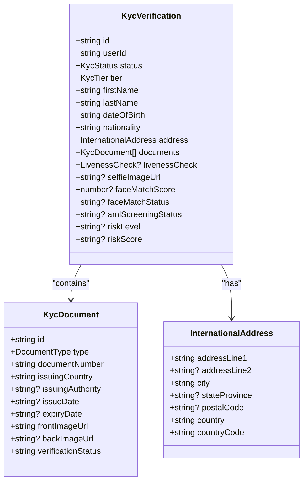
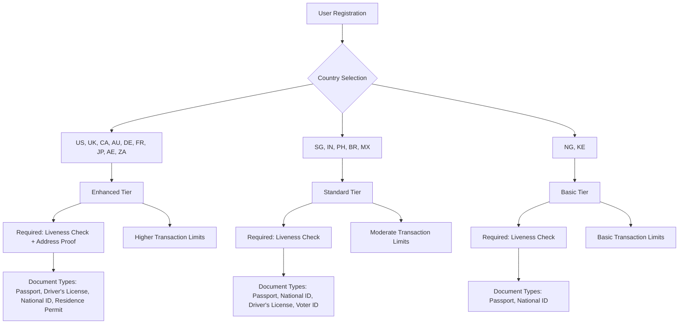
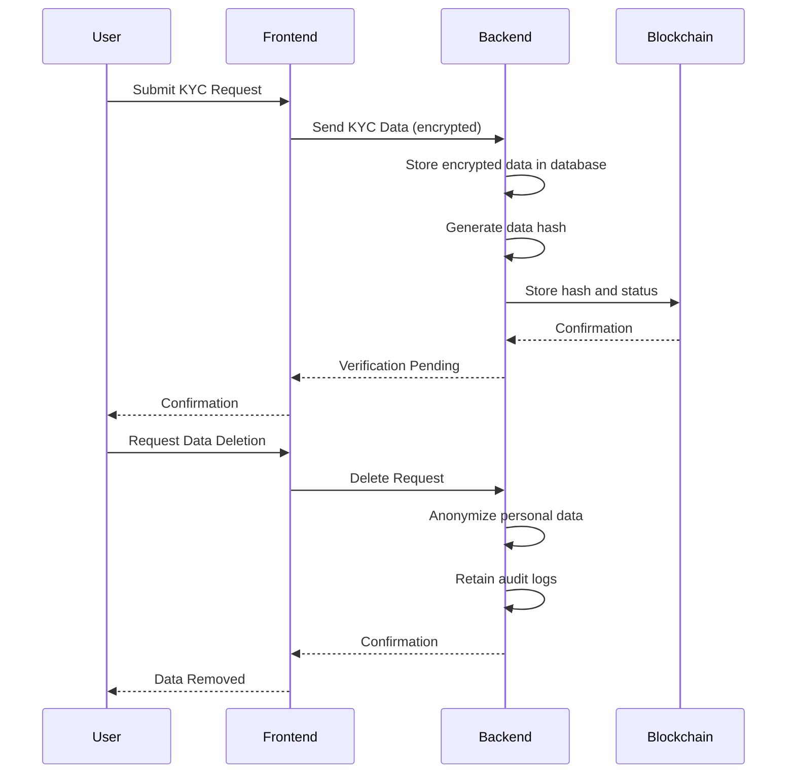
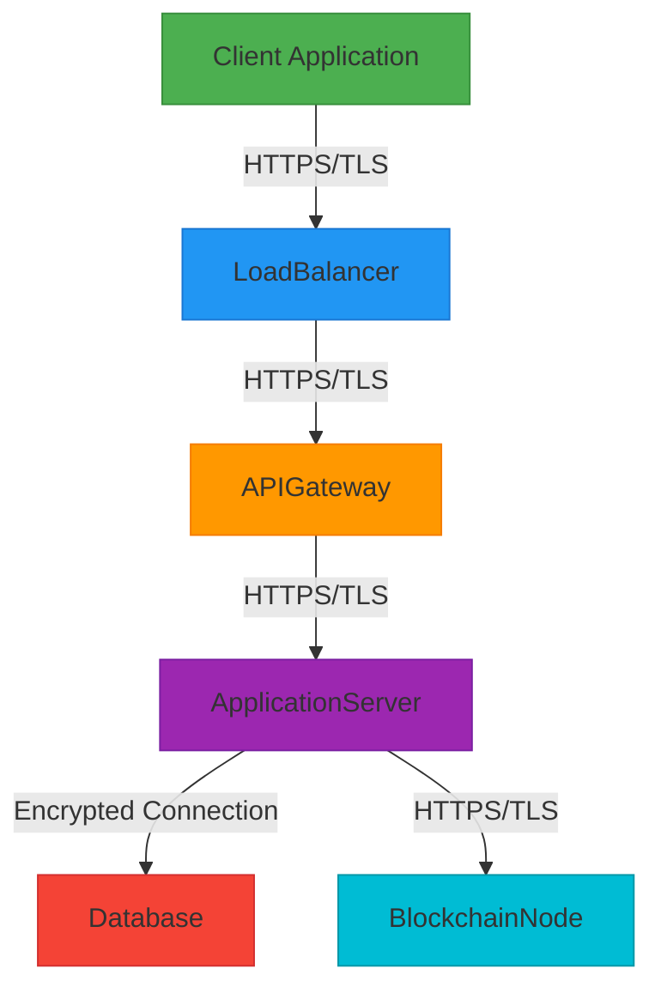
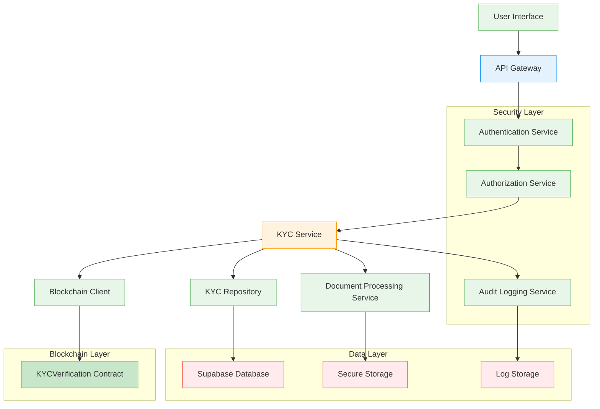

# Data Privacy & KYC Protection

<cite>
**Referenced Files in This Document**   
- [KYCVerification.sol](file://contracts/KYCVerification.sol)
- [kyc.ts](file://src/models/kyc.ts)
- [kyc-repository.ts](file://src/repositories/kyc-repository.ts)
- [kyc-service.ts](file://src/services/kyc-service.ts)
- [kyc-routes.ts](file://src/routes/kyc-routes.ts)
- [security-middleware.ts](file://src/middleware/security-middleware.ts)
- [auth-middleware.ts](file://src/middleware/auth-middleware.ts)
- [schema.sql](file://supabase/schema.sql)
- [kyc-contract.ts](file://src/services/kyc-contract.ts)
- [env.ts](file://src/config/env.ts)
- [supabase.ts](file://src/config/supabase.ts)
</cite>

## Table of Contents
1. [Introduction](#introduction)
2. [Data Minimization Principle](#data-minimization-principle)
3. [Tiered KYC System](#tiered-kyc-system)
4. [GDPR Compliance Measures](#gdpr-compliance-measures)
5. [Document Image Handling](#document-image-handling)
6. [Encryption Strategies](#encryption-strategies)
7. [Secure Transmission](#secure-transmission)
8. [Audit Logging and Monitoring](#audit-logging-and-monitoring)
9. [System Architecture](#system-architecture)

## Introduction
FreelanceXchain implements a comprehensive data privacy and KYC protection framework designed to balance regulatory compliance with user privacy. The system follows the data minimization principle by collecting only essential identity information and storing sensitive data with robust encryption. KYC verification is implemented through a tiered system that adapts to different country requirements, with enhanced security measures for regions with stricter regulations. The architecture incorporates both on-chain and off-chain components to ensure GDPR compliance while maintaining transparency and immutability where appropriate.

**Section sources**
- [KYCVerification.sol](file://contracts/KYCVerification.sol#L1-L211)
- [kyc.ts](file://src/models/kyc.ts#L1-L206)

## Data Minimization Principle
FreelanceXchain adheres to the data minimization principle by collecting only essential identity information required for KYC verification. The system stores only name, date of birth, and document images, with all sensitive fields encrypted at rest. Personal data is not stored on the blockchain; instead, only verification status and cryptographic hashes of KYC data are recorded on-chain, ensuring GDPR compliance.

The KYC data model includes essential fields such as first name, last name, date of birth, nationality, and address information, while avoiding collection of unnecessary personal details. Document verification is limited to essential attributes including document type, number, issuing country, and validity period. The system does not collect or store sensitive information such as full financial records, employment history, or detailed biometric data beyond what is necessary for identity verification.

**Diagram sources **
- [kyc.ts](file://src/models/kyc.ts#L84-L119)

**Section sources**
- [kyc.ts](file://src/models/kyc.ts#L84-L119)
- [schema.sql](file://supabase/schema.sql#L136-L159)

## Tiered KYC System
FreelanceXchain implements a tiered KYC system that supports different requirements for various countries, including US, UK, Singapore, and India. The system defines three KYC tiers—Basic, Standard, and Enhanced—each with different verification requirements and privileges within the platform.

The tiered system adapts to country-specific regulations, with varying requirements for liveness checks and address proof. For example, US and UK users require both liveness verification and address proof, qualifying them for the Enhanced tier, while Singapore and India users require liveness checks but not address proof, qualifying for the Standard tier. Nigeria and Kenya users have Basic tier requirements with liveness checks but no address proof requirement.

**Diagram sources **
- [kyc-service.ts](file://src/services/kyc-service.ts#L46-L63)

**Section sources**
- [kyc-service.ts](file://src/services/kyc-service.ts#L46-L63)
- [kyc-routes.ts](file://src/routes/kyc-routes.ts#L258-L310)

## GDPR Compliance Measures
FreelanceXchain implements comprehensive GDPR compliance measures to protect user data and ensure regulatory adherence. The system incorporates user consent management, right to erasure implementation, and defined data retention policies to meet GDPR requirements.

User consent is managed through explicit opt-in mechanisms during the KYC submission process, with clear disclosure of data usage purposes. The right to erasure is implemented through a data deletion workflow that removes personal information from both the application database and associated storage systems while maintaining necessary audit trails for regulatory compliance. Data retention policies specify that KYC data is retained for a maximum of five years from the date of account closure, with automatic deletion processes enforced through system workflows.

The system architecture ensures GDPR compliance by storing personal data off-chain in encrypted form, while only storing verification status and cryptographic hashes on the blockchain. This approach provides transparency and immutability for verification status without compromising personal data privacy. Users have access to their data through self-service portals and can request data exports in standard formats.

**Diagram sources **
- [KYCVerification.sol](file://contracts/KYCVerification.sol#L7-L8)
- [kyc-service.ts](file://src/services/kyc-service.ts#L381-L385)

**Section sources**
- [KYCVerification.sol](file://contracts/KYCVerification.sol#L7-L8)
- [kyc-service.ts](file://src/services/kyc-service.ts#L381-L385)
- [kyc-routes.ts](file://src/routes/kyc-routes.ts#L875-L892)

## Document Image Handling
FreelanceXchain implements secure handling of document images with temporary storage and strict access controls. Document images are stored in encrypted form with temporary access URLs that expire after a short period, minimizing the risk of unauthorized access.

The system uses a secure document processing workflow where images are uploaded directly to secure storage with end-to-end encryption. Access to document images is strictly controlled through role-based access control (RBAC), with only authorized KYC reviewers able to access images during the verification process. All access to document images is logged for audit purposes, and images are automatically purged after successful verification or after a defined retention period for rejected applications.

Document images are never stored in the primary application database; instead, the system stores only encrypted references to the storage location. The image processing pipeline includes automated virus scanning and content validation to prevent malicious file uploads. Temporary storage ensures that images are not permanently retained beyond the verification period, further enhancing privacy protection.

**Section sources**
- [kyc.ts](file://src/models/kyc.ts#L35-L50)
- [kyc-service.ts](file://src/services/kyc-service.ts#L116-L128)
- [kyc-routes.ts](file://src/routes/kyc-routes.ts#L391-L428)

## Encryption Strategies
FreelanceXchain employs robust encryption strategies to protect sensitive data both at rest and in transit. Sensitive fields in the database, including personal information and document references, are encrypted using industry-standard encryption algorithms with key management practices that ensure data confidentiality.

The system implements field-level encryption for sensitive data elements such as tax identification numbers, address information, and document metadata. Encryption keys are managed through a secure key management system with regular rotation policies. Database storage encryption is enabled at the infrastructure level, providing an additional layer of protection for data at rest.

The encryption architecture follows a defense-in-depth approach with multiple layers of protection. Application-level encryption ensures that sensitive data is encrypted before being stored in the database, while database-level encryption provides protection against infrastructure-level attacks. This dual-layer approach ensures that even in the event of a database breach, sensitive information remains protected and unusable to unauthorized parties.

**Section sources**
- [schema.sql](file://supabase/schema.sql#L136-L159)
- [kyc-repository.ts](file://src/repositories/kyc-repository.ts#L7-L41)
- [env.ts](file://src/config/env.ts#L52-L58)

## Secure Transmission
FreelanceXchain ensures secure transmission of data through the implementation of TLS encryption for all communications between clients and servers. The system enforces HTTPS for all endpoints, with HSTS (HTTP Strict Transport Security) headers configured to prevent downgrade attacks.

The security middleware configures TLS with modern cipher suites and disables outdated protocols to ensure secure communication. Certificate pinning is implemented for mobile applications to prevent man-in-the-middle attacks. All API endpoints require authentication through JWT (JSON Web Tokens) with short expiration times and refresh token rotation to minimize the risk of token compromise.

The system implements additional security headers including Content Security Policy (CSP), X-Content-Type-Options, and X-Frame-Options to protect against common web vulnerabilities. CORS (Cross-Origin Resource Sharing) policies are strictly configured to allow only trusted domains, preventing unauthorized cross-origin requests. These measures collectively ensure that data transmitted between clients and servers remains confidential and integrity-protected.

**Diagram sources **
- [security-middleware.ts](file://src/middleware/security-middleware.ts#L18-L47)
- [auth-middleware.ts](file://src/middleware/auth-middleware.ts#L25-L69)

**Section sources**
- [security-middleware.ts](file://src/middleware/security-middleware.ts#L18-L47)
- [auth-middleware.ts](file://src/middleware/auth-middleware.ts#L25-L69)

## Audit Logging and Monitoring
FreelanceXchain implements comprehensive audit logging for KYC access and monitoring for unauthorized data queries. All access to KYC data is logged with detailed information including user ID, timestamp, requested resource, and action performed, enabling thorough audit trails for compliance and security monitoring.

The system generates structured logs for all KYC-related operations, including submission, review, approval, and rejection events. Log entries include request IDs, user roles, IP addresses, and other contextual information to support forensic analysis. Logs are stored in a secure, immutable format with access restricted to authorized personnel only.

Monitoring systems continuously analyze access patterns to detect anomalous behavior that may indicate unauthorized data queries or potential security breaches. Alerting mechanisms are in place to notify security teams of suspicious activities, such as multiple failed access attempts or access from unusual geographic locations. Regular log reviews and automated analysis help ensure ongoing compliance with data protection regulations and internal security policies.

**Section sources**
- [request-logger.ts](file://src/middleware/request-logger.ts#L1-L41)
- [kyc-service.ts](file://src/services/kyc-service.ts#L329-L407)
- [kyc-routes.ts](file://src/routes/kyc-routes.ts#L780-L783)

## System Architecture
The FreelanceXchain KYC system architecture integrates on-chain and off-chain components to balance transparency, security, and privacy requirements. The architecture follows a layered approach with clear separation between data storage, processing logic, and external interfaces.

**Diagram sources **
- [kyc-service.ts](file://src/services/kyc-service.ts#L1-L547)
- [kyc-repository.ts](file://src/repositories/kyc-repository.ts#L1-L178)
- [kyc-contract.ts](file://src/services/kyc-contract.ts#L1-L366)

**Section sources**
- [kyc-service.ts](file://src/services/kyc-service.ts#L1-L547)
- [kyc-repository.ts](file://src/repositories/kyc-repository.ts#L1-L178)
- [kyc-contract.ts](file://src/services/kyc-contract.ts#L1-L366)