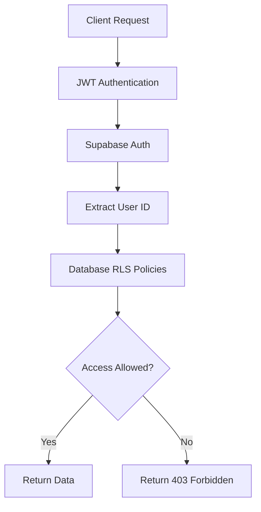
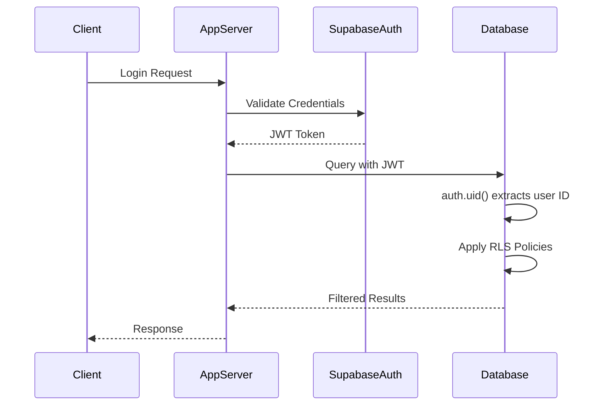
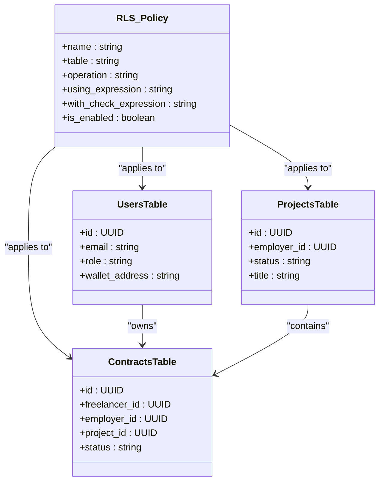
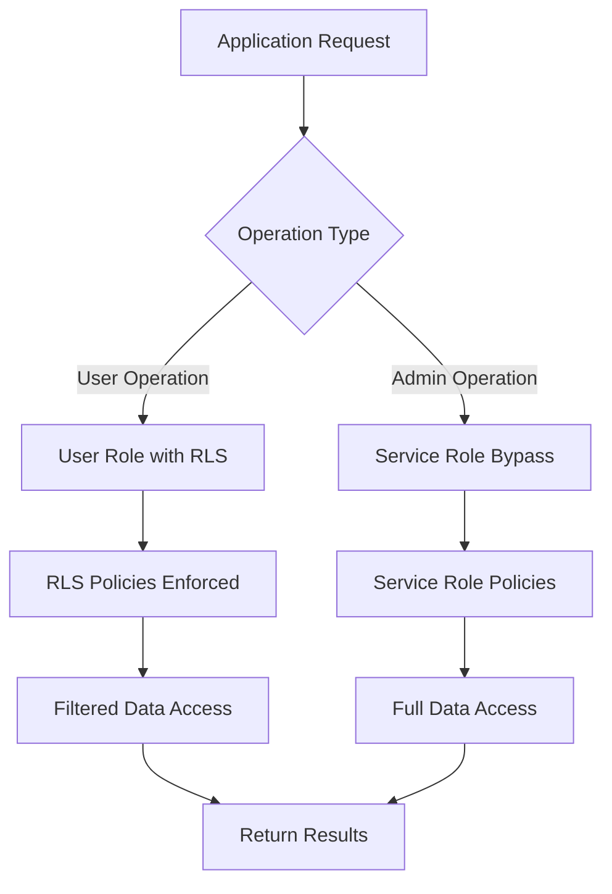

# Database Security & Row Level Security

<cite>
**Referenced Files in This Document**   
- [schema.sql](file://supabase/schema.sql)
- [auth-middleware.ts](file://src/middleware/auth-middleware.ts)
- [auth-service.ts](file://src/services/auth-service.ts)
- [user-repository.ts](file://src/repositories/user-repository.ts)
- [base-repository.ts](file://src/repositories/base-repository.ts)
- [supabase.ts](file://src/config/supabase.ts)
- [entity-mapper.ts](file://src/utils/entity-mapper.ts)
- [contract-repository.ts](file://src/repositories/contract-repository.ts)
- [project-repository.ts](file://src/repositories/project-repository.ts)
- [payment-repository.ts](file://src/repositories/payment-repository.ts)
</cite>

## Table of Contents
1. [Introduction](#introduction)
2. [Row Level Security Overview](#row-level-security-overview)
3. [Supabase Authentication Integration](#supabase-authentication-integration)
4. [RLS Policy Implementation](#rls-policy-implementation)
5. [Service Role Configuration](#service-role-configuration)
6. [Secure Query Examples](#secure-query-examples)
7. [Access Control Enforcement](#access-control-enforcement)
8. [Debugging and Testing RLS Policies](#debugging-and-testing-rls-policies)
9. [Conclusion](#conclusion)

## Introduction
The FreelanceXchain platform implements a robust database security model using Supabase Row Level Security (RLS) to ensure data isolation and privacy. This documentation details the comprehensive security architecture that prevents unauthorized access to sensitive user data across all application tables. The system leverages PostgreSQL's RLS capabilities integrated with Supabase's authentication framework to enforce strict access controls, ensuring users can only access their own data or data they are explicitly authorized to view. The security model covers all core entities including users, projects, contracts, and payments, with policies designed to prevent data leakage and unauthorized operations.

**Section sources**
- [schema.sql](file://supabase/schema.sql#L1-L261)
- [auth-middleware.ts](file://src/middleware/auth-middleware.ts#L1-L101)

## Row Level Security Overview
FreelanceXchain employs Row Level Security (RLS) as the primary mechanism for data access control at the database layer. RLS policies are enabled on all tables in the system, creating a security boundary that prevents unauthorized access even if application-level controls fail. The RLS implementation follows the principle of least privilege, where access is denied by default and only granted through explicitly defined policies. Each table in the database has RLS enabled through the `ALTER TABLE ... ENABLE ROW LEVEL SECURITY` command, establishing the foundation for fine-grained access control.

The security model is designed around user ownership and role-based access patterns. For most tables, users can only access records where they are the owner (identified by their user ID) or have a specific relationship to the data (such as being a contract party). The system uses Supabase's built-in `auth.uid()` function to extract the authenticated user's ID from JWT tokens, which is then used in policy expressions to determine access eligibility. This approach ensures that data access decisions are made at the database level, providing an additional security layer beyond application logic.

**Diagram sources**
- [schema.sql](file://supabase/schema.sql#L225-L260)

**Section sources**
- [schema.sql](file://supabase/schema.sql#L225-L260)

## Supabase Authentication Integration
The security model is tightly integrated with Supabase Authentication, which provides the foundation for user identity and session management. When a user authenticates, Supabase generates a JWT token containing the user's ID and other claims, which is then used to enforce RLS policies at the database level. The authentication flow begins with the `authMiddleware` in the application, which validates the JWT token and extracts user information before allowing requests to proceed to business logic.

The `auth-service.ts` file contains the core authentication logic, including registration, login, and token validation functions. During login, the system verifies credentials with Supabase Auth and then retrieves the corresponding user record from the public.users table to ensure profile completeness. The JWT token generated by Supabase contains the user's ID in the `sub` claim, which is accessible to RLS policies through the `auth.uid()` function. This integration creates a seamless security flow where authentication at the application level directly enables authorization at the database level.

**Diagram sources**
- [auth-middleware.ts](file://src/middleware/auth-middleware.ts#L25-L69)
- [auth-service.ts](file://src/services/auth-service.ts#L161-L201)

**Section sources**
- [auth-middleware.ts](file://src/middleware/auth-middleware.ts#L25-L69)
- [auth-service.ts](file://src/services/auth-service.ts#L161-L201)
- [user-repository.ts](file://src/repositories/user-repository.ts#L28-L40)

## RLS Policy Implementation
The RLS policy implementation in FreelanceXchain is comprehensive, covering all data tables with specific policies for each operation type (SELECT, INSERT, UPDATE, DELETE). The `schema.sql` file contains the complete set of RLS policies that define access rules for the application. Policies are created using the `CREATE POLICY` statement with USING expressions that evaluate to true or false based on the current user's identity and the row data.

For user-owned resources like projects, contracts, and payments, policies use the user ID to restrict access. For example, a freelancer can only access contracts where their user ID matches the freelancer_id column. The system also implements public read access for certain data, such as allowing SELECT operations on skill categories and skills for all users, while maintaining restrictions on other operations. Open projects (status = 'open') are also publicly readable to support discovery features while keeping draft and completed projects private.

The policy implementation follows a consistent pattern across tables, with each table having policies for different operations. The USING expression in each policy determines whether a row is accessible, while CHECK expressions (not shown in the current schema) could be used to validate data during INSERT and UPDATE operations. This approach ensures that data access is consistently enforced across the entire application, regardless of the access path.

**Diagram sources**
- [schema.sql](file://supabase/schema.sql#L241-L244)

**Section sources**
- [schema.sql](file://supabase/schema.sql#L241-L244)

## Service Role Configuration
The system implements a service role bypass mechanism to allow backend operations that require broader data access than individual users. This is achieved through service role policies that grant full access to all tables when the service role is used. The `schema.sql` file contains a series of policies named "Service role full access [table_name]" that use a USING expression of `true`, effectively bypassing RLS restrictions for the service role.

These service role policies are essential for administrative functions, batch operations, and certain business logic that needs to access data across multiple users. The service role is configured with elevated privileges in Supabase, allowing it to bypass RLS checks while still maintaining audit trails and other security controls. This approach enables the backend application to perform necessary operations without compromising the security model for end users.

The service role configuration follows the principle of least privilege for the backend, where the service role has the minimum necessary permissions to perform its functions. While it has full access to all tables, this access is only used in specific, controlled circumstances within the application code. The separation between user roles and service roles creates a clear security boundary, ensuring that user-level restrictions are maintained while allowing the system to function effectively.

**Diagram sources**
- [schema.sql](file://supabase/schema.sql#L247-L260)

**Section sources**
- [schema.sql](file://supabase/schema.sql#L247-L260)

## Secure Query Examples
The RLS implementation ensures that all database queries are automatically filtered based on the authenticated user's identity. When a user makes a request to access their data, the application uses the Supabase client with the user's JWT token, and the database automatically applies the relevant RLS policies. For example, when a freelancer requests their contracts, the query in `contract-repository.ts` uses the Supabase client to fetch records, but the actual results are filtered by the RLS policy on the contracts table.

The repository pattern in the application code works in conjunction with RLS to provide an additional layer of security. While the RLS policies at the database level provide the primary security boundary, the repository methods include explicit filtering by user ID as a defense-in-depth measure. This dual-layer approach ensures security even if one layer fails. For instance, the `getUserContracts` method in `contract-repository.ts` explicitly filters by both freelancer_id and employer_id, reinforcing the RLS policy that performs the same check.

For cross-table queries, such as retrieving a user's projects and associated contracts, the security model ensures that only data owned by or related to the user is returned. The application code in services like `project-service.ts` and `contract-service.ts` constructs queries that respect ownership relationships, while the database RLS policies provide a final verification that no unauthorized data is exposed.

**Section sources**
- [contract-repository.ts](file://src/repositories/contract-repository.ts#L41-L60)
- [project-repository.ts](file://src/repositories/project-repository.ts#L55-L73)
- [payment-repository.ts](file://src/repositories/payment-repository.ts#L38-L57)

## Access Control Enforcement
Access control in FreelanceXchain is enforced through a combination of database-level RLS policies and application-level authorization checks. The system uses role-based access control (RBAC) with three primary roles: freelancer, employer, and admin. The user's role is stored in the users table and can be used in RLS policies to restrict access based on user type. For example, certain administrative functions may only be available to users with the 'admin' role.

The enforcement mechanism operates on multiple levels to provide defense in depth. At the database level, RLS policies prevent unauthorized access to rows. At the application level, middleware such as `requireRole` in `auth-middleware.ts` enforces role-based access to specific endpoints. This multi-layered approach ensures that even if an attacker bypasses one layer of security, subsequent layers will still prevent unauthorized access.

For sensitive operations like modifying contracts or releasing payments, the system implements additional verification steps. The application code in services like `payment-service.ts` includes explicit checks to ensure that only contract parties can perform certain actions, reinforcing the RLS policies that provide the primary security boundary. This approach ensures that security is not dependent on any single control, creating a robust defense against unauthorized access.

**Section sources**
- [auth-middleware.ts](file://src/middleware/auth-middleware.ts#L72-L99)
- [payment-service.ts](file://src/services/payment-service.ts#L502-L549)
- [payment-routes.ts](file://src/routes/payment-routes.ts#L393-L423)

## Debugging and Testing RLS Policies
Debugging and testing RLS policies is critical to ensure the security model functions as intended. During development, policies can be tested by simulating different user contexts and verifying that data access is properly restricted. The Supabase dashboard provides tools for testing RLS policies, allowing developers to execute queries as different users and observe the results.

For local development and testing, the system can temporarily disable RLS on specific tables to facilitate debugging, though this should never be done in production. Unit tests in the application code verify that repository methods return the expected results for different user roles and data ownership scenarios. Integration tests validate that the complete flow from authentication to data access works correctly and that unauthorized access attempts are properly blocked.

Monitoring and logging are also important for detecting potential security issues. The application logs failed access attempts and other security-relevant events, which can be analyzed to identify potential attacks or policy weaknesses. Regular security audits should include verification of RLS policies to ensure they continue to provide adequate protection as the application evolves.

**Section sources**
- [schema.sql](file://supabase/schema.sql#L225-L260)
- [base-repository.ts](file://src/repositories/base-repository.ts#L57-L69)

## Conclusion
The database security model in FreelanceXchain provides a robust foundation for protecting user data through comprehensive Row Level Security implementation. By leveraging Supabase's RLS capabilities in conjunction with proper authentication and application-level controls, the system ensures that users can only access their own data and data they are authorized to view. The multi-layered approach combining database policies, service role configuration, and application-level authorization creates a defense-in-depth security posture that protects against both accidental and malicious data access.

The implementation demonstrates best practices in database security, including the use of consistent policy patterns, defense-in-depth through multiple security layers, and proper role-based access control. As the application evolves, it is important to maintain this security model by reviewing and updating RLS policies for new tables and features, conducting regular security audits, and ensuring that all data access paths are properly protected.