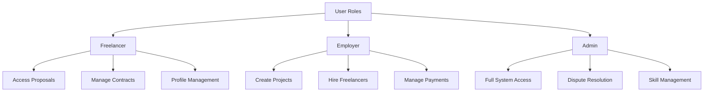
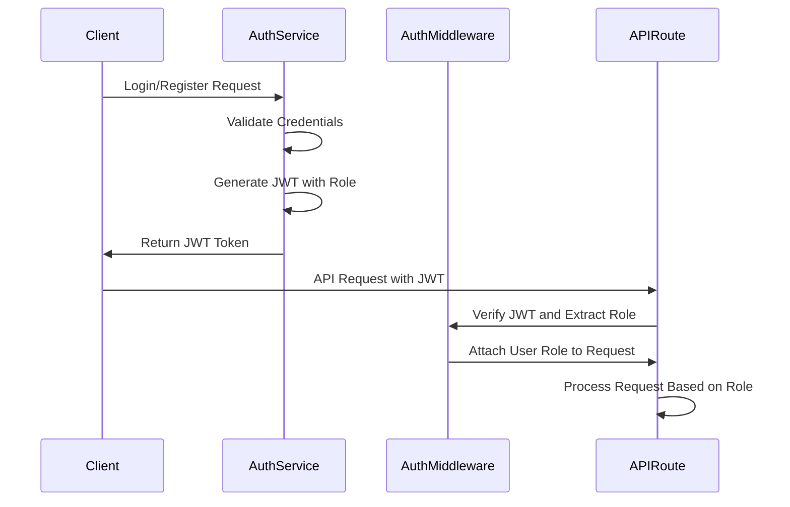
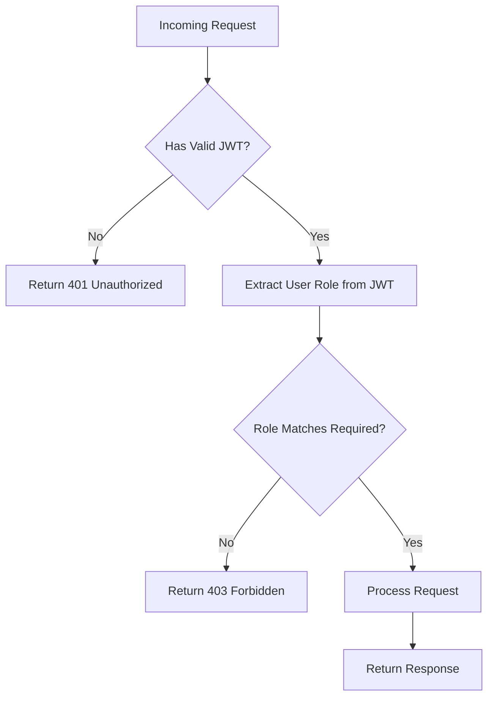
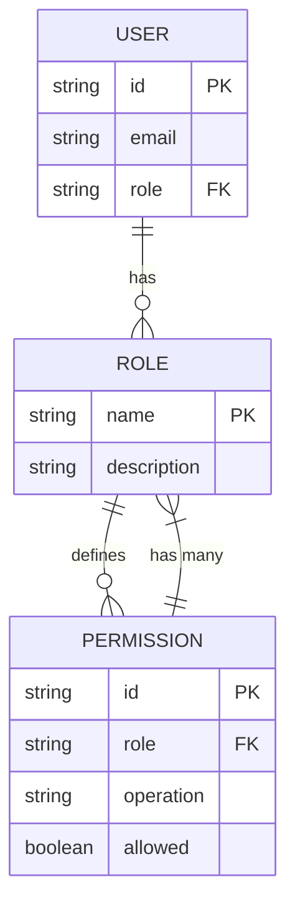

# Role-Based Access Control

<cite>
**Referenced Files in This Document**   
- [auth-middleware.ts](file://src/middleware/auth-middleware.ts)
- [user.ts](file://src/models/user.ts)
- [auth-service.ts](file://src/services/auth-service.ts)
- [auth-routes.ts](file://src/routes/auth-routes.ts)
- [freelancer-routes.ts](file://src/routes/freelancer-routes.ts)
- [employer-routes.ts](file://src/routes/employer-routes.ts)
- [project-routes.ts](file://src/routes/project-routes.ts)
- [dispute-routes.ts](file://src/routes/dispute-routes.ts)
- [proposal-routes.ts](file://src/routes/proposal-routes.ts)
- [payment-routes.ts](file://src/routes/payment-routes.ts)
- [entity-mapper.ts](file://src/utils/entity-mapper.ts)
- [supabase.ts](file://src/config/supabase.ts)
- [schema.sql](file://supabase/schema.sql)
- [ADMIN-MANUAL.md](file://docs/ADMIN-MANUAL.md)
</cite>

## Table of Contents
1. [Introduction](#introduction)
2. [Three-Tier Role Model](#three-tier-role-model)
3. [Role Assignment During Registration](#role-assignment-during-registration)
4. [JWT Token Authentication and Role Extraction](#jwt-token-authentication-and-role-extraction)
5. [Route-Level Authorization Checks](#route-level-authorization-checks)
6. [Middleware Integration](#middleware-integration)
7. [Permitted and Restricted Operations](#permitted-and-restricted-operations)
8. [Admin Privileges and Escalation Paths](#admin-privileges-and-escalation-paths)
9. [Common Issues and Security Considerations](#common-issues-and-security-considerations)
10. [Conclusion](#conclusion)

## Introduction
The FreelanceXchain platform implements a robust role-based access control (RBAC) system to ensure secure and appropriate access to its features. This system is built around a three-tier role model: Freelancer, Employer, and Admin. Each role has distinct permissions that govern what actions a user can perform within the application. The RBAC system is enforced through JWT token authentication, where user roles are extracted from tokens during the authentication process and validated against route-level authorization checks. This documentation provides a comprehensive overview of the RBAC implementation, detailing how roles are assigned, how permissions are enforced, and the specific operations allowed or restricted for each role.

**Section sources**
- [ADMIN-MANUAL.md](file://docs/ADMIN-MANUAL.md#L141-L144)

## Three-Tier Role Model
The FreelanceXchain platform employs a three-tier role model to manage user permissions and access levels. The roles are defined as 'freelancer', 'employer', and 'admin', each with specific capabilities and responsibilities within the system. Freelancers can access proposals, manage their contracts, and maintain their profiles. Employers have the ability to create projects, hire freelancers, and manage payments. Admins possess full system access, including the ability to resolve disputes and manage platform-wide settings. This hierarchical structure ensures that users can only perform actions appropriate to their role, maintaining the integrity and security of the platform.

**Diagram sources**
- [user.ts](file://src/models/user.ts#L3)
- [ADMIN-MANUAL.md](file://docs/ADMIN-MANUAL.md#L141-L144)

**Section sources**
- [user.ts](file://src/models/user.ts#L3)
- [ADMIN-MANUAL.md](file://docs/ADMIN-MANUAL.md#L141-L144)

## Role Assignment During Registration
User roles are assigned during the registration process, where new users must select their role as either 'freelancer' or 'employer'. This selection is a required field in the registration input, ensuring that every user has a defined role upon account creation. The role is stored in the user's metadata within the Supabase Auth system and in the public.users table in the database. Admin roles are not available for self-selection during registration and are typically assigned manually by existing admins or through administrative processes. This approach ensures that role assignment is intentional and controlled, preventing unauthorized access to privileged operations.

**Section sources**
- [auth-routes.ts](file://src/routes/auth-routes.ts#L133-L140)
- [auth-service.ts](file://src/services/auth-service.ts#L68-L155)

## JWT Token Authentication and Role Extraction
The RBAC system in FreelanceXchain relies on JWT token authentication to verify user identities and extract their roles. During the authentication process, when a user logs in or registers, a JWT token is generated that includes the user's role as part of the payload. This token is validated by the `authMiddleware` function, which decodes the token and extracts the user's role. The extracted role is then attached to the request object, making it available for subsequent authorization checks. This mechanism ensures that every request to the API can be authenticated and that the user's role is readily accessible for enforcing access controls.

**Diagram sources**
- [auth-service.ts](file://src/services/auth-service.ts#L233-L258)
- [auth-middleware.ts](file://src/middleware/auth-middleware.ts#L25-L69)

**Section sources**
- [auth-service.ts](file://src/services/auth-service.ts#L233-L258)
- [auth-middleware.ts](file://src/middleware/auth-middleware.ts#L25-L69)

## Route-Level Authorization Checks
Route-level authorization checks are implemented to enforce role-based access to specific API endpoints. The `requireRole` middleware function is used to restrict access to routes based on the user's role. This function checks the role attached to the request object by the `authMiddleware` and compares it against the roles specified for the route. If the user's role does not match any of the required roles, a 403 Forbidden error is returned. This approach ensures that only users with the appropriate roles can access sensitive or privileged operations, providing a granular level of control over API access.

**Diagram sources**
- [auth-middleware.ts](file://src/middleware/auth-middleware.ts#L72-L99)
- [freelancer-routes.ts](file://src/routes/freelancer-routes.ts#L170)
- [employer-routes.ts](file://src/routes/employer-routes.ts#L161)

**Section sources**
- [auth-middleware.ts](file://src/middleware/auth-middleware.ts#L72-L99)

## Middleware Integration
The RBAC system is integrated into the application through middleware functions that handle authentication and authorization. The `authMiddleware` function is responsible for validating JWT tokens and extracting user information, including the role. This middleware is applied to all protected routes to ensure that only authenticated users can access them. The `requireRole` function is a higher-order middleware that adds role-based authorization to routes by checking the user's role against a list of permitted roles. These middleware functions are seamlessly integrated into the Express.js routing system, providing a clean and reusable way to enforce access controls across the application.

**Section sources**
- [auth-middleware.ts](file://src/middleware/auth-middleware.ts#L25-L99)

## Permitted and Restricted Operations
Each role in the FreelanceXchain platform has specific permitted and restricted operations that define their capabilities. Freelancers are permitted to create and manage their profiles, submit proposals, and work on contracts, but they are restricted from creating projects or managing payments. Employers can create projects, hire freelancers, and manage payments, but they lack the ability to resolve disputes or access administrative functions. Admins have full access to all system features, including dispute resolution and skill management. This clear delineation of permissions ensures that users can only perform actions that are appropriate to their role, maintaining the security and integrity of the platform.

**Diagram sources**
- [freelancer-routes.ts](file://src/routes/freelancer-routes.ts#L170)
- [employer-routes.ts](file://src/routes/employer-routes.ts#L161)
- [dispute-routes.ts](file://src/routes/dispute-routes.ts#L424)

**Section sources**
- [freelancer-routes.ts](file://src/routes/freelancer-routes.ts#L170)
- [employer-routes.ts](file://src/routes/employer-routes.ts#L161)
- [dispute-routes.ts](file://src/routes/dispute-routes.ts#L424)

## Admin Privileges and Escalation Paths
Admins in the FreelanceXchain platform have elevated privileges that allow them to perform critical system operations. These include resolving disputes, managing the skill taxonomy, and accessing all system data. Admins can resolve disputes by reviewing evidence and making decisions that affect payment releases. They can also create and deprecate skills, ensuring that the platform's skill categories remain relevant and up-to-date. Escalation paths for users to gain admin privileges are not available through self-service and require manual intervention by existing admins, ensuring that administrative access is tightly controlled and secure.

**Section sources**
- [ADMIN-MANUAL.md](file://docs/ADMIN-MANUAL.md#L147-L197)
- [skill-routes.ts](file://src/routes/skill-routes.ts#L238-L341)
- [dispute-routes.ts](file://src/routes/dispute-routes.ts#L424-L487)

## Common Issues and Security Considerations
Common issues in the RBAC system include privilege misalignment and token tampering. Privilege misalignment can occur if a user's role is incorrectly assigned or updated, leading to unauthorized access or restricted functionality. This can be mitigated by rigorous validation during role assignment and regular audits of user roles. Token tampering is a security concern where an attacker attempts to modify a JWT token to gain elevated privileges. This is prevented by using strong cryptographic signatures for tokens and validating them on every request. Additionally, the use of Supabase's service role policies ensures that backend operations can bypass row-level security when necessary, while still maintaining overall system security.

**Section sources**
- [schema.sql](file://supabase/schema.sql#L247-L260)
- [auth-service.ts](file://src/services/auth-service.ts#L233-L258)
- [auth-middleware.ts](file://src/middleware/auth-middleware.ts#L25-L69)

## Conclusion
The role-based access control system in FreelanceXchain effectively manages user permissions through a well-defined three-tier role model. By leveraging JWT token authentication and middleware-based authorization checks, the system ensures that users can only access features appropriate to their role. The clear separation of permissions between freelancers, employers, and admins maintains the security and integrity of the platform, while the integration of middleware functions provides a scalable and maintainable approach to access control. Addressing common issues such as privilege misalignment and token tampering further strengthens the system's security, making it a robust foundation for the FreelanceXchain platform.