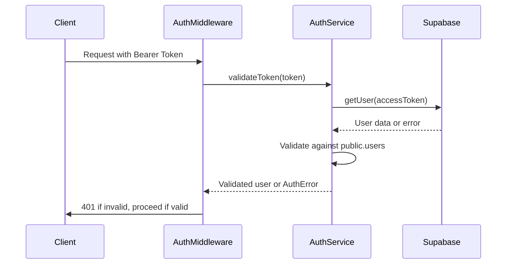
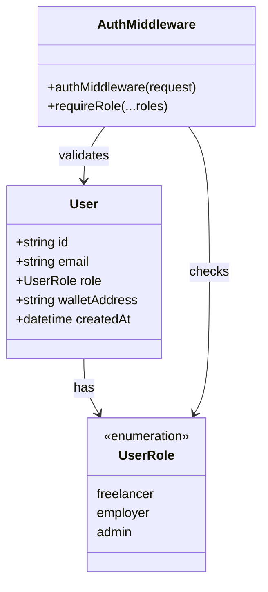
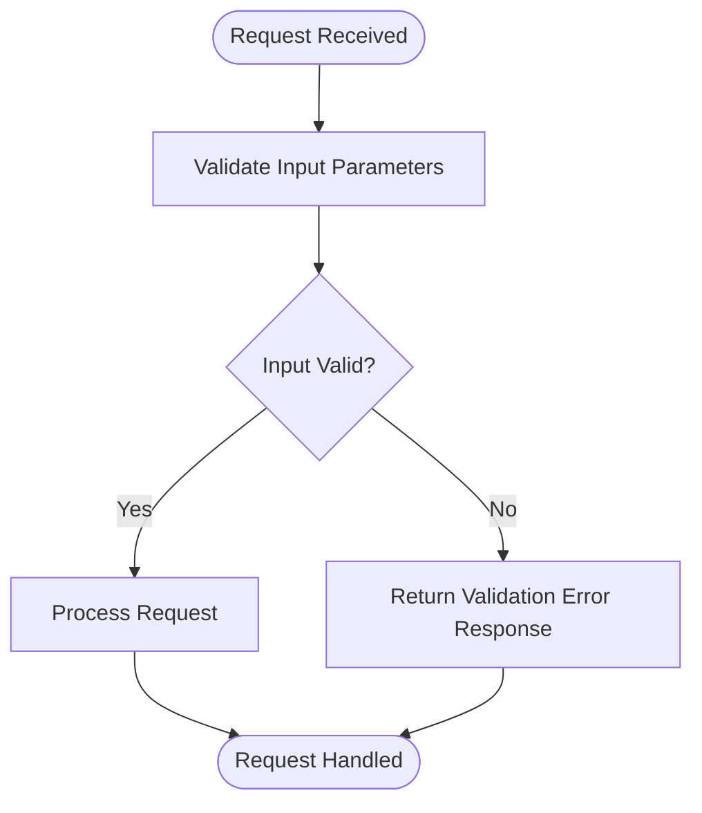
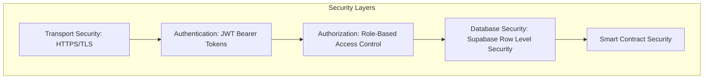
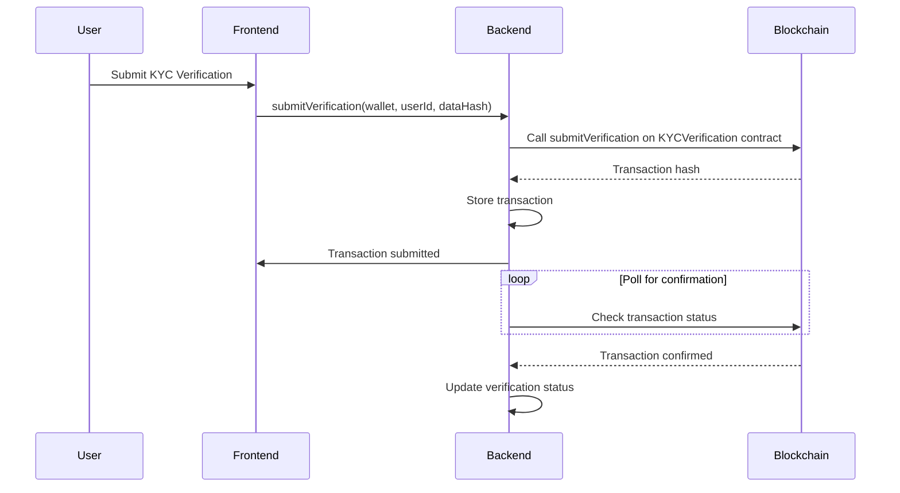
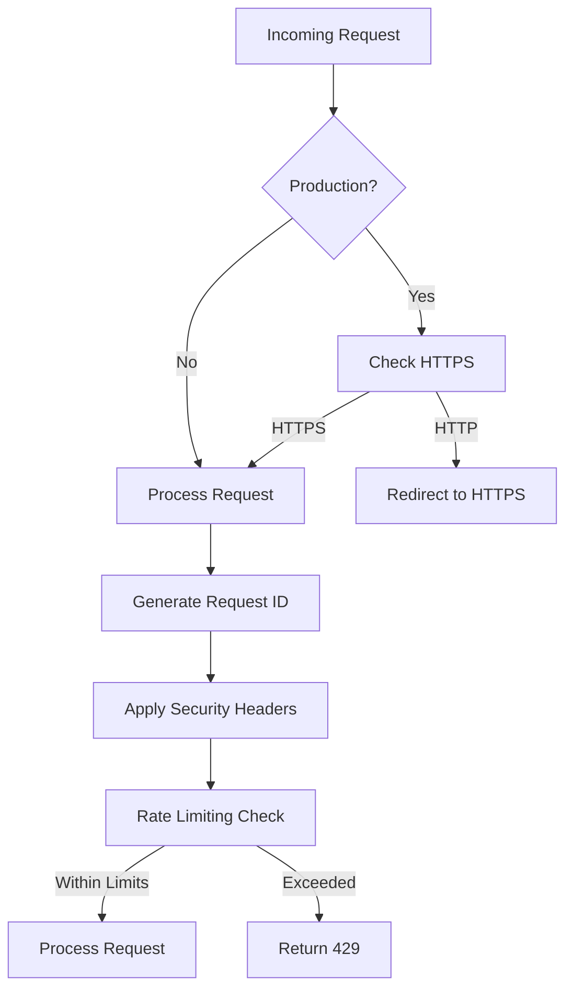

# Security Considerations

<cite>
**Referenced Files in This Document**   
- [auth-middleware.ts](file://src/middleware/auth-middleware.ts)
- [auth-service.ts](file://src/services/auth-service.ts)
- [security-middleware.ts](file://src/middleware/security-middleware.ts)
- [rate-limiter.ts](file://src/middleware/rate-limiter.ts)
- [validation-middleware.ts](file://src/middleware/validation-middleware.ts)
- [supabase.ts](file://src/config/supabase.ts)
- [KYCVerification.sol](file://contracts/KYCVerification.sol)
- [blockchain-client.ts](file://src/services/blockchain-client.ts)
- [kyc.ts](file://src/models/kyc.ts)
- [kyc-repository.ts](file://src/repositories/kyc-repository.ts)
- [error-handler.ts](file://src/middleware/error-handler.ts)
- [env.ts](file://src/config/env.ts)
- [auth-routes.ts](file://src/routes/auth-routes.ts)
- [TECHNICAL-SPECS.md](file://docs/TECHNICAL-SPECS.md)
- [ARCHITECTURE.md](file://docs/ARCHITECTURE.md)
- [kyc-contract.ts](file://src/services/kyc-contract.ts)
- [ADMIN-MANUAL.md](file://docs/ADMIN-MANUAL.md)
</cite>

## Table of Contents
1. [Introduction](#introduction)
2. [Authentication Mechanisms](#authentication-mechanisms)
3. [Authorization Strategies](#authorization-strategies)
4. [Input Validation Practices](#input-validation-practices)
5. [Supabase Row Level Security](#supabase-row-level-security)
6. [Blockchain Security Patterns](#blockchain-security-patterns)
7. [API Security Measures](#api-security-measures)
8. [Data Privacy Considerations](#data-privacy-considerations)
9. [Security Testing Guidelines](#security-testing-guidelines)
10. [Conclusion](#conclusion)

## Introduction
FreelanceXchain implements a comprehensive security framework across multiple layers of the application stack. The system combines traditional web security practices with blockchain-specific protections to ensure data integrity, user privacy, and system reliability. This document details the security architecture, covering authentication, authorization, input validation, database security, blockchain patterns, API protections, and data privacy compliance. The implementation leverages Supabase for authentication and database security, while incorporating blockchain technology for transparent and immutable operations.

## Authentication Mechanisms

FreelanceXchain employs a robust JWT-based authentication system with token rotation and expiration policies. The authentication flow begins with user registration or login, where credentials are validated before issuing tokens. The system generates two types of JWT tokens: access tokens with a 1-hour expiration and refresh tokens with a 7-day expiration. These tokens are signed with separate secrets for enhanced security, as defined in the environment configuration.

The authentication middleware validates incoming requests by checking for the presence of a Bearer token in the Authorization header. If present, the token is verified against the Supabase authentication system and the local user database. The system supports both traditional email/password authentication and OAuth flows with providers like Google, GitHub, Azure, and LinkedIn. For OAuth users, the system implements a two-step registration process where new users must select a role (freelancer or employer) after initial authentication.

Password security is enforced through strength validation requiring a minimum of 8 characters with uppercase, lowercase, numeric, and special characters. The system also implements rate limiting on authentication endpoints to prevent brute force attacks, allowing only 10 attempts per 15 minutes per IP address.

**Diagram sources**
- [auth-middleware.ts](file://src/middleware/auth-middleware.ts#L25-L69)
- [auth-service.ts](file://src/services/auth-service.ts#L233-L259)
- [TECHNICAL-SPECS.md](file://docs/TECHNICAL-SPECS.md#L366-L368)

**Section sources**
- [auth-middleware.ts](file://src/middleware/auth-middleware.ts#L1-L101)
- [auth-service.ts](file://src/services/auth-service.ts#L1-L473)
- [env.ts](file://src/config/env.ts#L52-L58)
- [auth-routes.ts](file://src/routes/auth-routes.ts#L1-L800)

## Authorization Strategies

The authorization system implements role-based access control (RBAC) with distinct permissions for freelancers, employers, and administrators. The RBAC model is enforced through middleware that checks user roles before allowing access to protected routes. The `requireRole` middleware function accepts one or more roles and verifies that the authenticated user possesses at least one of the required roles.

Freelancers have access to profile management, proposal submission, contract viewing, and milestone tracking. Employers can create projects, manage hiring processes, approve milestones, and initiate payments. Administrative functions are restricted to system administrators who can manage user accounts, review KYC verifications, and monitor system operations.

The authorization checks are performed after authentication, ensuring that only authenticated users with appropriate roles can access specific resources. The system returns standardized error responses with appropriate HTTP status codes (401 for unauthenticated requests, 403 for insufficient permissions) to prevent information leakage about protected resources.

**Diagram sources**
- [auth-middleware.ts](file://src/middleware/auth-middleware.ts#L72-L99)
- [auth-service.ts](file://src/services/auth-service.ts#L5-L6)
- [user.ts](file://src/models/user.ts)

**Section sources**
- [auth-middleware.ts](file://src/middleware/auth-middleware.ts#L72-L99)
- [auth-service.ts](file://src/services/auth-service.ts#L5-L6)
- [user.ts](file://src/models/user.ts)

## Input Validation Practices

FreelanceXchain implements comprehensive input validation through middleware to prevent injection attacks and ensure data integrity. The validation system uses JSON schema-based validation for API requests, providing field-specific error reporting. Each validation schema defines type requirements, length constraints, format patterns, and required fields for different endpoints.

The validation middleware processes request bodies, parameters, and query strings according to predefined schemas. For string inputs, the system enforces length limits and validates against regular expression patterns for emails, UUIDs, dates, and URIs. Numeric inputs are validated for minimum and maximum values, while arrays are checked for item count and nested validation rules.

The system includes specific validation schemas for various operations including user registration, profile creation, project submission, and proposal management. These schemas ensure that all incoming data meets the application's requirements before processing. Validation errors are returned with detailed information about which fields failed validation and why, enabling clients to correct their requests.

**Diagram sources**
- [validation-middleware.ts](file://src/middleware/validation-middleware.ts#L322-L362)
- [validation-middleware.ts](file://src/middleware/validation-middleware.ts#L402-L770)

**Section sources**
- [validation-middleware.ts](file://src/middleware/validation-middleware.ts#L1-L800)
- [error-handler.ts](file://src/middleware/error-handler.ts#L4-L18)

## Supabase Row Level Security

The application leverages Supabase Row Level Security (RLS) to ensure users can only access their own data. RLS policies are implemented at the database level, providing an additional security layer beyond application-level checks. The system uses Supabase's built-in authentication to identify users and enforce data access rules.

Each table in the database has RLS policies that restrict read and write operations based on the authenticated user's ID. For example, users can only read and update their own profile information, while employers can only access projects they have created. The RLS policies work in conjunction with the application's authorization middleware to provide defense in depth.

The system architecture diagram shows how RLS fits into the overall security layers, operating between the authentication and authorization layers and the database layer. This ensures that even if an attacker bypasses application-level security, they would still be restricted by database-level policies.

**Diagram sources**
- [ARCHITECTURE.md](file://docs/ARCHITECTURE.md#L183-L218)
- [supabase.ts](file://src/config/supabase.ts#L6-L21)

**Section sources**
- [supabase.ts](file://src/config/supabase.ts#L6-L21)
- [ARCHITECTURE.md](file://docs/ARCHITECTURE.md#L183-L218)

## Blockchain Security Patterns

FreelanceXchain incorporates several blockchain security patterns to protect smart contract operations and ensure transaction integrity. The KYCVerification smart contract implements access control through modifiers like `onlyOwner` and `onlyVerifier`, restricting sensitive operations to authorized addresses. The contract uses enumeration types for verification status and KYC tier to prevent invalid states.

The system implements secure private key management by storing the blockchain private key in environment variables rather than in code. Transaction validation is performed through comprehensive input checks that verify wallet addresses, data hashes, and validity periods before processing. The smart contract includes reentrancy protection through careful ordering of external calls and state updates.

For transaction management, the blockchain client simulates transaction submission, hashing, and confirmation processes. The system generates mock transaction hashes and simulates confirmation after a delay, providing a realistic transaction lifecycle. The client includes functions to poll transaction status until confirmation or failure, ensuring reliable transaction processing.

**Diagram sources**
- [KYCVerification.sol](file://contracts/KYCVerification.sol#L40-L48)
- [blockchain-client.ts](file://src/services/blockchain-client.ts#L131-L159)
- [kyc-contract.ts](file://src/services/kyc-contract.ts#L105-L137)

**Section sources**
- [KYCVerification.sol](file://contracts/KYCVerification.sol#L1-L211)
- [blockchain-client.ts](file://src/services/blockchain-client.ts#L1-L293)
- [kyc-contract.ts](file://src/services/kyc-contract.ts#L45-L365)

## API Security Measures

The API implements multiple security measures to protect against common web vulnerabilities. The system uses helmet.js to set security-related HTTP headers, including Content Security Policy (CSP), XSS protection, HSTS, and frameguard. The CSP configuration allows necessary resources while preventing inline scripts and unauthorized connections.

Rate limiting is implemented on authentication and sensitive endpoints to prevent abuse. The authentication endpoints are limited to 10 attempts per 15 minutes, while general API endpoints allow 100 requests per minute. Sensitive operations have stricter limits of 5 attempts per hour to prevent brute force attacks on critical functionality.

CORS configuration is managed through environment variables, allowing specification of permitted origins. The system supports wildcard subdomains and defaults to localhost origins in development mode. HTTPS enforcement middleware redirects HTTP requests to HTTPS in production environments, ensuring encrypted communication.

Request ID generation provides traceability for debugging and monitoring, with each request receiving a unique identifier that is included in all responses and logs.

**Diagram sources**
- [security-middleware.ts](file://src/middleware/security-middleware.ts#L18-L49)
- [rate-limiter.ts](file://src/middleware/rate-limiter.ts#L27-L60)
- [security-middleware.ts](file://src/middleware/security-middleware.ts#L68-L85)

**Section sources**
- [security-middleware.ts](file://src/middleware/security-middleware.ts#L1-L124)
- [rate-limiter.ts](file://src/middleware/rate-limiter.ts#L1-L81)

## Data Privacy Considerations

FreelanceXchain addresses data privacy through careful handling of KYC information and compliance with GDPR principles. The system stores personal data in encrypted form and implements strict access controls to limit who can view sensitive information. KYC data is stored off-chain in the Supabase database with access restricted to authorized personnel.

The blockchain implementation follows a privacy-preserving approach by storing only verification status and data hashes on-chain, rather than personal information. This design ensures transparency and immutability while protecting user privacy. The KYCVerification contract explicitly notes that it stores "proof without revealing data" to maintain GDPR compliance.

The system includes mechanisms for data subject rights, including the ability to access personal data and request deletion. User data is associated with UUIDs rather than personally identifiable information where possible, and all data processing activities are logged for audit purposes.

Data minimization principles are applied throughout the system, collecting only information necessary for the platform's functionality. The KYC process collects tiered information based on verification level, with enhanced verification requiring more detailed information than basic verification.

**Section sources**
- [KYCVerification.sol](file://contracts/KYCVerification.sol#L7)
- [kyc.ts](file://src/models/kyc.ts#L1-L206)
- [kyc-repository.ts](file://src/repositories/kyc-repository.ts#L1-L178)

## Security Testing Guidelines

The system includes comprehensive security testing guidelines to prevent common vulnerabilities. The codebase should be tested for injection attacks by validating all input validation rules and ensuring proper escaping of special characters. Authentication and authorization flows should be tested for bypass vulnerabilities by attempting to access protected resources with invalid or missing credentials.

Smart contract security testing should focus on reentrancy attacks, integer overflow/underflow, and access control bypasses. The KYCVerification contract should be tested to ensure that only authorized addresses can approve or reject verifications. Transaction validation should be tested with malformed data to verify proper error handling.

API security testing should include attempts to bypass rate limiting, exploit CORS misconfigurations, and manipulate security headers. The system should be tested for sensitive data exposure by examining responses for unintended information disclosure.

The application includes functions for clearing test data and resetting the blockchain state, facilitating repeatable security testing. These functions should only be available in development environments and never exposed in production.

**Section sources**
- [blockchain-client.ts](file://src/services/blockchain-client.ts#L274-L277)
- [kyc-contract.ts](file://src/services/kyc-contract.ts#L349-L352)
- [ADMIN-MANUAL.md](file://docs/ADMIN-MANUAL.md#L335-L338)

## Conclusion

FreelanceXchain implements a multi-layered security approach that combines traditional web security practices with blockchain-specific protections. The system's authentication mechanism uses JWT tokens with appropriate expiration policies and rate limiting to prevent abuse. Authorization is enforced through role-based access control, ensuring users can only perform actions appropriate to their role.

Input validation is comprehensive, using JSON schemas to validate all incoming data and prevent injection attacks. Database security is enhanced through Supabase Row Level Security, providing an additional layer of protection for user data. The blockchain implementation follows security best practices with access controls, input validation, and privacy-preserving design.

API security is strengthened through helmet.js protections, rate limiting, CORS configuration, and HTTPS enforcement. Data privacy is prioritized through careful handling of KYC information and GDPR compliance. The system provides clear guidelines for security testing to identify and prevent common vulnerabilities.

This comprehensive security framework ensures that FreelanceXchain protects user data, maintains system integrity, and provides a trustworthy platform for freelance transactions.