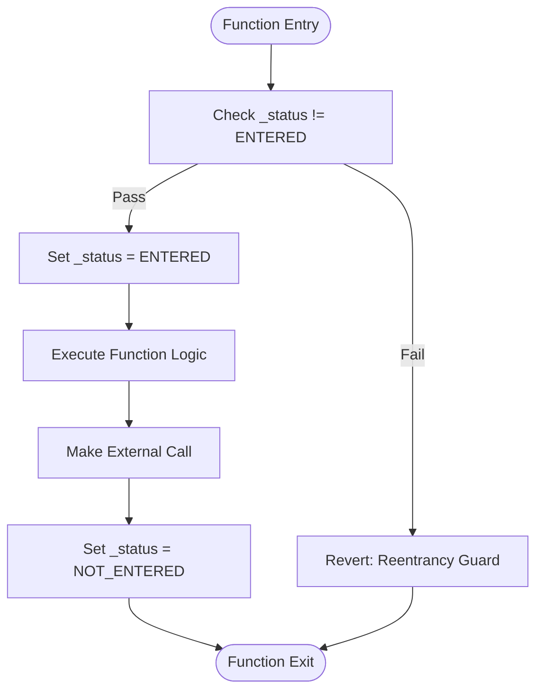
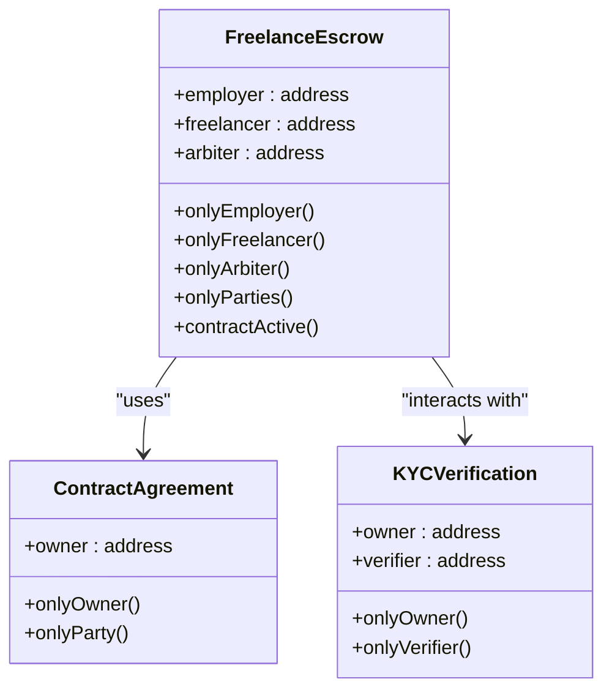
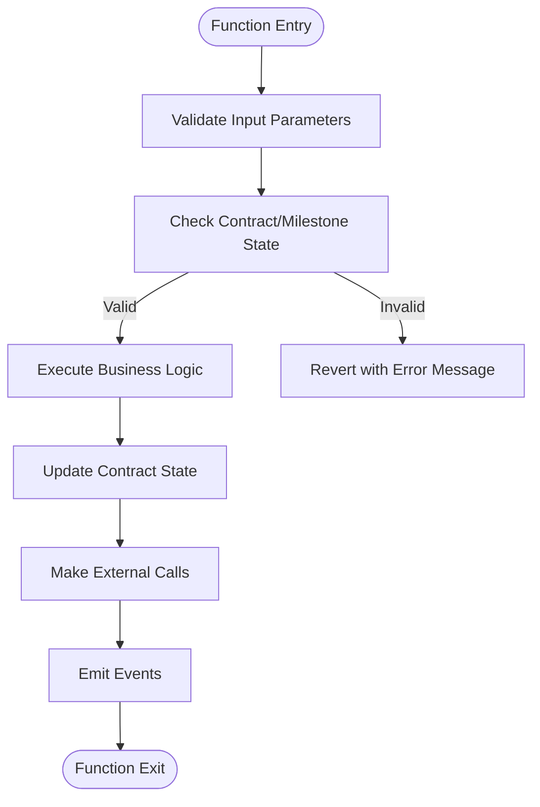
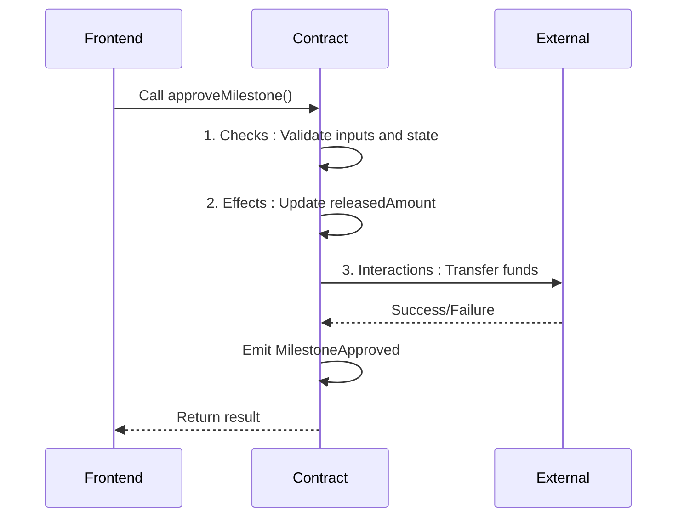
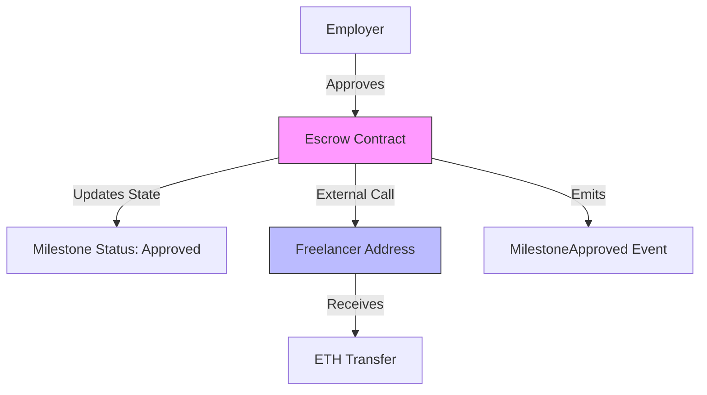
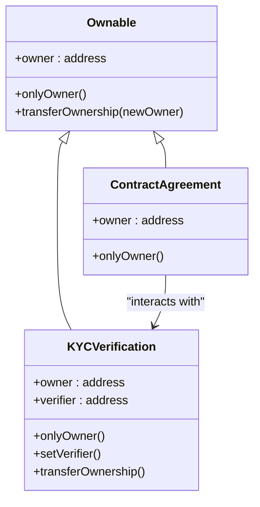
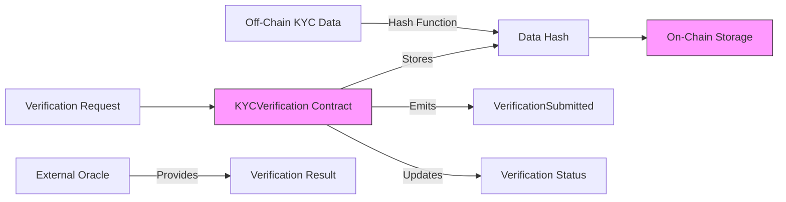
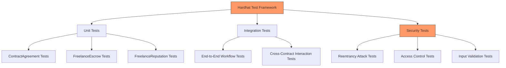

# Smart Contract Security

<cite>
**Referenced Files in This Document**   
- [FreelanceEscrow.sol](file://contracts/FreelanceEscrow.sol)
- [ContractAgreement.sol](file://contracts/ContractAgreement.sol)
- [DisputeResolution.sol](file://contracts/DisputeResolution.sol)
- [FreelanceReputation.sol](file://contracts/FreelanceReputation.sol)
- [KYCVerification.sol](file://contracts/KYCVerification.sol)
- [MilestoneRegistry.sol](file://contracts/MilestoneRegistry.sol)
- [TECHNICAL-SPECS.md](file://docs/TECHNICAL-SPECS.md)
- [TESTING.md](file://docs/TESTING.md)
- [hardhat.config.cjs](file://hardhat.config.cjs)
- [test-workflow.cjs](file://scripts/test-workflow.cjs)
- [blockchain-client.ts](file://src/services/blockchain-client.ts)
- [web3-client.ts](file://src/services/web3-client.ts)
</cite>

## Table of Contents
1. [Introduction](#introduction)
2. [Reentrancy Protection](#reentrancy-protection)
3. [Access Control Mechanisms](#access-control-mechanisms)
4. [Input Validation and State Checks](#input-validation-and-state-checks)
5. [Secure Transaction Patterns](#secure-transaction-patterns)
6. [Payment Security Patterns](#payment-security-patterns)
7. [Contract Upgrade and Ownership](#contract-upgrade-and-ownership)
8. [External Oracle Interactions](#external-oracle-interactions)
9. [Testing Strategies](#testing-strategies)
10. [Conclusion](#conclusion)

## Introduction

The FreelanceXchain platform implements a comprehensive security framework across its smart contract ecosystem to ensure the integrity, safety, and reliability of freelance marketplace operations. This documentation details the security patterns employed in the platform's core contracts, focusing on protection against common vulnerabilities such as reentrancy attacks, unauthorized access, and arithmetic overflows. The security architecture combines Solidity best practices with comprehensive testing methodologies to create a robust decentralized application.

The platform's security model is built around several key principles: prevention of recursive call attacks through reentrancy guards, strict access control via custom modifiers, comprehensive input validation, and implementation of secure transaction patterns. These measures work in concert to protect user funds and ensure the correct execution of business logic across all contract interactions.

**Section sources**
- [TECHNICAL-SPECS.md](file://docs/TECHNICAL-SPECS.md#smart-contract-security)

## Reentrancy Protection

The FreelanceEscrow contract implements a manual reentrancy guard to prevent recursive call attacks during fund withdrawal operations. This protection is critical for preventing malicious contracts from repeatedly calling withdrawal functions before state updates are completed.

The reentrancy guard is implemented using a state variable `_status` with two constant values: `NOT_ENTERED` (1) and `ENTERED` (2). Before executing any sensitive operation, the `nonReentrant` modifier checks that the contract is not already in the `ENTERED` state. If the check passes, the status is set to `ENTERED` before the function executes and reset to `NOT_ENTERED` after completion.

This pattern is applied to all payment-related functions including `approveMilestone`, `resolveDispute`, `refundMilestone`, and `cancelContract`. By following the checks-effects-interactions pattern, the contract ensures that all state changes are completed before any external calls are made, eliminating the window for reentrancy attacks.

**Diagram sources**
- [FreelanceEscrow.sol](file://contracts/FreelanceEscrow.sol#L18-L54)

**Section sources**
- [FreelanceEscrow.sol](file://contracts/FreelanceEscrow.sol#L18-L54)
- [TESTING.md](file://docs/TESTING.md#smart-contract-tests)

## Access Control Mechanisms

The FreelanceXchain contracts implement a comprehensive access control system using custom modifiers to enforce role-based privileges. These modifiers ensure that only authorized parties can execute specific functions, preventing unauthorized access to sensitive operations.

The primary access control modifiers include:
- `onlyEmployer`: Restricts function access to the employer address
- `onlyFreelancer`: Restricts function access to the freelancer address  
- `onlyArbiter`: Restricts function access to the dispute arbiter
- `onlyParties`: Allows access to either the employer or freelancer
- `contractActive`: Ensures the contract is in an active state

These modifiers are implemented using require statements that validate the `msg.sender` against the appropriate role address. For example, the `onlyEmployer` modifier ensures that only the employer can approve milestones or cancel the contract, while the `onlyFreelancer` modifier restricts milestone submission to the freelancer.

Additional contracts extend this pattern with their own access controls. The ContractAgreement contract uses `onlyOwner` and `onlyParty` modifiers, while the KYCVerification contract implements `onlyOwner` and `onlyVerifier` modifiers to control access to verification functions.

**Diagram sources**
- [FreelanceEscrow.sol](file://contracts/FreelanceEscrow.sol#L56-L82)
- [ContractAgreement.sol](file://contracts/ContractAgreement.sol#L40-L43)
- [KYCVerification.sol](file://contracts/KYCVerification.sol#L40-L47)

**Section sources**
- [FreelanceEscrow.sol](file://contracts/FreelanceEscrow.sol#L56-L82)
- [ContractAgreement.sol](file://contracts/ContractAgreement.sol#L40-L43)
- [KYCVerification.sol](file://contracts/KYCVerification.sol#L40-L47)

## Input Validation and State Checks

The FreelanceXchain contracts implement comprehensive input validation and state checks to prevent malformed data processing and ensure the integrity of contract operations. These validations occur at multiple levels, from basic parameter checks to complex business logic validations.

Input validation is performed using require statements that check for various conditions before executing function logic. For example, the FreelanceEscrow constructor validates that the freelancer address is not zero, that there is at least one milestone, and that the milestone amounts and descriptions arrays have matching lengths.

State checks ensure that operations are only performed when the contract is in an appropriate state. The `contractActive` modifier prevents operations on cancelled contracts, while milestone-specific functions check that milestones are in the correct status (e.g., only submitted milestones can be approved).

Additional validation patterns include:
- Array bounds checking for milestone indices
- Sufficient balance verification before transfers
- Duplicate prevention through status checks
- Arithmetic overflow protection via Solidity 0.8+ built-in checks

These validation mechanisms work together to create a robust defense against both accidental errors and malicious attempts to exploit contract vulnerabilities.

**Diagram sources**
- [FreelanceEscrow.sol](file://contracts/FreelanceEscrow.sol#L91-L115)
- [FreelanceEscrow.sol](file://contracts/FreelanceEscrow.sol#L127-L130)
- [FreelanceEscrow.sol](file://contracts/FreelanceEscrow.sol#L139-L144)

**Section sources**
- [FreelanceEscrow.sol](file://contracts/FreelanceEscrow.sol#L91-L115)
- [FreelanceEscrow.sol](file://contracts/FreelanceEscrow.sol#L127-L130)
- [FreelanceEscrow.sol](file://contracts/FreelanceEscrow.sol#L139-L144)

## Secure Transaction Patterns

The FreelanceXchain contracts follow established secure transaction patterns to ensure the reliability and safety of all operations. The primary pattern implemented is the checks-effects-interactions pattern, which structures functions to minimize the risk of vulnerabilities.

In the checks-effects-interactions pattern, functions are organized into three distinct phases:
1. **Checks**: Validate all preconditions and inputs
2. **Effects**: Update contract state variables
3. **Interactions**: Make external calls to other contracts or addresses

This ordering is critical for preventing reentrancy attacks and ensuring that state changes are completed before any external interactions occur. For example, in the `approveMilestone` function, the contract first checks that the milestone is submitted, then updates the released amount, and finally makes the external call to transfer funds to the freelancer.

The contracts also implement proper error handling using require statements that provide descriptive error messages. These messages help users and developers understand why a transaction failed, facilitating debugging and improving user experience.

Additionally, the contracts use events extensively to provide external visibility into state changes. Events such as `FundsDeposited`, `MilestoneApproved`, and `ContractCompleted` allow off-chain systems to monitor contract activity and update their state accordingly.

**Diagram sources**
- [FreelanceEscrow.sol](file://contracts/FreelanceEscrow.sol#L139-L160)
- [FreelanceEscrow.sol](file://contracts/FreelanceEscrow.sol#L150-L153)

**Section sources**
- [FreelanceEscrow.sol](file://contracts/FreelanceEscrow.sol#L139-L160)
- [TECHNICAL-SPECS.md](file://docs/TECHNICAL-SPECS.md#smart-contract-security)

## Payment Security Patterns

The FreelanceXchain platform implements the pull-over-push payment pattern in its escrow system to minimize fund exposure and enhance security. This pattern requires recipients to actively claim their payments rather than having funds automatically pushed to them.

In the FreelanceEscrow contract, when an employer approves a milestone, the funds are not immediately transferred. Instead, the milestone status is updated to "Approved" and the released amount is recorded. The actual fund transfer occurs when the contract makes an external call to send ETH to the freelancer's address.

This approach provides several security benefits:
- Reduces the attack surface by limiting external calls
- Prevents forced transfer attacks where malicious contracts reject incoming ETH
- Gives recipients control over when they receive funds
- Enables better error handling and recovery

The contract also implements a refund mechanism that allows employers to refund pending milestones and cancel contracts to recover remaining funds. These functions include appropriate access controls and state checks to prevent unauthorized withdrawals.

The pull-over-push pattern is complemented by the reentrancy guard and checks-effects-interactions pattern to create a comprehensive security framework for all payment operations.

**Diagram sources**
- [FreelanceEscrow.sol](file://contracts/FreelanceEscrow.sol#L149-L153)
- [FreelanceEscrow.sol](file://contracts/FreelanceEscrow.sol#L232-L234)

**Section sources**
- [FreelanceEscrow.sol](file://contracts/FreelanceEscrow.sol#L149-L153)
- [FreelanceEscrow.sol](file://contracts/FreelanceEscrow.sol#L232-L234)

## Contract Upgrade and Ownership

The FreelanceXchain contracts implement ownership management patterns to control administrative functions while maintaining security. Each contract has an owner address that can perform specific administrative tasks, with ownership typically assigned to the deployer address.

The ownership pattern is implemented through the `onlyOwner` modifier, which restricts access to certain functions to the contract owner. This pattern is used consistently across multiple contracts including ContractAgreement, DisputeResolution, and KYCVerification.

For critical operations like ownership transfer, contracts implement safe transfer patterns that emit events to provide transparency. The KYCVerification contract, for example, includes a `transferOwnership` function that updates the owner address and emits an `OwnershipTransferred` event.

The platform follows a non-upgradable contract design for core financial contracts like FreelanceEscrow, ensuring that the logic cannot be changed after deployment. This approach prioritizes security and predictability over flexibility, as users can be confident that the contract behavior will not change.

For contracts that require updates, the platform could implement a proxy pattern in future versions, but the current implementation focuses on immutable contracts for maximum security.

**Diagram sources**
- [ContractAgreement.sol](file://contracts/ContractAgreement.sol#L40-L43)
- [KYCVerification.sol](file://contracts/KYCVerification.sol#L193-L208)
- [DisputeResolution.sol](file://contracts/DisputeResolution.sol#L39-L41)

**Section sources**
- [ContractAgreement.sol](file://contracts/ContractAgreement.sol#L40-L43)
- [KYCVerification.sol](file://contracts/KYCVerification.sol#L193-L208)

## External Oracle Interactions

The FreelanceXchain platform is designed to interact securely with external oracles and services while minimizing trust assumptions. The KYCVerification contract exemplifies this approach by storing only verification status and data hashes on-chain, keeping sensitive personal information off-chain.

The contract uses a hash-based verification system where the actual KYC data remains off-chain, and only its cryptographic hash is stored on-chain. This approach provides proof of data integrity without exposing sensitive information, complying with privacy regulations like GDPR.

For oracle interactions, the platform follows the check-and-send pattern, where contract functions validate the oracle's response before acting on it. The DisputeResolution contract, for example, records dispute outcomes on-chain but relies on off-chain arbitration processes.

The system also implements expiration mechanisms for time-sensitive data. The KYCVerification contract includes expiration timestamps and a function to mark verifications as expired, ensuring that outdated information is not considered valid.

These patterns ensure that the platform can leverage external services while maintaining the security and integrity of on-chain operations.

**Diagram sources**
- [KYCVerification.sol](file://contracts/KYCVerification.sol#L19-L23)
- [KYCVerification.sol](file://contracts/KYCVerification.sol#L142-L148)

**Section sources**
- [KYCVerification.sol](file://contracts/KYCVerification.sol#L19-L23)
- [KYCVerification.sol](file://contracts/KYCVerification.sol#L142-L148)

## Testing Strategies

The FreelanceXchain platform employs a comprehensive testing strategy using Hardhat to verify contract security and functionality. The testing framework includes unit tests, integration tests, and specific security tests for vulnerabilities like reentrancy attacks.

The Hardhat configuration supports multiple networks including local development (hardhat), Ganache, Sepolia testnet, and Polygon networks. This allows for thorough testing across different environments before mainnet deployment.

Security tests specifically target known vulnerabilities:
- Reentrancy attack simulations
- Access control enforcement
- Input validation edge cases
- State transition correctness
- Fallback function behavior

The test-workflow.cjs script demonstrates a complete end-to-end test of the core functionality, including milestone submission, approval, payment release, and reputation scoring. This integration test verifies that multiple contracts work together correctly.

The testing strategy also includes property-based testing using fast-check to generate random inputs and test edge cases that might not be caught by traditional unit tests.

**Diagram sources**
- [hardhat.config.cjs](file://hardhat.config.cjs#L1-L50)
- [test-workflow.cjs](file://scripts/test-workflow.cjs#L1-L128)
- [TESTING.md](file://docs/TESTING.md#smart-contract-tests)

**Section sources**
- [hardhat.config.cjs](file://hardhat.config.cjs#L1-L50)
- [test-workflow.cjs](file://scripts/test-workflow.cjs#L1-L128)
- [TESTING.md](file://docs/TESTING.md#smart-contract-tests)

## Conclusion

The FreelanceXchain platform implements a robust security framework across its smart contract ecosystem, addressing key vulnerabilities through a combination of technical patterns and comprehensive testing. The reentrancy guard in the FreelanceEscrow contract effectively prevents recursive call attacks during fund withdrawals, while custom access control modifiers ensure that only authorized parties can execute sensitive operations.

The platform follows security best practices including input validation, state checks, and the checks-effects-interactions pattern to prevent common vulnerabilities. The pull-over-push payment pattern minimizes fund exposure, and ownership management provides controlled administrative access without compromising security.

Comprehensive testing using Hardhat verifies both functionality and security, with specific tests for reentrancy attacks and other vulnerabilities. The combination of these security patterns creates a trustworthy environment for freelance marketplace operations, protecting user funds and ensuring the integrity of contract execution.

Future enhancements could include formal verification of critical contracts and integration with third-party audit services, but the current implementation provides a solid foundation for secure decentralized freelance transactions.

**Section sources**
- [TECHNICAL-SPECS.md](file://docs/TECHNICAL-SPECS.md#smart-contract-security)
- [TESTING.md](file://docs/TESTING.md#smart-contract-tests)
- [ADMIN-MANUAL.md](file://docs/ADMIN-MANUAL.md#security-checklist)