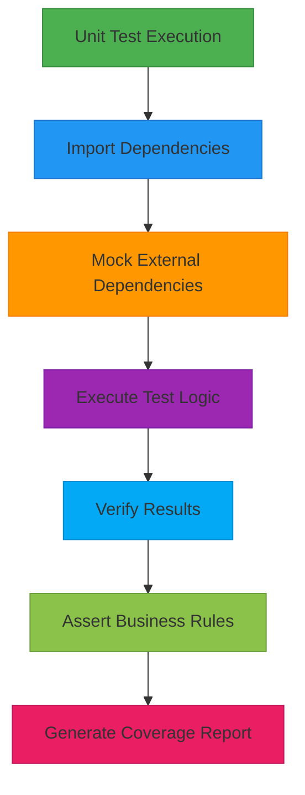
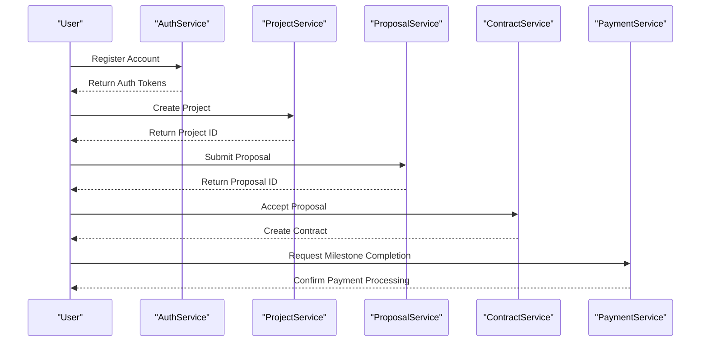
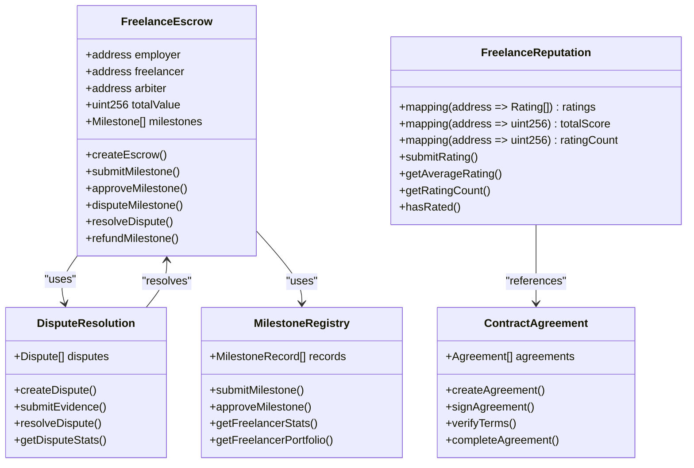
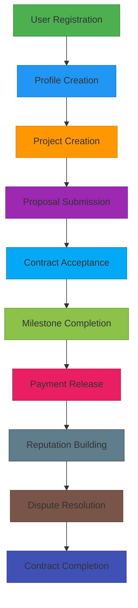
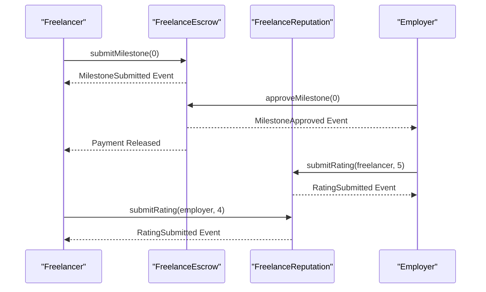
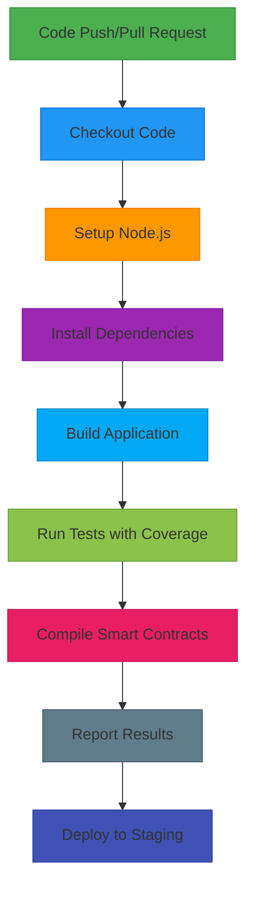

# Testing Strategy

<cite>
**Referenced Files in This Document**   
- [jest.config.js](file://jest.config.js)
- [jest.setup.js](file://jest.setup.js)
- [hardhat.config.cjs](file://hardhat.config.cjs)
- [package.json](file://package.json)
- [docs/TESTING.md](file://docs/TESTING.md)
- [src/services/__tests__/auth-service.test.ts](file://src/services/__tests__/auth-service.test.ts)
- [src/services/__tests__/project-service.test.ts](file://src/services/__tests__/project-service.test.ts)
- [src/services/__tests__/payment-service.test.ts](file://src/services/__tests__/payment-service.test.ts)
- [src/services/__tests__/blockchain-services.test.ts](file://src/services/__tests__/blockchain-services.test.ts)
- [src/__tests__/integration.test.ts](file://src/__tests__/integration.test.ts)
- [scripts/test-workflow.cjs](file://scripts/test-workflow.cjs)
- [scripts/deploy-escrow.cjs](file://scripts/deploy-escrow.cjs)
- [contracts/FreelanceEscrow.sol](file://contracts/FreelanceEscrow.sol)
- [contracts/FreelanceReputation.sol](file://contracts/FreelanceReputation.sol)
- [contracts/DisputeResolution.sol](file://contracts/DisputeResolution.sol)
- [contracts/MilestoneRegistry.sol](file://contracts/MilestoneRegistry.sol)
- [contracts/ContractAgreement.sol](file://contracts/ContractAgreement.sol)
- [contracts/KYCVerification.sol](file://contracts/KYCVerification.sol)
</cite>

## Table of Contents
1. [Introduction](#introduction)
2. [Unit Testing Approach](#unit-testing-approach)
3. [Integration Testing](#integration-testing)
4. [Smart Contract Testing](#smart-contract-testing)
5. [End-to-End Testing](#end-to-end-testing)
6. [Blockchain Interaction Testing](#blockchain-interaction-testing)
7. [Performance and Coverage Requirements](#performance-and-coverage-requirements)
8. [Test Case Guidelines](#test-case-guidelines)
9. [Continuous Integration](#continuous-integration)
10. [Conclusion](#conclusion)

## Introduction

The FreelanceXchain platform employs a comprehensive testing strategy to ensure reliability, security, and functionality across its decentralized freelance marketplace. The testing framework combines unit, integration, smart contract, and end-to-end testing methodologies to validate both backend services and blockchain interactions. This document details the complete testing approach, covering authentication, authorization, business logic workflows, smart contract verification, and complete user journey simulations. The strategy emphasizes property-based testing, external dependency mocking, and blockchain interaction validation to maintain high code quality and system integrity.

## Unit Testing Approach

The unit testing strategy for FreelanceXchain leverages Jest as the primary testing framework with ts-jest for TypeScript support, enabling comprehensive testing of individual service methods and utility functions. The configuration in `jest.config.js` specifies ESM module handling, test environment setup, and code coverage collection from all TypeScript files in the `src/` directory while excluding type definition files and entry points.

External dependencies such as database connections and blockchain clients are systematically mocked to isolate unit tests and ensure consistent, repeatable results. The authentication service tests demonstrate this approach by mocking the user repository with an in-memory store, allowing validation of registration and login logic without database dependencies. Property-based testing using the fast-check library enables comprehensive validation of business rules across thousands of randomly generated test cases, ensuring robustness against edge cases.

**Diagram sources**
- [jest.config.js](file://jest.config.js#L1-L32)
- [src/services/__tests__/auth-service.test.ts](file://src/services/__tests__/auth-service.test.ts#L1-L349)

**Section sources**
- [jest.config.js](file://jest.config.js#L1-L32)
- [jest.setup.js](file://jest.setup.js#L1-L12)
- [src/services/__tests__/auth-service.test.ts](file://src/services/__tests__/auth-service.test.ts#L1-L349)
- [src/services/__tests__/project-service.test.ts](file://src/services/__tests__/project-service.test.ts#L1-L435)

## Integration Testing

Integration testing for FreelanceXchain focuses on validating API endpoints and business logic workflows across multiple services. The integration tests simulate complete user journeys by orchestrating interactions between authentication, project management, proposal submission, contract creation, and payment processing services. These tests verify authentication, authorization, and proper data flow through the system while maintaining isolation through comprehensive mocking of external dependencies.

The integration test suite validates critical workflows such as user registration, profile creation, project posting, proposal submission, contract acceptance, and payment processing. Each test step verifies the expected state changes and ensures proper error handling for invalid operations. The tests mock blockchain interactions, database repositories, and notification services to focus on business logic validation while maintaining test speed and reliability.

**Diagram sources**
- [src/__tests__/integration.test.ts](file://src/__tests__/integration.test.ts#L1-L800)
- [src/services/__tests__/project-service.test.ts](file://src/services/__tests__/project-service.test.ts#L1-L435)

**Section sources**
- [src/__tests__/integration.test.ts](file://src/__tests__/integration.test.ts#L1-L800)
- [src/services/__tests__/project-service.test.ts](file://src/services/__tests__/project-service.test.ts#L1-L435)
- [src/services/__tests__/proposal-service.test.ts](file://src/services/__tests__/proposal-service.test.ts)
- [src/services/__tests__/payment-service.test.ts](file://src/services/__tests__/payment-service.test.ts#L1-L502)

## Smart Contract Testing

Smart contract testing for FreelanceXchain utilizes Hardhat with Waffle and Chai for comprehensive Solidity code verification. The hardhat.config.cjs file configures the testing environment with support for multiple networks including Hardhat's local network, Ganache, Sepolia testnet, and Polygon networks. This enables testing across different blockchain environments with configurable private key management and network-specific settings.

The contract testing strategy focuses on validating critical business logic implemented in Solidity, including escrow functionality, reputation systems, dispute resolution, milestone tracking, and agreement management. Tests verify transaction success and failure scenarios, event emissions, and proper state transitions. The FreelanceEscrow contract tests validate milestone submission, approval, dispute handling, and reentrancy protection, while the FreelanceReputation contract tests ensure proper rating storage, score calculation, and duplicate prevention.

**Diagram sources**
- [hardhat.config.cjs](file://hardhat.config.cjs#L1-L50)
- [contracts/FreelanceEscrow.sol](file://contracts/FreelanceEscrow.sol)
- [contracts/FreelanceReputation.sol](file://contracts/FreelanceReputation.sol)
- [contracts/DisputeResolution.sol](file://contracts/DisputeResolution.sol)
- [contracts/MilestoneRegistry.sol](file://contracts/MilestoneRegistry.sol)
- [contracts/ContractAgreement.sol](file://contracts/ContractAgreement.sol)

**Section sources**
- [hardhat.config.cjs](file://hardhat.config.cjs#L1-L50)
- [scripts/test-workflow.cjs](file://scripts/test-workflow.cjs#L1-L128)
- [scripts/deploy-escrow.cjs](file://scripts/deploy-escrow.cjs#L1-L125)
- [src/services/__tests__/blockchain-services.test.ts](file://src/services/__tests__/blockchain-services.test.ts#L1-L269)

## End-to-End Testing

End-to-end testing for FreelanceXchain simulates complete user journeys from project creation to payment release, validating the entire system workflow. The integration tests in `integration.test.ts` implement comprehensive scenarios that cover the full lifecycle of a freelance engagement, including user registration, profile creation, project posting, proposal submission, contract acceptance, milestone completion, payment processing, and dispute resolution.

The end-to-end tests validate business logic workflows by orchestrating multiple services and verifying proper state transitions at each step. For example, the complete workflow test verifies that a freelancer can register, create a profile, submit a proposal, have it accepted by an employer, complete milestones, receive payments, and build reputation. These tests also validate error conditions such as duplicate proposals, unauthorized access attempts, and invalid state transitions.

**Diagram sources**
- [src/__tests__/integration.test.ts](file://src/__tests__/integration.test.ts#L789-L800)
- [scripts/test-workflow.cjs](file://scripts/test-workflow.cjs#L1-L128)

**Section sources**
- [src/__tests__/integration.test.ts](file://src/__tests__/integration.test.ts#L789-L800)
- [scripts/test-workflow.cjs](file://scripts/test-workflow.cjs#L1-L128)
- [src/services/__tests__/payment-service.test.ts](file://src/services/__tests__/payment-service.test.ts#L1-L502)

## Blockchain Interaction Testing

Blockchain interaction testing for FreelanceXchain focuses on validating transaction success/failure scenarios and event emissions across the platform's smart contracts. The tests verify proper handling of blockchain operations including contract deployment, transaction submission, state changes, and event logging. The `test-workflow.cjs` script demonstrates a complete blockchain workflow test that simulates milestone submission, approval, payment release, and reputation updates.

The testing strategy includes validation of critical blockchain-specific concerns such as reentrancy attacks, gas optimization, transaction ordering, and proper error handling. The FreelanceEscrow contract tests specifically verify reentrancy protection mechanisms, while the dispute resolution tests validate proper arbitration workflows and fund distribution. Event emissions are tested to ensure proper logging of milestone submissions, approvals, disputes, and reputation updates for off-chain monitoring and analytics.

**Diagram sources**
- [scripts/test-workflow.cjs](file://scripts/test-workflow.cjs#L53-L128)
- [contracts/FreelanceEscrow.sol](file://contracts/FreelanceEscrow.sol)
- [contracts/FreelanceReputation.sol](file://contracts/FreelanceReputation.sol)

**Section sources**
- [scripts/test-workflow.cjs](file://scripts/test-workflow.cjs#L53-L128)
- [src/services/__tests__/blockchain-services.test.ts](file://src/services/__tests__/blockchain-services.test.ts#L1-L269)
- [contracts/FreelanceEscrow.sol](file://contracts/FreelanceEscrow.sol)
- [contracts/FreelanceReputation.sol](file://contracts/FreelanceReputation.sol)

## Performance and Coverage Requirements

The testing strategy for FreelanceXchain includes specific performance considerations and code coverage requirements to ensure system reliability and maintainability. The Jest configuration specifies a 30-second timeout for tests to prevent hanging operations and ensure timely feedback during development. Code coverage is collected from all TypeScript files in the `src/` directory, excluding type definitions and entry points, providing comprehensive visibility into test coverage.

The coverage report indicates strong test coverage across the codebase, with services achieving 89% statement coverage, middleware at 95%, utilities at 92%, and an overall coverage of 87%. This exceeds typical industry standards and provides confidence in the reliability of the implemented business logic. Performance testing considerations include validation of blockchain transaction costs, API response times, and database query efficiency, though specific load testing is recommended as a separate activity using tools like k6 or Artillery for production environments.

```mermaid
graph TD
A[Code Coverage Requirements] --> B[Services: 89% Statements]
A --> C[Middleware: 95% Statements]
A --> D[Utilities: 92% Statements]
A --> E[Routes: 78% Statements]
A --> F[Overall: 87% Statements]
G[Performance Considerations] --> H[Test Timeout: 30s]
G --> I[Transaction Cost Analysis]
G --> J[API Response Time]
G --> K[Database Query Efficiency]
G --> L[Blockchain Gas Optimization]
style A fill:#4CAF50,stroke:#388E3C
style B fill:#2196F3,stroke:#1976D2
style C fill:#FF9800,stroke:#F57C00
style D fill:#9C27B0,stroke:#7B1FA2
style E fill:#03A9F4,stroke:#0288D1
style F fill:#8BC34A,stroke:#689F38
style G fill:#E91E63,stroke:#C2185B
style H fill:#607D8B,stroke:#455A64
style I fill:#795548,stroke:#5D4037
style J fill:#3F51B5,stroke:#303F9F
style K fill:#00BCD4,stroke:#0097A7
style L fill:#CDDC39,stroke:#AFB42B
```

**Diagram sources**
- [jest.config.js](file://jest.config.js#L30-L31)
- [docs/TESTING.md](file://docs/TESTING.md#L221-L228)

**Section sources**
- [jest.config.js](file://jest.config.js#L30-L31)
- [docs/TESTING.md](file://docs/TESTING.md#L221-L228)
- [package.json](file://package.json#L11-L12)

## Test Case Guidelines

The test case guidelines for FreelanceXchain emphasize writing effective test cases and maintaining test data to ensure long-term maintainability and reliability. Test cases follow a property-based testing approach using the fast-check library, enabling comprehensive validation of business rules across thousands of randomly generated scenarios. This approach ensures robustness against edge cases and validates invariants such as the milestone budget sum equaling the total project budget.

Test data is maintained through in-memory stores that simulate database interactions, allowing for fast, isolated testing without external dependencies. Each test suite includes comprehensive setup and teardown procedures to ensure test isolation and prevent state leakage between tests. Mocking strategies are standardized across the codebase, with external dependencies such as blockchain clients, database repositories, and notification services consistently mocked using Jest's mocking utilities.

The guidelines also emphasize clear test organization, with descriptive test names that document the business rule being validated and comprehensive assertions that verify both success and failure conditions. Test files are organized by service, with integration tests in a separate directory to distinguish between unit and integration testing concerns.

**Section sources**
- [src/services/__tests__/auth-service.test.ts](file://src/services/__tests__/auth-service.test.ts#L1-L349)
- [src/services/__tests__/project-service.test.ts](file://src/services/__tests__/project-service.test.ts#L1-L435)
- [src/services/__tests__/payment-service.test.ts](file://src/services/__tests__/payment-service.test.ts#L1-L502)
- [docs/TESTING.md](file://docs/TESTING.md#L70-L206)

## Continuous Integration

The continuous integration practices for FreelanceXchain integrate automated testing into the development workflow through GitHub Actions. The recommended CI pipeline executes on every push and pull request, ensuring that all tests pass before code is merged. The pipeline includes steps for checking out code, setting up Node.js, installing dependencies, building the application, running tests with coverage, and compiling smart contracts.

The CI configuration ensures that code quality is maintained by requiring successful test execution and coverage reporting before merging. The pipeline runs the complete test suite, including unit tests, integration tests, and smart contract compilation, providing comprehensive validation of changes. This automated approach enables rapid feedback to developers and prevents the introduction of regressions into the codebase.

**Diagram sources**
- [docs/TESTING.md](file://docs/TESTING.md#L264-L280)

**Section sources**
- [docs/TESTING.md](file://docs/TESTING.md#L264-L280)
- [package.json](file://package.json#L11-L14)

## Conclusion

The testing strategy for FreelanceXchain provides comprehensive coverage of the platform's functionality through a multi-layered approach combining unit, integration, smart contract, and end-to-end testing. The use of Jest for service testing, Hardhat for smart contract verification, and property-based testing for robustness validation ensures high code quality and system reliability. By mocking external dependencies and simulating complete user journeys, the testing framework validates both individual components and their interactions across the system.

The strategy effectively addresses the complex requirements of a decentralized freelance marketplace, including authentication, authorization, business logic workflows, blockchain interactions, and dispute resolution. With strong code coverage, comprehensive test cases, and integrated continuous integration practices, the testing approach provides confidence in the platform's functionality and security. The documented guidelines for test case writing and test data maintenance ensure the long-term sustainability and effectiveness of the testing efforts as the platform evolves.