# Database & Security

# Indexing Strategy

## Table of Contents
1. [Introduction](#introduction)
2. [Indexing Strategy Overview](#indexing-strategy-overview)
3. [Core Indexes and Query Patterns](#core-indexes-and-query-patterns)
4. [Performance Benefits](#performance-benefits)
5. [Trade-offs and Considerations](#trade-offs-and-considerations)
6. [Monitoring and Optimization](#monitoring-and-optimization)
7. [Conclusion](#conclusion)

## Introduction
The FreelanceXchain platform implements a comprehensive indexing strategy to optimize database query performance across its core entities. This document details the indexing approach used in the Supabase PostgreSQL database, focusing on how indexes support common query patterns in the freelance marketplace. The indexing strategy balances read performance optimization with write overhead considerations, ensuring efficient data retrieval for user-facing operations while maintaining data integrity and write performance.

## Indexing Strategy Overview

The database schema implements a targeted indexing strategy focused on foreign key relationships, frequently queried attributes, and common access patterns. All indexes are created using PostgreSQL's B-tree structure, which provides efficient equality and range queries on the indexed columns.

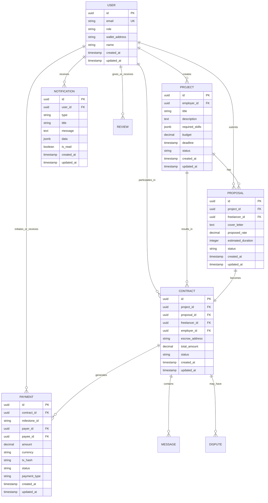

## Core Indexes and Query Patterns

The indexing strategy targets the most common query patterns in the FreelanceXchain application, with indexes created on foreign keys and frequently filtered columns. Each index supports specific business operations and API endpoints.

### User and Authentication Indexes
The `idx_users_email` index on the users table enables efficient user lookup during authentication and account management operations. This unique index supports the critical path of user login and session creation.

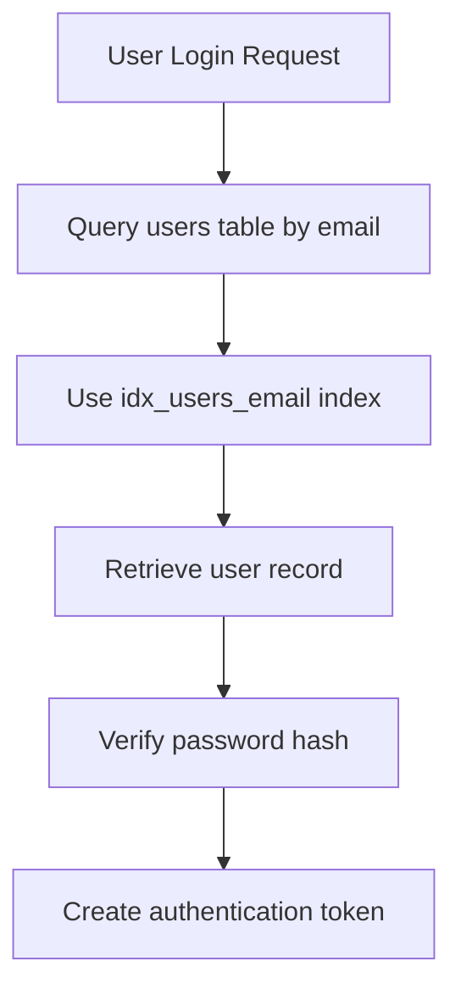

### Project and Proposal Indexes
The platform implements indexes on foreign keys for projects, proposals, and related entities to support the core marketplace functionality. The `idx_projects_employer_id` index enables efficient retrieval of all projects created by a specific employer, while `idx_proposals_project_id` supports fetching all proposals for a given project.

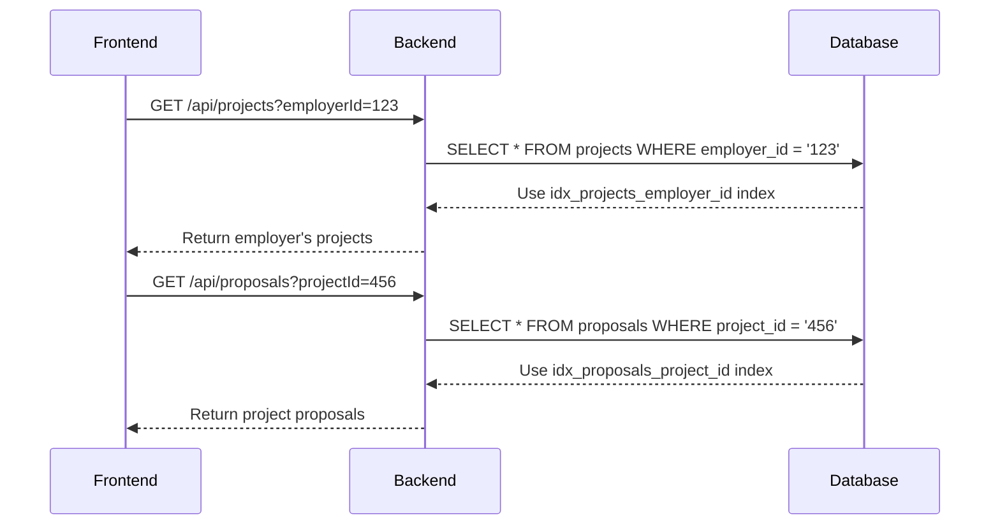

### Contract and Transaction Indexes
The indexing strategy includes comprehensive coverage of contract-related entities to support the platform's transactional workflows. Indexes on foreign keys for contracts, disputes, notifications, payments, and messages ensure efficient retrieval of related records for a given contract or user.

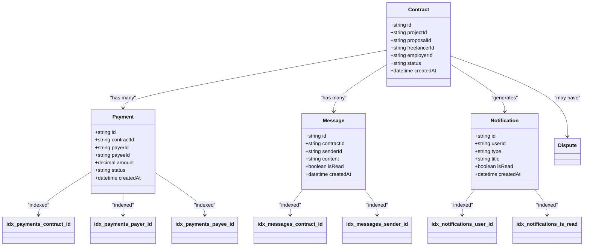

## Performance Benefits

The implemented indexing strategy provides significant performance improvements for common query patterns in the FreelanceXchain application. By creating indexes on foreign key columns and frequently filtered attributes, the database can efficiently locate records without performing full table scans.

For example, when retrieving all projects posted by a specific employer, the `idx_projects_employer_id` index allows PostgreSQL to quickly locate the relevant rows using an index scan rather than examining every row in the projects table. Similarly, when fetching all proposals for a specific project, the `idx_proposals_project_id` index enables efficient filtering.

The `idx_notifications_user_id` and `idx_notifications_is_read` indexes work together to optimize notification retrieval, particularly for queries that filter by both user and read status. This compound filtering pattern is common in the application's notification center, where users typically want to see their unread notifications.

The indexing strategy also supports efficient pagination through the use of ordered indexes. When retrieving paginated results sorted by creation date (as seen in the repository methods), PostgreSQL can use the index to quickly locate the starting point for each page, reducing the need for expensive sorting operations.

## Trade-offs and Considerations

While the indexing strategy provides substantial read performance benefits, it introduces several trade-offs that must be considered:

1. **Write Performance Overhead**: Each index adds overhead to INSERT, UPDATE, and DELETE operations, as the database must maintain the index structure in addition to the table data. This overhead increases with the number of indexes and the frequency of write operations.

2. **Storage Requirements**: Indexes consume additional disk space. In PostgreSQL, indexes are typically smaller than the tables they index, but they still represent a significant storage cost, especially for large tables with many indexes.

3. **Index Maintenance**: As data changes, indexes must be updated to reflect the current state. This maintenance occurs automatically but can impact overall database performance during periods of high write activity.

4. **Query Planner Complexity**: A large number of indexes can make it more difficult for the PostgreSQL query planner to select the optimal execution plan, potentially leading to suboptimal performance in some cases.

The current indexing strategy balances these trade-offs by focusing on the most critical query patterns while avoiding over-indexing. The indexes are concentrated on foreign key relationships and frequently filtered columns, which represent the most common access patterns in the application.

## Monitoring and Optimization

To ensure the continued effectiveness of the indexing strategy, the following PostgreSQL tools and techniques should be used for monitoring and optimization:

1. **EXPLAIN and EXPLAIN ANALYZE**: These commands provide insight into query execution plans, showing which indexes are being used and identifying potential performance bottlenecks.

2. **pg_stat_user_indexes**: This system view provides statistics on index usage, including the number of scans and tuple reads, helping to identify unused or underutilized indexes.

3. **pg_stat_statements**: This extension tracks execution statistics for all SQL statements executed by the server, enabling identification of slow queries that might benefit from additional indexing.

4. **Index Size Monitoring**: Regularly monitoring the size of indexes helps ensure they remain within acceptable limits and don't consume excessive storage.

Additional indexes might be needed based on evolving query patterns, such as:
- Composite indexes for common multi-column queries
- Partial indexes for queries that filter on specific subsets of data
- Indexes on frequently sorted columns when pagination is used

When considering new indexes, the following factors should be evaluated:
- Frequency and importance of the query pattern
- Selectivity of the indexed column(s)
- Impact on write performance
- Storage requirements

## Conclusion
The FreelanceXchain database indexing strategy effectively optimizes query performance for the platform's core functionality. By focusing on foreign key relationships and common access patterns, the indexes support efficient data retrieval for user-facing operations while maintaining reasonable write performance. The strategy balances read optimization with the inherent trade-offs of index maintenance overhead and storage requirements. Ongoing monitoring using PostgreSQL's built-in tools will ensure the indexing strategy continues to meet the platform's performance needs as usage patterns evolve.

---

# Database Schema Design

## Table of Contents
1. [Introduction](#introduction)
2. [Core Tables](#core-tables)
3. [Entity-Relationship Diagram](#entity-relationship-diagram)
4. [Indexing Strategy](#indexing-strategy)
5. [Row Level Security Policies](#row-level-security-policies)
6. [Data Seeding Process](#data-seeding-process)
7. [Database Performance Considerations](#database-performance-considerations)
8. [Conclusion](#conclusion)

## Introduction

The FreelanceXchain platform utilizes a Supabase PostgreSQL database to store all application data, providing a robust foundation for the blockchain-based freelance marketplace. The database schema is designed to support key features including user management, project lifecycle, contract execution, payment processing, and dispute resolution. This document provides comprehensive documentation of the database schema, detailing all tables, their relationships, indexing strategy, security policies, and performance considerations.

The schema implements a relational model with UUID primary keys for all tables, ensuring global uniqueness and preventing enumeration attacks. JSONB columns are strategically used for flexible data storage where schema flexibility is required, such as storing skills, experience, and milestone data. Row Level Security (RLS) is enabled on all tables to enforce data access controls based on user roles and ownership, providing a secure multi-tenant environment.

## Core Tables

### Users Table
The `users` table serves as the central identity management system for the platform, storing core user information and authentication data. Each user is assigned a role that determines their permissions and access to platform features.

**Table: users**
| Column | Type | Constraints | Description |
|-------|------|-------------|-------------|
| id | UUID | PRIMARY KEY, DEFAULT uuid_generate_v4() | Unique identifier for the user |
| email | VARCHAR(255) | UNIQUE, NOT NULL | User's email address used for authentication |
| password_hash | VARCHAR(255) | NOT NULL | Hashed password for secure authentication |
| role | VARCHAR(20) | NOT NULL, CHECK constraint | User role: freelancer, employer, or admin |
| wallet_address | VARCHAR(255) | DEFAULT '' | Blockchain wallet address for transactions |
| name | VARCHAR(255) | DEFAULT '' | User's display name |
| created_at | TIMESTAMPTZ | DEFAULT NOW() | Timestamp of record creation |
| updated_at | TIMESTAMPTZ | DEFAULT NOW() | Timestamp of last record update |

### Skill Categories and Skills Tables
The `skill_categories` and `skills` tables form a hierarchical taxonomy of professional skills, enabling AI-powered matching between freelancers and projects. This two-level hierarchy allows for organized skill classification while maintaining flexibility for future expansion.

**Table: skill_categories**
| Column | Type | Constraints | Description |
|-------|------|-------------|-------------|
| id | UUID | PRIMARY KEY, DEFAULT uuid_generate_v4() | Unique identifier for the category |
| name | VARCHAR(255) | NOT NULL | Name of the skill category |
| description | TEXT | | Detailed description of the category |
| is_active | BOOLEAN | DEFAULT true | Flag indicating if category is active |
| created_at | TIMESTAMPTZ | DEFAULT NOW() | Timestamp of record creation |
| updated_at | TIMESTAMPTZ | DEFAULT NOW() | Timestamp of last record update |

**Table: skills**
| Column | Type | Constraints | Description |
|-------|------|-------------|-------------|
| id | UUID | PRIMARY KEY, DEFAULT uuid_generate_v4() | Unique identifier for the skill |
| category_id | UUID | REFERENCES skill_categories(id) ON DELETE CASCADE | Foreign key to parent category |
| name | VARCHAR(255) | NOT NULL | Name of the skill |
| description | TEXT | | Detailed description of the skill |
| is_active | BOOLEAN | DEFAULT true | Flag indicating if skill is active |
| created_at | TIMESTAMPTZ | DEFAULT NOW() | Timestamp of record creation |
| updated_at | TIMESTAMPTZ | DEFAULT NOW() | Timestamp of last record update |

### Freelancer and Employer Profiles Tables
The `freelancer_profiles` and `employer_profiles` tables store detailed information about platform participants, extending the basic user data with role-specific attributes. These profiles are essential for the matching algorithm and user discovery features.

**Table: freelancer_profiles**
| Column | Type | Constraints | Description |
|-------|------|-------------|-------------|
| id | UUID | PRIMARY KEY, DEFAULT uuid_generate_v4() | Unique identifier for the profile |
| user_id | UUID | UNIQUE, REFERENCES users(id) ON DELETE CASCADE | Foreign key to associated user |
| bio | TEXT | | Freelancer's biography and introduction |
| hourly_rate | DECIMAL(10, 2) | DEFAULT 0 | Preferred hourly rate for work |
| skills | JSONB | DEFAULT '[]' | Array of skills with experience level |
| experience | JSONB | DEFAULT '[]' | Array of work experience entries |
| availability | VARCHAR(20) | DEFAULT 'available', CHECK constraint | Current availability status |
| created_at | TIMESTAMPTZ | DEFAULT NOW() | Timestamp of record creation |
| updated_at | TIMESTAMPTZ | DEFAULT NOW() | Timestamp of last record update |

**Table: employer_profiles**
| Column | Type | Constraints | Description |
|-------|------|-------------|-------------|
| id | UUID | PRIMARY KEY, DEFAULT uuid_generate_v4() | Unique identifier for the profile |
| user_id | UUID | UNIQUE, REFERENCES users(id) ON DELETE CASCADE | Foreign key to associated user |
| company_name | VARCHAR(255) | | Name of the employer's company |
| description | TEXT | | Company description and background |
| industry | VARCHAR(255) | | Industry sector of the company |
| created_at | TIMESTAMPTZ | DEFAULT NOW() | Timestamp of record creation |
| updated_at | TIMESTAMPTZ | DEFAULT NOW() | Timestamp of last record update |

### Projects, Proposals, and Contracts Tables
These interconnected tables manage the core workflow of the platform, from project creation through proposal submission to contract execution. They form the foundation of the freelance engagement lifecycle.

**Table: projects**
| Column | Type | Constraints | Description |
|-------|------|-------------|-------------|
| id | UUID | PRIMARY KEY, DEFAULT uuid_generate_v4() | Unique identifier for the project |
| employer_id | UUID | REFERENCES users(id) ON DELETE CASCADE | Foreign key to creating employer |
| title | VARCHAR(255) | NOT NULL | Project title |
| description | TEXT | | Detailed project description |
| required_skills | JSONB | DEFAULT '[]' | Array of required skills for the project |
| budget | DECIMAL(12, 2) | DEFAULT 0 | Project budget in ETH |
| deadline | TIMESTAMPTZ | | Project completion deadline |
| status | VARCHAR(20) | DEFAULT 'draft', CHECK constraint | Current project status |
| milestones | JSONB | DEFAULT '[]' | Array of project milestones |
| created_at | TIMESTAMPTZ | DEFAULT NOW() | Timestamp of record creation |
| updated_at | TIMESTAMPTZ | DEFAULT NOW() | Timestamp of last record update |

**Table: proposals**
| Column | Type | Constraints | Description |
|-------|------|-------------|-------------|
| id | UUID | PRIMARY KEY, DEFAULT uuid_generate_v4() | Unique identifier for the proposal |
| project_id | UUID | REFERENCES projects(id) ON DELETE CASCADE | Foreign key to target project |
| freelancer_id | UUID | REFERENCES users(id) ON DELETE CASCADE | Foreign key to submitting freelancer |
| cover_letter | TEXT | | Proposal cover letter |
| proposed_rate | DECIMAL(10, 2) | DEFAULT 0 | Rate proposed by freelancer |
| estimated_duration | INTEGER | DEFAULT 0 | Estimated completion time in days |
| status | VARCHAR(20) | DEFAULT 'pending', CHECK constraint | Current proposal status |
| created_at | TIMESTAMPTZ | DEFAULT NOW() | Timestamp of record creation |
| updated_at | TIMESTAMPTZ | DEFAULT NOW() | Timestamp of last record update |
| UNIQUE(project_id, freelancer_id) | | | Prevents duplicate proposals |

**Table: contracts**
| Column | Type | Constraints | Description |
|-------|------|-------------|-------------|
| id | UUID | PRIMARY KEY, DEFAULT uuid_generate_v4() | Unique identifier for the contract |
| project_id | UUID | REFERENCES projects(id) ON DELETE CASCADE | Foreign key to source project |
| proposal_id | UUID | REFERENCES proposals(id) ON DELETE CASCADE | Foreign key to accepted proposal |
| freelancer_id | UUID | REFERENCES users(id) ON DELETE CASCADE | Foreign key to contracted freelancer |
| employer_id | UUID | REFERENCES users(id) ON DELETE CASCADE | Foreign key to contracting employer |
| escrow_address | VARCHAR(255) | | Blockchain address for escrow funds |
| total_amount | DECIMAL(12, 2) | DEFAULT 0 | Total contract value in ETH |
| status | VARCHAR(20) | DEFAULT 'active', CHECK constraint | Current contract status |
| created_at | TIMESTAMPTZ | DEFAULT NOW() | Timestamp of record creation |
| updated_at | TIMESTAMPTZ | DEFAULT NOW() | Timestamp of last record update |

### Disputes, Payments, and Reviews Tables
These tables handle post-contract activities including dispute resolution, payment processing, and reputation management. They ensure transparency and accountability in all transactions.

**Table: disputes**
| Column | Type | Constraints | Description |
|-------|------|-------------|-------------|
| id | UUID | PRIMARY KEY, DEFAULT uuid_generate_v4() | Unique identifier for the dispute |
| contract_id | UUID | REFERENCES contracts(id) ON DELETE CASCADE | Foreign key to disputed contract |
| milestone_id | VARCHAR(255) | | Identifier of disputed milestone |
| initiator_id | UUID | REFERENCES users(id) ON DELETE CASCADE | Foreign key to user initiating dispute |
| reason | TEXT | | Detailed reason for the dispute |
| evidence | JSONB | DEFAULT '[]' | Array of evidence supporting the dispute |
| status | VARCHAR(20) | DEFAULT 'open', CHECK constraint | Current dispute status |
| resolution | JSONB | | Resolution details when resolved |
| created_at | TIMESTAMPTZ | DEFAULT NOW() | Timestamp of record creation |
| updated_at | TIMESTAMPTZ | DEFAULT NOW() | Timestamp of last record update |

**Table: payments**
| Column | Type | Constraints | Description |
|-------|------|-------------|-------------|
| id | UUID | PRIMARY KEY, DEFAULT uuid_generate_v4() | Unique identifier for the payment |
| contract_id | UUID | REFERENCES contracts(id) ON DELETE CASCADE | Foreign key to associated contract |
| milestone_id | VARCHAR(255) | | Identifier of milestone being paid |
| payer_id | UUID | REFERENCES users(id) ON DELETE CASCADE | Foreign key to user making payment |
| payee_id | UUID | REFERENCES users(id) ON DELETE CASCADE | Foreign key to user receiving payment |
| amount | DECIMAL(12, 2) | NOT NULL | Payment amount in ETH |
| currency | VARCHAR(10) | DEFAULT 'ETH' | Cryptocurrency used for payment |
| tx_hash | VARCHAR(255) | | Blockchain transaction hash |
| status | VARCHAR(20) | DEFAULT 'pending', CHECK constraint | Current payment status |
| payment_type | VARCHAR(20) | NOT NULL, CHECK constraint | Type of payment transaction |
| created_at | TIMESTAMPTZ | DEFAULT NOW() | Timestamp of record creation |
| updated_at | TIMESTAMPTZ | DEFAULT NOW() | Timestamp of last record update |

**Table: reviews**
| Column | Type | Constraints | Description |
|-------|------|-------------|-------------|
| id | UUID | PRIMARY KEY, DEFAULT uuid_generate_v4() | Unique identifier for the review |
| contract_id | UUID | REFERENCES contracts(id) ON DELETE CASCADE | Foreign key to reviewed contract |
| reviewer_id | UUID | REFERENCES users(id) ON DELETE CASCADE | Foreign key to user writing review |
| reviewee_id | UUID | REFERENCES users(id) ON DELETE CASCADE | Foreign key to user being reviewed |
| rating | INTEGER | NOT NULL, CHECK constraint (1-5) | Numerical rating (1-5 stars) |
| comment | TEXT | | Written feedback |
| reviewer_role | VARCHAR(20) | NOT NULL, CHECK constraint | Role of reviewer (freelancer/employer) |
| created_at | TIMESTAMPTZ | DEFAULT NOW() | Timestamp of record creation |
| updated_at | TIMESTAMPTZ | DEFAULT NOW() | Timestamp of last record update |
| UNIQUE(contract_id, reviewer_id) | | | Prevents duplicate reviews |

### Notifications and Messages Tables
These tables support communication and engagement features, ensuring users are informed of important events and can communicate with each other.

**Table: notifications**
| Column | Type | Constraints | Description |
|-------|------|-------------|-------------|
| id | UUID | PRIMARY KEY, DEFAULT uuid_generate_v4() | Unique identifier for the notification |
| user_id | UUID | REFERENCES users(id) ON DELETE CASCADE | Foreign key to recipient user |
| type | VARCHAR(50) | NOT NULL | Type of notification |
| title | VARCHAR(255) | NOT NULL | Notification title |
| message | TEXT | | Detailed notification message |
| data | JSONB | DEFAULT '{}' | Additional data payload |
| is_read | BOOLEAN | DEFAULT false | Read status indicator |
| created_at | TIMESTAMPTZ | DEFAULT NOW() | Timestamp of record creation |
| updated_at | TIMESTAMPTZ | DEFAULT NOW() | Timestamp of last record update |

**Table: messages**
| Column | Type | Constraints | Description |
|-------|------|-------------|-------------|
| id | UUID | PRIMARY KEY, DEFAULT uuid_generate_v4() | Unique identifier for the message |
| contract_id | UUID | REFERENCES contracts(id) ON DELETE CASCADE | Foreign key to related contract |
| sender_id | UUID | REFERENCES users(id) ON DELETE CASCADE | Foreign key to message sender |
| content | TEXT | NOT NULL | Message content |
| is_read | BOOLEAN | DEFAULT false | Read status indicator |
| created_at | TIMESTAMPTZ | DEFAULT NOW() | Timestamp of record creation |
| updated_at | TIMESTAMPTZ | DEFAULT NOW() | Timestamp of last record update |

### KYC Verifications Table
The `kyc_verifications` table manages the Know Your Customer (KYC) process, ensuring compliance with financial regulations and enhancing platform security.

**Table: kyc_verifications**
| Column | Type | Constraints | Description |
|-------|------|-------------|-------------|
| id | UUID | PRIMARY KEY, DEFAULT uuid_generate_v4() | Unique identifier for the verification |
| user_id | UUID | REFERENCES users(id) ON DELETE CASCADE | Foreign key to verified user |
| status | VARCHAR(20) | DEFAULT 'pending', CHECK constraint | Current verification status |
| tier | INTEGER | DEFAULT 1 | Verification tier level |
| first_name | VARCHAR(255) | | User's first name |
| middle_name | VARCHAR(255) | | User's middle name |
| last_name | VARCHAR(255) | | User's last name |
| date_of_birth | DATE | | User's date of birth |
| place_of_birth | VARCHAR(255) | | User's place of birth |
| nationality | VARCHAR(100) | | User's nationality |
| secondary_nationality | VARCHAR(100) | | User's secondary nationality |
| tax_residence_country | VARCHAR(100) | | User's tax residence country |
| tax_identification_number | VARCHAR(100) | | User's tax ID number |
| address | JSONB | DEFAULT '{}' | User's residential address |
| documents | JSONB | DEFAULT '[]' | Array of submitted document references |
| liveness_check | JSONB | | Liveness verification data |
| submitted_at | TIMESTAMPTZ | | Timestamp of submission |
| reviewed_at | TIMESTAMPTZ | | Timestamp of review completion |
| reviewed_by | UUID | REFERENCES users(id) | Foreign key to reviewing admin |
| rejection_reason | TEXT | | Reason for rejection if applicable |
| created_at | TIMESTAMPTZ | DEFAULT NOW() | Timestamp of record creation |
| updated_at | TIMESTAMPTZ | DEFAULT NOW() | Timestamp of last record update |

## Entity-Relationship Diagram

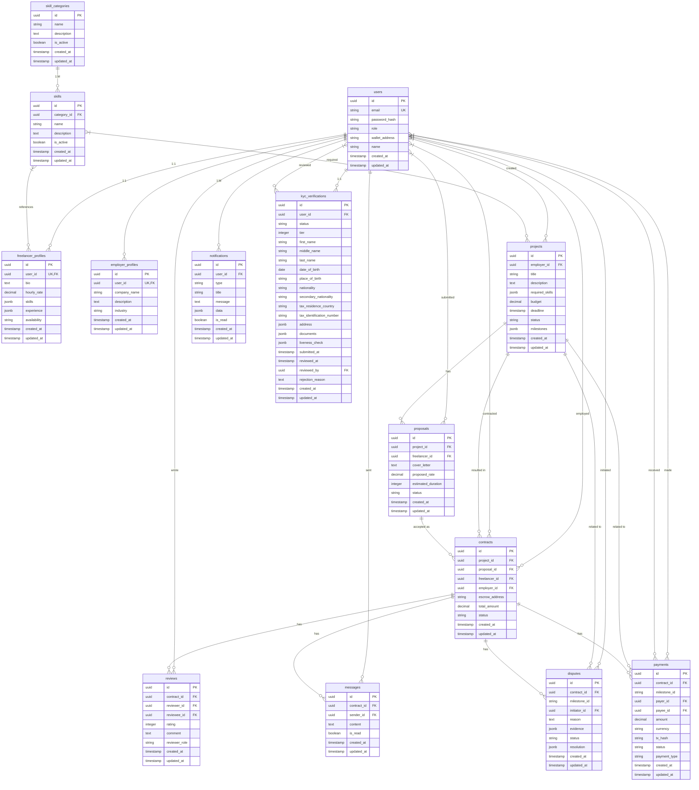

## Indexing Strategy

The database implements a comprehensive indexing strategy to optimize query performance for frequently accessed data patterns. Indexes are created on foreign key columns, status fields, and other commonly queried attributes to ensure efficient data retrieval.

```mermaid
graph TD
A[Indexing Strategy] --> B[Foreign Key Indexes]
A --> C[Status Indexes]
A --> D[User-Specific Indexes]
A --> E[Composite Indexes]
B --> B1[idx_freelancer_profiles_user_id]
B --> B2[idx_employer_profiles_user_id]
B --> B3[idx_projects_employer_id]
B --> B4[idx_proposals_project_id]
B --> B5[idx_proposals_freelancer_id]
B --> B6[idx_contracts_freelancer_id]
B --> B7[idx_contracts_employer_id]
B --> B8[idx_disputes_contract_id]
B --> B9[idx_notifications_user_id]
B --> B10[idx_kyc_user_id]
B --> B11[idx_skills_category_id]
B --> B12[idx_reviews_contract_id]
B --> B13[idx_reviews_reviewee_id]
B --> B14[idx_messages_contract_id]
B --> B15[idx_messages_sender_id]
B --> B16[idx_payments_contract_id]
B --> B17[idx_payments_payer_id]
B --> B18[idx_payments_payee_id]
C --> C1[idx_projects_status]
C --> C2[idx_notifications_is_read]
D --> D1[idx_users_email]
E --> E1[UNIQUE(project_id, freelancer_id)]
E --> E2[UNIQUE(contract_id, reviewer_id)]
```

The indexing strategy focuses on several key areas:

1. **Foreign Key Indexes**: All foreign key columns are indexed to optimize JOIN operations and ensure referential integrity checks are performed efficiently.

2. **Status Indexes**: Status columns are indexed to enable fast filtering of records by their current state (e.g., open projects, pending proposals).

3. **User-Specific Indexes**: User-related columns are indexed to support personalized queries, such as retrieving all notifications for a specific user.

4. **Composite Indexes**: Unique constraints are implemented as composite indexes to prevent duplicate entries in critical relationships.

The most critical indexes for query optimization include:
- `idx_users_email` for user authentication and lookup
- `idx_projects_status` for filtering projects by status (especially 'open' projects)
- `idx_skills_category_id` for retrieving all skills within a specific category
- `idx_proposals_project_id` for finding all proposals for a given project

## Row Level Security Policies

Row Level Security (RLS) is enabled on all tables to enforce data access controls based on user roles and ownership. This ensures that users can only access data they are authorized to view or modify, providing a secure multi-tenant environment.

```mermaid
graph TD
A[RLS Policies] --> B[Public Read Policies]
A --> C[Service Role Policies]
A --> D[Future Custom Policies]
B --> B1["Allow public read on skill_categories"]
B --> B2["Allow public read on skills"]
B --> B3["Allow public read on open projects"]
C --> C1["Service role full access users"]
C --> C2["Service role full access freelancer_profiles"]
C --> C3["Service role full access employer_profiles"]
C --> C4["Service role full access projects"]
C --> C5["Service role full access proposals"]
C --> C6["Service role full access contracts"]
C --> C7["Service role full access disputes"]
C --> C8["Service role full access notifications"]
C --> C9["Service role full access kyc_verifications"]
C --> C10["Service role full access skills"]
C --> C11["Service role full access skill_categories"]
C --> C12["Service role full access reviews"]
C --> C13["Service role full access messages"]
C --> C14["Service role full access payments"]
D --> D1[Custom policies for user-owned data]
D --> D2[Role-based access controls]
```

The current RLS policy implementation includes:

1. **Public Read Policies**: Certain data is made publicly accessible to support platform functionality:
   - Skill categories and skills can be read by anyone to enable skill selection and display
   - Open projects can be viewed by all users to facilitate discovery

2. **Service Role Policies**: A service role with full access to all tables is established for backend operations:
   - The application backend can perform all CRUD operations on all tables
   - This enables the API to manage data on behalf of users while maintaining security

3. **Future Custom Policies**: The current implementation provides a foundation for more granular policies:
   - User-owned data (profiles, notifications) will be accessible only to the owner
   - Contract-related data will be accessible only to the involved parties
   - Administrative functions will be restricted to users with appropriate roles

The RLS policies are implemented using PostgreSQL's native Row Level Security feature, which evaluates policies for every row accessed by a query. This ensures that unauthorized data access is prevented at the database level, providing a robust security boundary.

## Data Seeding Process

The initial skill categories and skills are seeded into the database using the `seed-skills.sql` script. This process establishes the foundational taxonomy used for AI-powered matching and user profile management.

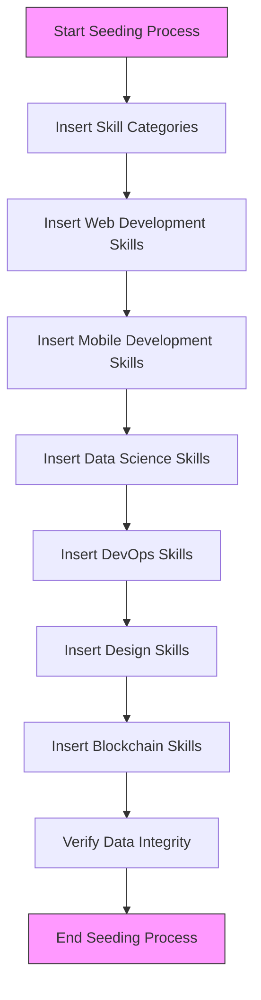

The seeding process follows these steps:

1. **Insert Skill Categories**: Six core skill categories are inserted with predefined UUIDs:
   - Web Development
   - Mobile Development
   - Data Science
   - DevOps
   - Design
   - Blockchain

2. **Insert Skills by Category**: Skills are inserted for each category, establishing the relationship through the `category_id` foreign key:
   - Web Development: TypeScript, JavaScript, React, Node.js, Vue.js, Angular, Next.js, Express.js, HTML/CSS, Tailwind CSS
   - Mobile Development: React Native, Flutter, Swift, Kotlin
   - Data Science: Python, Machine Learning, TensorFlow, SQL
   - DevOps: Docker, Kubernetes, AWS, CI/CD
   - Design: Figma, UI/UX Design, Adobe XD
   - Blockchain: Solidity, Ethereum, Web3.js, Hardhat

3. **Handle Conflicts**: The `ON CONFLICT (id) DO NOTHING` clause ensures that the seeding process is idempotent, preventing errors if the script is run multiple times.

4. **Verify Data Integrity**: A verification query confirms that all categories and their associated skills have been correctly inserted.

The predefined UUIDs ensure consistency across different environments (development, staging, production) and prevent issues with foreign key references in application code that may reference specific skill IDs.

## Database Performance Considerations

The database schema and configuration are optimized for performance in a high-traffic freelance marketplace environment. Several strategies are employed to ensure responsive queries and efficient data processing.

### Connection Pooling
The application utilizes Supabase's built-in connection pooling to manage database connections efficiently. This reduces the overhead of establishing new connections for each request and prevents connection exhaustion under high load.

### Query Optimization
The indexing strategy (documented in the Indexing Strategy section) is designed to optimize the most common query patterns, particularly:
- User authentication and profile retrieval
- Project discovery and filtering
- Contract and payment history lookup
- Notification retrieval

### Data Modeling Choices
Several data modeling decisions contribute to performance:
- **UUID Primary Keys**: While slightly larger than integer keys, UUIDs provide global uniqueness and prevent enumeration attacks.
- **JSONB Columns**: Used for flexible data storage where schema evolution is expected, such as skills, experience, and milestone data. These columns are indexed when necessary for querying.
- **Appropriate Data Types**: Numeric values use DECIMAL types for precise financial calculations, while timestamps use TIMESTAMPTZ for timezone-aware storage.

### Future Optimization Opportunities
Potential performance improvements include:
- **Partial Indexes**: Creating indexes on subsets of data (e.g., only active skills) to reduce index size
- **Materialized Views**: For complex queries that aggregate data across multiple tables
- **Partitioning**: For tables that are expected to grow very large, such as notifications and payments

### Monitoring and Maintenance
Regular database maintenance should include:
- Monitoring query performance using Supabase's analytics tools
- Reviewing and optimizing slow queries
- Updating table statistics to ensure optimal query planning
- Managing index bloat and vacuuming tables as needed

## Conclusion

The FreelanceXchain database schema provides a robust foundation for a blockchain-based freelance marketplace with AI-powered skill matching. The relational model effectively captures the complex relationships between users, projects, contracts, and payments, while incorporating modern database features like JSONB storage and Row Level Security.

Key strengths of the schema design include:
- Comprehensive data model covering all aspects of the freelance lifecycle
- Strategic use of UUIDs for global uniqueness and security
- Flexible JSONB columns for evolving data requirements
- Robust security through Row Level Security policies
- Optimized indexing for common query patterns

The schema is well-positioned to support the platform's growth and evolving requirements, with clear pathways for future enhancements such as more granular RLS policies, advanced indexing strategies, and performance optimizations. By combining relational integrity with flexible NoSQL-like features, the database strikes an effective balance between structure and adaptability.

---

# Row Level Security

## Table of Contents
1. [Introduction](#introduction)
2. [Project Structure](#project-structure)
3. [Core Components](#core-components)
4. [Architecture Overview](#architecture-overview)
5. [Detailed Component Analysis](#detailed-component-analysis)
6. [Dependency Analysis](#dependency-analysis)
7. [Performance Considerations](#performance-considerations)
8. [Troubleshooting Guide](#troubleshooting-guide)
9. [Conclusion](#conclusion)

## Introduction
This document explains the Row Level Security (RLS) implementation in the FreelanceXchain database. It describes how RLS policies are enabled on all tables via ALTER TABLE statements, outlines the public read policies for skill categories, skills, and open projects, and details the service role bypass policies that allow the backend application to perform administrative operations. It also explains how the Supabase authentication layer integrates with the application’s role-based access control to enforce data access restrictions based on user roles and ownership.

## Project Structure
RLS is defined in the database schema and enforced by Supabase. The application’s authentication and authorization middleware validate tokens and roles, while repositories and services interact with Supabase using the Supabase client. The architecture diagram in the documentation shows how authentication and RLS fit into the overall security layers.

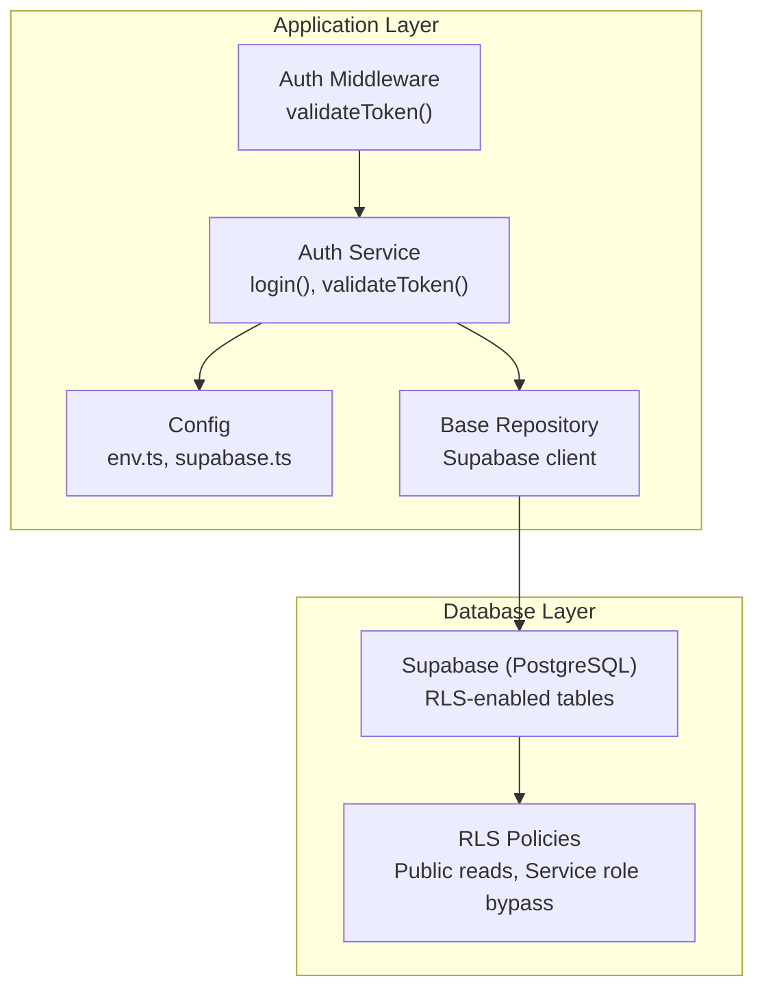

## Core Components
- RLS enablement: All tables have RLS enabled via ALTER TABLE commands in the schema.
- Public read policies: skill_categories and skills allow SELECT for all users; projects allow SELECT only when status equals open.
- Service role bypass: A policy allows full access to all tables for the Supabase service role, enabling backend operations.

These policies are defined in the database schema and enforced by Supabase.

## Architecture Overview
The system enforces layered security:
- Transport security (HTTPS/TLS)
- Authentication (JWT bearer tokens)
- Authorization (role-based access control)
- Database security (Supabase RLS)
- Smart contract security (blockchain layer)

RLS sits alongside the Supabase auth layer to restrict row-level access based on policies.

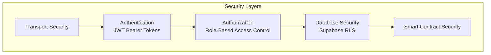

## Detailed Component Analysis

### RLS Policy Definitions
- Enable RLS on all tables: The schema enables RLS on users, profiles, projects, proposals, contracts, disputes, notifications, KYC verifications, skills, skill categories, reviews, messages, and payments.
- Public read policies:
  - skill_categories: SELECT is permitted for everyone.
  - skills: SELECT is permitted for everyone.
  - projects: SELECT is permitted when status equals open.
- Service role bypass: ALL operations are permitted for the service role on all tables.

These policies ensure:
- Public discovery of categories and skills.
- Controlled exposure of open projects.
- Backend operations requiring elevated privileges.

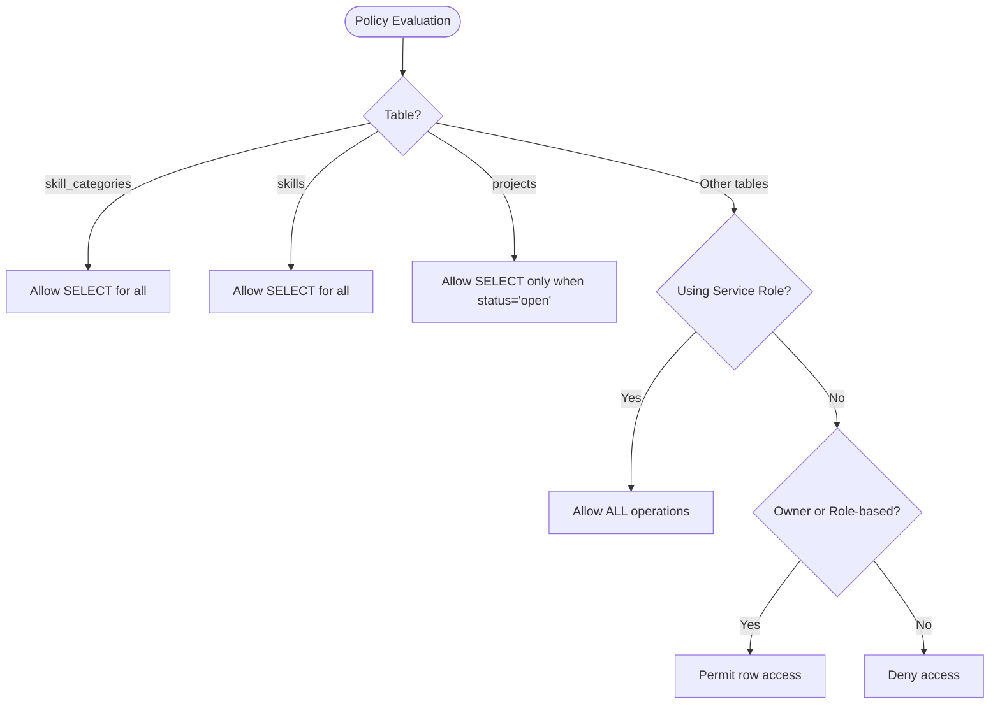

### Integration with Authentication and Authorization
- Application authentication validates JWT tokens and attaches user identity (userId, role) to requests.
- The auth middleware ensures requests carry a valid Bearer token and forwards validated user info downstream.
- The auth service retrieves user metadata from Supabase and constructs application-level user objects.

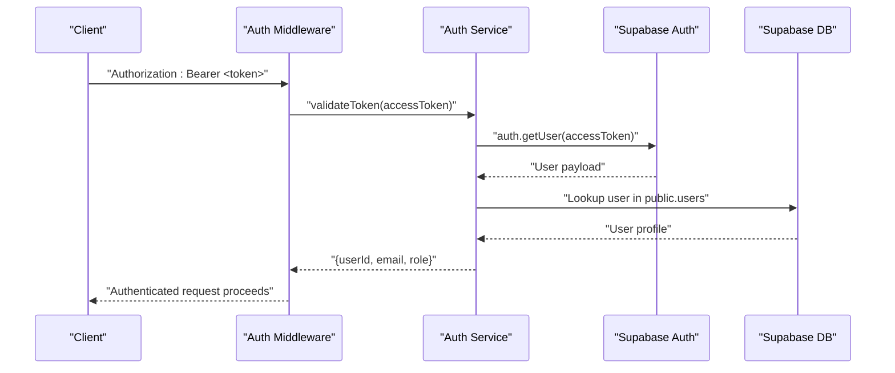

### Supabase Client and Service Role Key
- The Supabase client is initialized with the Supabase URL and anonymous key.
- The service role key is configured in environment variables and is intended for server-side use only.
- Repositories use the Supabase client to perform database operations.

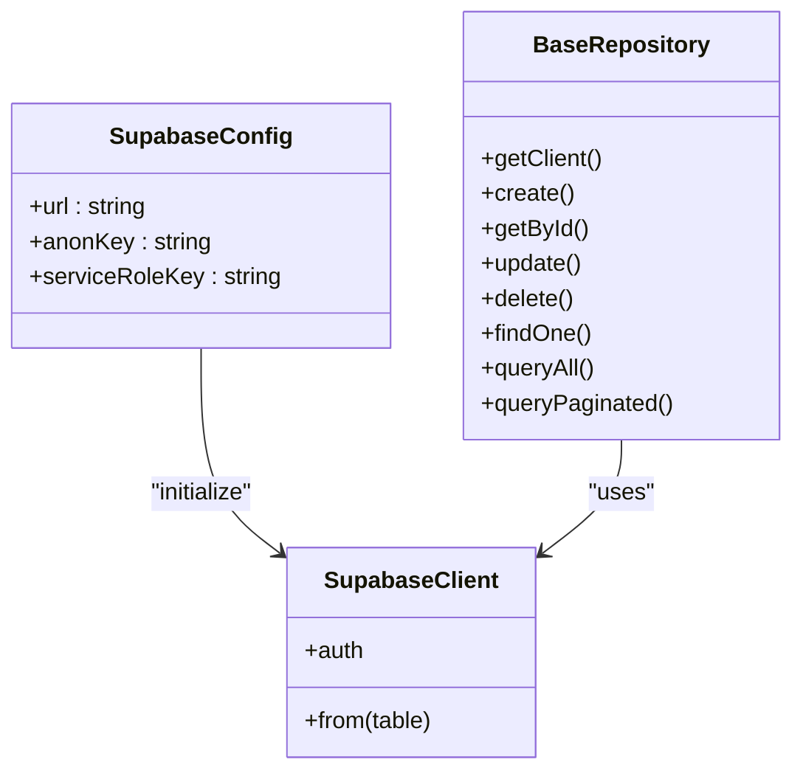

### Public Data Exposure and Seed Data
- Public read policies allow clients to discover categories and skills without authentication.
- Seed data populates categories and skills for demonstration and matching workflows.

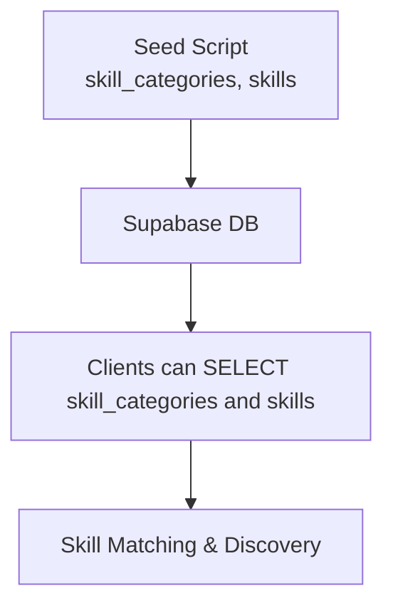

## Dependency Analysis
- RLS depends on Supabase’s policy engine and the Supabase client.
- Application middleware depends on the auth service to validate tokens and roles.
- Repositories depend on the Supabase client to perform CRUD operations; RLS policies apply to these operations server-side.

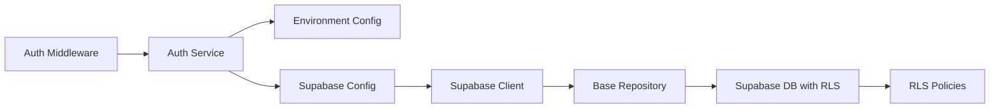

## Performance Considerations
- RLS evaluation occurs server-side during query execution; keep policies simple to minimize overhead.
- Indexes on frequently filtered columns (e.g., projects.status) improve query performance under RLS.
- Use pagination and selective column selection to reduce payload sizes.

[No sources needed since this section provides general guidance]

## Troubleshooting Guide
Common issues and resolutions:
- Unauthorized access to protected tables:
  - Ensure the request is made with a valid JWT issued by Supabase and that the user role aligns with the operation.
  - Confirm that RLS policies are enabled on the target table and that the service role bypass is not misapplied.
- Public read not working for categories/skills:
  - Verify the public read policies exist and that the client is not using an authenticated session that would trigger row-level filtering.
- Open projects visibility:
  - Confirm that the projects table uses the “open” status policy and that only records with status equal to open are returned.
- Service role bypass:
  - Ensure the service role key is configured server-side and used only for trusted backend operations.

## Conclusion
The FreelanceXchain database employs Supabase RLS to enforce fine-grained access control across all tables. Public read policies enable discovery of categories and skills and controlled exposure of open projects. A service role bypass policy permits backend operations while maintaining strict access controls for authenticated users. Together with the application’s JWT-based authentication and role-based authorization, RLS forms a robust, layered security model that protects sensitive data and prevents unauthorized access.

---

# Data Seeding

## Table of Contents
1. [Introduction](#introduction)
2. [Project Structure](#project-structure)
3. [Core Components](#core-components)
4. [Architecture Overview](#architecture-overview)
5. [Detailed Component Analysis](#detailed-component-analysis)
6. [Dependency Analysis](#dependency-analysis)
7. [Performance Considerations](#performance-considerations)
8. [Troubleshooting Guide](#troubleshooting-guide)
9. [Conclusion](#conclusion)

## Introduction
This document explains the data seeding process for initial database content in FreelanceXchain, focusing on the seed-skills.sql script that populates skill categories and skills for domains such as Web Development, Mobile Development, Data Science, DevOps, Design, and Blockchain. It details the use of UUIDs for stable identifiers, the ON CONFLICT DO NOTHING clause to prevent duplicates during repeated seeding, and the hierarchical relationship between categories and skills. It also describes how this seeded taxonomy supports the AI-powered matching system by providing a standardized vocabulary for freelancer skills and project requirements, and outlines when and how the seeding integrates with the database initialization workflow in development and production environments.

## Project Structure
The seeding and taxonomy-related components are organized as follows:
- Database schema and seed scripts live under supabase/.
- Application services and repositories that consume the taxonomy live under src/.

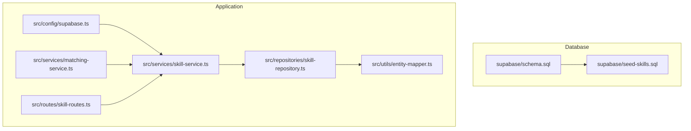

## Core Components
- Seed script: Defines stable UUID identifiers for categories and skills, inserts predefined values, and uses ON CONFLICT DO NOTHING to avoid duplicates on repeated runs.
- Schema: Declares skill_categories and skills tables with UUID primary keys and foreign key relationships.
- Application services and repositories: Provide CRUD and taxonomy operations, including retrieving active skills and building hierarchical taxonomy for API clients.
- Matching service: Consumes the taxonomy to power AI skill matching, skill extraction, and skill gap analysis.

## Architecture Overview
The seeding process integrates with the database initialization workflow as follows:
- Developers run the schema.sql in the Supabase SQL Editor to create tables and enable extensions.
- After schema creation, developers run seed-skills.sql to populate categories and skills with stable UUIDs.
- The application’s Supabase client and repositories read the taxonomy to support skill management and AI matching.

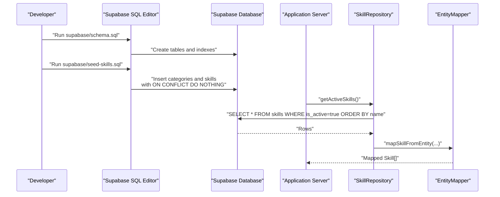

## Detailed Component Analysis

### Seed Script: seed-skills.sql
- Purpose: Populate skill_categories and skills with predefined values for six domains.
- Stable identifiers: Uses explicit UUIDs for categories and skills to ensure consistent IDs across environments.
- Duplicate prevention: Uses ON CONFLICT (id) DO NOTHING to safely re-run the script without errors.
- Hierarchical structure: Each skill row references a category via category_id, establishing a parent-child relationship.
- Verification: Includes a SELECT that groups skills by category to confirm counts.

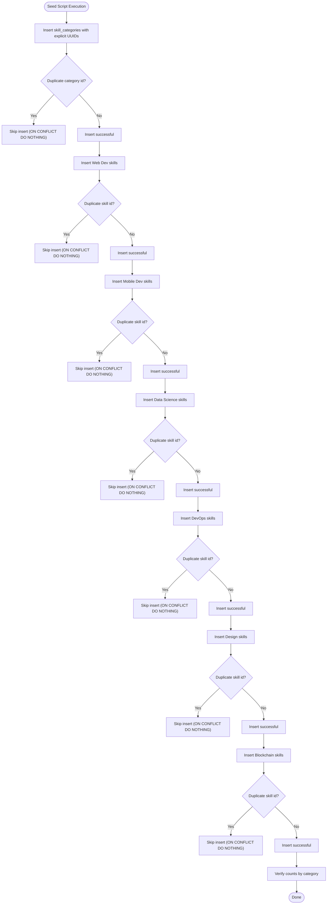

### Schema: supabase/schema.sql
- Enables UUID extension for generating stable identifiers.
- Declares skill_categories and skills tables with UUID primary keys.
- Defines foreign key relationship from skills.category_id to skill_categories.id with cascade delete.
- Adds indexes and Row Level Security policies, including public read access for skills and categories.

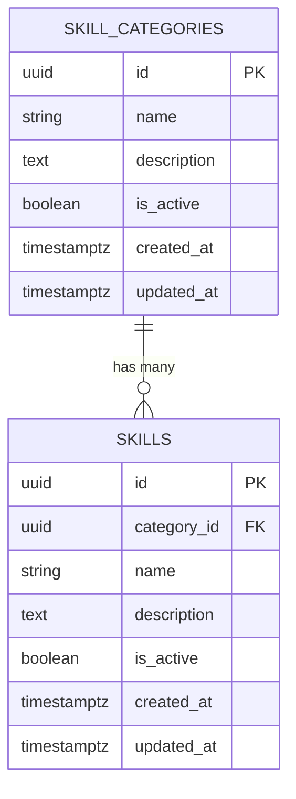

### Application Services and Repositories
- SkillRepository: Provides methods to retrieve skills by category, active skills, and search by keyword. It orders results by name and filters by is_active where applicable.
- SkillService: Exposes higher-level operations such as getFullTaxonomy(), which aggregates active categories with their active skills. It also validates skill IDs and exposes search with category names.
- EntityMapper: Converts database entities (snake_case) to API models (camelCase), including Skill and SkillCategory types.

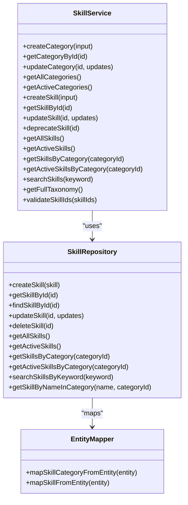

### AI-Powered Matching Integration
- Skill taxonomy consumption: The matching service retrieves active skills to build a reference set for skill extraction and matching.
- Skill extraction and mapping: The matching service extracts skills from text and maps them to taxonomy IDs, using the active skill list as the controlled vocabulary.
- Recommendations: The matching service computes match scores using either AI or keyword-based methods, relying on the standardized taxonomy to compare freelancer and project skill sets.

```mermaid
sequenceDiagram
participant Client as "Client"
participant Route as "Skill Routes"
participant Service as "SkillService"
participant Repo as "SkillRepository"
participant Map as "EntityMapper"
participant Match as "MatchingService"
Client->>Route : "GET /api/skills"
Route->>Service : "getFullTaxonomy()"
Service->>Repo : "getActiveCategories()"
Repo->>Map : "mapSkillCategoryFromEntity(...)"
Service->>Repo : "getActiveSkills()"
Repo->>Map : "mapSkillFromEntity(...)"
Map-->>Service : "Mapped lists"
Service-->>Route : "SkillTaxonomy"
Route-->>Client : "200 OK"
Client->>Match : "POST /api/matching/extract-skills"
Match->>Service : "getActiveSkills()"
Service->>Repo : "getActiveSkills()"
Repo-->>Service : "Skill[]"
Service-->>Match : "Skill[]"
Match-->>Client : "ExtractedSkill[]"
```

## Dependency Analysis
- Database dependencies:
  - schema.sql defines tables and indexes; seed-skills.sql depends on these definitions.
  - ON CONFLICT DO NOTHING relies on unique constraints enforced by primary keys.
- Application dependencies:
  - SkillRepository depends on Supabase client configuration and table names.
  - SkillService depends on SkillRepository and EntityMapper.
  - MatchingService depends on SkillService to access taxonomy data.

```mermaid
graph LR
SEED["seed-skills.sql"] --> SCHEMA["schema.sql"]
SCHEMA --> DB["Supabase Database"]
CFG["supabase.ts"] --> APP["Application"]
APP --> SRV["skill-service.ts"]
SRV --> REP["skill-repository.ts"]
REP --> MAP["entity-mapper.ts"]
APP --> MATCH["matching-service.ts"]
MATCH --> SRV
```

## Performance Considerations
- Indexes: The schema creates an index on skills(category_id), which supports efficient filtering by category and improves performance for taxonomy queries.
- Active-only queries: Using is_active filters reduces result sizes and improves matching performance.
- UUID stability: Stable UUIDs avoid costly re-mapping when data is re-seeded, minimizing churn in downstream systems.

## Troubleshooting Guide
- Duplicate entries on re-seeding:
  - Symptom: Errors when re-running seed-skills.sql.
  - Resolution: The script uses ON CONFLICT DO NOTHING to skip duplicates. Ensure the script is executed after schema creation and that ids match the seeded values.
- Missing taxonomy data:
  - Symptom: Matching service returns empty skill lists or extraction fails.
  - Resolution: Confirm that seed-skills.sql was executed after schema.sql and that the database is reachable via the configured Supabase client.
- Connection issues:
  - Symptom: Application cannot connect to Supabase.
  - Resolution: Verify SUPABASE_URL and SUPABASE_ANON_KEY environment variables and ensure the Supabase project is healthy.

## Conclusion
The seed-skills.sql script establishes a stable, repeatable taxonomy for skills and categories, enabling consistent identification and matching across environments. Its use of UUIDs and ON CONFLICT DO NOTHING ensures safe re-execution without duplication. The schema enforces referential integrity and performance through indexes. Application services and repositories consume this taxonomy to power skill management and AI-driven matching, while the matching service leverages the standardized vocabulary for skill extraction and gap analysis. Integrating seeding into the database initialization workflow guarantees that the taxonomy is present for both development and production deployments.

---

# Contracts Table

## Table of Contents
1. [Introduction](#introduction)
2. [Project Structure](#project-structure)
3. [Core Components](#core-components)
4. [Architecture Overview](#architecture-overview)
5. [Detailed Component Analysis](#detailed-component-analysis)
6. [Dependency Analysis](#dependency-analysis)
7. [Performance Considerations](#performance-considerations)
8. [Troubleshooting Guide](#troubleshooting-guide)
9. [Conclusion](#conclusion)

## Introduction
This document provides comprehensive data model documentation for the contracts table in the FreelanceXchain Supabase PostgreSQL database. The contracts table formalizes the agreement between freelancers and employers, linking off-chain project and proposal data to on-chain escrow smart contracts. It centralizes payment and milestone release workflows, enforces status transitions, and ensures only authorized parties can access sensitive data.

## Project Structure
The contracts table definition and related components are distributed across:
- Database schema: table creation, indexes, and RLS policies
- Application configuration: table name constants
- Data access layer: repository and service for CRUD and business logic
- Domain mapping: entity-to-model mapping utilities
- Payment workflow: orchestration of milestone approvals, disputes, and contract completion
- On-chain bridge: escrow contract enabling secure fund holding and release

```mermaid
graph TB
subgraph "Database"
SCHEMA["schema.sql<br/>Defines contracts table,<br/>indexes, and RLS"]
end
subgraph "Application"
CFG["supabase.ts<br/>TABLES.CONTRACTS constant"]
REPO["contract-repository.ts<br/>CRUD and queries"]
SVC["contract-service.ts<br/>Status transitions and updates"]
MAPPER["entity-mapper.ts<br/>Contract model mapping"]
PAY["payment-service.ts<br/>Escrow and milestone workflows"]
end
subgraph "Blockchain"
ESCROW["FreelanceEscrow.sol<br/>Escrow contract"]
end
SCHEMA --> REPO
CFG --> REPO
REPO --> SVC
SVC --> MAPPER
SVC --> PAY
PAY --> ESCROW
```

## Core Components
- contracts table: stores the formal agreement with foreign keys to users, projects, and proposals; maintains escrow address and status; includes audit timestamps.
- Repository: provides typed CRUD and query methods for contracts.
- Service: validates status transitions and updates contract records.
- Mapper: converts between database entities and API models.
- Payment workflow: integrates with the on-chain escrow to manage milestone submissions, approvals, disputes, and contract completion.
- Escrow contract: holds funds and releases them according to milestone approvals and dispute resolution.

## Architecture Overview
The contracts table bridges off-chain data with on-chain escrow:
- Off-chain: projects define milestones; proposals link to projects; contracts formalize the agreement and store the escrow address.
- On-chain: FreelanceEscrow holds funds and releases them upon milestone approval; disputes route through the arbiter.

```mermaid
sequenceDiagram
participant Client as "Client"
participant API as "Contract Routes"
participant Service as "Contract Service"
participant Repo as "Contract Repository"
participant DB as "Supabase Contracts"
participant Pay as "Payment Service"
participant Escrow as "Escrow Contract"
Client->>API : "GET /contracts/ : id"
API->>Service : "getContractById(id)"
Service->>Repo : "getContractById(id)"
Repo->>DB : "SELECT * FROM contracts WHERE id = ?"
DB-->>Repo : "Contract entity"
Repo-->>Service : "Contract entity"
Service-->>API : "Contract model"
API-->>Client : "Contract details"
Client->>Pay : "approveMilestone(contractId, milestoneId, employerId)"
Pay->>Repo : "getContractById(contractId)"
Repo->>DB : "SELECT * FROM contracts WHERE id = ?"
DB-->>Repo : "Contract entity"
Repo-->>Pay : "Contract entity"
Pay->>Escrow : "releaseMilestone(milestoneId)"
Escrow-->>Pay : "Transaction hash"
Pay->>Repo : "updateProject and updateContract"
Repo->>DB : "UPDATE projects and contracts"
DB-->>Repo : "OK"
Repo-->>Pay : "OK"
Pay-->>Client : "Approval result"
```

## Detailed Component Analysis

### Contracts Table Definition and Purpose
- Purpose: Formal agreement between parties, linking off-chain project/proposal data to on-chain escrow.
- Central role: Orchestrates payment and milestone release workflow; tracks contract lifecycle via status.

Columns:
- id: UUID primary key, auto-generated.
- project_id: UUID foreign key to projects; links to the project containing milestones.
- proposal_id: UUID foreign key to proposals; links to the accepted proposal forming the contract.
- freelancer_id: UUID foreign key to users; identifies the freelancer.
- employer_id: UUID foreign key to users; identifies the employer.
- escrow_address: String; on-chain escrow contract address for fund holding and release.
- total_amount: Decimal; total budget allocated to the contract.
- status: String with CHECK constraint limiting values to active, completed, disputed, cancelled.
- created_at, updated_at: Audit timestamps.

Indexes:
- Indexes on freelancer_id and employer_id improve query performance for retrieving contracts by party.

RLS Policies:
- RLS enabled on contracts; service role policies grant full access; application-level authorization ensures only parties can access sensitive data.

### Data Model Mapping
- Contract entity shape: snake_case fields aligned to database schema.
- Contract model: camelCase fields for API consumption.
- Mapping preserves all contract attributes, including status and audit timestamps.

### Repository Layer
- Typed contract entity interface.
- Methods:
  - Create, read by id, update.
  - Query by proposal id, freelancer id, employer id, project id, and status.
  - Paginated retrieval with ordering and counts.
- Uses TABLES.CONTRACTS constant for table name.

### Service Layer: Status Transitions and Updates
- Validates status transitions:
  - From active: allowed to completed, disputed, cancelled.
  - From disputed: allowed to active, completed, cancelled.
  - Completed and cancelled are terminal states.
- Updates escrow address and contract status atomically via repository.

### Payment Workflow and Escrow Integration
- Escrow initialization:
  - Deploys FreelanceEscrow with employer, freelancer, total amount, and milestones.
  - Deposits funds into the escrow.
  - Stores the escrow address on the contract.
- Milestone submission and approval:
  - Freelancer requests milestone completion; project milestones updated.
  - Employer approves milestone; escrow releases funds to freelancer; project milestones updated.
  - If all milestones approved, contract status becomes completed and project completes.
- Disputes:
  - Either party can dispute a submitted milestone; project milestone marked disputed.
  - Contract status moves to disputed; notifications sent to both parties.
- Contract completion triggers on-chain agreement completion.

```mermaid
flowchart TD
Start(["Approve Milestone"]) --> LoadContract["Load contract and project"]
LoadContract --> ValidateParty{"Is caller employer?"}
ValidateParty --> |No| Unauthorized["Return UNAUTHORIZED"]
ValidateParty --> |Yes| ValidateMilestone["Check milestone status not approved/disputed"]
ValidateMilestone --> |Invalid| Error["Return INVALID_STATUS"]
ValidateMilestone --> ReleaseEscrow["Release milestone from escrow"]
ReleaseEscrow --> UpdateProject["Update milestone to approved"]
UpdateProject --> AllApproved{"All milestones approved?"}
AllApproved --> |Yes| MarkCompleted["Update contract to completed and project to completed"]
AllApproved --> |No| Done(["Return success"])
MarkCompleted --> Notify["Notify parties and complete agreement"]
Notify --> Done
```

### Contract Status Impact on Payment and Disputes
- Active:
  - Normal operation: milestones can be submitted and approved.
  - Escrow holds funds; releases occur upon approval.
- Disputed:
  - Milestone under dispute; cannot be approved until resolved.
  - Contract status set to disputed; dispute process initiated.
- Completed:
  - Terminal state; no further payments or approvals.
- Cancelled:
  - Contract terminated; funds may be refunded depending on milestone status.

## Dependency Analysis
- contracts table depends on:
  - users (freelancer_id, employer_id)
  - projects (project_id)
  - proposals (proposal_id)
- Repository and service depend on:
  - TABLES.CONTRACTS constant for table name.
  - Entity mapper for model conversion.
- Payment service depends on:
  - Contract repository for contract state.
  - Escrow contract for fund release.
  - Project repository for milestone state.
  - Notification service for user notifications.

```mermaid
graph LR
USERS["users"] --> CONTRACTS["contracts"]
PROJECTS["projects"] --> CONTRACTS
PROPOSALS["proposals"] --> CONTRACTS
CONTRACTS --> REPO["contract-repository.ts"]
REPO --> SVC["contract-service.ts"]
SVC --> MAPPER["entity-mapper.ts"]
SVC --> PAY["payment-service.ts"]
PAY --> ESCROW["FreelanceEscrow.sol"]
```

## Performance Considerations
- Indexes:
  - freelancer_id and employer_id indexes enable efficient retrieval of contracts by party.
  - Additional indexes exist for related tables; ensure maintenance of statistics for optimal query plans.
- Pagination:
  - Repository methods support pagination with limit and offset; use reasonable limits to prevent heavy scans.
- Status filtering:
  - Filtering by status is supported; combine with ordering by created_at for predictable results.

## Troubleshooting Guide
- Not found errors:
  - Contract not found when querying by id or proposal id; verify identifiers and existence.
- Unauthorized access:
  - Only parties (freelancer or employer) can perform actions on a contract; ensure user identity matches contract participants.
- Invalid status transitions:
  - Cannot transition from current status to target status; consult allowed transitions.
- Escrow deployment or release failures:
  - Review payment service error codes and underlying blockchain client logs.
- RLS access denied:
  - Even with service role policies, application-level authorization restricts access to contract parties.

## Conclusion
The contracts table is the backbone of FreelanceXchain’s payment and milestone release system. It formalizes agreements, connects off-chain project data to on-chain escrow, and enforces strict status transitions. With targeted indexes and robust repository/service layers, it supports scalable, secure workflows while ensuring only authorized parties can access sensitive data.

---

# Disputes Table

## Table of Contents
1. [Introduction](#introduction)
2. [Project Structure](#project-structure)
3. [Core Components](#core-components)
4. [Architecture Overview](#architecture-overview)
5. [Detailed Component Analysis](#detailed-component-analysis)
6. [Dependency Analysis](#dependency-analysis)
7. [Performance Considerations](#performance-considerations)
8. [Troubleshooting Guide](#troubleshooting-guide)
9. [Conclusion](#conclusion)

## Introduction
This document provides comprehensive data model documentation for the disputes table in the FreelanceXchain Supabase PostgreSQL database. It explains the purpose of the disputes table as the conflict resolution tracking system, details each column, and describes how it integrates with the on-chain DisputeResolution.sol contract. It also covers evidence submission off-chain, the dispute lifecycle from creation to resolution, and how it affects payment flows. Finally, it references the TABLES.DISPUTES constant and the idx_disputes_contract_id index, and addresses RLS policies ensuring privacy during dispute resolution.

## Project Structure
The disputes table is defined in the Supabase schema and is used by the backend services and routes to manage disputes. The key files involved are:
- Database schema definition
- Supabase client constants
- Repository and service layers for disputes
- Blockchain integration for on-chain records
- API routes for dispute operations
- Entity mapping for data transfer

```mermaid
graph TB
subgraph "Database"
DSCHEMA["schema.sql<br/>Defines 'disputes' table"]
DINDEX["idx_disputes_contract_id<br/>Index on 'contract_id'"]
end
subgraph "Backend"
SRV["dispute-service.ts<br/>Business logic"]
REP["dispute-repository.ts<br/>Data access"]
MAP["entity-mapper.ts<br/>DTO mapping"]
CFG["supabase.ts<br/>TABLES.DISPUTES"]
end
subgraph "Blockchain"
REG["dispute-registry.ts<br/>Off-chain to on-chain bridge"]
SOL["DisputeResolution.sol<br/>On-chain contract"]
end
subgraph "API"
ROUTE["dispute-routes.ts<br/>REST endpoints"]
end
DSCHEMA --> REP
CFG --> REP
REP --> SRV
SRV --> REG
REG --> SOL
ROUTE --> SRV
DINDEX -. "Query performance" .-> REP
```

## Core Components
- Disputes table: Stores dispute metadata, evidence, and resolution outcomes.
- Repository: Provides CRUD and query helpers for disputes.
- Service: Orchestrates dispute lifecycle, validates inputs, updates statuses, and triggers blockchain actions.
- Blockchain integration: Off-chain service writes hashes to the on-chain DisputeResolution.sol contract.
- API routes: Expose endpoints for creating, retrieving, submitting evidence, and resolving disputes.

## Architecture Overview
The disputes lifecycle spans the database, backend services, and blockchain:
- Creation: Validates contract and milestone, marks milestone as disputed, persists dispute, and records on-chain.
- Evidence submission: Adds evidence to the dispute and updates the on-chain evidence hash.
- Resolution: Admin resolves, updates statuses, triggers payment flows, and records on-chain outcome.

```mermaid
sequenceDiagram
participant Client as "Client"
participant Route as "dispute-routes.ts"
participant Service as "dispute-service.ts"
participant Repo as "dispute-repository.ts"
participant BlockReg as "dispute-registry.ts"
participant Chain as "DisputeResolution.sol"
Client->>Route : POST /api/disputes
Route->>Service : createDispute(input)
Service->>Repo : createDispute(entity)
Repo-->>Service : DisputeEntity
Service->>BlockReg : createDisputeOnBlockchain(...)
BlockReg->>Chain : createDispute(...)
Chain-->>BlockReg : receipt
Service-->>Route : Dispute DTO
Route-->>Client : 201 Dispute
Client->>Route : POST /api/disputes/{id}/evidence
Route->>Service : submitEvidence(input)
Service->>Repo : updateDispute(evidence,status)
Repo-->>Service : Updated DisputeEntity
Service->>BlockReg : updateDisputeEvidence(...)
BlockReg->>Chain : updateEvidence(...)
Chain-->>BlockReg : receipt
Service-->>Route : Dispute DTO
Route-->>Client : 200 Dispute
Client->>Route : POST /api/disputes/{id}/resolve (admin)
Route->>Service : resolveDispute(input)
Service->>Repo : updateDispute(status,resolution)
Repo-->>Service : Updated DisputeEntity
Service->>BlockReg : resolveDisputeOnBlockchain(...)
BlockReg->>Chain : resolveDispute(...)
Chain-->>BlockReg : receipt
Service-->>Route : Dispute DTO
Route-->>Client : 200 Dispute
```

## Detailed Component Analysis

### Disputes Table Definition and Purpose
- Purpose: Centralized conflict resolution tracking system for milestones within contracts. It stores who initiated the dispute, the reason, evidence, current status, and resolution details. It also tracks audit timestamps.
- Integration: Off-chain evidence and resolution outcomes are hashed and recorded on-chain via DisputeResolution.sol for immutability and transparency.

Columns:
- id: UUID primary key, auto-generated.
- contract_id: UUID foreign key to contracts, linking disputes to specific contracts.
- milestone_id: String identifier for the blockchain milestone; used to correlate with on-chain records.
- initiator_id: UUID foreign key to users, identifying the party who opened the dispute.
- reason: Text describing the cause of the dispute.
- evidence: JSONB array storing evidence entries (id, submitter_id, type, content, submitted_at).
- status: Enum-like string with CHECK constraint limiting values to open, under_review, resolved.
- resolution: JSONB object containing decision, reasoning, resolved_by, resolved_at.
- created_at, updated_at: Audit timestamps managed by the database.

Indexes:
- idx_disputes_contract_id: Index on contract_id to optimize queries by contract.

RLS Policies:
- RLS enabled on the disputes table.
- Service role policy grants full access for backend operations.
- Additional policies can be configured to restrict visibility to parties involved in the contract.

### Data Model and Types
- Repository types define DisputeEntity, EvidenceEntity, and DisputeResolutionEntity with snake_case fields aligned to the database.
- Mapper types define Dispute, Evidence, and DisputeResolution with camelCase fields for the API.

```mermaid
classDiagram
class DisputeEntity {
+string id
+string contract_id
+string milestone_id
+string initiator_id
+string reason
+EvidenceEntity[] evidence
+string status
+DisputeResolutionEntity resolution
+string created_at
+string updated_at
}
class EvidenceEntity {
+string id
+string submitter_id
+string type
+string content
+string submitted_at
}
class DisputeResolutionEntity {
+string decision
+string reasoning
+string resolved_by
+string resolved_at
}
class Dispute {
+string id
+string contractId
+string milestoneId
+string initiatorId
+string reason
+Evidence[] evidence
+string status
+DisputeResolution resolution
+string createdAt
+string updatedAt
}
class Evidence {
+string id
+string submitterId
+string type
+string content
+string submittedAt
}
class DisputeResolution {
+string decision
+string reasoning
+string resolvedBy
+string resolvedAt
}
DisputeEntity --> EvidenceEntity : "has many"
DisputeEntity --> DisputeResolutionEntity : "optional"
Dispute --> Evidence : "has many"
Dispute --> DisputeResolution : "optional"
```

### Lifecycle: Creation to Resolution
- Creation:
  - Validates contract existence and that the initiator is a party to the contract.
  - Validates milestone exists and is not already disputed/approved.
  - Prevents duplicate active disputes for the same milestone.
  - Persists dispute with status open.
  - Records on-chain dispute with hashes of identifiers and amounts.
  - Updates milestone status to disputed and contract status to disputed.
  - Sends notifications to both parties.
- Evidence Submission:
  - Only parties to the contract can submit evidence.
  - Evidence is appended; status transitions to under_review if previously open.
  - On-chain evidence hash is updated.
- Resolution:
  - Only admins can resolve disputes.
  - Based on decision (freelancer_favor, employer_favor, split):
    - Releases funds to freelancer or refunds to employer via escrow.
    - Updates milestone status accordingly.
    - If no other milestones are disputed, contract status reverts to active.
  - Records on-chain resolution outcome and reasoning.
  - Sends notifications to both parties.

```mermaid
flowchart TD
Start(["Create Dispute"]) --> ValidateContract["Validate contract and initiator"]
ValidateContract --> ValidateMilestone["Validate milestone exists and status"]
ValidateMilestone --> DuplicateCheck{"Duplicate active dispute?"}
DuplicateCheck --> |Yes| ErrorDuplicate["Return DUPLICATE_DISPUTE"]
DuplicateCheck --> |No| Persist["Persist dispute (status=open)"]
Persist --> RecordOnChain["Record on-chain dispute"]
RecordOnChain --> UpdateMilestone["Set milestone status to disputed"]
UpdateMilestone --> UpdateContract["Set contract status to disputed"]
UpdateContract --> NotifyParties["Notify both parties"]
subgraph "Evidence Submission"
EStart(["Submit Evidence"]) --> CheckStatus["Check dispute not resolved"]
CheckStatus --> CheckParty["Verify submitter is contract party"]
CheckParty --> AppendEvidence["Append evidence and set status under_review if needed"]
AppendEvidence --> UpdateEvidenceHash["Update on-chain evidence hash"]
end
subgraph "Resolution"
RStart(["Resolve Dispute"]) --> AdminCheck["Verify resolver role=admin"]
AdminCheck --> Decision{"Decision"}
Decision --> |freelancer_favor| Release["Release to freelancer"]
Decision --> |employer_favor| Refund["Refund to employer"]
Decision --> |split| ApprovePartial["Mark milestone approved"]
Release --> UpdateMilestoneR["Update milestone status"]
Refund --> UpdateMilestoneR
ApprovePartial --> UpdateMilestoneR
UpdateMilestoneR --> ContractCheck{"Any other disputed milestones?"}
ContractCheck --> |Yes| KeepDisputed["Keep contract status as disputed"]
ContractCheck --> |No| ActivateContract["Set contract status to active"]
KeepDisputed --> RecordOnChainR["Record on-chain resolution"]
ActivateContract --> RecordOnChainR
RecordOnChainR --> NotifyAdmins["Notify both parties"]
end
```

### API Endpoints and Access Control
- POST /api/disputes: Create a dispute (authenticated).
- GET /api/disputes/{disputeId}: Retrieve a dispute (authenticated).
- POST /api/disputes/{disputeId}/evidence: Submit evidence (authenticated, contract party).
- POST /api/disputes/{disputeId}/resolve: Resolve dispute (admin only).
- GET /api/contracts/{contractId}/disputes: List disputes for a contract (authenticated, contract party).

Access control:
- Authentication enforced by auth middleware.
- Authorization checks ensure only parties to the contract can view or submit evidence.
- Admin-only endpoint for resolution.

### On-Chain Integration
- Off-chain service generates SHA-256 hashes for disputeId, contractId, milestoneId, and evidence payload.
- Records are stored in a local in-memory registry keyed by disputeIdHash.
- The DisputeResolution.sol contract maintains a mapping of disputeIdHash to DisputeRecord with fields for evidenceHash, outcome, reasoning, and timestamps.
- Events are emitted for dispute creation, evidence submission, and resolution.

```mermaid
sequenceDiagram
participant Service as "dispute-service.ts"
participant Reg as "dispute-registry.ts"
participant Chain as "DisputeResolution.sol"
Service->>Reg : createDisputeOnBlockchain(input)
Reg->>Chain : createDispute(disputeIdHash, contractIdHash, milestoneIdHash, wallets, amount)
Chain-->>Reg : event DisputeCreated
Service->>Reg : updateDisputeEvidence(disputeId, evidenceData, submitterWallet)
Reg->>Chain : updateEvidence(disputeIdHash, evidenceHash)
Chain-->>Reg : event EvidenceSubmitted
Service->>Reg : resolveDisputeOnBlockchain(input)
Reg->>Chain : resolveDispute(disputeIdHash, outcome, reasoning, arbiterWallet)
Chain-->>Reg : event DisputeResolved
```

### Payment Flow Impact
- Creation locks funds by marking milestone as disputed and contract as disputed.
- Resolution triggers payment actions:
  - freelancer_favor: releases milestone to freelancer.
  - employer_favor: refunds milestone to employer.
  - split: marks milestone approved (partial release handled separately).
- After resolution, if no other milestones remain disputed, contract status reverts to active.

### Constants and Index References
- TABLES.DISPUTES: The constant for the disputes table name is defined in the Supabase configuration module and is used by the repository to target the correct table.
- idx_disputes_contract_id: The index on contract_id is defined in the schema to optimize queries filtering by contract.

## Dependency Analysis
- Repository depends on TABLES.DISPUTES constant and Supabase client.
- Service depends on repository, contract and project repositories, user repository, notification service, and blockchain registry.
- Routes depend on service and enforce authentication and authorization.
- Blockchain registry depends on blockchain client and generates hashes for on-chain storage.

```mermaid
graph LR
CFG["supabase.ts"] --> REP["dispute-repository.ts"]
REP --> SRV["dispute-service.ts"]
SRV --> ROUTE["dispute-routes.ts"]
SRV --> REG["dispute-registry.ts"]
REG --> SOL["DisputeResolution.sol"]
```

## Performance Considerations
- Use idx_disputes_contract_id to efficiently query disputes by contract.
- Limit pagination for listing disputes to prevent large result sets.
- Store only necessary evidence content in the database; large attachments should be stored off-chain with references.
- Batch updates for milestone status changes to minimize write operations.

[No sources needed since this section provides general guidance]

## Troubleshooting Guide
Common issues and resolutions:
- Not Found:
  - Contract or milestone missing: Ensure contractId and milestoneId are valid and match the project’s milestones.
  - Dispute not found: Verify disputeId format and existence.
- Unauthorized:
  - Only parties to the contract can create disputes or submit evidence.
  - Only admins can resolve disputes.
- Already Resolved:
  - Cannot submit evidence or resolve a dispute already marked as resolved.
- Duplicate Active Dispute:
  - A dispute for the same milestone cannot be created while another active dispute exists.
- Validation Errors:
  - Ensure UUID formats are correct and required fields are present.

## Conclusion
The disputes table serves as the central record for conflict resolution in FreelanceXchain. It integrates tightly with the contract and milestone lifecycle, enforces strict access controls, and bridges off-chain data with on-chain immutability. The documented lifecycle, API endpoints, and payment flow ensure predictable behavior for all stakeholders, while indexes and RLS policies support performance and privacy.

---

# Employer Profiles Table

## Table of Contents
1. [Introduction](#introduction)
2. [Project Structure](#project-structure)
3. [Core Components](#core-components)
4. [Architecture Overview](#architecture-overview)
5. [Detailed Component Analysis](#detailed-component-analysis)
6. [Dependency Analysis](#dependency-analysis)
7. [Performance Considerations](#performance-considerations)
8. [Troubleshooting Guide](#troubleshooting-guide)
9. [Conclusion](#conclusion)

## Introduction
This document provides comprehensive data model documentation for the employer_profiles table in the FreelanceXchain Supabase PostgreSQL database. It explains the table’s structure, relationships, and lifecycle, and describes how it supports the platform’s organizational identity for employers posting projects. It also covers the one-to-one relationship with the users table, the purpose of verified company information in building trust, and how employer profiles integrate with project browsing and display. Finally, it references the TABLES.EMPLOYER_PROFILES constant and the idx_employer_profiles_user_id index, and outlines considerations for Row Level Security (RLS) policies.

## Project Structure
The employer_profiles table is defined in the Supabase schema and is accessed through the backend service layer. The relevant files include:
- Database schema definition and indexes
- Backend constants for table names
- Repository and service layers for CRUD operations
- Entity mapping for API-friendly types
- Route handlers and validation for employer profile endpoints
- Project-related repositories/services that demonstrate how employer identity integrates with project browsing

```mermaid
graph TB
subgraph "Database"
U["users"]
EP["employer_profiles"]
end
subgraph "Backend"
CFG["TABLES constant<br/>supabase.ts"]
REP["EmployerProfileRepository<br/>employer-profile-repository.ts"]
SVC["EmployerProfileService<br/>employer-profile-service.ts"]
MAP["Entity Mapper<br/>entity-mapper.ts"]
ROUTE["Employer Routes<br/>employer-routes.ts"]
VALID["Validation Middleware<br/>validation-middleware.ts"]
PRJREP["ProjectRepository<br/>project-repository.ts"]
PRJSVC["ProjectService<br/>project-service.ts"]
end
CFG --> REP
REP --> SVC
SVC --> MAP
ROUTE --> SVC
VALID --> ROUTE
PRJREP --> PRJSVC
U --- EP
```

## Core Components
- Table definition: employer_profiles contains id (UUID primary key), user_id (unique foreign key to users), company_name, description, industry, and audit timestamps.
- Index: idx_employer_profiles_user_id ensures efficient lookups by user_id.
- RLS: employer_profiles has Row Level Security enabled.
- Backend integration:
  - TABLES constant exposes EMPLOYER_PROFILES for centralized table naming.
  - EmployerProfileRepository provides typed CRUD operations.
  - EmployerProfileService enforces business rules (e.g., uniqueness by user_id).
  - Entity mapper converts database entities to API-friendly types.
  - Routes and validation govern creation and updates.
  - Project repositories/services demonstrate employer identity usage in project browsing.

## Architecture Overview
The employer_profiles table underpins employer identity and trust. It is linked to users via a unique foreign key and is used to present employer information when browsing projects. The backend follows a layered architecture:
- Routes handle HTTP requests and enforce roles.
- Services encapsulate business logic and validations.
- Repositories abstract database operations.
- Entity mappers convert between database and API models.
- RLS protects data at the database level.

```mermaid
sequenceDiagram
participant Client as "Client"
participant Route as "Employer Routes"
participant Service as "EmployerProfileService"
participant Repo as "EmployerProfileRepository"
participant DB as "Supabase DB"
Client->>Route : POST /api/employers/profile
Route->>Service : createEmployerProfile(userId, input)
Service->>Repo : getProfileByUserId(userId)
Repo->>DB : SELECT ... WHERE user_id = ?
DB-->>Repo : result
Repo-->>Service : null or existing profile
Service->>Repo : createProfile(entity)
Repo->>DB : INSERT INTO employer_profiles
DB-->>Repo : created entity
Repo-->>Service : created entity
Service-->>Route : mapped EmployerProfile
Route-->>Client : 201 Created
```

## Detailed Component Analysis

### Data Model: employer_profiles
- Purpose: Stores verified organizational identity for employers posting projects.
- Columns:
  - id: UUID primary key
  - user_id: UUID unique foreign key to users.id
  - company_name: VARCHAR(255)
  - description: TEXT
  - industry: VARCHAR(255)
  - created_at: TIMESTAMPTZ default NOW()
  - updated_at: TIMESTAMPTZ default NOW()
- Relationship: One-to-one with users via user_id (UNIQUE constraint).
- Index: idx_employer_profiles_user_id improves lookups by user_id.

```mermaid
erDiagram
USERS {
uuid id PK
string email UK
string password_hash
string role
string wallet_address
string name
timestamptz created_at
timestamptz updated_at
}
EMPLOYER_PROFILES {
uuid id PK
uuid user_id UK FK
string company_name
text description
string industry
timestamptz created_at
timestamptz updated_at
}
USERS ||--|| EMPLOYER_PROFILES : "one-to-one via user_id"
```

### Backend Types and Mapping
- Repository entity type: EmployerProfileEntity mirrors the table schema.
- Service types: CreateEmployerProfileInput and UpdateEmployerProfileInput define validated inputs.
- API model: EmployerProfile maps database snake_case to camelCase for clients.

```mermaid
classDiagram
class EmployerProfileEntity {
+string id
+string user_id
+string company_name
+string description
+string industry
+string created_at
+string updated_at
}
class EmployerProfile {
+string id
+string userId
+string companyName
+string description
+string industry
+string createdAt
+string updatedAt
}
EmployerProfileEntity --> EmployerProfile : "mapEmployerProfileFromEntity()"
```

### Repository and Service Layer
- Repository responsibilities:
  - Create, read by id, read by user_id, update, delete, list, and filter by industry.
- Service responsibilities:
  - Enforce uniqueness by user_id.
  - Validate inputs and map results to API models.

```mermaid
flowchart TD
Start(["Create Employer Profile"]) --> CheckExisting["Check existing profile by user_id"]
CheckExisting --> Exists{"Exists?"}
Exists --> |Yes| ReturnError["Return PROFILE_EXISTS error"]
Exists --> |No| BuildEntity["Build EmployerProfileEntity"]
BuildEntity --> Persist["Persist via Repository.createProfile()"]
Persist --> MapModel["Map to EmployerProfile"]
MapModel --> Done(["Success"])
ReturnError --> Done
```

### Routing and Validation
- Routes:
  - POST /api/employers/profile creates an employer profile for authenticated employers.
  - PATCH /api/employers/profile updates an employer profile for authenticated employers.
  - GET /api/employers/:id retrieves a profile by user id.
- Validation:
  - createEmployerProfileSchema and updateEmployerProfileSchema define required fields and minimum lengths.

```mermaid
sequenceDiagram
participant Client as "Client"
participant Route as "Employer Routes"
participant Valid as "Validation Middleware"
participant Service as "EmployerProfileService"
Client->>Route : PATCH /api/employers/profile
Route->>Valid : validate(updateEmployerProfileSchema)
Valid-->>Route : validation result
Route->>Service : updateEmployerProfile(userId, input)
Service-->>Route : result
Route-->>Client : 200 OK or error
```

### Integration with Project Browsing
- Project repositories and services demonstrate how employer identity is used:
  - Projects are associated with employers via employer_id (foreign key to users).
  - Project listings and filtering rely on employer identity for ownership checks and display.
- While the employer_profiles table is not directly joined in project queries, the presence of an employer profile contributes to trust signals when browsing projects.

```mermaid
sequenceDiagram
participant Client as "Client"
participant PRJSVC as "ProjectService"
participant PRJREP as "ProjectRepository"
participant DB as "Supabase DB"
Client->>PRJSVC : listProjectsByEmployer(userId)
PRJSVC->>PRJREP : getProjectsByEmployer(userId)
PRJREP->>DB : SELECT * FROM projects WHERE employer_id = ?
DB-->>PRJREP : items, count
PRJREP-->>PRJSVC : paginated result
PRJSVC-->>Client : projects with proposal counts
```

### RLS Policies and Data Exposure
- RLS is enabled for employer_profiles.
- Public read policies are defined for select tables (e.g., skill_categories, skills, open projects).
- Service role policies grant full access for backend operations.
- Considerations:
  - For employer profiles, the default policy allows service role full access. Public read is not enabled for employer_profiles in the provided schema.
  - To expose employer profile data publicly, define a public read policy for employer_profiles and carefully scope it to non-sensitive fields (e.g., company_name, industry).
  - For private data, rely on service role bypass and backend authorization to control access.

## Dependency Analysis
- Centralized table naming via TABLES constant ensures consistency across repositories and routes.
- Repository depends on Supabase client and table name constant.
- Service depends on repository and entity mapper.
- Routes depend on services and validation middleware.
- Project services depend on repositories and skill repositories.

```mermaid
graph LR
CFG["supabase.ts"] --> REP["employer-profile-repository.ts"]
REP --> SVC["employer-profile-service.ts"]
SVC --> MAP["entity-mapper.ts"]
ROUTE["employer-routes.ts"] --> SVC
VALID["validation-middleware.ts"] --> ROUTE
PRJREP["project-repository.ts"] --> PRJSVC["project-service.ts"]
```

## Performance Considerations
- Index usage:
  - idx_employer_profiles_user_id accelerates lookups by user_id.
- Query patterns:
  - Prefer filtering by user_id in repositories to leverage the index.
  - Use order by created_at descending for consistent listing.
- RLS overhead:
  - RLS adds minimal overhead; ensure policies are selective and avoid expensive joins in policies.

## Troubleshooting Guide
- Profile already exists:
  - Symptom: Creating a profile for a user who already has one fails.
  - Cause: Service enforces uniqueness by user_id.
  - Resolution: Update the existing profile or remove the duplicate.
- Profile not found:
  - Symptom: Retrieving or updating a profile returns not found.
  - Cause: No record for the given user_id.
  - Resolution: Ensure the profile exists before update or create it first.
- Validation errors:
  - Symptom: Requests rejected due to invalid input.
  - Cause: Missing or too-short fields (companyName, description, industry).
  - Resolution: Follow validation schema requirements.
- RLS access denied:
  - Symptom: Access to employer_profiles denied.
  - Cause: Public read not enabled; only service role has full access in the provided schema.
  - Resolution: Configure appropriate RLS policies or use service role for backend operations.

## Conclusion
The employer_profiles table defines the organizational identity for employers in FreelanceXchain. Its one-to-one relationship with users, combined with the unique user_id constraint and idx_employer_profiles_user_id index, enables efficient and secure profile management. Through the service and repository layers, the backend enforces business rules and provides robust CRUD operations. While RLS is enabled, public read is not configured for employer_profiles in the provided schema; service role policies allow backend operations. Integrating employer profiles with project browsing enhances trust by surfacing verified company information alongside project listings.

---

# Freelancer Profiles Table

## Table of Contents
1. [Introduction](#introduction)
2. [Project Structure](#project-structure)
3. [Core Components](#core-components)
4. [Architecture Overview](#architecture-overview)
5. [Detailed Component Analysis](#detailed-component-analysis)
6. [Dependency Analysis](#dependency-analysis)
7. [Performance Considerations](#performance-considerations)
8. [Troubleshooting Guide](#troubleshooting-guide)
9. [Conclusion](#conclusion)

## Introduction
This document provides comprehensive data model documentation for the freelancer_profiles table in the FreelanceXchain Supabase PostgreSQL database. It explains each column, the one-to-one relationship with the users table, and how the table enables personalized matching through the AI service. It also covers JSONB structures for skills and experience, the TABLES.FREELANCER_PROFILES constant, the idx_freelancer_profiles_user_id index, and RLS policies and privacy considerations.

## Project Structure
The freelancer_profiles table is defined in the Supabase schema and is consumed by the application through typed repositories and services. The TABLES constant centralizes table names for consistent access across the codebase. The matching service consumes profile data to compute AI-driven recommendations.

```mermaid
graph TB
subgraph "Supabase Database"
U["users"]
FP["freelancer_profiles"]
end
subgraph "Application Layer"
CFG["TABLES constant<br/>src/config/supabase.ts"]
REP["FreelancerProfileRepository<br/>src/repositories/freelancer-profile-repository.ts"]
SVC["FreelancerProfileService<br/>src/services/freelancer-profile-service.ts"]
MAP["Entity Mapper<br/>src/utils/entity-mapper.ts"]
MATCH["MatchingService<br/>src/services/matching-service.ts"]
end
CFG --> REP
REP --> FP
MAP --> FP
SVC --> REP
MATCH --> REP
U --- FP
```

## Core Components
- Table definition and constraints
  - Primary key: id (UUID)
  - Foreign key: user_id (unique, references users.id, cascade delete)
  - Columns: bio (TEXT), hourly_rate (DECIMAL), skills (JSONB array), experience (JSONB array), availability (CHECK ENUM), created_at (TIMESTAMPTZ), updated_at (TIMESTAMPTZ)
- Indexes
  - idx_freelancer_profiles_user_id on user_id
- RLS and policies
  - RLS enabled on freelancer_profiles
  - Service role policies grant full access for backend operations

These components form the foundation for storing detailed professional identity for freelancers and enabling efficient lookups and AI-driven matching.

## Architecture Overview
The freelancer_profiles table integrates with the application through typed repositories and services. The TABLES constant ensures consistent table naming. The entity mapper converts database entities to API-friendly models. The matching service reads profile data to compute skill-based recommendations.

```mermaid
sequenceDiagram
participant Client as "Client"
participant Service as "FreelancerProfileService"
participant Repo as "FreelancerProfileRepository"
participant DB as "Supabase DB"
participant Mapper as "Entity Mapper"
Client->>Service : "Create/Update/Get Profile"
Service->>Repo : "Call repository methods"
Repo->>DB : "Execute SQL queries"
DB-->>Repo : "Return entities"
Repo-->>Service : "Return entities"
Service->>Mapper : "Map to API models"
Mapper-->>Service : "Return models"
Service-->>Client : "Return results"
```

## Detailed Component Analysis

### Table Definition and Columns
- id: UUID primary key with default generated value
- user_id: UUID unique foreign key referencing users.id with ON DELETE CASCADE
- bio: TEXT field for professional summary
- hourly_rate: DECIMAL(10, 2) default 0
- skills: JSONB array of skill entries; each entry contains name and years_of_experience
- experience: JSONB array of work experience entries; each entry contains id, title, company, description, start_date, end_date
- availability: VARCHAR(20) default 'available' with CHECK constraint limiting values to 'available', 'busy', 'unavailable'
- created_at, updated_at: TIMESTAMPTZ defaults for audit timestamps

Purpose:
- Stores detailed professional identity for freelancers, enabling personalized matching and filtering.

Relationship with users:
- One-to-one via unique foreign key user_id referencing users.id.

### JSONB Structures: Skills and Experience
- skills: Array of objects containing name and years_of_experience
- experience: Array of objects containing id, title, company, description, start_date, end_date

Usage in code:
- Repository methods accept and return arrays of these structures
- Services validate and update these arrays
- Entity mapper maps these structures to API models

Examples of structures:
- skills: [{"name": "...", "years_of_experience": 3}, ...]
- experience: [{"id": "...", "title": "...", "company": "...", "description": "...", "start_date": "...", "end_date": null}, ...]

These structures enable flexible querying and aggregation, such as filtering by skill name or availability.

### Application Integration and Access Patterns
- TABLES constant
  - TABLES.FREELANCER_PROFILES provides centralized table name access across the codebase
- Repository methods
  - CRUD operations and specialized queries (by user_id, availability, skill containment)
- Service layer
  - Validates inputs, manages updates to skills and experience arrays, and exposes higher-level operations
- Entity mapping
  - Converts database entities to API models with camelCase fields

```mermaid
classDiagram
class FreelancerProfileEntity {
+string id
+string user_id
+string bio
+number hourly_rate
+SkillReference[] skills
+WorkExperience[] experience
+string availability
+string created_at
+string updated_at
}
class SkillReference {
+string name
+number years_of_experience
}
class WorkExperience {
+string id
+string title
+string company
+string description
+string start_date
+string end_date
}
class FreelancerProfileRepository {
+createProfile(profile)
+getProfileById(id)
+getProfileByUserId(userId)
+updateProfile(id, updates)
+deleteProfile(id)
+getAllProfiles()
+getProfilesBySkillId(skillId)
+getAvailableProfiles()
+searchBySkills(skillNames, options)
+searchByKeyword(keyword, options)
+getAllProfilesPaginated(options)
}
class FreelancerProfileService {
+createProfile(userId, input)
+getProfileByUserId(userId)
+updateProfile(userId, input)
+addSkillsToProfile(userId, skills)
+removeSkillFromProfile(userId, skillName)
+addExperience(userId, input)
+updateExperience(userId, experienceId, input)
+removeExperience(userId, experienceId)
}
FreelancerProfileRepository --> FreelancerProfileEntity : "operates on"
FreelancerProfileService --> FreelancerProfileRepository : "uses"
FreelancerProfileEntity --> SkillReference : "contains"
FreelancerProfileEntity --> WorkExperience : "contains"
```

### Personalized Matching Through the AI Service
The matching service uses freelancer profiles to compute skill-based recommendations:
- Retrieves a freelancer’s profile by user_id
- Gathers open projects or available freelancers
- Converts skills to SkillInfo structures
- Computes match scores using AI or keyword-based fallback
- Ranks and returns recommendations

```mermaid
sequenceDiagram
participant Client as "Client"
participant MatchSvc as "MatchingService"
participant ProfRepo as "FreelancerProfileRepository"
participant ProjRepo as "ProjectRepository"
participant AISvc as "AI Client"
Client->>MatchSvc : "getProjectRecommendations(freelancerId)"
MatchSvc->>ProfRepo : "getProfileByUserId(userId)"
ProfRepo-->>MatchSvc : "ProfileEntity"
MatchSvc->>ProjRepo : "getAllOpenProjects(limit)"
ProjRepo-->>MatchSvc : "ProjectEntities"
MatchSvc->>AISvc : "analyzeSkillMatch(...)"
AISvc-->>MatchSvc : "SkillMatchResult or error"
MatchSvc-->>Client : "Ranked recommendations"
```

### Index and Lookup Behavior
- Index: idx_freelancer_profiles_user_id on user_id
- Repository usage:
  - getProfileByUserId uses equality on user_id
  - getAvailableProfiles filters by availability
  - getProfilesBySkillId uses JSONB contains operator to match skill entries
  - searchBySkills performs server-side pagination and filters in-memory by skill name

```mermaid
flowchart TD
Start(["Search by Skills"]) --> SelectProfiles["Select all profiles with count"]
SelectProfiles --> Range["Apply pagination range"]
Range --> Filter["Filter in-memory by skill name (case-insensitive)"]
Filter --> Return["Return paginated results"]
```

### RLS Policies and Privacy Considerations
- RLS is enabled on freelancer_profiles
- Service role policies grant full access for backend operations
- Public read policies are defined for other tables (e.g., skill_categories, skills, open projects)
- For freelancer_profiles, the service role policy allows backend services to manage data while keeping row-level controls enabled

Privacy considerations:
- RLS enables fine-grained access control
- Backend services operate under the service role, minimizing exposure to client-side access
- Consider adding user-specific policies if granular visibility controls are required

## Dependency Analysis
- Centralized table naming via TABLES constant
- Repository encapsulates database access and index-backed queries
- Service layer validates inputs and orchestrates updates to JSONB arrays
- Entity mapper transforms database entities to API models
- Matching service depends on repository for profile data and AI client for scoring

```mermaid
graph LR
CFG["TABLES (src/config/supabase.ts)"] --> REP["FreelancerProfileRepository"]
REP --> DB["freelancer_profiles (DB)"]
SVC["FreelancerProfileService"] --> REP
MAP["Entity Mapper"] --> SVC
MATCH["MatchingService"] --> REP
```

## Performance Considerations
- Use the idx_freelancer_profiles_user_id index for lookups by user_id
- For skill-based filtering, leverage getProfilesBySkillId with JSONB contains to utilize index-backed queries
- For keyword searches, use searchByKeyword with ILIKE and pagination to avoid scanning entire tables
- Consider adding GIN indexes on skills and experience JSONB columns if frequent containment or overlap queries become common

[No sources needed since this section provides general guidance]

## Troubleshooting Guide
Common issues and resolutions:
- Profile not found by user_id
  - Ensure the user_id exists and the profile was created
  - Verify getProfileByUserId returns null and handle accordingly
- Skill updates not persisting
  - Confirm addSkillsToProfile removes duplicates and merges arrays correctly
  - Validate that repository.updateProfile is invoked with the updated skills array
- Experience date validation errors
  - Ensure start dates are before or equal to end dates
  - Validate date string formats before updating
- Availability filtering yields unexpected results
  - Confirm availability values are one of 'available', 'busy', 'unavailable'

## Conclusion
The freelancer_profiles table defines the detailed professional identity for freelancers, with a one-to-one relationship to users and robust support for skill and experience JSONB structures. The TABLES constant, repository methods, and service layer provide a cohesive integration that powers AI-driven matching. Proper indexing and RLS policies ensure efficient and secure access, while JSONB flexibility enables powerful querying and aggregation.

---

# KYC Verifications Table

## Table of Contents
1. [Introduction](#introduction)
2. [Project Structure](#project-structure)
3. [Core Components](#core-components)
4. [Architecture Overview](#architecture-overview)
5. [Detailed Component Analysis](#detailed-component-analysis)
6. [Dependency Analysis](#dependency-analysis)
7. [Performance Considerations](#performance-considerations)
8. [Troubleshooting Guide](#troubleshooting-guide)
9. [Conclusion](#conclusion)
10. [Appendices](#appendices)

## Introduction
This document provides comprehensive data model documentation for the kyc_verifications table in the FreelanceXchain Supabase PostgreSQL database. It explains each column, constraints, indexes, and roles within the privacy-preserving identity verification system integrated with blockchain. The table serves as the central persistence layer for international KYC submissions, biometric checks, and administrative review, while the on-chain KYCVerification.sol smart contract ensures immutable, transparent verification records without exposing personal data.

The documentation covers:
- Column definitions and data types
- Purpose and relationships to users and admin reviewers
- Status lifecycle and tier levels
- Biometric and document handling
- Compliance and trust mechanisms
- RLS policies and data protection
- Withdrawal limits and dispute resolution privileges tied to KYC status
- Index usage and performance considerations

## Project Structure
The kyc_verifications table is defined in the Supabase schema and accessed through typed models, repositories, services, and routes. The on-chain counterpart is implemented in Solidity and bridged via service functions.

```mermaid
graph TB
subgraph "Supabase Database"
TBL["kyc_verifications table"]
IDX["idx_kyc_user_id index"]
end
subgraph "Backend Services"
ROUTE["kyc-routes.ts"]
SVC["kyc-service.ts"]
REPO["kyc-repository.ts"]
MODEL["kyc.ts"]
CFG["supabase.ts"]
end
subgraph "Blockchain"
SOL["KYCVerification.sol"]
CON["kyc-contract.ts"]
end
ROUTE --> SVC
SVC --> REPO
REPO --> TBL
REPO --> IDX
SVC --> CON
CON --> SOL
CFG --> REPO
MODEL --> SVC
```

## Core Components
- Table definition and constraints: The kyc_verifications table defines UUID primary keys, foreign key to users, status with a constrained set of values, tier levels, personal information fields, address as JSONB, documents as JSONB array, biometric liveness_check JSONB, timestamps, reviewer linkage, rejection reason, and audit timestamps.
- Index: An index on user_id accelerates lookups by user.
- RLS: Row Level Security is enabled on the table to enforce access controls.
- Backend mapping: Typed models define the shape of KYC records, including nested JSONB structures for address and documents, and optional biometric data.
- Repository and service: The repository encapsulates CRUD operations and status queries; the service orchestrates submission, liveness, face match, review, and blockchain synchronization.

## Architecture Overview
The KYC system integrates off-chain persistence with on-chain immutability:
- Off-chain: Supabase stores KYC records, user references, and biometric metadata. Routes and services manage submission, liveness, face match, and admin review.
- On-chain: The KYCVerification.sol contract stores verification status, tier, data hash, and expiration, enabling trustless verification checks and dispute resolution.

```mermaid
sequenceDiagram
participant Client as "Client"
participant Route as "kyc-routes.ts"
participant Svc as "kyc-service.ts"
participant Repo as "kyc-repository.ts"
participant DB as "Supabase DB"
participant BcSvc as "kyc-contract.ts"
participant SC as "KYCVerification.sol"
Client->>Route : POST /api/kyc/submit
Route->>Svc : submitKyc(userId, input)
Svc->>Repo : create/update KYC record
Repo->>DB : INSERT/UPDATE kyc_verifications
DB-->>Repo : OK
Repo-->>Svc : KYC record
Svc->>BcSvc : submitKycToBlockchain(...)
BcSvc->>SC : submitVerification(...)
SC-->>BcSvc : OK
Svc-->>Route : KYC result
Route-->>Client : 201 Created
```

## Detailed Component Analysis

### Table Schema and Columns
The kyc_verifications table schema defines:
- id: UUID primary key with default generated value
- user_id: UUID foreign key to users(id) with cascade delete
- status: VARCHAR with CHECK constraint limiting values to pending, submitted, under_review, approved, rejected
- tier: INTEGER default 1
- Personal information: first_name, middle_name, last_name, date_of_birth, place_of_birth, nationality, secondary_nationality, tax_residence_country, tax_identification_number
- address: JSONB default empty object
- documents: JSONB default empty array
- liveness_check: JSONB for biometric session data
- submitted_at, reviewed_at: TIMESTAMPTZ
- reviewed_by: UUID foreign key to users(id)
- rejection_reason: TEXT
- created_at, updated_at: TIMESTAMPTZ defaults

Index:
- idx_kyc_user_id on user_id

RLS:
- Enabled on kyc_verifications

Purpose:
- Central persistence for international KYC submissions, biometric verification, and administrative review.
- Integrates with blockchain via stored hashes and status to enable trustless verification.

### Data Model Types
Typed models define:
- KycStatus union and KycTier enumeration
- InternationalAddress interface for address JSONB
- KycDocument and OCR/MRZ extraction types
- LivenessCheck and LivenessChallenge structures
- KycVerification interface mirroring the table schema plus additional fields for internal processing (e.g., selfie URL, face match, AML screening, risk metrics)
- Submission, liveness, face match, and review input types

These types ensure strong typing across the API, repository, and service layers.

### Repository and Entity Mapping
The repository:
- Extends BaseRepository with the kyc_verifications table name
- Provides create, get by id, get by user id, update, and status-based queries
- Uses Supabase client to select, insert, update, and order by timestamps

Entity-to-model mapping:
- Converts snake_case database fields to camelCase model properties
- Preserves JSONB structures for address, documents, and liveness_check
- Maps optional fields and enums appropriately

### Service Orchestration
Key flows:
- Submission: Validates country and document type support, prevents duplicates, sets status to submitted, attaches documents, and optionally submits to blockchain
- Liveness: Creates a session with randomized challenges, validates session, computes confidence, and marks pass/fail/expired
- Face Match: Computes similarity score and updates face match status
- Review: Approves or rejects, sets reviewer, risk metrics, and updates blockchain accordingly
- Integrity: Compares off-chain status with on-chain verification and verifies data hash

### Blockchain Integration
The backend simulates blockchain interactions:
- Generates data hash and user ID hash
- Submits KYC to blockchain (pending), approves (approved with tier and expiry), or rejects (rejected with reason)
- Checks wallet verification status and compares with off-chain records

The on-chain contract:
- Stores verification status, tier, dataHash, verifiedAt, expiresAt, verifiedBy, and rejectionReason
- Supports submit, approve, reject, expire, and query functions
- Emits events for transparency

### API Exposure and Admin Workflows
Routes expose:
- Countries and requirements
- Status retrieval
- Submission endpoint
- Liveness session creation and verification
- Face match endpoint
- Additional document upload
- Admin endpoints to list pending reviews and get by status

Validation and error handling are implemented in routes and services.

## Dependency Analysis
- supabase.ts defines TABLES.KYC_VERIFICATIONS and exposes it to repositories
- kyc-repository.ts depends on supabase.ts for table name and BaseRepository for DB operations
- kyc-service.ts depends on kyc-repository.ts and kyc-contract.ts
- kyc-routes.ts depends on kyc-service.ts and exports Swagger schemas
- KYCVerification.sol is the on-chain dependency for blockchain operations

```mermaid
graph LR
SUP["supabase.ts"] --> REP["kyc-repository.ts"]
REP --> SVC["kyc-service.ts"]
SVC --> RT["kyc-routes.ts"]
SVC --> BC["kyc-contract.ts"]
BC --> SOL["KYCVerification.sol"]
```

## Performance Considerations
- Index usage: The idx_kyc_user_id index optimizes lookups by user_id, crucial for retrieving the latest KYC record per user.
- Query patterns: Repository methods use ordering by created_at and limits for paginated admin review lists.
- JSONB storage: Efficient for flexible document and address structures; consider selective indexing if querying nested fields frequently.
- RLS overhead: Enabling RLS adds minimal overhead; ensure policies remain minimal and targeted.

## Troubleshooting Guide
Common issues and resolutions:
- Duplicate KYC submission: The service prevents re-submission if already approved or pending; handle 409 Conflict responses.
- Liveness session errors: Session invalid or expired; recreate session or verify session ID and expiry.
- Validation failures: Ensure required fields (name, DOB, nationality, address, document) are present and formatted correctly.
- Admin review errors: Rejection requires a reason; ensure rejectionReason is provided when rejecting.
- Blockchain sync: If blockchain operations fail, logs indicate failure; retry or inspect transaction receipts.

## Conclusion
The kyc_verifications table is the backbone of FreelanceXchain’s privacy-preserving KYC system. It captures international identity data, biometric verification, and administrative review while maintaining strict compliance and transparency. Off-chain storage ensures flexibility and performance, while on-chain verification guarantees immutability and trust. Together with RLS and robust service-layer orchestration, the system establishes a secure foundation for compliance, withdrawal limits enforcement, and dispute resolution.

## Appendices

### Column Reference and Constraints
- id: UUID primary key
- user_id: UUID foreign key to users(id), cascade delete
- status: CHECK (pending, submitted, under_review, approved, rejected)
- tier: INTEGER default 1
- Personal info: first_name, middle_name, last_name, date_of_birth, place_of_birth, nationality, secondary_nationality, tax_residence_country, tax_identification_number
- address: JSONB default {}
- documents: JSONB default []
- liveness_check: JSONB
- submitted_at, reviewed_at: TIMESTAMPTZ
- reviewed_by: UUID foreign key to users(id)
- rejection_reason: TEXT
- created_at, updated_at: TIMESTAMPTZ defaults

### RLS Policies and Data Protection
- RLS enabled on kyc_verifications
- Service role policy allows backend operations
- Access control should be enforced at route and service layers; ensure user isolation and admin-only endpoints for review

### Example: How KYC Status Affects Withdrawal Limits and Disputes
- Approved KYC status enables higher withdrawal limits and grants dispute resolution privileges based on tier.
- Pending or rejected status restricts actions until verification completes or is resolved.
- The service layer enforces these rules during transactions and dispute handling.

[No sources needed since this section provides conceptual guidance]

### Example: How KYC Status Affects Dispute Resolution Privileges
- Higher tiers (standard/enhanced) may grant additional rights in dispute resolution workflows.
- The service compares off-chain status with on-chain verification to ensure integrity and enforce policies consistently.

[No sources needed since this section provides conceptual guidance]

---

# Messages Table

## Table of Contents
1. [Introduction](#introduction)
2. [Project Structure](#project-structure)
3. [Core Components](#core-components)
4. [Architecture Overview](#architecture-overview)
5. [Detailed Component Analysis](#detailed-component-analysis)
6. [Dependency Analysis](#dependency-analysis)
7. [Performance Considerations](#performance-considerations)
8. [Troubleshooting Guide](#troubleshooting-guide)
9. [Conclusion](#conclusion)

## Introduction
This document describes the messages table in the FreelanceXchain Supabase PostgreSQL database. It defines the table schema, explains the purpose of secure communication between contract parties, and documents how the application enforces access control and performance optimizations. It also covers message threading within contracts, read receipts, and the role of messages in dispute evidence collection.

## Project Structure
The messages table is defined in the Supabase schema and is accessed by the application through a typed repository and service layer. The TABLES.MESSAGES constant centralizes table naming across the codebase.

```mermaid
graph TB
subgraph "Supabase Schema"
MSG["messages (table)"]
CON["contracts (table)"]
USR["users (table)"]
end
subgraph "Application Layer"
CFG["TABLES.MESSAGES constant"]
REP["MessageRepository"]
SVC["MessageService"]
CREP["ContractRepository"]
end
CFG --> REP
REP --> MSG
SVC --> REP
SVC --> CREP
MSG --> CON
MSG --> USR
```

## Core Components
- messages table: Stores secure, contract-scoped communications between parties.
- MessageRepository: Typed repository providing CRUD and query helpers for messages.
- MessageService: Orchestrates message creation, retrieval, and read receipts while enforcing participant checks.
- ContractRepository: Validates contract existence and participant roles before message operations.
- TABLES.MESSAGES: Centralized table name constant used by repositories and services.

## Architecture Overview
The messages table underpins secure, contract-bound communication. It ensures only authorized parties can access messages and provides efficient querying via indexes. Read receipts are tracked per message and can be batch-marked as read.

```mermaid
sequenceDiagram
participant Client as "Client"
participant Service as "MessageService"
participant ContractRepo as "ContractRepository"
participant Repo as "MessageRepository"
participant DB as "Supabase DB"
Client->>Service : "sendMessage(contractId, senderId, content)"
Service->>ContractRepo : "getContractById(contractId)"
ContractRepo->>DB : "SELECT * FROM contracts WHERE id = contractId"
DB-->>ContractRepo : "ContractEntity"
ContractRepo-->>Service : "ContractEntity"
Service->>Service : "Verify sender is freelancer or employer"
Service->>Repo : "create({ contract_id, sender_id, content, is_read=false })"
Repo->>DB : "INSERT INTO messages"
DB-->>Repo : "MessageEntity"
Repo-->>Service : "MessageEntity"
Service-->>Client : "MessageEntity"
```

## Detailed Component Analysis

### Messages Table Schema
- id: UUID primary key with default generated value.
- contract_id: UUID foreign key referencing contracts(id), cascade delete.
- sender_id: UUID foreign key referencing users(id), cascade delete.
- content: Text field, required.
- is_read: Boolean flag, defaults to false.
- created_at: Timestamp with timezone, default current time.
- updated_at: Timestamp with timezone, default current time.

Purpose:
- Provides a secure communication channel between parties in a contract.
- Enables collaboration by persisting conversations scoped to a contract.
- Supports read receipts and dispute evidence capture.

Indexes:
- idx_messages_contract_id: Improves query performance for contract-scoped message retrieval.
- idx_messages_sender_id: Optimizes sender-based filtering and analytics.

RLS Policies:
- RLS enabled on messages table.
- Service role policy grants full access for backend operations.
- Additional participant-based policies are enforced at the application level during reads/writes.

### Message Threading Within a Contract
- Messages are grouped by contract_id.
- Retrieval sorts by created_at ascending to display chronological order.
- Latest message per contract can be fetched for conversation summaries.

```mermaid
flowchart TD
Start(["Get Messages for Contract"]) --> CheckUser["Verify user is a contract participant"]
CheckUser --> |Valid| Query["Query messages by contract_id<br/>ORDER BY created_at ASC"]
CheckUser --> |Invalid| Error["Throw error: not a participant"]
Query --> Paginate["Apply pagination (limit/offset)"]
Paginate --> Return["Return paginated messages"]
Error --> End(["End"])
Return --> End
```

### Read Receipt Tracking
- is_read flag defaults to false when a message is created.
- Unread count is computed for the other party (neq sender_id).
- Batch marking as read updates is_read and updated_at for all unread messages in a contract for the other party.

```mermaid
flowchart TD
Entry(["Mark Messages as Read"]) --> Fetch["Select messages where:<br/>contract_id = X<br/>sender_id != userId<br/>is_read = false"]
Fetch --> Update["UPDATE is_read=true, updated_at=CURRENT_TIMESTAMP"]
Update --> Done(["Done"])
```

### Role-Based Access Control and Participant Checks
- Application-level enforcement ensures only parties in a contract can send or retrieve messages.
- MessageService validates that the sender is either the freelancer or employer linked to the contract.

```mermaid
sequenceDiagram
participant Svc as "MessageService"
participant CRepo as "ContractRepository"
participant Repo as "MessageRepository"
Svc->>CRepo : "getContractById(contractId)"
CRepo-->>Svc : "ContractEntity"
Svc->>Svc : "Check senderId equals freelancer_id OR employer_id"
alt Valid participant
Svc->>Repo : "findByContractId(contractId, options)"
Repo-->>Svc : "Paginated messages"
else Not participant
Svc-->>Svc : "Throw error"
end
```

### Evidence Gathering for Disputes
- Messages are persisted with timestamps and sender identity.
- Disputes can reference relevant messages as evidence.
- The is_read flag helps track whether a party has seen messages prior to escalation.

## Dependency Analysis
- The messages table depends on contracts and users via foreign keys.
- Repositories and services depend on the TABLES.MESSAGES constant for table identification.
- MessageService depends on ContractRepository to validate participants.

```mermaid
graph LR
SUP["supabase.ts<br/>TABLES.MESSAGES"] --> MR["MessageRepository"]
MR --> MS["MessageService"]
MS --> CR["ContractRepository"]
MR --> DB["Supabase DB<br/>messages"]
CR --> DB
US["users"] --> DB
CT["contracts"] --> DB
```

## Performance Considerations
- Indexes on contract_id and sender_id improve query performance for:
  - Listing messages per contract.
  - Filtering unread messages by sender.
- Pagination is supported via limit/offset to handle large conversation histories.
- Batch marking as read updates only the necessary records.

## Troubleshooting Guide
- Contract not found: Ensure the contract exists before sending or retrieving messages.
- User not a participant: Only the freelancer or employer associated with a contract can send or view messages.
- Read receipt not updating: Confirm that the caller is the other party (neq sender_id) and that messages remain is_read=false.
- No messages returned: Verify pagination parameters and that the contract_id is correct.

## Conclusion
The messages table provides a secure, indexed, and participant-enforced communication mechanism for contract collaboration. Its design supports chronological threading, read receipts, and efficient querying. Together with RLS and application-level checks, it ensures privacy and integrity of communications while enabling evidence collection for disputes.

---

# Notifications Table

## Table of Contents
1. [Introduction](#introduction)
2. [Project Structure](#project-structure)
3. [Core Components](#core-components)
4. [Architecture Overview](#architecture-overview)
5. [Detailed Component Analysis](#detailed-component-analysis)
6. [Dependency Analysis](#dependency-analysis)
7. [Performance Considerations](#performance-considerations)
8. [Troubleshooting Guide](#troubleshooting-guide)
9. [Conclusion](#conclusion)

## Introduction
This document describes the notifications table in the FreelanceXchain Supabase PostgreSQL database. It explains the table schema, the roles of each column, and how the table powers the event-driven communication system for user engagement. The notifications table stores events such as proposal status changes, contract updates, and messages, enabling targeted UI behaviors for users.

## Project Structure
The notifications table is defined in the Supabase schema and is accessed through the backend service layer and routes. The key files involved are:
- Database schema definition
- Backend constants for table names
- Repository and service layers for CRUD operations and helper functions
- Swagger route definitions for consuming notifications in the API

```mermaid
graph TB
subgraph "Database"
NTF["notifications table"]
end
subgraph "Backend"
CFG["TABLES constant<br/>supabase.ts"]
REP["NotificationRepository<br/>notification-repository.ts"]
SVC["NotificationService<br/>notification-service.ts"]
RT["Notification Routes<br/>notification-routes.ts"]
end
CFG --> REP
REP --> NTF
SVC --> REP
RT --> SVC
```

## Core Components
- notifications table: Stores event notifications for users with metadata and payload.
- TABLES.NOTIFICATIONS: Centralized table name constant used across the codebase.
- NotificationRepository: Encapsulates CRUD and query operations for notifications.
- NotificationService: Provides typed helpers for creating notifications and managing read state.
- Notification Routes: Expose API endpoints to list, count, and mark notifications as read.

## Architecture Overview
The notifications system follows a layered architecture:
- Data layer: Supabase PostgreSQL table with indexes and RLS enabled.
- Service layer: Typed helpers and business logic for creating and updating notifications.
- Repository layer: Generic base repository plus notification-specific queries.
- API layer: Routes exposing endpoints for listing, counting, and marking notifications as read.

```mermaid
sequenceDiagram
participant Client as "Client"
participant Route as "Notification Routes"
participant Service as "NotificationService"
participant Repo as "NotificationRepository"
participant DB as "Supabase DB"
Client->>Route : GET /api/notifications
Route->>Service : getNotificationsByUser(userId, options)
Service->>Repo : getNotificationsByUser(userId, options)
Repo->>DB : SELECT ... WHERE user_id=? ORDER BY created_at DESC
DB-->>Repo : Rows
Repo-->>Service : PaginatedResult<NotificationEntity>
Service-->>Route : PaginatedResult<Notification>
Route-->>Client : 200 OK
Client->>Route : PATCH /api/notifications/{id}/read
Route->>Service : markNotificationAsRead(id, userId)
Service->>Repo : getNotificationById(id)
Repo->>DB : SELECT * FROM notifications WHERE id=?
DB-->>Repo : Row
Repo-->>Service : NotificationEntity
Service->>Repo : update(id, { is_read : true })
Repo->>DB : UPDATE ... SET is_read=true
DB-->>Repo : Updated Row
Repo-->>Service : Updated NotificationEntity
Service-->>Route : Notification
Route-->>Client : 200 OK
```

## Detailed Component Analysis

### Database Schema: notifications table
- Purpose: Event-driven communication hub for user engagement.
- Columns:
  - id: UUID primary key, auto-generated.
  - user_id: UUID foreign key referencing users(id), cascade delete.
  - type: String categorizing the notification (e.g., proposal-related, milestone-related, payment-related, dispute-related, rating-related, message).
  - title: String, not null, short headline for the notification.
  - message: Text, human-readable description of the event.
  - data: JSONB payload containing contextual details (IDs, titles, amounts, etc.).
  - is_read: Boolean flag indicating whether the user has viewed the notification.
  - created_at, updated_at: Timestamps with timezone.
- Indexes:
  - idx_notifications_user_id: Improves queries by user.
  - idx_notifications_is_read: Improves unread queries and counts.
- RLS:
  - Enabled on notifications table.
  - Service role policy allows full access for backend operations.

How it supports the event-driven system:
- Tracks lifecycle events such as proposal submissions, acceptance/rejection, milestone approvals, payment releases, disputes, ratings, and messages.
- The data JSONB field carries enough context for UI to render actionable links and details.

### TABLES.NOTIFICATIONS constant
- Centralized table name constant ensures consistency across the codebase.
- Used by the repository to target the notifications table.

### NotificationRepository
Responsibilities:
- Create notifications.
- Retrieve notifications by user with pagination.
- Retrieve all notifications by user (ordered by creation time).
- Retrieve unread notifications by user.
- Mark a notification as read.
- Mark all notifications as read for a user.
- Count unread notifications for a user.

Key behaviors:
- Uses eq('user_id', userId) to scope queries to the authenticated user.
- Uses eq('is_read', false) to filter unread items.
- Orders by created_at descending for newest-first views.

### NotificationService
Responsibilities:
- Typed input for creating notifications.
- Helper functions for specific notification types:
  - Proposal lifecycle: received, accepted, rejected.
  - Milestone lifecycle: submitted, approved.
  - Payment lifecycle: released.
  - Dispute lifecycle: created, resolved.
  - Rating received.
- Read-state management: mark individual and all notifications as read, and get unread count.

Authorization note:
- When marking a notification as read, the service verifies that the notification belongs to the requesting user before updating.

### Notification Routes
Endpoints:
- GET /api/notifications: Lists paginated notifications for the authenticated user.
- GET /api/notifications/unread-count: Returns the unread count for the authenticated user.
- PATCH /api/notifications/{id}/read: Marks a specific notification as read.
- PATCH /api/notifications/read-all: Marks all notifications as read for the authenticated user.

Security:
- All endpoints require authentication via bearer token.
- Unauthorized access attempts receive appropriate HTTP status codes.

### Data Model and Types
- Notification type: camelCase representation used in API responses.
- NotificationEntity: snake_case representation used in the database.
- NotificationType union defines allowed notification categories.

```mermaid
classDiagram
class Notification {
+string id
+string userId
+string type
+string title
+string message
+Record~string, unknown~ data
+boolean isRead
+string createdAt
}
class NotificationEntity {
+string id
+string user_id
+string type
+string title
+string message
+Record~string, unknown~ data
+boolean is_read
+string created_at
+string updated_at
}
class NotificationRepository {
+createNotification(notification)
+getNotificationById(id)
+getNotificationsByUser(userId, options)
+getAllNotificationsByUser(userId)
+getUnreadNotificationsByUser(userId)
+markAsRead(id)
+markAllAsRead(userId)
+getUnreadCount(userId)
}
class NotificationService {
+createNotification(input)
+createNotifications(inputs)
+getNotificationById(id, userId)
+getNotificationsByUser(userId, options)
+getAllNotificationsByUser(userId)
+getUnreadNotificationsByUser(userId)
+markNotificationAsRead(id, userId)
+markAllNotificationsAsRead(userId)
+getUnreadCount(userId)
+notifyProposalReceived(...)
+notifyProposalAccepted(...)
+notifyProposalRejected(...)
+notifyMilestoneSubmitted(...)
+notifyMilestoneApproved(...)
+notifyPaymentReleased(...)
+notifyDisputeCreated(...)
+notifyDisputeResolved(...)
+notifyRatingReceived(...)
}
NotificationRepository --> NotificationEntity : "maps to/from"
NotificationService --> Notification : "returns"
NotificationService --> NotificationRepository : "uses"
```

## Dependency Analysis
- The repository depends on TABLES.NOTIFICATIONS for table targeting.
- The service depends on the repository for persistence and on the entity mapper for type conversion.
- The routes depend on the service for business logic and on authentication middleware for security.

```mermaid
graph LR
SUP["supabase.ts<br/>TABLES.NOTIFICATIONS"] --> REP["notification-repository.ts"]
REP --> SVC["notification-service.ts"]
SVC --> RT["notification-routes.ts"]
MAP["entity-mapper.ts<br/>Notification types"] --> SVC
MAP --> REP
```

## Performance Considerations
- Indexes:
  - idx_notifications_user_id: Optimizes per-user queries.
  - idx_notifications_is_read: Optimizes unread queries and unread counts.
- Pagination:
  - The repository supports pagination to limit result sets.
- Sorting:
  - Queries order by created_at descending for efficient newest-first lists.
- RLS:
  - Enabling RLS on notifications ensures row-level filtering, which is essential for correctness and performance when combined with indexes.

## Troubleshooting Guide
Common scenarios and resolutions:
- Unauthorized access when marking a notification as read:
  - The service checks that the notification belongs to the requesting user. If not, it returns UNAUTHORIZED.
- Notification not found:
  - Attempting to mark a non-existent notification returns NOT_FOUND.
- Update failures:
  - If the update operation fails, the service returns UPDATE_FAILED.
- Authentication errors:
  - Routes require a valid bearer token; missing or invalid tokens result in 401 responses.

Operational tips:
- Use GET /api/notifications/unread-count to drive badge indicators.
- Use PATCH /api/notifications/read-all to batch-clear notifications after user action.
- Use PATCH /api/notifications/{id}/read to immediately reflect user interaction.

## Conclusion
The notifications table is the backbone of FreelanceXchain’s event-driven user engagement. It captures lifecycle events across proposals, milestones, payments, disputes, ratings, and messages. With centralized table naming, robust repository and service layers, and secure API routes, it enables scalable, user-centric communication. Proper indexing and RLS ensure performance and data isolation, while helper functions simplify UI integration and badge-driven experiences.

---

# Payments Table

## Table of Contents
1. [Introduction](#introduction)
2. [Project Structure](#project-structure)
3. [Core Components](#core-components)
4. [Architecture Overview](#architecture-overview)
5. [Detailed Component Analysis](#detailed-component-analysis)
6. [Dependency Analysis](#dependency-analysis)
7. [Performance Considerations](#performance-considerations)
8. [Troubleshooting Guide](#troubleshooting-guide)
9. [Conclusion](#conclusion)

## Introduction
This document provides comprehensive data model documentation for the payments table in the FreelanceXchain Supabase PostgreSQL database. The payments table serves as the transaction history ledger that bridges off-chain application records with on-chain events from the FreelanceEscrow.sol contract. It tracks fund flows across escrow deposits, milestone releases, refunds, and dispute resolutions, enabling auditability and reconciliation between Ethereum transactions and application state.

## Project Structure
The payments table is defined in the Supabase schema and integrated into the application through configuration constants, repository classes, and service functions. Indexes and Row Level Security (RLS) policies are configured to support efficient querying and financial privacy.

```mermaid
graph TB
subgraph "Supabase Schema"
P["payments table<br/>columns: id, contract_id, milestone_id, payer_id, payee_id,<br/>amount, currency, tx_hash, status, payment_type,<br/>created_at, updated_at"]
IDX["Indexes:<br/>idx_payments_contract_id<br/>idx_payments_payer_id<br/>idx_payments_payee_id"]
RLS["RLS enabled on payments"]
end
subgraph "Application Layer"
CFG["TABLES constant<br/>PAYMENTS='payments'"]
REPO["PaymentRepository<br/>findByContractId()<br/>findByUserId()<br/>findByTxHash()<br/>updateStatus()"]
SVC["TransactionService<br/>recordPayment()<br/>recordEscrowDeposit()<br/>recordMilestoneRelease()<br/>recordRefund()<br/>recordDisputeResolution()"]
end
P --> IDX
P --> RLS
CFG --> REPO
REPO --> SVC
```

## Core Components
- Purpose: The payments table is the canonical record of all monetary events associated with contracts, including escrow deposits, milestone releases, refunds, and dispute resolutions. It links off-chain application actions to on-chain transaction hashes for traceability.
- Primary keys and foreign keys:
  - id: UUID primary key
  - contract_id: UUID foreign key referencing contracts
  - payer_id: UUID foreign key referencing users
  - payee_id: UUID foreign key referencing users
  - milestone_id: String identifier for blockchain milestone linkage
- Data types and constraints:
  - amount: numeric with two decimal places (monetary precision)
  - currency: default 'ETH'
  - status: constrained enumeration with pending, processing, completed, failed, refunded
  - payment_type: constrained enumeration with escrow_deposit, milestone_release, refund, dispute_resolution
  - tx_hash: optional blockchain transaction identifier
  - Audit timestamps: created_at and updated_at with timezone-aware timestamps
- Indexes: contract_id, payer_id, payee_id for performance
- RLS: Enabled on payments for row-level security

## Architecture Overview
The payments ledger integrates with the FreelanceEscrow.sol contract through application services that create payment records and update statuses based on blockchain confirmations. The TABLES constant ensures consistent table naming across the application.

```mermaid
sequenceDiagram
participant Client as "Client"
participant Service as "TransactionService"
participant Repo as "PaymentRepository"
participant DB as "Supabase payments"
participant Escrow as "Escrow Contract"
Client->>Service : "recordEscrowDeposit(...)"
Service->>Repo : "create payment (status=pending)"
Repo->>DB : "INSERT"
DB-->>Repo : "Payment created"
Repo-->>Service : "PaymentEntity"
Service-->>Client : "Payment created"
Client->>Service : "recordMilestoneRelease(..., txHash)"
Service->>Repo : "create payment (status=completed)"
Repo->>DB : "INSERT"
DB-->>Repo : "Payment created"
Repo-->>Service : "PaymentEntity"
Service-->>Client : "Payment created"
Client->>Service : "updatePaymentStatus(id, 'completed', txHash)"
Service->>Repo : "UPDATE status + tx_hash"
Repo->>DB : "UPDATE"
DB-->>Repo : "Updated"
Repo-->>Service : "Updated Payment"
Service-->>Client : "Status updated"
```

## Detailed Component Analysis

### Payments Table Schema and Constraints
- Columns and types:
  - id: UUID primary key
  - contract_id: UUID foreign key to contracts
  - milestone_id: String (blockchain milestone identifier)
  - payer_id: UUID foreign key to users
  - payee_id: UUID foreign key to users
  - amount: Decimal with precision suitable for ETH
  - currency: String with default 'ETH'
  - tx_hash: String (optional)
  - status: Enum with CHECK constraint
  - payment_type: Enum with CHECK constraint
  - created_at, updated_at: Timestamps with timezone
- Purpose:
  - Acts as the single source of truth for payment lifecycle events
  - Bridges off-chain actions with on-chain transaction identifiers
- Integrity:
  - CHECK constraints enforce valid status and payment_type values
  - Foreign keys ensure referential integrity with contracts and users
  - Default values normalize currency and timestamps

### Application Integration: TABLES Constant
- The TABLES constant defines the canonical table name for payments, ensuring consistent usage across repositories and services.

### Repository Layer: PaymentRepository
- Responsibilities:
  - Query payments by contract_id, user_id (payer or payee), and tx_hash
  - Update payment status and optionally set tx_hash
  - Aggregate totals for earnings and spent amounts
- Key methods:
  - findByContractId: sorts by created_at descending
  - findByUserId: paginated query using OR condition on payer_id and payee_id
  - findByTxHash: lookup by transaction hash
  - updateStatus: updates status and optionally tx_hash
  - getTotalEarnings/getTotalSpent: sums completed amounts for a user

### Service Layer: TransactionService
- Responsibilities:
  - Create payment records with appropriate payment_type and initial status
  - Update payment status and tx_hash after blockchain confirmations
  - Provide convenience functions for different payment categories
- Behavior:
  - recordPayment sets status to completed when txHash is provided, otherwise pending
  - recordEscrowDeposit, recordMilestoneRelease, recordRefund, recordDisputeResolution
  - updatePaymentStatus updates status and optionally tx_hash

### Blockchain Integration: Escrow Contract
- The FreelanceEscrow.sol contract emits events and performs transfers aligned with payment types:
  - FundsDeposited corresponds to escrow_deposit
  - MilestoneApproved corresponds to milestone_release
  - MilestoneRefunded corresponds to refund
  - DisputeResolved influences refund or release outcomes
- The application uses blockchain-client abstractions to submit and confirm transactions, then updates payments with tx_hash and status.

### Status Lifecycle and tx_hash Mapping
- Initial state:
  - Pending when created without tx_hash
  - Completed when created with tx_hash
- Updates:
  - After blockchain confirmation, updatePaymentStatus sets status to completed and stores tx_hash
- tx_hash enables:
  - Direct blockchain explorer lookup
  - Cross-reference between on-chain receipts and off-chain records

```mermaid
flowchart TD
Start(["Payment Created"]) --> HasTx{"tx_hash provided?"}
HasTx --> |Yes| InitStatus["status=completed"]
HasTx --> |No| InitStatusPending["status=pending"]
InitStatus --> OnChain["Blockchain Confirmation"]
InitStatusPending --> OnChain
OnChain --> UpdateStatus["updatePaymentStatus(id, 'completed', txHash)"]
UpdateStatus --> End(["Payment Updated"])
```

## Dependency Analysis
The payments table depends on contracts and users for referential integrity and on application services for lifecycle management. Indexes and RLS policies influence query performance and access control.

```mermaid
graph LR
Users["users"] --> Payments["payments"]
Contracts["contracts"] --> Payments
Payments --> PaymentRepo["PaymentRepository"]
PaymentRepo --> TxSvc["TransactionService"]
TxSvc --> Escrow["Escrow Contract"]
```

## Performance Considerations
- Indexes:
  - idx_payments_contract_id: accelerates contract-level payment queries
  - idx_payments_payer_id: accelerates payer-centric views
  - idx_payments_payee_id: accelerates payee-centric views
- Pagination:
  - findByUserId supports pagination to limit result sets
- Aggregation:
  - getTotalEarnings and getTotalSpent compute summaries for completed payments only

## Troubleshooting Guide
- Payment not found by tx_hash:
  - Ensure tx_hash is stored during updatePaymentStatus and that the record was created with txHash when applicable
- Incorrect status transitions:
  - Verify that updatePaymentStatus is invoked with the correct status and txHash after blockchain confirmation
- Missing indexes impacting performance:
  - Confirm indexes exist on contract_id, payer_id, and payee_id
- RLS access issues:
  - Ensure the Supabase session has appropriate permissions; RLS policies enable service role access for backend operations

## Conclusion
The payments table is central to the FreelanceXchain architecture, providing a reliable bridge between off-chain application actions and on-chain Ethereum events. Through structured columns, constraints, indexes, and RLS policies, it ensures data integrity, performance, and privacy. Application services and repositories coordinate payment creation, status updates, and reconciliation with blockchain confirmations, enabling transparent and auditable fund flows across escrow deposits, milestone releases, refunds, and dispute resolutions.

---

# Projects Table

## Table of Contents
1. [Introduction](#introduction)
2. [Project Structure](#project-structure)
3. [Core Components](#core-components)
4. [Architecture Overview](#architecture-overview)
5. [Detailed Component Analysis](#detailed-component-analysis)
6. [Dependency Analysis](#dependency-analysis)
7. [Performance Considerations](#performance-considerations)
8. [Troubleshooting Guide](#troubleshooting-guide)
9. [Conclusion](#conclusion)

## Introduction
This document provides comprehensive data model documentation for the projects table in the FreelanceXchain Supabase PostgreSQL database. The projects table is the central entity representing freelance work opportunities. It captures essential metadata such as employer identity, title, description, required skills, budget, deadline, and lifecycle status. It also stores structured milestone definitions and audit timestamps. The table integrates with related entities (proposals, contracts, notifications) and supports AI-driven recommendations and milestone-based payment workflows.

## Project Structure
The projects table is defined in the Supabase schema and is referenced throughout the backend via a centralized table name constant. Repositories and services encapsulate data access and business logic, while entity mappers convert between database entities and API-facing models.

```mermaid
graph TB
subgraph "Database"
P["projects (UUID PK)"]
U["users (UUID PK)"]
PR["proposals (UUID PK)"]
C["contracts (UUID PK)"]
N["notifications (UUID PK)"]
end
subgraph "Backend"
CFG["TABLES.PROJECTS"]
REPO["ProjectRepository"]
SVC["ProjectService"]
MAP["EntityMapper"]
end
U <-- "employer_id (FK)" --> P
P <-- "project_id (FK)" --> PR
P <-- "project_id (FK)" --> C
P <-- "project_id (FK)" --> N
CFG --> REPO
REPO --> SVC
SVC --> MAP
```

## Core Components
- Primary key: id (UUID, auto-generated)
- Foreign key: employer_id references users.id (CASCADE delete)
- Title: not null (VARCHAR)
- Description: text
- Required skills: JSONB array of skill references
- Budget: decimal (monetary)
- Deadline: timestamptz
- Status: enum-like string with CHECK constraint (draft, open, in_progress, completed, cancelled)
- Milestones: JSONB array of milestone definitions
- Audit timestamps: created_at, updated_at (timestamptz)

Purpose and scope:
- Central entity for freelance job postings
- Stores project requirements, budget, and timeline
- Enables discovery and matching via required_skills
- Drives milestone-based payment workflows and contract creation

## Architecture Overview
The projects table participates in a broader ecosystem of entities. The following diagram shows how projects relate to users, proposals, contracts, and notifications.

```mermaid
erDiagram
USERS {
uuid id PK
varchar email UK
varchar role
timestamptz created_at
timestamptz updated_at
}
PROJECTS {
uuid id PK
uuid employer_id FK
varchar title
text description
jsonb required_skills
decimal budget
timestamptz deadline
varchar status
jsonb milestones
timestamptz created_at
timestamptz updated_at
}
PROPOSALS {
uuid id PK
uuid project_id FK
uuid freelancer_id FK
text cover_letter
decimal proposed_rate
integer estimated_duration
varchar status
timestamptz created_at
timestamptz updated_at
}
CONTRACTS {
uuid id PK
uuid project_id FK
uuid proposal_id FK
uuid freelancer_id FK
uuid employer_id FK
varchar escrow_address
decimal total_amount
varchar status
timestamptz created_at
timestamptz updated_at
}
NOTIFICATIONS {
uuid id PK
uuid user_id FK
varchar type
varchar title
text message
jsonb data
boolean is_read
timestamptz created_at
timestamptz updated_at
}
USERS ||--o{ PROJECTS : "employs"
PROJECTS ||--o{ PROPOSALS : "generates"
PROJECTS ||--o{ CONTRACTS : "defines"
PROJECTS ||--o{ NOTIFICATIONS : "triggers"
```

## Detailed Component Analysis

### Projects Table Definition and Constraints
- id: UUID primary key with default generator
- employer_id: UUID foreign key to users.id with cascade delete
- title: not null
- description: text
- required_skills: JSONB array with default empty array
- budget: decimal with default 0
- deadline: timestamptz
- status: default draft with CHECK constraint limiting values to draft, open, in_progress, completed, cancelled
- milestones: JSONB array with default empty array
- created_at, updated_at: timestamptz defaults

Indexes:
- idx_projects_employer_id on projects(employer_id)
- idx_projects_status on projects(status)

Row Level Security:
- Policy enabling public read access only for projects with status = 'open'

### TABLES.PROJECTS Constant
The backend references the projects table via a centralized constant to ensure consistency across repositories and services.

- TABLES.PROJECTS resolves to the literal string "projects"
- Used by ProjectRepository to target the projects table

### Data Model Types and Mapping
- ProjectEntity mirrors the database schema for repository operations
- Project (mapped type) exposes camelCase fields and typed required_skills and milestones
- ProjectSkillReference and Milestone types define the structure of JSONB arrays

### Relationships with Proposals, Contracts, and Notifications
- Proposals: linked via project_id; used to gate edits and deletions when accepted proposals exist
- Contracts: linked via project_id; milestone-based payments originate from project milestones
- Notifications: linked via project_id; used to inform stakeholders about lifecycle events

### AI-Powered Recommendations Using required_skills
- required_skills drives AI matching by providing explicit skill requirements
- The AI client compares project requirements against freelancer skills to compute match scores
- Keyword-based extraction and skill gap analysis can supplement or fallback when explicit skills are absent

```mermaid
sequenceDiagram
participant Client as "Client"
participant Route as "Matching Routes"
participant Service as "AI Client"
participant DB as "Supabase Projects"
Client->>Route : GET /api/matching/projects/ : projectId
Route->>Service : computeMatchScores(projectId)
Service->>DB : fetch project.required_skills
DB-->>Service : skill refs (ids/names)
Service->>Service : compare with freelancer skills
Service-->>Route : match results (scores, matched/missing)
Route-->>Client : recommendation payload
```

### Milestones and Payment Releases
- Milestones define deliverables, due dates, and amounts
- Budget validation ensures milestone totals equal project budget
- Milestone statuses drive contract and payment workflows

```mermaid
flowchart TD
Start(["Add/Set Milestones"]) --> Validate["Validate milestone amounts sum equals budget"]
Validate --> Valid{"Valid?"}
Valid --> |No| Error["Return validation error"]
Valid --> |Yes| Persist["Persist milestones to project"]
Persist --> Notify["Emit notifications for milestones"]
Notify --> End(["Done"])
Error --> End
```

### Query Patterns and Indexes
- getProjectsByEmployer: filters by employer_id and sorts by created_at desc
- getAllOpenProjects: filters by status = 'open'
- getProjectsByStatus: filters by status
- getProjectsBySkills: fetches open projects and filters in-memory by required_skills
- getProjectsByBudgetRange: filters by status = 'open' and budget range
- searchProjects: filters by status = 'open' and full-text-like ILIKE on title/description

Indexes:
- idx_projects_employer_id improves employer-scoped queries
- idx_projects_status improves filtering by status

### RLS Policy for Public Read Access
- Policy allows SELECT for projects where status = 'open'
- Service role policies grant full access for backend operations

## Dependency Analysis
- ProjectRepository depends on TABLES.PROJECTS for table targeting
- ProjectService orchestrates business rules around project lifecycle, milestone budget validation, and skill validation
- EntityMapper converts between database entities and API-facing models
- The projects table references users and is referenced by proposals, contracts, and notifications

```mermaid
graph LR
SUP["supabase.ts<br/>TABLES.PROJECTS"] --> REP["project-repository.ts<br/>ProjectRepository"]
REP --> SVC["project-service.ts<br/>ProjectService"]
SVC --> MAP["entity-mapper.ts<br/>Project/Milestone types"]
SCHEMA["schema.sql<br/>projects table"] --> REP
SCHEMA --> SVC
```

## Performance Considerations
- Use idx_projects_employer_id for employer-scoped queries
- Use idx_projects_status for status-filtered queries
- For skill-based filtering, fetch open projects and filter in-memory to leverage required_skills structure
- Prefer status = 'open' filters for public search and discovery
- Avoid scanning large datasets without filters; leverage pagination via QueryOptions

[No sources needed since this section provides general guidance]

## Troubleshooting Guide
Common issues and resolutions:
- Validation errors when adding milestones:
  - Ensure milestone amounts sum to the project budget
  - Verify milestone entries include required fields (title, description, amount, dueDate)
- Skill validation failures:
  - Confirm skill IDs exist and are active
- Locked project edits/deletes:
  - Cannot update/delete projects with accepted proposals; withdraw acceptance or cancel the proposal first
- Public read access:
  - Only projects with status = 'open' are publicly readable; adjust status accordingly

## Conclusion
The projects table is the cornerstone of the FreelanceXchain marketplace. It defines the opportunity, requirements, and financial framework for freelance work. Its design enables efficient discovery, AI-driven matching, and secure milestone-based payments. Proper indexing, RLS policies, and service-layer validations ensure performance, security, and data integrity across the system.

[No sources needed since this section summarizes without analyzing specific files]

---

# Proposals Table

## Table of Contents
1. [Introduction](#introduction)
2. [Project Structure](#project-structure)
3. [Core Components](#core-components)
4. [Architecture Overview](#architecture-overview)
5. [Detailed Component Analysis](#detailed-component-analysis)
6. [Dependency Analysis](#dependency-analysis)
7. [Performance Considerations](#performance-considerations)
8. [Troubleshooting Guide](#troubleshooting-guide)
9. [Conclusion](#conclusion)

## Introduction
This document provides comprehensive data model documentation for the proposals table in the FreelanceXchain Supabase PostgreSQL database. It explains each column, the table’s role as the bidding mechanism for freelancers to express interest in projects, and how proposal status changes drive downstream workflows such as notifications and contract creation. It also references the TABLES.PROPOSALS constant, indexes for performance, and RLS policies that govern visibility.

## Project Structure
The proposals table is defined in the Supabase schema and is consumed by the application through typed repositories, services, and routes. The TABLES.PROPOSALS constant centralizes table naming across the codebase.

```mermaid
graph TB
subgraph "Supabase Schema"
SCHEMA["schema.sql<br/>Defines proposals table"]
end
subgraph "Application Layer"
ROUTES["proposal-routes.ts<br/>HTTP endpoints"]
SERVICE["proposal-service.ts<br/>Business logic"]
REPO["proposal-repository.ts<br/>Data access"]
MAPPER["entity-mapper.ts<br/>Proposal model mapping"]
CFG["supabase.ts<br/>TABLES.PROPOSALS constant"]
end
SCHEMA --> REPO
CFG --> REPO
REPO --> SERVICE
SERVICE --> ROUTES
MAPPER --> SERVICE
```

## Core Components
- Table definition and constraints
  - id: UUID primary key with default generated by the database
  - project_id: UUID foreign key referencing projects(id) with cascade delete
  - freelancer_id: UUID foreign key referencing users(id) with cascade delete
  - cover_letter: text
  - proposed_rate: numeric with two decimal places
  - estimated_duration: integer representing days
  - status: varchar with a CHECK constraint limiting values to pending, accepted, rejected, withdrawn
  - UNIQUE(project_id, freelancer_id) prevents duplicate proposals per project per freelancer
  - created_at and updated_at timestamps with default NOW()

- Indexes for performance
  - idx_proposals_project_id on proposals(project_id)
  - idx_proposals_freelancer_id on proposals(freelancer_id)

- RLS policies
  - RLS enabled on proposals
  - Service role policy grants full access for backend operations

- Application-side constants and usage
  - TABLES.PROPOSALS constant used by repositories to target the proposals table

## Architecture Overview
The proposals table underpins the bidding workflow. Freelancers submit proposals, employers review and decide, and accepted proposals initiate contract creation and blockchain agreement signing. Notifications are generated for both parties upon submission and status changes.

```mermaid
sequenceDiagram
participant Client as "Client"
participant Routes as "proposal-routes.ts"
participant Service as "proposal-service.ts"
participant Repo as "proposal-repository.ts"
participant DB as "Supabase DB"
participant Notif as "notification-service.ts"
participant Proj as "project-repository.ts"
participant Contr as "contract-repository.ts"
Client->>Routes : POST /api/proposals
Routes->>Service : submitProposal(freelancerId, input)
Service->>Proj : findProjectById(projectId)
Service->>Repo : getExistingProposal(projectId, freelancerId)
Service->>Repo : createProposal(...)
Service->>Notif : notifyProposalReceived(employerId,...)
Service-->>Routes : {proposal, notification}
Routes-->>Client : 201 Created
Client->>Routes : POST /api/proposals/ : id/accept
Routes->>Service : acceptProposal(proposalId, employerId)
Service->>Repo : findProposalById(proposalId)
Service->>Repo : updateProposal(...status=accepted)
Service->>Contr : createContract(...)
Service->>Notif : notifyProposalAccepted(freelancerId,...)
Service-->>Routes : {proposal, contract, notification}
Routes-->>Client : 200 OK
```

## Detailed Component Analysis

### Data Model Definition
- Purpose: The proposals table records bids from freelancers for specific projects. It captures the freelancer’s offer (rate and duration), a cover letter, and the current status of the bid.
- Constraints:
  - Status is constrained to pending, accepted, rejected, withdrawn
  - UNIQUE(project_id, freelancer_id) ensures a freelancer can only submit one proposal per project
- Foreign keys:
  - project_id links to projects
  - freelancer_id links to users (via the freelancer profile relationship)

```mermaid
erDiagram
PROPOSALS {
uuid id PK
uuid project_id FK
uuid freelancer_id FK
text cover_letter
decimal proposed_rate
int estimated_duration
varchar status
timestamptz created_at
timestamptz updated_at
}
PROJECTS ||--o{ PROPOSALS : "has many"
USERS ||--o{ PROPOSALS : "freelancer makes"
```

### Application Model Mapping
- The Proposal entity in the application mirrors the database schema with camelCase fields for API consumption.
- The entity mapper converts between database snake_case and application camelCase.

```mermaid
classDiagram
class ProposalEntity {
+string id
+string project_id
+string freelancer_id
+string cover_letter
+number proposed_rate
+number estimated_duration
+string status
+string created_at
+string updated_at
}
class Proposal {
+string id
+string projectId
+string freelancerId
+string coverLetter
+number proposedRate
+number estimatedDuration
+string status
+string createdAt
+string updatedAt
}
ProposalEntity <--> Proposal : "mapped by entity-mapper.ts"
```

### Repository and Service Integration
- Repository
  - Uses TABLES.PROPOSALS to target the proposals table
  - Provides CRUD and query helpers for proposals
  - Enforces uniqueness via getExistingProposal and UNIQUE constraint
- Service
  - Orchestrates proposal lifecycle: submit, accept, reject, withdraw
  - Generates notifications for relevant parties
  - Creates contracts and updates project status on acceptance

```mermaid
flowchart TD
Start(["submitProposal"]) --> CheckProject["Load project by id"]
CheckProject --> ProjectOpen{"Project status == open?"}
ProjectOpen --> |No| ReturnError["Return NOT_FOUND or PROJECT_NOT_OPEN"]
ProjectOpen --> |Yes| CheckDup["Check existing proposal (UNIQUE)"]
CheckDup --> DupFound{"Duplicate exists?"}
DupFound --> |Yes| ReturnDup["Return DUPLICATE_PROPOSAL"]
DupFound --> |No| CreateProposal["Insert proposal with status=pending"]
CreateProposal --> NotifyEmployer["Create proposal_received notification"]
NotifyEmployer --> Done(["Return created proposal"])
```

### Contract Creation Workflow Triggered by Status Change
- Accepting a proposal triggers:
  - Update proposal status to accepted
  - Create a contract record linking the project, proposal, and parties
  - Attempt to create and sign a blockchain agreement
  - Update project status to in_progress
  - Send a proposal_accepted notification to the freelancer

```mermaid
sequenceDiagram
participant Routes as "proposal-routes.ts"
participant Service as "proposal-service.ts"
participant Repo as "proposal-repository.ts"
participant ProjRepo as "project-repository.ts"
participant ContrRepo as "contract-repository.ts"
participant Notif as "notification-service.ts"
Routes->>Service : acceptProposal(proposalId, employerId)
Service->>Repo : findProposalById(proposalId)
Service->>Repo : updateProposal(...status=accepted)
Service->>ContrRepo : createContract(...)
Service->>Notif : notifyProposalAccepted(freelancerId,...)
Service-->>Routes : {proposal, contract, notification}
```

### Notifications and RLS Policies
- Notifications
  - On submit: proposal_received notification sent to the project employer
  - On accept: proposal_accepted notification sent to the freelancer
  - On reject: proposal_rejected notification sent to the freelancer
- RLS
  - proposals table has RLS enabled
  - Service role policy grants full access for backend operations

```mermaid
flowchart TD
A["Proposal status change"] --> B{"accepted?"}
B --> |Yes| C["Create contract<br/>Notify freelancer"]
B --> |No| D{"rejected?"}
D --> |Yes| E["Notify freelancer"]
D --> |No| F{"withdrawn?"}
F --> |Yes| G["No action"]
F --> |No| H["No action"]
```

## Dependency Analysis
- Internal dependencies
  - proposal-repository depends on TABLES.PROPOSALS
  - proposal-service depends on proposal-repository, project-repository, contract-repository, notification-service, and entity-mapper
  - proposal-routes depend on proposal-service and auth middleware
  - notification-service depends on notification-repository

```mermaid
graph LR
Routes["proposal-routes.ts"] --> Service["proposal-service.ts"]
Service --> Repo["proposal-repository.ts"]
Service --> Notif["notification-service.ts"]
Repo --> Cfg["supabase.ts"]
Service --> Mapper["entity-mapper.ts"]
Service --> ProjRepo["project-repository.ts"]
Service --> ContrRepo["contract-repository.ts"]
Notif --> NotifRepo["notification-repository.ts"]
```

## Performance Considerations
- Indexes
  - idx_proposals_project_id accelerates fetching proposals by project
  - idx_proposals_freelancer_id accelerates fetching proposals by freelancer
- Query patterns
  - getProposalsByProject orders by created_at descending and paginates
  - getProposalsByFreelancer orders by created_at descending
- Unique constraint
  - UNIQUE(project_id, freelancer_id) prevents duplicates and supports fast duplicate checks

## Troubleshooting Guide
- Duplicate proposal error
  - Cause: UNIQUE(project_id, freelancer_id) violation
  - Symptom: submitProposal returns DUPLICATE_PROPOSAL
  - Resolution: Ensure the freelancer has not already submitted a proposal for the project
- Proposal not found
  - Cause: Invalid proposalId or missing record
  - Symptom: getProposalById or accept/reject/withdraw returns NOT_FOUND
  - Resolution: Verify proposalId and that the proposal exists
- Invalid status transitions
  - Cause: Attempting to accept/reject/withdraw a non-pending proposal
  - Symptom: INVALID_STATUS error
  - Resolution: Only pending proposals can be accepted/rejected/withdrawn
- Unauthorized actions
  - Cause: Non-employer attempting to accept/reject, or non-freelancer withdrawing
  - Symptom: UNAUTHORIZED error
  - Resolution: Ensure correct role and ownership
- Notification delivery
  - Cause: Notifications not visible to the intended user
  - Symptom: Missing notifications
  - Resolution: Confirm RLS policies and user_id filtering

## Conclusion
The proposals table is central to the FreelanceXchain bidding and contract creation workflow. Its design enforces business rules (status constraints, uniqueness), supports efficient queries via indexes, and integrates tightly with services that handle notifications and contract generation. The TABLES.PROPOSALS constant and RLS policies ensure consistent access patterns and security across the application.

---

# Reviews Table

## Table of Contents
1. [Introduction](#introduction)
2. [Project Structure](#project-structure)
3. [Core Components](#core-components)
4. [Architecture Overview](#architecture-overview)
5. [Detailed Component Analysis](#detailed-component-analysis)
6. [Dependency Analysis](#dependency-analysis)
7. [Performance Considerations](#performance-considerations)
8. [Troubleshooting Guide](#troubleshooting-guide)
9. [Conclusion](#conclusion)

## Introduction
This document provides comprehensive data model documentation for the reviews table in the FreelanceXchain Supabase PostgreSQL database. It explains the structure, constraints, and relationships of the reviews table, and clarifies its role in the platform’s off-chain reputation data store. It also describes how the off-chain reviews integrate with the on-chain reputation system implemented in the FreelanceReputation.sol smart contract, including how submissions occur post-completion, how visibility is controlled via Row Level Security (RLS), and how indexes and unique constraints support performance and data integrity.

## Project Structure
The reviews table is defined in the Supabase schema and is referenced by the application through a centralized table constant. The off-chain repository and service layer provide CRUD operations and business logic around reviews, while the on-chain reputation system stores immutable records for scoring and transparency.

```mermaid
graph TB
subgraph "Supabase Database"
REV["reviews (table)"]
CON["contracts (table)"]
USR["users (table)"]
end
subgraph "Application Layer"
CFG["TABLES.REVIEWS constant"]
REP["ReviewRepository"]
RES["ReviewService"]
RCT["ReputationContract (simulation)"]
SCR["FreelanceReputation.sol"]
end
CFG --> REV
REP --> REV
RES --> REP
RES --> CON
RES --> USR
RES --> RCT
RCT --> SCR
REV --- CON
REV --- USR
```

## Core Components
- Reviews table definition and constraints
- Indexes for performance
- RLS policies for visibility
- Off-chain repository/service for reviews
- On-chain reputation system integration

## Architecture Overview
The off-chain reviews table stores transient, mutable feedback entries linked to contracts and users. These entries are used to build user profiles and inform on-chain reputation submissions. The on-chain system ensures immutability and transparency of reputation records.

```mermaid
sequenceDiagram
participant Client as "Client"
participant API as "ReviewService"
participant Repo as "ReviewRepository"
participant DB as "Supabase (reviews)"
participant Chain as "ReputationContract (simulation)"
Client->>API : "Submit review after contract completion"
API->>Repo : "hasReviewed(contractId, reviewerId)"
Repo->>DB : "SELECT id WHERE contract_id=? AND reviewer_id=?"
DB-->>Repo : "exists?"
Repo-->>API : "boolean"
API->>DB : "INSERT review (contract_id, reviewer_id, reviewee_id, rating, comment, reviewer_role)"
DB-->>API : "inserted"
API->>Chain : "submitRatingToBlockchain(...)"
Chain-->>API : "rating + receipt"
API-->>Client : "Review submitted"
```

## Detailed Component Analysis

### Reviews Table Data Model
- Purpose: Off-chain data store for transient feedback entries associated with contracts and users.
- Columns:
  - id: UUID primary key
  - contract_id: UUID foreign key to contracts
  - reviewer_id: UUID foreign key to users
  - reviewee_id: UUID foreign key to users
  - rating: integer with CHECK constraint 1–5
  - comment: text (nullable)
  - reviewer_role: enum 'freelancer' or 'employer'
  - created_at: timestamptz (audit)
  - updated_at: timestamptz (audit)
- Unique constraint: Prevents duplicate reviews per contract and reviewer pair.
- Indexes: contract_id, reviewee_id.

```mermaid
erDiagram
REVIEWS {
uuid id PK
uuid contract_id FK
uuid reviewer_id FK
uuid reviewee_id FK
int4 rating
text comment
varchar reviewer_role
timestamptz created_at
timestamptz updated_at
}
CONTRACTS ||--o{ REVIEWS : "links"
USERS ||--o{ REVIEWS : "reviewer"
USERS ||--o{ REVIEWS : "reviewee"
```

### Off-chain Repository and Service
- Repository:
  - findByContractId: fetch reviews for a contract ordered by newest first.
  - findByRevieweeId: paginated fetch of reviews received by a user.
  - getAverageRating: computes average and count for a user.
  - hasReviewed: checks uniqueness constraint.
- Service:
  - submitReview: validates rating, contract status, participant roles, and uniqueness; determines reviewee and role; inserts review; notifies reviewee.
  - getReviewsByContract, getUserReviews, getUserRatingSummary, canReview.

```mermaid
classDiagram
class ReviewRepository {
+findByContractId(contractId)
+findByRevieweeId(revieweeId, options)
+getAverageRating(revieweeId)
+hasReviewed(contractId, reviewerId)
}
class ReviewService {
+submitReview(input)
+getReviewsByContract(contractId)
+getUserReviews(userId, options)
+getUserRatingSummary(userId)
+canReview(contractId, userId)
}
ReviewService --> ReviewRepository : "uses"
```

### On-chain Reputation Integration
- Off-chain reviews are used to drive on-chain submissions via a simulated blockchain interface.
- The on-chain contract (FreelanceReputation.sol) stores immutable ratings with:
  - Struct fields for rater, ratee, score (1–5), comment, contractId, timestamp, and isEmployerRating.
  - Mapping to prevent duplicate ratings per contract.
  - Aggregates for totalScore and ratingCount.
- The off-chain service serializes and submits ratings to the blockchain, returning a transaction receipt.

```mermaid
sequenceDiagram
participant Svc as "ReviewService"
participant Repo as "ReviewRepository"
participant Chain as "ReputationContract"
participant SC as "FreelanceReputation.sol"
Svc->>Repo : "hasReviewed(contractId, reviewerId)"
Repo-->>Svc : "boolean"
Svc->>Chain : "submitRatingToBlockchain(params)"
Chain->>SC : "submitRating(ratee, score, comment, contractId, isEmployerRating)"
SC-->>Chain : "ratingIndex"
Chain-->>Svc : "rating + receipt"
```

### Unique Constraint and Duplicate Prevention
- Off-chain: UNIQUE(contract_id, reviewer_id) prevents duplicate reviews per contract and reviewer.
- On-chain: Mapping keyed by rater+ratee+contractId prevents duplicate submissions.

```mermaid
flowchart TD
Start(["Submit Review"]) --> CheckContract["Check contract exists and status='completed'"]
CheckContract --> IsParticipant{"Is reviewer part of contract?"}
IsParticipant --> |No| Reject["Reject: unauthorized"]
IsParticipant --> |Yes| CheckDuplicateOff["Check off-chain UNIQUE(contracts.review_id)"]
CheckDuplicateOff --> |Exists| RejectDup["Reject: already reviewed"]
CheckDuplicateOff --> |Not Exists| InsertReview["Insert review row"]
InsertReview --> SubmitOnChain["Submit rating to blockchain"]
SubmitOnChain --> Done(["Success"])
Reject --> End(["End"])
RejectDup --> End
End --> Done
```

### RLS Policies and Visibility
- All tables enable Row Level Security.
- Reviews table has RLS enabled and a service-role policy granting full access for backend operations.
- Visibility of reviews is governed by application-level logic and user permissions enforced by the API and repository/service layers.

```mermaid
graph LR
Policy["Service role full access reviews"] --> Reviews["reviews"]
Reviews --> Users["users"]
Reviews --> Contracts["contracts"]
```

### Audit Timestamps and Data Flow
- created_at and updated_at are managed by the database defaults and updated by triggers or application logic.
- The repository/service layer returns these timestamps to clients for display and sorting.

## Dependency Analysis
- Reviews table depends on contracts and users via foreign keys.
- Application code references TABLES.REVIEWS for consistent table naming.
- ReviewService depends on ContractRepository to validate contract state and participants.
- Off-chain repository/service integrates with on-chain reputation interface.

```mermaid
graph TB
CFG["TABLES.REVIEWS"] --> REV["reviews"]
REP["ReviewRepository"] --> REV
RES["ReviewService"] --> REP
RES --> CON["ContractRepository"]
RES --> USR["users"]
RES --> RCT["ReputationContract"]
RCT --> SCR["FreelanceReputation.sol"]
```

## Performance Considerations
- Indexes:
  - idx_reviews_contract_id: speeds up fetching reviews by contract.
  - idx_reviews_reviewee_id: speeds up fetching received reviews for user profiles.
- Pagination:
  - Repository supports pagination for user reviews to avoid large result sets.
- Average rating computation:
  - Repository aggregates ratings client-side; consider caching or materialized views for high-volume scenarios.

## Troubleshooting Guide
- Validation errors:
  - Rating out of range (1–5) or invalid contract state/status.
- Authorization issues:
  - Non-participant attempting to submit review.
- Duplicate review attempts:
  - Off-chain UNIQUE constraint and on-chain mapping prevent duplicates.
- Database connectivity:
  - Ensure Supabase client initialization succeeds and TABLES constants are present.

## Conclusion
The reviews table serves as the off-chain foundation for the platform’s reputation system. It captures transient feedback with strong constraints and indexes to ensure data integrity and performance. Together with the on-chain FreelanceReputation.sol contract, it enables transparent, immutable reputation records that reflect real-world interactions. Off-chain operations manage submission workflows, visibility, and user profile displays, while on-chain logic guarantees immutability and trust.

---

# Skill Categories Table

## Table of Contents
1. [Introduction](#introduction)
2. [Project Structure](#project-structure)
3. [Core Components](#core-components)
4. [Architecture Overview](#architecture-overview)
5. [Detailed Component Analysis](#detailed-component-analysis)
6. [Dependency Analysis](#dependency-analysis)
7. [Performance Considerations](#performance-considerations)
8. [Troubleshooting Guide](#troubleshooting-guide)
9. [Conclusion](#conclusion)

## Introduction
This document provides comprehensive data model documentation for the skill_categories table in the FreelanceXchain Supabase PostgreSQL database. It explains the table’s structure, purpose as a hierarchical classification system for skills, and its one-to-many relationship with the skills table. It also covers programmatic access via the TABLES.SKILL_CATEGORIES constant, indexing strategy, and Row Level Security (RLS) policy enabling public read access. Finally, it demonstrates how skill categories support organized browsing and filtering within the AI-powered matching system.

## Project Structure
The skill_categories table is part of the core schema and is closely integrated with related repositories and services:
- Database schema defines the table and its constraints.
- Seed script initializes predefined categories and skills.
- Application code accesses the table through a typed repository and the TABLES constant.
- Matching service uses categories and skills to power AI-driven recommendations.

```mermaid
graph TB
subgraph "Database"
SC["skill_categories<br/>id (UUID PK), name, description, is_active,<br/>created_at, updated_at"]
SK["skills<br/>id (UUID PK), category_id (FK), name, description, is_active,<br/>created_at, updated_at"]
end
subgraph "Application"
CFG["TABLES.SKILL_CATEGORIES<br/>(constant)"]
SCR["SkillCategoryRepository<br/>(reads/writes)"]
SR["SkillRepository<br/>(reads/writes)"]
MS["MatchingService<br/>(AI matching)"]
end
SC --- SK
CFG --> SCR
SCR --> SC
SR --> SK
MS --> SCR
MS --> SR
```

## Core Components
- skill_categories table
  - Purpose: Hierarchical classification system for skills.
  - Columns:
    - id: UUID primary key with generated default.
    - name: Non-null text label for the category.
    - description: Optional text describing the category.
    - is_active: Boolean flag controlling visibility and inclusion in public views.
    - created_at, updated_at: Audit timestamps managed by defaults.
- skills table
  - Purpose: Stores individual skills linked to a category.
  - Foreign key: category_id references skill_categories(id) with cascade delete.
- Programmatic access
  - TABLES.SKILL_CATEGORIES constant provides a centralized table name reference.
  - SkillCategoryRepository offers CRUD operations and filtered queries.

## Architecture Overview
The skill taxonomy is a foundational data model enabling:
- Organized browsing and filtering of skills by category.
- Efficient joins between categories and skills for reporting and matching.
- Public read access via RLS for discovery and transparency.

```mermaid
erDiagram
SKILL_CATEGORIES {
uuid id PK
string name
text description
boolean is_active
timestamptz created_at
timestamptz updated_at
}
SKILLS {
uuid id PK
uuid category_id FK
string name
text description
boolean is_active
timestamptz created_at
timestamptz updated_at
}
SKILL_CATEGORIES ||--o{ SKILLS : "has many"
```

## Detailed Component Analysis

### skill_categories table definition and constraints
- Primary key: id UUID with generated default.
- Not-null constraint: name.
- Flags: is_active defaults to true.
- Audit fields: created_at and updated_at defaults to current timestamp.
- Relationship: skills.category_id references skill_categories.id with ON DELETE CASCADE.

These constraints ensure consistent categorization, discoverability, and referential integrity.

### Programmatic access via TABLES.SKILL_CATEGORIES
- The TABLES constant exposes SKILL_CATEGORIES as a string literal, enabling:
  - Centralized table naming across repositories and services.
  - Type-safe usage in Supabase client calls.
- SkillCategoryRepository constructs its base class with TABLES.SKILL_CATEGORIES, ensuring consistent table targeting.

```mermaid
sequenceDiagram
participant Client as "Caller"
participant Repo as "SkillCategoryRepository"
participant Supabase as "Supabase Client"
participant DB as "skill_categories"
Client->>Repo : getAllCategories()
Repo->>Supabase : from(TABLES.SKILL_CATEGORIES).select("*").order("name")
Supabase-->>Repo : { data, error }
Repo-->>Client : Category list or throws error
```

### One-to-many relationship with skills
- skill_categories.id is the parent; skills.category_id is the child foreign key.
- Cascade delete ensures removing a category also removes its skills.
- Filtering by category_id enables:
  - Listing all skills in a category.
  - Restricting to active skills only.
  - Building hierarchical taxonomy views.

```mermaid
flowchart TD
Start(["Select skills by category"]) --> CheckCat["Get categoryId"]
CheckCat --> Query["Query skills where category_id = ?"]
Query --> ActiveOnly{"Filter by is_active?"}
ActiveOnly --> |Yes| Filter["Add is_active = true"]
ActiveOnly --> |No| NoFilter["No extra filter"]
Filter --> Order["Order by name asc"]
NoFilter --> Order
Order --> Return["Return results"]
```

### Indexing strategy
- The schema creates an index on skills(category_id) to optimize category-based queries.
- No dedicated index is needed for skill_categories because:
  - The table is small and frequently accessed via public read policy.
  - The primary access patterns involve listing categories or filtering by is_active, which are lightweight operations.
  - Adding an index would increase write overhead without significant read benefit.

### Row Level Security (RLS) policy
- skill_categories has a public read policy that allows SELECT for everyone.
- Service role policies grant full access for backend operations.
- This enables:
  - Transparent browsing of categories for anonymous users.
  - Controlled administrative updates via service role.

### Example use cases in AI-powered matching
- Organized browsing and filtering:
  - Employers can browse categories to select relevant skills for project requirements.
  - Freelancers can filter by category to refine their profiles and discover opportunities.
- Matching pipeline:
  - MatchingService retrieves active skills and project requirements to compute match scores.
  - SkillCategoryRepository and SkillRepository provide category and skill data used by the matching engine.

```mermaid
sequenceDiagram
participant Emp as "Employer"
participant MS as "MatchingService"
participant SCR as "SkillCategoryRepository"
participant SR as "SkillRepository"
participant DB as "DB"
Emp->>MS : Request recommendations
MS->>SCR : getAllCategories()
SCR->>DB : SELECT * FROM skill_categories ORDER BY name
DB-->>SCR : Categories
SCR-->>MS : Categories
MS->>SR : getActiveSkills()
SR->>DB : SELECT * FROM skills WHERE is_active = true ORDER BY name
DB-->>SR : Skills
SR-->>MS : Skills
MS-->>Emp : Ranked recommendations
```

## Dependency Analysis
- skill_categories depends on:
  - Supabase client configured via TABLES constant.
  - SkillCategoryRepository for CRUD operations.
- skills depends on:
  - skill_categories.id via category_id foreign key.
  - SkillRepository for category-scoped queries.
- MatchingService depends on:
  - SkillCategoryRepository for category metadata.
  - SkillRepository for skill taxonomy and active skill lists.

```mermaid
graph LR
CFG["TABLES.SKILL_CATEGORIES"] --> SCR["SkillCategoryRepository"]
CFG --> SR["SkillRepository"]
SCR --> SC["skill_categories"]
SR --> SK["skills"]
MS["MatchingService"] --> SCR
MS --> SR
```

## Performance Considerations
- Indexing:
  - skills(category_id) is indexed to accelerate category-based queries.
  - No separate index on skill_categories is required due to small size and low cardinality.
- RLS overhead:
  - Public read policy adds minimal overhead while enabling transparent access.
- Query patterns:
  - Prefer filtering by is_active to reduce noise in matching and browsing.
  - Use ordered queries by name for consistent UI rendering.

[No sources needed since this section provides general guidance]

## Troubleshooting Guide
- Public read access issues:
  - If clients cannot read categories, verify the public SELECT policy is enabled.
- Repository errors:
  - SkillCategoryRepository and SkillRepository throw descriptive errors on query failures; inspect error codes and messages to diagnose issues.
- Data seeding:
  - Confirm seed script inserted categories and skills; verify counts and names.

## Conclusion
The skill_categories table serves as the backbone of the skill taxonomy, enabling structured browsing, filtering, and AI-driven matching. Its design emphasizes simplicity, strong constraints, and efficient access patterns. With public read RLS and targeted indexing, it balances transparency and performance. Programmatic access through TABLES.SKILL_CATEGORIES and SkillCategoryRepository ensures consistent, maintainable usage across the application.

---

# Skills Table

## Table of Contents
1. [Introduction](#introduction)
2. [Project Structure](#project-structure)
3. [Core Components](#core-components)
4. [Architecture Overview](#architecture-overview)
5. [Detailed Component Analysis](#detailed-component-analysis)
6. [Dependency Analysis](#dependency-analysis)
7. [Performance Considerations](#performance-considerations)
8. [Troubleshooting Guide](#troubleshooting-guide)
9. [Conclusion](#conclusion)

## Introduction
This document provides comprehensive data model documentation for the skills table in the FreelanceXchain Supabase PostgreSQL database. It explains the table’s schema, relationships, and behavior, and demonstrates how it underpins the platform’s AI-powered matching system. The skills table serves as the atomic unit of expertise tracking for freelancers, enabling precise skill-based recommendations and search. It is referenced by the TABLES.SKILLS constant, supported by the idx_skills_category_id index, and governed by Row Level Security (RLS) policies that permit public read access to support discovery and search.

## Project Structure
The skills table is defined in the Supabase schema and is used across the backend services and repositories. The following diagram shows how the skills table integrates with related tables and services.

```mermaid
graph TB
subgraph "Supabase Database"
SCHEMA["schema.sql"]
SKILLS["skills"]
SKILL_CATEGORIES["skill_categories"]
FREELANCER_PROFILES["freelancer_profiles"]
PROJECTS["projects"]
end
subgraph "Backend Services"
SUPABASE_TS["supabase.ts<br/>TABLES.SKILLS"]
SKILL_REPO["skill-repository.ts"]
SKILL_SERVICE["skill-service.ts"]
ENTITY_MAPPER["entity-mapper.ts"]
FP_REPO["freelancer-profile-repository.ts"]
FP_SERVICE["freelancer-profile-service.ts"]
MATCHING["matching-service.ts"]
end
SCHEMA --> SKILLS
SCHEMA --> SKILL_CATEGORIES
SCHEMA --> FREELANCER_PROFILES
SCHEMA --> PROJECTS
SUPABASE_TS --> SKILL_REPO
SKILL_REPO --> SKILL_SERVICE
ENTITY_MAPPER --> SKILL_SERVICE
ENTITY_MAPPER --> FP_REPO
FP_SERVICE --> FP_REPO
MATCHING --> FP_REPO
MATCHING --> SKILL_SERVICE
```

## Core Components
- skills table: Stores atomic skill definitions with foreign key to skill_categories, plus metadata and audit timestamps.
- skill_categories table: Hierarchical grouping of skills.
- freelancer_profiles.skills: JSONB array storing freelancers’ skills as simplified references (name and years of experience).
- projects.required_skills: JSONB array capturing project-required skills (supports both taxonomy-aware and free-text entries).
- TABLES.SKILLS constant: Centralized table name reference used by repositories.
- idx_skills_category_id index: Optimizes category-based queries.
- RLS policies: Allow public read access on skills and skill_categories to enable discovery and search.

## Architecture Overview
The skills table participates in two complementary workflows:
- Discovery and taxonomy maintenance: Administrators manage categories and skills; clients read them for selection and search.
- AI-powered matching: The matching service consumes active skills to compute match scores between freelancers and projects.

```mermaid
sequenceDiagram
participant Admin as "Admin"
participant Repo as "SkillRepository"
participant DB as "Supabase DB"
participant Mapper as "EntityMapper"
participant Client as "Client App"
Admin->>Repo : Create/Update/Delete skills
Repo->>DB : INSERT/UPDATE/DELETE in "skills"
DB-->>Repo : OK
Repo-->>Mapper : Map to Skill model
Mapper-->>Client : Return Skill model
Client-->>Client : Display skills and categories
```

## Detailed Component Analysis

### Skills Table Schema
- id: UUID primary key, auto-generated.
- category_id: UUID foreign key referencing skill_categories(id), cascading delete ensures referential integrity.
- name: Non-null VARCHAR for the skill label.
- description: Optional TEXT for additional details.
- is_active: Boolean flag to mark skills as deprecated or inactive.
- created_at, updated_at: TIMESTAMPTZ audit timestamps.

These fields collectively define the atomic unit of expertise, enabling precise categorization and filtering.

### Relationship to Skill Categories
- skill_categories provides hierarchical grouping for skills.
- The skills table references skill_categories via category_id, establishing a parent-child relationship.

```mermaid
erDiagram
SKILL_CATEGORIES {
uuid id PK
string name
text description
boolean is_active
timestamptz created_at
timestamptz updated_at
}
SKILLS {
uuid id PK
uuid category_id FK
string name
text description
boolean is_active
timestamptz created_at
timestamptz updated_at
}
SKILL_CATEGORIES ||--o{ SKILLS : "has many"
```

### Skill Model and Repository
- Skill model: camelCase representation of the entity with isActive and categoryId.
- SkillRepository: encapsulates CRUD and query operations against TABLES.SKILLS, ordering by name and filtering by is_active where applicable.

```mermaid
classDiagram
class Skill {
+string id
+string categoryId
+string name
+string description
+boolean isActive
+string createdAt
+string updatedAt
}
class SkillRepository {
+createSkill(skill)
+getSkillById(id)
+findSkillById(id)
+updateSkill(id, updates)
+deleteSkill(id)
+getAllSkills()
+getActiveSkills()
+getSkillsByCategory(categoryId)
+getActiveSkillsByCategory(categoryId)
+searchSkillsByKeyword(keyword)
+getSkillByNameInCategory(name, categoryId)
}
SkillRepository --> Skill : "maps to/from"
```

### Skill Management Service
- SkillService orchestrates creation, updates, deprecation, and retrieval of skills while enforcing uniqueness within categories and validating category existence.

```mermaid
flowchart TD
Start(["Create Skill"]) --> ValidateCat["Check category exists"]
ValidateCat --> Exists{"Exists?"}
Exists --> |No| ErrCat["Return CATEGORY_NOT_FOUND"]
Exists --> |Yes| CheckDup["Check duplicate by name in category"]
CheckDup --> Dup{"Duplicate?"}
Dup --> |Yes| ErrDup["Return DUPLICATE_SKILL"]
Dup --> |No| Persist["Persist skill entity"]
Persist --> Done(["Return created skill"])
ErrCat --> Done
ErrDup --> Done
```

### Skill-Based Recommendations and Matching
- Active skills are used to power AI-driven matching between freelancers and projects.
- MatchingService converts freelancer profiles’ JSONB skills and project required skills into a unified SkillInfo structure for scoring.

```mermaid
sequenceDiagram
participant Client as "Client"
participant Match as "MatchingService"
participant FPR as "FreelancerProfileRepository"
participant PR as "ProjectRepository"
participant SRV as "SkillService"
Client->>Match : getProjectRecommendations(freelancerId)
Match->>FPR : getProfileByUserId(freelancerId)
FPR-->>Match : profile with skills[]
Match->>PR : getAllOpenProjects(limit)
PR-->>Match : projects[]
Match->>SRV : getActiveSkills()
SRV-->>Match : active skills[]
Match->>Match : analyzeSkillMatch(...)
Match-->>Client : recommendations[]
```

### Freelancer Profiles: JSONB Skills Arrays
- freelancer_profiles.skills is a JSONB array of simplified skill references containing name and years_of_experience.
- The service adds or updates skills by name (case-insensitive) and persists them back to the profile.

```mermaid
flowchart TD
Start(["Add Skills to Profile"]) --> LoadProfile["Load existing profile"]
LoadProfile --> Loop["For each input skill"]
Loop --> Trim["Trim name"]
Trim --> Exists{"Already in profile?"}
Exists --> |No| PushNew["Push new skill {name, years_of_experience}"]
Exists --> |Yes| UpdateExp["Update years_of_experience"]
PushNew --> Merge["Merge arrays"]
UpdateExp --> Merge
Merge --> Save["Update profile.skills"]
Save --> Done(["Return updated profile"])
```

### Projects: Required Skills JSONB
- projects.required_skills is a JSONB array that can store either taxonomy-aware entries (with skill_id and category_id) or free-text entries (skill_name).
- MatchingService converts these into SkillInfo for scoring.

### TABLES.SKILLS Constant and Index
- TABLES.SKILLS centralizes the table name used by repositories.
- idx_skills_category_id optimizes queries filtering by category_id.

### RLS Policy for Public Read Access
- RLS policies enable public SELECT on skills and skill_categories, which is essential for search and discovery without requiring authentication.
- Service role policies grant full access for backend operations.

## Dependency Analysis
The skills table underpins several layers:
- Data definition: schema.sql defines the table and indexes.
- Access layer: skill-repository.ts uses TABLES.SKILLS to query and mutate skills.
- Domain layer: skill-service.ts enforces business rules and uniqueness.
- Presentation layer: entity-mapper.ts maps to Skill model for API responses.
- Matching layer: matching-service.ts consumes active skills to compute recommendations.

```mermaid
graph LR
SCHEMA["schema.sql"] --> REPO["skill-repository.ts"]
SUPABASE["supabase.ts"] --> REPO
REPO --> SERVICE["skill-service.ts"]
MAPPER["entity-mapper.ts"] --> SERVICE
SERVICE --> MATCH["matching-service.ts"]
MAPPER --> FP["freelancer-profile-repository.ts"]
FP --> MATCH
```

## Performance Considerations
- Use idx_skills_category_id for category-based queries to avoid full scans.
- Prefer is_active filters to reduce result sets during discovery and matching.
- Leverage TABLES.SKILLS for centralized table naming to prevent typos and improve maintainability.
- For large-scale matching, cache active skills and invalidate on updates.

[No sources needed since this section provides general guidance]

## Troubleshooting Guide
- Duplicate skill in category: Creation fails if a skill with the same name already exists in the given category. Use getSkillByNameInCategory to detect duplicates before insert.
- Category not found: Creating a skill requires a valid category_id; ensure category exists prior to insertion.
- Public read disabled: If search results are empty, verify RLS policies allow SELECT on skills and skill_categories.
- JSONB skill mismatch: Ensure freelancer_profiles.skills and projects.required_skills conform to expected structures (name/year pairs vs. id/category pairs).

## Conclusion
The skills table is the foundational element for expertise modeling in FreelanceXchain. Its schema, relationships, and RLS policies enable robust discovery and matching. The TABLES.SKILLS constant and idx_skills_category_id index streamline development and query performance. Together with JSONB arrays in freelancer_profiles and projects, the skills table powers precise, AI-enhanced recommendations that connect freelancers and employers efficiently.

---

# Users Table

## Table of Contents
1. [Introduction](#introduction)
2. [Project Structure](#project-structure)
3. [Core Components](#core-components)
4. [Architecture Overview](#architecture-overview)
5. [Detailed Component Analysis](#detailed-component-analysis)
6. [Dependency Analysis](#dependency-analysis)
7. [Performance Considerations](#performance-considerations)
8. [Troubleshooting Guide](#troubleshooting-guide)
9. [Conclusion](#conclusion)

## Introduction
This document provides comprehensive data model documentation for the users table in the FreelanceXchain Supabase PostgreSQL database. It explains the schema, purpose, relationships with role-specific profiles, programmatic access patterns, and security considerations including password hashing and Row Level Security (RLS) policies. The users table serves as the central identity store for all platform users, with role-based access control enforced at both the database and application layers.

## Project Structure
The users table is defined in the Supabase schema and is accessed programmatically through the application’s configuration, repository, and service layers. Role-specific profile tables (freelancer_profiles and employer_profiles) reference users via foreign keys, enabling role-scoped data storage while maintaining a unified identity model.

```mermaid
graph TB
subgraph "Supabase Database"
U["users"]
FP["freelancer_profiles"]
EP["employer_profiles"]
end
subgraph "Application Layer"
CFG["TABLES.USERS<br/>src/config/supabase.ts"]
REP["UserRepository<br/>src/repositories/user-repository.ts"]
MAP["Entity Mapper<br/>src/utils/entity-mapper.ts"]
AUTH["AuthService<br/>src/services/auth-service.ts"]
MW["Auth Middleware<br/>src/middleware/auth-middleware.ts"]
FR["Freelancer Routes<br/>src/routes/freelancer-routes.ts"]
ER["Employer Routes<br/>src/routes/employer-routes.ts"]
end
CFG --> REP
REP --> U
MAP --> U
AUTH --> U
MW --> AUTH
FR --> MW
ER --> MW
FP --> U
EP --> U
```

## Core Components
- users table: Central identity store with UUID primary key, unique email, password hash, role enumeration, optional wallet address and name, and audit timestamps.
- Role-specific profiles: freelancer_profiles and employer_profiles link to users via unique foreign keys, enabling role-scoped attributes.
- Programmatic access: TABLES.USERS constant defines the table name; UserRepository encapsulates CRUD operations; AuthService integrates with Supabase Auth; AuthMiddleware enforces role-based access control.

## Architecture Overview
The users table underpins identity and access control across the platform. Supabase Auth manages authentication and user creation, while the application reads/writes user records through Supabase SQL API. RLS is enabled on all tables, and a service-role policy grants full access for backend operations. Application-level middleware validates tokens and enforces role-based route protection.

```mermaid
sequenceDiagram
participant Client as "Client"
participant Routes as "Routes"
participant MW as "Auth Middleware"
participant Auth as "AuthService"
participant Repo as "UserRepository"
participant DB as "Supabase SQL API"
Client->>Routes : "POST /api/auth/register"
Routes->>Auth : "register(input)"
Auth->>DB : "auth.signUp(email,password,options)"
DB-->>Auth : "session,user"
Auth->>Repo : "createUser(...) or getUserById(user.id)"
Repo->>DB : "INSERT/SELECT users"
DB-->>Repo : "UserEntity"
Repo-->>Auth : "UserEntity"
Auth-->>Routes : "AuthResult"
Routes-->>Client : "AuthResult"
```

## Detailed Component Analysis

### Users Table Schema
- id: UUID primary key with default generated by uuid_generate_v4().
- email: Unique, not null.
- password_hash: Not null; stores hashed credentials managed by Supabase Auth.
- role: Enumerated type constrained to 'freelancer', 'employer', or 'admin'.
- wallet_address: Optional, defaults to empty string.
- name: Optional, defaults to empty string.
- created_at, updated_at: Timestamps with timezone, defaulting to current time.

These constraints and defaults define a robust identity model with clear separation of concerns between authentication (Supabase Auth) and application-level user metadata (wallet_address, name).

### Relationship with Role-Specific Profiles
- freelancer_profiles.user_id: Unique foreign key referencing users.id with cascade delete.
- employer_profiles.user_id: Unique foreign key referencing users.id with cascade delete.
- This design ensures each user has at most one role-specific profile and enables efficient joins for role-scoped views.

```mermaid
erDiagram
USERS {
uuid id PK
string email UK
string password_hash
string role
string wallet_address
string name
timestamptz created_at
timestamptz updated_at
}
FREELANCER_PROFILES {
uuid id PK
uuid user_id UK FK
text bio
decimal hourly_rate
jsonb skills
jsonb experience
string availability
timestamptz created_at
timestamptz updated_at
}
EMPLOYER_PROFILES {
uuid id PK
uuid user_id UK FK
string company_name
text description
string industry
timestamptz created_at
timestamptz updated_at
}
USERS ||--o{ FREELANCER_PROFILES : "has profile"
USERS ||--o{ EMPLOYER_PROFILES : "has profile"
```

### Programmatic Access via TABLES.USERS
- TABLES.USERS is defined as a constant and used by repositories to target the users table.
- UserRepository extends a base repository and constructs queries against TABLES.USERS.
- The application initializes the Supabase client and verifies connectivity to TABLES.USERS.

```mermaid
classDiagram
class SupabaseConfig {
+TABLES.USERS : string
+getSupabaseClient() SupabaseClient
+initializeDatabase() Promise<void>
}
class UserRepository {
-tableName : string
+constructor(table : string)
+create(user) Promise<UserEntity>
+getById(id) Promise<UserEntity|null>
+getUserByEmail(email) Promise<UserEntity|null>
+update(id, updates) Promise<UserEntity|null>
+delete(id) Promise<boolean>
+emailExists(email) Promise<boolean>
}
class UserEntity {
+id : string
+email : string
+password_hash : string
+role : "freelancer"|"employer"|"admin"
+wallet_address : string
+name : string
+created_at : string
+updated_at : string
}
SupabaseConfig --> UserRepository : "provides tableName"
UserRepository --> UserEntity : "operates on"
```

### Entity Mapping and Transformation
- The entity mapper converts between database entities (snake_case) and API models (camelCase), preserving passwordHash and walletAddress fields for application use.
- This mapping ensures consistent serialization/deserialization across repositories and services.

### Authentication and Registration Flow
- Supabase Auth creates users and sends confirmation emails; the application waits briefly for triggers to populate public.users, then falls back to manual creation if needed.
- Registration passes role, wallet_address, and name to Supabase Auth options; the application retrieves the created user from public.users and returns an AuthResult.

```mermaid
sequenceDiagram
participant Client as "Client"
participant AuthSvc as "AuthService"
participant Supabase as "Supabase Auth"
participant Repo as "UserRepository"
participant DB as "Supabase SQL API"
Client->>AuthSvc : "register(input)"
AuthSvc->>Supabase : "signUp(email,password,options)"
Supabase-->>AuthSvc : "session,user"
AuthSvc->>Repo : "getUserById(user.id)"
Repo->>DB : "SELECT users WHERE id=..."
DB-->>Repo : "UserEntity"
Repo-->>AuthSvc : "UserEntity"
AuthSvc-->>Client : "AuthResult"
```

### Role-Based Access Control
- Application-level enforcement uses requireRole middleware to restrict routes to specific roles (e.g., freelancer or employer).
- Routes for freelancers and employers demonstrate requireRole('freelancer') and requireRole('employer') respectively.

```mermaid
flowchart TD
Start(["Incoming Request"]) --> CheckAuth["Auth Middleware validates token"]
CheckAuth --> AuthOK{"Valid?"}
AuthOK --> |No| Deny401["401 Unauthorized"]
AuthOK --> |Yes| CheckRole["requireRole(role...)"]
CheckRole --> RoleOK{"Has role?"}
RoleOK --> |No| Deny403["403 Forbidden"]
RoleOK --> |Yes| Next["Proceed to handler"]
Deny401 --> End(["Exit"])
Deny403 --> End
Next --> End
```

### Security Considerations
- Password hashing: The users table stores password_hash; Supabase Auth manages hashing and verification during sign-up and sign-in flows.
- Row Level Security (RLS): RLS is enabled on all tables, including users. Service-role policies grant full access for backend operations, while public read policies exist for specific tables (e.g., skill categories, skills, open projects).
- Token validation: The application validates access tokens via Supabase Auth and enriches requests with user identity and role for downstream authorization checks.

## Dependency Analysis
- users depends on Supabase Auth for identity lifecycle and on the application’s Supabase client for database operations.
- freelancer_profiles and employer_profiles depend on users via foreign keys, enabling role-scoped profile management.
- Application middleware depends on AuthService for token validation and on Supabase Auth for user retrieval.

```mermaid
graph LR
SupabaseAuth["Supabase Auth"] --> AuthService["AuthService"]
SupabaseClient["Supabase Client"] --> UserRepository["UserRepository"]
AuthService --> UserRepository
UserRepository --> Users["users"]
Users --> FreelancerProfiles["freelancer_profiles"]
Users --> EmployerProfiles["employer_profiles"]
AuthMiddleware["Auth Middleware"] --> AuthService
Routes["Routes"] --> AuthMiddleware
```

## Performance Considerations
- Indexes: An index on users.email improves lookup performance for authentication and duplicate detection.
- RLS overhead: Enabling RLS adds minimal overhead compared to the benefits of fine-grained row-level controls.
- Token validation caching: Consider caching validated user roles in middleware for short-lived requests to reduce repeated token validation calls.

## Troubleshooting Guide
- Duplicate email registration: The application checks for existing emails before registering new users and returns a specific error code if a duplicate is detected.
- Invalid or expired tokens: Token validation returns explicit error codes for invalid/expired tokens; routes should handle these codes and respond with appropriate HTTP status.
- Missing authorization header: Requests without a Bearer token receive a 401 response with a standardized error code.
- Insufficient permissions: Requests with valid tokens but incorrect roles receive a 403 response with a standardized error code.

## Conclusion
The users table is the foundation of identity and access control in FreelanceXchain. Its schema enforces strong constraints on identity fields, while role-specific profiles enable scalable, role-scoped data management. Programmatic access is centralized through TABLES.USERS and UserRepository, with Supabase Auth handling credential management. Application-level middleware and route guards enforce role-based access control, and RLS policies provide database-level safeguards. Together, these components deliver a secure, extensible identity model aligned with platform roles.

---

# Security Documentation

Comprehensive security implementation, best practices, and compliance documentation.

## Documentation

- [Security Overview](overview.md) - Overall security architecture
- [API Security](api-security.md) - API security measures
- [Authentication](authentication.md) - Auth implementation
- [CSRF Protection](csrf.md) - CSRF prevention
- [Database Security](database-security.md) - Database security
- [Privacy & KYC](privacy-kyc.md) - Privacy and KYC compliance
- [RBAC](rbac.md) - Role-based access control
- [Smart Contract Security](smart-contracts.md) - Blockchain security

## Security Checklist

- [ ] Review security overview
- [ ] Configure authentication properly
- [ ] Enable CSRF protection
- [ ] Set up database security
- [ ] Implement RBAC
- [ ] Review smart contract security

[← Back to Documentation Index](../README.md)

---

# API Security Measures

## Table of Contents
1. [Introduction](#introduction)
2. [HTTP Header Hardening with Helmet.js](#http-header-hardening-with-helmetjs)
3. [Rate Limiting and DDoS Protection](#rate-limiting-and-ddos-protection)
4. [Input Validation and Data Integrity](#input-validation-and-data-integrity)
5. [Error Handling Standardization](#error-handling-standardization)
6. [CORS Configuration and CSRF Protection](#cors-configuration-and-csrf-protection)
7. [Secured Endpoint Examples](#secured-endpoint-examples)
8. [OWASP Top 10 Mitigation](#owasp-top-10-mitigation)
9. [Conclusion](#conclusion)

## Introduction
The FreelanceXchain API implements a comprehensive security framework to protect against common web vulnerabilities and ensure data integrity. The security architecture is built around several key components: HTTP header hardening using Helmet.js, rate limiting to prevent abuse, robust input validation, standardized error handling, and strict CORS policies. These measures work together to create a secure environment for users to conduct freelance transactions on the blockchain-based platform. The implementation follows industry best practices and addresses multiple OWASP Top 10 vulnerabilities through proactive security controls.

## HTTP Header Hardening with Helmet.js
The FreelanceXchain API employs Helmet.js middleware to enhance security through HTTP header configuration. This approach mitigates several common web vulnerabilities by setting appropriate security headers that browsers and clients will respect. The security headers are implemented as middleware in the application stack, ensuring they are applied to all responses.

The Content Security Policy (CSP) is configured with a restrictive directive set that limits content sources to the same origin by default. The policy allows scripts from the same origin and includes 'unsafe-inline' to accommodate Swagger UI functionality and Supabase integration. The connect-src directive specifically permits connections to the Supabase database, ensuring secure data access while preventing unauthorized external connections.

```mermaid
flowchart TD
A[Client Request] --> B[Helmet.js Middleware]
B --> C{Apply Security Headers}
C --> D[Content-Security-Policy]
C --> E[X-Frame-Options: DENY]
C --> F[X-Content-Type-Options: nosniff]
C --> G[Strict-Transport-Security]
C --> H[Referrer-Policy]
C --> I[Remove X-Powered-By]
D --> J[Prevent XSS Attacks]
E --> K[Prevent Clickjacking]
F --> L[Prevent MIME Sniffing]
G --> M[Enforce HTTPS]
H --> N[Control Referrer Information]
I --> O[Hide Server Technology]
J --> P[Secure Response]
K --> P
L --> P
M --> P
N --> P
O --> P
P --> Q[Client]
```

The implementation includes several key security headers:
- **X-Frame-Options**: Set to 'DENY' to prevent clickjacking attacks by disallowing the page from being framed
- **X-Content-Type-Options**: Set to 'nosniff' to prevent MIME type sniffing and potential content injection attacks
- **X-XSS-Protection**: Enabled to leverage browser XSS filters for additional client-side protection
- **Strict-Transport-Security (HSTS)**: Configured with a max-age of 31536000 seconds (1 year), including subdomains and preload directives to enforce HTTPS connections
- **Referrer-Policy**: Set to 'strict-origin-when-cross-origin' to control referrer information disclosure
- **X-Powered-By**: Removed to hide server technology details from potential attackers

Additionally, the security middleware includes request ID generation using UUID v4, which provides unique identifiers for each request to facilitate logging and debugging while maintaining security. The request ID is generated if not provided in the headers, ensuring consistent tracking across the system.

## Rate Limiting and DDoS Protection
FreelanceXchain implements a comprehensive rate limiting system to prevent abuse and protect against DDoS attacks. The rate limiting middleware is designed to control the number of requests a client can make within a specified time window, effectively mitigating brute force attacks, credential stuffing, and service exhaustion attacks.

The rate limiting system is implemented through a custom middleware that tracks request counts per client IP address using in-memory stores. The implementation provides different rate limiting profiles for various types of endpoints based on their sensitivity and usage patterns:

```mermaid
flowchart TD
A[Client Request] --> B{Rate Limiter}
B --> C[Authentication Endpoints]
B --> D[API Endpoints]
B --> E[Sensitive Operations]
C --> F[10 attempts per 15 minutes]
D --> G[100 requests per minute]
E --> H[5 attempts per hour]
F --> I[authRateLimiter]
G --> J[apiRateLimiter]
H --> K[sensitiveRateLimiter]
I --> L[Track by IP]
J --> L
K --> L
L --> M{Within Limit?}
M --> |Yes| N[Process Request]
M --> |No| O[429 Response]
O --> P[Retry-After Header]
P --> Q[Client]
N --> R[API Processing]
```

The system implements three primary rate limiting configurations:
- **Authentication Rate Limiter**: Limits authentication attempts to 10 per 15 minutes per IP address, preventing brute force attacks on login endpoints
- **API Rate Limiter**: Allows 100 requests per minute per IP address for general API usage, balancing accessibility with protection against abuse
- **Sensitive Operations Rate Limiter**: Restricts sensitive operations to 5 attempts per hour, providing additional protection for high-risk endpoints

The rate limiter uses the client's IP address as the identifier, extracting it from the X-Forwarded-For header when behind a proxy or using the direct IP otherwise. When a client exceeds the rate limit, the system returns a 429 Too Many Requests response with a Retry-After header indicating when the client can retry, providing clear feedback while enforcing the limits.

## Input Validation and Data Integrity
The FreelanceXchain API implements robust input validation to prevent injection attacks and ensure data integrity. The validation system is built around JSON schema-based validation that provides field-specific error reporting and comprehensive data type checking.

The validation middleware supports validation of request bodies, URL parameters, and query parameters through a flexible schema system. Each schema defines the expected structure, data types, and constraints for the input data. The system performs type validation, length checks, pattern matching, format validation, and custom business rule enforcement.

```mermaid
flowchart TD
A[Incoming Request] --> B{Validation Middleware}
B --> C[Body Validation]
B --> D[Parameter Validation]
B --> E[Query Validation]
C --> F[Schema Validation]
D --> F
E --> F
F --> G{Valid?}
G --> |No| H[Collect Errors]
H --> I[Field: Type Mismatch]
H --> J[Field: Length Violation]
H --> K[Field: Pattern Failure]
H --> L[Field: Required Missing]
I --> M[Error Array]
J --> M
K --> M
L --> M
M --> N[400 Response]
N --> O[Structured Error Response]
G --> |Yes| P[Process Request]
```

The validation system includes specific schemas for critical data types:
- **KYC Data Validation**: Ensures personal information such as names, dates of birth, and addresses meet format requirements and length constraints
- **Contract Data Validation**: Validates financial amounts, dates, and milestone structures to prevent invalid contract creation
- **Authentication Data**: Validates email formats, password strength requirements, and role specifications
- **Financial Data**: Validates budget amounts, hourly rates, and payment amounts with minimum thresholds
- **Date/Time Validation**: Ensures proper formatting for dates and date-time values using regular expressions

The system also includes specialized validation functions for UUID parameters, ensuring that all identifier-based requests use properly formatted UUIDs. This prevents injection attacks and ensures data integrity across the system. Validation errors are returned in a standardized format with field-specific details, allowing clients to correct input issues without exposing sensitive system information.

## Error Handling Standardization
FreelanceXchain implements a standardized error handling system that provides consistent error responses across all API endpoints. The error handling framework ensures that clients receive meaningful error information while preventing the exposure of sensitive system details.

The system uses a custom AppError class that standardizes error codes, messages, and HTTP status codes. This approach provides a consistent interface for error handling throughout the application and ensures that all errors are properly formatted and categorized.

```mermaid
flowchart TD
A[Error Occurs] --> B{Error Type}
B --> C[AppError Instance]
B --> D[Unexpected Error]
C --> E[Extract Error Properties]
E --> F[Error Code]
E --> G[Message]
E --> H[Details]
E --> I[Status Code]
F --> J[Structured Response]
G --> J
H --> J
I --> K[Set Status]
K --> J
D --> L[Log Error]
L --> M[Internal Error Response]
M --> N[Generic Message]
M --> O[Request ID]
M --> P[Timestamp]
N --> J
O --> J
P --> J
J --> Q[Client Response]
```

The standardized error response format includes:
- **Error Code**: A machine-readable code such as VALIDATION_ERROR, UNAUTHORIZED, or FORBIDDEN
- **Message**: A human-readable description of the error
- **Details**: Field-specific validation errors when applicable
- **Timestamp**: ISO 8601 formatted timestamp of the error occurrence
- **Request ID**: The unique identifier for the request, facilitating debugging

The system defines specific error codes for common scenarios:
- **VALIDATION_ERROR**: For input validation failures, with detailed field-level error information
- **UNAUTHORIZED**: When authentication is required but missing or invalid
- **FORBIDDEN**: When the authenticated user lacks permission for the requested action
- **RATE_LIMIT_EXCEEDED**: When rate limiting thresholds are exceeded
- **NOT_FOUND**: When requested resources are not found
- **INTERNAL_ERROR**: For unexpected server errors, with generic messages to avoid information disclosure

This standardized approach ensures that clients can programmatically handle errors while maintaining security by not exposing implementation details.

## CORS Configuration and CSRF Protection
The FreelanceXchain API implements strict CORS (Cross-Origin Resource Sharing) policies to control which domains can access the API. The configuration prevents unauthorized domains from making requests to the API, mitigating cross-site request forgery (CSRF) risks and protecting user data.

The CORS middleware is configured with a whitelist of allowed origins, restricting access to trusted domains only. In production, the allowed origins are defined by the CORS_ORIGIN environment variable, while development environments allow localhost domains by default.

```mermaid
flowchart TD
A[Client Request] --> B{CORS Validation}
B --> C[Origin Provided?]
C --> |No| D[Allow (Mobile/Curl)]
C --> |Yes| E[Validate Against Whitelist]
E --> F{Origin Allowed?}
F --> |Yes| G[Set CORS Headers]
F --> |No| H{Production?}
H --> |Yes| I[Reject Request]
H --> |No| J[Warn & Allow]
I --> K[403 Response]
J --> G
G --> L[Access-Control-Allow-Origin]
G --> M[Access-Control-Allow-Methods]
G --> N[Access-Control-Allow-Headers]
G --> O[Access-Control-Allow-Credentials]
L --> P[Secure Response]
M --> P
N --> P
O --> P
```

The CORS configuration includes:
- **Allowed Origins**: Restricted to domains specified in the CORS_ORIGIN environment variable in production, with localhost allowed in development
- **Allowed Methods**: GET, POST, PUT, PATCH, DELETE, and OPTIONS
- **Allowed Headers**: Content-Type, Authorization, and X-Request-ID
- **Credentials**: Enabled to allow credential transmission
- **Wildcard Subdomain Support**: Allows origins like *.example.com through pattern matching

The system also includes protection against CSRF attacks through multiple mechanisms:
- **SameSite Cookies**: Not explicitly shown but implied by secure authentication practices
- **CSRF Tokens**: Implemented through the JWT-based authentication system
- **Origin Validation**: Strict origin checking prevents unauthorized domains from making requests
- **Authentication Requirements**: Sensitive operations require valid authentication tokens

## Secured Endpoint Examples
The FreelanceXchain API demonstrates its security measures through various secured endpoints that implement the comprehensive security framework. These endpoints showcase the integration of multiple security layers to protect sensitive operations.

### Authentication Endpoint Security
The authentication endpoints implement multiple security controls to protect user credentials and prevent abuse:

```mermaid
sequenceDiagram
participant Client
participant RateLimiter
participant Validation
participant AuthService
participant Response
Client->>RateLimiter : POST /api/auth/login
RateLimiter->>RateLimiter : Check authRateLimiter (10/15min)
RateLimiter->>Validation : Within limit
Validation->>Validation : Validate email format
Validation->>Validation : Validate password presence
Validation->>AuthService : Valid input
AuthService->>AuthService : Verify credentials
AuthService->>Response : Success
Response->>Client : 200 with tokens
AuthService->>Response : Invalid credentials
Response->>Client : 401 Unauthorized
Validation->>Response : Validation errors
Response->>Client : 400 with VALIDATION_ERROR
RateLimiter->>Response : Rate limit exceeded
Response->>Client : 429 Too Many Requests
```

The `/api/auth/login` endpoint combines rate limiting, input validation, and authentication security:
- Applies the authRateLimiter (10 attempts per 15 minutes)
- Validates email format and password presence
- Returns standardized error responses
- Uses HTTPS enforcement and security headers

### KYC Verification Endpoint Security
The KYC (Know Your Customer) endpoints implement stringent security measures for identity verification:

```mermaid
sequenceDiagram
participant Client
participant Auth
participant Validation
participant KYCService
participant Response
Client->>Auth : POST /api/kyc/submit
Auth->>Auth : Verify JWT token
Auth->>Validation : Authenticated
Validation->>Validation : Validate submission schema
Validation->>Validation : Check required fields
Validation->>Validation : Validate document types
Validation->>KYCService : Valid input
KYCService->>KYCService : Process KYC submission
KYCService->>Response : Success
Response->>Client : 201 Created
KYCService->>Response : KYC already pending
Response->>Client : 409 Conflict
Validation->>Response : Validation errors
Response->>Client : 400 with VALIDATION_ERROR
Auth->>Response : Missing token
Response->>Client : 401 Unauthorized
```

The KYC submission endpoint demonstrates:
- JWT authentication requirement
- Comprehensive input validation for personal and document information
- Prevention of duplicate submissions
- Standardized error responses with appropriate status codes

### Contract Access Endpoint Security
The contract endpoints implement role-based access control and parameter validation:

```mermaid
sequenceDiagram
participant Client
participant Auth
participant UUIDValidation
participant ContractService
participant Response
Client->>Auth : GET /api/contracts/{id}
Auth->>Auth : Verify JWT token
Auth->>UUIDValidation : Authenticated
UUIDValidation->>UUIDValidation : Validate UUID format
UUIDValidation->>ContractService : Valid UUID
ContractService->>ContractService : Check user ownership
ContractService->>Response : Contract found
Response->>Client : 200 with contract
ContractService->>Response : Contract not found
Response->>Client : 404 Not Found
UUIDValidation->>Response : Invalid UUID
Response->>Client : 400 with VALIDATION_ERROR
Auth->>Response : Missing token
Response->>Client : 401 Unauthorized
```

The contract retrieval endpoint shows:
- Authentication requirement
- UUID parameter validation
- Business logic validation (user ownership)
- Proper error handling for various scenarios

## OWASP Top 10 Mitigation
The FreelanceXchain API security measures effectively mitigate multiple OWASP Top 10 vulnerabilities through its comprehensive security framework.

### Injection Prevention
The system prevents injection attacks through rigorous input validation and parameterized operations:
- **SQL Injection**: Prevented by using Supabase with parameterized queries and input validation
- **NoSQL Injection**: Mitigated through schema validation and type checking
- **Command Injection**: Prevented by avoiding system command execution
- **Expression Language Injection**: Mitigated by not using expression languages in the API layer

The validation middleware ensures that all input data is properly typed and conforms to expected formats, eliminating opportunities for injection attacks. String inputs are validated against patterns, and all data types are explicitly checked before processing.

### Broken Authentication Protection
The authentication system implements multiple controls to prevent broken authentication vulnerabilities:
- **Rate Limiting**: authRateLimiter prevents brute force attacks with 10 attempts per 15 minutes
- **Strong Password Policies**: Password strength validation enforces minimum length and complexity
- **Secure Token Management**: JWT tokens with refresh tokens and proper expiration
- **Multi-factor Authentication**: Supported through OAuth integrations with Google, GitHub, etc.
- **Credential Recovery**: Secure password reset with token-based verification

### Sensitive Data Exposure Prevention
The API protects sensitive data through multiple mechanisms:
- **HTTPS Enforcement**: All production traffic is redirected to HTTPS with HSTS
- **Data Minimization**: Only necessary data is exposed in API responses
- **Secure Headers**: Information-hiding headers prevent technology disclosure
- **Proper Error Handling**: Error messages don't reveal sensitive information
- **CORS Restrictions**: Prevent unauthorized domains from accessing data

### XML External Entities (XXE) Prevention
The system mitigates XXE risks by:
- **Not accepting XML input**: The API primarily uses JSON, eliminating XML parsing risks
- **Secure Body Parsing**: Express body parsers are configured securely
- **Input Validation**: All input is validated against schemas before processing

### Broken Access Control Mitigation
Access control vulnerabilities are addressed through:
- **Role-Based Access Control**: requireRole middleware enforces role permissions
- **Ownership Verification**: Business logic checks ensure users can only access their data
- **Parameter Validation**: UUID validation prevents ID enumeration attacks
- **Authentication Enforcement**: authMiddleware required for protected endpoints

### Security Misconfiguration Prevention
The system avoids security misconfigurations by:
- **Secure Defaults**: Development environments have appropriate security settings
- **Header Hardening**: Helmet.js sets secure HTTP headers by default
- **Error Handling**: Generic error messages in production
- **Dependency Management**: Regular updates and security audits

### Cross-Site Scripting (XSS) Protection
XSS vulnerabilities are mitigated through:
- **Content Security Policy**: Restrictive CSP prevents unauthorized script execution
- **XSS Filter**: Browser XSS filters are enabled
- **Input Validation**: All input is validated and sanitized
- **Output Encoding**: Not explicitly shown but implied by secure framework usage

### Insecure Deserialization Prevention
The system prevents insecure deserialization by:
- **Using JSON**: Standard JSON parsing with type validation
- **Schema Validation**: Input is validated against schemas before use
- **Avoiding Object Deserialization**: No direct object deserialization from user input

### Using Components with Known Vulnerabilities
The project mitigates this risk by:
- **Regular Updates**: Dependencies are kept up-to-date
- **Security Audits**: Regular vulnerability scanning
- **Minimal Dependencies**: Only necessary packages are included
- **Version Pinning**: Specific versions are used to prevent unexpected updates

### Insufficient Logging & Monitoring
The system addresses logging and monitoring through:
- **Request IDs**: Unique identifiers for tracking requests
- **Structured Logging**: Consistent error formats with timestamps
- **Rate Limit Tracking**: Monitoring for potential abuse
- **Error Logging**: Unexpected errors are logged for investigation

## Conclusion
The FreelanceXchain API implements a robust security framework that effectively protects against common web vulnerabilities and ensures data integrity. The multi-layered approach combines HTTP header hardening, rate limiting, comprehensive input validation, standardized error handling, and strict CORS policies to create a secure environment for users.

The security measures address multiple OWASP Top 10 vulnerabilities through proactive controls, including protection against injection attacks, broken authentication, sensitive data exposure, and broken access control. The implementation follows industry best practices and provides a solid foundation for a secure blockchain-based freelance platform.

Key strengths of the security implementation include:
- **Layered Defense**: Multiple security controls work together to provide comprehensive protection
- **Standardization**: Consistent error handling and response formats improve security and usability
- **Proactive Prevention**: Security measures are implemented at the framework level, ensuring consistent application
- **Balance of Security and Usability**: Rate limiting and validation are configured to prevent abuse while allowing legitimate usage

The documented security measures demonstrate a mature approach to API security that effectively mitigates risks while maintaining a positive user experience. Continued attention to security updates, dependency management, and threat modeling will ensure the platform remains secure as it evolves.

---

# Authentication Security

## Table of Contents
1. [Introduction](#introduction)
2. [Authentication Flow Overview](#authentication-flow-overview)
3. [Token Management](#token-management)
4. [Authentication Middleware](#authentication-middleware)
5. [Error Handling](#error-handling)
6. [Security Implementation](#security-implementation)
7. [Integration with Supabase](#integration-with-supabase)
8. [Secure Token Storage Recommendations](#secure-token-storage-recommendations)
9. [Authentication Sequence Diagrams](#authentication-sequence-diagrams)
10. [Security Best Practices](#security-best-practices)

## Introduction
The FreelanceXchain authentication security system implements a robust JWT-based authentication mechanism with comprehensive security measures. This documentation details the authentication flow, token management, error handling, and integration with Supabase authentication. The system provides secure access control for freelancers, employers, and administrators in the blockchain-based freelance marketplace.

## Authentication Flow Overview
The authentication system in FreelanceXchain follows a standard JWT-based flow with access and refresh tokens. The process begins with user registration or login, followed by token issuance and validation for subsequent requests. The system supports both traditional email/password authentication and OAuth-based authentication through various providers including Google, GitHub, Azure, and LinkedIn.

The authentication flow is protected by rate limiting to prevent brute force attacks, with different limits for various operations. The system enforces HTTPS in production environments and implements comprehensive security headers to protect against common web vulnerabilities.

```mermaid
sequenceDiagram
participant Client
participant Server
participant Supabase
Client->>Server : POST /api/auth/login
Server->>Supabase : Validate credentials
Supabase-->>Server : User data and session
Server->>Server : Create AuthResult with tokens
Server-->>Client : 200 OK with accessToken and refreshToken
Client->>Server : Subsequent requests with Bearer token
Server->>Supabase : Validate token
Supabase-->>Server : User validation result
Server->>Server : Check user in public.users
Server-->>Client : Process request or return error
```

## Token Management
FreelanceXchain implements a dual-token system with access tokens and refresh tokens, each with different expiration policies and security characteristics.

### Access Tokens
Access tokens have a short lifespan of 1 hour (configurable via JWT_EXPIRES_IN environment variable) to minimize the window of opportunity for token theft. These tokens are used to authenticate API requests and contain essential user information in their payload.

### Refresh Tokens
Refresh tokens have a longer lifespan of 7 days (configurable via JWT_REFRESH_EXPIRES_IN environment variable) and are used to obtain new access tokens when they expire. Refresh tokens are stored securely and can be revoked when necessary.

### Token Payload Structure
The JWT token payload contains the following claims:
- userId: User's unique identifier (UUID)
- email: User's email address
- role: User's role (freelancer, employer, or admin)
- walletAddress: Ethereum wallet address for blockchain interactions
- type: Token type (access or refresh)

The token secrets are configured in the environment variables JWT_SECRET for access tokens and JWT_REFRESH_SECRET (defaults to JWT_SECRET if not specified) for refresh tokens.

## Authentication Middleware
The authentication middleware in FreelanceXchain performs comprehensive validation of incoming requests to ensure secure access to protected routes.

### Bearer Token Validation
The authMiddleware function validates the Authorization header according to the Bearer token format:
1. Checks for the presence of the Authorization header
2. Validates that the header follows the format "Bearer <token>"
3. Extracts and validates the JWT token
4. Extends the Express Request object with user information upon successful validation

The middleware returns specific error codes for different validation failures:
- AUTH_MISSING_TOKEN: When the Authorization header is absent
- AUTH_INVALID_FORMAT: When the header format is incorrect
- AUTH_TOKEN_EXPIRED: When the token has expired
- AUTH_INVALID_TOKEN: When the token is invalid or cannot be verified

```mermaid
flowchart TD
Start([Request Received]) --> CheckAuthHeader["Check Authorization Header"]
CheckAuthHeader --> HeaderExists{"Header Exists?"}
HeaderExists --> |No| ReturnMissingToken["Return AUTH_MISSING_TOKEN"]
HeaderExists --> |Yes| ParseHeader["Parse Bearer Token"]
ParseHeader --> ValidFormat{"Valid Format?<br/>(Bearer <token>)"}
ValidFormat --> |No| ReturnInvalidFormat["Return AUTH_INVALID_FORMAT"]
ValidFormat --> |Yes| ValidateToken["Validate JWT Token"]
ValidateToken --> TokenValid{"Token Valid?"}
TokenValid --> |No| CheckExpiration["Check Expiration"]
CheckExpiration --> Expired{"Token Expired?"}
Expired --> |Yes| ReturnTokenExpired["Return AUTH_TOKEN_EXPIRED"]
Expired --> |No| ReturnInvalidToken["Return AUTH_INVALID_TOKEN"]
TokenValid --> |Yes| FetchUser["Fetch User from Database"]
FetchUser --> UserExists{"User Exists?"}
UserExists --> |No| ReturnInvalidToken
UserExists --> |Yes| AttachUser["Attach User to Request"]
AttachUser --> NextMiddleware["Call Next Middleware"]
ReturnMissingToken --> End([Response Sent])
ReturnInvalidFormat --> End
ReturnTokenExpired --> End
ReturnInvalidToken --> End
NextMiddleware --> End
```

## Error Handling
The authentication system implements comprehensive error handling with standardized error responses for different failure scenarios.

### Authentication Error Types
The system defines several authentication-specific error codes:
- AUTH_MISSING_TOKEN: Authorization header is required
- AUTH_INVALID_FORMAT: Authorization header must be in format: Bearer <token>
- AUTH_TOKEN_EXPIRED: JWT token has expired
- AUTH_INVALID_TOKEN: Invalid or expired token
- AUTH_INVALID_CREDENTIALS: Invalid email or password
- DUPLICATE_EMAIL: An account with this email already exists
- AUTH_REQUIRE_REGISTRATION: User registration required for OAuth users

### Error Response Structure
All authentication errors follow a consistent JSON response structure:
```json
{
  "error": {
    "code": "ERROR_CODE",
    "message": "Error description"
  },
  "timestamp": "ISO 8601 timestamp",
  "requestId": "Unique request identifier"
}
```

The error handling is implemented in both the authMiddleware and the authService, with specific error codes mapped to appropriate HTTP status codes (401 for authentication errors, 403 for authorization errors).

## Security Implementation
FreelanceXchain implements multiple layers of security to protect the authentication system and user data.

### Rate Limiting
The authentication endpoints are protected by rate limiting to prevent brute force attacks:
- authRateLimiter: 10 attempts per 15 minutes for authentication operations
- sensitiveRateLimiter: 5 attempts per hour for sensitive operations
- apiRateLimiter: 100 requests per minute for general API usage

### Security Headers
The system implements comprehensive security headers using the Helmet middleware:
- Content Security Policy (CSP) to prevent XSS attacks
- HSTS (HTTP Strict Transport Security) to enforce HTTPS
- X-Frame-Options to prevent clickjacking
- X-XSS-Protection to enable browser XSS filters
- X-Content-Type-Options to prevent MIME type sniffing

### HTTPS Enforcement
In production environments, the system enforces HTTPS by redirecting HTTP requests to HTTPS. This ensures that all authentication data, including tokens, is transmitted securely.

```mermaid
sequenceDiagram
participant Client
participant Server
participant Supabase
Client->>Server : GET /api/auth/oauth/google
Server->>Server : Apply security headers
Server->>Server : Generate request ID
Server->>Supabase : Redirect to OAuth provider
Supabase-->>Client : OAuth consent screen
Client->>Server : Redirect to /api/auth/callback with code
Server->>Supabase : Exchange code for tokens
Supabase-->>Server : Access and refresh tokens
Server->>Server : Validate user in public.users
Server-->>Client : AuthResult with tokens
```

## Integration with Supabase
FreelanceXchain leverages Supabase authentication for user management while extending it with custom functionality for the freelance marketplace.

### Supabase Authentication Flow
The system uses Supabase Auth for:
- User registration and login
- Email verification and password reset
- OAuth integration with external providers
- Session management

When a user registers or logs in, the system:
1. Authenticates with Supabase Auth
2. Creates or updates the user record in the public.users table
3. Returns custom authentication tokens with additional user data

### Custom User Data
The system extends Supabase user metadata with additional fields:
- role: User's role on the platform (freelancer, employer, admin)
- walletAddress: Ethereum wallet address for blockchain interactions
- name: User's full name

This data is stored in both Supabase Auth metadata and the public.users table for redundancy and performance.

## Secure Token Storage Recommendations
To ensure the security of authentication tokens, the following storage recommendations should be followed:

### Client-Side Storage
- **Access Tokens**: Should be stored in memory (JavaScript variables) and not persisted to avoid XSS attacks
- **Refresh Tokens**: Should be stored in HTTP-only, secure cookies to prevent access via JavaScript
- **Never store tokens in localStorage or sessionStorage** as they are vulnerable to XSS attacks

### Transmission Security
- All authentication requests must use HTTPS
- The Authorization header should only be sent over secure connections
- Implement HSTS to ensure browsers only connect via HTTPS

### Token Revocation
- Provide endpoints for token revocation and password changes
- Invalidate refresh tokens on logout
- Implement token blacklisting for compromised tokens
- Rotate refresh tokens on each use to detect token theft

### Additional Security Measures
- Implement short access token expiration (1 hour)
- Use long refresh token expiration (7 days) with rotation
- Validate token signatures using strong cryptographic algorithms
- Include user agent and IP address in token validation when possible
- Monitor for suspicious authentication patterns

## Authentication Sequence Diagrams
The following sequence diagrams illustrate the key authentication flows in FreelanceXchain.

### Successful Authentication Flow
```mermaid
sequenceDiagram
participant Client
participant Server
participant Supabase
Client->>Server : POST /api/auth/login
Server->>Server : Validate input format
Server->>Supabase : signInWithPassword(email, password)
Supabase-->>Server : User and session data
Server->>Server : Get user from public.users
Server->>Server : Create AuthResult with tokens
Server-->>Client : 200 OK with accessToken and refreshToken
Client->>Server : Subsequent requests with Bearer token
Server->>Supabase : getUser(accessToken)
Supabase-->>Server : User data
Server->>Server : Validate user in public.users
Server->>Server : Attach user to request
Server-->>Client : Process request
```

### Failed Authentication Flow
```mermaid
sequenceDiagram
participant Client
participant Server
participant Supabase
Client->>Server : POST /api/auth/login
Server->>Server : Validate input format
Server->>Supabase : signInWithPassword(email, password)
Supabase-->>Server : Authentication error
Server->>Server : Map to AUTH_INVALID_CREDENTIALS
Server-->>Client : 401 Unauthorized with error details
Client->>Server : GET /api/projects
Server->>Server : Check Authorization header
Server->>Server : No header found
Server-->>Client : 401 Unauthorized with AUTH_MISSING_TOKEN
Client->>Server : GET /api/projects
Server->>Server : Check Authorization header
Server->>Server : Invalid format (not Bearer token)
Server-->>Client : 401 Unauthorized with AUTH_INVALID_FORMAT
Client->>Server : GET /api/projects
Server->>Server : Extract Bearer token
Server->>Supabase : getUser(token)
Supabase-->>Server : TOKEN_EXPIRED error
Server->>Server : Map to AUTH_TOKEN_EXPIRED
Server-->>Client : 401 Unauthorized with AUTH_TOKEN_EXPIRED
```

## Security Best Practices
The FreelanceXchain authentication system implements several security best practices to protect user data and prevent common vulnerabilities.

### Token Security
- Use strong, randomly generated secrets for JWT signing
- Implement short-lived access tokens (1 hour) to minimize exposure
- Use longer-lived refresh tokens (7 days) with secure storage
- Rotate refresh tokens on each use to detect token theft
- Implement token revocation mechanisms

### Transmission Security
- Enforce HTTPS in production environments
- Implement HSTS with long max-age (1 year)
- Use secure and HTTP-only flags for authentication cookies
- Validate CORS origins to prevent unauthorized access
- Implement Content Security Policy to prevent XSS attacks

### Input Validation
- Validate email format and password strength on registration
- Sanitize and validate all input data
- Implement rate limiting to prevent brute force attacks
- Use parameterized queries to prevent SQL injection
- Validate OAuth provider names to prevent SSRF attacks

### Error Handling
- Use generic error messages to avoid information disclosure
- Include request IDs for debugging without exposing sensitive data
- Log authentication failures for monitoring and analysis
- Implement account lockout after multiple failed attempts
- Distinguish between different error types for appropriate responses

### Monitoring and Logging
- Log authentication events with request IDs
- Monitor for suspicious patterns (rapid login attempts, unusual locations)
- Implement audit trails for security-critical operations
- Set up alerts for potential security incidents
- Regularly review authentication logs for anomalies

---

# CSRF Protection Implementation Guide

## Overview

The FreelanceXchain API implements Cross-Site Request Forgery (CSRF) protection using the **double-submit cookie pattern** via the `csrf-csrf` library. This provides defense-in-depth security even though the API primarily uses JWT-based authentication.

## Why CSRF Protection with JWT?

While JWT tokens in the `Authorization` header are not vulnerable to traditional CSRF attacks, we implement CSRF protection for:

1. **Defense in Depth**: Multiple layers of security reduce overall risk
2. **Cookie-Based Sessions**: Future support for session cookies alongside JWTs
3. **State-Changing Operations**: Extra validation for critical mutations
4. **Compliance**: Meeting security audit requirements (OWASP, IAS)
5. **Browser Security**: Protection against confused deputy attacks

## Architecture

### Technology Stack
- **Library**: `csrf-csrf` (double-submit cookie pattern)
- **Token Storage**: HTTP-only cookie + request header
- **Session Binding**: IP address + User-Agent combination
- **Token Rotation**: Per-session tokens with automatic refresh

### Double-Submit Cookie Pattern

1. **Token Generation**: Server generates cryptographically secure token
2. **Cookie Storage**: Token stored in HTTP-only, SameSite cookie
3. **Header Requirement**: Client must send token in `X-CSRF-Token` header
4. **Validation**: Server compares cookie value with header value
5. **Session Binding**: Token bound to client session (IP + User-Agent)

## Configuration

### Middleware Setup

The CSRF middleware is configured in `src/middleware/csrf-middleware.ts`:

```typescript
const { doubleCsrf } = require('csrf-csrf');

const { csrfProtection, generateToken } = doubleCsrf({
  getSecret: () => config.jwt.secret,
  cookieName: '__Host-csrf-token',
  cookieOptions: {
    httpOnly: true,
    secure: config.env === 'production',
    sameSite: 'strict',
    path: '/',
  },
  size: 64,
  ignoredMethods: ['GET', 'HEAD', 'OPTIONS'],
  getSessionIdentifier: (req) => {
    return `${req.ip}-${req.get('user-agent') || 'unknown'}`;
  },
});
```

### Cookie Configuration

- **Name**: `__Host-csrf-token` (prefix enforces secure, path=/, no domain)
- **HttpOnly**: `true` (prevents JavaScript access)
- **Secure**: `true` in production (HTTPS only)
- **SameSite**: `strict` (blocks cross-site requests)
- **Path**: `/` (available to all routes)

### Protected Methods

CSRF validation is enforced for:
- `POST` - Create operations
- `PUT` - Full update operations
- `PATCH` - Partial update operations
- `DELETE` - Delete operations

Exempt methods:
- `GET` - Read operations (idempotent)
- `HEAD` - Metadata requests
- `OPTIONS` - CORS preflight requests

## API Endpoints

### Get CSRF Token

**Endpoint**: `GET /api/auth/csrf-token`  
**Authentication**: Not required  
**Description**: Generates and returns a CSRF token for the client session

**Response** (200 OK):
```json
{
  "message": "CSRF token generated successfully"
}
```

**Response Headers**:
```
Set-Cookie: __Host-csrf-token=<token_value>; HttpOnly; Secure; SameSite=Strict; Path=/
```

**Usage**:
```bash
curl -X GET https://api.freelancexchain.com/api/auth/csrf-token \
  -c cookies.txt
```

The token is automatically stored in the cookie and must be extracted for subsequent requests.

---

## Client Implementation

### Web Application (JavaScript/TypeScript)

#### 1. Fetch CSRF Token

```typescript
// Fetch CSRF token on app initialization
async function initializeCsrf() {
  const response = await fetch('/api/auth/csrf-token', {
    method: 'GET',
    credentials: 'include', // Include cookies
  });
  
  if (!response.ok) {
    throw new Error('Failed to fetch CSRF token');
  }
  
  // Token is now stored in cookie
  // Extract from cookie for header
  const csrfToken = getCsrfTokenFromCookie();
  return csrfToken;
}

function getCsrfTokenFromCookie() {
  const match = document.cookie.match(/(?:^|;\s*)__Host-csrf-token=([^;]+)/);
  return match ? match[1] : null;
}
```

#### 2. Include Token in Requests

```typescript
// Add CSRF token to all state-changing requests
async function makeProtectedRequest(url: string, method: string, data: any) {
  const csrfToken = getCsrfTokenFromCookie();
  
  if (!csrfToken) {
    throw new Error('CSRF token not found');
  }
  
  const response = await fetch(url, {
    method,
    headers: {
      'Content-Type': 'application/json',
      'Authorization': `Bearer ${accessToken}`,
      'X-CSRF-Token': csrfToken, // Include CSRF token
    },
    credentials: 'include', // Include cookies
    body: JSON.stringify(data),
  });
  
  return response;
}

// Example usage
await makeProtectedRequest('/api/contracts', 'POST', {
  title: 'New Contract',
  amount: 1000,
});
```

#### 3. Axios Interceptor (Alternative)

```typescript
import axios from 'axios';

// Add CSRF token to all requests
axios.interceptors.request.use((config) => {
  const csrfToken = getCsrfTokenFromCookie();
  
  if (csrfToken && ['post', 'put', 'patch', 'delete'].includes(config.method?.toLowerCase() || '')) {
    config.headers['X-CSRF-Token'] = csrfToken;
  }
  
  return config;
});
```

---

### Mobile Application (React Native)

```typescript
import AsyncStorage from '@react-native-async-storage/async-storage';

// Fetch and store CSRF token
async function initializeCsrf() {
  const response = await fetch('/api/auth/csrf-token', {
    method: 'GET',
    credentials: 'include',
  });
  
  const setCookieHeader = response.headers.get('set-cookie');
  const csrfToken = extractCsrfToken(setCookieHeader);
  
  await AsyncStorage.setItem('csrf_token', csrfToken);
}

// Include token in requests
async function makeProtectedRequest(url: string, method: string, data: any) {
  const csrfToken = await AsyncStorage.getItem('csrf_token');
  const accessToken = await AsyncStorage.getItem('access_token');
  
  const response = await fetch(url, {
    method,
    headers: {
      'Content-Type': 'application/json',
      'Authorization': `Bearer ${accessToken}`,
      'X-CSRF-Token': csrfToken,
    },
    body: JSON.stringify(data),
  });
  
  return response;
}
```

---

## Route Exemptions

Certain routes are exempt from CSRF validation:

### Health Checks
```typescript
app.get('/health', (req, res) => {
  res.json({ status: 'ok' });
});
```

### OAuth Callbacks
```typescript
app.post('/api/auth/callback', (req, res) => {
  // OAuth callback handling
});
```

### Webhook Endpoints
```typescript
app.post('/api/webhooks/stripe', (req, res) => {
  // Webhook signature validation instead
});
```

**Implementation**:
```typescript
// In csrf-middleware.ts
const exemptPaths = [
  '/health',
  '/api/auth/callback',
  '/api/webhooks/',
];

export const csrfProtection = (req: Request, res: Response, next: NextFunction) => {
  // Check if path is exempt
  if (exemptPaths.some(path => req.path.startsWith(path))) {
    return next();
  }
  
  // Apply CSRF validation
  doubleCsrfProtection(req, res, next);
};
```

---

## Error Handling

### Invalid CSRF Token

**Response** (403 Forbidden):
```json
{
  "error": {
    "code": "CSRF_VALIDATION_FAILED",
    "message": "Invalid or missing CSRF token"
  },
  "timestamp": "2026-02-18T10:30:00.000Z",
  "requestId": "abc123"
}
```

**Common Causes**:
- Missing `X-CSRF-Token` header
- Token mismatch between cookie and header
- Expired or invalid token
- Session identifier changed (IP or User-Agent)

### Missing CSRF Token

**Response** (403 Forbidden):
```json
{
  "error": {
    "code": "CSRF_TOKEN_MISSING",
    "message": "CSRF token is required for this request"
  },
  "timestamp": "2026-02-18T10:30:00.000Z",
  "requestId": "abc123"
}
```

---

## Security Considerations

### Token Entropy
- **Size**: 64 bytes (512 bits)
- **Generation**: Cryptographically secure random values
- **Collision Resistance**: Astronomically low probability of duplicates

### Session Binding
- **IP Address**: Binds token to client IP
- **User-Agent**: Binds token to browser/client
- **Purpose**: Prevents token theft and reuse from different clients

### Cookie Security
- **HttpOnly**: Prevents XSS attacks from stealing token
- **Secure**: Enforces HTTPS in production
- **SameSite=Strict**: Blocks cross-site cookie transmission
- **__Host- Prefix**: Enforces secure, path=/, no domain restrictions

### Token Rotation
- Tokens are session-scoped
- New token generated per session
- Automatic refresh on session changes

---

## Testing

### Manual Testing

1. **Get CSRF Token**:
```bash
curl -X GET https://api.freelancexchain.com/api/auth/csrf-token \
  -c cookies.txt -v
```

2. **Extract Token from Cookie**:
```bash
# View cookie file
cat cookies.txt | grep csrf-token
```

3. **Make Protected Request**:
```bash
curl -X POST https://api.freelancexchain.com/api/contracts \
  -b cookies.txt \
  -H "Authorization: Bearer <token>" \
  -H "X-CSRF-Token: <csrf_token>" \
  -H "Content-Type: application/json" \
  -d '{"title": "Test Contract"}'
```

4. **Test Without CSRF Token** (should fail):
```bash
curl -X POST https://api.freelancexchain.com/api/contracts \
  -H "Authorization: Bearer <token>" \
  -H "Content-Type: application/json" \
  -d '{"title": "Test Contract"}'
```

### Integration Tests

```typescript
describe('CSRF Protection', () => {
  it('should generate CSRF token', async () => {
    const response = await request(app)
      .get('/api/auth/csrf-token')
      .expect(200);
    
    expect(response.headers['set-cookie']).toBeDefined();
    expect(response.headers['set-cookie'][0]).toContain('__Host-csrf-token');
  });
  
  it('should reject POST without CSRF token', async () => {
    await request(app)
      .post('/api/contracts')
      .set('Authorization', `Bearer ${token}`)
      .send({ title: 'Test' })
      .expect(403);
  });
  
  it('should accept POST with valid CSRF token', async () => {
    const csrfResponse = await request(app).get('/api/auth/csrf-token');
    const csrfToken = extractCsrfToken(csrfResponse.headers['set-cookie']);
    
    await request(app)
      .post('/api/contracts')
      .set('Authorization', `Bearer ${token}`)
      .set('X-CSRF-Token', csrfToken)
      .set('Cookie', csrfResponse.headers['set-cookie'])
      .send({ title: 'Test' })
      .expect(201);
  });
});
```

---

## Troubleshooting

### Issue: CSRF Token Always Invalid
**Cause**: Session identifier mismatch (IP or User-Agent changed)  
**Solution**: 
- Check if client is behind proxy (use X-Forwarded-For)
- Verify User-Agent is consistent across requests
- Consider relaxing session binding for mobile apps

### Issue: Token Not Found in Cookie
**Cause**: Cookie not being sent by client  
**Solution**:
- Ensure `credentials: 'include'` in fetch requests
- Verify CORS configuration allows credentials
- Check cookie domain and path settings

### Issue: CORS Errors with CSRF
**Cause**: CORS not configured to allow CSRF header  
**Solution**:
```typescript
app.use(cors({
  origin: config.cors.origin,
  credentials: true,
  allowedHeaders: ['Content-Type', 'Authorization', 'X-CSRF-Token'],
}));
```

### Issue: Mobile App Can't Store Cookies
**Cause**: React Native doesn't support HTTP-only cookies  
**Solution**:
- Extract token from Set-Cookie header
- Store in AsyncStorage
- Manually include in X-CSRF-Token header

---

## Performance Considerations

### Token Generation Overhead
- **Impact**: Minimal (~1ms per token generation)
- **Caching**: Tokens are session-scoped, not per-request
- **Optimization**: Token reused for entire session

### Cookie Size
- **Size**: ~100 bytes per cookie
- **Impact**: Negligible on request size
- **Bandwidth**: <0.1% overhead on typical requests

---

## Compliance

### OWASP Top 10
- **A01:2021 - Broken Access Control**: CSRF protection prevents unauthorized actions
- **A05:2021 - Security Misconfiguration**: Secure cookie configuration

### IAS Checklist
- ✅ CSRF tokens enabled (csrf-csrf middleware)
- ✅ Double-submit cookie pattern implemented
- ✅ Session binding for token validation
- ✅ Secure cookie configuration (HttpOnly, Secure, SameSite)

---

## Future Enhancements

1. **Origin Validation**: Additional check of Origin/Referer headers
2. **Token Rotation**: Rotate tokens after sensitive operations
3. **Rate Limiting**: Limit CSRF token generation per IP
4. **Monitoring**: Track CSRF validation failures for security analysis
5. **Custom Token Header**: Support custom header names for flexibility

---

## References

- [OWASP CSRF Prevention Cheat Sheet](https://cheatsheetseries.owasp.org/cheatsheets/Cross-Site_Request_Forgery_Prevention_Cheat_Sheet.html)
- [csrf-csrf Library Documentation](https://github.com/Psifi-Solutions/csrf-csrf)
- [Double-Submit Cookie Pattern](https://cheatsheetseries.owasp.org/cheatsheets/Cross-Site_Request_Forgery_Prevention_Cheat_Sheet.html#double-submit-cookie)

---

**Last Updated**: February 18, 2026  
**Maintained By**: FreelanceXchain Security Team

---

# Database Security & Row Level Security

## Table of Contents
1. [Introduction](#introduction)
2. [Row Level Security Overview](#row-level-security-overview)
3. [Supabase Authentication Integration](#supabase-authentication-integration)
4. [RLS Policy Implementation](#rls-policy-implementation)
5. [Service Role Configuration](#service-role-configuration)
6. [Secure Query Examples](#secure-query-examples)
7. [Access Control Enforcement](#access-control-enforcement)
8. [Debugging and Testing RLS Policies](#debugging-and-testing-rls-policies)
9. [Conclusion](#conclusion)

## Introduction
The FreelanceXchain platform implements a robust database security model using Supabase Row Level Security (RLS) to ensure data isolation and privacy. This documentation details the comprehensive security architecture that prevents unauthorized access to sensitive user data across all application tables. The system leverages PostgreSQL's RLS capabilities integrated with Supabase's authentication framework to enforce strict access controls, ensuring users can only access their own data or data they are explicitly authorized to view. The security model covers all core entities including users, projects, contracts, and payments, with policies designed to prevent data leakage and unauthorized operations.

## Row Level Security Overview
FreelanceXchain employs Row Level Security (RLS) as the primary mechanism for data access control at the database layer. RLS policies are enabled on all tables in the system, creating a security boundary that prevents unauthorized access even if application-level controls fail. The RLS implementation follows the principle of least privilege, where access is denied by default and only granted through explicitly defined policies. Each table in the database has RLS enabled through the `ALTER TABLE ... ENABLE ROW LEVEL SECURITY` command, establishing the foundation for fine-grained access control.

The security model is designed around user ownership and role-based access patterns. For most tables, users can only access records where they are the owner (identified by their user ID) or have a specific relationship to the data (such as being a contract party). The system uses Supabase's built-in `auth.uid()` function to extract the authenticated user's ID from JWT tokens, which is then used in policy expressions to determine access eligibility. This approach ensures that data access decisions are made at the database level, providing an additional security layer beyond application logic.

```mermaid
graph TD
A[Client Request] --> B[JWT Authentication]
B --> C[Supabase Auth]
C --> D[Extract User ID]
D --> E[Database RLS Policies]
E --> F{Access Allowed?}
F --> |Yes| G[Return Data]
F --> |No| H[Return 403 Forbidden]
```

## Supabase Authentication Integration
The security model is tightly integrated with Supabase Authentication, which provides the foundation for user identity and session management. When a user authenticates, Supabase generates a JWT token containing the user's ID and other claims, which is then used to enforce RLS policies at the database level. The authentication flow begins with the `authMiddleware` in the application, which validates the JWT token and extracts user information before allowing requests to proceed to business logic.

The `auth-service.ts` file contains the core authentication logic, including registration, login, and token validation functions. During login, the system verifies credentials with Supabase Auth and then retrieves the corresponding user record from the public.users table to ensure profile completeness. The JWT token generated by Supabase contains the user's ID in the `sub` claim, which is accessible to RLS policies through the `auth.uid()` function. This integration creates a seamless security flow where authentication at the application level directly enables authorization at the database level.

```mermaid
sequenceDiagram
participant Client
participant AppServer
participant SupabaseAuth
participant Database
Client->>AppServer : Login Request
AppServer->>SupabaseAuth : Validate Credentials
SupabaseAuth-->>AppServer : JWT Token
AppServer->>Database : Query with JWT
Database->>Database : auth.uid() extracts user ID
Database->>Database : Apply RLS Policies
Database-->>AppServer : Filtered Results
AppServer-->>Client : Response
```

## RLS Policy Implementation
The RLS policy implementation in FreelanceXchain is comprehensive, covering all data tables with specific policies for each operation type (SELECT, INSERT, UPDATE, DELETE). The `schema.sql` file contains the complete set of RLS policies that define access rules for the application. Policies are created using the `CREATE POLICY` statement with USING expressions that evaluate to true or false based on the current user's identity and the row data.

For user-owned resources like projects, contracts, and payments, policies use the user ID to restrict access. For example, a freelancer can only access contracts where their user ID matches the freelancer_id column. The system also implements public read access for certain data, such as allowing SELECT operations on skill categories and skills for all users, while maintaining restrictions on other operations. Open projects (status = 'open') are also publicly readable to support discovery features while keeping draft and completed projects private.

The policy implementation follows a consistent pattern across tables, with each table having policies for different operations. The USING expression in each policy determines whether a row is accessible, while CHECK expressions (not shown in the current schema) could be used to validate data during INSERT and UPDATE operations. This approach ensures that data access is consistently enforced across the entire application, regardless of the access path.

```mermaid
classDiagram
class RLS_Policy {
+name : string
+table : string
+operation : string
+using_expression : string
+with_check_expression : string
+is_enabled : boolean
}
class UsersTable {
+id : UUID
+email : string
+role : string
+wallet_address : string
}
class ContractsTable {
+id : UUID
+freelancer_id : UUID
+employer_id : UUID
+project_id : UUID
+status : string
}
class ProjectsTable {
+id : UUID
+employer_id : UUID
+status : string
+title : string
}
RLS_Policy --> UsersTable : "applies to"
RLS_Policy --> ContractsTable : "applies to"
RLS_Policy --> ProjectsTable : "applies to"
UsersTable --> ContractsTable : "owns"
ProjectsTable --> ContractsTable : "contains"
```

## Service Role Configuration
The system implements a service role bypass mechanism to allow backend operations that require broader data access than individual users. This is achieved through service role policies that grant full access to all tables when the service role is used. The `schema.sql` file contains a series of policies named "Service role full access [table_name]" that use a USING expression of `true`, effectively bypassing RLS restrictions for the service role.

These service role policies are essential for administrative functions, batch operations, and certain business logic that needs to access data across multiple users. The service role is configured with elevated privileges in Supabase, allowing it to bypass RLS checks while still maintaining audit trails and other security controls. This approach enables the backend application to perform necessary operations without compromising the security model for end users.

The service role configuration follows the principle of least privilege for the backend, where the service role has the minimum necessary permissions to perform its functions. While it has full access to all tables, this access is only used in specific, controlled circumstances within the application code. The separation between user roles and service roles creates a clear security boundary, ensuring that user-level restrictions are maintained while allowing the system to function effectively.

```mermaid
flowchart TD
A[Application Request] --> B{Operation Type}
B --> |User Operation| C[User Role with RLS]
B --> |Admin Operation| D[Service Role Bypass]
C --> E[RLS Policies Enforced]
D --> F[Service Role Policies]
E --> G[Filtered Data Access]
F --> H[Full Data Access]
G --> I[Return Results]
H --> I
```

## Secure Query Examples
The RLS implementation ensures that all database queries are automatically filtered based on the authenticated user's identity. When a user makes a request to access their data, the application uses the Supabase client with the user's JWT token, and the database automatically applies the relevant RLS policies. For example, when a freelancer requests their contracts, the query in `contract-repository.ts` uses the Supabase client to fetch records, but the actual results are filtered by the RLS policy on the contracts table.

The repository pattern in the application code works in conjunction with RLS to provide an additional layer of security. While the RLS policies at the database level provide the primary security boundary, the repository methods include explicit filtering by user ID as a defense-in-depth measure. This dual-layer approach ensures security even if one layer fails. For instance, the `getUserContracts` method in `contract-repository.ts` explicitly filters by both freelancer_id and employer_id, reinforcing the RLS policy that performs the same check.

For cross-table queries, such as retrieving a user's projects and associated contracts, the security model ensures that only data owned by or related to the user is returned. The application code in services like `project-service.ts` and `contract-service.ts` constructs queries that respect ownership relationships, while the database RLS policies provide a final verification that no unauthorized data is exposed.

## Access Control Enforcement
Access control in FreelanceXchain is enforced through a combination of database-level RLS policies and application-level authorization checks. The system uses role-based access control (RBAC) with three primary roles: freelancer, employer, and admin. The user's role is stored in the users table and can be used in RLS policies to restrict access based on user type. For example, certain administrative functions may only be available to users with the 'admin' role.

The enforcement mechanism operates on multiple levels to provide defense in depth. At the database level, RLS policies prevent unauthorized access to rows. At the application level, middleware such as `requireRole` in `auth-middleware.ts` enforces role-based access to specific endpoints. This multi-layered approach ensures that even if an attacker bypasses one layer of security, subsequent layers will still prevent unauthorized access.

For sensitive operations like modifying contracts or releasing payments, the system implements additional verification steps. The application code in services like `payment-service.ts` includes explicit checks to ensure that only contract parties can perform certain actions, reinforcing the RLS policies that provide the primary security boundary. This approach ensures that security is not dependent on any single control, creating a robust defense against unauthorized access.

## Debugging and Testing RLS Policies
Debugging and testing RLS policies is critical to ensure the security model functions as intended. During development, policies can be tested by simulating different user contexts and verifying that data access is properly restricted. The Supabase dashboard provides tools for testing RLS policies, allowing developers to execute queries as different users and observe the results.

For local development and testing, the system can temporarily disable RLS on specific tables to facilitate debugging, though this should never be done in production. Unit tests in the application code verify that repository methods return the expected results for different user roles and data ownership scenarios. Integration tests validate that the complete flow from authentication to data access works correctly and that unauthorized access attempts are properly blocked.

Monitoring and logging are also important for detecting potential security issues. The application logs failed access attempts and other security-relevant events, which can be analyzed to identify potential attacks or policy weaknesses. Regular security audits should include verification of RLS policies to ensure they continue to provide adequate protection as the application evolves.

## Conclusion
The database security model in FreelanceXchain provides a robust foundation for protecting user data through comprehensive Row Level Security implementation. By leveraging Supabase's RLS capabilities in conjunction with proper authentication and application-level controls, the system ensures that users can only access their own data and data they are authorized to view. The multi-layered approach combining database policies, service role configuration, and application-level authorization creates a defense-in-depth security posture that protects against both accidental and malicious data access.

The implementation demonstrates best practices in database security, including the use of consistent policy patterns, defense-in-depth through multiple security layers, and proper role-based access control. As the application evolves, it is important to maintain this security model by reviewing and updating RLS policies for new tables and features, conducting regular security audits, and ensuring that all data access paths are properly protected.

---

# Security Considerations

## Table of Contents
1. [Introduction](#introduction)
2. [Authentication Mechanisms](#authentication-mechanisms)
3. [Authorization Strategies](#authorization-strategies)
4. [Input Validation Practices](#input-validation-practices)
5. [Supabase Row Level Security](#supabase-row-level-security)
6. [Blockchain Security Patterns](#blockchain-security-patterns)
7. [API Security Measures](#api-security-measures)
8. [Data Privacy Considerations](#data-privacy-considerations)
9. [Security Testing Guidelines](#security-testing-guidelines)
10. [Conclusion](#conclusion)

## Introduction
FreelanceXchain implements a comprehensive security framework across multiple layers of the application stack. The system combines traditional web security practices with blockchain-specific protections to ensure data integrity, user privacy, and system reliability. This document details the security architecture, covering authentication, authorization, input validation, database security, blockchain patterns, API protections, and data privacy compliance. The implementation leverages Supabase for authentication and database security, while incorporating blockchain technology for transparent and immutable operations.

## Authentication Mechanisms

FreelanceXchain employs a robust JWT-based authentication system with token rotation and expiration policies. The authentication flow begins with user registration or login, where credentials are validated before issuing tokens. The system generates two types of JWT tokens: access tokens with a 1-hour expiration and refresh tokens with a 7-day expiration. These tokens are signed with separate secrets for enhanced security, as defined in the environment configuration.

The authentication middleware validates incoming requests by checking for the presence of a Bearer token in the Authorization header. If present, the token is verified against the Supabase authentication system and the local user database. The system supports both traditional email/password authentication and OAuth flows with providers like Google, GitHub, Azure, and LinkedIn. For OAuth users, the system implements a two-step registration process where new users must select a role (freelancer or employer) after initial authentication.

Password security is enforced through strength validation requiring a minimum of 8 characters with uppercase, lowercase, numeric, and special characters. The system also implements rate limiting on authentication endpoints to prevent brute force attacks, allowing only 10 attempts per 15 minutes per IP address.

```mermaid
sequenceDiagram
participant Client
participant AuthMiddleware
participant AuthService
participant Supabase
Client->>AuthMiddleware : Request with Bearer Token
AuthMiddleware->>AuthService : validateToken(token)
AuthService->>Supabase : getUser(accessToken)
Supabase-->>AuthService : User data or error
AuthService->>AuthService : Validate against public.users
AuthService-->>AuthMiddleware : Validated user or AuthError
AuthMiddleware->>Client : 401 if invalid, proceed if valid
```

## Authorization Strategies

The authorization system implements role-based access control (RBAC) with distinct permissions for freelancers, employers, and administrators. The RBAC model is enforced through middleware that checks user roles before allowing access to protected routes. The `requireRole` middleware function accepts one or more roles and verifies that the authenticated user possesses at least one of the required roles.

Freelancers have access to profile management, proposal submission, contract viewing, and milestone tracking. Employers can create projects, manage hiring processes, approve milestones, and initiate payments. Administrative functions are restricted to system administrators who can manage user accounts, review KYC verifications, and monitor system operations.

The authorization checks are performed after authentication, ensuring that only authenticated users with appropriate roles can access specific resources. The system returns standardized error responses with appropriate HTTP status codes (401 for unauthenticated requests, 403 for insufficient permissions) to prevent information leakage about protected resources.

```mermaid
classDiagram
class User {
+string id
+string email
+UserRole role
+string walletAddress
+datetime createdAt
}
class AuthMiddleware {
+authMiddleware(request)
+requireRole(...roles)
}
class UserRole {
<<enumeration>>
freelancer
employer
admin
}
User --> UserRole : has
AuthMiddleware --> User : validates
AuthMiddleware --> UserRole : checks
```

## Input Validation Practices

FreelanceXchain implements comprehensive input validation through middleware to prevent injection attacks and ensure data integrity. The validation system uses JSON schema-based validation for API requests, providing field-specific error reporting. Each validation schema defines type requirements, length constraints, format patterns, and required fields for different endpoints.

The validation middleware processes request bodies, parameters, and query strings according to predefined schemas. For string inputs, the system enforces length limits and validates against regular expression patterns for emails, UUIDs, dates, and URIs. Numeric inputs are validated for minimum and maximum values, while arrays are checked for item count and nested validation rules.

The system includes specific validation schemas for various operations including user registration, profile creation, project submission, and proposal management. These schemas ensure that all incoming data meets the application's requirements before processing. Validation errors are returned with detailed information about which fields failed validation and why, enabling clients to correct their requests.

```mermaid
flowchart TD
Start([Request Received]) --> ValidateInput["Validate Input Parameters"]
ValidateInput --> InputValid{"Input Valid?"}
InputValid --> |No| ReturnError["Return Validation Error Response"]
InputValid --> |Yes| ProcessRequest["Process Request"]
ProcessRequest --> End([Request Handled])
ReturnError --> End
```

## Supabase Row Level Security

The application leverages Supabase Row Level Security (RLS) to ensure users can only access their own data. RLS policies are implemented at the database level, providing an additional security layer beyond application-level checks. The system uses Supabase's built-in authentication to identify users and enforce data access rules.

Each table in the database has RLS policies that restrict read and write operations based on the authenticated user's ID. For example, users can only read and update their own profile information, while employers can only access projects they have created. The RLS policies work in conjunction with the application's authorization middleware to provide defense in depth.

The system architecture diagram shows how RLS fits into the overall security layers, operating between the authentication and authorization layers and the database layer. This ensures that even if an attacker bypasses application-level security, they would still be restricted by database-level policies.

```mermaid
graph TB
subgraph "Security Layers"
A[Transport Security: HTTPS/TLS]
B[Authentication: JWT Bearer Tokens]
C[Authorization: Role-Based Access Control]
D[Database Security: Supabase Row Level Security]
E[Smart Contract Security]
end
A --> B --> C --> D --> E
```

## Blockchain Security Patterns

FreelanceXchain incorporates several blockchain security patterns to protect smart contract operations and ensure transaction integrity. The KYCVerification smart contract implements access control through modifiers like `onlyOwner` and `onlyVerifier`, restricting sensitive operations to authorized addresses. The contract uses enumeration types for verification status and KYC tier to prevent invalid states.

The system implements secure private key management by storing the blockchain private key in environment variables rather than in code. Transaction validation is performed through comprehensive input checks that verify wallet addresses, data hashes, and validity periods before processing. The smart contract includes reentrancy protection through careful ordering of external calls and state updates.

For transaction management, the blockchain client simulates transaction submission, hashing, and confirmation processes. The system generates mock transaction hashes and simulates confirmation after a delay, providing a realistic transaction lifecycle. The client includes functions to poll transaction status until confirmation or failure, ensuring reliable transaction processing.

```mermaid
sequenceDiagram
participant User
participant Frontend
participant Backend
participant Blockchain
User->>Frontend : Submit KYC Verification
Frontend->>Backend : submitVerification(wallet, userId, dataHash)
Backend->>Blockchain : Call submitVerification on KYCVerification contract
Blockchain-->>Backend : Transaction hash
Backend->>Backend : Store transaction
Backend->>Frontend : Transaction submitted
loop Poll for confirmation
Backend->>Blockchain : Check transaction status
end
Blockchain-->>Backend : Transaction confirmed
Backend->>Backend : Update verification status
```

## API Security Measures

The API implements multiple security measures to protect against common web vulnerabilities. The system uses helmet.js to set security-related HTTP headers, including Content Security Policy (CSP), XSS protection, HSTS, and frameguard. The CSP configuration allows necessary resources while preventing inline scripts and unauthorized connections.

Rate limiting is implemented on authentication and sensitive endpoints to prevent abuse. The authentication endpoints are limited to 10 attempts per 15 minutes, while general API endpoints allow 100 requests per minute. Sensitive operations have stricter limits of 5 attempts per hour to prevent brute force attacks on critical functionality.

CORS configuration is managed through environment variables, allowing specification of permitted origins. The system supports wildcard subdomains and defaults to localhost origins in development mode. HTTPS enforcement middleware redirects HTTP requests to HTTPS in production environments, ensuring encrypted communication.

Request ID generation provides traceability for debugging and monitoring, with each request receiving a unique identifier that is included in all responses and logs.

```mermaid
flowchart TD
A[Incoming Request] --> B{Production?}
B --> |Yes| C[Check HTTPS]
B --> |No| D[Process Request]
C --> |HTTP| E[Redirect to HTTPS]
C --> |HTTPS| D
D --> F[Generate Request ID]
F --> G[Apply Security Headers]
G --> H[Rate Limiting Check]
H --> |Within Limits| I[Process Request]
H --> |Exceeded| J[Return 429]
```

## Data Privacy Considerations

FreelanceXchain addresses data privacy through careful handling of KYC information and compliance with GDPR principles. The system stores personal data in encrypted form and implements strict access controls to limit who can view sensitive information. KYC data is stored off-chain in the Supabase database with access restricted to authorized personnel.

The blockchain implementation follows a privacy-preserving approach by storing only verification status and data hashes on-chain, rather than personal information. This design ensures transparency and immutability while protecting user privacy. The KYCVerification contract explicitly notes that it stores "proof without revealing data" to maintain GDPR compliance.

The system includes mechanisms for data subject rights, including the ability to access personal data and request deletion. User data is associated with UUIDs rather than personally identifiable information where possible, and all data processing activities are logged for audit purposes.

Data minimization principles are applied throughout the system, collecting only information necessary for the platform's functionality. The KYC process collects tiered information based on verification level, with enhanced verification requiring more detailed information than basic verification.

## Security Testing Guidelines

The system includes comprehensive security testing guidelines to prevent common vulnerabilities. The codebase should be tested for injection attacks by validating all input validation rules and ensuring proper escaping of special characters. Authentication and authorization flows should be tested for bypass vulnerabilities by attempting to access protected resources with invalid or missing credentials.

Smart contract security testing should focus on reentrancy attacks, integer overflow/underflow, and access control bypasses. The KYCVerification contract should be tested to ensure that only authorized addresses can approve or reject verifications. Transaction validation should be tested with malformed data to verify proper error handling.

API security testing should include attempts to bypass rate limiting, exploit CORS misconfigurations, and manipulate security headers. The system should be tested for sensitive data exposure by examining responses for unintended information disclosure.

The application includes functions for clearing test data and resetting the blockchain state, facilitating repeatable security testing. These functions should only be available in development environments and never exposed in production.

## Conclusion

FreelanceXchain implements a multi-layered security approach that combines traditional web security practices with blockchain-specific protections. The system's authentication mechanism uses JWT tokens with appropriate expiration policies and rate limiting to prevent abuse. Authorization is enforced through role-based access control, ensuring users can only perform actions appropriate to their role.

Input validation is comprehensive, using JSON schemas to validate all incoming data and prevent injection attacks. Database security is enhanced through Supabase Row Level Security, providing an additional layer of protection for user data. The blockchain implementation follows security best practices with access controls, input validation, and privacy-preserving design.

API security is strengthened through helmet.js protections, rate limiting, CORS configuration, and HTTPS enforcement. Data privacy is prioritized through careful handling of KYC information and GDPR compliance. The system provides clear guidelines for security testing to identify and prevent common vulnerabilities.

This comprehensive security framework ensures that FreelanceXchain protects user data, maintains system integrity, and provides a trustworthy platform for freelance transactions.

---

# Data Privacy & KYC Protection

## Table of Contents
1. [Introduction](#introduction)
2. [Didit KYC Integration](#didit-kyc-integration)
3. [Data Minimization Principle](#data-minimization-principle)
4. [GDPR Compliance Measures](#gdpr-compliance-measures)
5. [Webhook Security](#webhook-security)
6. [API Endpoints](#api-endpoints)
7. [Database Schema](#database-schema)
8. [System Architecture](#system-architecture)

## Introduction

FreelanceXchain uses [Didit](https://didit.me) for enterprise-grade KYC (Know Your Customer) verification. Didit provides professional identity verification with support for 220+ countries.

**Key Principle**: Didit handles ALL verification data (documents, liveness, face match, IP analysis). We only store session info and the final decision locally.

## Didit KYC Integration

### Overview

Didit provides a hosted verification page where users complete identity verification. The backend creates sessions via API and receives results through webhooks.

### Environment Configuration

```bash
# Didit KYC Configuration
DIDIT_API_KEY=your-didit-api-key
DIDIT_API_URL=https://verification.didit.me
DIDIT_WEBHOOK_SECRET=your-didit-webhook-secret-key
DIDIT_WORKFLOW_ID=your-didit-workflow-id
```

### Workflow

```mermaid
sequenceDiagram
    participant User
    participant Frontend
    participant Backend
    participant Didit
    participant Database

    User->>Frontend: Request KYC Verification
    Frontend->>Backend: POST /api/kyc/initiate
    Backend->>Didit: Create Session
    Didit-->>Backend: Session URL + ID
    Backend->>Database: Store Session Info
    Backend-->>Frontend: Return Session URL
    Frontend-->>User: Redirect to Didit

    User->>Didit: Complete Verification
    Didit->>Backend: Webhook (session.completed)
    Backend->>Database: Update Status & Decision
    
    User->>Frontend: Check Status
    Frontend->>Backend: GET /api/kyc/status
    Backend->>Database: Query Status
    Backend-->>Frontend: Return Status
    Frontend-->>User: Display Result
```

### Verification Features (Handled by Didit)

| Feature | Description |
|---------|-------------|
| **ID Verification** | Document verification for passports, national IDs, driver's licenses (220+ countries) |
| **Passive Liveness** | Anti-spoofing technology with no user interaction required |
| **Face Match 1:1** | Compares selfie to document photo with similarity scoring |
| **IP Analysis** | Geolocation, VPN/Proxy detection, risk scoring |

All verification data is processed and stored by Didit. We only receive the final decision.

## Data Minimization Principle

FreelanceXchain follows strict data minimization:

### What We Store

| Field | Purpose |
|-------|---------|
| `didit_session_id` | Link to Didit session |
| `didit_session_url` | Redirect URL for user |
| `status` | Current verification status |
| `decision` | Final decision (approved/declined/review) |
| `reviewed_by`, `reviewed_at`, `admin_notes` | Admin review tracking |

### What Didit Handles (NOT stored locally)

- Document images (front/back)
- Selfie images
- Raw biometric data
- Personal information (name, DOB, nationality)
- Document details (type, number, issuing country)
- Liveness detection results
- Face match scores
- IP analysis data

This approach ensures:
1. **Minimal data exposure** - Sensitive data stays with Didit
2. **Reduced compliance burden** - Didit handles PII storage
3. **Simplified architecture** - Less data to secure locally

## GDPR Compliance Measures

### User Rights Implementation

| Right | Implementation |
|-------|----------------|
| **Right to Access** | `GET /api/kyc/status` returns user's verification status |
| **Right to Erasure** | Admin can delete verification records; Didit handles PII deletion |
| **Right to Portability** | `GET /api/kyc/history` exports verification history |
| **Consent** | Explicit consent required before initiating verification |

### Data Retention

- **Approved Verifications**: Retained for 1 year from approval date (`expires_at`)
- **Rejected Verifications**: Retained for 90 days for dispute resolution
- **Expired Sessions**: Automatically cleaned up after 30 days

## Webhook Security

### HMAC-SHA256 Signature Verification

All webhooks from Didit are verified using HMAC-SHA256:

```typescript
import crypto from 'crypto';

function verifyWebhookSignature(payload: string, signature: string): boolean {
  const secret = process.env.DIDIT_WEBHOOK_SECRET;
  const expectedSignature = crypto
    .createHmac('sha256', secret)
    .update(payload)
    .digest('hex');
  
  return crypto.timingSafeEqual(
    Buffer.from(signature),
    Buffer.from(expectedSignature)
  );
}
```

### Webhook Endpoint Security

- Signature verification required
- Rate limiting applied
- Idempotency handling for duplicate webhooks

## API Endpoints

### User Endpoints

| Method | Endpoint | Description |
|--------|----------|-------------|
| `POST` | `/api/kyc/initiate` | Start verification, get session URL |
| `GET` | `/api/kyc/status` | Get current verification status |
| `GET` | `/api/kyc/verified` | Check if user is verified |
| `GET` | `/api/kyc/history` | Get verification history |
| `POST` | `/api/kyc/refresh/:id` | Manually refresh status from Didit |

### Admin Endpoints

| Method | Endpoint | Description |
|--------|----------|-------------|
| `GET` | `/api/kyc/admin/pending` | Get pending reviews |
| `GET` | `/api/kyc/admin/status/:status` | Get verifications by status |
| `POST` | `/api/kyc/admin/review/:id` | Approve/reject verification |
| `GET` | `/api/kyc/admin/verification/:id` | Get verification details |

### Webhook Endpoint

| Method | Endpoint | Description |
|--------|----------|-------------|
| `POST` | `/api/kyc/webhook` | Receive Didit status updates |

### Example: Initiate Verification

```bash
curl -X POST http://localhost:7860/api/kyc/initiate \
  -H "Authorization: Bearer {token}" \
  -H "Content-Type: application/json" \
  -d '{
    "contact_details": {
      "email": "[email protected]"
    }
  }'
```

Response:
```json
{
  "id": "uuid",
  "user_id": "uuid",
  "status": "pending",
  "didit_session_url": "https://verify.didit.me/session/token",
  "created_at": "2026-01-15T10:00:00Z"
}
```

## Database Schema

### Table: `kyc_verifications`

```sql
CREATE TABLE kyc_verifications (
    id UUID PRIMARY KEY DEFAULT gen_random_uuid(),
    user_id UUID NOT NULL REFERENCES users(id) ON DELETE CASCADE,
    status VARCHAR(20) NOT NULL CHECK (status IN (
        'pending', 'in_progress', 'completed', 
        'approved', 'rejected', 'expired'
    )),
    
    -- Didit Session (all we need to store)
    didit_session_id VARCHAR(255) UNIQUE NOT NULL,
    didit_session_token VARCHAR(255) NOT NULL,
    didit_session_url TEXT NOT NULL,
    didit_workflow_id VARCHAR(255) NOT NULL,
    
    -- Decision from Didit
    decision VARCHAR(20) CHECK (decision IN ('approved', 'declined', 'review')),
    
    -- Admin Review
    reviewed_by UUID REFERENCES users(id),
    reviewed_at TIMESTAMPTZ,
    admin_notes TEXT,
    
    -- Timestamps
    created_at TIMESTAMPTZ DEFAULT NOW(),
    updated_at TIMESTAMPTZ DEFAULT NOW(),
    completed_at TIMESTAMPTZ,
    expires_at TIMESTAMPTZ
);

-- Indexes
CREATE INDEX idx_kyc_user_id ON kyc_verifications(user_id);
CREATE INDEX idx_kyc_status ON kyc_verifications(status);
CREATE INDEX idx_kyc_didit_session_id ON kyc_verifications(didit_session_id);
CREATE INDEX idx_kyc_pending_review ON kyc_verifications(status, reviewed_by) 
    WHERE status = 'completed' AND reviewed_by IS NULL;
```

### Row Level Security

```sql
-- Users can only see their own verifications
CREATE POLICY "Users can view own KYC" ON kyc_verifications
    FOR SELECT USING (auth.uid() = user_id);

-- Only service role can insert/update
CREATE POLICY "Service role full access" ON kyc_verifications
    FOR ALL USING (auth.role() = 'service_role');
```

## System Architecture

```mermaid
graph TD
    subgraph "Client Layer"
        A[Web App] --> B[API Gateway]
        M[Mobile App] --> B
    end
    
    subgraph "API Layer"
        B --> C[Auth Middleware]
        C --> D[KYC Routes]
        D --> E[KYC Service]
    end
    
    subgraph "Service Layer"
        E --> F[Didit Client]
        E --> G[KYC Repository]
    end
    
    subgraph "External Services"
        F --> H[Didit API]
        H --> I[Webhook Handler]
        I --> E
    end
    
    subgraph "Data Layer"
        G --> J[(Supabase)]
        H --> K[(Didit Storage)]
    end
    
    style A fill:#4CAF50
    style M fill:#4CAF50
    style H fill:#2196F3
    style J fill:#FF9800
    style K fill:#2196F3
```

### File Structure

```
src/
├── models/
│   └── didit-kyc.ts              # Type definitions
├── services/
│   ├── didit-client.ts           # Didit API client
│   └── didit-kyc-service.ts      # Business logic
├── repositories/
│   └── didit-kyc-repository.ts   # Database operations
└── routes/
    └── didit-kyc-routes.ts       # API endpoints

supabase/
└── migrations/
    └── 003_didit_kyc_verifications.sql
```

## Quick Reference

### Status Values

| Status | Description |
|--------|-------------|
| `pending` | Session created, user hasn't started |
| `in_progress` | User is completing verification |
| `completed` | Verification done, awaiting admin review |
| `approved` | Admin approved, user is verified |
| `rejected` | Admin rejected or Didit declined |
| `expired` | Session expired without completion |

### Decision Values (from Didit)

| Decision | Description |
|----------|-------------|
| `approved` | All checks passed |
| `declined` | Failed verification checks |
| `review` | Needs manual review |

## Support Resources

- **Didit Documentation**: https://docs.didit.me
- **API Reference**: https://docs.didit.me/reference/
- **Business Console**: https://business.didit.me

---

# Role-Based Access Control

## Table of Contents
1. [Introduction](#introduction)
2. [Three-Tier Role Model](#three-tier-role-model)
3. [Role Assignment During Registration](#role-assignment-during-registration)
4. [JWT Token Authentication and Role Extraction](#jwt-token-authentication-and-role-extraction)
5. [Route-Level Authorization Checks](#route-level-authorization-checks)
6. [Middleware Integration](#middleware-integration)
7. [Permitted and Restricted Operations](#permitted-and-restricted-operations)
8. [Admin Privileges and Escalation Paths](#admin-privileges-and-escalation-paths)
9. [Common Issues and Security Considerations](#common-issues-and-security-considerations)
10. [Conclusion](#conclusion)

## Introduction
The FreelanceXchain platform implements a robust role-based access control (RBAC) system to ensure secure and appropriate access to its features. This system is built around a three-tier role model: Freelancer, Employer, and Admin. Each role has distinct permissions that govern what actions a user can perform within the application. The RBAC system is enforced through JWT token authentication, where user roles are extracted from tokens during the authentication process and validated against route-level authorization checks. This documentation provides a comprehensive overview of the RBAC implementation, detailing how roles are assigned, how permissions are enforced, and the specific operations allowed or restricted for each role.

## Three-Tier Role Model
The FreelanceXchain platform employs a three-tier role model to manage user permissions and access levels. The roles are defined as 'freelancer', 'employer', and 'admin', each with specific capabilities and responsibilities within the system. Freelancers can access proposals, manage their contracts, and maintain their profiles. Employers have the ability to create projects, hire freelancers, and manage payments. Admins possess full system access, including the ability to resolve disputes and manage platform-wide settings. This hierarchical structure ensures that users can only perform actions appropriate to their role, maintaining the integrity and security of the platform.

```mermaid
graph TD
A[User Roles] --> B[Freelancer]
A --> C[Employer]
A --> D[Admin]
B --> E[Access Proposals]
B --> F[Manage Contracts]
B --> G[Profile Management]
C --> H[Create Projects]
C --> I[Hire Freelancers]
C --> J[Manage Payments]
D --> K[Full System Access]
D --> L[Dispute Resolution]
D --> M[Skill Management]
```

## Role Assignment During Registration
User roles are assigned during the registration process, where new users must select their role as either 'freelancer' or 'employer'. This selection is a required field in the registration input, ensuring that every user has a defined role upon account creation. The role is stored in the user's metadata within the Supabase Auth system and in the public.users table in the database. Admin roles are not available for self-selection during registration and are typically assigned manually by existing admins or through administrative processes. This approach ensures that role assignment is intentional and controlled, preventing unauthorized access to privileged operations.

## JWT Token Authentication and Role Extraction
The RBAC system in FreelanceXchain relies on JWT token authentication to verify user identities and extract their roles. During the authentication process, when a user logs in or registers, a JWT token is generated that includes the user's role as part of the payload. This token is validated by the `authMiddleware` function, which decodes the token and extracts the user's role. The extracted role is then attached to the request object, making it available for subsequent authorization checks. This mechanism ensures that every request to the API can be authenticated and that the user's role is readily accessible for enforcing access controls.

```mermaid
sequenceDiagram
participant Client
participant AuthService
participant AuthMiddleware
participant APIRoute
Client->>AuthService : Login/Register Request
AuthService->>AuthService : Validate Credentials
AuthService->>AuthService : Generate JWT with Role
AuthService->>Client : Return JWT Token
Client->>APIRoute : API Request with JWT
APIRoute->>AuthMiddleware : Verify JWT and Extract Role
AuthMiddleware->>APIRoute : Attach User Role to Request
APIRoute->>APIRoute : Process Request Based on Role
```

## Route-Level Authorization Checks
Route-level authorization checks are implemented to enforce role-based access to specific API endpoints. The `requireRole` middleware function is used to restrict access to routes based on the user's role. This function checks the role attached to the request object by the `authMiddleware` and compares it against the roles specified for the route. If the user's role does not match any of the required roles, a 403 Forbidden error is returned. This approach ensures that only users with the appropriate roles can access sensitive or privileged operations, providing a granular level of control over API access.

```mermaid
flowchart TD
A[Incoming Request] --> B{Has Valid JWT?}
B --> |No| C[Return 401 Unauthorized]
B --> |Yes| D[Extract User Role from JWT]
D --> E{Role Matches Required?}
E --> |No| F[Return 403 Forbidden]
E --> |Yes| G[Process Request]
G --> H[Return Response]
```

## Middleware Integration
The RBAC system is integrated into the application through middleware functions that handle authentication and authorization. The `authMiddleware` function is responsible for validating JWT tokens and extracting user information, including the role. This middleware is applied to all protected routes to ensure that only authenticated users can access them. The `requireRole` function is a higher-order middleware that adds role-based authorization to routes by checking the user's role against a list of permitted roles. These middleware functions are seamlessly integrated into the Express.js routing system, providing a clean and reusable way to enforce access controls across the application.

## Permitted and Restricted Operations
Each role in the FreelanceXchain platform has specific permitted and restricted operations that define their capabilities. Freelancers are permitted to create and manage their profiles, submit proposals, and work on contracts, but they are restricted from creating projects or managing payments. Employers can create projects, hire freelancers, and manage payments, but they lack the ability to resolve disputes or access administrative functions. Admins have full access to all system features, including dispute resolution and skill management. This clear delineation of permissions ensures that users can only perform actions that are appropriate to their role, maintaining the security and integrity of the platform.

```mermaid
erDiagram
USER ||--o{ ROLE : has
ROLE ||--o{ PERMISSION : defines
USER {
string id PK
string email
string role FK
}
ROLE {
string name PK
string description
}
PERMISSION {
string id PK
string role FK
string operation
boolean allowed
}
ROLE }|--|| PERMISSION : "has many"
```

## Admin Privileges and Escalation Paths
Admins in the FreelanceXchain platform have elevated privileges that allow them to perform critical system operations. These include resolving disputes, managing the skill taxonomy, and accessing all system data. Admins can resolve disputes by reviewing evidence and making decisions that affect payment releases. They can also create and deprecate skills, ensuring that the platform's skill categories remain relevant and up-to-date. Escalation paths for users to gain admin privileges are not available through self-service and require manual intervention by existing admins, ensuring that administrative access is tightly controlled and secure.

## Common Issues and Security Considerations
Common issues in the RBAC system include privilege misalignment and token tampering. Privilege misalignment can occur if a user's role is incorrectly assigned or updated, leading to unauthorized access or restricted functionality. This can be mitigated by rigorous validation during role assignment and regular audits of user roles. Token tampering is a security concern where an attacker attempts to modify a JWT token to gain elevated privileges. This is prevented by using strong cryptographic signatures for tokens and validating them on every request. Additionally, the use of Supabase's service role policies ensures that backend operations can bypass row-level security when necessary, while still maintaining overall system security.

## Conclusion
The role-based access control system in FreelanceXchain effectively manages user permissions through a well-defined three-tier role model. By leveraging JWT token authentication and middleware-based authorization checks, the system ensures that users can only access features appropriate to their role. The clear separation of permissions between freelancers, employers, and admins maintains the security and integrity of the platform, while the integration of middleware functions provides a scalable and maintainable approach to access control. Addressing common issues such as privilege misalignment and token tampering further strengthens the system's security, making it a robust foundation for the FreelanceXchain platform.

---

# Smart Contract Security

## Table of Contents
1. [Introduction](#introduction)
2. [Reentrancy Protection](#reentrancy-protection)
3. [Access Control Mechanisms](#access-control-mechanisms)
4. [Input Validation and State Checks](#input-validation-and-state-checks)
5. [Secure Transaction Patterns](#secure-transaction-patterns)
6. [Payment Security Patterns](#payment-security-patterns)
7. [Contract Upgrade and Ownership](#contract-upgrade-and-ownership)
8. [External Oracle Interactions](#external-oracle-interactions)
9. [Testing Strategies](#testing-strategies)
10. [Conclusion](#conclusion)

## Introduction

The FreelanceXchain platform implements a comprehensive security framework across its smart contract ecosystem to ensure the integrity, safety, and reliability of freelance marketplace operations. This documentation details the security patterns employed in the platform's core contracts, focusing on protection against common vulnerabilities such as reentrancy attacks, unauthorized access, and arithmetic overflows. The security architecture combines Solidity best practices with comprehensive testing methodologies to create a robust decentralized application.

The platform's security model is built around several key principles: prevention of recursive call attacks through reentrancy guards, strict access control via custom modifiers, comprehensive input validation, and implementation of secure transaction patterns. These measures work in concert to protect user funds and ensure the correct execution of business logic across all contract interactions.

## Reentrancy Protection

The FreelanceEscrow contract implements a manual reentrancy guard to prevent recursive call attacks during fund withdrawal operations. This protection is critical for preventing malicious contracts from repeatedly calling withdrawal functions before state updates are completed.

The reentrancy guard is implemented using a state variable `_status` with two constant values: `NOT_ENTERED` (1) and `ENTERED` (2). Before executing any sensitive operation, the `nonReentrant` modifier checks that the contract is not already in the `ENTERED` state. If the check passes, the status is set to `ENTERED` before the function executes and reset to `NOT_ENTERED` after completion.

This pattern is applied to all payment-related functions including `approveMilestone`, `resolveDispute`, `refundMilestone`, and `cancelContract`. By following the checks-effects-interactions pattern, the contract ensures that all state changes are completed before any external calls are made, eliminating the window for reentrancy attacks.

```mermaid
flowchart TD
Start([Function Entry]) --> CheckReentrancy["Check _status != ENTERED"]
CheckReentrancy --> |Pass| SetEntered["Set _status = ENTERED"]
SetEntered --> ExecuteLogic["Execute Function Logic"]
ExecuteLogic --> ExternalCall["Make External Call"]
ExternalCall --> ResetStatus["Set _status = NOT_ENTERED"]
ResetStatus --> End([Function Exit])
CheckReentrancy --> |Fail| Revert["Revert: Reentrancy Guard"]
Revert --> End
```

## Access Control Mechanisms

The FreelanceXchain contracts implement a comprehensive access control system using custom modifiers to enforce role-based privileges. These modifiers ensure that only authorized parties can execute specific functions, preventing unauthorized access to sensitive operations.

The primary access control modifiers include:
- `onlyEmployer`: Restricts function access to the employer address
- `onlyFreelancer`: Restricts function access to the freelancer address  
- `onlyArbiter`: Restricts function access to the dispute arbiter
- `onlyParties`: Allows access to either the employer or freelancer
- `contractActive`: Ensures the contract is in an active state

These modifiers are implemented using require statements that validate the `msg.sender` against the appropriate role address. For example, the `onlyEmployer` modifier ensures that only the employer can approve milestones or cancel the contract, while the `onlyFreelancer` modifier restricts milestone submission to the freelancer.

Additional contracts extend this pattern with their own access controls. The ContractAgreement contract uses `onlyOwner` and `onlyParty` modifiers, while the KYCVerification contract implements `onlyOwner` and `onlyVerifier` modifiers to control access to verification functions.

```mermaid
classDiagram
class FreelanceEscrow {
+employer : address
+freelancer : address
+arbiter : address
+onlyEmployer()
+onlyFreelancer()
+onlyArbiter()
+onlyParties()
+contractActive()
}
class ContractAgreement {
+owner : address
+onlyOwner()
+onlyParty()
}
class KYCVerification {
+owner : address
+verifier : address
+onlyOwner()
+onlyVerifier()
}
FreelanceEscrow --> ContractAgreement : "uses"
FreelanceEscrow --> KYCVerification : "interacts with"
```

## Input Validation and State Checks

The FreelanceXchain contracts implement comprehensive input validation and state checks to prevent malformed data processing and ensure the integrity of contract operations. These validations occur at multiple levels, from basic parameter checks to complex business logic validations.

Input validation is performed using require statements that check for various conditions before executing function logic. For example, the FreelanceEscrow constructor validates that the freelancer address is not zero, that there is at least one milestone, and that the milestone amounts and descriptions arrays have matching lengths.

State checks ensure that operations are only performed when the contract is in an appropriate state. The `contractActive` modifier prevents operations on cancelled contracts, while milestone-specific functions check that milestones are in the correct status (e.g., only submitted milestones can be approved).

Additional validation patterns include:
- Array bounds checking for milestone indices
- Sufficient balance verification before transfers
- Duplicate prevention through status checks
- Arithmetic overflow protection via Solidity 0.8+ built-in checks

These validation mechanisms work together to create a robust defense against both accidental errors and malicious attempts to exploit contract vulnerabilities.

```mermaid
flowchart TD
Start([Function Entry]) --> ValidateInputs["Validate Input Parameters"]
ValidateInputs --> CheckState["Check Contract/Milestone State"]
CheckState --> |Valid| ExecuteLogic["Execute Business Logic"]
CheckState --> |Invalid| Revert["Revert with Error Message"]
ExecuteLogic --> UpdateState["Update Contract State"]
UpdateState --> ExternalCall["Make External Calls"]
ExternalCall --> EmitEvents["Emit Events"]
EmitEvents --> End([Function Exit])
```

## Secure Transaction Patterns

The FreelanceXchain contracts follow established secure transaction patterns to ensure the reliability and safety of all operations. The primary pattern implemented is the checks-effects-interactions pattern, which structures functions to minimize the risk of vulnerabilities.

In the checks-effects-interactions pattern, functions are organized into three distinct phases:
1. **Checks**: Validate all preconditions and inputs
2. **Effects**: Update contract state variables
3. **Interactions**: Make external calls to other contracts or addresses

This ordering is critical for preventing reentrancy attacks and ensuring that state changes are completed before any external interactions occur. For example, in the `approveMilestone` function, the contract first checks that the milestone is submitted, then updates the released amount, and finally makes the external call to transfer funds to the freelancer.

The contracts also implement proper error handling using require statements that provide descriptive error messages. These messages help users and developers understand why a transaction failed, facilitating debugging and improving user experience.

Additionally, the contracts use events extensively to provide external visibility into state changes. Events such as `FundsDeposited`, `MilestoneApproved`, and `ContractCompleted` allow off-chain systems to monitor contract activity and update their state accordingly.

```mermaid
sequenceDiagram
participant Frontend
participant Contract
participant External
Frontend->>Contract : Call approveMilestone()
Contract->>Contract : 1. Checks : Validate inputs and state
Contract->>Contract : 2. Effects : Update releasedAmount
Contract->>External : 3. Interactions : Transfer funds
External-->>Contract : Success/Failure
Contract->>Contract : Emit MilestoneApproved
Contract-->>Frontend : Return result
```

## Payment Security Patterns

The FreelanceXchain platform implements the pull-over-push payment pattern in its escrow system to minimize fund exposure and enhance security. This pattern requires recipients to actively claim their payments rather than having funds automatically pushed to them.

In the FreelanceEscrow contract, when an employer approves a milestone, the funds are not immediately transferred. Instead, the milestone status is updated to "Approved" and the released amount is recorded. The actual fund transfer occurs when the contract makes an external call to send ETH to the freelancer's address.

This approach provides several security benefits:
- Reduces the attack surface by limiting external calls
- Prevents forced transfer attacks where malicious contracts reject incoming ETH
- Gives recipients control over when they receive funds
- Enables better error handling and recovery

The contract also implements a refund mechanism that allows employers to refund pending milestones and cancel contracts to recover remaining funds. These functions include appropriate access controls and state checks to prevent unauthorized withdrawals.

The pull-over-push pattern is complemented by the reentrancy guard and checks-effects-interactions pattern to create a comprehensive security framework for all payment operations.

```mermaid
flowchart TD
Employer --> |Approves| Escrow["Escrow Contract"]
Escrow --> |Updates State| Milestone["Milestone Status: Approved"]
Escrow --> |External Call| Freelancer["Freelancer Address"]
Freelancer --> |Receives| Funds["ETH Transfer"]
Escrow --> |Emits| Event["MilestoneApproved Event"]
style Escrow fill:#f9f,stroke:#333
style Freelancer fill:#bbf,stroke:#333
```

## Contract Upgrade and Ownership

The FreelanceXchain contracts implement ownership management patterns to control administrative functions while maintaining security. Each contract has an owner address that can perform specific administrative tasks, with ownership typically assigned to the deployer address.

The ownership pattern is implemented through the `onlyOwner` modifier, which restricts access to certain functions to the contract owner. This pattern is used consistently across multiple contracts including ContractAgreement, DisputeResolution, and KYCVerification.

For critical operations like ownership transfer, contracts implement safe transfer patterns that emit events to provide transparency. The KYCVerification contract, for example, includes a `transferOwnership` function that updates the owner address and emits an `OwnershipTransferred` event.

The platform follows a non-upgradable contract design for core financial contracts like FreelanceEscrow, ensuring that the logic cannot be changed after deployment. This approach prioritizes security and predictability over flexibility, as users can be confident that the contract behavior will not change.

For contracts that require updates, the platform could implement a proxy pattern in future versions, but the current implementation focuses on immutable contracts for maximum security.

```mermaid
classDiagram
class Ownable {
+owner : address
+onlyOwner()
+transferOwnership(newOwner)
}
class ContractAgreement {
+owner : address
+onlyOwner()
}
class KYCVerification {
+owner : address
+verifier : address
+onlyOwner()
+setVerifier()
+transferOwnership()
}
Ownable <|-- ContractAgreement
Ownable <|-- KYCVerification
ContractAgreement --> KYCVerification : "interacts with"
```

## External Oracle Interactions

The FreelanceXchain platform is designed to interact securely with external oracles and services while minimizing trust assumptions. The KYCVerification contract exemplifies this approach by storing only verification status and data hashes on-chain, keeping sensitive personal information off-chain.

The contract uses a hash-based verification system where the actual KYC data remains off-chain, and only its cryptographic hash is stored on-chain. This approach provides proof of data integrity without exposing sensitive information, complying with privacy regulations like GDPR.

For oracle interactions, the platform follows the check-and-send pattern, where contract functions validate the oracle's response before acting on it. The DisputeResolution contract, for example, records dispute outcomes on-chain but relies on off-chain arbitration processes.

The system also implements expiration mechanisms for time-sensitive data. The KYCVerification contract includes expiration timestamps and a function to mark verifications as expired, ensuring that outdated information is not considered valid.

These patterns ensure that the platform can leverage external services while maintaining the security and integrity of on-chain operations.

```mermaid
flowchart LR
OffChain["Off-Chain KYC Data"] --> |Hash Function| Hash["Data Hash"]
Hash --> OnChain["On-Chain Storage"]
Verification["Verification Request"] --> KYCContract["KYCVerification Contract"]
KYCContract --> |Stores| Hash
KYCContract --> |Emits| Event["VerificationSubmitted"]
Oracle["External Oracle"] --> |Provides| Result["Verification Result"]
KYCContract --> |Updates| Status["Verification Status"]
style OnChain fill:#f9f,stroke:#333
style KYCContract fill:#f9f,stroke:#333
```

## Testing Strategies

The FreelanceXchain platform employs a comprehensive testing strategy using Hardhat to verify contract security and functionality. The testing framework includes unit tests, integration tests, and specific security tests for vulnerabilities like reentrancy attacks.

The Hardhat configuration supports multiple networks including local development (hardhat), Ganache, Sepolia testnet, and Polygon networks. This allows for thorough testing across different environments before mainnet deployment.

Security tests specifically target known vulnerabilities:
- Reentrancy attack simulations
- Access control enforcement
- Input validation edge cases
- State transition correctness
- Fallback function behavior

The test-workflow.cjs script demonstrates a complete end-to-end test of the core functionality, including milestone submission, approval, payment release, and reputation scoring. This integration test verifies that multiple contracts work together correctly.

The testing strategy also includes property-based testing using fast-check to generate random inputs and test edge cases that might not be caught by traditional unit tests.

```mermaid
graph TB
TestFramework["Hardhat Test Framework"] --> UnitTests["Unit Tests"]
TestFramework --> IntegrationTests["Integration Tests"]
TestFramework --> SecurityTests["Security Tests"]
SecurityTests --> Reentrancy["Reentrancy Attack Tests"]
SecurityTests --> AccessControl["Access Control Tests"]
SecurityTests --> InputValidation["Input Validation Tests"]
UnitTests --> ContractAgreement["ContractAgreement Tests"]
UnitTests --> FreelanceEscrow["FreelanceEscrow Tests"]
UnitTests --> FreelanceReputation["FreelanceReputation Tests"]
IntegrationTests --> Workflow["End-to-End Workflow Tests"]
IntegrationTests --> CrossContract["Cross-Contract Interaction Tests"]
style TestFramework fill:#f96,stroke:#333
style SecurityTests fill:#f96,stroke:#333
```

## Conclusion

The FreelanceXchain platform implements a robust security framework across its smart contract ecosystem, addressing key vulnerabilities through a combination of technical patterns and comprehensive testing. The reentrancy guard in the FreelanceEscrow contract effectively prevents recursive call attacks during fund withdrawals, while custom access control modifiers ensure that only authorized parties can execute sensitive operations.

The platform follows security best practices including input validation, state checks, and the checks-effects-interactions pattern to prevent common vulnerabilities. The pull-over-push payment pattern minimizes fund exposure, and ownership management provides controlled administrative access without compromising security.

Comprehensive testing using Hardhat verifies both functionality and security, with specific tests for reentrancy attacks and other vulnerabilities. The combination of these security patterns creates a trustworthy environment for freelance marketplace operations, protecting user funds and ensuring the integrity of contract execution.

Future enhancements could include formal verification of critical contracts and integration with third-party audit services, but the current implementation provides a solid foundation for secure decentralized freelance transactions.