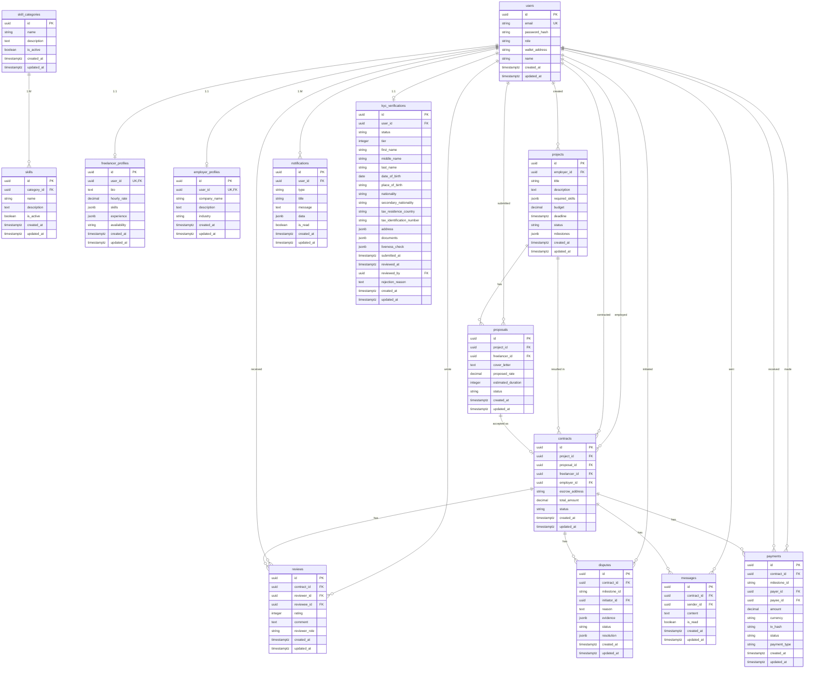

# Database Schema Reference

## Table of Contents

1. [Overview](#overview)
2. [Entity-Relationship Diagram](#entity-relationship-diagram)
3. [Table Definitions](#table-definitions)
   - [users](#users)
   - [skill_categories](#skill_categories)
   - [skills](#skills)
   - [freelancer_profiles](#freelancer_profiles)
   - [employer_profiles](#employer_profiles)
   - [projects](#projects)
   - [proposals](#proposals)
   - [contracts](#contracts)
   - [disputes](#disputes)
   - [payments](#payments)
   - [reviews](#reviews)
   - [notifications](#notifications)
   - [messages](#messages)
   - [kyc_verifications](#kyc_verifications)
4. [Indexes](#indexes)
5. [Row Level Security](#row-level-security)
6. [Data Seeding](#data-seeding)

---

## Overview

The FreelanceXchain platform uses an Appwrite PostgreSQL database with the following design principles:

- **UUID primary keys** on all tables for global uniqueness and enumeration attack prevention.
- **JSONB columns** for flexible data (skills, experience, milestones, evidence, addresses, documents).
- **TIMESTAMPTZ** for all timestamps (timezone-aware).
- **Row Level Security (RLS)** enabled on every table.
- **CHECK constraints** on status columns to enforce valid state transitions.
- **ON DELETE CASCADE** on all foreign keys.

---

## Entity-Relationship Diagram

---

## Table Definitions

### users

Central identity store for all platform users.

| Column | Type | Constraints | Description |
| -------- | ------ | ------------- | ------------- |
| id | UUID | PRIMARY KEY, DEFAULT uuid_generate_v4() | Unique identifier |
| email | VARCHAR(255) | UNIQUE, NOT NULL | Email address for authentication |
| password_hash | VARCHAR(255) | NOT NULL | Hashed password (managed by Appwrite Auth) |
| role | VARCHAR(20) | NOT NULL, CHECK (freelancer, employer, admin) | User role |
| wallet_address | VARCHAR(255) | DEFAULT '' | Blockchain wallet address |
| name | VARCHAR(255) | DEFAULT '' | Display name |
| created_at | TIMESTAMPTZ | DEFAULT NOW() | Record creation timestamp |
| updated_at | TIMESTAMPTZ | DEFAULT NOW() | Last update timestamp |

**Related tables:** freelancer_profiles, employer_profiles (1:1 via user_id)

---

### skill_categories

Hierarchical classification system for skills.

| Column | Type | Constraints | Description |
| -------- | ------ | ------------- | ------------- |
| id | UUID | PRIMARY KEY, DEFAULT uuid_generate_v4() | Unique identifier |
| name | VARCHAR(255) | NOT NULL | Category name |
| description | TEXT | | Category description |
| is_active | BOOLEAN | DEFAULT true | Active flag for visibility |
| created_at | TIMESTAMPTZ | DEFAULT NOW() | Record creation timestamp |
| updated_at | TIMESTAMPTZ | DEFAULT NOW() | Last update timestamp |

**Seed data:** Web Development, Mobile Development, Data Science, DevOps, Design, Blockchain

---

### skills

Atomic skill definitions linked to categories.

| Column | Type | Constraints | Description |
| -------- | ------ | ------------- | ------------- |
| id | UUID | PRIMARY KEY, DEFAULT uuid_generate_v4() | Unique identifier |
| category_id | UUID | REFERENCES skill_categories(id) ON DELETE CASCADE | Parent category |
| name | VARCHAR(255) | NOT NULL | Skill name |
| description | TEXT | | Skill description |
| is_active | BOOLEAN | DEFAULT true | Active flag for visibility |
| created_at | TIMESTAMPTZ | DEFAULT NOW() | Record creation timestamp |
| updated_at | TIMESTAMPTZ | DEFAULT NOW() | Last update timestamp |

**Seed data:** TypeScript, JavaScript, React, Node.js, Vue.js, Angular, Next.js, Express.js, HTML/CSS, Tailwind CSS, React Native, Flutter, Swift, Kotlin, Python, Machine Learning, TensorFlow, SQL, Docker, Kubernetes, AWS, CI/CD, Figma, UI/UX Design, Adobe XD, Solidity, Ethereum, Web3.js, Hardhat

---

### freelancer_profiles

Detailed professional identity for freelancers. One-to-one with users.

| Column | Type | Constraints | Description |
| -------- | ------ | ------------- | ------------- |
| id | UUID | PRIMARY KEY, DEFAULT uuid_generate_v4() | Unique identifier |
| user_id | UUID | UNIQUE, REFERENCES users(id) ON DELETE CASCADE | Associated user |
| bio | TEXT | | Professional biography |
| hourly_rate | DECIMAL(10, 2) | DEFAULT 0 | Preferred hourly rate |
| skills | JSONB | DEFAULT '[]' | Array of `{name, years_of_experience}` |
| experience | JSONB | DEFAULT '[]' | Array of `{id, title, company, description, start_date, end_date}` |
| availability | VARCHAR(20) | DEFAULT 'available', CHECK (available, busy, unavailable) | Current availability |
| created_at | TIMESTAMPTZ | DEFAULT NOW() | Record creation timestamp |
| updated_at | TIMESTAMPTZ | DEFAULT NOW() | Last update timestamp |

---

### employer_profiles

Organizational identity for employers. One-to-one with users.

| Column | Type | Constraints | Description |
| -------- | ------ | ------------- | ------------- |
| id | UUID | PRIMARY KEY, DEFAULT uuid_generate_v4() | Unique identifier |
| user_id | UUID | UNIQUE, REFERENCES users(id) ON DELETE CASCADE | Associated user |
| company_name | VARCHAR(255) | | Company name |
| description | TEXT | | Company description |
| industry | VARCHAR(255) | | Industry sector |
| created_at | TIMESTAMPTZ | DEFAULT NOW() | Record creation timestamp |
| updated_at | TIMESTAMPTZ | DEFAULT NOW() | Last update timestamp |

---

### projects

Freelance work opportunities posted by employers.

| Column | Type | Constraints | Description |
| -------- | ------ | ------------- | ------------- |
| id | UUID | PRIMARY KEY, DEFAULT uuid_generate_v4() | Unique identifier |
| employer_id | UUID | REFERENCES users(id) ON DELETE CASCADE | Creating employer |
| title | VARCHAR(255) | NOT NULL | Project title |
| description | TEXT | | Project description |
| required_skills | JSONB | DEFAULT '[]' | Array of required skill references |
| budget | DECIMAL(12, 2) | DEFAULT 0 | Project budget in ETH |
| deadline | TIMESTAMPTZ | | Completion deadline |
| status | VARCHAR(20) | DEFAULT 'draft', CHECK (draft, open, in_progress, completed, cancelled) | Project status |
| milestones | JSONB | DEFAULT '[]' | Array of milestone definitions (title, description, amount, dueDate, status) |
| created_at | TIMESTAMPTZ | DEFAULT NOW() | Record creation timestamp |
| updated_at | TIMESTAMPTZ | DEFAULT NOW() | Last update timestamp |

**RLS:** Public read allowed only when `status = 'open'`

---

### proposals

Bids from freelancers on projects.

| Column | Type | Constraints | Description |
| -------- | ------ | ------------- | ------------- |
| id | UUID | PRIMARY KEY, DEFAULT uuid_generate_v4() | Unique identifier |
| project_id | UUID | REFERENCES projects(id) ON DELETE CASCADE | Target project |
| freelancer_id | UUID | REFERENCES users(id) ON DELETE CASCADE | Submitting freelancer |
| cover_letter | TEXT | | Proposal cover letter |
| proposed_rate | DECIMAL(10, 2) | DEFAULT 0 | Proposed rate |
| estimated_duration | INTEGER | DEFAULT 0 | Estimated days to complete |
| status | VARCHAR(20) | DEFAULT 'pending', CHECK (pending, accepted, rejected, withdrawn) | Proposal status |
| created_at | TIMESTAMPTZ | DEFAULT NOW() | Record creation timestamp |
| updated_at | TIMESTAMPTZ | DEFAULT NOW() | Last update timestamp |

**Constraints:** UNIQUE(project_id, freelancer_id) -- one proposal per freelancer per project

**Workflow:** Accepting a proposal creates a contract, updates project status to `in_progress`, and triggers blockchain agreement signing.

---

### contracts

Formal agreements between freelancers and employers, linking off-chain data to on-chain escrow.

| Column | Type | Constraints | Description |
| -------- | ------ | ------------- | ------------- |
| id | UUID | PRIMARY KEY, DEFAULT uuid_generate_v4() | Unique identifier |
| project_id | UUID | REFERENCES projects(id) ON DELETE CASCADE | Source project |
| proposal_id | UUID | REFERENCES proposals(id) ON DELETE CASCADE | Accepted proposal |
| freelancer_id | UUID | REFERENCES users(id) ON DELETE CASCADE | Contracted freelancer |
| employer_id | UUID | REFERENCES users(id) ON DELETE CASCADE | Contracting employer |
| escrow_address | VARCHAR(255) | | On-chain escrow contract address |
| total_amount | DECIMAL(12, 2) | DEFAULT 0 | Total contract value in ETH |
| status | VARCHAR(20) | DEFAULT 'active', CHECK (active, completed, disputed, cancelled) | Contract status |
| created_at | TIMESTAMPTZ | DEFAULT NOW() | Record creation timestamp |
| updated_at | TIMESTAMPTZ | DEFAULT NOW() | Last update timestamp |

**Status transitions:**

- `active` -> `completed`, `disputed`, `cancelled`
- `disputed` -> `active`, `completed`, `cancelled`
- `completed` and `cancelled` are terminal states

**On-chain integration:** FreelanceEscrow.sol holds funds and releases upon milestone approval. Milestone flow: freelancer submits -> employer approves -> escrow releases -> if all milestones approved, contract completes.

---

### disputes

Conflict resolution tracking for contract milestones.

| Column | Type | Constraints | Description |
| -------- | ------ | ------------- | ------------- |
| id | UUID | PRIMARY KEY, DEFAULT uuid_generate_v4() | Unique identifier |
| contract_id | UUID | REFERENCES contracts(id) ON DELETE CASCADE | Disputed contract |
| milestone_id | VARCHAR(255) | | Blockchain milestone identifier |
| initiator_id | UUID | REFERENCES users(id) ON DELETE CASCADE | User who opened the dispute |
| reason | TEXT | | Reason for the dispute |
| evidence | JSONB | DEFAULT '[]' | Array of `{id, submitter_id, type, content, submitted_at}` |
| status | VARCHAR(20) | DEFAULT 'open', CHECK (open, under_review, resolved) | Dispute status |
| resolution | JSONB | | `{decision, reasoning, resolved_by, resolved_at}` when resolved |
| created_at | TIMESTAMPTZ | DEFAULT NOW() | Record creation timestamp |
| updated_at | TIMESTAMPTZ | DEFAULT NOW() | Last update timestamp |

**Resolution decisions:** `freelancer_favor` (release to freelancer), `employer_favor` (refund to employer), `split` (mark milestone approved)

**On-chain integration:** DisputeResolution.sol stores dispute hashes, evidence hashes, outcomes, and reasoning. Events emitted for creation, evidence submission, and resolution.

---

### payments

Transaction history ledger bridging off-chain records with on-chain events.

| Column | Type | Constraints | Description |
| -------- | ------ | ------------- | ------------- |
| id | UUID | PRIMARY KEY, DEFAULT uuid_generate_v4() | Unique identifier |
| contract_id | UUID | REFERENCES contracts(id) ON DELETE CASCADE | Associated contract |
| milestone_id | VARCHAR(255) | | Blockchain milestone identifier |
| payer_id | UUID | REFERENCES users(id) ON DELETE CASCADE | User making payment |
| payee_id | UUID | REFERENCES users(id) ON DELETE CASCADE | User receiving payment |
| amount | DECIMAL(12, 2) | NOT NULL | Payment amount in ETH |
| currency | VARCHAR(10) | DEFAULT 'ETH' | Cryptocurrency used |
| tx_hash | VARCHAR(255) | | Blockchain transaction hash |
| status | VARCHAR(20) | DEFAULT 'pending', CHECK (pending, processing, completed, failed, refunded) | Payment status |
| payment_type | VARCHAR(20) | NOT NULL, CHECK (escrow_deposit, milestone_release, refund, dispute_resolution) | Payment type |
| created_at | TIMESTAMPTZ | DEFAULT NOW() | Record creation timestamp |
| updated_at | TIMESTAMPTZ | DEFAULT NOW() | Last update timestamp |

**On-chain integration:** FreelanceEscrow.sol emits FundsDeposited, MilestoneApproved, MilestoneRefunded, and DisputeResolved events that map to payment types.

---

### reviews

Off-chain reputation feedback linked to completed contracts.

| Column | Type | Constraints | Description |
| -------- | ------ | ------------- | ------------- |
| id | UUID | PRIMARY KEY, DEFAULT uuid_generate_v4() | Unique identifier |
| contract_id | UUID | REFERENCES contracts(id) ON DELETE CASCADE | Reviewed contract |
| reviewer_id | UUID | REFERENCES users(id) ON DELETE CASCADE | User writing review |
| reviewee_id | UUID | REFERENCES users(id) ON DELETE CASCADE | User being reviewed |
| rating | INTEGER | NOT NULL, CHECK (1-5) | Numerical rating |
| comment | TEXT | | Written feedback |
| reviewer_role | VARCHAR(20) | NOT NULL, CHECK (freelancer, employer) | Role of reviewer |
| created_at | TIMESTAMPTZ | DEFAULT NOW() | Record creation timestamp |
| updated_at | TIMESTAMPTZ | DEFAULT NOW() | Last update timestamp |

**Constraints:** UNIQUE(contract_id, reviewer_id) -- one review per reviewer per contract

**On-chain integration:** FreelanceReputation.sol stores immutable ratings with duplicate prevention keyed by rater+ratee+contractId. Aggregates totalScore and ratingCount.

---

### notifications

Event-driven notification system for user engagement.

| Column | Type | Constraints | Description |
| -------- | ------ | ------------- | ------------- |
| id | UUID | PRIMARY KEY, DEFAULT uuid_generate_v4() | Unique identifier |
| user_id | UUID | REFERENCES users(id) ON DELETE CASCADE | Recipient user |
| type | VARCHAR(50) | NOT NULL | Notification type (proposal_received, proposal_accepted, proposal_rejected, milestone_submitted, milestone_approved, payment_released, dispute_created, dispute_resolved, rating_received) |
| title | VARCHAR(255) | NOT NULL | Short headline |
| message | TEXT | | Human-readable description |
| data | JSONB | DEFAULT '{}' | Contextual payload (IDs, titles, amounts) |
| is_read | BOOLEAN | DEFAULT false | Read status flag |
| created_at | TIMESTAMPTZ | DEFAULT NOW() | Record creation timestamp |
| updated_at | TIMESTAMPTZ | DEFAULT NOW() | Last update timestamp |

---

### messages

Secure, contract-scoped communication between parties.

| Column | Type | Constraints | Description |
| -------- | ------ | ------------- | ------------- |
| id | UUID | PRIMARY KEY, DEFAULT uuid_generate_v4() | Unique identifier |
| contract_id | UUID | REFERENCES contracts(id) ON DELETE CASCADE | Related contract |
| sender_id | UUID | REFERENCES users(id) ON DELETE CASCADE | Message sender |
| content | TEXT | NOT NULL | Message content |
| is_read | BOOLEAN | DEFAULT false | Read status flag |
| created_at | TIMESTAMPTZ | DEFAULT NOW() | Record creation timestamp |
| updated_at | TIMESTAMPTZ | DEFAULT NOW() | Last update timestamp |

**Access control:** Only the freelancer and employer linked to the contract can send/read messages.

---

### kyc_verifications

Know Your Customer identity verification records.

| Column | Type | Constraints | Description |
| -------- | ------ | ------------- | ------------- |
| id | UUID | PRIMARY KEY, DEFAULT uuid_generate_v4() | Unique identifier |
| user_id | UUID | REFERENCES users(id) ON DELETE CASCADE | Verified user |
| status | VARCHAR(20) | DEFAULT 'pending', CHECK (pending, submitted, under_review, approved, rejected) | Verification status |
| tier | INTEGER | DEFAULT 1 | Verification tier level |
| first_name | VARCHAR(255) | | First name |
| middle_name | VARCHAR(255) | | Middle name |
| last_name | VARCHAR(255) | | Last name |
| date_of_birth | DATE | | Date of birth |
| place_of_birth | VARCHAR(255) | | Place of birth |
| nationality | VARCHAR(100) | | Nationality |
| secondary_nationality | VARCHAR(100) | | Secondary nationality |
| tax_residence_country | VARCHAR(100) | | Tax residence country |
| tax_identification_number | VARCHAR(100) | | Tax ID number |
| address | JSONB | DEFAULT '{}' | Residential address object |
| documents | JSONB | DEFAULT '[]' | Array of submitted document references |
| liveness_check | JSONB | | Biometric session data |
| submitted_at | TIMESTAMPTZ | | Submission timestamp |
| reviewed_at | TIMESTAMPTZ | | Review completion timestamp |
| reviewed_by | UUID | REFERENCES users(id) | Reviewing admin |
| rejection_reason | TEXT | | Rejection reason if applicable |
| created_at | TIMESTAMPTZ | DEFAULT NOW() | Record creation timestamp |
| updated_at | TIMESTAMPTZ | DEFAULT NOW() | Last update timestamp |

**On-chain integration:** KYCVerification.sol stores verification status, tier, dataHash, verifiedAt, expiresAt, verifiedBy, and rejectionReason. Supports submit, approve, reject, expire, and query functions.

**Impact:** Approved KYC enables higher withdrawal limits and grants dispute resolution privileges based on tier.

---

## Indexes

### Foreign Key Indexes

| Index | Table | Column(s) |
| ------- | ------- | ----------- |
| idx_freelancer_profiles_user_id | freelancer_profiles | user_id |
| idx_employer_profiles_user_id | employer_profiles | user_id |
| idx_projects_employer_id | projects | employer_id |
| idx_proposals_project_id | proposals | project_id |
| idx_proposals_freelancer_id | proposals | freelancer_id |
| idx_contracts_freelancer_id | contracts | freelancer_id |
| idx_contracts_employer_id | contracts | employer_id |
| idx_disputes_contract_id | disputes | contract_id |
| idx_notifications_user_id | notifications | user_id |
| idx_kyc_user_id | kyc_verifications | user_id |
| idx_skills_category_id | skills | category_id |
| idx_reviews_contract_id | reviews | contract_id |
| idx_reviews_reviewee_id | reviews | reviewee_id |
| idx_messages_contract_id | messages | contract_id |
| idx_messages_sender_id | messages | sender_id |
| idx_payments_contract_id | payments | contract_id |
| idx_payments_payer_id | payments | payer_id |
| idx_payments_payee_id | payments | payee_id |

### Status and Lookup Indexes

| Index | Table | Column(s) |
| ------- | ------- | ----------- |
| idx_projects_status | projects | status |
| idx_notifications_is_read | notifications | is_read |
| idx_users_email | users | email |

### Composite Unique Constraints

| Constraint | Table | Column(s) |
| ------------ | ------- | ----------- |
| UNIQUE(project_id, freelancer_id) | proposals | project_id, freelancer_id |
| UNIQUE(contract_id, reviewer_id) | reviews | contract_id, reviewer_id |

---

## Row Level Security

RLS is enabled on all tables. The following policies are in effect:

### Public Read Policies

| Table | Access | Condition |
| ------- | -------- | ----------- |
| skill_categories | SELECT | All users (no auth required) |
| skills | SELECT | All users (no auth required) |
| projects | SELECT | Only when `status = 'open'` |

### Service Role Policies

All tables have a service role bypass policy granting full CRUD access for backend operations. The service role key is configured server-side only.

### Future Policies (Planned)

- User-owned data (profiles, notifications) restricted to owner
- Contract data restricted to involved parties
- Admin functions restricted to admin role

### Security Layers

1. **Transport:** HTTPS/TLS
2. **Authentication:** JWT Bearer tokens via Appwrite Auth
3. **Authorization:** Role-based access control middleware
4. **Database:** PostgreSQL Row Level Security
5. **Blockchain:** Smart contract access controls

---

## Data Seeding

Initial skill categories and skills are seeded via `appwrite/seed-skills.sql`.

### Characteristics

- Uses **explicit UUIDs** for stable identifiers across environments
- Uses `ON CONFLICT (id) DO NOTHING` for idempotent re-runs
- Establishes six categories: Web Development, Mobile Development, Data Science, DevOps, Design, Blockchain
- Each category contains predefined skills linked via `category_id` foreign key

### Seeding Process

1. Run `appwrite/schema.sql` in Appwrite SQL Editor to create tables, indexes, extensions, and RLS policies
2. Run `appwrite/seed-skills.sql` to populate categories and skills
3. Verify counts with the included verification query

### Seeded Skill Taxonomy

| Category | Skills |
| ---------- | -------- |
| Web Development | TypeScript, JavaScript, React, Node.js, Vue.js, Angular, Next.js, Express.js, HTML/CSS, Tailwind CSS |
| Mobile Development | React Native, Flutter, Swift, Kotlin |
| Data Science | Python, Machine Learning, TensorFlow, SQL |
| DevOps | Docker, Kubernetes, AWS, CI/CD |
| Design | Figma, UI/UX Design, Adobe XD |
| Blockchain | Solidity, Ethereum, Web3.js, Hardhat |

---

[<- Back to Database](README.md)
