# Security Documentation

## Table of Contents
1. [Security Overview](#security-documentation)
2. [API Security Measures](#api-security-measures)
3. [Authentication Security](#authentication-security)
4. [CSRF Protection Implementation Guide](#csrf-protection-implementation-guide)
5. [Database Security & Row Level Security](#database-security--row-level-security)
6. [Security Considerations](#security-considerations)
7. [Data Privacy & KYC Protection](#data-privacy--kyc-protection)
8. [Didit KYC Configuration](#didit-kyc-configuration)
9. [Role-Based Access Control](#role-based-access-control)
10. [Smart Contract Security](#smart-contract-security)
Comprehensive security implementation, best practices, and compliance documentation.

## Documentation

- [Security Overview](overview.md) - Overall security architecture
- [API Security](api-security.md) - API security measures
- [Authentication](authentication.md) - Auth implementation
- [CSRF Protection](csrf.md) - CSRF prevention
- [Database Security](database-security.md) - Database security
- [Privacy & KYC](privacy-kyc.md) - Privacy and KYC compliance
- [RBAC](rbac.md) - Role-based access control
- [Smart Contract Security](smart-contracts.md) - Blockchain security

## Security Checklist

- [ ] Review security overview
- [ ] Configure authentication properly
- [ ] Enable CSRF protection
- [ ] Set up database security
- [ ] Implement RBAC
- [ ] Review smart contract security

[← Back to Documentation Index](../README.md)

---

# API Security Measures

## Table of Contents
1. [Introduction](#introduction)
2. [HTTP Header Hardening with Helmet.js](#http-header-hardening-with-helmetjs)
3. [Rate Limiting and DDoS Protection](#rate-limiting-and-ddos-protection)
4. [Input Validation and Data Integrity](#input-validation-and-data-integrity)
5. [Error Handling Standardization](#error-handling-standardization)
6. [CORS Configuration and CSRF Protection](#cors-configuration-and-csrf-protection)
7. [Secured Endpoint Examples](#secured-endpoint-examples)
8. [OWASP Top 10 Mitigation](#owasp-top-10-mitigation)
9. [Conclusion](#conclusion)

## Introduction
The FreelanceXchain API implements a comprehensive security framework to protect against common web vulnerabilities and ensure data integrity. The security architecture is built around several key components: HTTP header hardening using Helmet.js, rate limiting to prevent abuse, robust input validation, standardized error handling, and strict CORS policies. These measures work together to create a secure environment for users to conduct freelance transactions on the blockchain-based platform. The implementation follows industry best practices and addresses multiple OWASP Top 10 vulnerabilities through proactive security controls.

## HTTP Header Hardening with Helmet.js
The FreelanceXchain API employs Helmet.js middleware to enhance security through HTTP header configuration. This approach mitigates several common web vulnerabilities by setting appropriate security headers that browsers and clients will respect. The security headers are implemented as middleware in the application stack, ensuring they are applied to all responses.

The Content Security Policy (CSP) is configured with a restrictive directive set that limits content sources to the same origin by default. The policy allows scripts from the same origin and includes 'unsafe-inline' to accommodate Swagger UI functionality and Appwrite integration. The connect-src directive specifically permits connections to the Appwrite database, ensuring secure data access while preventing unauthorized external connections.

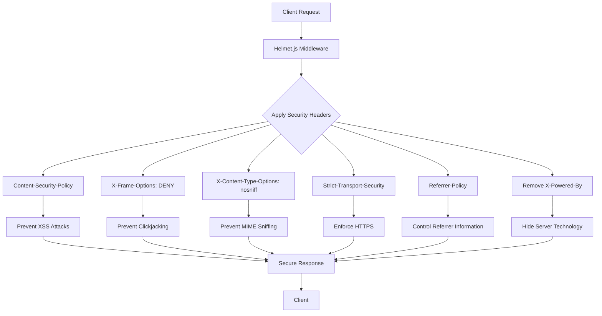
```mermaid
flowchart TD
A[Client Request] --> B[Helmet.js Middleware]
B --> C{Apply Security Headers}
C --> D[Content-Security-Policy]
C --> E[X-Frame-Options: DENY]
C --> F[X-Content-Type-Options: nosniff]
C --> G[Strict-Transport-Security]
C --> H[Referrer-Policy]
C --> I[Remove X-Powered-By]
D --> J[Prevent XSS Attacks]
E --> K[Prevent Clickjacking]
F --> L[Prevent MIME Sniffing]
G --> M[Enforce HTTPS]
H --> N[Control Referrer Information]
I --> O[Hide Server Technology]
J --> P[Secure Response]
K --> P
L --> P
M --> P
N --> P
O --> P
P --> Q[Client]
```

The implementation includes several key security headers:
- **X-Frame-Options**: Set to 'DENY' to prevent clickjacking attacks by disallowing the page from being framed
- **X-Content-Type-Options**: Set to 'nosniff' to prevent MIME type sniffing and potential content injection attacks
- **X-XSS-Protection**: Enabled to leverage browser XSS filters for additional client-side protection
- **Strict-Transport-Security (HSTS)**: Configured with a max-age of 31536000 seconds (1 year), including subdomains and preload directives to enforce HTTPS connections
- **Referrer-Policy**: Set to 'strict-origin-when-cross-origin' to control referrer information disclosure
- **X-Powered-By**: Removed to hide server technology details from potential attackers

Additionally, the security middleware includes request ID generation using UUID v4, which provides unique identifiers for each request to facilitate logging and debugging while maintaining security. The request ID is generated if not provided in the headers, ensuring consistent tracking across the system.

## Rate Limiting and DDoS Protection
FreelanceXchain implements a comprehensive rate limiting system to prevent abuse and protect against DDoS attacks. The rate limiting middleware is designed to control the number of requests a client can make within a specified time window, effectively mitigating brute force attacks, credential stuffing, and service exhaustion attacks.

The rate limiting system is implemented through a custom middleware that tracks request counts per client IP address using in-memory stores. The implementation provides different rate limiting profiles for various types of endpoints based on their sensitivity and usage patterns:

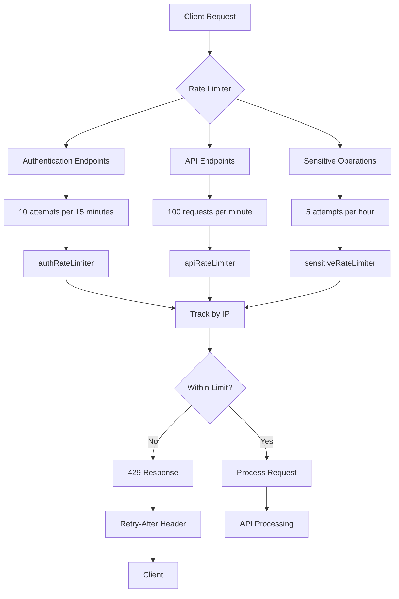
```mermaid
flowchart TD
A[Client Request] --> B{Rate Limiter}
B --> C[Authentication Endpoints]
B --> D[API Endpoints]
B --> E[Sensitive Operations]
C --> F[10 attempts per 15 minutes]
D --> G[100 requests per minute]
E --> H[5 attempts per hour]
F --> I[authRateLimiter]
G --> J[apiRateLimiter]
H --> K[sensitiveRateLimiter]
I --> L[Track by IP]
J --> L
K --> L
L --> M{Within Limit?}
M --> |Yes| N[Process Request]
M --> |No| O[429 Response]
O --> P[Retry-After Header]
P --> Q[Client]
N --> R[API Processing]
```

The system implements three primary rate limiting configurations:
- **Authentication Rate Limiter**: Limits authentication attempts to 10 per 15 minutes per IP address, preventing brute force attacks on login endpoints
- **API Rate Limiter**: Allows 100 requests per minute per IP address for general API usage, balancing accessibility with protection against abuse
- **Sensitive Operations Rate Limiter**: Restricts sensitive operations to 5 attempts per hour, providing additional protection for high-risk endpoints

The rate limiter uses the client's IP address as the identifier, extracting it from the X-Forwarded-For header when behind a proxy or using the direct IP otherwise. When a client exceeds the rate limit, the system returns a 429 Too Many Requests response with a Retry-After header indicating when the client can retry, providing clear feedback while enforcing the limits.

## Input Validation and Data Integrity
The FreelanceXchain API implements robust input validation to prevent injection attacks and ensure data integrity. The validation system is built around JSON schema-based validation that provides field-specific error reporting and comprehensive data type checking.

The validation middleware supports validation of request bodies, URL parameters, and query parameters through a flexible schema system. Each schema defines the expected structure, data types, and constraints for the input data. The system performs type validation, length checks, pattern matching, format validation, and custom business rule enforcement.

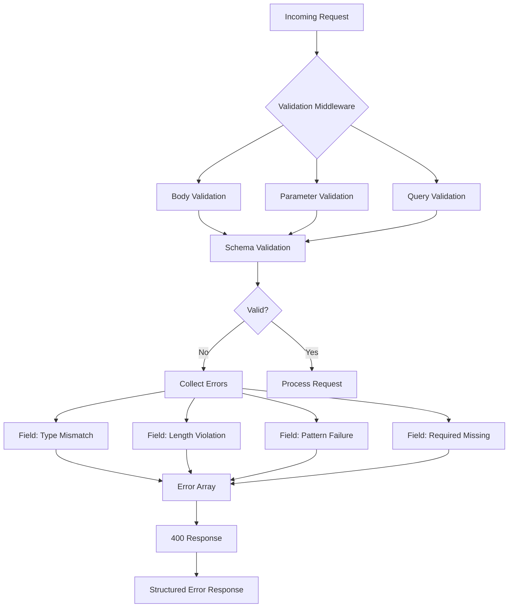
```mermaid
flowchart TD
A[Incoming Request] --> B{Validation Middleware}
B --> C[Body Validation]
B --> D[Parameter Validation]
B --> E[Query Validation]
C --> F[Schema Validation]
D --> F
E --> F
F --> G{Valid?}
G --> |No| H[Collect Errors]
H --> I[Field: Type Mismatch]
H --> J[Field: Length Violation]
H --> K[Field: Pattern Failure]
H --> L[Field: Required Missing]
I --> M[Error Array]
J --> M
K --> M
L --> M
M --> N[400 Response]
N --> O[Structured Error Response]
G --> |Yes| P[Process Request]
```

The validation system includes specific schemas for critical data types:
- **KYC Data Validation**: Ensures personal information such as names, dates of birth, and addresses meet format requirements and length constraints
- **Contract Data Validation**: Validates financial amounts, dates, and milestone structures to prevent invalid contract creation
- **Authentication Data**: Validates email formats, password strength requirements, and role specifications
- **Financial Data**: Validates budget amounts, hourly rates, and payment amounts with minimum thresholds
- **Date/Time Validation**: Ensures proper formatting for dates and date-time values using regular expressions

The system also includes specialized validation functions for UUID parameters, ensuring that all identifier-based requests use properly formatted UUIDs. This prevents injection attacks and ensures data integrity across the system. Validation errors are returned in a standardized format with field-specific details, allowing clients to correct input issues without exposing sensitive system information.

## Error Handling Standardization
FreelanceXchain implements a standardized error handling system that provides consistent error responses across all API endpoints. The error handling framework ensures that clients receive meaningful error information while preventing the exposure of sensitive system details.

The system uses a custom AppError class that standardizes error codes, messages, and HTTP status codes. This approach provides a consistent interface for error handling throughout the application and ensures that all errors are properly formatted and categorized.

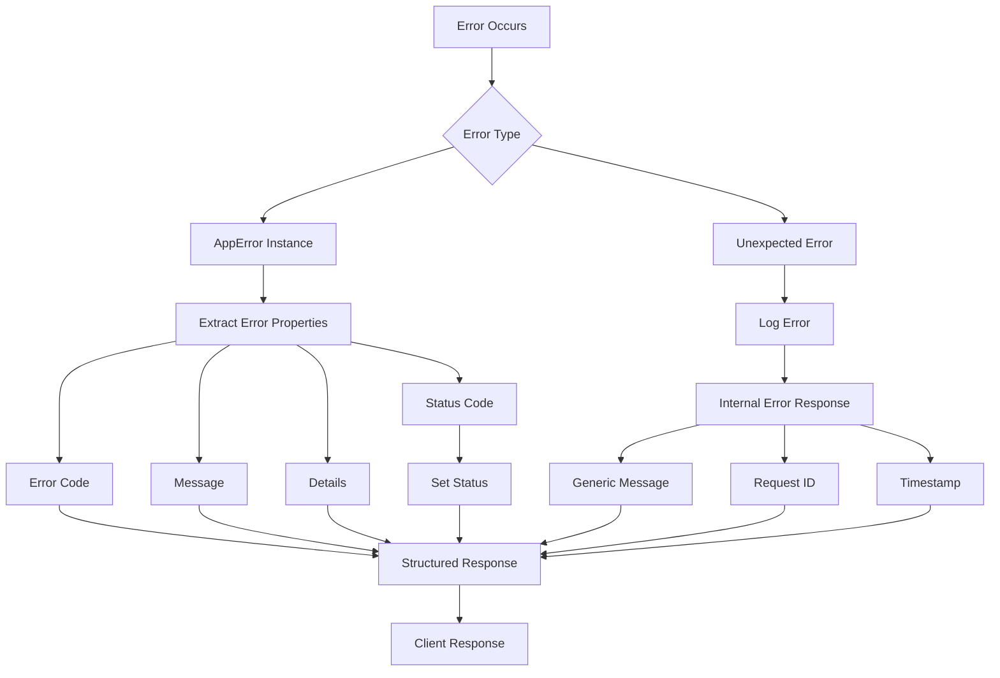
```mermaid
flowchart TD
A[Error Occurs] --> B{Error Type}
B --> C[AppError Instance]
B --> D[Unexpected Error]
C --> E[Extract Error Properties]
E --> F[Error Code]
E --> G[Message]
E --> H[Details]
E --> I[Status Code]
F --> J[Structured Response]
G --> J
H --> J
I --> K[Set Status]
K --> J
D --> L[Log Error]
L --> M[Internal Error Response]
M --> N[Generic Message]
M --> O[Request ID]
M --> P[Timestamp]
N --> J
O --> J
P --> J
J --> Q[Client Response]
```

The standardized error response format includes:
- **Error Code**: A machine-readable code such as VALIDATION_ERROR, UNAUTHORIZED, or FORBIDDEN
- **Message**: A human-readable description of the error
- **Details**: Field-specific validation errors when applicable
- **Timestamp**: ISO 8601 formatted timestamp of the error occurrence
- **Request ID**: The unique identifier for the request, facilitating debugging

The system defines specific error codes for common scenarios:
- **VALIDATION_ERROR**: For input validation failures, with detailed field-level error information
- **UNAUTHORIZED**: When authentication is required but missing or invalid
- **FORBIDDEN**: When the authenticated user lacks permission for the requested action
- **RATE_LIMIT_EXCEEDED**: When rate limiting thresholds are exceeded
- **NOT_FOUND**: When requested resources are not found
- **INTERNAL_ERROR**: For unexpected server errors, with generic messages to avoid information disclosure

This standardized approach ensures that clients can programmatically handle errors while maintaining security by not exposing implementation details.

## CORS Configuration and CSRF Protection
The FreelanceXchain API implements strict CORS (Cross-Origin Resource Sharing) policies to control which domains can access the API. The configuration prevents unauthorized domains from making requests to the API, mitigating cross-site request forgery (CSRF) risks and protecting user data.

The CORS middleware is configured with a whitelist of allowed origins, restricting access to trusted domains only. In production, the allowed origins are defined by the CORS_ORIGIN environment variable, while development environments allow localhost domains by default.

```mermaid
flowchart TD
A[Client Request] --> B{CORS Validation}
B --> C[Origin Provided?]
C --> |No| D[Allow (Mobile/Curl)]
C --> |Yes| E[Validate Against Whitelist]
E --> F{Origin Allowed?}
F --> |Yes| G[Set CORS Headers]
F --> |No| H{Production?}
H --> |Yes| I[Reject Request]
H --> |No| J[Warn & Allow]
I --> K[403 Response]
J --> G
G --> L[Access-Control-Allow-Origin]
G --> M[Access-Control-Allow-Methods]
G --> N[Access-Control-Allow-Headers]
G --> O[Access-Control-Allow-Credentials]
L --> P[Secure Response]
M --> P
N --> P
O --> P
```

The CORS configuration includes:
- **Allowed Origins**: Restricted to domains specified in the CORS_ORIGIN environment variable in production, with localhost allowed in development
- **Allowed Methods**: GET, POST, PUT, PATCH, DELETE, and OPTIONS
- **Allowed Headers**: Content-Type, Authorization, and X-Request-ID
- **Credentials**: Enabled to allow credential transmission
- **Wildcard Subdomain Support**: Allows origins like *.example.com through pattern matching

The system also includes protection against CSRF attacks through multiple mechanisms:
- **SameSite Cookies**: Not explicitly shown but implied by secure authentication practices
- **CSRF Tokens**: Implemented through the JWT-based authentication system
- **Origin Validation**: Strict origin checking prevents unauthorized domains from making requests
- **Authentication Requirements**: Sensitive operations require valid authentication tokens

## Secured Endpoint Examples
The FreelanceXchain API demonstrates its security measures through various secured endpoints that implement the comprehensive security framework. These endpoints showcase the integration of multiple security layers to protect sensitive operations.

### Authentication Endpoint Security
The authentication endpoints implement multiple security controls to protect user credentials and prevent abuse:

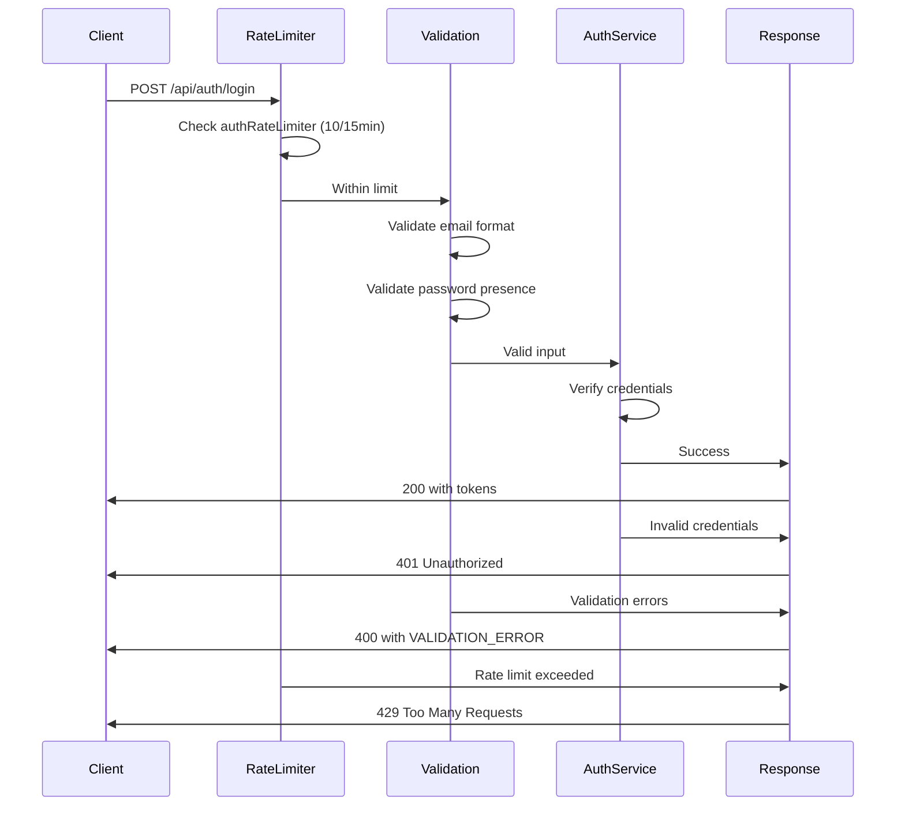
```mermaid
sequenceDiagram
participant Client
participant RateLimiter
participant Validation
participant AuthService
participant Response
Client->>RateLimiter : POST /api/auth/login
RateLimiter->>RateLimiter : Check authRateLimiter (10/15min)
RateLimiter->>Validation : Within limit
Validation->>Validation : Validate email format
Validation->>Validation : Validate password presence
Validation->>AuthService : Valid input
AuthService->>AuthService : Verify credentials
AuthService->>Response : Success
Response->>Client : 200 with tokens
AuthService->>Response : Invalid credentials
Response->>Client : 401 Unauthorized
Validation->>Response : Validation errors
Response->>Client : 400 with VALIDATION_ERROR
RateLimiter->>Response : Rate limit exceeded
Response->>Client : 429 Too Many Requests
```

The `/api/auth/login` endpoint combines rate limiting, input validation, and authentication security:
- Applies the authRateLimiter (10 attempts per 15 minutes)
- Validates email format and password presence
- Returns standardized error responses
- Uses HTTPS enforcement and security headers

### KYC Verification Endpoint Security
The KYC (Know Your Customer) endpoints implement stringent security measures for identity verification:

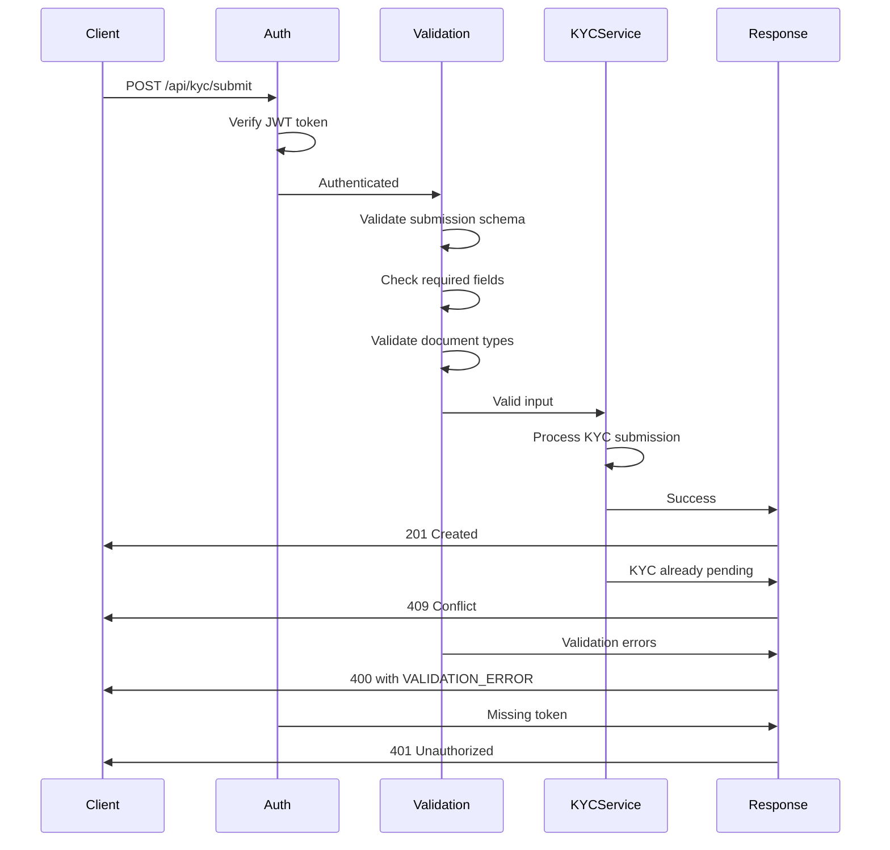
```mermaid
sequenceDiagram
participant Client
participant Auth
participant Validation
participant KYCService
participant Response
Client->>Auth : POST /api/kyc/submit
Auth->>Auth : Verify JWT token
Auth->>Validation : Authenticated
Validation->>Validation : Validate submission schema
Validation->>Validation : Check required fields
Validation->>Validation : Validate document types
Validation->>KYCService : Valid input
KYCService->>KYCService : Process KYC submission
KYCService->>Response : Success
Response->>Client : 201 Created
KYCService->>Response : KYC already pending
Response->>Client : 409 Conflict
Validation->>Response : Validation errors
Response->>Client : 400 with VALIDATION_ERROR
Auth->>Response : Missing token
Response->>Client : 401 Unauthorized
```

The KYC submission endpoint demonstrates:
- JWT authentication requirement
- Comprehensive input validation for personal and document information
- Prevention of duplicate submissions
- Standardized error responses with appropriate status codes

### Contract Access Endpoint Security
The contract endpoints implement role-based access control and parameter validation:

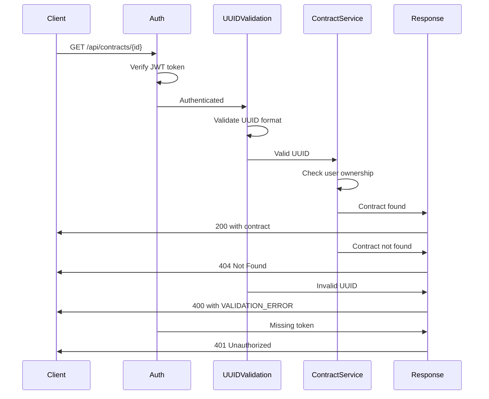
```mermaid
sequenceDiagram
participant Client
participant Auth
participant UUIDValidation
participant ContractService
participant Response
Client->>Auth : GET /api/contracts/{id}
Auth->>Auth : Verify JWT token
Auth->>UUIDValidation : Authenticated
UUIDValidation->>UUIDValidation : Validate UUID format
UUIDValidation->>ContractService : Valid UUID
ContractService->>ContractService : Check user ownership
ContractService->>Response : Contract found
Response->>Client : 200 with contract
ContractService->>Response : Contract not found
Response->>Client : 404 Not Found
UUIDValidation->>Response : Invalid UUID
Response->>Client : 400 with VALIDATION_ERROR
Auth->>Response : Missing token
Response->>Client : 401 Unauthorized
```

The contract retrieval endpoint shows:
- Authentication requirement
- UUID parameter validation
- Business logic validation (user ownership)
- Proper error handling for various scenarios

## OWASP Top 10 Mitigation
The FreelanceXchain API security measures effectively mitigate multiple OWASP Top 10 vulnerabilities through its comprehensive security framework.

### Injection Prevention
The system prevents injection attacks through rigorous input validation and parameterized operations:
- **SQL Injection**: Prevented by using Appwrite with parameterized queries and input validation
- **NoSQL Injection**: Mitigated through schema validation and type checking
- **Command Injection**: Prevented by avoiding system command execution
- **Expression Language Injection**: Mitigated by not using expression languages in the API layer

The validation middleware ensures that all input data is properly typed and conforms to expected formats, eliminating opportunities for injection attacks. String inputs are validated against patterns, and all data types are explicitly checked before processing.

### Broken Authentication Protection
The authentication system implements multiple controls to prevent broken authentication vulnerabilities:
- **Rate Limiting**: authRateLimiter prevents brute force attacks with 10 attempts per 15 minutes
- **Strong Password Policies**: Password strength validation enforces minimum length and complexity
- **Secure Token Management**: JWT tokens with refresh tokens and proper expiration
- **Multi-factor Authentication**: Supported through OAuth integrations with Google, GitHub, etc.
- **Credential Recovery**: Secure password reset with token-based verification

### Sensitive Data Exposure Prevention
The API protects sensitive data through multiple mechanisms:
- **HTTPS Enforcement**: All production traffic is redirected to HTTPS with HSTS
- **Data Minimization**: Only necessary data is exposed in API responses
- **Secure Headers**: Information-hiding headers prevent technology disclosure
- **Proper Error Handling**: Error messages don't reveal sensitive information
- **CORS Restrictions**: Prevent unauthorized domains from accessing data

### XML External Entities (XXE) Prevention
The system mitigates XXE risks by:
- **Not accepting XML input**: The API primarily uses JSON, eliminating XML parsing risks
- **Secure Body Parsing**: Express body parsers are configured securely
- **Input Validation**: All input is validated against schemas before processing

### Broken Access Control Mitigation
Access control vulnerabilities are addressed through:
- **Role-Based Access Control**: requireRole middleware enforces role permissions
- **Ownership Verification**: Business logic checks ensure users can only access their data
- **Parameter Validation**: UUID validation prevents ID enumeration attacks
- **Authentication Enforcement**: authMiddleware required for protected endpoints

### Security Misconfiguration Prevention
The system avoids security misconfigurations by:
- **Secure Defaults**: Development environments have appropriate security settings
- **Header Hardening**: Helmet.js sets secure HTTP headers by default
- **Error Handling**: Generic error messages in production
- **Dependency Management**: Regular updates and security audits

### Cross-Site Scripting (XSS) Protection
XSS vulnerabilities are mitigated through:
- **Content Security Policy**: Restrictive CSP prevents unauthorized script execution
- **XSS Filter**: Browser XSS filters are enabled
- **Input Validation**: All input is validated and sanitized
- **Output Encoding**: Not explicitly shown but implied by secure framework usage

### Insecure Deserialization Prevention
The system prevents insecure deserialization by:
- **Using JSON**: Standard JSON parsing with type validation
- **Schema Validation**: Input is validated against schemas before use
- **Avoiding Object Deserialization**: No direct object deserialization from user input

### Using Components with Known Vulnerabilities
The project mitigates this risk by:
- **Regular Updates**: Dependencies are kept up-to-date
- **Security Audits**: Regular vulnerability scanning
- **Minimal Dependencies**: Only necessary packages are included
- **Version Pinning**: Specific versions are used to prevent unexpected updates

### Insufficient Logging & Monitoring
The system addresses logging and monitoring through:
- **Request IDs**: Unique identifiers for tracking requests
- **Structured Logging**: Consistent error formats with timestamps
- **Rate Limit Tracking**: Monitoring for potential abuse
- **Error Logging**: Unexpected errors are logged for investigation

## Conclusion
The FreelanceXchain API implements a robust security framework that effectively protects against common web vulnerabilities and ensures data integrity. The multi-layered approach combines HTTP header hardening, rate limiting, comprehensive input validation, standardized error handling, and strict CORS policies to create a secure environment for users.

The security measures address multiple OWASP Top 10 vulnerabilities through proactive controls, including protection against injection attacks, broken authentication, sensitive data exposure, and broken access control. The implementation follows industry best practices and provides a solid foundation for a secure blockchain-based freelance platform.

Key strengths of the security implementation include:
- **Layered Defense**: Multiple security controls work together to provide comprehensive protection
- **Standardization**: Consistent error handling and response formats improve security and usability
- **Proactive Prevention**: Security measures are implemented at the framework level, ensuring consistent application
- **Balance of Security and Usability**: Rate limiting and validation are configured to prevent abuse while allowing legitimate usage

The documented security measures demonstrate a mature approach to API security that effectively mitigates risks while maintaining a positive user experience. Continued attention to security updates, dependency management, and threat modeling will ensure the platform remains secure as it evolves.

---

# Authentication Security

## Table of Contents
1. [Introduction](#introduction)
2. [Authentication Flow Overview](#authentication-flow-overview)
3. [Token Management](#token-management)
4. [Authentication Middleware](#authentication-middleware)
5. [Error Handling](#error-handling)
6. [Security Implementation](#security-implementation)
7. [Integration with Appwrite](#integration-with-appwrite)
8. [Secure Token Storage Recommendations](#secure-token-storage-recommendations)
9. [Authentication Sequence Diagrams](#authentication-sequence-diagrams)
10. [Security Best Practices](#security-best-practices)

## Introduction
The FreelanceXchain authentication security system implements a robust JWT-based authentication mechanism with comprehensive security measures. This documentation details the authentication flow, token management, error handling, and integration with Appwrite authentication. The system provides secure access control for freelancers, employers, and administrators in the blockchain-based freelance marketplace.

## Authentication Flow Overview
The authentication system in FreelanceXchain follows a standard JWT-based flow with access and refresh tokens. The process begins with user registration or login, followed by token issuance and validation for subsequent requests. The system supports both traditional email/password authentication and OAuth-based authentication through various providers including Google, GitHub, Azure, and LinkedIn.

The authentication flow is protected by rate limiting to prevent brute force attacks, with different limits for various operations. The system enforces HTTPS in production environments and implements comprehensive security headers to protect against common web vulnerabilities.

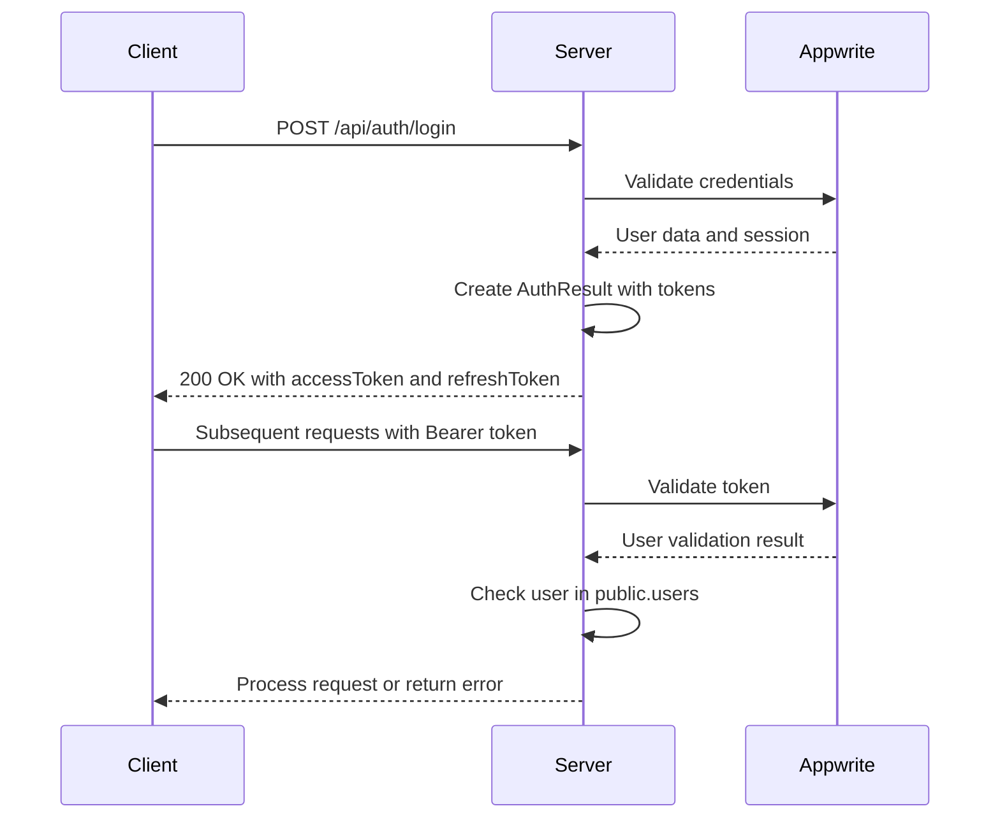
```mermaid
sequenceDiagram
participant Client
participant Server
participant Appwrite
Client->>Server : POST /api/auth/login
Server->>Appwrite : Validate credentials
Appwrite-->>Server : User data and session
Server->>Server : Create AuthResult with tokens
Server-->>Client : 200 OK with accessToken and refreshToken
Client->>Server : Subsequent requests with Bearer token
Server->>Appwrite : Validate token
Appwrite-->>Server : User validation result
Server->>Server : Check user in public.users
Server-->>Client : Process request or return error
```

## Token Management
FreelanceXchain implements a dual-token system with access tokens and refresh tokens, each with different expiration policies and security characteristics.

### Access Tokens
Access tokens have a short lifespan of 1 hour (configurable via JWT_EXPIRES_IN environment variable) to minimize the window of opportunity for token theft. These tokens are used to authenticate API requests and contain essential user information in their payload.

### Refresh Tokens
Refresh tokens have a longer lifespan of 7 days (configurable via JWT_REFRESH_EXPIRES_IN environment variable) and are used to obtain new access tokens when they expire. Refresh tokens are stored securely and can be revoked when necessary.

### Token Payload Structure
The JWT token payload contains the following claims:
- userId: User's unique identifier (UUID)
- email: User's email address
- role: User's role (freelancer, employer, or admin)
- walletAddress: Ethereum wallet address for blockchain interactions
- type: Token type (access or refresh)

The token secrets are configured in the environment variables JWT_SECRET for access tokens and JWT_REFRESH_SECRET (defaults to JWT_SECRET if not specified) for refresh tokens.

## Authentication Middleware
The authentication middleware in FreelanceXchain performs comprehensive validation of incoming requests to ensure secure access to protected routes.

### Bearer Token Validation
The authMiddleware function validates the Authorization header according to the Bearer token format:
1. Checks for the presence of the Authorization header
2. Validates that the header follows the format "Bearer <token>"
3. Extracts and validates the JWT token
4. Extends the Express Request object with user information upon successful validation

The middleware returns specific error codes for different validation failures:
- AUTH_MISSING_TOKEN: When the Authorization header is absent
- AUTH_INVALID_FORMAT: When the header format is incorrect
- AUTH_TOKEN_EXPIRED: When the token has expired
- AUTH_INVALID_TOKEN: When the token is invalid or cannot be verified

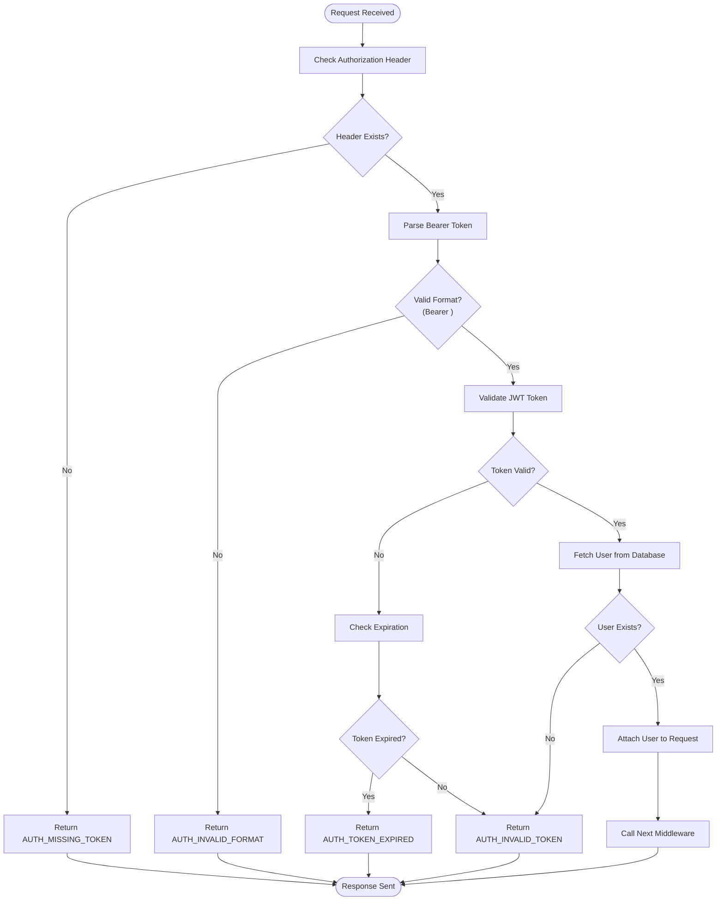
```mermaid
flowchart TD
Start([Request Received]) --> CheckAuthHeader["Check Authorization Header"]
CheckAuthHeader --> HeaderExists{"Header Exists?"}
HeaderExists --> |No| ReturnMissingToken["Return AUTH_MISSING_TOKEN"]
HeaderExists --> |Yes| ParseHeader["Parse Bearer Token"]
ParseHeader --> ValidFormat{"Valid Format?<br/>(Bearer <token>)"}
ValidFormat --> |No| ReturnInvalidFormat["Return AUTH_INVALID_FORMAT"]
ValidFormat --> |Yes| ValidateToken["Validate JWT Token"]
ValidateToken --> TokenValid{"Token Valid?"}
TokenValid --> |No| CheckExpiration["Check Expiration"]
CheckExpiration --> Expired{"Token Expired?"}
Expired --> |Yes| ReturnTokenExpired["Return AUTH_TOKEN_EXPIRED"]
Expired --> |No| ReturnInvalidToken["Return AUTH_INVALID_TOKEN"]
TokenValid --> |Yes| FetchUser["Fetch User from Database"]
FetchUser --> UserExists{"User Exists?"}
UserExists --> |No| ReturnInvalidToken
UserExists --> |Yes| AttachUser["Attach User to Request"]
AttachUser --> NextMiddleware["Call Next Middleware"]
ReturnMissingToken --> End([Response Sent])
ReturnInvalidFormat --> End
ReturnTokenExpired --> End
ReturnInvalidToken --> End
NextMiddleware --> End
```

## Error Handling
The authentication system implements comprehensive error handling with standardized error responses for different failure scenarios.

### Authentication Error Types
The system defines several authentication-specific error codes:
- AUTH_MISSING_TOKEN: Authorization header is required
- AUTH_INVALID_FORMAT: Authorization header must be in format: Bearer <token>
- AUTH_TOKEN_EXPIRED: JWT token has expired
- AUTH_INVALID_TOKEN: Invalid or expired token
- AUTH_INVALID_CREDENTIALS: Invalid email or password
- DUPLICATE_EMAIL: An account with this email already exists
- AUTH_REQUIRE_REGISTRATION: User registration required for OAuth users

### Error Response Structure
All authentication errors follow a consistent JSON response structure:
```json
{
  "error": {
    "code": "ERROR_CODE",
    "message": "Error description"
  },
  "timestamp": "ISO 8601 timestamp",
  "requestId": "Unique request identifier"
}
```

The error handling is implemented in both the authMiddleware and the authService, with specific error codes mapped to appropriate HTTP status codes (401 for authentication errors, 403 for authorization errors).

## Security Implementation
FreelanceXchain implements multiple layers of security to protect the authentication system and user data.

### Rate Limiting
The authentication endpoints are protected by rate limiting to prevent brute force attacks:
- authRateLimiter: 10 attempts per 15 minutes for authentication operations
- sensitiveRateLimiter: 5 attempts per hour for sensitive operations
- apiRateLimiter: 100 requests per minute for general API usage

### Security Headers
The system implements comprehensive security headers using the Helmet middleware:
- Content Security Policy (CSP) to prevent XSS attacks
- HSTS (HTTP Strict Transport Security) to enforce HTTPS
- X-Frame-Options to prevent clickjacking
- X-XSS-Protection to enable browser XSS filters
- X-Content-Type-Options to prevent MIME type sniffing

### HTTPS Enforcement
In production environments, the system enforces HTTPS by redirecting HTTP requests to HTTPS. This ensures that all authentication data, including tokens, is transmitted securely.

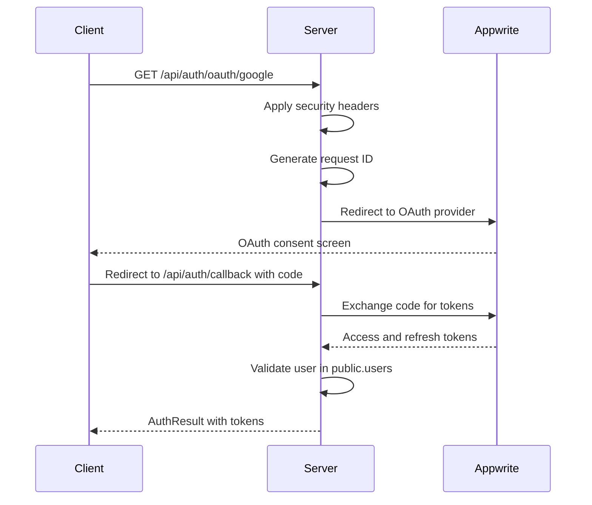
```mermaid
sequenceDiagram
participant Client
participant Server
participant Appwrite
Client->>Server : GET /api/auth/oauth/google
Server->>Server : Apply security headers
Server->>Server : Generate request ID
Server->>Appwrite : Redirect to OAuth provider
Appwrite-->>Client : OAuth consent screen
Client->>Server : Redirect to /api/auth/callback with code
Server->>Appwrite : Exchange code for tokens
Appwrite-->>Server : Access and refresh tokens
Server->>Server : Validate user in public.users
Server-->>Client : AuthResult with tokens
```

## Integration with Appwrite
FreelanceXchain leverages Appwrite authentication for user management while extending it with custom functionality for the freelance marketplace.

### Appwrite Authentication Flow
The system uses Appwrite Auth for:
- User registration and login
- Email verification and password reset
- OAuth integration with external providers
- Session management

When a user registers or logs in, the system:
1. Authenticates with Appwrite Auth
2. Creates or updates the user record in the public.users table
3. Returns custom authentication tokens with additional user data

### Custom User Data
The system extends Appwrite user metadata with additional fields:
- role: User's role on the platform (freelancer, employer, admin)
- walletAddress: Ethereum wallet address for blockchain interactions
- name: User's full name

This data is stored in both Appwrite Auth metadata and the public.users table for redundancy and performance.

## Secure Token Storage Recommendations
To ensure the security of authentication tokens, the following storage recommendations should be followed:

### Client-Side Storage
- **Access Tokens**: Should be stored in memory (JavaScript variables) and not persisted to avoid XSS attacks
- **Refresh Tokens**: Should be stored in HTTP-only, secure cookies to prevent access via JavaScript
- **Never store tokens in localStorage or sessionStorage** as they are vulnerable to XSS attacks

### Transmission Security
- All authentication requests must use HTTPS
- The Authorization header should only be sent over secure connections
- Implement HSTS to ensure browsers only connect via HTTPS

### Token Revocation
- Provide endpoints for token revocation and password changes
- Invalidate refresh tokens on logout
- Implement token blacklisting for compromised tokens
- Rotate refresh tokens on each use to detect token theft

### Additional Security Measures
- Implement short access token expiration (1 hour)
- Use long refresh token expiration (7 days) with rotation
- Validate token signatures using strong cryptographic algorithms
- Include user agent and IP address in token validation when possible
- Monitor for suspicious authentication patterns

## Authentication Sequence Diagrams
The following sequence diagrams illustrate the key authentication flows in FreelanceXchain.

### Successful Authentication Flow
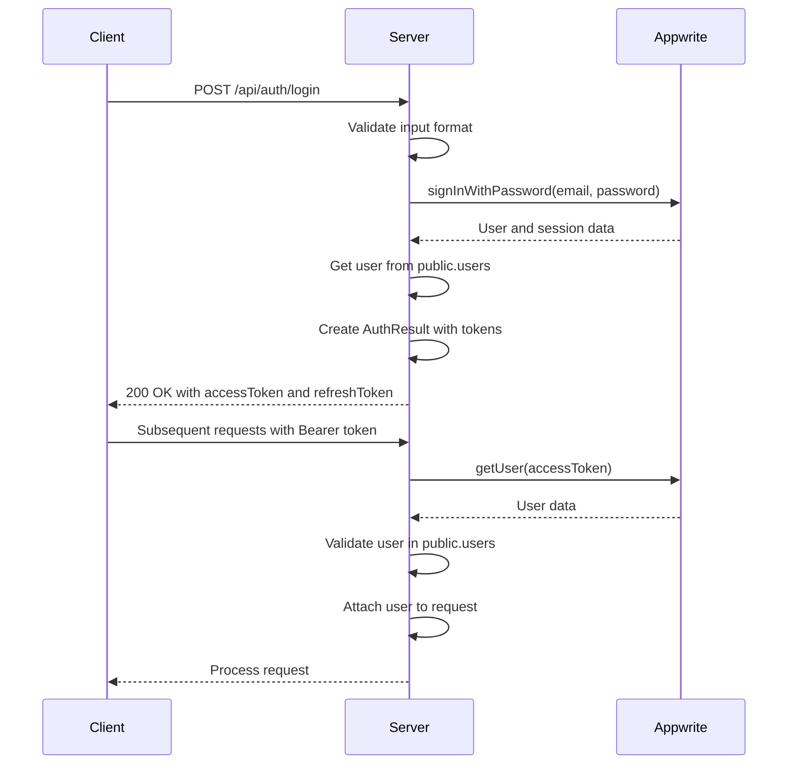
```mermaid
sequenceDiagram
participant Client
participant Server
participant Appwrite
Client->>Server : POST /api/auth/login
Server->>Server : Validate input format
Server->>Appwrite : signInWithPassword(email, password)
Appwrite-->>Server : User and session data
Server->>Server : Get user from public.users
Server->>Server : Create AuthResult with tokens
Server-->>Client : 200 OK with accessToken and refreshToken
Client->>Server : Subsequent requests with Bearer token
Server->>Appwrite : getUser(accessToken)
Appwrite-->>Server : User data
Server->>Server : Validate user in public.users
Server->>Server : Attach user to request
Server-->>Client : Process request
```

### Failed Authentication Flow
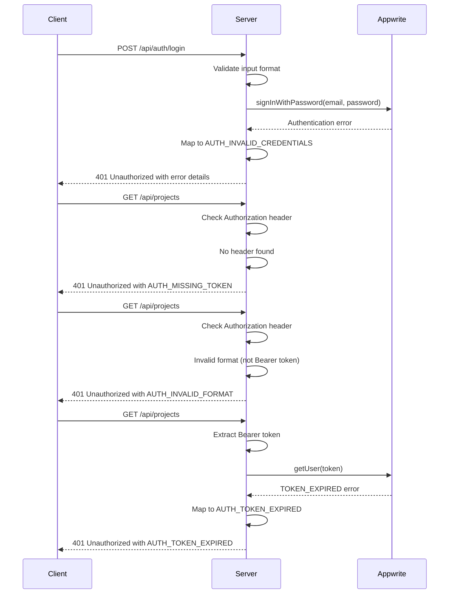
```mermaid
sequenceDiagram
participant Client
participant Server
participant Appwrite
Client->>Server : POST /api/auth/login
Server->>Server : Validate input format
Server->>Appwrite : signInWithPassword(email, password)
Appwrite-->>Server : Authentication error
Server->>Server : Map to AUTH_INVALID_CREDENTIALS
Server-->>Client : 401 Unauthorized with error details
Client->>Server : GET /api/projects
Server->>Server : Check Authorization header
Server->>Server : No header found
Server-->>Client : 401 Unauthorized with AUTH_MISSING_TOKEN
Client->>Server : GET /api/projects
Server->>Server : Check Authorization header
Server->>Server : Invalid format (not Bearer token)
Server-->>Client : 401 Unauthorized with AUTH_INVALID_FORMAT
Client->>Server : GET /api/projects
Server->>Server : Extract Bearer token
Server->>Appwrite : getUser(token)
Appwrite-->>Server : TOKEN_EXPIRED error
Server->>Server : Map to AUTH_TOKEN_EXPIRED
Server-->>Client : 401 Unauthorized with AUTH_TOKEN_EXPIRED
```

## Security Best Practices
The FreelanceXchain authentication system implements several security best practices to protect user data and prevent common vulnerabilities.

### Token Security
- Use strong, randomly generated secrets for JWT signing
- Implement short-lived access tokens (1 hour) to minimize exposure
- Use longer-lived refresh tokens (7 days) with secure storage
- Rotate refresh tokens on each use to detect token theft
- Implement token revocation mechanisms

### Transmission Security
- Enforce HTTPS in production environments
- Implement HSTS with long max-age (1 year)
- Use secure and HTTP-only flags for authentication cookies
- Validate CORS origins to prevent unauthorized access
- Implement Content Security Policy to prevent XSS attacks

### Input Validation
- Validate email format and password strength on registration
- Sanitize and validate all input data
- Implement rate limiting to prevent brute force attacks
- Use parameterized queries to prevent SQL injection
- Validate OAuth provider names to prevent SSRF attacks

### Error Handling
- Use generic error messages to avoid information disclosure
- Include request IDs for debugging without exposing sensitive data
- Log authentication failures for monitoring and analysis
- Implement account lockout after multiple failed attempts
- Distinguish between different error types for appropriate responses

### Monitoring and Logging
- Log authentication events with request IDs
- Monitor for suspicious patterns (rapid login attempts, unusual locations)
- Implement audit trails for security-critical operations
- Set up alerts for potential security incidents
- Regularly review authentication logs for anomalies

---

# CSRF Protection Implementation Guide

## Overview

The FreelanceXchain API implements Cross-Site Request Forgery (CSRF) protection using the **double-submit cookie pattern** via the `csrf-csrf` library. This provides defense-in-depth security even though the API primarily uses JWT-based authentication.

## Why CSRF Protection with JWT?

While JWT tokens in the `Authorization` header are not vulnerable to traditional CSRF attacks, we implement CSRF protection for:

1. **Defense in Depth**: Multiple layers of security reduce overall risk
2. **Cookie-Based Sessions**: Future support for session cookies alongside JWTs
3. **State-Changing Operations**: Extra validation for critical mutations
4. **Compliance**: Meeting security audit requirements (OWASP, IAS)
5. **Browser Security**: Protection against confused deputy attacks

## Architecture

### Technology Stack
- **Library**: `csrf-csrf` (double-submit cookie pattern)
- **Token Storage**: HTTP-only cookie + request header
- **Session Binding**: IP address + User-Agent combination
- **Token Rotation**: Per-session tokens with automatic refresh

### Double-Submit Cookie Pattern

1. **Token Generation**: Server generates cryptographically secure token
2. **Cookie Storage**: Token stored in HTTP-only, SameSite cookie
3. **Header Requirement**: Client must send token in `X-CSRF-Token` header
4. **Validation**: Server compares cookie value with header value
5. **Session Binding**: Token bound to client session (IP + User-Agent)

## Configuration

### Middleware Setup

The CSRF middleware is configured in `src/middleware/csrf-middleware.ts`:

```typescript
const { doubleCsrf } = require('csrf-csrf');

const { csrfProtection, generateToken } = doubleCsrf({
  getSecret: () => config.jwt.secret,
  cookieName: '__Host-csrf-token',
  cookieOptions: {
    httpOnly: true,
    secure: config.env === 'production',
    sameSite: 'strict',
    path: '/',
  },
  size: 64,
  ignoredMethods: ['GET', 'HEAD', 'OPTIONS'],
  getSessionIdentifier: (req) => {
    return `${req.ip}-${req.get('user-agent') || 'unknown'}`;
  },
});
```

### Cookie Configuration

- **Name**: `__Host-csrf-token` (prefix enforces secure, path=/, no domain)
- **HttpOnly**: `true` (prevents JavaScript access)
- **Secure**: `true` in production (HTTPS only)
- **SameSite**: `strict` (blocks cross-site requests)
- **Path**: `/` (available to all routes)

### Protected Methods

CSRF validation is enforced for:
- `POST` - Create operations
- `PUT` - Full update operations
- `PATCH` - Partial update operations
- `DELETE` - Delete operations

Exempt methods:
- `GET` - Read operations (idempotent)
- `HEAD` - Metadata requests
- `OPTIONS` - CORS preflight requests

## API Endpoints

### Get CSRF Token

**Endpoint**: `GET /api/auth/csrf-token`  
**Authentication**: Not required  
**Description**: Generates and returns a CSRF token for the client session

**Response** (200 OK):
```json
{
  "message": "CSRF token generated successfully"
}
```

**Response Headers**:
```
Set-Cookie: __Host-csrf-token=<token_value>; HttpOnly; Secure; SameSite=Strict; Path=/
```

**Usage**:
```bash
curl -X GET https://api.freelancexchain.com/api/auth/csrf-token \
  -c cookies.txt
```

The token is automatically stored in the cookie and must be extracted for subsequent requests.

---

## Client Implementation

### Web Application (JavaScript/TypeScript)

#### 1. Fetch CSRF Token

```typescript
// Fetch CSRF token on app initialization
async function initializeCsrf() {
  const response = await fetch('/api/auth/csrf-token', {
    method: 'GET',
    credentials: 'include', // Include cookies
  });
  
  if (!response.ok) {
    throw new Error('Failed to fetch CSRF token');
  }
  
  // Token is now stored in cookie
  // Extract from cookie for header
  const csrfToken = getCsrfTokenFromCookie();
  return csrfToken;
}

function getCsrfTokenFromCookie() {
  const match = document.cookie.match(/(?:^|;\s*)__Host-csrf-token=([^;]+)/);
  return match ? match[1] : null;
}
```

#### 2. Include Token in Requests

```typescript
// Add CSRF token to all state-changing requests
async function makeProtectedRequest(url: string, method: string, data: any) {
  const csrfToken = getCsrfTokenFromCookie();
  
  if (!csrfToken) {
    throw new Error('CSRF token not found');
  }
  
  const response = await fetch(url, {
    method,
    headers: {
      'Content-Type': 'application/json',
      'Authorization': `Bearer ${accessToken}`,
      'X-CSRF-Token': csrfToken, // Include CSRF token
    },
    credentials: 'include', // Include cookies
    body: JSON.stringify(data),
  });
  
  return response;
}

// Example usage
await makeProtectedRequest('/api/contracts', 'POST', {
  title: 'New Contract',
  amount: 1000,
});
```

#### 3. Axios Interceptor (Alternative)

```typescript
import axios from 'axios';

// Add CSRF token to all requests
axios.interceptors.request.use((config) => {
  const csrfToken = getCsrfTokenFromCookie();
  
  if (csrfToken && ['post', 'put', 'patch', 'delete'].includes(config.method?.toLowerCase() || '')) {
    config.headers['X-CSRF-Token'] = csrfToken;
  }
  
  return config;
});
```

---

### Mobile Application (React Native)

```typescript
import AsyncStorage from '@react-native-async-storage/async-storage';

// Fetch and store CSRF token
async function initializeCsrf() {
  const response = await fetch('/api/auth/csrf-token', {
    method: 'GET',
    credentials: 'include',
  });
  
  const setCookieHeader = response.headers.get('set-cookie');
  const csrfToken = extractCsrfToken(setCookieHeader);
  
  await AsyncStorage.setItem('csrf_token', csrfToken);
}

// Include token in requests
async function makeProtectedRequest(url: string, method: string, data: any) {
  const csrfToken = await AsyncStorage.getItem('csrf_token');
  const accessToken = await AsyncStorage.getItem('access_token');
  
  const response = await fetch(url, {
    method,
    headers: {
      'Content-Type': 'application/json',
      'Authorization': `Bearer ${accessToken}`,
      'X-CSRF-Token': csrfToken,
    },
    body: JSON.stringify(data),
  });
  
  return response;
}
```

---

## Route Exemptions

Certain routes are exempt from CSRF validation:

### Health Checks
```typescript
app.get('/health', (req, res) => {
  res.json({ status: 'ok' });
});
```

### OAuth Callbacks
```typescript
app.post('/api/auth/callback', (req, res) => {
  // OAuth callback handling
});
```

### Webhook Endpoints
```typescript
app.post('/api/webhooks/stripe', (req, res) => {
  // Webhook signature validation instead
});
```

**Implementation**:
```typescript
// In csrf-middleware.ts
const exemptPaths = [
  '/health',
  '/api/auth/callback',
  '/api/webhooks/',
];

export const csrfProtection = (req: Request, res: Response, next: NextFunction) => {
  // Check if path is exempt
  if (exemptPaths.some(path => req.path.startsWith(path))) {
    return next();
  }
  
  // Apply CSRF validation
  doubleCsrfProtection(req, res, next);
};
```

---

## Error Handling

### Invalid CSRF Token

**Response** (403 Forbidden):
```json
{
  "error": {
    "code": "CSRF_VALIDATION_FAILED",
    "message": "Invalid or missing CSRF token"
  },
  "timestamp": "2026-02-18T10:30:00.000Z",
  "requestId": "abc123"
}
```

**Common Causes**:
- Missing `X-CSRF-Token` header
- Token mismatch between cookie and header
- Expired or invalid token
- Session identifier changed (IP or User-Agent)

### Missing CSRF Token

**Response** (403 Forbidden):
```json
{
  "error": {
    "code": "CSRF_TOKEN_MISSING",
    "message": "CSRF token is required for this request"
  },
  "timestamp": "2026-02-18T10:30:00.000Z",
  "requestId": "abc123"
}
```

---

## Security Considerations

### Token Entropy
- **Size**: 64 bytes (512 bits)
- **Generation**: Cryptographically secure random values
- **Collision Resistance**: Astronomically low probability of duplicates

### Session Binding
- **IP Address**: Binds token to client IP
- **User-Agent**: Binds token to browser/client
- **Purpose**: Prevents token theft and reuse from different clients

### Cookie Security
- **HttpOnly**: Prevents XSS attacks from stealing token
- **Secure**: Enforces HTTPS in production
- **SameSite=Strict**: Blocks cross-site cookie transmission
- **__Host- Prefix**: Enforces secure, path=/, no domain restrictions

### Token Rotation
- Tokens are session-scoped
- New token generated per session
- Automatic refresh on session changes

---

## Testing

### Manual Testing

1. **Get CSRF Token**:
```bash
curl -X GET https://api.freelancexchain.com/api/auth/csrf-token \
  -c cookies.txt -v
```

2. **Extract Token from Cookie**:
```bash
# View cookie file
cat cookies.txt | grep csrf-token
```

3. **Make Protected Request**:
```bash
curl -X POST https://api.freelancexchain.com/api/contracts \
  -b cookies.txt \
  -H "Authorization: Bearer <token>" \
  -H "X-CSRF-Token: <csrf_token>" \
  -H "Content-Type: application/json" \
  -d '{"title": "Test Contract"}'
```

4. **Test Without CSRF Token** (should fail):
```bash
curl -X POST https://api.freelancexchain.com/api/contracts \
  -H "Authorization: Bearer <token>" \
  -H "Content-Type: application/json" \
  -d '{"title": "Test Contract"}'
```

### Integration Tests

```typescript
describe('CSRF Protection', () => {
  it('should generate CSRF token', async () => {
    const response = await request(app)
      .get('/api/auth/csrf-token')
      .expect(200);
    
    expect(response.headers['set-cookie']).toBeDefined();
    expect(response.headers['set-cookie'][0]).toContain('__Host-csrf-token');
  });
  
  it('should reject POST without CSRF token', async () => {
    await request(app)
      .post('/api/contracts')
      .set('Authorization', `Bearer ${token}`)
      .send({ title: 'Test' })
      .expect(403);
  });
  
  it('should accept POST with valid CSRF token', async () => {
    const csrfResponse = await request(app).get('/api/auth/csrf-token');
    const csrfToken = extractCsrfToken(csrfResponse.headers['set-cookie']);
    
    await request(app)
      .post('/api/contracts')
      .set('Authorization', `Bearer ${token}`)
      .set('X-CSRF-Token', csrfToken)
      .set('Cookie', csrfResponse.headers['set-cookie'])
      .send({ title: 'Test' })
      .expect(201);
  });
});
```

---

## Troubleshooting

### Issue: CSRF Token Always Invalid
**Cause**: Session identifier mismatch (IP or User-Agent changed)  
**Solution**: 
- Check if client is behind proxy (use X-Forwarded-For)
- Verify User-Agent is consistent across requests
- Consider relaxing session binding for mobile apps

### Issue: Token Not Found in Cookie
**Cause**: Cookie not being sent by client  
**Solution**:
- Ensure `credentials: 'include'` in fetch requests
- Verify CORS configuration allows credentials
- Check cookie domain and path settings

### Issue: CORS Errors with CSRF
**Cause**: CORS not configured to allow CSRF header  
**Solution**:
```typescript
app.use(cors({
  origin: config.cors.origin,
  credentials: true,
  allowedHeaders: ['Content-Type', 'Authorization', 'X-CSRF-Token'],
}));
```

### Issue: Mobile App Can't Store Cookies
**Cause**: React Native doesn't support HTTP-only cookies  
**Solution**:
- Extract token from Set-Cookie header
- Store in AsyncStorage
- Manually include in X-CSRF-Token header

---

## Performance Considerations

### Token Generation Overhead
- **Impact**: Minimal (~1ms per token generation)
- **Caching**: Tokens are session-scoped, not per-request
- **Optimization**: Token reused for entire session

### Cookie Size
- **Size**: ~100 bytes per cookie
- **Impact**: Negligible on request size
- **Bandwidth**: <0.1% overhead on typical requests

---

## Compliance

### OWASP Top 10
- **A01:2021 - Broken Access Control**: CSRF protection prevents unauthorized actions
- **A05:2021 - Security Misconfiguration**: Secure cookie configuration

### IAS Checklist
- ✅ CSRF tokens enabled (csrf-csrf middleware)
- ✅ Double-submit cookie pattern implemented
- ✅ Session binding for token validation
- ✅ Secure cookie configuration (HttpOnly, Secure, SameSite)

---

## Future Enhancements

1. **Origin Validation**: Additional check of Origin/Referer headers
2. **Token Rotation**: Rotate tokens after sensitive operations
3. **Rate Limiting**: Limit CSRF token generation per IP
4. **Monitoring**: Track CSRF validation failures for security analysis
5. **Custom Token Header**: Support custom header names for flexibility

---

## References

- [OWASP CSRF Prevention Cheat Sheet](https://cheatsheetseries.owasp.org/cheatsheets/Cross-Site_Request_Forgery_Prevention_Cheat_Sheet.html)
- [csrf-csrf Library Documentation](https://github.com/Psifi-Solutions/csrf-csrf)
- [Double-Submit Cookie Pattern](https://cheatsheetseries.owasp.org/cheatsheets/Cross-Site_Request_Forgery_Prevention_Cheat_Sheet.html#double-submit-cookie)

---

**Last Updated**: February 18, 2026  
**Maintained By**: FreelanceXchain Security Team

---

# Database Security & Row Level Security

## Table of Contents
1. [Introduction](#introduction)
2. [Row Level Security Overview](#row-level-security-overview)
3. [Appwrite Authentication Integration](#appwrite-authentication-integration)
4. [RLS Policy Implementation](#rls-policy-implementation)
5. [Service Role Configuration](#service-role-configuration)
6. [Secure Query Examples](#secure-query-examples)
7. [Access Control Enforcement](#access-control-enforcement)
8. [Debugging and Testing RLS Policies](#debugging-and-testing-rls-policies)
9. [Conclusion](#conclusion)

## Introduction
The FreelanceXchain platform implements a robust database security model using Appwrite Row Level Security (RLS) to ensure data isolation and privacy. This documentation details the comprehensive security architecture that prevents unauthorized access to sensitive user data across all application tables. The system leverages PostgreSQL's RLS capabilities integrated with Appwrite's authentication framework to enforce strict access controls, ensuring users can only access their own data or data they are explicitly authorized to view. The security model covers all core entities including users, projects, contracts, and payments, with policies designed to prevent data leakage and unauthorized operations.

## Row Level Security Overview
FreelanceXchain employs Row Level Security (RLS) as the primary mechanism for data access control at the database layer. RLS policies are enabled on all tables in the system, creating a security boundary that prevents unauthorized access even if application-level controls fail. The RLS implementation follows the principle of least privilege, where access is denied by default and only granted through explicitly defined policies. Each table in the database has RLS enabled through the `ALTER TABLE ... ENABLE ROW LEVEL SECURITY` command, establishing the foundation for fine-grained access control.

The security model is designed around user ownership and role-based access patterns. For most tables, users can only access records where they are the owner (identified by their user ID) or have a specific relationship to the data (such as being a contract party). The system uses Appwrite's built-in `auth.uid()` function to extract the authenticated user's ID from JWT tokens, which is then used in policy expressions to determine access eligibility. This approach ensures that data access decisions are made at the database level, providing an additional security layer beyond application logic.

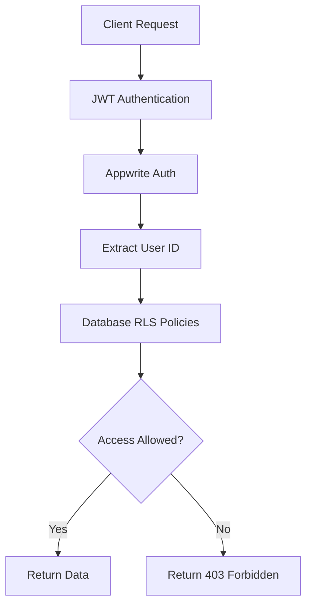
```mermaid
graph TD
A[Client Request] --> B[JWT Authentication]
B --> C[Appwrite Auth]
C --> D[Extract User ID]
D --> E[Database RLS Policies]
E --> F{Access Allowed?}
F --> |Yes| G[Return Data]
F --> |No| H[Return 403 Forbidden]
```

## Appwrite Authentication Integration
The security model is tightly integrated with Appwrite Authentication, which provides the foundation for user identity and session management. When a user authenticates, Appwrite generates a JWT token containing the user's ID and other claims, which is then used to enforce RLS policies at the database level. The authentication flow begins with the `authMiddleware` in the application, which validates the JWT token and extracts user information before allowing requests to proceed to business logic.

The `auth-service.ts` file contains the core authentication logic, including registration, login, and token validation functions. During login, the system verifies credentials with Appwrite Auth and then retrieves the corresponding user record from the public.users table to ensure profile completeness. The JWT token generated by Appwrite contains the user's ID in the `sub` claim, which is accessible to RLS policies through the `auth.uid()` function. This integration creates a seamless security flow where authentication at the application level directly enables authorization at the database level.

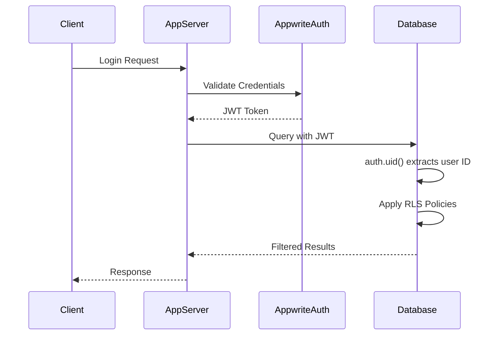
```mermaid
sequenceDiagram
participant Client
participant AppServer
participant AppwriteAuth
participant Database
Client->>AppServer : Login Request
AppServer->>AppwriteAuth : Validate Credentials
AppwriteAuth-->>AppServer : JWT Token
AppServer->>Database : Query with JWT
Database->>Database : auth.uid() extracts user ID
Database->>Database : Apply RLS Policies
Database-->>AppServer : Filtered Results
AppServer-->>Client : Response
```

## RLS Policy Implementation
The RLS policy implementation in FreelanceXchain is comprehensive, covering all data tables with specific policies for each operation type (SELECT, INSERT, UPDATE, DELETE). The `schema.sql` file contains the complete set of RLS policies that define access rules for the application. Policies are created using the `CREATE POLICY` statement with USING expressions that evaluate to true or false based on the current user's identity and the row data.

For user-owned resources like projects, contracts, and payments, policies use the user ID to restrict access. For example, a freelancer can only access contracts where their user ID matches the freelancer_id column. The system also implements public read access for certain data, such as allowing SELECT operations on skill categories and skills for all users, while maintaining restrictions on other operations. Open projects (status = 'open') are also publicly readable to support discovery features while keeping draft and completed projects private.

The policy implementation follows a consistent pattern across tables, with each table having policies for different operations. The USING expression in each policy determines whether a row is accessible, while CHECK expressions (not shown in the current schema) could be used to validate data during INSERT and UPDATE operations. This approach ensures that data access is consistently enforced across the entire application, regardless of the access path.

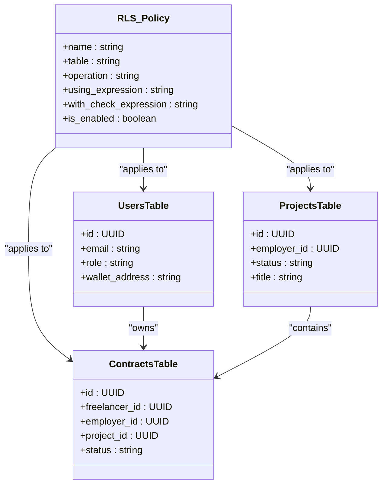
```mermaid
classDiagram
class RLS_Policy {
+name : string
+table : string
+operation : string
+using_expression : string
+with_check_expression : string
+is_enabled : boolean
}
class UsersTable {
+id : UUID
+email : string
+role : string
+wallet_address : string
}
class ContractsTable {
+id : UUID
+freelancer_id : UUID
+employer_id : UUID
+project_id : UUID
+status : string
}
class ProjectsTable {
+id : UUID
+employer_id : UUID
+status : string
+title : string
}
RLS_Policy --> UsersTable : "applies to"
RLS_Policy --> ContractsTable : "applies to"
RLS_Policy --> ProjectsTable : "applies to"
UsersTable --> ContractsTable : "owns"
ProjectsTable --> ContractsTable : "contains"
```

## Service Role Configuration
The system implements a service role bypass mechanism to allow backend operations that require broader data access than individual users. This is achieved through service role policies that grant full access to all tables when the service role is used. The `schema.sql` file contains a series of policies named "Service role full access [table_name]" that use a USING expression of `true`, effectively bypassing RLS restrictions for the service role.

These service role policies are essential for administrative functions, batch operations, and certain business logic that needs to access data across multiple users. The service role is configured with elevated privileges in Appwrite, allowing it to bypass RLS checks while still maintaining audit trails and other security controls. This approach enables the backend application to perform necessary operations without compromising the security model for end users.

The service role configuration follows the principle of least privilege for the backend, where the service role has the minimum necessary permissions to perform its functions. While it has full access to all tables, this access is only used in specific, controlled circumstances within the application code. The separation between user roles and service roles creates a clear security boundary, ensuring that user-level restrictions are maintained while allowing the system to function effectively.

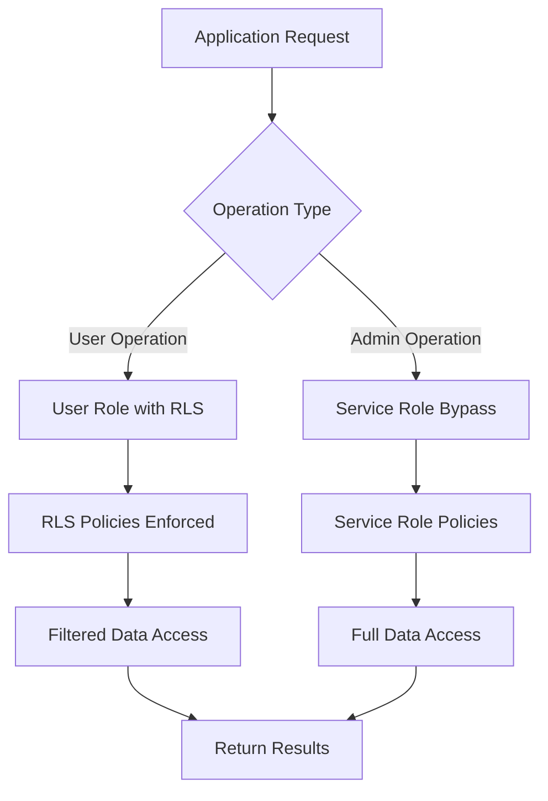
```mermaid
flowchart TD
A[Application Request] --> B{Operation Type}
B --> |User Operation| C[User Role with RLS]
B --> |Admin Operation| D[Service Role Bypass]
C --> E[RLS Policies Enforced]
D --> F[Service Role Policies]
E --> G[Filtered Data Access]
F --> H[Full Data Access]
G --> I[Return Results]
H --> I
```

## Secure Query Examples
The RLS implementation ensures that all database queries are automatically filtered based on the authenticated user's identity. When a user makes a request to access their data, the application uses the Appwrite client with the user's JWT token, and the database automatically applies the relevant RLS policies. For example, when a freelancer requests their contracts, the query in `contract-repository.ts` uses the Appwrite client to fetch records, but the actual results are filtered by the RLS policy on the contracts table.

The repository pattern in the application code works in conjunction with RLS to provide an additional layer of security. While the RLS policies at the database level provide the primary security boundary, the repository methods include explicit filtering by user ID as a defense-in-depth measure. This dual-layer approach ensures security even if one layer fails. For instance, the `getUserContracts` method in `contract-repository.ts` explicitly filters by both freelancer_id and employer_id, reinforcing the RLS policy that performs the same check.

For cross-table queries, such as retrieving a user's projects and associated contracts, the security model ensures that only data owned by or related to the user is returned. The application code in services like `project-service.ts` and `contract-service.ts` constructs queries that respect ownership relationships, while the database RLS policies provide a final verification that no unauthorized data is exposed.

## Access Control Enforcement
Access control in FreelanceXchain is enforced through a combination of database-level RLS policies and application-level authorization checks. The system uses role-based access control (RBAC) with three primary roles: freelancer, employer, and admin. The user's role is stored in the users table and can be used in RLS policies to restrict access based on user type. For example, certain administrative functions may only be available to users with the 'admin' role.

The enforcement mechanism operates on multiple levels to provide defense in depth. At the database level, RLS policies prevent unauthorized access to rows. At the application level, middleware such as `requireRole` in `auth-middleware.ts` enforces role-based access to specific endpoints. This multi-layered approach ensures that even if an attacker bypasses one layer of security, subsequent layers will still prevent unauthorized access.

For sensitive operations like modifying contracts or releasing payments, the system implements additional verification steps. The application code in services like `payment-service.ts` includes explicit checks to ensure that only contract parties can perform certain actions, reinforcing the RLS policies that provide the primary security boundary. This approach ensures that security is not dependent on any single control, creating a robust defense against unauthorized access.

## Debugging and Testing RLS Policies
Debugging and testing RLS policies is critical to ensure the security model functions as intended. During development, policies can be tested by simulating different user contexts and verifying that data access is properly restricted. The Appwrite dashboard provides tools for testing RLS policies, allowing developers to execute queries as different users and observe the results.

For local development and testing, the system can temporarily disable RLS on specific tables to facilitate debugging, though this should never be done in production. Unit tests in the application code verify that repository methods return the expected results for different user roles and data ownership scenarios. Integration tests validate that the complete flow from authentication to data access works correctly and that unauthorized access attempts are properly blocked.

Monitoring and logging are also important for detecting potential security issues. The application logs failed access attempts and other security-relevant events, which can be analyzed to identify potential attacks or policy weaknesses. Regular security audits should include verification of RLS policies to ensure they continue to provide adequate protection as the application evolves.

## Conclusion
The database security model in FreelanceXchain provides a robust foundation for protecting user data through comprehensive Row Level Security implementation. By leveraging Appwrite's RLS capabilities in conjunction with proper authentication and application-level controls, the system ensures that users can only access their own data and data they are authorized to view. The multi-layered approach combining database policies, service role configuration, and application-level authorization creates a defense-in-depth security posture that protects against both accidental and malicious data access.

The implementation demonstrates best practices in database security, including the use of consistent policy patterns, defense-in-depth through multiple security layers, and proper role-based access control. As the application evolves, it is important to maintain this security model by reviewing and updating RLS policies for new tables and features, conducting regular security audits, and ensuring that all data access paths are properly protected.

---

# Security Considerations

## Table of Contents
1. [Introduction](#introduction)
2. [Authentication Mechanisms](#authentication-mechanisms)
3. [Authorization Strategies](#authorization-strategies)
4. [Input Validation Practices](#input-validation-practices)
5. [Appwrite Row Level Security](#appwrite-row-level-security)
6. [Blockchain Security Patterns](#blockchain-security-patterns)
7. [API Security Measures](#api-security-measures)
8. [Data Privacy Considerations](#data-privacy-considerations)
9. [Security Testing Guidelines](#security-testing-guidelines)
10. [Conclusion](#conclusion)

## Introduction
FreelanceXchain implements a comprehensive security framework across multiple layers of the application stack. The system combines traditional web security practices with blockchain-specific protections to ensure data integrity, user privacy, and system reliability. This document details the security architecture, covering authentication, authorization, input validation, database security, blockchain patterns, API protections, and data privacy compliance. The implementation leverages Appwrite for authentication and database security, while incorporating blockchain technology for transparent and immutable operations.

## Authentication Mechanisms

FreelanceXchain employs a robust JWT-based authentication system with token rotation and expiration policies. The authentication flow begins with user registration or login, where credentials are validated before issuing tokens. The system generates two types of JWT tokens: access tokens with a 1-hour expiration and refresh tokens with a 7-day expiration. These tokens are signed with separate secrets for enhanced security, as defined in the environment configuration.

The authentication middleware validates incoming requests by checking for the presence of a Bearer token in the Authorization header. If present, the token is verified against the Appwrite authentication system and the local user database. The system supports both traditional email/password authentication and OAuth flows with providers like Google, GitHub, Azure, and LinkedIn. For OAuth users, the system implements a two-step registration process where new users must select a role (freelancer or employer) after initial authentication.

Password security is enforced through strength validation requiring a minimum of 8 characters with uppercase, lowercase, numeric, and special characters. The system also implements rate limiting on authentication endpoints to prevent brute force attacks, allowing only 10 attempts per 15 minutes per IP address.

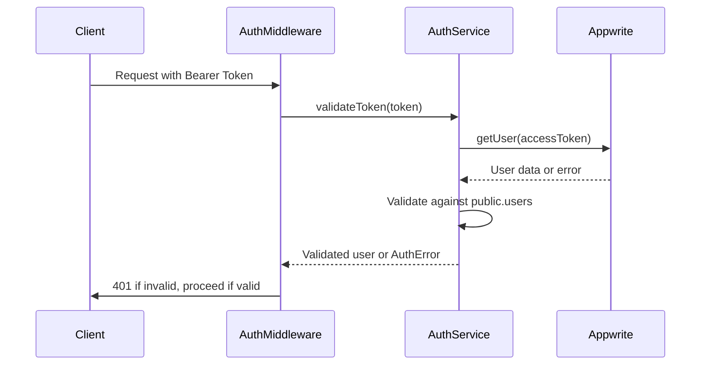
```mermaid
sequenceDiagram
participant Client
participant AuthMiddleware
participant AuthService
participant Appwrite
Client->>AuthMiddleware : Request with Bearer Token
AuthMiddleware->>AuthService : validateToken(token)
AuthService->>Appwrite : getUser(accessToken)
Appwrite-->>AuthService : User data or error
AuthService->>AuthService : Validate against public.users
AuthService-->>AuthMiddleware : Validated user or AuthError
AuthMiddleware->>Client : 401 if invalid, proceed if valid
```

## Authorization Strategies

The authorization system implements role-based access control (RBAC) with distinct permissions for freelancers, employers, and administrators. The RBAC model is enforced through middleware that checks user roles before allowing access to protected routes. The `requireRole` middleware function accepts one or more roles and verifies that the authenticated user possesses at least one of the required roles.

Freelancers have access to profile management, proposal submission, contract viewing, and milestone tracking. Employers can create projects, manage hiring processes, approve milestones, and initiate payments. Administrative functions are restricted to system administrators who can manage user accounts, review KYC verifications, and monitor system operations.

The authorization checks are performed after authentication, ensuring that only authenticated users with appropriate roles can access specific resources. The system returns standardized error responses with appropriate HTTP status codes (401 for unauthenticated requests, 403 for insufficient permissions) to prevent information leakage about protected resources.

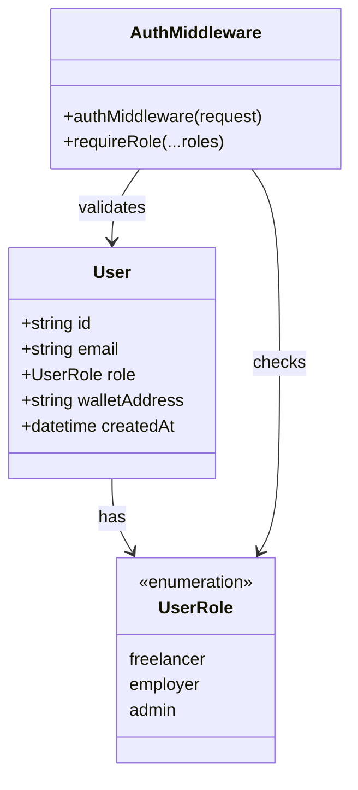
```mermaid
classDiagram
class User {
+string id
+string email
+UserRole role
+string walletAddress
+datetime createdAt
}
class AuthMiddleware {
+authMiddleware(request)
+requireRole(...roles)
}
class UserRole {
<<enumeration>>
freelancer
employer
admin
}
User --> UserRole : has
AuthMiddleware --> User : validates
AuthMiddleware --> UserRole : checks
```

## Input Validation Practices

FreelanceXchain implements comprehensive input validation through middleware to prevent injection attacks and ensure data integrity. The validation system uses JSON schema-based validation for API requests, providing field-specific error reporting. Each validation schema defines type requirements, length constraints, format patterns, and required fields for different endpoints.

The validation middleware processes request bodies, parameters, and query strings according to predefined schemas. For string inputs, the system enforces length limits and validates against regular expression patterns for emails, UUIDs, dates, and URIs. Numeric inputs are validated for minimum and maximum values, while arrays are checked for item count and nested validation rules.

The system includes specific validation schemas for various operations including user registration, profile creation, project submission, and proposal management. These schemas ensure that all incoming data meets the application's requirements before processing. Validation errors are returned with detailed information about which fields failed validation and why, enabling clients to correct their requests.

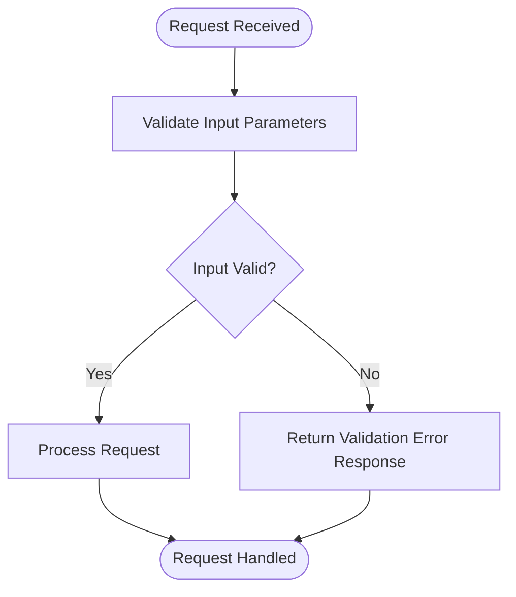
```mermaid
flowchart TD
Start([Request Received]) --> ValidateInput["Validate Input Parameters"]
ValidateInput --> InputValid{"Input Valid?"}
InputValid --> |No| ReturnError["Return Validation Error Response"]
InputValid --> |Yes| ProcessRequest["Process Request"]
ProcessRequest --> End([Request Handled])
ReturnError --> End
```

## Appwrite Row Level Security

The application leverages Appwrite Row Level Security (RLS) to ensure users can only access their own data. RLS policies are implemented at the database level, providing an additional security layer beyond application-level checks. The system uses Appwrite's built-in authentication to identify users and enforce data access rules.

Each table in the database has RLS policies that restrict read and write operations based on the authenticated user's ID. For example, users can only read and update their own profile information, while employers can only access projects they have created. The RLS policies work in conjunction with the application's authorization middleware to provide defense in depth.

The system architecture diagram shows how RLS fits into the overall security layers, operating between the authentication and authorization layers and the database layer. This ensures that even if an attacker bypasses application-level security, they would still be restricted by database-level policies.

```mermaid
graph TB
subgraph "Security Layers"
A[Transport Security: HTTPS/TLS]
B[Authentication: JWT Bearer Tokens]
C[Authorization: Role-Based Access Control]
D[Database Security: Appwrite Row Level Security]
E[Smart Contract Security]
end
A --> B --> C --> D --> E
```

## Blockchain Security Patterns

FreelanceXchain incorporates several blockchain security patterns to protect smart contract operations and ensure transaction integrity. The KYCVerification smart contract implements access control through modifiers like `onlyOwner` and `onlyVerifier`, restricting sensitive operations to authorized addresses. The contract uses enumeration types for verification status and KYC tier to prevent invalid states.

The system implements secure private key management by storing the blockchain private key in environment variables rather than in code. Transaction validation is performed through comprehensive input checks that verify wallet addresses, data hashes, and validity periods before processing. The smart contract includes reentrancy protection through careful ordering of external calls and state updates.

For transaction management, the blockchain client simulates transaction submission, hashing, and confirmation processes. The system generates mock transaction hashes and simulates confirmation after a delay, providing a realistic transaction lifecycle. The client includes functions to poll transaction status until confirmation or failure, ensuring reliable transaction processing.

```mermaid
sequenceDiagram
participant User
participant Frontend
participant Backend
participant Blockchain
User->>Frontend : Submit KYC Verification
Frontend->>Backend : submitVerification(wallet, userId, dataHash)
Backend->>Blockchain : Call submitVerification on KYCVerification contract
Blockchain-->>Backend : Transaction hash
Backend->>Backend : Store transaction
Backend->>Frontend : Transaction submitted
loop Poll for confirmation
Backend->>Blockchain : Check transaction status
end
Blockchain-->>Backend : Transaction confirmed
Backend->>Backend : Update verification status
```

## API Security Measures

The API implements multiple security measures to protect against common web vulnerabilities. The system uses helmet.js to set security-related HTTP headers, including Content Security Policy (CSP), XSS protection, HSTS, and frameguard. The CSP configuration allows necessary resources while preventing inline scripts and unauthorized connections.

Rate limiting is implemented on authentication and sensitive endpoints to prevent abuse. The authentication endpoints are limited to 10 attempts per 15 minutes, while general API endpoints allow 100 requests per minute. Sensitive operations have stricter limits of 5 attempts per hour to prevent brute force attacks on critical functionality.

CORS configuration is managed through environment variables, allowing specification of permitted origins. The system supports wildcard subdomains and defaults to localhost origins in development mode. HTTPS enforcement middleware redirects HTTP requests to HTTPS in production environments, ensuring encrypted communication.

Request ID generation provides traceability for debugging and monitoring, with each request receiving a unique identifier that is included in all responses and logs.

```mermaid
flowchart TD
A[Incoming Request] --> B{Production?}
B --> |Yes| C[Check HTTPS]
B --> |No| D[Process Request]
C --> |HTTP| E[Redirect to HTTPS]
C --> |HTTPS| D
D --> F[Generate Request ID]
F --> G[Apply Security Headers]
G --> H[Rate Limiting Check]
H --> |Within Limits| I[Process Request]
H --> |Exceeded| J[Return 429]
```

## Data Privacy Considerations

FreelanceXchain addresses data privacy through careful handling of KYC information and compliance with GDPR principles. The system stores personal data in encrypted form and implements strict access controls to limit who can view sensitive information. KYC data is stored off-chain in the Appwrite database with access restricted to authorized personnel.

The blockchain implementation follows a privacy-preserving approach by storing only verification status and data hashes on-chain, rather than personal information. This design ensures transparency and immutability while protecting user privacy. The KYCVerification contract explicitly notes that it stores "proof without revealing data" to maintain GDPR compliance.

The system includes mechanisms for data subject rights, including the ability to access personal data and request deletion. User data is associated with UUIDs rather than personally identifiable information where possible, and all data processing activities are logged for audit purposes.

Data minimization principles are applied throughout the system, collecting only information necessary for the platform's functionality. The KYC process collects tiered information based on verification level, with enhanced verification requiring more detailed information than basic verification.

## Security Testing Guidelines

The system includes comprehensive security testing guidelines to prevent common vulnerabilities. The codebase should be tested for injection attacks by validating all input validation rules and ensuring proper escaping of special characters. Authentication and authorization flows should be tested for bypass vulnerabilities by attempting to access protected resources with invalid or missing credentials.

Smart contract security testing should focus on reentrancy attacks, integer overflow/underflow, and access control bypasses. The KYCVerification contract should be tested to ensure that only authorized addresses can approve or reject verifications. Transaction validation should be tested with malformed data to verify proper error handling.

API security testing should include attempts to bypass rate limiting, exploit CORS misconfigurations, and manipulate security headers. The system should be tested for sensitive data exposure by examining responses for unintended information disclosure.

The application includes functions for clearing test data and resetting the blockchain state, facilitating repeatable security testing. These functions should only be available in development environments and never exposed in production.

## Conclusion

FreelanceXchain implements a multi-layered security approach that combines traditional web security practices with blockchain-specific protections. The system's authentication mechanism uses JWT tokens with appropriate expiration policies and rate limiting to prevent abuse. Authorization is enforced through role-based access control, ensuring users can only perform actions appropriate to their role.

Input validation is comprehensive, using JSON schemas to validate all incoming data and prevent injection attacks. Database security is enhanced through Appwrite Row Level Security, providing an additional layer of protection for user data. The blockchain implementation follows security best practices with access controls, input validation, and privacy-preserving design.

API security is strengthened through helmet.js protections, rate limiting, CORS configuration, and HTTPS enforcement. Data privacy is prioritized through careful handling of KYC information and GDPR compliance. The system provides clear guidelines for security testing to identify and prevent common vulnerabilities.

This comprehensive security framework ensures that FreelanceXchain protects user data, maintains system integrity, and provides a trustworthy platform for freelance transactions.

---

# Data Privacy & KYC Protection

## Table of Contents
1. [Introduction](#introduction)
2. [Didit KYC Integration](#didit-kyc-integration)
3. [Data Minimization Principle](#data-minimization-principle)
4. [GDPR Compliance Measures](#gdpr-compliance-measures)
5. [Webhook Security](#webhook-security)
6. [API Endpoints](#api-endpoints)
7. [Database Schema](#database-schema)
8. [System Architecture](#system-architecture)

## Introduction

FreelanceXchain uses [Didit](https://didit.me) for enterprise-grade KYC (Know Your Customer) verification. Didit provides professional identity verification with support for 220+ countries.

**Key Principle**: Didit handles ALL verification data (documents, liveness, face match, IP analysis). We only store session info and the final decision locally.

## Didit KYC Integration

### Overview

Didit provides a hosted verification page where users complete identity verification. The backend creates sessions via API and receives results through webhooks.

### Environment Configuration

```bash
# Didit KYC Configuration
DIDIT_API_KEY=your-didit-api-key
DIDIT_API_URL=https://verification.didit.me
DIDIT_WEBHOOK_SECRET=your-didit-webhook-secret-key
DIDIT_WORKFLOW_ID=your-didit-workflow-id
```

### Workflow

```mermaid
sequenceDiagram
    participant User
    participant Frontend
    participant Backend
    participant Didit
    participant Database

    User->>Frontend: Request KYC Verification
    Frontend->>Backend: POST /api/kyc/initiate
    Backend->>Didit: Create Session
    Didit-->>Backend: Session URL + ID
    Backend->>Database: Store Session Info
    Backend-->>Frontend: Return Session URL
    Frontend-->>User: Redirect to Didit

    User->>Didit: Complete Verification
    Didit->>Backend: Webhook (session.completed)
    Backend->>Database: Update Status & Decision
    
    User->>Frontend: Check Status
    Frontend->>Backend: GET /api/kyc/status
    Backend->>Database: Query Status
    Backend-->>Frontend: Return Status
    Frontend-->>User: Display Result
```

### Verification Features (Handled by Didit)

| Feature | Description |
|---------|-------------|
| **ID Verification** | Document verification for passports, national IDs, driver's licenses (220+ countries) |
| **Passive Liveness** | Anti-spoofing technology with no user interaction required |
| **Face Match 1:1** | Compares selfie to document photo with similarity scoring |
| **IP Analysis** | Geolocation, VPN/Proxy detection, risk scoring |

All verification data is processed and stored by Didit. We only receive the final decision.

## Data Minimization Principle

FreelanceXchain follows strict data minimization:

### What We Store

| Field | Purpose |
|-------|---------|
| `didit_session_id` | Link to Didit session |
| `didit_session_url` | Redirect URL for user |
| `status` | Current verification status |
| `decision` | Final decision (approved/declined/review) |
| `reviewed_by`, `reviewed_at`, `admin_notes` | Admin review tracking |

### What Didit Handles (NOT stored locally)

- Document images (front/back)
- Selfie images
- Raw biometric data
- Personal information (name, DOB, nationality)
- Document details (type, number, issuing country)
- Liveness detection results
- Face match scores
- IP analysis data

This approach ensures:
1. **Minimal data exposure** - Sensitive data stays with Didit
2. **Reduced compliance burden** - Didit handles PII storage
3. **Simplified architecture** - Less data to secure locally

## GDPR Compliance Measures

### User Rights Implementation

| Right | Implementation |
|-------|----------------|
| **Right to Access** | `GET /api/kyc/status` returns user's verification status |
| **Right to Erasure** | Admin can delete verification records; Didit handles PII deletion |
| **Right to Portability** | `GET /api/kyc/history` exports verification history |
| **Consent** | Explicit consent required before initiating verification |

### Data Retention

- **Approved Verifications**: Retained for 1 year from approval date (`expires_at`)
- **Rejected Verifications**: Retained for 90 days for dispute resolution
- **Expired Sessions**: Automatically cleaned up after 30 days

## Webhook Security

### HMAC-SHA256 Signature Verification

All webhooks from Didit are verified using HMAC-SHA256:

```typescript
import crypto from 'crypto';

function verifyWebhookSignature(payload: string, signature: string): boolean {
  const secret = process.env.DIDIT_WEBHOOK_SECRET;
  const expectedSignature = crypto
    .createHmac('sha256', secret)
    .update(payload)
    .digest('hex');
  
  return crypto.timingSafeEqual(
    Buffer.from(signature),
    Buffer.from(expectedSignature)
  );
}
```

### Webhook Endpoint Security

- Signature verification required
- Rate limiting applied
- Idempotency handling for duplicate webhooks

## API Endpoints

### User Endpoints

| Method | Endpoint | Description |
|--------|----------|-------------|
| `POST` | `/api/kyc/initiate` | Start verification, get session URL |
| `GET` | `/api/kyc/status` | Get current verification status |
| `GET` | `/api/kyc/verified` | Check if user is verified |
| `GET` | `/api/kyc/history` | Get verification history |
| `POST` | `/api/kyc/refresh/:id` | Manually refresh status from Didit |

### Admin Endpoints

| Method | Endpoint | Description |
|--------|----------|-------------|
| `GET` | `/api/kyc/admin/pending` | Get pending reviews |
| `GET` | `/api/kyc/admin/status/:status` | Get verifications by status |
| `POST` | `/api/kyc/admin/review/:id` | Approve/reject verification |
| `GET` | `/api/kyc/admin/verification/:id` | Get verification details |

### Webhook Endpoint

| Method | Endpoint | Description |
|--------|----------|-------------|
| `POST` | `/api/kyc/webhook` | Receive Didit status updates |

### Example: Initiate Verification

```bash
curl -X POST http://localhost:7860/api/kyc/initiate \
  -H "Authorization: Bearer {token}" \
  -H "Content-Type: application/json" \
  -d '{
    "contact_details": {
      "email": "[email protected]"
    }
  }'
```

Response:
```json
{
  "id": "uuid",
  "user_id": "uuid",
  "status": "pending",
  "didit_session_url": "https://verify.didit.me/session/token",
  "created_at": "2026-01-15T10:00:00Z"
}
```

## Database Schema

### Table: `kyc_verifications`

```sql
CREATE TABLE kyc_verifications (
    id UUID PRIMARY KEY DEFAULT gen_random_uuid(),
    user_id UUID NOT NULL REFERENCES users(id) ON DELETE CASCADE,
    status VARCHAR(20) NOT NULL CHECK (status IN (
        'pending', 'in_progress', 'completed', 
        'approved', 'rejected', 'expired'
    )),
    
    -- Didit Session (all we need to store)
    didit_session_id VARCHAR(255) UNIQUE NOT NULL,
    didit_session_token VARCHAR(255) NOT NULL,
    didit_session_url TEXT NOT NULL,
    didit_workflow_id VARCHAR(255) NOT NULL,
    
    -- Decision from Didit
    decision VARCHAR(20) CHECK (decision IN ('approved', 'declined', 'review')),
    
    -- Admin Review
    reviewed_by UUID REFERENCES users(id),
    reviewed_at TIMESTAMPTZ,
    admin_notes TEXT,
    
    -- Timestamps
    created_at TIMESTAMPTZ DEFAULT NOW(),
    updated_at TIMESTAMPTZ DEFAULT NOW(),
    completed_at TIMESTAMPTZ,
    expires_at TIMESTAMPTZ
);

-- Indexes
CREATE INDEX idx_kyc_user_id ON kyc_verifications(user_id);
CREATE INDEX idx_kyc_status ON kyc_verifications(status);
CREATE INDEX idx_kyc_didit_session_id ON kyc_verifications(didit_session_id);
CREATE INDEX idx_kyc_pending_review ON kyc_verifications(status, reviewed_by) 
    WHERE status = 'completed' AND reviewed_by IS NULL;
```

### Row Level Security

```sql
-- Users can only see their own verifications
CREATE POLICY "Users can view own KYC" ON kyc_verifications
    FOR SELECT USING (auth.uid() = user_id);

-- Only service role can insert/update
CREATE POLICY "Service role full access" ON kyc_verifications
    FOR ALL USING (auth.role() = 'service_role');
```

## System Architecture

```mermaid
graph TD
    subgraph "Client Layer"
        A[Web App] --> B[API Gateway]
        M[Mobile App] --> B
    end
    
    subgraph "API Layer"
        B --> C[Auth Middleware]
        C --> D[KYC Routes]
        D --> E[KYC Service]
    end
    
    subgraph "Service Layer"
        E --> F[Didit Client]
        E --> G[KYC Repository]
    end
    
    subgraph "External Services"
        F --> H[Didit API]
        H --> I[Webhook Handler]
        I --> E
    end
    
    subgraph "Data Layer"
        G --> J[(Appwrite)]
        H --> K[(Didit Storage)]
    end
    
    style A fill:#4CAF50
    style M fill:#4CAF50
    style H fill:#2196F3
    style J fill:#FF9800
    style K fill:#2196F3
```

### File Structure

```
src/
├── models/
│   └── didit-kyc.ts              # Type definitions
├── services/
│   ├── didit-client.ts           # Didit API client
│   └── didit-kyc-service.ts      # Business logic
├── repositories/
│   └── didit-kyc-repository.ts   # Database operations
└── routes/
    └── didit-kyc-routes.ts       # API endpoints

appwrite/
└── migrations/
    └── 003_didit_kyc_verifications.sql
```

## Quick Reference

### Status Values

| Status | Description |
|--------|-------------|
| `pending` | Session created, user hasn't started |
| `in_progress` | User is completing verification |
| `completed` | Verification done, awaiting admin review |
| `approved` | Admin approved, user is verified |
| `rejected` | Admin rejected or Didit declined |
| `expired` | Session expired without completion |

### Decision Values (from Didit)

| Decision | Description |
|----------|-------------|
| `approved` | All checks passed |
| `declined` | Failed verification checks |
| `review` | Needs manual review |

## Support Resources

- **Didit Documentation**: https://docs.didit.me
- **API Reference**: https://docs.didit.me/reference/
- **Business Console**: https://business.didit.me

---

# Role-Based Access Control

## Table of Contents
1. [Introduction](#introduction)
2. [Three-Tier Role Model](#three-tier-role-model)
3. [Role Assignment During Registration](#role-assignment-during-registration)
4. [JWT Token Authentication and Role Extraction](#jwt-token-authentication-and-role-extraction)
5. [Route-Level Authorization Checks](#route-level-authorization-checks)
6. [Middleware Integration](#middleware-integration)
7. [Permitted and Restricted Operations](#permitted-and-restricted-operations)
8. [Admin Privileges and Escalation Paths](#admin-privileges-and-escalation-paths)
9. [Common Issues and Security Considerations](#common-issues-and-security-considerations)
10. [Conclusion](#conclusion)

## Introduction
The FreelanceXchain platform implements a robust role-based access control (RBAC) system to ensure secure and appropriate access to its features. This system is built around a three-tier role model: Freelancer, Employer, and Admin. Each role has distinct permissions that govern what actions a user can perform within the application. The RBAC system is enforced through JWT token authentication, where user roles are extracted from tokens during the authentication process and validated against route-level authorization checks. This documentation provides a comprehensive overview of the RBAC implementation, detailing how roles are assigned, how permissions are enforced, and the specific operations allowed or restricted for each role.

## Three-Tier Role Model
The FreelanceXchain platform employs a three-tier role model to manage user permissions and access levels. The roles are defined as 'freelancer', 'employer', and 'admin', each with specific capabilities and responsibilities within the system. Freelancers can access proposals, manage their contracts, and maintain their profiles. Employers have the ability to create projects, hire freelancers, and manage payments. Admins possess full system access, including the ability to resolve disputes and manage platform-wide settings. This hierarchical structure ensures that users can only perform actions appropriate to their role, maintaining the integrity and security of the platform.

```mermaid
graph TD
A[User Roles] --> B[Freelancer]
A --> C[Employer]
A --> D[Admin]
B --> E[Access Proposals]
B --> F[Manage Contracts]
B --> G[Profile Management]
C --> H[Create Projects]
C --> I[Hire Freelancers]
C --> J[Manage Payments]
D --> K[Full System Access]
D --> L[Dispute Resolution]
D --> M[Skill Management]
```

## Role Assignment During Registration
User roles are assigned during the registration process, where new users must select their role as either 'freelancer' or 'employer'. This selection is a required field in the registration input, ensuring that every user has a defined role upon account creation. The role is stored in the user's metadata within the Appwrite Auth system and in the public.users table in the database. Admin roles are not available for self-selection during registration and are typically assigned manually by existing admins or through administrative processes. This approach ensures that role assignment is intentional and controlled, preventing unauthorized access to privileged operations.

## JWT Token Authentication and Role Extraction
The RBAC system in FreelanceXchain relies on JWT token authentication to verify user identities and extract their roles. During the authentication process, when a user logs in or registers, a JWT token is generated that includes the user's role as part of the payload. This token is validated by the `authMiddleware` function, which decodes the token and extracts the user's role. The extracted role is then attached to the request object, making it available for subsequent authorization checks. This mechanism ensures that every request to the API can be authenticated and that the user's role is readily accessible for enforcing access controls.

```mermaid
sequenceDiagram
participant Client
participant AuthService
participant AuthMiddleware
participant APIRoute
Client->>AuthService : Login/Register Request
AuthService->>AuthService : Validate Credentials
AuthService->>AuthService : Generate JWT with Role
AuthService->>Client : Return JWT Token
Client->>APIRoute : API Request with JWT
APIRoute->>AuthMiddleware : Verify JWT and Extract Role
AuthMiddleware->>APIRoute : Attach User Role to Request
APIRoute->>APIRoute : Process Request Based on Role
```

## Route-Level Authorization Checks
Route-level authorization checks are implemented to enforce role-based access to specific API endpoints. The `requireRole` middleware function is used to restrict access to routes based on the user's role. This function checks the role attached to the request object by the `authMiddleware` and compares it against the roles specified for the route. If the user's role does not match any of the required roles, a 403 Forbidden error is returned. This approach ensures that only users with the appropriate roles can access sensitive or privileged operations, providing a granular level of control over API access.

```mermaid
flowchart TD
A[Incoming Request] --> B{Has Valid JWT?}
B --> |No| C[Return 401 Unauthorized]
B --> |Yes| D[Extract User Role from JWT]
D --> E{Role Matches Required?}
E --> |No| F[Return 403 Forbidden]
E --> |Yes| G[Process Request]
G --> H[Return Response]
```

## Middleware Integration
The RBAC system is integrated into the application through middleware functions that handle authentication and authorization. The `authMiddleware` function is responsible for validating JWT tokens and extracting user information, including the role. This middleware is applied to all protected routes to ensure that only authenticated users can access them. The `requireRole` function is a higher-order middleware that adds role-based authorization to routes by checking the user's role against a list of permitted roles. These middleware functions are seamlessly integrated into the Express.js routing system, providing a clean and reusable way to enforce access controls across the application.

## Permitted and Restricted Operations
Each role in the FreelanceXchain platform has specific permitted and restricted operations that define their capabilities. Freelancers are permitted to create and manage their profiles, submit proposals, and work on contracts, but they are restricted from creating projects or managing payments. Employers can create projects, hire freelancers, and manage payments, but they lack the ability to resolve disputes or access administrative functions. Admins have full access to all system features, including dispute resolution and skill management. This clear delineation of permissions ensures that users can only perform actions that are appropriate to their role, maintaining the security and integrity of the platform.

```mermaid
erDiagram
USER ||--o{ ROLE : has
ROLE ||--o{ PERMISSION : defines
USER {
string id PK
string email
string role FK
}
ROLE {
string name PK
string description
}
PERMISSION {
string id PK
string role FK
string operation
boolean allowed
}
ROLE }|--|| PERMISSION : "has many"
```

## Admin Privileges and Escalation Paths
Admins in the FreelanceXchain platform have elevated privileges that allow them to perform critical system operations. These include resolving disputes, managing the skill taxonomy, and accessing all system data. Admins can resolve disputes by reviewing evidence and making decisions that affect payment releases. They can also create and deprecate skills, ensuring that the platform's skill categories remain relevant and up-to-date. Escalation paths for users to gain admin privileges are not available through self-service and require manual intervention by existing admins, ensuring that administrative access is tightly controlled and secure.

## Common Issues and Security Considerations
Common issues in the RBAC system include privilege misalignment and token tampering. Privilege misalignment can occur if a user's role is incorrectly assigned or updated, leading to unauthorized access or restricted functionality. This can be mitigated by rigorous validation during role assignment and regular audits of user roles. Token tampering is a security concern where an attacker attempts to modify a JWT token to gain elevated privileges. This is prevented by using strong cryptographic signatures for tokens and validating them on every request. Additionally, the use of Appwrite's service role policies ensures that backend operations can bypass row-level security when necessary, while still maintaining overall system security.

## Conclusion
The role-based access control system in FreelanceXchain effectively manages user permissions through a well-defined three-tier role model. By leveraging JWT token authentication and middleware-based authorization checks, the system ensures that users can only access features appropriate to their role. The clear separation of permissions between freelancers, employers, and admins maintains the security and integrity of the platform, while the integration of middleware functions provides a scalable and maintainable approach to access control. Addressing common issues such as privilege misalignment and token tampering further strengthens the system's security, making it a robust foundation for the FreelanceXchain platform.

---

# Smart Contract Security

## Table of Contents
1. [Introduction](#introduction)
2. [Reentrancy Protection](#reentrancy-protection)
3. [Access Control Mechanisms](#access-control-mechanisms)
4. [Input Validation and State Checks](#input-validation-and-state-checks)
5. [Secure Transaction Patterns](#secure-transaction-patterns)
6. [Payment Security Patterns](#payment-security-patterns)
7. [Contract Upgrade and Ownership](#contract-upgrade-and-ownership)
8. [External Oracle Interactions](#external-oracle-interactions)
9. [Testing Strategies](#testing-strategies)
10. [Conclusion](#conclusion)

## Introduction

The FreelanceXchain platform implements a comprehensive security framework across its smart contract ecosystem to ensure the integrity, safety, and reliability of freelance marketplace operations. This documentation details the security patterns employed in the platform's core contracts, focusing on protection against common vulnerabilities such as reentrancy attacks, unauthorized access, and arithmetic overflows. The security architecture combines Solidity best practices with comprehensive testing methodologies to create a robust decentralized application.

The platform's security model is built around several key principles: prevention of recursive call attacks through reentrancy guards, strict access control via custom modifiers, comprehensive input validation, and implementation of secure transaction patterns. These measures work in concert to protect user funds and ensure the correct execution of business logic across all contract interactions.

## Reentrancy Protection

The FreelanceEscrow contract implements a manual reentrancy guard to prevent recursive call attacks during fund withdrawal operations. This protection is critical for preventing malicious contracts from repeatedly calling withdrawal functions before state updates are completed.

The reentrancy guard is implemented using a state variable `_status` with two constant values: `NOT_ENTERED` (1) and `ENTERED` (2). Before executing any sensitive operation, the `nonReentrant` modifier checks that the contract is not already in the `ENTERED` state. If the check passes, the status is set to `ENTERED` before the function executes and reset to `NOT_ENTERED` after completion.

This pattern is applied to all payment-related functions including `approveMilestone`, `resolveDispute`, `refundMilestone`, and `cancelContract`. By following the checks-effects-interactions pattern, the contract ensures that all state changes are completed before any external calls are made, eliminating the window for reentrancy attacks.

```mermaid
flowchart TD
Start([Function Entry]) --> CheckReentrancy["Check _status != ENTERED"]
CheckReentrancy --> |Pass| SetEntered["Set _status = ENTERED"]
SetEntered --> ExecuteLogic["Execute Function Logic"]
ExecuteLogic --> ExternalCall["Make External Call"]
ExternalCall --> ResetStatus["Set _status = NOT_ENTERED"]
ResetStatus --> End([Function Exit])
CheckReentrancy --> |Fail| Revert["Revert: Reentrancy Guard"]
Revert --> End
```

## Access Control Mechanisms

The FreelanceXchain contracts implement a comprehensive access control system using custom modifiers to enforce role-based privileges. These modifiers ensure that only authorized parties can execute specific functions, preventing unauthorized access to sensitive operations.

The primary access control modifiers include:
- `onlyEmployer`: Restricts function access to the employer address
- `onlyFreelancer`: Restricts function access to the freelancer address  
- `onlyArbiter`: Restricts function access to the dispute arbiter
- `onlyParties`: Allows access to either the employer or freelancer
- `contractActive`: Ensures the contract is in an active state

These modifiers are implemented using require statements that validate the `msg.sender` against the appropriate role address. For example, the `onlyEmployer` modifier ensures that only the employer can approve milestones or cancel the contract, while the `onlyFreelancer` modifier restricts milestone submission to the freelancer.

Additional contracts extend this pattern with their own access controls. The ContractAgreement contract uses `onlyOwner` and `onlyParty` modifiers, while the KYCVerification contract implements `onlyOwner` and `onlyVerifier` modifiers to control access to verification functions.

```mermaid
classDiagram
class FreelanceEscrow {
+employer : address
+freelancer : address
+arbiter : address
+onlyEmployer()
+onlyFreelancer()
+onlyArbiter()
+onlyParties()
+contractActive()
}
class ContractAgreement {
+owner : address
+onlyOwner()
+onlyParty()
}
class KYCVerification {
+owner : address
+verifier : address
+onlyOwner()
+onlyVerifier()
}
FreelanceEscrow --> ContractAgreement : "uses"
FreelanceEscrow --> KYCVerification : "interacts with"
```

## Input Validation and State Checks

The FreelanceXchain contracts implement comprehensive input validation and state checks to prevent malformed data processing and ensure the integrity of contract operations. These validations occur at multiple levels, from basic parameter checks to complex business logic validations.

Input validation is performed using require statements that check for various conditions before executing function logic. For example, the FreelanceEscrow constructor validates that the freelancer address is not zero, that there is at least one milestone, and that the milestone amounts and descriptions arrays have matching lengths.

State checks ensure that operations are only performed when the contract is in an appropriate state. The `contractActive` modifier prevents operations on cancelled contracts, while milestone-specific functions check that milestones are in the correct status (e.g., only submitted milestones can be approved).

Additional validation patterns include:
- Array bounds checking for milestone indices
- Sufficient balance verification before transfers
- Duplicate prevention through status checks
- Arithmetic overflow protection via Solidity 0.8+ built-in checks

These validation mechanisms work together to create a robust defense against both accidental errors and malicious attempts to exploit contract vulnerabilities.

```mermaid
flowchart TD
Start([Function Entry]) --> ValidateInputs["Validate Input Parameters"]
ValidateInputs --> CheckState["Check Contract/Milestone State"]
CheckState --> |Valid| ExecuteLogic["Execute Business Logic"]
CheckState --> |Invalid| Revert["Revert with Error Message"]
ExecuteLogic --> UpdateState["Update Contract State"]
UpdateState --> ExternalCall["Make External Calls"]
ExternalCall --> EmitEvents["Emit Events"]
EmitEvents --> End([Function Exit])
```

## Secure Transaction Patterns

The FreelanceXchain contracts follow established secure transaction patterns to ensure the reliability and safety of all operations. The primary pattern implemented is the checks-effects-interactions pattern, which structures functions to minimize the risk of vulnerabilities.

In the checks-effects-interactions pattern, functions are organized into three distinct phases:
1. **Checks**: Validate all preconditions and inputs
2. **Effects**: Update contract state variables
3. **Interactions**: Make external calls to other contracts or addresses

This ordering is critical for preventing reentrancy attacks and ensuring that state changes are completed before any external interactions occur. For example, in the `approveMilestone` function, the contract first checks that the milestone is submitted, then updates the released amount, and finally makes the external call to transfer funds to the freelancer.

The contracts also implement proper error handling using require statements that provide descriptive error messages. These messages help users and developers understand why a transaction failed, facilitating debugging and improving user experience.

Additionally, the contracts use events extensively to provide external visibility into state changes. Events such as `FundsDeposited`, `MilestoneApproved`, and `ContractCompleted` allow off-chain systems to monitor contract activity and update their state accordingly.

```mermaid
sequenceDiagram
participant Frontend
participant Contract
participant External
Frontend->>Contract : Call approveMilestone()
Contract->>Contract : 1. Checks : Validate inputs and state
Contract->>Contract : 2. Effects : Update releasedAmount
Contract->>External : 3. Interactions : Transfer funds
External-->>Contract : Success/Failure
Contract->>Contract : Emit MilestoneApproved
Contract-->>Frontend : Return result
```

## Payment Security Patterns

The FreelanceXchain platform implements the pull-over-push payment pattern in its escrow system to minimize fund exposure and enhance security. This pattern requires recipients to actively claim their payments rather than having funds automatically pushed to them.

In the FreelanceEscrow contract, when an employer approves a milestone, the funds are not immediately transferred. Instead, the milestone status is updated to "Approved" and the released amount is recorded. The actual fund transfer occurs when the contract makes an external call to send ETH to the freelancer's address.

This approach provides several security benefits:
- Reduces the attack surface by limiting external calls
- Prevents forced transfer attacks where malicious contracts reject incoming ETH
- Gives recipients control over when they receive funds
- Enables better error handling and recovery

The contract also implements a refund mechanism that allows employers to refund pending milestones and cancel contracts to recover remaining funds. These functions include appropriate access controls and state checks to prevent unauthorized withdrawals.

The pull-over-push pattern is complemented by the reentrancy guard and checks-effects-interactions pattern to create a comprehensive security framework for all payment operations.

```mermaid
flowchart TD
Employer --> |Approves| Escrow["Escrow Contract"]
Escrow --> |Updates State| Milestone["Milestone Status: Approved"]
Escrow --> |External Call| Freelancer["Freelancer Address"]
Freelancer --> |Receives| Funds["ETH Transfer"]
Escrow --> |Emits| Event["MilestoneApproved Event"]
style Escrow fill:#f9f,stroke:#333
style Freelancer fill:#bbf,stroke:#333
```

## Contract Upgrade and Ownership

The FreelanceXchain contracts implement ownership management patterns to control administrative functions while maintaining security. Each contract has an owner address that can perform specific administrative tasks, with ownership typically assigned to the deployer address.

The ownership pattern is implemented through the `onlyOwner` modifier, which restricts access to certain functions to the contract owner. This pattern is used consistently across multiple contracts including ContractAgreement, DisputeResolution, and KYCVerification.

For critical operations like ownership transfer, contracts implement safe transfer patterns that emit events to provide transparency. The KYCVerification contract, for example, includes a `transferOwnership` function that updates the owner address and emits an `OwnershipTransferred` event.

The platform follows a non-upgradable contract design for core financial contracts like FreelanceEscrow, ensuring that the logic cannot be changed after deployment. This approach prioritizes security and predictability over flexibility, as users can be confident that the contract behavior will not change.

For contracts that require updates, the platform could implement a proxy pattern in future versions, but the current implementation focuses on immutable contracts for maximum security.

```mermaid
classDiagram
class Ownable {
+owner : address
+onlyOwner()
+transferOwnership(newOwner)
}
class ContractAgreement {
+owner : address
+onlyOwner()
}
class KYCVerification {
+owner : address
+verifier : address
+onlyOwner()
+setVerifier()
+transferOwnership()
}
Ownable <|-- ContractAgreement
Ownable <|-- KYCVerification
ContractAgreement --> KYCVerification : "interacts with"
```

## External Oracle Interactions

The FreelanceXchain platform is designed to interact securely with external oracles and services while minimizing trust assumptions. The KYCVerification contract exemplifies this approach by storing only verification status and data hashes on-chain, keeping sensitive personal information off-chain.

The contract uses a hash-based verification system where the actual KYC data remains off-chain, and only its cryptographic hash is stored on-chain. This approach provides proof of data integrity without exposing sensitive information, complying with privacy regulations like GDPR.

For oracle interactions, the platform follows the check-and-send pattern, where contract functions validate the oracle's response before acting on it. The DisputeResolution contract, for example, records dispute outcomes on-chain but relies on off-chain arbitration processes.

The system also implements expiration mechanisms for time-sensitive data. The KYCVerification contract includes expiration timestamps and a function to mark verifications as expired, ensuring that outdated information is not considered valid.

These patterns ensure that the platform can leverage external services while maintaining the security and integrity of on-chain operations.

```mermaid
flowchart LR
OffChain["Off-Chain KYC Data"] --> |Hash Function| Hash["Data Hash"]
Hash --> OnChain["On-Chain Storage"]
Verification["Verification Request"] --> KYCContract["KYCVerification Contract"]
KYCContract --> |Stores| Hash
KYCContract --> |Emits| Event["VerificationSubmitted"]
Oracle["External Oracle"] --> |Provides| Result["Verification Result"]
KYCContract --> |Updates| Status["Verification Status"]
style OnChain fill:#f9f,stroke:#333
style KYCContract fill:#f9f,stroke:#333
```

## Testing Strategies

The FreelanceXchain platform employs a comprehensive testing strategy using Hardhat to verify contract security and functionality. The testing framework includes unit tests, integration tests, and specific security tests for vulnerabilities like reentrancy attacks.

The Hardhat configuration supports multiple networks including local development (hardhat), Ganache, Sepolia testnet, and Polygon networks. This allows for thorough testing across different environments before mainnet deployment.

Security tests specifically target known vulnerabilities:
- Reentrancy attack simulations
- Access control enforcement
- Input validation edge cases
- State transition correctness
- Fallback function behavior

The test-workflow.cjs script demonstrates a complete end-to-end test of the core functionality, including milestone submission, approval, payment release, and reputation scoring. This integration test verifies that multiple contracts work together correctly.

The testing strategy also includes property-based testing using fast-check to generate random inputs and test edge cases that might not be caught by traditional unit tests.

```mermaid
graph TB
TestFramework["Hardhat Test Framework"] --> UnitTests["Unit Tests"]
TestFramework --> IntegrationTests["Integration Tests"]
TestFramework --> SecurityTests["Security Tests"]
SecurityTests --> Reentrancy["Reentrancy Attack Tests"]
SecurityTests --> AccessControl["Access Control Tests"]
SecurityTests --> InputValidation["Input Validation Tests"]
UnitTests --> ContractAgreement["ContractAgreement Tests"]
UnitTests --> FreelanceEscrow["FreelanceEscrow Tests"]
UnitTests --> FreelanceReputation["FreelanceReputation Tests"]
IntegrationTests --> Workflow["End-to-End Workflow Tests"]
IntegrationTests --> CrossContract["Cross-Contract Interaction Tests"]
style TestFramework fill:#f96,stroke:#333
style SecurityTests fill:#f96,stroke:#333
```

## Conclusion

The FreelanceXchain platform implements a robust security framework across its smart contract ecosystem, addressing key vulnerabilities through a combination of technical patterns and comprehensive testing. The reentrancy guard in the FreelanceEscrow contract effectively prevents recursive call attacks during fund withdrawals, while custom access control modifiers ensure that only authorized parties can execute sensitive operations.

The platform follows security best practices including input validation, state checks, and the checks-effects-interactions pattern to prevent common vulnerabilities. The pull-over-push payment pattern minimizes fund exposure, and ownership management provides controlled administrative access without compromising security.

Comprehensive testing using Hardhat verifies both functionality and security, with specific tests for reentrancy attacks and other vulnerabilities. The combination of these security patterns creates a trustworthy environment for freelance marketplace operations, protecting user funds and ensuring the integrity of contract execution.

Future enhancements could include formal verification of critical contracts and integration with third-party audit services, but the current implementation provides a solid foundation for secure decentralized freelance transactions.
---

[← Back to Database](README.md)
