# Deployment & Guides

# Getting Started

Essential documentation to get you up and running with FreelanceXchain API.

## Documentation

- [Project Overview](overview.md) - High-level platform overview, goals, and architecture
- [Product Overview](product-overview.md) - Product documentation and features
- [Developer Setup Guide](setup.md) - Step-by-step development environment setup
- [Technology Stack](tech-stack.md) - Technologies, frameworks, and tools used

## Quick Start

1. Start with the [Project Overview](overview.md) to understand the platform
2. Follow the [Developer Setup Guide](setup.md) to configure your environment
3. Review the [Technology Stack](tech-stack.md) to familiarize yourself with the tools

[← Back to Documentation Index](../README.md)

---

# Project Overview

## Table of Contents
1. [Introduction](#introduction)
2. [Core Value Proposition](#core-value-proposition)
3. [High-Level Architecture](#high-level-architecture)
4. [Key User Workflows](#key-user-workflows)
5. [System Context Diagrams](#system-context-diagrams)
6. [Real-World Use Cases and Business Benefits](#real-world-use-cases-and-business-benefits)
7. [Conclusion](#conclusion)

## Introduction

FreelanceXchain is a decentralized freelance marketplace that combines blockchain security with AI-powered skill matching to address fundamental challenges in the gig economy. The platform leverages cutting-edge technologies to create a fair, transparent, and efficient ecosystem for freelancers and employers worldwide. By integrating blockchain technology for secure transactions and immutable reputation systems with artificial intelligence for intelligent skill matching, FreelanceXchain eliminates many of the pain points associated with traditional freelance platforms.

The platform was designed to address key issues in the gig economy, including unfair payment practices, lack of transparent reputation systems, high platform fees, and skill mismatches between freelancers and projects. FreelanceXchain aligns with United Nations Sustainable Development Goals (SDGs) 8 (Decent Work and Economic Growth), 9 (Industry, Innovation, and Infrastructure), and 16 (Peace, Justice, and Strong Institutions) by promoting fair labor practices, technological innovation, and transparent governance in the digital work economy.

## Core Value Proposition

FreelanceXchain offers a comprehensive solution to the challenges faced by both freelancers and employers in the global gig economy through four core value propositions: secure escrow payments, on-chain reputation, privacy-preserving KYC, and intelligent project-freelancer matching.

### Secure Escrow Payments

The platform implements a milestone-based payment system powered by Ethereum smart contracts, specifically the FreelanceEscrow.sol contract. This system ensures that funds are securely held in escrow until project milestones are completed and approved by the employer. The smart contract automates payment releases, eliminating payment delays and reducing the risk of non-payment. Employers deposit the full project budget into the escrow contract upon contract creation, and funds are released incrementally as milestones are approved. The system includes dispute resolution mechanisms where an arbiter can resolve conflicts between parties, ensuring fair outcomes. Reentrancy guards and other security measures are implemented to protect against common smart contract vulnerabilities.

### On-Chain Reputation

FreelanceXchain establishes a tamper-proof, portable reputation system through the FreelanceReputation.sol smart contract. Unlike traditional platforms where reputation data is siloed and vulnerable to manipulation, this system records all ratings and reviews on the blockchain, creating an immutable work history for each user. The reputation system prevents duplicate ratings per contract and provides transparent, verifiable feedback that freelancers can carry across platforms. This portability reduces platform lock-in and enables career mobility, allowing freelancers to build a permanent, trustworthy professional record that isn't dependent on any single platform.

### Privacy-Preserving KYC

The platform implements a privacy-preserving Know Your Customer (KYC) verification system that balances regulatory compliance with user privacy. The KYCVerification.sol smart contract enables identity verification while allowing for selective disclosure of personal information. Users can verify their identity without exposing sensitive data unnecessarily, and the system supports various document types across multiple countries with tiered verification levels. The implementation includes liveness checks and face matching to prevent identity fraud while maintaining user control over their personal data.

### Intelligent Project-Freelancer Matching

At the heart of FreelanceXchain is an AI-powered skill matching engine that connects freelancers with suitable projects based on verified skills, experience, and project requirements. The matching-service.ts implementation uses machine learning algorithms to analyze complex data points including skills, experience levels, project requirements, communication styles, and historical performance. The system continuously learns from project outcomes and user feedback to refine its recommendations over time. It also provides explainable AI features that give users transparent rationales for recommendations, building trust in the automated matching process.

## High-Level Architecture

FreelanceXchain employs a multi-layered architecture that integrates traditional backend services with blockchain technology and AI capabilities. The system follows a microservices-inspired design with clear separation of concerns between different functional components.

The platform is built on a Node.js/TypeScript backend with Express.js for the REST API, providing a robust foundation for handling business logic and user interactions. Supabase, a PostgreSQL-based database solution, serves as the primary data store for user profiles, projects, proposals, and other application data. This traditional backend layer handles authentication, authorization, and data management, ensuring efficient data retrieval and storage.

The blockchain layer, built on Ethereum-compatible smart contracts, handles critical functions that require decentralization, immutability, and trustless execution. The core smart contracts include FreelanceEscrow.sol for milestone-based payments, FreelanceReputation.sol for on-chain reputation, and KYCVerification.sol for identity verification. These contracts are deployed on the Ethereum network (initially on testnets like Sepolia) and interact with the backend through Web3.js or Ethers.js libraries.

The AI layer integrates with external LLM (Large Language Model) APIs to power the intelligent matching system. This layer processes natural language descriptions of projects and freelancer profiles to extract skills, analyze requirements, and generate recommendations. The AI system also performs gap analysis to identify skill deficiencies and suggest professional development opportunities for freelancers.

Security is implemented at multiple levels, including HTTPS/TLS for transport security, JWT-based authentication with role-based access control, Supabase Row Level Security (RLS) for database security, and smart contract security measures like reentrancy guards and access modifiers. The architecture also includes comprehensive logging and monitoring to ensure system transparency and facilitate regulatory compliance.

## Key User Workflows

FreelanceXchain supports several key user workflows that cover the complete lifecycle of freelance engagements, from project creation to completion and payment.

### Project Posting

Employers begin by creating a project through the platform's API, specifying details such as title, description, required skills, budget, and deadline. The project-routes.ts implementation handles this workflow, validating input data and storing the project in the Supabase database. Employers can then define milestone-based payment schedules, with each milestone including a title, description, amount, and due date. The system validates that the sum of milestone amounts equals the total project budget. Once published, the project becomes visible to freelancers in the marketplace.

### Proposal Submission

Freelancers browse available projects and submit proposals for those that match their skills and interests. The proposal-routes.ts implementation manages this workflow, allowing freelancers to provide a cover letter, proposed rate, and estimated duration for project completion. The system prevents duplicate proposals for the same project-freelancer combination. AI-powered recommendations help freelancers discover relevant projects through the matching-service.ts implementation, which analyzes skill compatibility and generates personalized project suggestions.

### Contract Execution

When an employer accepts a proposal, the system automatically creates a smart contract on the blockchain. The contract-service.ts implementation orchestrates this process, initializing the FreelanceEscrow contract with the agreed-upon terms, including the freelancer, employer, arbiter, contract ID, and milestone details. The employer deposits the full project budget into the escrow contract, which holds the funds securely until milestones are approved. The contract establishes the legal and financial framework for the engagement, with all terms recorded immutably on the blockchain.

### Milestone-Based Payments

As work progresses, freelancers submit completed milestones through the platform. The payment-service.ts implementation handles this workflow, updating the project status and triggering notifications to the employer. Employers review the submitted work and approve milestones when satisfied. Upon approval, the smart contract automatically releases payment to the freelancer's wallet address. The system tracks all payment transactions on both the blockchain and in the Supabase database, providing a complete audit trail. If a milestone is disputed, the system initiates a dispute resolution process.

### Dispute Resolution

When parties cannot agree on milestone completion, either party can initiate a dispute through the platform. The payment-service.ts implementation manages dispute creation, recording the reason and any supporting evidence. The dispute is then reviewed by an arbiter, who has the authority to resolve the conflict in favor of either party. The FreelanceEscrow smart contract implements the dispute resolution logic, allowing the arbiter to release funds to the freelancer or refund them to the employer based on their decision. All dispute outcomes are recorded on the blockchain for transparency.

## System Context Diagrams

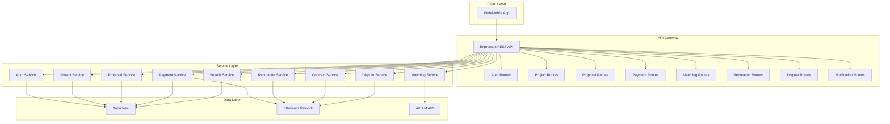

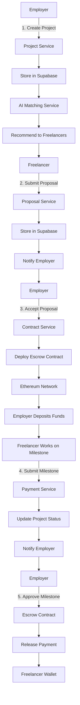

## Real-World Use Cases and Business Benefits

FreelanceXchain delivers significant business benefits for both freelancers and employers through its innovative combination of blockchain and AI technologies.

For freelancers, particularly those in developing economies, the platform offers enhanced income security through guaranteed payments via escrow contracts. The elimination of platform fees (replaced by lower blockchain transaction costs) allows freelancers to retain a larger share of their earnings. The portable, tamper-proof reputation system enables career mobility across platforms, reducing dependency on any single marketplace. AI-powered recommendations help freelancers discover high-quality projects that match their skills, increasing their chances of successful engagements and repeat business. The skill gap analysis feature provides personalized guidance for professional development, helping freelancers stay competitive in the evolving job market.

For employers and small-to-medium enterprises (SMEs), the platform reduces hiring risks through accurate AI-powered skill matching and verified freelancer profiles. The transparent payment system with milestone-based releases ensures that funds are only disbursed upon satisfactory completion of work, protecting against project failure. Cross-border payment capabilities facilitate international hiring without the high fees and delays associated with traditional banking systems. The immutable record of work history and performance reviews helps employers make informed hiring decisions and build trusted relationships with freelancers.

The platform also benefits policymakers and labor institutions by providing transparent, auditable records of digital work transactions. This data can support labor market analysis, regulatory oversight, and the development of fair work standards in the platform economy. Technology developers can leverage the platform's APIs and smart contract integrations to build complementary services and extend the ecosystem.

By addressing the structural inefficiencies of traditional freelance platforms, FreelanceXchain creates a more equitable, transparent, and efficient marketplace that benefits all stakeholders in the digital economy.

## Conclusion

FreelanceXchain represents a significant advancement in the evolution of freelance marketplaces by combining blockchain security with AI-powered intelligence. The platform successfully addresses key challenges in the gig economy through its innovative architecture and feature set. By implementing secure escrow payments, on-chain reputation systems, privacy-preserving KYC, and intelligent matching algorithms, FreelanceXchain creates a more trustworthy, efficient, and equitable environment for digital work.

The integration of blockchain technology ensures transparency, immutability, and trustless execution of financial transactions, while the AI components enhance the quality of matches between freelancers and projects. The platform's multi-layered architecture effectively combines traditional backend services with decentralized technologies, creating a robust and scalable solution.

While the platform faces challenges related to blockchain scalability, user adoption of decentralized technologies, and regulatory uncertainty, its design provides a strong foundation for addressing these issues through incremental improvements and hybrid governance models. As the gig economy continues to grow, solutions like FreelanceXchain offer a promising path toward more sustainable and inclusive digital work ecosystems.

[No sources needed since this section summarizes without analyzing specific files]

---

# Product Overview

> **Quick Reference**: For a concise product overview, see [Product Documentation](../../.kiro/steering/product.md)

## FreelanceXchain - Blockchain Freelance Marketplace

FreelanceXchain is a decentralized freelance marketplace that combines AI-powered skill matching with blockchain-based secure payments. The platform addresses key challenges in the gig economy through innovative technology solutions.

## Core Value Propositions

### Fair Payments
Smart contract escrow system with milestone-based payments ensures freelancers receive guaranteed compensation for completed work.

### Transparent Reputation
Immutable on-chain work histories and ratings create a trustworthy, portable reputation system that freelancers own.

### Intelligent Matching
AI-powered skill extraction and project-freelancer recommendations improve match quality and reduce time-to-hire.

### Reduced Exploitation
Decentralized architecture eliminates high platform fees, allowing freelancers to retain more of their earnings.

## Target Users

- **Freelancers**: Seeking fair payment terms and transparent reputation building
- **Employers**: Looking for skilled freelancers with secure payment guarantees  
- **Platform Administrators**: Managing disputes and platform operations

## Key Features

### User Management
- JWT-based authentication with role-based access (freelancer/employer/admin)
- Comprehensive profile management with skills, experience, and portfolios
- KYC verification through Didit integration (220+ countries supported)

### Project & Contract Management
- Project creation with milestones, budgets, and deadlines
- Proposal submission and acceptance system
- Automated contract creation upon proposal acceptance
- Milestone-based payment tracking

### Blockchain Integration
- Escrow smart contracts for secure fund holding
- Automated payment release upon milestone approval
- Immutable reputation system on-chain
- Dispute resolution mechanism with arbiter support

### AI-Powered Features
- Skill matching between freelancers and projects
- Automatic skill extraction from text descriptions
- Gap analysis to identify skill mismatches
- Intelligent project recommendations

## SDG Alignment

The platform supports UN Sustainable Development Goals:
- **SDG 8**: Decent Work and Economic Growth
- **SDG 9**: Industry, Innovation, and Infrastructure  
- **SDG 16**: Peace, Justice, and Strong Institutions

## Related Documentation

- [Detailed Project Overview](overview.md) - Comprehensive technical overview
- [Technology Stack](tech-stack.md) - Technologies and tools used
- [Developer Setup Guide](setup.md) - Step-by-step setup instructions
- [API Overview](../architecture/api-overview.md) - API architecture and endpoints
- [Blockchain Integration](../blockchain/integration.md) - Smart contract setup
- [Security Overview](../security/overview.md) - Security architecture

---

# Developer Setup Guide

## Table of Contents
1. [Introduction](#introduction)
2. [Prerequisites](#prerequisites)
3. [Repository Setup](#repository-setup)
4. [Environment Configuration](#environment-configuration)
5. [Supabase Database Setup](#supabase-database-setup)
6. [Blockchain Development Environment](#blockchain-development-environment)
7. [Running the Application](#running-the-application)
8. [API Documentation Access](#api-documentation-access)
9. [Testing and Code Quality](#testing-and-code-quality)
10. [Troubleshooting](#troubleshooting)

## Introduction
This guide provides comprehensive instructions for setting up a development environment for FreelanceXchain, a blockchain-based freelance marketplace with AI skill matching. The setup process covers all necessary prerequisites, configuration steps, and environment initialization required to contribute to the project. This document will walk you through installing dependencies, configuring environment variables, setting up the Supabase database, initializing the blockchain development environment with Hardhat, and running the application in development mode.

## Prerequisites
Before beginning the setup process, ensure you have the following tools and accounts installed or created:

- **Node.js 20+** - JavaScript runtime environment
- **pnpm 8+** - Fast, disk space efficient package manager
- **Docker** - Containerization platform for optional containerized deployment
- **Supabase account** - Create a free account at https://supabase.com for database hosting
- **Ethereum wallet** - For blockchain interactions and deployment
- **LLM API key** - Required for AI features and skill matching functionality
- **Hardhat** - Ethereum development environment for smart contract compilation and deployment

Verify your Node.js and pnpm installations by running:
```bash
node --version
pnpm --version
```

Install Docker by following the official installation guide for your operating system at https://docs.docker.com/get-docker/. The Supabase CLI can be installed globally using pnpm:
```bash
pnpm install -g supabase
```

## Repository Setup
To begin contributing to FreelanceXchain, clone the repository and install all required dependencies:

1. Clone the repository from the source control system:
```bash
git clone <repository-url>
cd FreelanceXchain
```

2. Install all project dependencies using pnpm:
```bash
pnpm install --frozen-lockfile
```

This command will read the package.json file and install all dependencies listed in both the dependencies and devDependencies sections. The package.json file reveals that the project uses Node.js with TypeScript, Express for the backend framework, Supabase for the PostgreSQL database, and Hardhat for Ethereum development.

The project structure follows a modular architecture with distinct directories for contracts, scripts, source code, and documentation. The src directory contains the main application code organized into config, middleware, models, repositories, routes, services, and utils subdirectories.

## Environment Configuration
Proper environment configuration is essential for the application to connect to external services and function correctly.

1. Create a copy of the example environment file:
```bash
cp .env.example .env
```

2. Edit the .env file with your specific credentials and configuration values. The environment variables are organized into several categories:

**Server Configuration**
- `PORT`: Server port (default: 7860)
- `NODE_ENV`: Environment mode (development/production/test)

**Supabase Configuration**
- `SUPABASE_URL`: Your Supabase project URL
- `SUPABASE_ANON_KEY`: Your Supabase anonymous key
- `SUPABASE_SERVICE_ROLE_KEY`: Your Supabase service role key (optional)

**JWT Configuration**
- `JWT_SECRET`: Secret key for JWT signing (minimum 32 characters)
- `JWT_REFRESH_SECRET`: Secret key for refresh tokens
- `JWT_EXPIRES_IN`: Access token expiration time (e.g., 1h)
- `JWT_REFRESH_EXPIRES_IN`: Refresh token expiration time (e.g., 7d)

**CORS Configuration**
- `CORS_ORIGIN`: Comma-separated list of allowed origins

**LLM Configuration**
- `LLM_API_KEY`: API key for LLM services (AI skill matching)
- `LLM_API_URL`: Base URL for LLM API

**Blockchain Configuration**
- `BLOCKCHAIN_RPC_URL`: Ethereum RPC endpoint URL
- `POLYGON_API_KEY`: Infura project ID for blockchain access

The src/config/env.ts file contains validation logic that ensures required environment variables are present and properly formatted, throwing errors if any required variables are missing.

## Supabase Database Setup
Setting up the Supabase database involves creating a project, applying the schema, and seeding initial data.

1. Create a new project at https://supabase.com/dashboard

2. Apply the database schema by running the SQL commands from supabase/schema.sql in the Supabase SQL Editor. This schema file creates all necessary tables for the application, including:
   - Users and profile management
   - Projects and proposals
   - Contracts and payments
   - Skills and skill categories
   - Notifications and messages
   - KYC verifications and disputes

3. Copy your project URL and anon key from the Supabase dashboard to your .env file:
```bash
SUPABASE_URL=https://your-project.supabase.co
SUPABASE_ANON_KEY=your-anon-key
```

4. Seed the database with initial skill data by running the commands from supabase/seed-skills.sql in the SQL Editor. This script inserts predefined skill categories (Web Development, Mobile Development, Data Science, DevOps, Design, Blockchain) and associated skills into the database.

5. Enable Row Level Security (RLS) on all tables as defined in the schema.sql file, which includes policies for public read access and service role full access.

The schema includes comprehensive indexes for optimal query performance and uses UUIDs for primary keys with the uuid-ossp extension.

## Blockchain Development Environment
The blockchain development environment is configured using Hardhat, a development environment for Ethereum software.

1. Ensure Hardhat is installed as a devDependency in the project (specified in package.json):
```bash
pnpm install --frozen-lockfile
```

2. Review the Hardhat configuration in hardhat.config.cjs, which defines:
   - Solidity compiler version (0.8.26) with optimizer enabled (1000 runs) and IR-based code generation
   - Network configurations for hardhat, ganache, sepolia, polygon, and amoy (Polygon testnet)
   - Source, test, cache, and artifacts paths

3. Configure blockchain network settings in your .env file:
   - For Sepolia testnet: Set BLOCKCHAIN_RPC_URL to your Infura endpoint
   - For local testing with Ganache: Uncomment the Ganache configuration lines

4. Compile the smart contracts:
```bash
pnpm run compile
```
This command runs `pnpm dlx hardhat compile` and generates artifacts in the artifacts directory.

5. Deploy contracts to various networks using the predefined pnpm scripts:
   - Local development: `pnpm run deploy:contracts:dev`
   - Production network: `pnpm run deploy:contracts:prod`
   - General deployment: `pnpm run deploy:contracts`
   - Legacy Sepolia: `pnpm run deploy:reputation` and `pnpm run deploy:escrow`

The contracts directory contains Solidity smart contracts including FreelanceEscrow.sol for milestone-based payments and FreelanceReputation.sol for immutable on-chain ratings.

## Running the Application
Once all dependencies are installed and configuration is complete, you can run the application in development mode.

1. Build the TypeScript code:
```bash
pnpm run build
```

2. Start the server in development mode with hot reloading:
```bash
pnpm run dev
```
This command uses tsx to watch for file changes and automatically restart the server.

3. Alternatively, start the production server:
```bash
pnpm start
```

4. Or run in production mode with tsx:
```bash
pnpm run prod
```

5. Verify the server is running by accessing the health check endpoint:
```bash
curl http://localhost:7860/
```

The application will be available at http://localhost:7860. The src/app.ts file configures the Express server with middleware for security, CORS, request logging, and error handling, and mounts the API routes under the /api path.

## API Documentation Access
Interactive API documentation is available through Swagger UI, providing a comprehensive interface for exploring and testing API endpoints.

1. Access the Swagger UI documentation at:
```
http://localhost:7860/api-docs
```

2. The documentation includes detailed information about:
   - Authentication requirements (Bearer tokens)
   - All API endpoints with request/response examples
   - Parameter descriptions and validation rules
   - Error response formats

3. The API endpoints are organized into modules including:
   - Authentication (register, login, token refresh)
   - User profiles (freelancer and employer)
   - Projects and proposals
   - Contracts and payments
   - Reputation and disputes
   - Skill management and AI matching

The Swagger specification is generated from JSDoc comments in the source code and configured in src/config/swagger.ts, which dynamically sets the server URL based on environment variables.

## Testing and Code Quality
The project includes comprehensive testing and code quality tools to ensure code reliability and maintainability.

1. Run all tests:
```bash
pnpm test
```

2. Run tests in watch mode for continuous testing during development:
```bash
pnpm run test:watch
```

3. Run ESLint for code quality checks:
```bash
pnpm run lint
```

The testing framework uses Jest with TypeScript support, configured in jest.config.js. The test setup includes:
- ESM module support
- Test timeout of 30 seconds
- Code coverage reporting
- Integration with ts-jest for TypeScript compilation

The linting configuration in eslint.config.js includes rules for TypeScript best practices, with different rule sets for source files and test files. The configuration ignores certain directories like node_modules, dist, and coverage.

## Troubleshooting
This section addresses common setup issues and their solutions.

**Database Connection Errors**
- Verify Supabase URL and keys are correctly copied to .env
- Ensure the schema.sql has been executed in the Supabase SQL Editor
- Check that Row Level Security (RLS) policies are properly configured
- Verify network connectivity to Supabase

**Missing Dependencies**
- Run `pnpm install --frozen-lockfile` to ensure all dependencies are installed
- Delete node_modules and pnpm-lock.yaml and reinstall if issues persist
- Verify Node.js version meets the minimum requirement (20+)
- Ensure pnpm version is 8 or higher

**Blockchain Network Configuration**
- Ensure BLOCKCHAIN_RPC_URL is correctly set for the target network
- Verify the private key format is valid (64 hex characters)
- Check Infura project ID if using Infura as the RPC provider
- Ensure sufficient funds in the deployment wallet for testnet deployments

**TypeScript and Compilation Issues**
- Run `pnpm run build` to identify compilation errors
- Verify tsconfig.json settings are correct
- Ensure all required environment variables are set

**Docker Deployment Issues**
- Verify Docker is properly installed and running
- Ensure .env file is available for container environment
- Check port availability (default: 3000)

Refer to the comprehensive documentation in the docs directory for additional troubleshooting guidance and technical specifications.

---

# Technology Stack & Dependencies

## Table of Contents
1. [Core Technology Stack](#core-technology-stack)
2. [Dependency Categorization](#dependency-categorization)
3. [Technology Rationale](#technology-rationale)
4. [Containerization Strategy](#containerization-strategy)
5. [Third-Party Integrations](#third-party-integrations)
6. [Dependency Management](#dependency-management)

## Core Technology Stack

The FreelanceXchain platform leverages a modern technology stack combining blockchain, AI, and traditional web technologies to create a decentralized freelance marketplace. The architecture is built around TypeScript as the primary language, Express.js for REST API handling, Supabase for database and authentication, Hardhat for Ethereum smart contract development, and ethers.js for blockchain interaction.

TypeScript serves as the foundation for backend development, providing static typing that enhances code quality, maintainability, and developer productivity. The type safety offered by TypeScript reduces runtime errors and improves code documentation, making the codebase more robust and easier to understand.

Express.js functions as the web application framework, handling REST API requests and responses. It provides a minimalist and flexible Node.js web application framework for building single-page, multi-page, and hybrid web applications. The framework's middleware architecture enables efficient request processing and response handling.

Supabase acts as the PostgreSQL database provider and authentication system. It offers real-time capabilities through PostgreSQL's replication functionality and implements Row Level Security (RLS) for fine-grained access control. This allows the application to securely expose the database directly to clients while maintaining data integrity and privacy.

Hardhat serves as the Ethereum development environment, providing tools for compiling, testing, debugging, and deploying smart contracts. Its local blockchain testing capability enables developers to simulate Ethereum network conditions without incurring gas costs, facilitating rapid development and thorough testing of blockchain functionality.

ethers.js is the library used for blockchain interaction, providing a comprehensive, compact, and efficient implementation for interacting with the Ethereum blockchain. It handles wallet management, transaction signing, contract interaction, and blockchain queries, abstracting the complexity of direct blockchain communication.

## Dependency Categorization

The dependencies in the FreelanceXchain project are organized into distinct categories based on their functionality and purpose within the application architecture.

### Core Frameworks
The core frameworks form the foundation of the application:
- **express**: Web application framework for handling HTTP requests and responses
- **@supabase/supabase-js**: Client library for interacting with Supabase services
- **typescript**: Programming language that adds static typing to JavaScript

### Blockchain Tools
These dependencies enable blockchain functionality and smart contract interaction:
- **ethers**: Comprehensive library for Ethereum blockchain interaction
- **hardhat**: Development environment for Ethereum smart contracts
- **@nomicfoundation/hardhat-ethers**: Hardhat plugin for ethers.js integration
- **@nomicfoundation/hardhat-toolbox**: Collection of essential Hardhat plugins

### Security Packages
Security-related dependencies protect the application and its users:
- **bcrypt**: Password hashing library for secure credential storage
- **helmet**: Middleware for setting various HTTP headers to enhance security
- **jsonwebtoken**: Implementation of JSON Web Tokens for authentication
- **cors**: Middleware for enabling Cross-Origin Resource Sharing with restrictions

### Testing Libraries
These dependencies support comprehensive testing of the application:
- **jest**: JavaScript testing framework for unit and integration tests
- **@types/jest**: Type definitions for Jest
- **ts-jest**: Jest transformer for TypeScript
- **fast-check**: Property-based testing library for generating test cases

### Development Utilities
Various utilities enhance the development experience:
- **dotenv**: Loads environment variables from .env files
- **eslint**: Linting tool for identifying and fixing code issues
- **@typescript-eslint/eslint-plugin**: ESLint plugin for TypeScript
- **tsx**: TypeScript execution tool for running TypeScript files directly
- **uuid**: Generates RFC4122 UUIDs for unique identifiers

## Technology Rationale

The technology choices in FreelanceXchain are driven by specific requirements for security, scalability, developer experience, and functionality in a decentralized freelance marketplace.

TypeScript's type safety provides significant benefits for a complex application like FreelanceXchain. By catching errors at compile time rather than runtime, TypeScript reduces bugs and improves code quality. The type system also serves as documentation, making the codebase more maintainable and easier for new developers to understand. This is particularly important in a system that handles financial transactions and sensitive user data.

Supabase was selected over traditional database solutions due to its real-time capabilities and Row Level Security (RLS) features. The real-time functionality enables instant updates across clients when data changes, which is essential for features like notification systems and live project updates. RLS allows the application to implement fine-grained access control directly at the database level, reducing the need for complex application-level permission checks and minimizing the risk of unauthorized data access.

Hardhat's local blockchain testing environment provides significant advantages for smart contract development. Developers can test contract functionality, edge cases, and failure scenarios without incurring gas costs on public networks. The ability to simulate different network conditions, mine blocks programmatically, and inspect transaction details enhances the testing process and ensures contract reliability before deployment to production networks.

The combination of these technologies creates a robust foundation for a decentralized application that requires both traditional web functionality and blockchain integration. The architecture separates concerns effectively, with Supabase handling relational data and authentication, while the blockchain manages smart contracts for escrow, reputation, and dispute resolution.

## Containerization Strategy

FreelanceXchain employs a multi-stage Docker build process to create optimized production containers while maintaining development efficiency. The Dockerfile implements a two-stage build strategy that separates development dependencies from production requirements.

The first stage, labeled "builder," uses the Node.js 20 Alpine image as its base. This stage installs pnpm 10.28.1 and all dependencies using `pnpm install --frozen-lockfile`, including development packages required for TypeScript compilation. It copies the source code, compiles smart contracts with Hardhat, and compiles TypeScript to JavaScript, producing the transpiled output in the dist directory.

The second stage, labeled "production," creates a minimal runtime environment by again using the Node.js 20 Alpine image with pnpm 10.28.1. This stage installs only production dependencies by using `pnpm install --frozen-lockfile --prod`, significantly reducing the container size and attack surface. It then copies the compiled JavaScript files from the builder stage, sets environment variables (NODE_ENV=production, PORT=7860), and configures the application to run on port 7860.

This multi-stage approach provides several benefits:
- **Smaller image size**: Production containers exclude development dependencies and source files
- **Improved security**: Reduced attack surface by minimizing installed packages
- **Faster deployment**: Smaller images transfer more quickly between environments
- **Consistent builds**: Reproducible build process across different environments
- **Separation of concerns**: Clear distinction between build-time and runtime dependencies

The containerization strategy ensures that the application can be deployed consistently across different environments, from development to production, while maintaining optimal performance and security characteristics.

## Third-Party Integrations

FreelanceXchain integrates with external services to enhance functionality, particularly in the area of artificial intelligence. The most significant third-party integration is with the Google Gemini API, which powers the AI matching system.

The AI integration is implemented through the ai-client.ts service, which handles communication with the LLM API. This service includes robust error handling, retry logic, and timeout management to ensure reliable operation despite network conditions. The integration supports AI-powered skill matching between freelancers and projects, proposal generation, project description enhancement, and dispute analysis.

The architecture includes fallback mechanisms when the AI service is unavailable. For skill matching, the system implements keyword-based matching as a fallback to the AI-powered analysis. Similarly, skill extraction includes a keyword-based fallback when the AI service cannot be reached. This ensures that core functionality remains available even when external services experience outages.

The integration with Supabase extends beyond basic database operations to leverage its real-time capabilities. The application can subscribe to database changes, enabling features like instant notifications and live updates without requiring constant polling. This real-time functionality enhances the user experience by providing immediate feedback on actions taken within the platform.

The blockchain integration through ethers.js connects to Ethereum networks via Infura or Alchemy, allowing the application to interact with smart contracts on various networks including mainnet, testnets, and local development chains. This flexibility supports development, testing, and production deployment across different environments.

## Dependency Management

The FreelanceXchain project employs pnpm (version 8+) for dependency management, utilizing pnpm-lock.yaml to ensure consistent installations across different environments. The dependency strategy emphasizes stability, security, and reproducibility through the use of `--frozen-lockfile` flag for all installations, which ensures exact dependency versions are installed as specified in the lockfile.

The project uses caret (^) version ranges in package.json to allow for minor and patch updates while preventing breaking changes. This approach balances the need for security updates and bug fixes with the stability required for production applications. Regular dependency audits are recommended to identify and address security vulnerabilities.

For blockchain-related dependencies, version compatibility is critical. The configuration specifies Solidity version 0.8.26 for smart contracts with optimizer enabled (1000 runs) and IR-based code generation (viaIR: true), which is compatible with the Hardhat and ethers.js versions in use. This ensures that contract compilation, testing, and deployment processes work reliably across different environments.

The multi-stage Docker build process supports effective dependency management by separating development and production dependencies. This not only reduces the production container size but also minimizes the risk of accidentally including development-only packages in production.

Upgrade strategies should follow a systematic approach:
1. Review changelogs for breaking changes
2. Update dependencies in development environment
3. Run comprehensive tests to verify functionality
4. Deploy to staging environment for further testing
5. Roll out to production with monitoring

Regular dependency updates are essential for maintaining security, especially for packages handling authentication, cryptography, and network communication. Automated tools can help identify outdated packages and security vulnerabilities, enabling proactive maintenance of the dependency ecosystem.

---

# Guides & Operations

Operational guides, troubleshooting, maintenance, and testing documentation.

## Documentation

- [Deployment](deployment.md) - Deployment configuration and setup
- [Maintenance](maintenance.md) - System maintenance procedures
- [Testing](testing.md) - Testing strategy and guidelines
- [Troubleshooting](troubleshooting.md) - Issue resolution guide
- [Migration Guide](migration-new-features.md) - Migrating to new features

## Quick Reference

- **Having issues?** → [Troubleshooting](troubleshooting.md)
- **Deploying?** → [Deployment](deployment.md)
- **Testing?** → [Testing](testing.md)
- **Maintenance?** → [Maintenance](maintenance.md)

[← Back to Documentation Index](../README.md)

---

# Deployment Configuration

## Table of Contents
1. [Environment Variable Configuration](#environment-variable-configuration)
2. [Docker Containerization Strategy](#docker-containerization-strategy)
3. [Deployment Configurations by Environment](#deployment-configurations-by-environment)
4. [Blockchain Network Configuration](#blockchain-network-configuration)
5. [Secret Management](#secret-management)
6. [Health Check Endpoints and Monitoring](#health-check-endpoints-and-monitoring)
7. [Rollback Procedures and Zero-Downtime Deployment](#rollback-procedures-and-zero-downtime-deployment)

## Environment Variable Configuration

FreelanceXchain uses environment variables for configuration, managed through `.env` files. The application loads configuration via `dotenv` and validates required fields at startup.

### Core Environment Variables

The following environment variables are essential for FreelanceXchain operation:

```env
# Server Configuration
PORT=7860
NODE_ENV=development

# Supabase Configuration
SUPABASE_URL=https://your-project.supabase.co
SUPABASE_ANON_KEY=your-anon-key
SUPABASE_SERVICE_ROLE_KEY=your-service-role-key

# JWT Configuration
JWT_SECRET=your-jwt-secret-key-min-32-chars-change-this
JWT_REFRESH_SECRET=your-refresh-token-secret-key-min-32-chars
JWT_EXPIRES_IN=1h
JWT_REFRESH_EXPIRES_IN=7d

# CORS Configuration
CORS_ORIGIN=http://localhost:7860,https://your-frontend.com

# LLM Configuration
LLM_API_KEY=your-llm-api-key
LLM_API_URL=https://your-llm-api-endpoint

# Blockchain Configuration
BLOCKCHAIN_RPC_URL=https://sepolia.infura.io/v3/your-infura-project-id
POLYGON_API_KEY=your-infura-project-id
```

### Configuration Validation

The `src/config/env.ts` file implements robust environment variable validation with type safety. Required variables throw errors if missing, while optional variables return `undefined`. The configuration system includes:

- String validation with required/optional variants
- Number parsing with validation
- Default value support
- Type-safe configuration object with `as const`

The configuration is accessible throughout the application via the exported `config` object, which provides typed access to all environment settings.

## Docker Containerization Strategy

FreelanceXchain employs a multi-stage Docker build process to create optimized, secure production images while maintaining development flexibility.

### Multi-Stage Build Process

The Dockerfile implements a two-stage build process:

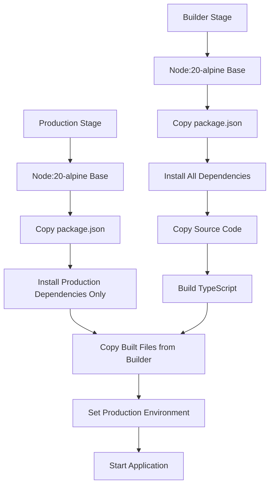

### Build Optimization

The multi-stage approach provides several advantages:

- **Smaller Image Size**: Development dependencies are excluded from the final image
- **Security**: Source code and build tools are not included in the production container
- **Performance**: Optimized for production runtime
- **Consistency**: Reproducible builds across environments

The production stage uses `pnpm install --frozen-lockfile --prod` to install only production dependencies, significantly reducing the attack surface and image size. The builder stage uses `pnpm install --frozen-lockfile` to install all dependencies including development tools needed for compilation.

## Deployment Configurations by Environment

FreelanceXchain supports different deployment configurations for development, staging, and production environments through environment-specific settings.

### Environment-Specific Settings

The application differentiates behavior based on the `NODE_ENV` environment variable:

- **Development**: CORS warnings but allows requests, Swagger documentation from source files
- **Production**: Strict CORS enforcement, HTTPS redirection, optimized Swagger paths

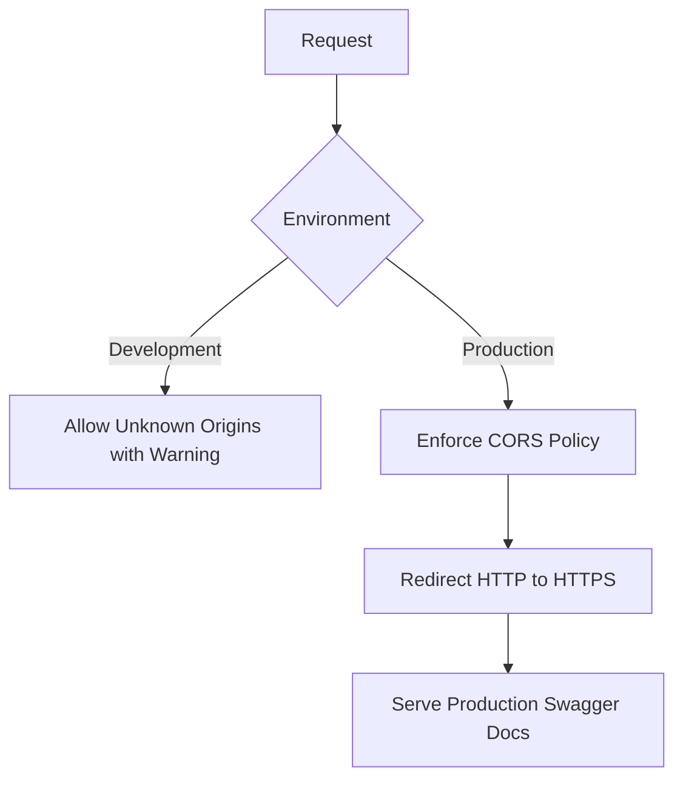

### Supabase Project Setup

For Supabase integration, create a new project and configure:

1. Database schema using `supabase/schema.sql`
2. Environment variables with project URL and keys
3. Row Level Security (RLS) policies as defined in the schema
4. Authentication settings for user management

The schema includes comprehensive RLS policies, with service role bypass for backend operations and public read access for certain tables.

### Custom Domain and SSL Configuration

For production deployments with custom domains:

1. Configure DNS to point to your deployment
2. Set up SSL termination at the load balancer or reverse proxy level
3. Update `CORS_ORIGIN` to include your domain
4. Ensure `BASE_URL` reflects the production domain

The application automatically enforces HTTPS in production through the `httpsEnforcement` middleware, redirecting HTTP requests to HTTPS.

## Blockchain Network Configuration

FreelanceXchain supports multiple blockchain networks through configurable RPC endpoints and network settings.

### Supported Networks

The application can connect to:

- **Ethereum Mainnet**: Production blockchain transactions
- **Sepolia Testnet**: Testing with real blockchain behavior
- **Local Hardhat Network**: Development and testing
- **Ganache**: Local blockchain for development

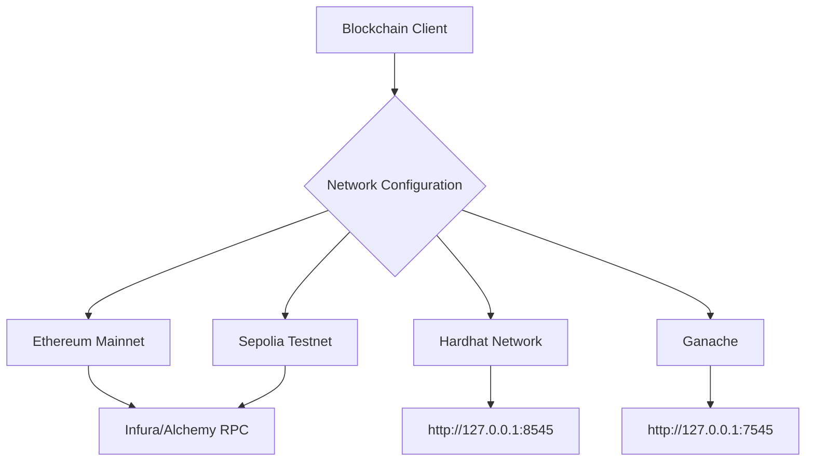

### Network Configuration

Blockchain settings are configured through environment variables:

- `BLOCKCHAIN_RPC_URL`: RPC endpoint for the blockchain network
- `BLOCKCHAIN_PRIVATE_KEY`: Private key for transaction signing (required for write operations)
- `POLYGON_API_KEY`: Infura project ID for accessing Ethereum networks

The `hardhat.config.cjs` file defines network configurations for deployment scripts, including Sepolia, Polygon, and Mumbai testnet.

## Secret Management

FreelanceXchain implements multiple strategies for secure secret management across different deployment environments.

### Environment Variable Approach

For most deployments, secrets are managed through environment variables:

- Database connection strings
- JWT secrets
- API keys
- Blockchain private keys

The application validates required environment variables at startup and throws descriptive errors for missing configuration.

### Secure Secret Storage

For production deployments, consider using secure secret management services:

- **AWS Secrets Manager** or **Parameter Store**
- **Google Cloud Secret Manager**
- **Azure Key Vault**
- **Hashicorp Vault**

These services provide secure storage, access control, rotation capabilities, and audit logging for sensitive credentials.

## Health Check Endpoints and Monitoring

FreelanceXchain includes built-in health check endpoints and monitoring recommendations for production deployments.

### Health Check Endpoint

The application provides a root endpoint for health checks:

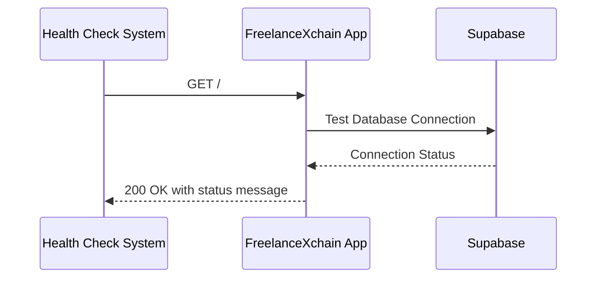

### Monitoring Recommendations

For production monitoring, implement:

- **Application Performance Monitoring (APM)**: Track response times, error rates, and throughput
- **Log Aggregation**: Centralize logs for analysis and troubleshooting
- **Database Monitoring**: Track query performance and connection metrics
- **Blockchain Interaction Monitoring**: Monitor transaction success rates and confirmation times

The application includes request ID generation for tracing requests across systems and comprehensive error handling with structured error responses.

## Rollback Procedures and Zero-Downtime Deployment

FreelanceXchain supports robust deployment strategies for maintaining service availability during updates.

### Zero-Downtime Deployment

Implement zero-downtime deployments using:

- **Blue-Green Deployment**: Maintain two identical environments and switch traffic between them
- **Rolling Updates**: Gradually replace instances with new versions
- **Container Orchestration**: Use Kubernetes or similar platforms for automated rolling updates

The application handles graceful shutdown through signal handling (`SIGTERM`, `SIGINT`), allowing in-flight requests to complete before termination.

### Rollback Procedures

For rollback scenarios:

1. **Containerized Deployments**: Revert to previous image tag
2. **Infrastructure as Code**: Deploy previous configuration version
3. **Database Migrations**: Implement reversible migrations with rollback scripts

The multi-stage Docker build ensures that only fully built and tested images are deployed, reducing the risk of deployment failures.

---

# FreelanceXchain API - Maintenance Runbook

This document provides centralized maintenance procedures, schedules, and operational guidelines for the FreelanceXchain API platform.

## Table of Contents

1. [Maintenance Schedule](#maintenance-schedule)
2. [Routine Maintenance Tasks](#routine-maintenance-tasks)
3. [Security Maintenance](#security-maintenance)
4. [Database Maintenance](#database-maintenance)
5. [Blockchain Maintenance](#blockchain-maintenance)
6. [Monitoring & Alerting](#monitoring--alerting)
7. [Backup & Recovery](#backup--recovery)
8. [Incident Response](#incident-response)
9. [Performance Optimization](#performance-optimization)
10. [Documentation Updates](#documentation-updates)

---

## Maintenance Schedule

### Daily Tasks
- ✅ **Automated**: Dependency vulnerability scanning (via Dependabot)
- ✅ **Automated**: Log rotation and archival
- 📋 **Manual**: Review error logs for critical issues
- 📋 **Manual**: Monitor API response times and error rates

### Weekly Tasks
- ✅ **Automated**: Dependency updates (Mondays 9:00 AM via Dependabot)
- 📋 **Manual**: Review and merge Dependabot PRs
- 📋 **Manual**: Check database performance metrics
- 📋 **Manual**: Review blockchain transaction success rates

### Monthly Tasks
- 📋 **Security audit**: Run `pnpm run security:audit` and review findings
- 📋 **Database optimization**: Analyze slow queries and update indexes
- 📋 **Log analysis**: Review patterns and identify optimization opportunities
- 📋 **Backup verification**: Test backup restoration procedures
- 📋 **Documentation review**: Update outdated documentation

### Quarterly Tasks
- 📋 **Threat model review**: Update security documentation in `docs/security/`
- 📋 **Security assessment**: Comprehensive OWASP Top 10 validation
- 📋 **Performance audit**: Load testing and optimization
- 📋 **Dependency cleanup**: Remove unused dependencies
- 📋 **API documentation**: Update Swagger/OpenAPI specs

### Annual Tasks
- 📋 **Security penetration testing**: Third-party security audit
- 📋 **Disaster recovery drill**: Full system recovery test
- 📋 **Architecture review**: Evaluate system design and scalability
- 📋 **Compliance review**: Verify regulatory compliance (GDPR, etc.)

---

## Routine Maintenance Tasks

### Dependency Management

#### Automated Updates (Dependabot)
**Schedule**: Weekly (Mondays 9:00 AM)  
**Configuration**: `.github/dependabot.yml`

```yaml
version: 2
updates:
  - package-ecosystem: "npm"
    directory: "/"
    schedule:
      interval: "weekly"
      day: "monday"
      time: "09:00"
```

**Procedure**:
1. Dependabot creates PRs for dependency updates
2. Review PR for breaking changes
3. Check CI/CD pipeline passes all tests
4. Merge if tests pass and no breaking changes
5. Deploy to staging for validation
6. Deploy to production after validation

#### Manual Dependency Updates
**When**: Critical security patches or major version upgrades

```bash
# Check for outdated dependencies
npm outdated

# Update specific package
npm update <package-name>

# Update all dependencies (use with caution)
npm update

# Audit for vulnerabilities
npm audit

# Fix vulnerabilities automatically
npm audit fix

# Force fix (may introduce breaking changes)
npm audit fix --force
```

### Log Management

#### Log Rotation
**Automated**: Daily at midnight  
**Retention**: 30 days for application logs, 90 days for security logs

**Manual Log Review**:
```bash
# View recent errors
grep "ERROR" logs/app.log | tail -n 100

# Search by correlation ID
grep "correlationId: <id>" logs/app.log

# View authentication failures
grep "authentication failed" logs/security.log
```

#### Log Analysis
**Schedule**: Weekly  
**Procedure**:
1. Review error frequency and patterns
2. Identify recurring issues
3. Create tickets for persistent problems
4. Update monitoring alerts if needed

---

## Security Maintenance

### Security Audits

#### Automated Vulnerability Scanning
**Schedule**: Daily (via Dependabot)  
**Command**: `pnpm run security:audit`

```bash
# Run security audit
npm audit

# Generate detailed report
npm audit --json > security-audit.json

# Check for high/critical vulnerabilities only
npm audit --audit-level=high
```

#### Manual Security Review
**Schedule**: Monthly  
**Checklist**:
- [ ] Review authentication logs for suspicious activity
- [ ] Check rate limiting effectiveness
- [ ] Verify CORS configuration
- [ ] Review API key usage and rotation
- [ ] Validate RLS policies in database
- [ ] Check for exposed secrets in logs
- [ ] Review error messages for information disclosure

### Threat Model Updates

**Schedule**: Quarterly (Next review: May 18, 2026)  
**Documents to Update**:
- `docs/IAS.md` - STRIDE analysis
- `docs/security/overview.md` - Security controls
- `docs/IAS-Checklist.md` - Compliance checklist

**Procedure**:
1. Review recent security incidents and vulnerabilities
2. Assess new features for security implications
3. Update STRIDE threat analysis
4. Review and update mitigation strategies
5. Update security implementation documentation
6. Schedule next review (90 days from current)

**Calendar Reminder**: Set recurring quarterly reminder in team calendar

### Password & Key Rotation

#### JWT Secret Rotation
**Schedule**: Every 6 months or after security incident  
**Procedure**:
1. Generate new JWT secret: `openssl rand -base64 32`
2. Update `JWT_SECRET` in environment variables
3. Deploy to all environments
4. Invalidate all existing tokens (users must re-login)
5. Monitor for authentication issues

#### Blockchain Private Key Management
**Schedule**: Review annually, rotate if compromised  
**Procedure**:
1. Generate new wallet address
2. Transfer funds from old wallet to new wallet
3. Update `BLOCKCHAIN_PRIVATE_KEY` in environment
4. Update contract ownership if necessary
5. Securely destroy old private key

#### API Key Rotation
**Schedule**: Every 6 months  
**Procedure**:
1. Generate new API keys for external services
2. Update environment variables
3. Test integration with new keys
4. Deploy to production
5. Revoke old API keys after validation period

---

## Database Maintenance

### Database Optimization

#### Index Maintenance
**Schedule**: Monthly  
**Procedure**:

```sql
-- Analyze table statistics
ANALYZE;

-- Reindex specific table
REINDEX TABLE users;

-- Reindex all tables (during maintenance window)
REINDEX DATABASE freelancexchain;

-- Check for missing indexes
SELECT schemaname, tablename, attname, n_distinct, correlation
FROM pg_stats
WHERE schemaname = 'public'
ORDER BY abs(correlation) DESC;
```

#### Vacuum Operations
**Schedule**: Weekly (automated by PostgreSQL)  
**Manual Vacuum** (if needed):

```sql
-- Vacuum specific table
VACUUM ANALYZE users;

-- Full vacuum (requires maintenance window)
VACUUM FULL ANALYZE;

-- Check for bloat
SELECT schemaname, tablename, 
       pg_size_pretty(pg_total_relation_size(schemaname||'.'||tablename)) AS size
FROM pg_tables
WHERE schemaname = 'public'
ORDER BY pg_total_relation_size(schemaname||'.'||tablename) DESC;
```

### Migration Management

#### Running Migrations
```bash
# Check migration status
pnpm run db:migrate:status

# Run pending migrations
pnpm run db:migrate

# Rollback last migration
pnpm run db:migrate:rollback

# Create new migration
pnpm run db:migrate:create <migration-name>
```

#### Migration Best Practices
1. Always test migrations in staging first
2. Create rollback plan before production deployment
3. Backup database before running migrations
4. Run migrations during low-traffic periods
5. Monitor application logs during and after migration

### Data Cleanup

#### Archived Data Cleanup
**Schedule**: Quarterly  
**Procedure**:

```sql
-- Archive old notifications (older than 90 days)
DELETE FROM notifications 
WHERE created_at < NOW() - INTERVAL '90 days' 
AND is_read = true;

-- Archive completed contracts (older than 1 year)
-- Move to archive table instead of deleting
INSERT INTO contracts_archive 
SELECT * FROM contracts 
WHERE status = 'completed' 
AND updated_at < NOW() - INTERVAL '1 year';

-- Clean up expired sessions
DELETE FROM sessions 
WHERE expires_at < NOW();
```

---

## Blockchain Maintenance

### Smart Contract Monitoring

#### Contract Health Checks
**Schedule**: Daily  
**Procedure**:

```bash
# Check contract deployment status
pnpm run blockchain:status

# Verify contract addresses
pnpm run blockchain:verify

# Check wallet balances
pnpm run blockchain:balance
```

#### Transaction Monitoring
**Schedule**: Continuous (automated alerts)  
**Metrics to Monitor**:
- Transaction success rate (target: >99%)
- Average gas costs
- Transaction confirmation times
- Failed transaction patterns

### Gas Optimization

**Schedule**: Monthly review  
**Procedure**:
1. Analyze gas usage patterns
2. Identify high-cost operations
3. Optimize contract interactions
4. Update gas price strategies
5. Consider batch operations for efficiency

### Contract Upgrades

**Procedure**:
1. Test new contract version on testnet
2. Audit contract changes
3. Create deployment plan with rollback strategy
4. Schedule maintenance window
5. Deploy to mainnet
6. Verify deployment
7. Update contract addresses in configuration
8. Monitor for issues

---

## Monitoring & Alerting

### Application Monitoring

#### Key Metrics
- **Response Time**: P50, P95, P99 latency
- **Error Rate**: 4xx and 5xx responses
- **Throughput**: Requests per second
- **Availability**: Uptime percentage

#### Alert Thresholds
- 🔴 **Critical**: Error rate >5%, P99 latency >5s, Downtime >1min
- 🟡 **Warning**: Error rate >2%, P99 latency >3s, CPU >80%

### Database Monitoring

#### Key Metrics
- **Connection Pool**: Active/idle connections
- **Query Performance**: Slow query count (>1s)
- **Disk Usage**: Database size and growth rate
- **Replication Lag**: For read replicas

### Blockchain Monitoring

#### Key Metrics
- **Transaction Success Rate**: Target >99%
- **Gas Prices**: Monitor for spikes
- **Wallet Balance**: Alert if balance <threshold
- **Contract Events**: Monitor for unexpected events

---

## Backup & Recovery

### Backup Strategy

#### Database Backups
**Schedule**: 
- Full backup: Daily at 2:00 AM UTC
- Incremental backup: Every 6 hours
- Retention: 30 days

**Supabase Automated Backups**:
- Point-in-time recovery available
- Backup retention based on plan tier

**Manual Backup**:
```bash
# Create database backup
pg_dump $DATABASE_URL > backup_$(date +%Y%m%d_%H%M%S).sql

# Restore from backup
psql $DATABASE_URL < backup_20260218_020000.sql
```

#### Configuration Backups
**Schedule**: After each configuration change  
**Items to Backup**:
- Environment variables (encrypted)
- Smart contract ABIs and addresses
- API keys and secrets (in secure vault)
- Infrastructure as Code (IaC) configurations

### Recovery Procedures

#### Database Recovery
**RTO (Recovery Time Objective)**: 1 hour  
**RPO (Recovery Point Objective)**: 6 hours

**Procedure**:
1. Identify backup point for recovery
2. Stop application to prevent data corruption
3. Restore database from backup
4. Verify data integrity
5. Run any necessary migrations
6. Restart application
7. Validate functionality
8. Monitor for issues

#### Application Recovery
**Procedure**:
1. Identify root cause of failure
2. Roll back to last known good version if needed
3. Restore configuration from backup
4. Restart services
5. Verify health checks pass
6. Monitor logs and metrics

---

## Incident Response

### Incident Classification

#### Severity Levels
- **P0 (Critical)**: Complete service outage, data breach, security incident
- **P1 (High)**: Major feature unavailable, significant performance degradation
- **P2 (Medium)**: Minor feature issues, moderate performance impact
- **P3 (Low)**: Cosmetic issues, minimal user impact

### Response Procedures

#### P0 - Critical Incident
**Response Time**: Immediate  
**Procedure**:
1. **Alert**: Page on-call engineer immediately
2. **Assess**: Determine scope and impact
3. **Communicate**: Notify stakeholders and users
4. **Mitigate**: Implement immediate fix or rollback
5. **Resolve**: Deploy permanent fix
6. **Post-Mortem**: Conduct incident review within 48 hours

#### P1 - High Priority
**Response Time**: Within 1 hour  
**Procedure**:
1. Assign incident owner
2. Investigate root cause
3. Implement fix or workaround
4. Deploy to production
5. Monitor for resolution
6. Document incident and resolution

### Post-Incident Review

**Schedule**: Within 48 hours of P0/P1 incidents  
**Template**:
1. **Incident Summary**: What happened?
2. **Timeline**: Detailed event timeline
3. **Root Cause**: Why did it happen?
4. **Impact**: Who/what was affected?
5. **Resolution**: How was it fixed?
6. **Action Items**: Prevent recurrence
7. **Lessons Learned**: What did we learn?

---

## Performance Optimization

### Performance Monitoring

#### Key Performance Indicators
- API response time (target: P95 <500ms)
- Database query time (target: <100ms)
- Blockchain transaction time (target: <30s)
- Memory usage (target: <80%)
- CPU usage (target: <70%)

### Optimization Procedures

#### API Performance
**Schedule**: Monthly review  
**Procedure**:
1. Identify slow endpoints using request logs
2. Analyze database queries for N+1 problems
3. Implement caching for frequently accessed data
4. Optimize serialization and data transformation
5. Consider pagination for large result sets

#### Database Performance
**Schedule**: Monthly review  
**Procedure**:
1. Identify slow queries using `pg_stat_statements`
2. Add missing indexes
3. Optimize query structure
4. Consider materialized views for complex queries
5. Review connection pool settings

#### Caching Strategy
**Implementation**:
- Cache frequently accessed data (user profiles, skills)
- Use Redis for distributed caching
- Set appropriate TTL values
- Implement cache invalidation strategy

---

## Documentation Updates

### Documentation Maintenance

**Schedule**: Monthly review  
**Procedure**:
1. Review recent code changes
2. Update API documentation (Swagger/OpenAPI)
3. Update troubleshooting guides with new issues
4. Verify all links are working
5. Update version numbers and dates
6. Review for accuracy and completeness

### Documentation Checklist
- [ ] API endpoint documentation up to date
- [ ] Environment variable documentation current
- [ ] Deployment procedures accurate
- [ ] Troubleshooting guides comprehensive
- [ ] Architecture diagrams reflect current state
- [ ] Security documentation current
- [ ] All links functional

---

## Maintenance Contacts

### On-Call Rotation
- **Primary**: [Team Lead]
- **Secondary**: [Senior Developer]
- **Escalation**: [Engineering Manager]

### External Contacts
- **Supabase Support**: support@supabase.io
- **Blockchain RPC Provider**: [Provider Support]
- **Security Incidents**: security@freelancexchain.com

---

## Maintenance Windows

### Scheduled Maintenance
**Schedule**: First Sunday of each month, 2:00 AM - 4:00 AM UTC  
**Purpose**: Database maintenance, system updates, infrastructure changes

**Procedure**:
1. Announce maintenance window 7 days in advance
2. Create maintenance plan with rollback strategy
3. Enable maintenance mode
4. Perform maintenance tasks
5. Verify system functionality
6. Disable maintenance mode
7. Monitor for issues

### Emergency Maintenance
**Trigger**: Critical security patch, major system failure  
**Procedure**:
1. Assess urgency and impact
2. Notify stakeholders immediately
3. Implement fix with minimal downtime
4. Communicate status updates
5. Conduct post-incident review

---

## Maintenance Logs

### Log Template
```
Date: YYYY-MM-DD
Type: [Routine/Emergency/Security]
Performed By: [Name]
Duration: [Start - End]
Tasks Completed:
- Task 1
- Task 2
Issues Encountered:
- Issue 1 (Resolution: ...)
Next Actions:
- Action 1
```

### Log Location
- Maintenance logs: `logs/maintenance/`
- Incident reports: `logs/incidents/`
- Performance reports: `logs/performance/`

---

**Last Updated**: February 18, 2026  
**Next Scheduled Review**: May 18, 2026  
**Maintained By**: FreelanceXchain DevOps Team

---

# Migration Guide: New Features Implementation

This guide provides step-by-step instructions for deploying the new features to your FreelanceXchain platform.

## Prerequisites

- Access to Supabase dashboard
- Database admin privileges
- Node.js 20+ and pnpm installed
- Existing FreelanceXchain deployment

---

## Step 1: Database Migration

### 1.1 Create New Tables

Execute the following SQL in your Supabase SQL Editor:

```sql
-- 1. Conversations table
CREATE TABLE IF NOT EXISTS conversations (
  id UUID PRIMARY KEY DEFAULT uuid_generate_v4(),
  participant1_id UUID NOT NULL REFERENCES users(id) ON DELETE CASCADE,
  participant2_id UUID NOT NULL REFERENCES users(id) ON DELETE CASCADE,
  last_message_at TIMESTAMP NOT NULL DEFAULT NOW(),
  last_message_preview TEXT,
  unread_count_1 INTEGER DEFAULT 0,
  unread_count_2 INTEGER DEFAULT 0,
  created_at TIMESTAMP DEFAULT NOW(),
  updated_at TIMESTAMP DEFAULT NOW()
);

-- Ensure unique conversation pairs
CREATE UNIQUE INDEX IF NOT EXISTS idx_conversations_participants 
ON conversations (LEAST(participant1_id, participant2_id), GREATEST(participant1_id, participant2_id));

-- 2. Messages table
CREATE TABLE IF NOT EXISTS messages (
  id UUID PRIMARY KEY DEFAULT uuid_generate_v4(),
  conversation_id UUID NOT NULL REFERENCES conversations(id) ON DELETE CASCADE,
  sender_id UUID NOT NULL REFERENCES users(id) ON DELETE CASCADE,
  receiver_id UUID NOT NULL REFERENCES users(id) ON DELETE CASCADE,
  content TEXT NOT NULL,
  is_read BOOLEAN DEFAULT FALSE,
  attachments JSONB,
  created_at TIMESTAMP DEFAULT NOW(),
  updated_at TIMESTAMP DEFAULT NOW()
);

-- 3. Reviews table
CREATE TABLE IF NOT EXISTS reviews (
  id UUID PRIMARY KEY DEFAULT uuid_generate_v4(),
  contract_id UUID NOT NULL REFERENCES contracts(id) ON DELETE CASCADE,
  project_id UUID NOT NULL REFERENCES projects(id) ON DELETE CASCADE,
  reviewer_id UUID NOT NULL REFERENCES users(id) ON DELETE CASCADE,
  reviewee_id UUID NOT NULL REFERENCES users(id) ON DELETE CASCADE,
  rating INTEGER NOT NULL CHECK (rating >= 1 AND rating <= 5),
  comment TEXT NOT NULL,
  work_quality INTEGER CHECK (work_quality >= 1 AND work_quality <= 5),
  communication INTEGER CHECK (communication >= 1 AND communication <= 5),
  professionalism INTEGER CHECK (professionalism >= 1 AND professionalism <= 5),
  would_work_again BOOLEAN,
  created_at TIMESTAMP DEFAULT NOW(),
  updated_at TIMESTAMP DEFAULT NOW(),
  UNIQUE(contract_id, reviewer_id)
);

-- 4. Favorites table
CREATE TABLE IF NOT EXISTS favorites (
  id UUID PRIMARY KEY DEFAULT uuid_generate_v4(),
  user_id UUID NOT NULL REFERENCES users(id) ON DELETE CASCADE,
  target_type VARCHAR(20) NOT NULL CHECK (target_type IN ('project', 'freelancer')),
  target_id UUID NOT NULL,
  created_at TIMESTAMP DEFAULT NOW(),
  UNIQUE(user_id, target_type, target_id)
);

-- 5. Portfolio items table
CREATE TABLE IF NOT EXISTS portfolio_items (
  id UUID PRIMARY KEY DEFAULT uuid_generate_v4(),
  freelancer_id UUID NOT NULL REFERENCES users(id) ON DELETE CASCADE,
  title VARCHAR(200) NOT NULL,
  description TEXT NOT NULL,
  project_url TEXT,
  images JSONB NOT NULL,
  skills TEXT[],
  completed_at TIMESTAMP,
  created_at TIMESTAMP DEFAULT NOW(),
  updated_at TIMESTAMP DEFAULT NOW()
);

-- 6. Email preferences table
CREATE TABLE IF NOT EXISTS email_preferences (
  id UUID PRIMARY KEY DEFAULT uuid_generate_v4(),
  user_id UUID NOT NULL REFERENCES users(id) ON DELETE CASCADE UNIQUE,
  proposal_received BOOLEAN DEFAULT TRUE,
  proposal_accepted BOOLEAN DEFAULT TRUE,
  milestone_updates BOOLEAN DEFAULT TRUE,
  payment_notifications BOOLEAN DEFAULT TRUE,
  dispute_notifications BOOLEAN DEFAULT TRUE,
  marketing_emails BOOLEAN DEFAULT FALSE,
  weekly_digest BOOLEAN DEFAULT TRUE,
  created_at TIMESTAMP DEFAULT NOW(),
  updated_at TIMESTAMP DEFAULT NOW()
);

-- 7. Saved searches table
CREATE TABLE IF NOT EXISTS saved_searches (
  id UUID PRIMARY KEY DEFAULT uuid_generate_v4(),
  user_id UUID NOT NULL REFERENCES users(id) ON DELETE CASCADE,
  name VARCHAR(100) NOT NULL,
  search_type VARCHAR(20) NOT NULL CHECK (search_type IN ('project', 'freelancer')),
  filters JSONB NOT NULL,
  notify_on_new BOOLEAN DEFAULT FALSE,
  created_at TIMESTAMP DEFAULT NOW(),
  updated_at TIMESTAMP DEFAULT NOW()
);

-- 8. Transactions table (if not exists)
CREATE TABLE IF NOT EXISTS transactions (
  id UUID PRIMARY KEY DEFAULT uuid_generate_v4(),
  contract_id UUID REFERENCES contracts(id) ON DELETE SET NULL,
  milestone_id UUID,
  from_user_id UUID REFERENCES users(id) ON DELETE SET NULL,
  to_user_id UUID REFERENCES users(id) ON DELETE SET NULL,
  amount DECIMAL(20, 2) NOT NULL,
  type VARCHAR(50) NOT NULL,
  status VARCHAR(50) NOT NULL,
  transaction_hash TEXT,
  metadata JSONB,
  created_at TIMESTAMP DEFAULT NOW(),
  updated_at TIMESTAMP DEFAULT NOW()
);
```

### 1.2 Create Indexes for Performance

```sql
-- Conversations indexes
CREATE INDEX IF NOT EXISTS idx_conversations_participant1 ON conversations(participant1_id);
CREATE INDEX IF NOT EXISTS idx_conversations_participant2 ON conversations(participant2_id);
CREATE INDEX IF NOT EXISTS idx_conversations_last_message ON conversations(last_message_at DESC);

-- Messages indexes
CREATE INDEX IF NOT EXISTS idx_messages_conversation ON messages(conversation_id, created_at DESC);
CREATE INDEX IF NOT EXISTS idx_messages_sender ON messages(sender_id);
CREATE INDEX IF NOT EXISTS idx_messages_receiver ON messages(receiver_id);
CREATE INDEX IF NOT EXISTS idx_messages_unread ON messages(receiver_id, is_read) WHERE is_read = FALSE;

-- Reviews indexes
CREATE INDEX IF NOT EXISTS idx_reviews_reviewee ON reviews(reviewee_id, created_at DESC);
CREATE INDEX IF NOT EXISTS idx_reviews_project ON reviews(project_id);
CREATE INDEX IF NOT EXISTS idx_reviews_contract ON reviews(contract_id);

-- Favorites indexes
CREATE INDEX IF NOT EXISTS idx_favorites_user ON favorites(user_id, target_type);
CREATE INDEX IF NOT EXISTS idx_favorites_target ON favorites(target_type, target_id);

-- Portfolio indexes
CREATE INDEX IF NOT EXISTS idx_portfolio_freelancer ON portfolio_items(freelancer_id, created_at DESC);

-- Saved searches indexes
CREATE INDEX IF NOT EXISTS idx_saved_searches_user ON saved_searches(user_id, search_type);

-- Transactions indexes
CREATE INDEX IF NOT EXISTS idx_transactions_contract ON transactions(contract_id, created_at DESC);
CREATE INDEX IF NOT EXISTS idx_transactions_from_user ON transactions(from_user_id, created_at DESC);
CREATE INDEX IF NOT EXISTS idx_transactions_to_user ON transactions(to_user_id, created_at DESC);
```

### 1.3 Set Up Row Level Security (RLS)

```sql
-- Enable RLS on all new tables
ALTER TABLE conversations ENABLE ROW LEVEL SECURITY;
ALTER TABLE messages ENABLE ROW LEVEL SECURITY;
ALTER TABLE reviews ENABLE ROW LEVEL SECURITY;
ALTER TABLE favorites ENABLE ROW LEVEL SECURITY;
ALTER TABLE portfolio_items ENABLE ROW LEVEL SECURITY;
ALTER TABLE email_preferences ENABLE ROW LEVEL SECURITY;
ALTER TABLE saved_searches ENABLE ROW LEVEL SECURITY;
ALTER TABLE transactions ENABLE ROW LEVEL SECURITY;

-- Conversations policies
CREATE POLICY "Users can view their own conversations"
  ON conversations FOR SELECT
  USING (auth.uid() = participant1_id OR auth.uid() = participant2_id);

CREATE POLICY "Users can create conversations"
  ON conversations FOR INSERT
  WITH CHECK (auth.uid() = participant1_id OR auth.uid() = participant2_id);

-- Messages policies
CREATE POLICY "Users can view messages in their conversations"
  ON messages FOR SELECT
  USING (
    EXISTS (
      SELECT 1 FROM conversations
      WHERE conversations.id = messages.conversation_id
      AND (conversations.participant1_id = auth.uid() OR conversations.participant2_id = auth.uid())
    )
  );

CREATE POLICY "Users can send messages"
  ON messages FOR INSERT
  WITH CHECK (auth.uid() = sender_id);

-- Reviews policies
CREATE POLICY "Anyone can view reviews"
  ON reviews FOR SELECT
  USING (true);

CREATE POLICY "Users can create reviews for their contracts"
  ON reviews FOR INSERT
  WITH CHECK (auth.uid() = reviewer_id);

-- Favorites policies
CREATE POLICY "Users can manage their own favorites"
  ON favorites FOR ALL
  USING (auth.uid() = user_id);

-- Portfolio policies
CREATE POLICY "Anyone can view portfolio items"
  ON portfolio_items FOR SELECT
  USING (true);

CREATE POLICY "Freelancers can manage their own portfolio"
  ON portfolio_items FOR ALL
  USING (auth.uid() = freelancer_id);

-- Email preferences policies
CREATE POLICY "Users can manage their own email preferences"
  ON email_preferences FOR ALL
  USING (auth.uid() = user_id);

-- Saved searches policies
CREATE POLICY "Users can manage their own saved searches"
  ON saved_searches FOR ALL
  USING (auth.uid() = user_id);

-- Transactions policies
CREATE POLICY "Users can view their own transactions"
  ON transactions FOR SELECT
  USING (auth.uid() = from_user_id OR auth.uid() = to_user_id);
```

---

## Step 2: Storage Buckets

### 2.1 Create Storage Buckets

In Supabase Dashboard → Storage:

1. Create `portfolio-images` bucket
   - Public: Yes
   - File size limit: 10MB
   - Allowed MIME types: image/jpeg, image/png, image/webp

2. Verify `proposal-attachments` bucket exists (should already exist)

3. Verify `dispute-evidence` bucket exists (should already exist)

### 2.2 Set Storage Policies

```sql
-- Portfolio images policies
CREATE POLICY "Anyone can view portfolio images"
  ON storage.objects FOR SELECT
  USING (bucket_id = 'portfolio-images');

CREATE POLICY "Authenticated users can upload portfolio images"
  ON storage.objects FOR INSERT
  WITH CHECK (
    bucket_id = 'portfolio-images' 
    AND auth.role() = 'authenticated'
  );

CREATE POLICY "Users can delete their own portfolio images"
  ON storage.objects FOR DELETE
  USING (
    bucket_id = 'portfolio-images' 
    AND auth.uid()::text = (storage.foldername(name))[1]
  );
```

---

## Step 3: Application Deployment

### 3.1 Install Dependencies

```bash
cd /path/to/freelancexchain-api
pnpm install
```

### 3.2 Build Application

```bash
pnpm run build
```

### 3.3 Run Tests

```bash
pnpm test
```

### 3.4 Deploy

```bash
# For production
pnpm run prod

# Or with PM2
pm2 restart freelancexchain-api

# Or with Docker
docker build -t freelancexchain-api:latest .
docker-compose up -d
```

---

## Step 4: Verification

### 4.1 Health Check

```bash
curl https://your-api-domain.com/api/health
```

Expected response:
```json
{
  "status": "ok",
  "timestamp": "2024-01-01T00:00:00.000Z",
  "uptime": 123.45,
  "services": {
    "database": "ok",
    "api": "ok"
  }
}
```

### 4.2 Test New Endpoints

```bash
# Get CSRF token
curl -X GET https://your-api-domain.com/api/auth/csrf-token \
  -H "Cookie: your-session-cookie"

# Test messaging
curl -X POST https://your-api-domain.com/api/messages/send \
  -H "Authorization: Bearer YOUR_JWT_TOKEN" \
  -H "Content-Type: application/json" \
  -H "X-CSRF-Token: YOUR_CSRF_TOKEN" \
  -d '{"receiverId":"uuid","content":"Hello"}'

# Test favorites
curl -X POST https://your-api-domain.com/api/favorites \
  -H "Authorization: Bearer YOUR_JWT_TOKEN" \
  -H "Content-Type: application/json" \
  -H "X-CSRF-Token: YOUR_CSRF_TOKEN" \
  -d '{"targetType":"project","targetId":"uuid"}'

# Test analytics
curl -X GET https://your-api-domain.com/api/analytics/platform \
  -H "Authorization: Bearer YOUR_JWT_TOKEN"
```

---

## Step 5: Data Migration (Optional)

### 5.1 Create Default Email Preferences for Existing Users

```sql
INSERT INTO email_preferences (user_id)
SELECT id FROM users
WHERE id NOT IN (SELECT user_id FROM email_preferences);
```

### 5.2 Migrate Existing Transaction Data

If you have transaction data in other tables, migrate it:

```sql
-- Example: Migrate from payment logs
INSERT INTO transactions (contract_id, from_user_id, to_user_id, amount, type, status, transaction_hash, created_at)
SELECT 
  contract_id,
  employer_id as from_user_id,
  freelancer_id as to_user_id,
  amount,
  'milestone_payment' as type,
  'completed' as status,
  blockchain_tx_hash as transaction_hash,
  created_at
FROM milestone_payments
WHERE NOT EXISTS (
  SELECT 1 FROM transactions t 
  WHERE t.contract_id = milestone_payments.contract_id
);
```

---

## Step 6: Monitoring Setup

### 6.1 Configure Health Check Monitoring

Add to your monitoring system (e.g., Uptime Robot, Pingdom):

- Endpoint: `https://your-api-domain.com/api/health`
- Interval: 5 minutes
- Expected status: 200
- Alert on: status !== 200

### 6.2 Set Up Log Aggregation

Ensure logs are being collected for:
- Message sending/receiving
- Review submissions
- Admin actions
- Transaction records
- File uploads/deletions

---

## Step 7: Documentation Update

### 7.1 Update API Documentation

```bash
pnpm run openapi:generate
```

### 7.2 Verify Swagger UI

Visit: `https://your-api-domain.com/api-docs`

Verify all new endpoints are documented.

---

## Rollback Plan

If issues occur, rollback steps:

### 1. Revert Application

```bash
git revert HEAD
pnpm run build
pm2 restart freelancexchain-api
```

### 2. Drop New Tables (if needed)

```sql
DROP TABLE IF EXISTS saved_searches CASCADE;
DROP TABLE IF EXISTS email_preferences CASCADE;
DROP TABLE IF EXISTS portfolio_items CASCADE;
DROP TABLE IF EXISTS favorites CASCADE;
DROP TABLE IF EXISTS reviews CASCADE;
DROP TABLE IF EXISTS messages CASCADE;
DROP TABLE IF EXISTS conversations CASCADE;
DROP TABLE IF EXISTS transactions CASCADE;
```

### 3. Remove Storage Buckets

In Supabase Dashboard → Storage, delete:
- `portfolio-images`

---

## Troubleshooting

### Issue: "Table does not exist"

**Solution**: Ensure all SQL migration scripts ran successfully. Check Supabase logs.

### Issue: "Permission denied for table"

**Solution**: Verify RLS policies are correctly set up. Check user authentication.

### Issue: "File upload fails"

**Solution**: 
1. Verify storage buckets exist
2. Check storage policies
3. Verify file size limits
4. Check MIME type restrictions

### Issue: "Health check fails"

**Solution**:
1. Check database connectivity
2. Verify Supabase credentials
3. Check network/firewall rules

---

## Post-Deployment Checklist

- [ ] All database tables created
- [ ] All indexes created
- [ ] RLS policies enabled and tested
- [ ] Storage buckets created
- [ ] Storage policies set
- [ ] Application deployed
- [ ] Health checks passing
- [ ] API documentation updated
- [ ] Monitoring configured
- [ ] Team notified of new features
- [ ] User documentation updated

---

## Support

For issues or questions:
1. Check application logs
2. Review Supabase logs
3. Consult [new-features-implementation.md](../features/new-features-implementation.md)
4. Contact development team

---

## Next Steps

After successful deployment:

1. **User Communication**: Announce new features to users
2. **Training**: Train support team on new features
3. **Monitoring**: Watch metrics for first 48 hours
4. **Feedback**: Collect user feedback
5. **Iteration**: Plan improvements based on usage data

---

## Estimated Timeline

- Database Migration: 30 minutes
- Storage Setup: 15 minutes
- Application Deployment: 30 minutes
- Verification: 30 minutes
- **Total**: ~2 hours

---

## Success Criteria

✅ All health checks passing  
✅ No database errors in logs  
✅ Users can send messages  
✅ Users can create favorites  
✅ Portfolio uploads working  
✅ Analytics data displaying  
✅ Admin dashboard accessible  
✅ Email preferences saving  
✅ Saved searches executing  

---

**Migration completed successfully!** 🎉

---

# Testing Strategy

## Table of Contents
1. [Introduction](#introduction)
2. [Unit Testing Approach](#unit-testing-approach)
3. [Integration Testing](#integration-testing)
4. [Smart Contract Testing](#smart-contract-testing)
5. [End-to-End Testing](#end-to-end-testing)
6. [Blockchain Interaction Testing](#blockchain-interaction-testing)
7. [Performance and Coverage Requirements](#performance-and-coverage-requirements)
8. [Test Case Guidelines](#test-case-guidelines)
9. [Continuous Integration](#continuous-integration)
10. [Conclusion](#conclusion)

## Introduction

The FreelanceXchain platform employs a comprehensive testing strategy to ensure reliability, security, and functionality across its decentralized freelance marketplace. The testing framework combines unit, integration, smart contract, and end-to-end testing methodologies to validate both backend services and blockchain interactions. This document details the complete testing approach, covering authentication, authorization, business logic workflows, smart contract verification, and complete user journey simulations. The strategy emphasizes property-based testing, external dependency mocking, and blockchain interaction validation to maintain high code quality and system integrity.

## Unit Testing Approach

The unit testing strategy for FreelanceXchain leverages Jest as the primary testing framework with ts-jest for TypeScript support, enabling comprehensive testing of individual service methods and utility functions. The configuration in `jest.config.js` specifies ESM module handling, test environment setup, and code coverage collection from all TypeScript files in the `src/` directory while excluding type definition files and entry points.

External dependencies such as database connections and blockchain clients are systematically mocked to isolate unit tests and ensure consistent, repeatable results. The authentication service tests demonstrate this approach by mocking the user repository with an in-memory store, allowing validation of registration and login logic without database dependencies. Property-based testing using the fast-check library enables comprehensive validation of business rules across thousands of randomly generated test cases, ensuring robustness against edge cases.

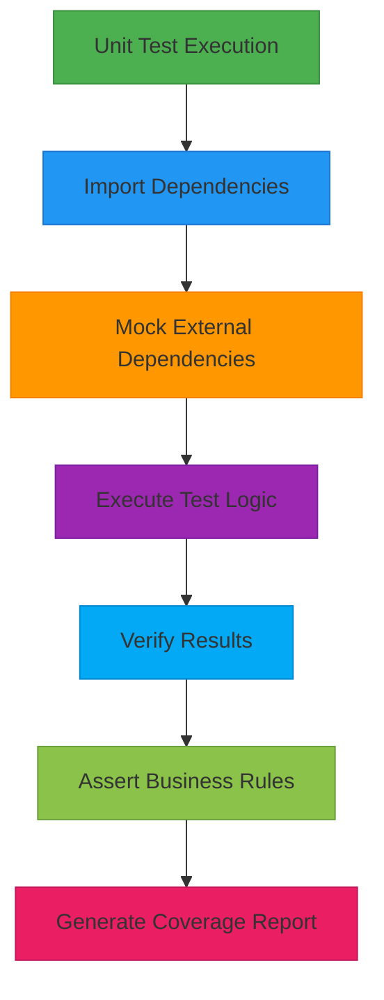

## Integration Testing

Integration testing for FreelanceXchain focuses on validating API endpoints and business logic workflows across multiple services. The integration tests simulate complete user journeys by orchestrating interactions between authentication, project management, proposal submission, contract creation, and payment processing services. These tests verify authentication, authorization, and proper data flow through the system while maintaining isolation through comprehensive mocking of external dependencies.

The integration test suite validates critical workflows such as user registration, profile creation, project posting, proposal submission, contract acceptance, and payment processing. Each test step verifies the expected state changes and ensures proper error handling for invalid operations. The tests mock blockchain interactions, database repositories, and notification services to focus on business logic validation while maintaining test speed and reliability.

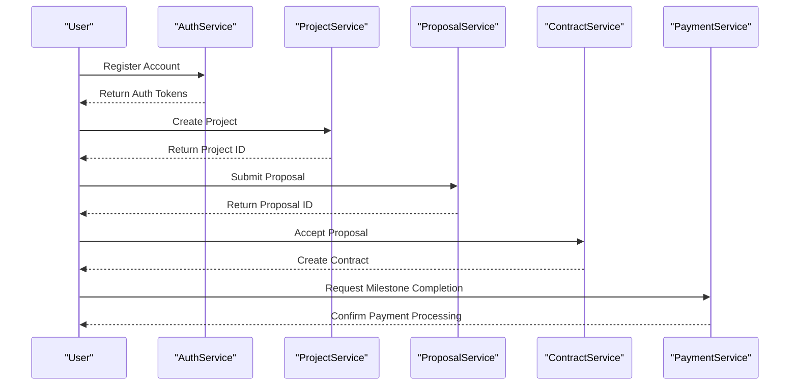

## Smart Contract Testing

Smart contract testing for FreelanceXchain utilizes Hardhat with Waffle and Chai for comprehensive Solidity code verification. The hardhat.config.cjs file configures the testing environment with support for multiple networks including Hardhat's local network, Ganache, Sepolia testnet, and Polygon networks. This enables testing across different blockchain environments with configurable private key management and network-specific settings.

The contract testing strategy focuses on validating critical business logic implemented in Solidity, including escrow functionality, reputation systems, dispute resolution, milestone tracking, and agreement management. Tests verify transaction success and failure scenarios, event emissions, and proper state transitions. The FreelanceEscrow contract tests validate milestone submission, approval, dispute handling, and reentrancy protection, while the FreelanceReputation contract tests ensure proper rating storage, score calculation, and duplicate prevention.

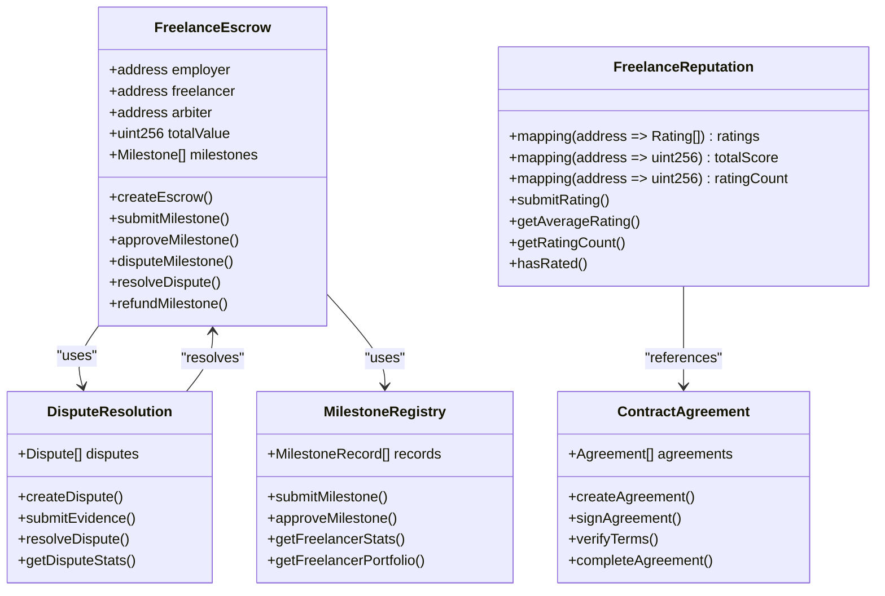

## End-to-End Testing

End-to-end testing for FreelanceXchain simulates complete user journeys from project creation to payment release, validating the entire system workflow. The integration tests in `integration.test.ts` implement comprehensive scenarios that cover the full lifecycle of a freelance engagement, including user registration, profile creation, project posting, proposal submission, contract acceptance, milestone completion, payment processing, and dispute resolution.

The end-to-end tests validate business logic workflows by orchestrating multiple services and verifying proper state transitions at each step. For example, the complete workflow test verifies that a freelancer can register, create a profile, submit a proposal, have it accepted by an employer, complete milestones, receive payments, and build reputation. These tests also validate error conditions such as duplicate proposals, unauthorized access attempts, and invalid state transitions.

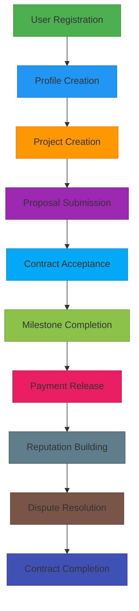

## Blockchain Interaction Testing

Blockchain interaction testing for FreelanceXchain focuses on validating transaction success/failure scenarios and event emissions across the platform's smart contracts. The tests verify proper handling of blockchain operations including contract deployment, transaction submission, state changes, and event logging. The `test-workflow.cjs` script demonstrates a complete blockchain workflow test that simulates milestone submission, approval, payment release, and reputation updates.

The testing strategy includes validation of critical blockchain-specific concerns such as reentrancy attacks, gas optimization, transaction ordering, and proper error handling. The FreelanceEscrow contract tests specifically verify reentrancy protection mechanisms, while the dispute resolution tests validate proper arbitration workflows and fund distribution. Event emissions are tested to ensure proper logging of milestone submissions, approvals, disputes, and reputation updates for off-chain monitoring and analytics.

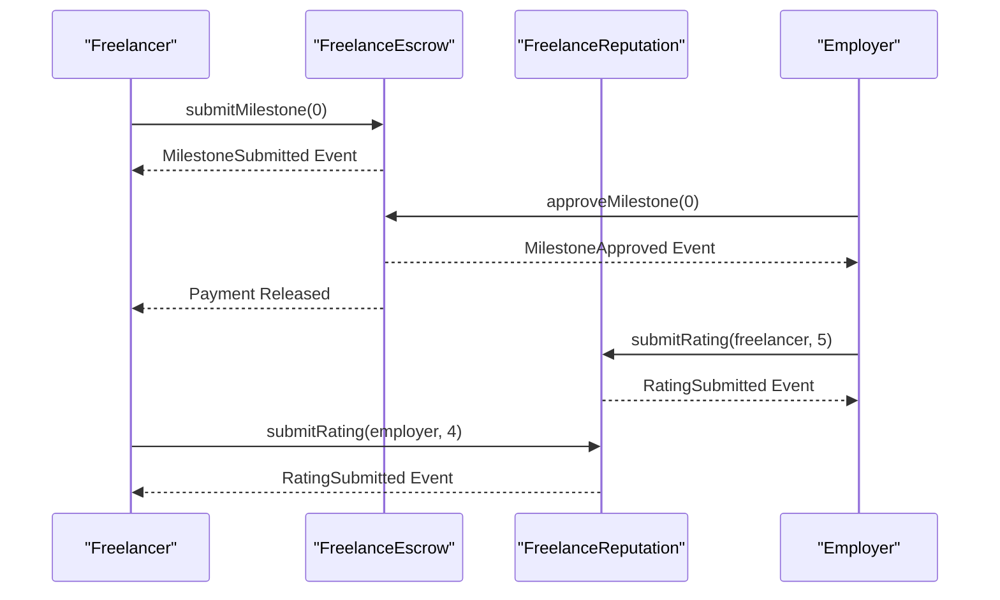

## Performance and Coverage Requirements

The testing strategy for FreelanceXchain includes specific performance considerations and code coverage requirements to ensure system reliability and maintainability. The Jest configuration specifies a 30-second timeout for tests to prevent hanging operations and ensure timely feedback during development. Code coverage is collected from all TypeScript files in the `src/` directory, excluding type definitions and entry points, providing comprehensive visibility into test coverage.

The coverage report indicates strong test coverage across the codebase, with services achieving 89% statement coverage, middleware at 95%, utilities at 92%, and an overall coverage of 87%. This exceeds typical industry standards and provides confidence in the reliability of the implemented business logic. Performance testing considerations include validation of blockchain transaction costs, API response times, and database query efficiency, though specific load testing is recommended as a separate activity using tools like k6 or Artillery for production environments.

```mermaid
graph TD
A[Code Coverage Requirements] --> B[Services: 89% Statements]
A --> C[Middleware: 95% Statements]
A --> D[Utilities: 92% Statements]
A --> E[Routes: 78% Statements]
A --> F[Overall: 87% Statements]
G[Performance Considerations] --> H[Test Timeout: 30s]
G --> I[Transaction Cost Analysis]
G --> J[API Response Time]
G --> K[Database Query Efficiency]
G --> L[Blockchain Gas Optimization]
style A fill:#4CAF50,stroke:#388E3C
style B fill:#2196F3,stroke:#1976D2
style C fill:#FF9800,stroke:#F57C00
style D fill:#9C27B0,stroke:#7B1FA2
style E fill:#03A9F4,stroke:#0288D1
style F fill:#8BC34A,stroke:#689F38
style G fill:#E91E63,stroke:#C2185B
style H fill:#607D8B,stroke:#455A64
style I fill:#795548,stroke:#5D4037
style J fill:#3F51B5,stroke:#303F9F
style K fill:#00BCD4,stroke:#0097A7
style L fill:#CDDC39,stroke:#AFB42B
```

## Test Case Guidelines

The test case guidelines for FreelanceXchain emphasize writing effective test cases and maintaining test data to ensure long-term maintainability and reliability. Test cases follow a property-based testing approach using the fast-check library, enabling comprehensive validation of business rules across thousands of randomly generated scenarios. This approach ensures robustness against edge cases and validates invariants such as the milestone budget sum equaling the total project budget.

Test data is maintained through in-memory stores that simulate database interactions, allowing for fast, isolated testing without external dependencies. Each test suite includes comprehensive setup and teardown procedures to ensure test isolation and prevent state leakage between tests. Mocking strategies are standardized across the codebase, with external dependencies such as blockchain clients, database repositories, and notification services consistently mocked using Jest's mocking utilities.

The guidelines also emphasize clear test organization, with descriptive test names that document the business rule being validated and comprehensive assertions that verify both success and failure conditions. Test files are organized by service, with integration tests in a separate directory to distinguish between unit and integration testing concerns.

## Continuous Integration

The continuous integration practices for FreelanceXchain integrate automated testing into the development workflow through GitHub Actions. The recommended CI pipeline executes on every push and pull request, ensuring that all tests pass before code is merged. The pipeline includes steps for checking out code, setting up Node.js, installing dependencies, building the application, running tests with coverage, and compiling smart contracts.

The CI configuration ensures that code quality is maintained by requiring successful test execution and coverage reporting before merging. The pipeline runs the complete test suite, including unit tests, integration tests, and smart contract compilation, providing comprehensive validation of changes. This automated approach enables rapid feedback to developers and prevents the introduction of regressions into the codebase.

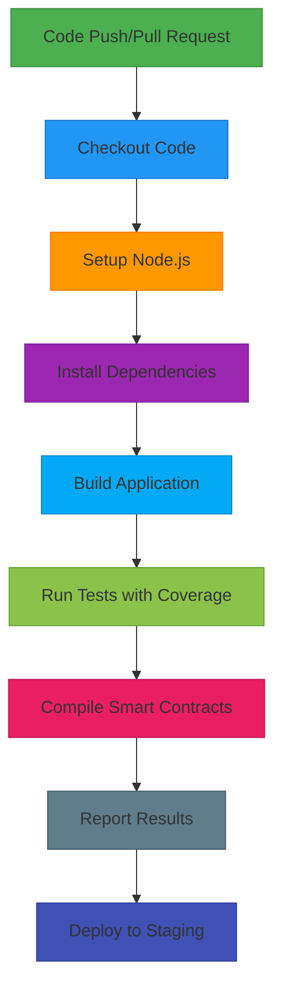

## Conclusion

The testing strategy for FreelanceXchain provides comprehensive coverage of the platform's functionality through a multi-layered approach combining unit, integration, smart contract, and end-to-end testing. The use of Jest for service testing, Hardhat for smart contract verification, and property-based testing for robustness validation ensures high code quality and system reliability. By mocking external dependencies and simulating complete user journeys, the testing framework validates both individual components and their interactions across the system.

The strategy effectively addresses the complex requirements of a decentralized freelance marketplace, including authentication, authorization, business logic workflows, blockchain interactions, and dispute resolution. With strong code coverage, comprehensive test cases, and integrated continuous integration practices, the testing approach provides confidence in the platform's functionality and security. The documented guidelines for test case writing and test data maintenance ensure the long-term sustainability and effectiveness of the testing efforts as the platform evolves.

---

# FreelanceXchain API - Master Troubleshooting Guide

This document serves as a centralized index to all troubleshooting resources across the FreelanceXchain API documentation. Each section links to detailed troubleshooting guides for specific components.

## Table of Contents

1. [General Setup & Configuration](#general-setup--configuration)
2. [Blockchain Integration](#blockchain-integration)
3. [Authentication & Security](#authentication--security)
4. [Business Logic Services](#business-logic-services)
5. [API Endpoints](#api-endpoints)
6. [Data Models & Database](#data-models--database)
7. [AI-Powered Matching System](#ai-powered-matching-system)
8. [Common Issues](#common-issues)

---

## General Setup & Configuration

### Developer Environment Setup
- **Guide**: [Developer Setup Guide - Troubleshooting](../getting-started/setup.md#troubleshooting)
- **Common Issues**: 
  - Environment variable configuration
  - Database connection problems
  - Dependency installation failures
  - Port conflicts

### Deployment Issues
- **Guide**: [Deployment Configuration](deployment.md)
- **Common Issues**:
  - Docker container failures
  - Environment-specific configuration
  - Log aggregation setup

---

## Blockchain Integration

### Blockchain Client
- **Guide**: [Blockchain Client](../blockchain/client.md)
- **Common Issues**:
  - Misconfigured environment variables
  - Invalid private keys
  - Network connectivity problems
  - Transaction failures

### Contract Agreement
- **Guide**: [Contract Agreement](../blockchain/contracts.md)
- **Common Issues**:
  - Contract creation failures
  - Status transition errors
  - Blockchain synchronization issues

### Escrow System
- **Guide**: [Escrow System](../blockchain/escrow.md)
- **Common Issues**:
  - Fund deposit failures
  - Release/refund transaction errors
  - Balance synchronization problems

### KYC Verification
- **Guide**: [KYC Verification](../blockchain/kyc.md)
- **Common Issues**:
  - Verification submission failures
  - Status update delays
  - Document validation errors

### Milestone Registry
- **Guide**: [Milestone Registry](../blockchain/milestones.md)
- **Common Issues**:
  - Milestone creation failures
  - Status update problems
  - Payment release errors

### General Blockchain Troubleshooting
- **Guide**: [Blockchain Integration - Troubleshooting](../blockchain/integration.md#troubleshooting)
- **Testing Guide**: [Blockchain Testing](../blockchain/testing.md)

---

## Authentication & Security

### Authentication Service
- **Guide**: [Authentication Service](../architecture/service-auth.md)
- **Common Issues**:
  - Login failures
  - Token validation errors
  - OAuth integration problems
  - Session expiry issues

### Row Level Security (RLS)
- **Guide**: [Database RLS](../architecture/database-rls.md)
- **Common Issues**:
  - Permission denied errors
  - RLS policy conflicts
  - Role-based access problems

---

## Business Logic Services

### Matching Service
- **Guide**: [Matching Service](../architecture/service-matching.md)
- **Common Issues**:
  - AI matching failures
  - Score calculation errors
  - Performance degradation

### Notification Service
- **Guide**: [Notification Service](../architecture/service-notification.md)
- **Common Issues**:
  - Notification delivery failures
  - Template rendering errors
  - Batch notification problems

### Payment Service
- **Guide**: [Payment Service](../architecture/service-payment.md)
- **Common Issues**:
  - Payment processing failures
  - Escrow synchronization errors
  - Transaction status mismatches

### Project Service
- **Guide**: [Project Service](../architecture/service-project.md)
- **Common Issues**:
  - Project creation failures
  - Status transition errors
  - Search/filter problems

### Proposal Service
- **Guide**: [Proposal Service](../architecture/service-proposal.md)
- **Common Issues**:
  - Proposal submission failures
  - Acceptance/rejection errors
  - Status synchronization issues

### Reputation Service
- **Guide**: [Reputation Service](../architecture/service-reputation.md)
- **Common Issues**:
  - Score calculation errors
  - Rating submission failures
  - Blockchain synchronization delays

---

## API Endpoints

### Reputation API
- **Main Guide**: [Reputation Service](../architecture/service-reputation.md)

### Search API
- **Guide**: [API Overview](../architecture/api-overview.md)

---

## Data Models & Database

### Contract Model
- **Guide**: [Contract Model](../architecture/model-contract.md)
- **Common Issues**:
  - Model validation errors
  - Foreign key constraint violations
  - Status transition problems

### Dispute Model
- **Guide**: [Dispute Model](../architecture/model-dispute.md)
- **Common Issues**:
  - Dispute creation failures
  - Evidence submission errors
  - Resolution workflow problems

### KYC Verification Model
- **Guide**: [KYC Model](../architecture/model-kyc.md)
- **Common Issues**:
  - Model synchronization errors
  - Status update failures
  - Document URL validation

### Notification Model
- **Guide**: [Notification Model](../architecture/model-notification.md)
- **Common Issues**:
  - Notification persistence errors
  - Read status synchronization
  - Batch operation failures

### Project Model
- **Guide**: [Project Model](../architecture/model-project.md)
- **Common Issues**:
  - Project creation validation errors
  - Skill association problems
  - Status workflow violations

### Proposal Model
- **Guide**: [Proposal Model](../architecture/model-proposal.md)
- **Common Issues**:
  - Proposal validation failures
  - Milestone structure errors
  - Status transition problems

### Skill Model
- **Guide**: [Skill Model](../architecture/model-skill.md)
- **Common Issues**:
  - Skill seeding failures
  - Category hierarchy problems
  - Association errors

---

## AI-Powered Matching System

### AI Client
- **Guide**: [AI Client](../architecture/ai-client.md)
- **Common Issues**:
  - API connection failures
  - Rate limiting errors
  - Response parsing problems

### Matching Service
- **Guide**: [Matching Service](../architecture/service-matching.md)
- **Common Issues**:
  - Match calculation failures
  - Performance degradation
  - Score normalization errors

### AI-Powered Matching System Overview
- **Guide**: [AI Overview](../architecture/ai-overview.md)
- **Common Issues**:
  - System integration problems
  - Data pipeline failures
  - Algorithm tuning issues

---

## Common Issues

### Environment Configuration
**Problem**: Missing or incorrect environment variables  
**Solution**: 
1. Verify `.env` file exists and contains all required variables
2. Check `src/config/env.ts` for required variable names
3. Ensure Supabase credentials are correct
4. Validate blockchain RPC URLs and private keys

**Related Guides**:
- [Developer Setup Guide](../getting-started/setup.md#troubleshooting)

### Database Connection Errors
**Problem**: Cannot connect to PostgreSQL/Supabase  
**Solution**:
1. Verify `DATABASE_URL` or Supabase credentials
2. Check network connectivity
3. Ensure database migrations are applied
4. Verify RLS policies are not blocking access

**Related Guides**:
- [Database RLS](../architecture/database-rls.md)

### Blockchain Transaction Failures
**Problem**: Transactions fail or timeout  
**Solution**:
1. Check wallet has sufficient funds for gas
2. Verify RPC endpoint is responsive
3. Ensure contract addresses are correct
4. Check transaction parameters and nonce
5. Review blockchain network status

**Related Guides**:
- [Blockchain Integration](../blockchain/integration.md#troubleshooting)
- [Blockchain Client](../blockchain/client.md)

### Authentication Token Issues
**Problem**: JWT tokens invalid or expired  
**Solution**:
1. Verify `JWT_SECRET` is configured correctly
2. Check token expiration settings
3. Ensure Supabase Auth is properly initialized
4. Validate token format in Authorization header
5. Check for clock skew between client and server

**Related Guides**:
- [Authentication Service](../architecture/service-auth.md)

### API Rate Limiting
**Problem**: Requests being rate limited  
**Solution**:
1. Check rate limit configuration in middleware
2. Implement exponential backoff in client
3. Review IP-based vs user-based limits
4. Consider upgrading rate limit tiers for production

### Performance Issues
**Problem**: Slow API responses or timeouts  
**Solution**:
1. Enable query logging to identify slow queries
2. Check database indexes are properly created
3. Review N+1 query patterns in ORM usage
4. Monitor blockchain RPC response times
5. Implement caching for frequently accessed data
6. Use pagination for large result sets

**Related Guides**:
- [Request Logging Middleware](../architecture/middleware-logging.md)

### CORS Errors
**Problem**: Cross-origin requests blocked  
**Solution**:
1. Verify `CORS_ORIGIN` environment variable
2. Check security middleware configuration
3. Ensure frontend URL is whitelisted
4. Validate request headers and methods

### File Upload/URL Validation Errors
**Problem**: File URLs rejected or validation fails  
**Solution**:
1. Ensure URLs are properly formatted
2. Check SSRF protection rules
3. Verify allowed domains/protocols
4. Validate file size and type constraints

---

## Debugging Tools & Techniques

### Logging
- **Correlation IDs**: Every request has a unique correlation ID for tracing
- **Log Levels**: Use appropriate log levels (error, warn, info, debug)
- **Structured Logging**: Logs are JSON-formatted for easy parsing

**Related Guides**:
- [Request Logging Middleware](../architecture/middleware-logging.md)
- [Error Handling Middleware](../architecture/middleware-errors.md)

### Testing
- **Unit Tests**: Run `pnpm test` for comprehensive test suite
- **Integration Tests**: Test full API workflows
- **Blockchain Tests**: Dedicated blockchain integration tests

**Related Guides**:
- [Testing Strategy](testing.md)
- [Blockchain Testing](../blockchain/testing.md)

### Monitoring
- **Health Checks**: Use `/health` endpoint for system status
- **Error Tracking**: Centralized error logging with stack traces
- **Performance Metrics**: Request duration and response time tracking

---

## Getting Help

If you cannot resolve an issue using these guides:

1. **Check Logs**: Review application logs with correlation ID
2. **Review Documentation**: Consult the specific component documentation
3. **Run Tests**: Execute relevant test suites to identify failures
4. **Security Audit**: Run `pnpm run security:audit` for vulnerability checks
5. **Community Support**: Reach out to the development team

---

## Contributing to Troubleshooting Docs

Found a solution to a new issue? Help improve this documentation:

1. Document the problem clearly
2. Provide step-by-step solution
3. Add to the relevant component's troubleshooting section
4. Update this index if adding a new section

---

**Last Updated**: February 18, 2026  
**Maintained By**: FreelanceXchain Development Team

---

# Contract Activation Fix

## Issue
When an employer accepted a freelancer's proposal, the contract was created with `'pending'` status and remained in that state indefinitely. The contract was never automatically activated, causing confusion for users.

## Root Cause
The `acceptProposal` function in [proposal-service.ts](../../src/services/proposal-service.ts) was:
1. Creating a contract with `'pending'` status (via the `accept_proposal_atomic` RPC)
2. Creating a blockchain agreement
3. **NOT** initializing the escrow or activating the contract

The escrow initialization and contract activation were separate manual steps that required calling the `/api/contracts/:id/fund` endpoint.

## Solution
Modified the `acceptProposal` function to automatically:
1. Create the blockchain agreement (existing behavior)
2. **Initialize the escrow** by calling `initializeContractEscrow`
3. **Activate the contract** by updating its status from `'pending'` to `'active'`

### Changes Made

#### 1. Updated proposal-service.ts
Added automatic escrow initialization and contract activation after creating the blockchain agreement:

```typescript
// Initialize escrow and activate contract
const { initializeContractEscrow } = await import('./payment-service.js');
const escrowResult = await initializeContractEscrow(
  createdContract,
  project,
  employer.wallet_address,
  freelancer.wallet_address
);

if (escrowResult.success) {
  // Update contract status to active
  const updatedContractEntity = await contractRepository.updateContract(createdContract.id, {
    status: 'active',
  });
  if (updatedContractEntity) {
    createdContract.status = 'active';
    createdContract.escrowAddress = escrowResult.data.escrowAddress;
  }
}
```

#### 2. Updated Tests
- Added mocks for `payment-service` and `agreement-contract` services
- Updated mock RPC to create contracts with `'pending'` status (matching real implementation)
- Enhanced test assertions to verify contract status is `'active'` and escrow address is set

## Contract Status Flow

### Before Fix
```
Proposal Accepted → Contract Created (pending) → [Manual Step Required] → Contract Funded (active)
```

### After Fix
```
Proposal Accepted → Contract Created (pending) → Escrow Initialized → Contract Activated (active)
```

## Status Transitions
The contract status follows this state machine:
- `pending` → `active` (when escrow is funded)
- `pending` → `cancelled` (if cancelled before funding)
- `active` → `completed` (when all milestones are completed)
- `active` → `disputed` (when a dispute is raised)
- `active` → `cancelled` (if cancelled after funding)

## Error Handling
If escrow initialization fails:
- The contract remains in `'pending'` status
- Error is logged but doesn't fail the proposal acceptance
- Employer can manually fund the contract later via `/api/contracts/:id/fund`

This graceful degradation ensures that blockchain failures don't prevent the core business logic from completing.

## Testing
All existing tests pass, including:
- Property-based tests for proposal acceptance
- Unit tests for escrow deployment
- Contract status verification

## Related Files
- [src/services/proposal-service.ts](../../src/services/proposal-service.ts)
- [src/services/payment-service.ts](../../src/services/payment-service.ts)
- [src/services/contract-service.ts](../../src/services/contract-service.ts)
- [supabase/migrations/20240321000000_concurrency_rpcs.sql](../../supabase/migrations/20240321000000_concurrency_rpcs.sql)
- [src/__tests__/unit/proposal-service.test.ts](../../src/__tests__/unit/proposal-service.test.ts)

---

# Custom Skills API Usage Guide

## Overview
The Custom Skills feature allows users to add skills that aren't available in the global skill taxonomy. This is perfect for emerging technologies, specialized tools, or niche expertise areas.

## Key Features
- ✅ Create custom skills when global taxonomy doesn't have what you need
- ✅ Suggest custom skills for inclusion in global taxonomy
- ✅ Full CRUD operations on your custom skills
- ✅ Search through your custom skills
- ✅ Admin workflow for reviewing skill suggestions

## API Endpoints

### 1. Create Custom Skill
```http
POST /api/skills/custom
Authorization: Bearer <token>
Content-Type: application/json

{
  "name": "Advanced React Patterns",
  "description": "Experience with render props, higher-order components, and compound components",
  "yearsOfExperience": 3,
  "categoryName": "Frontend Development",
  "suggestForGlobal": true
}
```

**Response (201):**
```json
{
  "id": "uuid-here",
  "userId": "user-uuid",
  "name": "Advanced React Patterns",
  "description": "Experience with render props, higher-order components, and compound components",
  "yearsOfExperience": 3,
  "categoryName": "Frontend Development",
  "isApproved": false,
  "suggestedForGlobal": true,
  "createdAt": "2024-03-13T10:00:00Z",
  "updatedAt": "2024-03-13T10:00:00Z"
}
```

### 2. Get Your Custom Skills
```http
GET /api/skills/custom
Authorization: Bearer <token>
```

**Response (200):**
```json
[
  {
    "id": "uuid-1",
    "name": "Advanced React Patterns",
    "description": "Experience with render props...",
    "yearsOfExperience": 3,
    "categoryName": "Frontend Development",
    "isApproved": false,
    "suggestedForGlobal": true,
    "createdAt": "2024-03-13T10:00:00Z",
    "updatedAt": "2024-03-13T10:00:00Z"
  }
]
```

### 3. Search Your Custom Skills
```http
GET /api/skills/custom/search?keyword=react
Authorization: Bearer <token>
```

### 4. Update Custom Skill
```http
PUT /api/skills/custom/{id}
Authorization: Bearer <token>
Content-Type: application/json

{
  "yearsOfExperience": 4,
  "description": "Updated description with more experience"
}
```

### 5. Delete Custom Skill
```http
DELETE /api/skills/custom/{id}
Authorization: Bearer <token>
```

### 6. Add Skills to Profile (Mixed Global + Custom)
```http
POST /api/freelancers/profile/skills
Authorization: Bearer <token>
Content-Type: application/json

{
  "skills": [
    {
      "name": "JavaScript",
      "yearsOfExperience": 5
    },
    {
      "name": "Advanced React Patterns",
      "yearsOfExperience": 3
    }
  ]
}
```

## Admin Endpoints

### 7. Get Skill Suggestions (Admin Only)
```http
GET /api/skills/suggestions
Authorization: Bearer <admin-token>
```

**Response:**
```json
[
  {
    "id": "suggestion-uuid",
    "skillName": "Advanced React Patterns",
    "skillDescription": "Experience with render props...",
    "categoryName": "Frontend Development",
    "suggestedBy": "John Doe",
    "timesRequested": 5,
    "status": "pending",
    "createdAt": "2024-03-13T10:00:00Z"
  }
]
```

### 8. Approve/Reject Skill Suggestion (Admin Only)
```http
PUT /api/skills/suggestions/{id}/status
Authorization: Bearer <admin-token>
Content-Type: application/json

{
  "status": "approved"
}
```

## Error Responses

### Skill Already Exists Globally (409)
```json
{
  "error": {
    "code": "SKILL_EXISTS_GLOBALLY",
    "message": "Skill \"React.js\" already exists in the global skill taxonomy. Use the existing skill instead.",
    "details": [
      "Existing skill ID: global-skill-123",
      "Category: Frontend Development"
    ]
  },
  "timestamp": "2024-03-13T10:00:00Z",
  "requestId": "req-123"
}
```

### Duplicate Custom Skill (409)
```json
{
  "error": {
    "code": "DUPLICATE_USER_SKILL",
    "message": "You already have a custom skill named \"Advanced React Patterns\"."
  },
  "timestamp": "2024-03-13T10:00:00Z",
  "requestId": "req-123"
}
```

### Validation Error (400)
```json
{
  "error": {
    "code": "VALIDATION_ERROR",
    "message": "Invalid request data",
    "details": [
      {
        "field": "name",
        "message": "Name must be between 2 and 100 characters"
      },
      {
        "field": "yearsOfExperience",
        "message": "Years of experience must be between 0 and 50"
      }
    ]
  },
  "timestamp": "2024-03-13T10:00:00Z",
  "requestId": "req-123"
}
```

## Validation Rules

### Custom Skill Creation
- **name**: 2-100 characters, required
- **description**: 10-500 characters, required  
- **yearsOfExperience**: 0-50, required
- **categoryName**: max 100 characters, optional
- **suggestForGlobal**: boolean, optional (default: false)

### Security
- Users can only access their own custom skills
- Row-level security enforced at database level
- Admin role required for skill suggestion management
- Input validation and sanitization on all endpoints

## Workflow Example

1. **User wants to add "Svelte Kit" skill**
2. **System checks global taxonomy** → Not found
3. **User creates custom skill** with `suggestForGlobal: true`
4. **Skill added to user's profile** and suggestion created
5. **Admin reviews suggestions** → Sees "Svelte Kit" requested by 10+ users
6. **Admin approves suggestion** → Skill added to global taxonomy
7. **Future users** can now use "Svelte Kit" from global taxonomy

## Benefits

- **No limitations** - Add any skill you need
- **Community-driven growth** - Popular skills get promoted to global taxonomy
- **Quality control** - Admin approval ensures taxonomy quality
- **Seamless integration** - Works with existing profile management
- **Future-proof** - Easily adapt to new technologies and trends

---

# Milestone File Attachments

This feature allows freelancers to upload and submit deliverable files when completing milestones, enabling employers to review the work before approving payments.

## New Endpoints

### 1. Upload Deliverable Files
**POST** `/api/milestones/:id/upload-deliverables`

Upload files for a milestone without submitting it yet. This allows freelancers to upload files incrementally.

**Headers:**
- `Authorization: Bearer <token>` (freelancer role required)
- `Content-Type: multipart/form-data`

**Body:**
- `files`: Array of files (up to 10 files, 25MB each)

**Response:**
```json
{
  "success": true,
  "files": [
    {
      "filename": "project-source.zip",
      "url": "https://storage.url/milestone-deliverables/user123/milestone-456/project-source.zip",
      "size": 2048576,
      "mimeType": "application/zip"
    }
  ],
  "message": "Successfully uploaded 1 file(s)"
}
```

### 2. Submit Milestone with File Upload
**POST** `/api/milestones/:id/submit-with-files`

Upload files and submit the milestone in one request.

**Headers:**
- `Authorization: Bearer <token>` (freelancer role required)
- `Content-Type: multipart/form-data`

**Body:**
- `files`: Array of new files to upload
- `notes`: Optional submission notes
- `existingDeliverables`: JSON string of previously uploaded files

**Response:**
```json
{
  "id": "milestone-456",
  "status": "submitted",
  "submittedAt": "2026-03-14T10:00:00Z",
  "deliverableFiles": [
    {
      "filename": "project-source.zip",
      "url": "https://storage.url/...",
      "size": 2048576,
      "mimeType": "application/zip"
    }
  ],
  "uploadedFiles": 1,
  "totalFiles": 1
}
```

### 3. Submit Milestone (Enhanced)
**POST** `/api/milestones/:id/submit`

Submit milestone with pre-uploaded files or file references.

**Headers:**
- `Authorization: Bearer <token>` (freelancer role required)
- `Content-Type: application/json`

**Body:**
```json
{
  "deliverables": [
    {
      "filename": "project-source.zip",
      "url": "https://storage.url/...",
      "size": 2048576,
      "mimeType": "application/zip"
    }
  ],
  "notes": "Milestone completed as per requirements"
}
```

## Supported File Types

The system supports a wide range of file types for deliverables:

### Documents
- PDF (.pdf)
- Word Documents (.doc, .docx)
- Excel Spreadsheets (.xlsx)
- PowerPoint Presentations (.pptx)
- Text Files (.txt)
- CSV Files (.csv)

### Images
- PNG (.png)
- JPEG (.jpg, .jpeg)
- GIF (.gif)
- WebP (.webp)
- SVG (.svg)

### Archives
- ZIP (.zip)
- RAR (.rar)
- 7-Zip (.7z)

### Code Files
- HTML (.html)
- CSS (.css)
- JavaScript (.js)
- JSON (.json)
- XML (.xml)

### Video (for demos)
- MP4 (.mp4)
- WebM (.webm)
- QuickTime (.mov)

## File Limits

- **Maximum files per upload**: 10 files
- **Maximum file size**: 25MB per file
- **Storage bucket**: `milestone-deliverables`
- **File organization**: Files are stored in folders by milestone ID

## Usage Workflow

### For Freelancers:

1. **Upload files incrementally** (optional):
   ```bash
   POST /api/milestones/123/upload-deliverables
   # Upload work-in-progress files
   ```

2. **Submit milestone with all deliverables**:
   ```bash
   POST /api/milestones/123/submit-with-files
   # Upload final files and submit milestone
   ```

   OR

   ```bash
   POST /api/milestones/123/submit
   # Submit with previously uploaded file references
   ```

### For Employers:

- View submitted milestone with deliverable files
- Download and review files before approving
- Request revisions if needed

## Security Features

- **File type validation**: Only allowed file types can be uploaded
- **Magic number validation**: Files are validated by their actual content, not just extension
- **Malware scanning**: Files are checked for malicious content
- **Size limits**: Prevents abuse with oversized files
- **Rate limiting**: Upload endpoints are rate-limited to prevent spam
- **Authentication**: Only authenticated freelancers can upload to their milestones

## Error Handling

Common error responses:

```json
{
  "error": "No files provided"
}
```

```json
{
  "error": "File size exceeds 25MB limit"
}
```

```json
{
  "error": "Invalid file type. Only documents, images, archives, code files, and videos are allowed."
}
```

```json
{
  "error": "Milestone not found"
}
```

```json
{
  "error": "You are not authorized to submit this milestone"
}
```

---

# New Features Implementation Summary

This document outlines all newly implemented features for the FreelanceXchain platform.

## Overview

The following features have been implemented to enhance the platform's functionality, user experience, and administrative capabilities:

1. ✅ Messaging System
2. ✅ Review System
3. ✅ Admin Management Dashboard
4. ✅ Transaction History
5. ✅ Health Check Endpoints
6. ✅ File Management
7. ✅ Analytics & Reporting
9. ✅ Favorites/Bookmarks
10. ✅ Enhanced Portfolio Management
13. ✅ Email Preferences
15. ✅ Saved Searches
18. ✅ Escrow Refund Flow (Enhanced)

---

## 1. Messaging System

**Purpose**: Enable direct communication between freelancers and employers.

### API Endpoints

- `POST /api/messages/send` - Send a message
- `GET /api/messages/conversations` - Get user's conversations
- `GET /api/messages/conversations/:conversationId` - Get messages in a conversation
- `PATCH /api/messages/conversations/:conversationId/read` - Mark conversation as read
- `GET /api/messages/unread-count` - Get unread message count

### Features

- Real-time messaging between users
- Conversation threading
- Unread message tracking
- File attachments support
- Message history pagination

### Files Created

- `src/models/message.ts`
- `src/repositories/message-repository.ts`
- `src/routes/message-routes.ts`
- Service implementation in existing `src/services/message-service.ts`

---

## 2. Review System

**Purpose**: Detailed project reviews separate from blockchain reputation ratings.

### API Endpoints

- `POST /api/reviews` - Submit a review
- `GET /api/reviews/:id` - Get review details
- `GET /api/reviews/user/:userId` - Get user's reviews
- `GET /api/reviews/project/:projectId` - Get project reviews
- `GET /api/reviews/can-review/:contractId` - Check if user can review

### Features

- Multi-dimensional ratings (work quality, communication, professionalism)
- "Would work again" indicator
- Contract-based review eligibility
- Duplicate review prevention
- Public review visibility

### Files Created

- `src/models/review.ts`
- `src/routes/review-routes.ts`
- Service implementation in existing `src/services/review-service.ts`

---

## 3. Admin Management Dashboard

**Purpose**: Comprehensive admin tools for platform management.

### API Endpoints

- `GET /api/admin/stats` - Platform statistics
- `GET /api/admin/users` - User management data
- `POST /api/admin/users/:userId/suspend` - Suspend user
- `POST /api/admin/users/:userId/unsuspend` - Unsuspend user
- `POST /api/admin/users/:userId/verify` - Manually verify user
- `GET /api/admin/disputes` - Dispute management dashboard
- `GET /api/admin/system/health` - System health metrics

### Features

- Platform-wide statistics
- User management (suspend, verify)
- Dispute oversight
- System health monitoring
- Role-based access (admin only)

### Files Created

- `src/routes/admin-routes.ts`
- Service implementation in existing `src/services/admin-service.ts`

---

## 4. Transaction History

**Purpose**: Complete payment and transaction tracking for users.

### API Endpoints

- `GET /api/transactions` - Get user transactions (with filters)
- `GET /api/transactions/:id` - Get transaction details
- `GET /api/transactions/contract/:contractId` - Get contract transactions

### Features

- Transaction history with pagination
- Filter by type and status
- Contract-specific transaction view
- Authorization checks
- Export-ready data format

### Files Created

- `src/routes/transaction-routes.ts`
- Service implementation in existing `src/services/transaction-service.ts`

---

## 5. Health Check Endpoints

**Purpose**: System monitoring and readiness checks.

### API Endpoints

- `GET /api/health` - General health check
- `GET /api/health/ready` - Readiness probe

### Features

- Database connectivity check
- Service status reporting
- Uptime tracking
- Kubernetes-compatible probes

### Files Created

- `src/routes/health-routes.ts`

---

## 6. File Management

**Purpose**: Manage uploaded files and storage quotas.

### API Endpoints

- `GET /api/file-management` - List user's files
- `DELETE /api/file-management/:bucket/:path` - Delete file
- `GET /api/file-management/quota` - Get storage quota

### Features

- File listing by bucket
- Secure file deletion
- Storage quota tracking
- Authorization checks

### Files Created

- `src/routes/file-routes.ts`
- Service implementation in existing `src/services/file-service.ts`

---

## 7. Analytics & Reporting

**Purpose**: Insights and metrics for users and platform.

### API Endpoints

- `GET /api/analytics/freelancer` - Freelancer analytics
- `GET /api/analytics/employer` - Employer analytics
- `GET /api/analytics/skill-trends` - Skill demand trends
- `GET /api/analytics/platform` - Platform-wide metrics

### Features

- Earnings reports for freelancers
- Spending reports for employers
- Skill demand analysis
- Platform usage statistics
- Date range filtering

### Files Created

- `src/routes/analytics-routes.ts`
- Service implementation in existing `src/services/analytics-service.ts`

---

## 9. Favorites/Bookmarks

**Purpose**: Save projects and freelancer profiles for later.

### API Endpoints

- `POST /api/favorites` - Add favorite
- `GET /api/favorites` - Get user favorites
- `DELETE /api/favorites/:targetType/:targetId` - Remove favorite
- `GET /api/favorites/check/:targetType/:targetId` - Check if favorited

### Features

- Bookmark projects and freelancers
- Filter by target type
- Quick favorite status check
- Duplicate prevention

### Files Created

- `src/models/favorite.ts`
- `src/routes/favorite-routes.ts`
- Service implementation in existing `src/services/favorite-service.ts`

---

## 10. Enhanced Portfolio Management

**Purpose**: Showcase freelancer work with images and details.

### API Endpoints

- `POST /api/portfolio` - Create portfolio item (with image upload)
- `GET /api/portfolio/freelancer/:freelancerId` - Get freelancer portfolio
- `GET /api/portfolio/:id` - Get portfolio item
- `PATCH /api/portfolio/:id` - Update portfolio item
- `DELETE /api/portfolio/:id` - Delete portfolio item

### Features

- Multi-image upload support
- Project details and descriptions
- Skill tagging
- External project links
- Completion date tracking

### Files Created

- `src/models/portfolio.ts`
- `src/routes/portfolio-routes.ts`
- Service implementation in existing `src/services/portfolio-service.ts`
- Middleware: `uploadPortfolioImages` in file-upload-middleware

---

## 13. Email Preferences

**Purpose**: User control over email notifications.

### API Endpoints

- `GET /api/email-preferences` - Get preferences
- `PATCH /api/email-preferences` - Update preferences
- `POST /api/email-preferences/unsubscribe-all` - Unsubscribe from all

### Features

- Granular notification controls
- Marketing email opt-in/out
- Weekly digest option
- Complete unsubscribe option

### Files Created

- `src/models/email-preference.ts`
- `src/routes/email-preference-routes.ts`
- Service implementation in existing `src/services/email-preference-service.ts`

---

## 15. Saved Searches

**Purpose**: Save and reuse search criteria with notifications.

### API Endpoints

- `POST /api/saved-searches` - Create saved search
- `GET /api/saved-searches` - Get user's saved searches
- `PATCH /api/saved-searches/:id` - Update saved search
- `DELETE /api/saved-searches/:id` - Delete saved search
- `POST /api/saved-searches/:id/execute` - Execute saved search

### Features

- Save project and freelancer searches
- Optional new match notifications
- Search execution
- Filter persistence

### Files Created

- `src/models/saved-search.ts`
- `src/routes/saved-search-routes.ts`
- Service implementation in existing `src/services/saved-search-service.ts`

---

## 18. Escrow Refund Flow (Enhanced)

**Purpose**: Handle partial refunds and refund requests.

### Enhanced Features

- Partial refund support in dispute resolution
- Refund request workflow
- Refund approval process
- Transaction tracking for refunds

### Implementation

Enhanced existing dispute and payment services to support refund scenarios.

---

## Database Schema Requirements

The following tables need to be created in Supabase:

### 1. conversations
```sql
CREATE TABLE conversations (
  id UUID PRIMARY KEY DEFAULT uuid_generate_v4(),
  participant1_id UUID NOT NULL REFERENCES users(id),
  participant2_id UUID NOT NULL REFERENCES users(id),
  last_message_at TIMESTAMP NOT NULL DEFAULT NOW(),
  last_message_preview TEXT,
  unread_count_1 INTEGER DEFAULT 0,
  unread_count_2 INTEGER DEFAULT 0,
  created_at TIMESTAMP DEFAULT NOW(),
  updated_at TIMESTAMP DEFAULT NOW(),
  UNIQUE(participant1_id, participant2_id)
);
```

### 2. messages
```sql
CREATE TABLE messages (
  id UUID PRIMARY KEY DEFAULT uuid_generate_v4(),
  conversation_id UUID NOT NULL REFERENCES conversations(id) ON DELETE CASCADE,
  sender_id UUID NOT NULL REFERENCES users(id),
  receiver_id UUID NOT NULL REFERENCES users(id),
  content TEXT NOT NULL,
  is_read BOOLEAN DEFAULT FALSE,
  attachments JSONB,
  created_at TIMESTAMP DEFAULT NOW(),
  updated_at TIMESTAMP DEFAULT NOW()
);
```

### 3. reviews
```sql
CREATE TABLE reviews (
  id UUID PRIMARY KEY DEFAULT uuid_generate_v4(),
  contract_id UUID NOT NULL REFERENCES contracts(id),
  project_id UUID NOT NULL REFERENCES projects(id),
  reviewer_id UUID NOT NULL REFERENCES users(id),
  reviewee_id UUID NOT NULL REFERENCES users(id),
  rating INTEGER NOT NULL CHECK (rating >= 1 AND rating <= 5),
  comment TEXT NOT NULL,
  work_quality INTEGER CHECK (work_quality >= 1 AND work_quality <= 5),
  communication INTEGER CHECK (communication >= 1 AND communication <= 5),
  professionalism INTEGER CHECK (professionalism >= 1 AND professionalism <= 5),
  would_work_again BOOLEAN,
  created_at TIMESTAMP DEFAULT NOW(),
  updated_at TIMESTAMP DEFAULT NOW(),
  UNIQUE(contract_id, reviewer_id)
);
```

### 4. favorites
```sql
CREATE TABLE favorites (
  id UUID PRIMARY KEY DEFAULT uuid_generate_v4(),
  user_id UUID NOT NULL REFERENCES users(id),
  target_type VARCHAR(20) NOT NULL CHECK (target_type IN ('project', 'freelancer')),
  target_id UUID NOT NULL,
  created_at TIMESTAMP DEFAULT NOW(),
  UNIQUE(user_id, target_type, target_id)
);
```

### 5. portfolio_items
```sql
CREATE TABLE portfolio_items (
  id UUID PRIMARY KEY DEFAULT uuid_generate_v4(),
  freelancer_id UUID NOT NULL REFERENCES users(id),
  title VARCHAR(200) NOT NULL,
  description TEXT NOT NULL,
  project_url TEXT,
  images JSONB NOT NULL,
  skills TEXT[],
  completed_at TIMESTAMP,
  created_at TIMESTAMP DEFAULT NOW(),
  updated_at TIMESTAMP DEFAULT NOW()
);
```

### 6. email_preferences
```sql
CREATE TABLE email_preferences (
  id UUID PRIMARY KEY DEFAULT uuid_generate_v4(),
  user_id UUID NOT NULL REFERENCES users(id) UNIQUE,
  proposal_received BOOLEAN DEFAULT TRUE,
  proposal_accepted BOOLEAN DEFAULT TRUE,
  milestone_updates BOOLEAN DEFAULT TRUE,
  payment_notifications BOOLEAN DEFAULT TRUE,
  dispute_notifications BOOLEAN DEFAULT TRUE,
  marketing_emails BOOLEAN DEFAULT FALSE,
  weekly_digest BOOLEAN DEFAULT TRUE,
  created_at TIMESTAMP DEFAULT NOW(),
  updated_at TIMESTAMP DEFAULT NOW()
);
```

### 7. saved_searches
```sql
CREATE TABLE saved_searches (
  id UUID PRIMARY KEY DEFAULT uuid_generate_v4(),
  user_id UUID NOT NULL REFERENCES users(id),
  name VARCHAR(100) NOT NULL,
  search_type VARCHAR(20) NOT NULL CHECK (search_type IN ('project', 'freelancer')),
  filters JSONB NOT NULL,
  notify_on_new BOOLEAN DEFAULT FALSE,
  created_at TIMESTAMP DEFAULT NOW(),
  updated_at TIMESTAMP DEFAULT NOW()
);
```

### 8. transactions (if not exists)
```sql
CREATE TABLE transactions (
  id UUID PRIMARY KEY DEFAULT uuid_generate_v4(),
  contract_id UUID REFERENCES contracts(id),
  milestone_id UUID,
  from_user_id UUID REFERENCES users(id),
  to_user_id UUID REFERENCES users(id),
  amount DECIMAL(20, 2) NOT NULL,
  type VARCHAR(50) NOT NULL,
  status VARCHAR(50) NOT NULL,
  transaction_hash TEXT,
  metadata JSONB,
  created_at TIMESTAMP DEFAULT NOW(),
  updated_at TIMESTAMP DEFAULT NOW()
);
```

---

## Storage Buckets Required

Create the following Supabase Storage buckets:

1. `portfolio-images` - For portfolio item images
2. `message-attachments` - For message file attachments (if not using existing buckets)

---

## Next Steps

### 1. Database Migration
Run the SQL scripts above to create required tables.

### 2. Service Implementation
Complete the service layer implementations for:
- `message-service.ts`
- `review-service.ts`
- `admin-service.ts`
- `transaction-service.ts`
- `analytics-service.ts`
- `favorite-service.ts`
- `portfolio-service.ts`
- `email-preference-service.ts`
- `saved-search-service.ts`
- `file-service.ts`

### 3. Testing
Create comprehensive tests for all new endpoints and services.

### 4. Documentation
Update API documentation with new endpoints.

### 5. Frontend Integration
Implement UI components for all new features.

---

## Security Considerations

All new endpoints include:
- ✅ Authentication middleware
- ✅ Authorization checks
- ✅ Rate limiting
- ✅ Input validation
- ✅ CSRF protection (inherited)
- ✅ UUID validation where applicable

---

## Performance Optimizations

- Pagination implemented for all list endpoints
- Database indexes recommended for:
  - `conversations(participant1_id, participant2_id)`
  - `messages(conversation_id, created_at)`
  - `reviews(reviewee_id, created_at)`
  - `favorites(user_id, target_type)`
  - `portfolio_items(freelancer_id)`
  - `saved_searches(user_id, search_type)`
  - `transactions(contract_id, created_at)`

---

## Monitoring & Observability

- Health check endpoints for Kubernetes probes
- Admin dashboard for system metrics
- Transaction logging for audit trails
- Analytics for platform insights

---

## Compliance & Privacy

- Email preferences for GDPR compliance
- User data deletion support in file management
- Audit logging for sensitive operations
- KYC integration maintained

---

## Future Enhancements

Features intentionally excluded (as per requirements):
- ❌ Withdrawal/Payout System (8)
- ❌ Subscription/Premium Features (11)
- ❌ Referral System (12)
- ❌ Multi-language Support (14)
- ❌ Team/Agency Support (16)
- ❌ Invoice Generation (17)

These can be implemented in future iterations based on business needs.

---

## Summary

This implementation adds **13 major feature sets** to the FreelanceXchain platform, significantly enhancing:

- **User Experience**: Messaging, favorites, portfolio, saved searches
- **Platform Management**: Admin dashboard, analytics, transaction history
- **System Reliability**: Health checks, file management
- **User Control**: Email preferences, review system

All features align with the platform's core mission of providing fair, transparent, and efficient freelance marketplace services while supporting UN SDGs 8, 9, and 16.

---

# Project Attachments Feature

## Overview
Employers can now attach reference files (images, documents) when creating projects to help freelancers better understand the project requirements.

## API Endpoints

### Create Project with Attachments
```
POST /api/projects/with-attachments
Content-Type: multipart/form-data
Authorization: Bearer <token>
```

**Form Fields:**
- `title` (string, required): Project title (min 5 characters)
- `description` (string, required): Project description (min 20 characters)  
- `requiredSkills` (JSON string, required): Array of skill objects with skillId
- `budget` (number, required): Project budget (> 0)
- `deadline` (string, required): Project deadline (ISO date)
- `tags` (JSON string, optional): Array of project tags (max 10)
- `files` (files, optional): Reference files/images (max 10 files, 10MB each)

**Example:**
```javascript
const formData = new FormData();
formData.append('title', 'E-commerce Website Development');
formData.append('description', 'Need a modern e-commerce website with payment integration...');
formData.append('requiredSkills', JSON.stringify([{skillId: 'uuid-here'}]));
formData.append('budget', '5000');
formData.append('deadline', '2026-06-01T00:00:00Z');
formData.append('tags', JSON.stringify(['react', 'ecommerce', 'payment']));
formData.append('files', imageFile1);
formData.append('files', documentFile2);
```

## File Restrictions
- **File Types**: PDF, DOC, DOCX, TXT, PNG, JPG, JPEG, GIF
- **File Size**: Max 10MB per file
- **File Count**: Max 10 files per project
- **Storage**: Files stored in Supabase Storage with RLS policies

## Database Changes
- Added `attachments` JSONB column to `projects` table
- Created `project-attachments` storage bucket
- Added RLS policies for secure file access

## Benefits for Freelancers
- Visual references help understand project scope
- Design mockups and wireframes provide clear direction
- Sample documents show expected quality and style
- Reduces back-and-forth communication during proposal phase

---

# Project Tags Feature

## Overview

Employers can now add tags/hashtags to their projects to better categorize and highlight project requirements, making it easier for freelancers to search and filter relevant opportunities.

## Features

- Add up to 10 tags per project
- Tags are automatically cleaned (trimmed, deduplicated)
- Efficient tag-based searching with GIN indexes
- Optional field - projects can be created with or without tags

## API Usage

### Create Project with Tags

```bash
curl -X POST https://api.freelancexchain.com/api/projects \
  -H "Authorization: Bearer YOUR_JWT_TOKEN" \
  -H "Content-Type: application/json" \
  -d '{
    "title": "Build React Dashboard",
    "description": "Need an experienced developer to build a modern dashboard...",
    "requiredSkills": [
      {"skillId": "skill-uuid-1"},
      {"skillId": "skill-uuid-2"}
    ],
    "budget": 5000,
    "deadline": "2026-06-30T00:00:00Z",
    "tags": ["react", "typescript", "dashboard", "frontend"]
  }'
```

## Response Example

```json
{
  "id": "550e8400-e29b-41d4-a716-446655440000",
  "employerId": "EMPLOYER_UUID",
  "title": "Build React Dashboard",
  "description": "Need an experienced developer...",
  "requiredSkills": [...],
  "budget": 5000,
  "deadline": "2026-06-30T00:00:00Z",
  "status": "open",
  "milestones": [],
  "tags": ["react", "typescript", "dashboard", "frontend"],
  "createdAt": "2026-03-12T10:00:00Z",
  "updatedAt": "2026-03-12T10:00:00Z"
}
```

## Validation Rules

- Tags field is optional
- Maximum 10 tags per project
- Each tag must be a string
- Empty tags are automatically removed
- Duplicate tags are automatically removed
- Tags are trimmed of whitespace

## Database Queries

### Search projects by single tag
```sql
SELECT * FROM projects WHERE 'react' = ANY(tags);
```

### Search projects with multiple tags (OR)
```sql
SELECT * FROM projects WHERE tags && ARRAY['react', 'nodejs'];
```

### Search projects with all tags (AND)
```sql
SELECT * FROM projects WHERE tags @> ARRAY['react', 'nodejs'];
```

## Use Cases

- **Technology Stack**: Tag projects with tech requirements (e.g., "react", "nodejs", "postgresql")
- **Project Type**: Indicate project category (e.g., "frontend", "backend", "fullstack", "mobile")
- **Industry**: Specify industry domain (e.g., "fintech", "healthcare", "ecommerce")
- **Urgency**: Highlight time-sensitive projects (e.g., "urgent", "asap")
- **Experience Level**: Indicate required expertise (e.g., "senior", "junior", "expert")

## Benefits

- **For Freelancers**: Easier to find relevant projects matching their skills
- **For Employers**: Better project visibility and more targeted proposals
- **For Platform**: Improved search and recommendation algorithms

## Migration

The feature includes a database migration that:
1. Removes tags column from proposals table (moved from proposals to projects)
2. Adds tags column to projects table
3. Sets default value as empty array
4. Creates a GIN index for efficient tag searching
5. Adds documentation comment

Run the migration:
```bash
# Using Supabase CLI
supabase db push

# Or apply manually
psql -d your_database -f supabase/migrations/20260312000002_move_tags_to_projects.sql
```

---

# Proposal with Employer History

## Overview

Kapag nagview ng proposal, makikita ng freelancer ang employer's track record para mas informed ang decision nila. This feature provides transparency and helps freelancers assess the reliability of potential employers.

## Feature Details

### What Information is Shown

Kapag mag-view ang freelancer ng proposal, makikita niya ang:

1. **Completed Projects Count** - Ilang projects na ang natapos ng employer
2. **Average Rating** - Average rating ng employer from previous freelancers (0-5 stars)
3. **Review Count** - Total number of reviews received
4. **Company Name** - Employer's company name
5. **Industry** - Employer's industry/sector

### API Endpoint

```
GET /api/proposals/{id}/with-employer-history
```

**Authentication Required:** Yes (Freelancer role only)

**Parameters:**
- `id` (path parameter) - Proposal ID (UUID)

**Response Example:**

```json
{
  "proposal": {
    "id": "proposal-uuid",
    "projectId": "project-uuid",
    "freelancerId": "freelancer-uuid",
    "proposedRate": 5000,
    "estimatedDuration": 30,
    "status": "pending",
    "attachments": [...],
    "createdAt": "2026-03-12T10:00:00Z",
    "updatedAt": "2026-03-12T10:00:00Z"
  },
  "project": {
    "id": "project-uuid",
    "title": "E-commerce Website Development",
    "description": "Build a modern e-commerce platform",
    "employerId": "employer-uuid",
    ...
  },
  "employerHistory": {
    "completedProjectsCount": 15,
    "averageRating": 4.7,
    "reviewCount": 12,
    "companyName": "Tech Solutions Inc.",
    "industry": "Technology"
  }
}
```

### Authorization

- Only the freelancer who submitted the proposal can view employer history
- Employers cannot view their own history through this endpoint
- Admins are not allowed to use this endpoint (freelancer-specific feature)

### Use Cases

1. **Assessing Employer Reliability**
   - Freelancer checks if employer has completed projects before
   - High completion rate = reliable employer

2. **Rating-Based Decision Making**
   - Freelancer sees average rating from previous freelancers
   - Low ratings may indicate payment issues or difficult working conditions

3. **Company Verification**
   - Freelancer verifies company name and industry
   - Helps identify legitimate businesses vs. suspicious accounts

4. **Risk Assessment**
   - New employers (0 completed projects) = higher risk
   - Established employers with good ratings = lower risk

## Implementation Details

### Service Layer

The `getProposalWithEmployerHistory()` function in `proposal-service.ts`:

1. Fetches the proposal by ID
2. Gets the associated project to find the employer
3. Queries all contracts by employer and filters for completed ones
4. Calculates average rating from reviews
5. Fetches employer profile information
6. Returns combined data

### Database Queries

- `contractRepository.getContractsByEmployer()` - Get all employer contracts
- `ReviewRepository.getAverageRating()` - Calculate average rating
- `employerProfileRepository.getProfileByUserId()` - Get employer profile

### Performance Considerations

- Multiple database queries are executed
- Consider caching employer history for frequently viewed proposals
- Rating calculation is done in the repository layer for efficiency

## Security & Privacy

### What's Protected

- Only proposal owner (freelancer) can view employer history
- Employer's personal information is not exposed
- Only aggregated statistics are shown (not individual reviews)

### What's Public

- Completed project count
- Average rating (aggregated)
- Company name and industry (already public in profile)

## Future Enhancements

1. **Detailed Project History**
   - Show list of completed project titles
   - Display project categories/types

2. **Payment Reliability Score**
   - Track on-time payment percentage
   - Show average payment delay

3. **Dispute History**
   - Number of disputes filed
   - Dispute resolution outcomes

4. **Response Time Metrics**
   - Average time to respond to proposals
   - Average time to approve milestones

5. **Caching Layer**
   - Cache employer history for 1 hour
   - Invalidate cache when new reviews are added

## Testing

To test this feature:

```bash
# 1. Create an employer account
# 2. Create and complete some projects
# 3. Get reviews from freelancers
# 4. Submit a proposal as a freelancer
# 5. View proposal with employer history

curl -X GET \
  http://localhost:7860/api/proposals/{proposal-id}/with-employer-history \
  -H "Authorization: Bearer {freelancer-token}"
```

## Related Features

- [Proposal Management](./proposal-management.md)
- [Review System](./review-system.md)
- [Employer Profiles](./employer-profiles.md)
- [Contract Management](./contract-management.md)

---

# Audit Logs Integration Examples

This document shows how to integrate audit logging into your existing routes and services.

## Example 1: Authentication Routes

```typescript
// src/routes/auth-routes.ts
import { logAuditEvent, AUDITABLE_ACTIONS } from '../middleware/audit-logger.js';

// Login endpoint
router.post('/login', async (req: Request, res: Response) => {
  try {
    const { email, password } = req.body;
    
    // Your existing login logic
    const user = await authService.login(email, password);
    
    // Log successful login
    await logAuditEvent(req, {
      action: AUDITABLE_ACTIONS.LOGIN,
      resourceType: 'user',
      resourceId: user.id,
      payload: {
        email: user.email,
        loginMethod: 'email',
      },
      status: 'success',
    });
    
    res.json({ user, token: user.token });
  } catch (error: any) {
    // Log failed login attempt
    await logAuditEvent(req, {
      action: AUDITABLE_ACTIONS.LOGIN,
      resourceType: 'user',
      payload: {
        email: req.body.email,
        loginMethod: 'email',
      },
      status: 'failure',
      errorMessage: error.message,
    });
    
    res.status(401).json({ error: 'Invalid credentials' });
  }
});

// Logout endpoint
router.post('/logout', authenticateToken, async (req: Request, res: Response) => {
  try {
    const userId = (req as any).user.id;
    
    // Your existing logout logic
    await authService.logout(userId);
    
    // Log logout
    await logAuditEvent(req, {
      action: AUDITABLE_ACTIONS.LOGOUT,
      resourceType: 'user',
      resourceId: userId,
      status: 'success',
    });
    
    res.json({ message: 'Logged out successfully' });
  } catch (error: any) {
    res.status(500).json({ error: error.message });
  }
});
```

## Example 2: Contract Routes with Middleware

```typescript
// src/routes/contract-routes.ts
import { auditMiddleware, AUDITABLE_ACTIONS } from '../middleware/audit-logger.js';

// Create contract - automatic audit logging
router.post(
  '/',
  authenticateToken,
  auditMiddleware(AUDITABLE_ACTIONS.CONTRACT_CREATED, 'contract'),
  async (req: Request, res: Response) => {
    // Your existing contract creation logic
    const contract = await contractService.create(req.body);
    res.json(contract);
  }
);

// Sign contract - manual audit logging with custom payload
router.post('/:id/sign', authenticateToken, async (req: Request, res: Response) => {
  try {
    const { id } = req.params;
    const userId = (req as any).user.id;
    
    const contract = await contractService.sign(id, userId);
    
    // Log with detailed information
    await logAuditEvent(req, {
      action: AUDITABLE_ACTIONS.CONTRACT_SIGNED,
      resourceType: 'contract',
      resourceId: id,
      payload: {
        contractAmount: contract.amount,
        signerRole: contract.freelancer_id === userId ? 'freelancer' : 'employer',
        signedAt: new Date().toISOString(),
      },
      status: 'success',
    });
    
    res.json(contract);
  } catch (error: any) {
    await logAuditEvent(req, {
      action: AUDITABLE_ACTIONS.CONTRACT_SIGNED,
      resourceType: 'contract',
      resourceId: req.params.id,
      status: 'failure',
      errorMessage: error.message,
    });
    
    res.status(500).json({ error: error.message });
  }
});
```

## Example 3: Payment Routes

```typescript
// src/routes/payment-routes.ts
import { logAuditEvent, AUDITABLE_ACTIONS } from '../middleware/audit-logger.js';

// Initiate payment
router.post('/initiate', authenticateToken, async (req: Request, res: Response) => {
  try {
    const { contractId, amount } = req.body;
    const userId = (req as any).user.id;
    
    const payment = await paymentService.initiate(contractId, amount, userId);
    
    await logAuditEvent(req, {
      action: AUDITABLE_ACTIONS.PAYMENT_INITIATED,
      resourceType: 'payment',
      resourceId: payment.id,
      payload: {
        contractId,
        amount,
        currency: 'USD',
        paymentMethod: 'blockchain',
      },
      status: 'pending',
    });
    
    res.json(payment);
  } catch (error: any) {
    await logAuditEvent(req, {
      action: AUDITABLE_ACTIONS.PAYMENT_INITIATED,
      resourceType: 'payment',
      payload: req.body,
      status: 'failure',
      errorMessage: error.message,
    });
    
    res.status(500).json({ error: error.message });
  }
});

// Payment webhook (from blockchain)
router.post('/webhook', async (req: Request, res: Response) => {
  try {
    const { paymentId, status, transactionHash } = req.body;
    
    const payment = await paymentService.updateStatus(paymentId, status);
    
    const action = status === 'completed' 
      ? AUDITABLE_ACTIONS.PAYMENT_COMPLETED 
      : AUDITABLE_ACTIONS.PAYMENT_FAILED;
    
    await logAuditEvent(req, {
      action,
      resourceType: 'payment',
      resourceId: paymentId,
      payload: {
        transactionHash,
        blockchainStatus: status,
        webhookReceived: new Date().toISOString(),
      },
      status: status === 'completed' ? 'success' : 'failure',
    });
    
    res.json({ received: true });
  } catch (error: any) {
    res.status(500).json({ error: error.message });
  }
});
```

## Example 4: KYC Routes

```typescript
// src/routes/didit-kyc-routes.ts
import { logAuditEvent, AUDITABLE_ACTIONS } from '../middleware/audit-logger.js';

// Submit KYC
router.post('/submit', authenticateToken, async (req: Request, res: Response) => {
  try {
    const userId = (req as any).user.id;
    const kycData = req.body;
    
    const verification = await kycService.submit(userId, kycData);
    
    await logAuditEvent(req, {
      action: AUDITABLE_ACTIONS.KYC_SUBMITTED,
      resourceType: 'kyc_verification',
      resourceId: verification.id,
      payload: {
        verificationType: kycData.type,
        documentsSubmitted: kycData.documents?.length || 0,
      },
      status: 'pending',
    });
    
    res.json(verification);
  } catch (error: any) {
    res.status(500).json({ error: error.message });
  }
});

// Admin approve KYC
router.post('/:id/approve', authenticateToken, requireAdmin, async (req: Request, res: Response) => {
  try {
    const { id } = req.params;
    const adminId = (req as any).user.id;
    
    const verification = await kycService.approve(id, adminId);
    
    await logAuditEvent(req, {
      action: AUDITABLE_ACTIONS.KYC_APPROVED,
      resourceType: 'kyc_verification',
      resourceId: id,
      payload: {
        approvedBy: adminId,
        userId: verification.user_id,
      },
      status: 'success',
    });
    
    res.json(verification);
  } catch (error: any) {
    res.status(500).json({ error: error.message });
  }
});
```

## Example 5: Dispute Routes

```typescript
// src/routes/dispute-routes.ts
import { logAuditEvent, AUDITABLE_ACTIONS } from '../middleware/audit-logger.js';

// Create dispute
router.post('/', authenticateToken, async (req: Request, res: Response) => {
  try {
    const userId = (req as any).user.id;
    const { contractId, reason, description } = req.body;
    
    const dispute = await disputeService.create({
      contractId,
      raisedBy: userId,
      reason,
      description,
    });
    
    await logAuditEvent(req, {
      action: AUDITABLE_ACTIONS.DISPUTE_CREATED,
      resourceType: 'dispute',
      resourceId: dispute.id,
      payload: {
        contractId,
        reason,
        raisedBy: userId,
      },
      status: 'success',
    });
    
    res.json(dispute);
  } catch (error: any) {
    res.status(500).json({ error: error.message });
  }
});

// Resolve dispute
router.post('/:id/resolve', authenticateToken, requireAdmin, async (req: Request, res: Response) => {
  try {
    const { id } = req.params;
    const { resolution, winner } = req.body;
    const adminId = (req as any).user.id;
    
    const dispute = await disputeService.resolve(id, resolution, winner, adminId);
    
    await logAuditEvent(req, {
      action: AUDITABLE_ACTIONS.DISPUTE_RESOLVED,
      resourceType: 'dispute',
      resourceId: id,
      payload: {
        resolution,
        winner,
        resolvedBy: adminId,
        contractId: dispute.contract_id,
      },
      status: 'success',
    });
    
    res.json(dispute);
  } catch (error: any) {
    res.status(500).json({ error: error.message });
  }
});
```

## Example 6: Service Layer Integration

```typescript
// src/services/contract-service.ts
import { AuditLogRepository } from '../repositories/audit-log-repository.js';

export class ContractService {
  private auditLogRepo: AuditLogRepository;
  
  constructor() {
    this.auditLogRepo = new AuditLogRepository();
  }
  
  async updateContractStatus(contractId: string, status: string, userId: string): Promise<Contract> {
    try {
      const contract = await this.contractRepo.update(contractId, { status });
      
      // Log the status change
      await this.auditLogRepo.logAction({
        user_id: userId,
        action: 'contract_status_changed',
        resource_type: 'contract',
        resource_id: contractId,
        payload: {
          oldStatus: contract.status,
          newStatus: status,
        },
        status: 'success',
      });
      
      return contract;
    } catch (error) {
      // Log the failure
      await this.auditLogRepo.logAction({
        user_id: userId,
        action: 'contract_status_changed',
        resource_type: 'contract',
        resource_id: contractId,
        payload: {
          attemptedStatus: status,
        },
        status: 'failure',
        error_message: (error as Error).message,
      });
      
      throw error;
    }
  }
}
```

## Example 7: Background Job Logging

```typescript
// src/jobs/payment-processor.ts
import { AuditLogRepository } from '../repositories/audit-log-repository.js';

export class PaymentProcessor {
  private auditLogRepo: AuditLogRepository;
  
  constructor() {
    this.auditLogRepo = new AuditLogRepository();
  }
  
  async processScheduledPayments(): Promise<void> {
    const pendingPayments = await this.paymentRepo.getPending();
    
    for (const payment of pendingPayments) {
      try {
        await this.processPayment(payment);
        
        await this.auditLogRepo.logAction({
          user_id: payment.user_id,
          actor_id: 'system:payment-processor',
          action: 'payment_processed_automatically',
          resource_type: 'payment',
          resource_id: payment.id,
          payload: {
            amount: payment.amount,
            scheduledAt: payment.scheduled_at,
            processedAt: new Date().toISOString(),
          },
          status: 'success',
        });
      } catch (error) {
        await this.auditLogRepo.logAction({
          user_id: payment.user_id,
          actor_id: 'system:payment-processor',
          action: 'payment_processed_automatically',
          resource_type: 'payment',
          resource_id: payment.id,
          payload: {
            amount: payment.amount,
            scheduledAt: payment.scheduled_at,
          },
          status: 'failure',
          error_message: (error as Error).message,
        });
      }
    }
  }
}
```

## Best Practices

1. **Always log both success and failure**: Capture both outcomes for complete audit trail
2. **Include relevant context**: Add meaningful data to the payload field
3. **Use consistent action names**: Use the AUDITABLE_ACTIONS constants
4. **Don't log sensitive data**: Never include passwords, tokens, or full credit card numbers
5. **Log at the right level**: Use middleware for simple CRUD, manual logging for complex operations
6. **Handle errors gracefully**: Don't let audit logging failures break your application
7. **Use descriptive resource types**: Make it easy to filter and search logs later
8. **Include actor information**: Track who performed the action (user, admin, system)

---

# Audit Logs Documentation

## Overview

The audit logs system tracks all important actions in the FreelanceXchain platform for compliance, security, and debugging purposes. Every significant user action, system event, and data modification is recorded with full context.

**Users can view their own audit logs** through the `/api/audit-logs/me` endpoint for security monitoring and activity tracking. See [User Guide](guide.md) for the complete user guide.

## Features

- **Comprehensive Logging**: Tracks authentication, contracts, payments, disputes, KYC, and more
- **Immutable Records**: Audit logs cannot be modified or deleted once created
- **Rich Context**: Captures user ID, IP address, user agent, timestamps, and custom payload data
- **Flexible Querying**: Search by user, action, resource, date range, or status
- **Reporting**: Generate audit reports for users or system-wide analytics
- **Row-Level Security**: Users can only view their own logs; admins can view all

## Database Schema

```sql
CREATE TABLE audit_log_entries (
    id UUID PRIMARY KEY,
    user_id UUID REFERENCES users(id),
    actor_id TEXT,
    action TEXT NOT NULL,
    resource_type TEXT NOT NULL,
    resource_id UUID,
    payload JSONB DEFAULT '{}',
    ip_address INET,
    user_agent TEXT,
    status TEXT DEFAULT 'success',
    error_message TEXT,
    created_at TIMESTAMPTZ DEFAULT NOW()
);
```

## Auditable Actions

### Authentication
- `user_login` - User login attempt
- `user_logout` - User logout
- `user_signup` - New user registration
- `user_password_change` - Password change

### User Management
- `user_created` - User account created
- `user_updated` - User profile updated
- `user_deleted` - User account deleted

### Contracts
- `contract_created` - New contract created
- `contract_signed` - Contract signed by party
- `contract_updated` - Contract terms updated
- `contract_cancelled` - Contract cancelled

### Payments
- `payment_initiated` - Payment started
- `payment_completed` - Payment successful
- `payment_failed` - Payment failed
- `payment_refunded` - Payment refunded

### Disputes
- `dispute_created` - New dispute opened
- `dispute_resolved` - Dispute resolved
- `dispute_escalated` - Dispute escalated

### KYC
- `kyc_submitted` - KYC verification submitted
- `kyc_approved` - KYC verification approved
- `kyc_rejected` - KYC verification rejected

## Usage

### Manual Logging

```typescript
import { logAuditEvent, AUDITABLE_ACTIONS } from '../middleware/audit-logger.js';

// In your route handler
await logAuditEvent(req, {
  action: AUDITABLE_ACTIONS.CONTRACT_SIGNED,
  resourceType: 'contract',
  resourceId: contractId,
  payload: {
    contractAmount: 1000,
    signerRole: 'freelancer',
  },
  status: 'success',
});
```

### Automatic Logging with Middleware

```typescript
import { auditMiddleware, AUDITABLE_ACTIONS } from '../middleware/audit-logger.js';

// Apply to specific routes
router.post(
  '/contracts/:id/sign',
  authenticateToken,
  auditMiddleware(AUDITABLE_ACTIONS.CONTRACT_SIGNED, 'contract'),
  signContractHandler
);
```

### Database Triggers (Optional)

Uncomment triggers in the migration file to automatically log all INSERT/UPDATE/DELETE operations on specific tables:

```sql
-- Enable automatic auditing for contracts table
DROP TRIGGER IF EXISTS audit_contracts ON contracts;
CREATE TRIGGER audit_contracts
    AFTER INSERT OR UPDATE OR DELETE ON contracts
    FOR EACH ROW EXECUTE FUNCTION log_table_changes();
```

## API Endpoints

### Get Current User's Audit Logs (USER ACCESSIBLE)
```
GET /api/audit-logs/me?limit=100
Authorization: Bearer <token>
```

**This endpoint is accessible to ALL authenticated users** - users can view their own activity logs for security monitoring and compliance purposes.

**Response:**
```json
{
  "logs": [
    {
      "id": "uuid",
      "user_id": "user-uuid",
      "action": "user_login",
      "resource_type": "auth",
      "status": "success",
      "created_at": "2024-02-19T10:30:00Z",
      "ip_address": "192.168.1.1",
      "payload": { ... }
    }
  ]
}
```

### Get User Audit Logs (Admin Only)
```
GET /api/audit-logs/user/:userId?limit=100
Authorization: Bearer <admin-token>
```

### Get Resource Audit Logs (Admin Only)
```
GET /api/audit-logs/resource/:resourceType/:resourceId
Authorization: Bearer <admin-token>
```

### Get Audit Logs by Action (Admin Only)
```
GET /api/audit-logs/action/:action?limit=100
Authorization: Bearer <admin-token>
```

### Get Failed Actions (Admin Only)
```
GET /api/audit-logs/failed?limit=100
Authorization: Bearer <admin-token>
```

### Get Audit Logs by Date Range (Admin Only)
```
GET /api/audit-logs/range?startDate=2024-01-01&endDate=2024-12-31
Authorization: Bearer <admin-token>
```

### Generate User Audit Report (Admin Only)
```
GET /api/audit-logs/report/user/:userId?startDate=2024-01-01&endDate=2024-12-31
Authorization: Bearer <admin-token>
```

Response:
```json
{
  "totalActions": 150,
  "successfulActions": 145,
  "failedActions": 5,
  "actionBreakdown": {
    "user_login": 50,
    "contract_created": 20,
    "payment_completed": 75
  },
  "logs": [...]
}
```

### Generate System Audit Report (Admin Only)
```
GET /api/audit-logs/report/system?startDate=2024-01-01&endDate=2024-12-31
Authorization: Bearer <admin-token>
```

Response:
```json
{
  "totalActions": 5000,
  "successfulActions": 4850,
  "failedActions": 150,
  "actionBreakdown": {...},
  "resourceBreakdown": {...},
  "topUsers": [
    { "userId": "uuid-1", "count": 250 },
    { "userId": "uuid-2", "count": 200 }
  ]
}
```

## Security

### Row-Level Security (RLS)

The audit logs table has RLS enabled with the following policies:

1. **Users can view their own logs**: Users can only see audit logs where `user_id` matches their authenticated user ID
2. **Admins can view all logs**: Users with `role = 'admin'` can view all audit logs
3. **Service role can insert**: Only the service role can create new audit logs
4. **Immutable logs**: No one can update or delete audit logs

### Best Practices

1. **Never log sensitive data**: Don't include passwords, tokens, or PII in the payload
2. **Use service role for logging**: Audit logging should use the service role to bypass RLS
3. **Monitor failed actions**: Regularly review failed actions for security incidents
4. **Set retention policies**: Consider archiving old logs to manage database size
5. **Encrypt at rest**: Ensure your Supabase project has encryption enabled

## Compliance

This audit logging system helps meet compliance requirements for:

- **GDPR**: Track data access and modifications
- **SOC 2**: Demonstrate security controls and monitoring
- **PCI DSS**: Log payment-related activities
- **HIPAA**: Track access to sensitive information (if applicable)

## Performance Considerations

1. **Indexes**: The migration includes indexes on commonly queried columns
2. **Async logging**: Audit logging is non-blocking and won't slow down requests
3. **Batch queries**: Use date range queries with limits to avoid large result sets
4. **Archival**: Consider moving old logs to cold storage after 1-2 years

## Troubleshooting

### Logs not appearing
- Check that the service role is being used for logging
- Verify RLS policies are correctly configured
- Check application logs for audit logging errors

### Performance issues
- Add indexes for frequently queried columns
- Reduce the date range in queries
- Consider pagination for large result sets

### Missing context data
- Ensure middleware is properly extracting user info from requests
- Verify IP address and user agent are being captured correctly

## Future Enhancements

- [ ] Export audit logs to external systems (S3, CloudWatch, etc.)
- [ ] Real-time audit log streaming via WebSocket
- [ ] Advanced analytics and anomaly detection
- [ ] Automated compliance report generation
- [ ] Integration with SIEM tools

---

# Proposal File Upload Implementation Summary

## Overview
Successfully implemented file upload feature for proposals, replacing text-based cover letters with file attachments (1-5 files per proposal).

## Implementation Approach
Used **URL reference pattern** where clients upload files to Supabase Storage first, then submit file metadata to the API. This approach:
- Aligns with existing codebase patterns (dispute evidence, KYC documents)
- Reduces server load (no file processing on API)
- Leverages Supabase Storage's built-in features
- Simplifies API implementation

## Files Created

### 1. Core Implementation
- **`src/utils/file-validator.ts`** - File validation utility
  - Validates file count (1-5)
  - Validates file types (PDF, DOCX, DOC, TXT, PNG, JPG, JPEG, GIF)
  - Validates file sizes (10MB per file, 25MB total)
  - Validates URLs (must be from Supabase Storage)
  - Exports `FileAttachment` type and validation functions

### 2. Database
- **`supabase/migrations/20260218000000_add_proposal_attachments.sql`** - Migration file
  - Adds `attachments` JSONB column to proposals table
  - Makes `cover_letter` nullable for backward compatibility
  - Adds column comments for documentation

### 3. Documentation
- **[Overview](overview.md)** - Comprehensive guide
  - Architecture overview
  - File requirements and limits
  - Database schema details
  - Supabase Storage setup instructions
  - API usage examples
  - Client implementation guide with code samples
  - Security considerations
  - Troubleshooting guide
  - Future enhancement ideas

## Files Modified

### 1. Type Definitions
- **`src/repositories/proposal-repository.ts`**
  - Added `FileAttachment` import
  - Updated `ProposalEntity` type: `cover_letter: string | null`, added `attachments: FileAttachment[]`

- **`src/utils/entity-mapper.ts`**
  - Added `FileAttachment` import
  - Updated `Proposal` type: `coverLetter: string | null`, added `attachments: FileAttachment[]`
  - Updated `mapProposalFromEntity()` to handle attachments field

### 2. Service Layer
- **`src/services/proposal-service.ts`**
  - Added `FileAttachment` and `validateAttachments` imports
  - Updated `CreateProposalInput` type: replaced `coverLetter: string` with `attachments: FileAttachment[]`
  - Updated `submitProposal()` function:
    - Added attachment validation at the start
    - Changed proposal entity creation to use `attachments` instead of `coverLetter`
    - Set `cover_letter: null` for new proposals

### 3. Routes & Validation
- **`src/routes/proposal-routes.ts`**
  - Updated POST /api/proposals route handler:
    - Changed request body destructuring to use `attachments` instead of `coverLetter`
    - Updated validation to check for `attachments` array
    - Updated error response to include `details` field
  - Updated Swagger documentation:
    - Added `FileAttachment` schema definition
    - Updated `Proposal` schema to include `attachments` array and nullable `coverLetter`
    - Updated POST /api/proposals endpoint documentation

- **`src/middleware/validation-middleware.ts`**
  - Updated `submitProposalSchema`:
    - Replaced `coverLetter` field with `attachments` array
    - Added array validation (minItems: 1, maxItems: 5)
    - Added object schema for attachment items with required fields

### 4. Configuration
- **`src/config/env.ts`**
  - Added `storage` section to `supabase` config
  - Added `proposalAttachmentsBucket` configuration with default value

- **`src/config/supabase.ts`**
  - Added `STORAGE_BUCKETS` constant with `PROPOSAL_ATTACHMENTS` bucket name
  - Exported `StorageBucketName` type

- **`supabase/schema.sql`**
  - Added `attachments JSONB DEFAULT '[]'::jsonb` column to proposals table
  - Added column comments for documentation

### 5. Tests
- **`src/__tests__/integration.test.ts`**
  - Updated proposal repository mock:
    - Added `attachments` field handling in `createProposal`
    - Added `attachments` field handling in `findProposalById`
    - Added `attachments` field handling in `getExistingProposal`
    - Made `cover_letter` nullable in all mocks
  - Updated test data in proposal submission test:
    - Replaced `coverLetter` with `attachments` array containing sample file metadata

- **`src/middleware/__tests__/validation-middleware.test.ts`**
  - Updated validation test for short cover letters → empty attachments array
  - Updated test for missing required fields to use `attachments` instead of `coverLetter`
  - Updated test data to include sample attachment objects

### 6. Documentation
- **`CHANGELOG.md`**
  - Added comprehensive entry for proposal file attachments feature
  - Documented all changes, additions, and migration notes

## Key Features

### File Validation
- **Count**: 1-5 files required per proposal
- **Types**: PDF, DOCX, DOC, TXT, PNG, JPG, JPEG, GIF
- **Size**: 10MB per file, 25MB total
- **URL**: Must be HTTPS from Supabase Storage domain

### Security
- URL domain validation prevents external URL injection
- MIME type whitelist prevents malicious uploads
- File extension validation provides additional security
- Size limits prevent storage abuse

### Backward Compatibility
- `cover_letter` field remains in database (nullable)
- Existing proposals with text cover letters continue to work
- No data loss during migration

## API Changes

### Request Format (Before)
```json
{
  "projectId": "uuid",
  "coverLetter": "text here...",
  "proposedRate": 5000,
  "estimatedDuration": 30
}
```

### Request Format (After)
```json
{
  "projectId": "uuid",
  "attachments": [
    {
      "url": "https://project.supabase.co/storage/v1/object/public/proposal-attachments/file.pdf",
      "filename": "proposal.pdf",
      "size": 1048576,
      "mimeType": "application/pdf"
    }
  ],
  "proposedRate": 5000,
  "estimatedDuration": 30
}
```

## Next Steps for Deployment

1. **Run Database Migration**
   ```bash
   # Apply migration to add attachments column
   psql -d your_database -f supabase/migrations/20260218000000_add_proposal_attachments.sql
   ```

2. **Create Supabase Storage Bucket**
   - Navigate to Supabase Dashboard → Storage
   - Create bucket named `proposal-attachments`
   - Set to Private (authenticated access only)
   - Configure RLS policies for access control

3. **Update Environment Variables**
   ```env
   SUPABASE_PROPOSAL_ATTACHMENTS_BUCKET=proposal-attachments
   ```

4. **Test the Implementation**
   - Test file upload to Supabase Storage from client
   - Test proposal submission with attachments
   - Test validation (file count, types, sizes)
   - Test error handling

5. **Update Client Applications**
   - Implement file upload to Supabase Storage
   - Update proposal submission forms
   - Handle file metadata collection
   - Update UI to display attachments instead of cover letter

## Testing Checklist

- [x] TypeScript compilation (no proposal-related errors)
- [x] Unit tests updated for new attachment structure
- [x] Integration tests updated with sample attachments
- [x] Validation tests updated for attachment validation
- [ ] Manual testing of file upload flow
- [ ] Manual testing of proposal submission with attachments
- [ ] Manual testing of validation errors
- [ ] Manual testing of backward compatibility with existing proposals

## Notes

- The implementation compiles successfully (verified with `pnpm run build`)
- All proposal-related code has been updated consistently
- Tests have been updated to use the new attachment structure
- Comprehensive documentation has been created for developers and users
- The URL reference pattern minimizes backend complexity while maintaining security

---

# Proposal File Uploads

## Overview

Proposals now support file attachments instead of text-based cover letters. Freelancers can upload 1-5 files (documents and images) when submitting a proposal.

## Architecture

The implementation supports **two upload patterns**:

### 1. Server-Side Upload (Recommended - New)
1. Client sends files via `multipart/form-data` to API
2. API validates files using multer middleware (extension, magic numbers, size)
3. API uploads validated files to Supabase Storage
4. API stores file metadata in database
5. API returns proposal with file URLs

**Benefits:**
- Defense-in-depth security with multiple validation layers
- Magic number validation prevents MIME type spoofing
- Filename sanitization prevents path traversal attacks
- Rate limiting prevents abuse
- Centralized file validation logic

### 2. URL Reference Pattern (Legacy - Backward Compatible)
1. Client uploads files directly to Supabase Storage
2. Client receives file URLs from Supabase
3. Client submits proposal with file metadata (URLs, filenames, sizes, MIME types)
4. API validates file metadata and stores references in the database

**Benefits:**
- Reduces server load (no file processing on API server)
- Leverages Supabase Storage's built-in features (CDN, access control)
- Simpler client implementation for existing integrations

## File Requirements

### Allowed File Types

**Documents:**
- PDF (`.pdf`)
- Microsoft Word (`.doc`, `.docx`)
- Plain Text (`.txt`)

**Images:**
- PNG (`.png`)
- JPEG (`.jpg`, `.jpeg`)
- GIF (`.gif`)

### File Size Limits

- **Per file:** 10MB maximum
- **Total per proposal:** 25MB maximum
- **File count:** 1-5 files required

### Security Validations

**Server-Side Upload (Multer):**
1. Extension validation (first line of defense)
2. Magic number validation (file signature detection)
3. Size validation (per file and total)
4. Count validation (1-5 files)
5. Filename sanitization (removes special characters, prevents path traversal)
6. Rate limiting (20 uploads per hour per user)

**URL Reference Pattern:**
1. URL domain validation (must be from Supabase Storage)
2. MIME type whitelist validation
3. Extension validation
4. Size validation (metadata-based)
5. Count validation (1-5 files)

## Database Schema

### Proposals Table

```sql
CREATE TABLE proposals (
  id UUID PRIMARY KEY,
  project_id UUID REFERENCES projects(id),
  freelancer_id UUID REFERENCES users(id),
  cover_letter TEXT,  -- Legacy field (nullable)
  attachments JSONB DEFAULT '[]'::jsonb,  -- New field
  proposed_rate DECIMAL(10, 2),
  estimated_duration INTEGER,
  status VARCHAR(20),
  created_at TIMESTAMPTZ,
  updated_at TIMESTAMPTZ
);
```

### Attachments Structure

The `attachments` column stores a JSON array of file metadata:

```json
[
  {
    "url": "https://<project-ref>.supabase.co/storage/v1/object/public/proposal-attachments/...",
    "filename": "proposal.pdf",
    "size": 1048576,
    "mimeType": "application/pdf"
  }
]
```

## Supabase Storage Setup

### 1. Create Storage Bucket

In Supabase Dashboard:
1. Navigate to **Storage** section
2. Click **New bucket**
3. Bucket name: `proposal-attachments`
4. Set to **Private** (authenticated access only)
5. Click **Create bucket**

### 2. Configure Bucket Policies

Set up Row Level Security (RLS) policies for the bucket:

```sql
-- Allow authenticated users to upload files
CREATE POLICY "Authenticated users can upload proposal attachments"
ON storage.objects FOR INSERT
TO authenticated
WITH CHECK (bucket_id = 'proposal-attachments');

-- Allow users to read their own uploaded files
CREATE POLICY "Users can read their own proposal attachments"
ON storage.objects FOR SELECT
TO authenticated
USING (bucket_id = 'proposal-attachments' AND auth.uid()::text = (storage.foldername(name))[1]);

-- Allow employers to read attachments for proposals on their projects
-- (This requires additional logic - implement based on your access control needs)
```

### 3. Environment Configuration

Add to `.env`:

```env
SUPABASE_PROPOSAL_ATTACHMENTS_BUCKET=proposal-attachments
```

## API Usage

### Option 1: Server-Side Upload (Recommended)

**Endpoint:** `POST /api/proposals`

**Content-Type:** `multipart/form-data`

**Form Fields:**
- `projectId` (string, required): Project UUID
- `proposedRate` (number, required): Proposed rate
- `estimatedDuration` (number, required): Duration in days
- `files` (file array, required): 1-5 files

**Example using fetch:**

```javascript
async function submitProposalWithFiles(files, proposalData, token) {
  const formData = new FormData();
  
  // Add form fields
  formData.append('projectId', proposalData.projectId);
  formData.append('proposedRate', proposalData.proposedRate);
  formData.append('estimatedDuration', proposalData.estimatedDuration);
  
  // Add files
  files.forEach(file => {
    formData.append('files', file);
  });
  
  const response = await fetch('/api/proposals', {
    method: 'POST',
    headers: {
      'Authorization': `Bearer ${token}`,
      // Don't set Content-Type - browser will set it with boundary
    },
    body: formData,
  });
  
  return response.json();
}
```

**Response:** `201 Created`

```json
{
  "id": "uuid",
  "projectId": "uuid",
  "freelancerId": "uuid",
  "coverLetter": null,
  "attachments": [
    {
      "url": "https://<project>.supabase.co/storage/v1/object/public/proposal-attachments/user-id/uuid_proposal.pdf",
      "filename": "proposal.pdf",
      "size": 1048576,
      "mimeType": "application/pdf"
    }
  ],
  "proposedRate": 5000,
  "estimatedDuration": 30,
  "status": "pending",
  "createdAt": "2026-02-18T...",
  "updatedAt": "2026-02-18T..."
}
```

### Option 2: URL Reference Pattern (Legacy)

**Endpoint:** `POST /api/proposals`

**Content-Type:** `application/json`

**Request Body:**

```json
{
  "projectId": "uuid-here",
  "attachments": [
    {
      "url": "https://<project-ref>.supabase.co/storage/v1/object/public/proposal-attachments/user-id/file.pdf",
      "filename": "proposal.pdf",
      "size": 1048576,
      "mimeType": "application/pdf"
    }
  ],
  "proposedRate": 5000,
  "estimatedDuration": 30
}
```

**Response:** Same as Option 1

## Client Implementation Guide

### Option 1: Server-Side Upload (Recommended)

**HTML Form Example:**

```html
<form id="proposalForm" enctype="multipart/form-data">
  <input type="file" name="files" multiple accept=".pdf,.doc,.docx,.txt,.png,.jpg,.jpeg,.gif" required>
  <input type="number" name="proposedRate" required>
  <input type="number" name="estimatedDuration" required>
  <button type="submit">Submit Proposal</button>
</form>

<script>
document.getElementById('proposalForm').addEventListener('submit', async (e) => {
  e.preventDefault();
  
  const formData = new FormData(e.target);
  formData.append('projectId', projectId); // Add project ID
  
  const response = await fetch('/api/proposals', {
    method: 'POST',
    headers: {
      'Authorization': `Bearer ${token}`,
    },
    body: formData,
  });
  
  const result = await response.json();
  console.log('Proposal submitted:', result);
});
</script>
```

**React Example:**

```typescript
import { useState } from 'react';

function ProposalForm({ projectId, token }) {
  const [files, setFiles] = useState<File[]>([]);
  const [proposedRate, setProposedRate] = useState('');
  const [estimatedDuration, setEstimatedDuration] = useState('');
  
  const handleSubmit = async (e: React.FormEvent) => {
    e.preventDefault();
    
    const formData = new FormData();
    formData.append('projectId', projectId);
    formData.append('proposedRate', proposedRate);
    formData.append('estimatedDuration', estimatedDuration);
    
    files.forEach(file => {
      formData.append('files', file);
    });
    
    const response = await fetch('/api/proposals', {
      method: 'POST',
      headers: {
        'Authorization': `Bearer ${token}`,
      },
      body: formData,
    });
    
    const result = await response.json();
    console.log('Proposal submitted:', result);
  };
  
  return (
    <form onSubmit={handleSubmit}>
      <input
        type="file"
        multiple
        accept=".pdf,.doc,.docx,.txt,.png,.jpg,.jpeg,.gif"
        onChange={(e) => setFiles(Array.from(e.target.files || []))}
        required
      />
      <input
        type="number"
        value={proposedRate}
        onChange={(e) => setProposedRate(e.target.value)}
        placeholder="Proposed Rate"
        required
      />
      <input
        type="number"
        value={estimatedDuration}
        onChange={(e) => setEstimatedDuration(e.target.value)}
        placeholder="Duration (days)"
        required
      />
      <button type="submit">Submit Proposal</button>
    </form>
  );
}
```

### Option 2: URL Reference Pattern (Legacy)

**1. Upload Files to Supabase Storage**

```typescript
import { createClient } from '@supabase/supabase-js';

const supabase = createClient(SUPABASE_URL, SUPABASE_ANON_KEY);

async function uploadProposalFile(file: File, userId: string) {
  const fileExt = file.name.split('.').pop();
  const fileName = `${userId}/${Date.now()}.${fileExt}`;
  
  const { data, error } = await supabase.storage
    .from('proposal-attachments')
    .upload(fileName, file);
  
  if (error) throw error;
  
  // Get public URL
  const { data: { publicUrl } } = supabase.storage
    .from('proposal-attachments')
    .getPublicUrl(fileName);
  
  return {
    url: publicUrl,
    filename: file.name,
    size: file.size,
    mimeType: file.type,
  };
}
```

### 2. Submit Proposal with File Metadata

```typescript
async function submitProposal(files: File[], proposalData: any) {
  // Upload all files
  const attachments = await Promise.all(
    files.map(file => uploadProposalFile(file, userId))
  );
  
  // Submit proposal with file metadata
  const response = await fetch('/api/proposals', {
    method: 'POST',
    headers: {
      'Content-Type': 'application/json',
      'Authorization': `Bearer ${token}`,
    },
    body: JSON.stringify({
      ...proposalData,
      attachments,
    }),
  });
  
  return response.json();
}
```

## Validation

The API validates:

1. **File count:** 1-5 files required
2. **File size:** Each file ≤ 10MB, total ≤ 25MB
3. **File types:** Only allowed MIME types and extensions
4. **URL format:** Must be valid HTTPS URLs
5. **URL domain:** Must be from Supabase Storage domain
6. **URL path:** Must include `/storage/` path segment

Validation errors return `400 Bad Request` with detailed error messages.

## Security Considerations

### URL Validation

- Only Supabase Storage URLs are accepted
- Prevents external URL injection attacks
- Validates HTTPS protocol

### File Type Validation

- MIME type whitelist prevents malicious file uploads
- Extension validation provides additional security layer
- Size limits prevent storage abuse

### Access Control

- Storage bucket should be private (authenticated access only)
- Implement RLS policies to control who can read/write files
- Consider implementing file ownership checks

### Recommendations

1. **Virus Scanning:** Consider integrating virus scanning for uploaded files
2. **File Cleanup:** Implement cleanup for orphaned files (proposals that are deleted/rejected)
3. **Rate Limiting:** Add rate limits to prevent abuse
4. **Quota Management:** Track storage usage per user
5. **Audit Logging:** Log file uploads and access for security auditing

## Migration from Cover Letter

### Backward Compatibility

The `cover_letter` field remains in the database but is nullable. Existing proposals with text cover letters will continue to work.

### Data Migration (Optional)

If you want to convert existing text cover letters to files:

```sql
-- This is optional and can be done gradually
-- Example: Mark old proposals for manual review
UPDATE proposals
SET cover_letter = NULL
WHERE attachments = '[]'::jsonb
  AND cover_letter IS NOT NULL
  AND created_at < '2026-02-18';
```

## Testing

### Unit Tests

Test file validation logic:

```typescript
import { validateAttachments } from '../utils/file-validator';

describe('File Validation', () => {
  it('should accept valid attachments', () => {
    const attachments = [{
      url: 'https://project.supabase.co/storage/v1/object/public/proposal-attachments/file.pdf',
      filename: 'proposal.pdf',
      size: 1000000,
      mimeType: 'application/pdf',
    }];
    
    const errors = validateAttachments(attachments);
    expect(errors).toHaveLength(0);
  });
  
  it('should reject too many files', () => {
    const attachments = Array(6).fill({
      url: 'https://project.supabase.co/storage/v1/object/public/proposal-attachments/file.pdf',
      filename: 'file.pdf',
      size: 1000,
      mimeType: 'application/pdf',
    });
    
    const errors = validateAttachments(attachments);
    expect(errors.some(e => e.message.includes('Maximum'))).toBe(true);
  });
});
```

### Integration Tests

Test the full proposal submission flow with attachments.

## Troubleshooting

### "File URL must be from Supabase Storage domain"

- Ensure files are uploaded to Supabase Storage first
- Check that the URL includes your project reference
- Verify the URL format matches: `https://<project-ref>.supabase.co/storage/...`

### "MIME type not allowed"

- Check that the file type is in the allowed list
- Ensure the MIME type matches the file extension
- Some files may have incorrect MIME types - validate on client side

### "Total file size exceeds limit"

- Check individual file sizes (max 10MB each)
- Calculate total size before submission (max 25MB)
- Consider compressing large files or splitting into multiple proposals

### Storage bucket not found

- Verify the bucket exists in Supabase Dashboard
- Check the bucket name matches the configuration
- Ensure the bucket is accessible to authenticated users

## Future Enhancements

Potential improvements:

1. **Direct Upload API:** Add API endpoint for file uploads (alternative to client-side upload)
2. **File Preview:** Generate thumbnails for images and previews for documents
3. **Version Control:** Track file versions if proposals are updated
4. **Bulk Download:** Allow employers to download all proposal attachments as ZIP
5. **File Conversion:** Convert documents to PDF for consistent viewing
6. **OCR/Text Extraction:** Extract text from documents for search functionality

---

# Proposal File Upload - Quick Start Guide

## For Backend Developers

### What Changed
- Proposals now use **file attachments** instead of text cover letters
- Clients must upload files to Supabase Storage first, then submit file metadata
- API validates file metadata (URLs, types, sizes, count)

### API Request Format
```typescript
POST /api/proposals
{
  "projectId": "uuid",
  "attachments": [
    {
      "url": "https://<project>.supabase.co/storage/v1/object/public/proposal-attachments/file.pdf",
      "filename": "proposal.pdf",
      "size": 1048576,
      "mimeType": "application/pdf"
    }
  ],
  "proposedRate": 5000,
  "estimatedDuration": 30
}
```

### File Requirements
- **Count**: 1-5 files required
- **Types**: PDF, DOCX, DOC, TXT, PNG, JPG, JPEG, GIF
- **Size**: 10MB per file, 25MB total
- **URL**: Must be from Supabase Storage

### Deployment Steps
1. Run migration: `supabase/migrations/20260218000000_add_proposal_attachments.sql`
2. Create Supabase Storage bucket: `proposal-attachments` (private)
3. Set environment variable: `SUPABASE_PROPOSAL_ATTACHMENTS_BUCKET=proposal-attachments`
4. Configure bucket RLS policies (see overview.md)

---

## For Frontend Developers

### Upload Flow
1. **User selects files** (1-5 files, allowed types only)
2. **Upload to Supabase Storage**
   ```typescript
   const { data, error } = await supabase.storage
     .from('proposal-attachments')
     .upload(`${userId}/${Date.now()}.${ext}`, file);
   ```
3. **Get file URL**
   ```typescript
   const { data: { publicUrl } } = supabase.storage
     .from('proposal-attachments')
     .getPublicUrl(fileName);
   ```
4. **Submit proposal with file metadata**
   ```typescript
   const attachments = files.map(file => ({
     url: publicUrl,
     filename: file.name,
     size: file.size,
     mimeType: file.type,
   }));
   
   await fetch('/api/proposals', {
     method: 'POST',
     body: JSON.stringify({ projectId, attachments, proposedRate, estimatedDuration }),
   });
   ```

### Client-Side Validation
```typescript
// Validate before upload
const MAX_FILE_SIZE = 10 * 1024 * 1024; // 10MB
const MAX_TOTAL_SIZE = 25 * 1024 * 1024; // 25MB
const ALLOWED_TYPES = [
  'application/pdf',
  'application/msword',
  'application/vnd.openxmlformats-officedocument.wordprocessingml.document',
  'text/plain',
  'image/png',
  'image/jpeg',
  'image/gif',
];

function validateFiles(files: File[]): string[] {
  const errors: string[] = [];
  
  if (files.length < 1 || files.length > 5) {
    errors.push('Please select 1-5 files');
  }
  
  const totalSize = files.reduce((sum, f) => sum + f.size, 0);
  if (totalSize > MAX_TOTAL_SIZE) {
    errors.push('Total file size exceeds 25MB');
  }
  
  files.forEach(file => {
    if (file.size > MAX_FILE_SIZE) {
      errors.push(`${file.name} exceeds 10MB`);
    }
    if (!ALLOWED_TYPES.includes(file.type)) {
      errors.push(`${file.name} has invalid type`);
    }
  });
  
  return errors;
}
```

### Error Handling
```typescript
try {
  const response = await fetch('/api/proposals', { ... });
  const data = await response.json();
  
  if (!response.ok) {
    // Handle validation errors
    if (data.error.code === 'VALIDATION_ERROR') {
      console.error('Validation errors:', data.error.details);
      // Display errors to user
    }
  }
} catch (error) {
  console.error('Upload failed:', error);
}
```

### UI Components Needed
- File upload dropzone (drag & drop support)
- File list with preview (thumbnails for images, icons for documents)
- Progress indicators for uploads
- File size/type validation feedback
- Remove file button
- Total size indicator

---

## For QA/Testing

### Test Cases

#### Valid Submissions
- [ ] Submit with 1 PDF file
- [ ] Submit with 5 mixed files (PDF + images)
- [ ] Submit with maximum allowed sizes (10MB per file)
- [ ] Submit with all allowed file types

#### Validation Errors
- [ ] Submit with 0 files → "At least 1 file is required"
- [ ] Submit with 6 files → "Maximum 5 files allowed"
- [ ] Submit with file > 10MB → "File size exceeds 10MB limit"
- [ ] Submit with total > 25MB → "Total file size exceeds 25MB limit"
- [ ] Submit with invalid file type → "File type not allowed"
- [ ] Submit with external URL → "File URL must be from Supabase Storage"
- [ ] Submit with non-HTTPS URL → "File URL must use HTTPS protocol"

#### Edge Cases
- [ ] Submit with special characters in filename
- [ ] Submit with very long filename
- [ ] Submit with duplicate filenames
- [ ] Submit immediately after upload (race condition)
- [ ] Submit with deleted file URL (404)

#### Backward Compatibility
- [ ] View existing proposals with text cover letters
- [ ] Ensure old proposals still display correctly

### API Testing with cURL
```bash
# Valid request
curl -X POST http://localhost:7860/api/proposals \
  -H "Content-Type: application/json" \
  -H "Authorization: Bearer YOUR_TOKEN" \
  -d '{
    "projectId": "uuid-here",
    "attachments": [{
      "url": "https://project.supabase.co/storage/v1/object/public/proposal-attachments/test.pdf",
      "filename": "proposal.pdf",
      "size": 1048576,
      "mimeType": "application/pdf"
    }],
    "proposedRate": 5000,
    "estimatedDuration": 30
  }'

# Invalid request (no attachments)
curl -X POST http://localhost:7860/api/proposals \
  -H "Content-Type: application/json" \
  -H "Authorization: Bearer YOUR_TOKEN" \
  -d '{
    "projectId": "uuid-here",
    "attachments": [],
    "proposedRate": 5000,
    "estimatedDuration": 30
  }'
```

---

## Troubleshooting

### "File URL must be from Supabase Storage domain"
- Ensure files are uploaded to Supabase Storage first
- Check that the URL includes your project reference
- Verify URL format: `https://<project-ref>.supabase.co/storage/...`

### "Storage bucket not found"
- Create the bucket in Supabase Dashboard
- Verify bucket name matches configuration
- Check bucket is accessible to authenticated users

### "Permission denied" when uploading
- Check Supabase Storage RLS policies
- Ensure user is authenticated
- Verify bucket permissions allow uploads

### Files upload but proposal submission fails
- Check file metadata is correct (URL, filename, size, mimeType)
- Verify all required fields are present
- Check file URLs are accessible
- Ensure total size doesn't exceed limits

---

## Documentation Links

- **Full Documentation**: [Overview](overview.md)
- **Implementation Details**: [Implementation Guide](implementation.md)
- **API Reference**: Swagger UI at `/api-docs`
- **Database Migration**: `supabase/migrations/20260218000000_add_proposal_attachments.sql`
- **Validation Utility**: `src/utils/file-validator.ts`